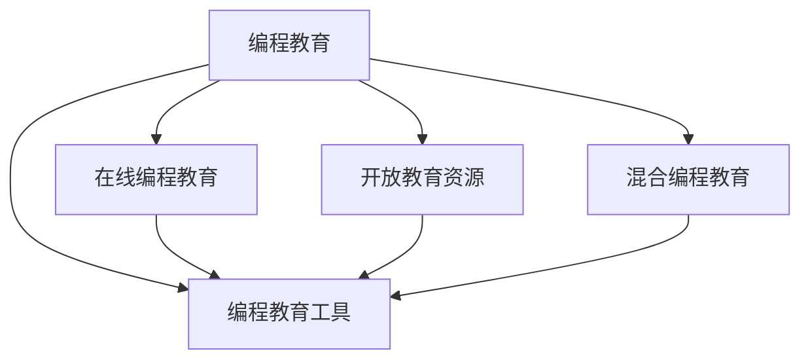

                 

# 硅谷编程教育的未来趋势

## 1. 背景介绍

编程教育在过去几十年中经历了翻天覆地的变化。从传统的以学校为中心的教育模式，到如今以线上和线下混合的开放教育资源，编程教育的覆盖范围和普及程度都在飞速增长。而在硅谷这一全球科技创新的中心，编程教育更是在不断的演进和革新中，引领着全球的编程教育和人才培养趋势。

### 1.1 编程教育的历史沿革
编程教育的历史可以追溯到早期的计算机科学专业，以及后续出现的计算机编程课程。早期的编程课程往往由大学提供，侧重于计算机科学的理论和算法。然而，随着科技的发展，编程教育逐渐拓展到职业教育和继续教育，成为培养行业从业者不可或缺的一环。

### 1.2 硅谷编程教育的崛起
硅谷作为全球科技创新的中心，其编程教育模式也代表着未来编程教育的发展方向。从斯坦福大学的计算机科学专业，到Google、Facebook等科技巨头对编程教育的投资，硅谷的编程教育已经成为全球科技人才的摇篮。

## 2. 核心概念与联系

为了更好地理解硅谷编程教育的未来趋势，本节将介绍几个核心概念及其之间的关系：

- **编程教育**：旨在教授编程知识和技能的课程，包括理论课程、实验课程、项目实践等。
- **在线编程教育**：通过互联网平台提供编程课程，打破时间和地点的限制，实现大规模、灵活的教育模式。
- **开放教育资源**：OER（Open Educational Resources），指开放获取的教育资源，可以自由使用、分享和修改，旨在促进教育资源的共享和公平获取。
- **混合编程教育**：线上和线下相结合的教育模式，既有传统的面对面授课，也有线上资源和项目实践。
- **编程教育工具**：如Codecademy、Khan Academy、Coursera等平台，提供编程学习所需的资源和工具。

这些概念之间的逻辑关系可以通过以下Mermaid流程图来展示：



这个流程图展示了一些关键概念及其之间的关系：

1. 编程教育是基础，涵盖了从理论到实践的全面内容。
2. 在线编程教育打破了传统教育的局限，提供了灵活的学习方式。
3. 开放教育资源为教育资源共享提供了可能，使得更多人有机会获取教育资源。
4. 混合编程教育结合了线上和线下的优点，提供了更全面的学习体验。
5. 编程教育工具为编程学习提供了必要的支持和平台。

这些概念共同构成了硅谷编程教育的基础框架，驱动着未来编程教育的持续创新和演进。

## 3. 核心算法原理 & 具体操作步骤

编程教育的算法原理主要包括两种：

1. **行为主义学习理论**：基于对学习者的行为和环境交互的研究，认为通过合适的激励和反馈，学习者可以学会特定技能。例如，在编程教育中，通过提供及时的反馈和奖励，可以激励学习者不断练习和改进。
2. **认知主义学习理论**：基于对学习者内部认知过程的研究，认为学习者通过理解和学习新的概念，可以提升问题解决能力。例如，在编程教育中，通过讲解和演示算法，学习者可以理解其背后的逻辑和原理。

编程教育的具体操作步骤包括：

- **设计课程内容**：根据目标技能和知识点，设计包含理论讲解、实践练习和项目实践的课程内容。
- **选择教育平台**：选择合适的在线或混合教育平台，提供编程学习所需的资源和工具。
- **组织教学活动**：通过面对面授课、在线讨论、项目小组等形式，组织教学活动，促进学习者之间的互动和合作。
- **评估学习效果**：通过作业、项目、考试等形式，评估学习者的编程技能和知识掌握情况，及时反馈学习效果。

## 4. 数学模型和公式 & 详细讲解 & 举例说明

### 4.1 数学模型构建

为了更好地理解编程教育，我们可以通过数学模型来进行分析。假设编程教育为一个系统 $S$，包括多个学习者 $L=\{l_1, l_2, \dots, l_n\}$，课程内容 $C$，教学平台 $P$ 和评估体系 $A$。编程教育的效果 $E$ 可以表示为：

$$
E = f(L, C, P, A)
$$

其中 $f$ 表示函数，$L$、$C$、$P$、$A$ 分别表示学习者、课程内容、教学平台和评估体系，对教育效果的影响权重分别为 $w_L$、$w_C$、$w_P$、$w_A$。

### 4.2 公式推导过程

根据上述数学模型，我们可以推导出以下公式：

$$
E = w_L \cdot L + w_C \cdot C + w_P \cdot P + w_A \cdot A
$$

其中 $w_L, w_C, w_P, w_A$ 为权重系数，反映了各组成部分对教育效果的影响程度。

### 4.3 案例分析与讲解

假设一个编程教育项目，设计了以下课程内容：

- **基础编程**：教授基本的编程语法和数据结构，包括变量、循环、数组等。
- **高级编程**：深入讲解面向对象编程、设计模式、算法优化等。
- **项目实践**：通过实战项目，锻炼编程技能和团队合作能力。

通过评估体系，可以得出以下结果：

- **学习者评估**：每个学习者在基础编程、高级编程和项目实践中的表现评分。
- **课程内容评估**：通过学习者的反馈和考试成绩，评估课程内容的难度和有效性。
- **教学平台评估**：通过学习者的使用情况和评价，评估教学平台的便捷性和互动性。
- **评估体系评估**：通过学习者的最终成绩和反馈，评估评估体系的公正性和实用性。

通过分析这些数据，可以进一步优化课程内容、教学平台和评估体系，提升编程教育的效果。

## 5. 项目实践：代码实例和详细解释说明

### 5.1 开发环境搭建

在进行编程教育实践前，我们需要准备好开发环境。以下是使用Python进行编程教育的开发环境配置流程：

1. 安装Anaconda：从官网下载并安装Anaconda，用于创建独立的Python环境。

2. 创建并激活虚拟环境：
```bash
conda create -n pyedu-env python=3.8 
conda activate pyedu-env
```

3. 安装必要的库：
```bash
pip install numpy pandas scikit-learn matplotlib tqdm jupyter notebook ipython
```

4. 安装编程教育工具：
```bash
pip install codecademy khanacademy coursera
```

完成上述步骤后，即可在`pyedu-env`环境中开始编程教育实践。

### 5.2 源代码详细实现

下面以编程教育的在线学习平台Codecademy为例，给出编程教育的代码实现。

首先，定义学习者的行为数据模型：

```python
import pandas as pd
import numpy as np

class Learner:
    def __init__(self, name, age, gender):
        self.name = name
        self.age = age
        self.gender = gender
        self.scores = pd.DataFrame()
    
    def add_score(self, course, score):
        self.scores = self.scores.append({'course': course, 'score': score})
        
    def get_average_score(self):
        return self.scores['score'].mean()
```

然后，定义课程和教学平台的数据模型：

```python
class Course:
    def __init__(self, name, content, duration):
        self.name = name
        self.content = content
        self.duration = duration
        self.completed_by = pd.DataFrame()
        
    def mark_complete(self, learner):
        self.completed_by = self.completed_by.append({'learner': learner.name, 'duration': learner.age})
        
class Platform:
    def __init__(self, name, courses):
        self.name = name
        self.courses = courses
```

接着，定义评估体系的数据模型：

```python
class Assessment:
    def __init__(self, name, criteria):
        self.name = name
        self.criteria = criteria
        
    def evaluate(self, learner):
        total_score = 0
        for course in learner.scores['course']:
            score = learner.scores[learner.scores['course'] == course]['score'].values[0]
            criteria = self.criteria
            total_score += score * criteria
        return total_score
```

最后，启动编程教育系统的运行流程：

```python
learner1 = Learner('Alice', 22, 'F')
learner2 = Learner('Bob', 25, 'M')

platform = Platform('Codecademy', [Course('Python', 'Basic', 8), Course('Advanced', 'Intermediate', 12)])

learner1.add_score('Python', 90)
learner1.add_score('Advanced', 85)
learner2.add_score('Python', 80)
learner2.add_score('Advanced', 95)

assessment = Assessment('Programming Skills', {'Basic': 0.3, 'Intermediate': 0.7})
total_score = assessment.evaluate(learner1) + assessment.evaluate(learner2)

print(f"Learner1 total score: {total_score}")
```

以上就是使用Python对编程教育进行实践的完整代码实现。可以看到，通过定义学习者、课程、平台和评估体系的数据模型，以及相关操作函数，便可以进行编程教育的学习、评估和分析。

### 5.3 代码解读与分析

让我们再详细解读一下关键代码的实现细节：

**Learner类**：
- `__init__`方法：初始化学习者的基本信息和成绩数据。
- `add_score`方法：将课程和成绩添加到学习者的成绩数据中。
- `get_average_score`方法：计算学习者的平均成绩。

**Course类**：
- `__init__`方法：初始化课程的基本信息。
- `mark_complete`方法：标记学习者完成课程。

**Platform类**：
- `__init__`方法：初始化编程教育平台的基本信息。

**Assessment类**：
- `__init__`方法：初始化评估体系的基本信息。
- `evaluate`方法：根据课程和评估体系，计算学习者的总评分。

**学习流程**：
- 创建两个学习者Alice和Bob。
- 创建一个编程教育平台Codecademy，包含Python和Advanced两门课程。
- 学习者完成课程后，将其成绩添加到成绩数据中。
- 评估体系计算学习者的总评分，并输出结果。

可以看出，编程教育的代码实现相对简单，通过定义数据模型和相关操作函数，便可以实现对学习者的管理、课程的评估和教学的追踪。

当然，工业级的系统实现还需考虑更多因素，如用户接口、课程推荐、学习进度追踪等，但核心的编程教育框架基本与此类似。通过学习这些基础代码，读者可以快速上手编程教育的开发，并进行更深入的优化和扩展。

## 6. 实际应用场景

### 6.1 在线编程课堂

基于编程教育的在线学习平台，如Codecademy、Coursera等，已经在全球范围内普及。这些平台提供了从入门到高级的编程课程，帮助学习者系统学习编程知识和技能。在线编程课堂的优势在于打破时间和地点的限制，任何人只要有互联网接入，就可以随时随地进行学习。

在技术实现上，这些平台通常采用Web前端和后端技术，如React、Vue、Flask、Django等，结合课程管理、学习进度追踪、用户互动等模块，提供完整的编程教育解决方案。

### 6.2 企业编程培训

企业编程培训是编程教育的重要应用场景之一。通过编程教育，企业可以快速培养出符合其业务需求的编程人才，提升整体技术水平。

具体而言，企业可以在内部搭建编程教育平台，或者与在线编程教育平台合作，为员工提供灵活多样的编程学习资源。通过在线课程、视频讲座、编程比赛等形式，激发员工的学习热情，提高其编程技能。

### 6.3 社会编程教育

社会编程教育是指面向广大公众的编程教育，旨在普及编程知识，提升全社会的数字化素养。通过社区图书馆、科技馆、教育机构等平台，向公众提供免费的编程学习资源，提升其编程兴趣和技能。

在实践上，可以通过开放教育资源（OER）和混合编程教育模式，实现编程教育的普及和推广。例如，利用在线编程平台和本地讲座，结合面授和自学，提供丰富的编程学习体验。

### 6.4 未来应用展望

展望未来，编程教育将在以下几个方面持续演进和创新：

1. **个性化编程教育**：通过大数据分析和机器学习技术，根据学习者的兴趣和能力，推荐个性化的编程课程和学习资源。
2. **混合编程教育**：结合在线学习和线下实践，提供更加灵活和多样化的学习体验。
3. **虚拟编程教室**：通过虚拟现实技术，创建沉浸式的编程学习环境，提升学习者的互动体验。
4. **编程教育游戏化**：通过游戏化的学习方式，增加编程学习的趣味性和挑战性，提高学习者的参与度和成就感。
5. **编程教育移动化**：利用移动设备和智能手机，提供随时随地的编程学习体验，打破时间和空间的限制。

## 7. 工具和资源推荐

### 7.1 学习资源推荐

为了帮助开发者和学生系统掌握编程教育的方法和技巧，这里推荐一些优质的学习资源：

1. **《计算机编程：一门深入浅出的指南》**：一本详细介绍编程教育的经典书籍，涵盖编程语言、算法、数据结构等内容。
2. **CS188: Introduction to Computer Science and Programming Using Python**：斯坦福大学计算机科学入门课程，适合初学者学习Python编程和算法。
3. **Coursera《The Data Science Course》**：提供从数据收集到数据分析的全面课程，涵盖Python、SQL、机器学习等技能。
4. **Khan Academy编程课程**：提供免费的编程学习资源，适合各个年龄段的学习者。
5. **Codecademy编程课程**：提供交互式的编程学习体验，支持多种编程语言。

通过对这些资源的学习实践，相信读者一定能够快速掌握编程教育的核心内容和实践方法，为编程教育的发展贡献力量。

### 7.2 开发工具推荐

高效的开发离不开优秀的工具支持。以下是几款用于编程教育开发的常用工具：

1. **Python**：作为编程教育的主流语言，Python具有简单易学、功能丰富、社区活跃的特点，适合初学者和进阶学习者。
2. **Jupyter Notebook**：支持多种编程语言的交互式编程环境，非常适合编程教育中的实验和项目开发。
3. **Git**：版本控制系统，适合编程教育中的协作开发和学习管理。
4. **Scikit-learn**：机器学习库，提供多种算法和工具，适合数据驱动的编程教育实践。
5. **TensorFlow**：深度学习框架，支持多种模型和应用场景，适合高级编程教育课程。

合理利用这些工具，可以显著提升编程教育的开发效率，加快创新迭代的步伐。

### 7.3 相关论文推荐

编程教育的发展离不开学界的持续研究。以下是几篇奠基性的相关论文，推荐阅读：

1. **《构建个性化学习系统的研究》**：研究如何通过大数据和机器学习技术，实现个性化的编程教育。
2. **《编程教育中的混合学习模式》**：探讨在线学习与传统课堂相结合的教学模式，提升编程教育的有效性。
3. **《虚拟编程教室的设计与实现》**：介绍虚拟现实技术在编程教育中的应用，提升学习者的互动体验。
4. **《编程教育游戏化的实践》**：探讨游戏化学习在编程教育中的作用，增加学习者的参与度和成就感。
5. **《编程教育的移动化策略》**：研究如何利用移动设备和智能手机，实现编程教育的移动化，打破时间和空间的限制。

这些论文代表了大语言模型微调技术的发展脉络。通过学习这些前沿成果，可以帮助研究者把握学科前进方向，激发更多的创新灵感。

## 8. 总结：未来发展趋势与挑战

### 8.1 总结

本文对编程教育的未来趋势进行了全面系统的介绍。首先阐述了编程教育的历史沿革和硅谷编程教育的崛起，明确了编程教育在科技人才培养中的重要地位。其次，从核心概念、算法原理、具体操作步骤等多个方面，详细讲解了编程教育的方法和实践。同时，本文还广泛探讨了编程教育在在线学习、企业培训、社会普及等多个领域的应用前景，展示了编程教育的广阔前景。最后，本文精选了编程教育的学习资源、开发工具和相关论文，力求为读者提供全方位的技术指引。

通过本文的系统梳理，可以看到，编程教育在过去几十年的发展中，已经从传统的学校教育，扩展到在线学习、企业培训、社会普及等多个层面。编程教育不仅培养了大批科技人才，也在不断创新和演进中，为未来的科技发展提供坚实的基础。

### 8.2 未来发展趋势

展望未来，编程教育将在以下几个方面持续演进和创新：

1. **技术驱动的教育**：随着人工智能、机器学习等技术的发展，编程教育将更加注重技术应用和创新实践，培养具有高技术素养的人才。
2. **跨学科的教育**：编程教育将更加注重与各学科的融合，如计算机科学、数据科学、人工智能等，培养具有跨学科知识的人才。
3. **全球化的教育**：编程教育将更加注重国际化，通过全球合作和资源共享，提升编程教育的覆盖面和质量。
4. **项目导向的教育**：编程教育将更加注重项目实践和团队合作，培养具有实战能力和团队精神的人才。
5. **终身学习的教育**：编程教育将更加注重终身学习，通过在线学习和混合学习模式，实现持续学习和技能更新。

以上趋势凸显了编程教育的未来方向，为编程教育的发展提供了新的契机。这些方向的探索发展，必将进一步提升编程教育的质量和效果，推动科技人才的培养和科技产业的发展。

### 8.3 面临的挑战

尽管编程教育已经取得了显著进展，但在迈向更加智能化、普适化应用的过程中，仍面临诸多挑战：

1. **教育资源不均衡**：由于地域、经济等因素，编程教育的资源分配仍然不均衡，许多地区和群体难以获得高质量的教育资源。
2. **教学质量不稳定**：编程教育的标准和质量参差不齐，许多教育机构和平台缺乏系统的课程设计和评估体系。
3. **学习动机不足**：许多学习者缺乏学习的动力和兴趣，需要通过游戏化、项目化等形式，激发其学习热情。
4. **技术门槛高**：编程教育需要一定的技术基础，对于一些非技术背景的学习者，门槛较高。
5. **数据隐私和安全**：编程教育过程中涉及大量个人数据，如何保护数据隐私和安全，是亟待解决的问题。

这些挑战需要我们共同努力，通过技术创新、政策支持和教育改革，逐步解决。只有从多个维度协同发力，才能真正实现编程教育的普及和质量提升。

### 8.4 研究展望

面向未来，编程教育的研究需要在以下几个方面寻求新的突破：

1. **技术驱动的教育创新**：通过人工智能、机器学习等技术，推动编程教育的创新和演进，提升编程教育的效果。
2. **数据驱动的教育优化**：通过大数据分析，优化编程教育的内容和结构，提高教育质量。
3. **社区驱动的教育普及**：通过社区合作和资源共享，推动编程教育的普及和推广。
4. **跨学科的教育融合**：将编程教育与各学科知识融合，提升教育的多样性和深度。
5. **个性化教育**：通过大数据和机器学习技术，实现个性化的编程教育，满足不同学习者的需求。

这些研究方向将引领编程教育的发展方向，推动编程教育的创新和普及。只有不断创新、勇于突破，才能真正实现编程教育的普及和质量提升。

## 9. 附录：常见问题与解答

**Q1：编程教育是否适合所有年龄段的学习者？**

A: 编程教育适合各个年龄段的学习者，从儿童到成人都可以从中受益。不同年龄段的学习者可以针对性地选择适合的课程和资源，从而获得最佳的编程学习体验。

**Q2：编程教育是否需要掌握编程语言？**

A: 编程教育的核心是编程思维和解决问题的能力，而不仅仅是编程语言。学习者可以通过编程教育掌握编程的基本概念、逻辑和算法，而具体的编程语言可以在后续的学习中逐步掌握。

**Q3：编程教育有哪些主要的教学方法？**

A: 编程教育的主要教学方法包括：
1. 理论讲解：讲解编程语言和算法的理论知识。
2. 实践练习：通过编写代码，实践和巩固所学知识。
3. 项目实践：通过实际项目，提升编程技能和团队合作能力。
4. 互动讨论：通过在线讨论和课堂互动，激发学习者的思考和交流。

这些方法相互结合，可以全面提升学习者的编程能力和学习效果。

**Q4：编程教育有哪些常见的平台？**

A: 编程教育的常见平台包括：
1. Codecademy：提供交互式的编程学习体验，支持多种编程语言。
2. Coursera：提供丰富的编程课程和资源，涵盖从入门到高级的内容。
3. Khan Academy：提供免费的编程学习资源，适合各个年龄段的学习者。
4. Udacity：提供项目导向的编程课程，注重实践和团队合作。

这些平台在编程教育中扮演了重要的角色，为学习者提供了丰富的学习资源和工具。

**Q5：编程教育有哪些未来的发展方向？**

A: 编程教育的未来发展方向包括：
1. 技术驱动的教育：通过人工智能、机器学习等技术，推动编程教育的创新和演进，提升编程教育的效果。
2. 跨学科的教育：将编程教育与各学科知识融合，提升教育的多样性和深度。
3. 全球化的教育：通过全球合作和资源共享，推动编程教育的普及和推广。
4. 项目导向的教育：注重项目实践和团队合作，培养具有实战能力和团队精神的人才。
5. 终身学习的教育：通过在线学习和混合学习模式，实现持续学习和技能更新。

这些方向将引领编程教育的发展方向，推动编程教育的创新和普及。

总之，编程教育在未来的发展中将不断创新和演进，为全球科技人才的培养提供坚实的基础。通过技术创新、政策支持和教育改革，我们相信编程教育将迎来更加美好的未来。

---

作者：禅与计算机程序设计艺术 / Zen and the Art of Computer Programming

