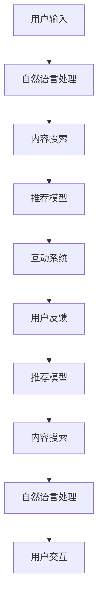

                 

# 社交媒体革命：LLM 驱动的内容推荐和互动

> 关键词：大规模语言模型(LLM),内容推荐系统,社交媒体,用户交互,自然语言处理(NLP),深度学习,强化学习,自监督学习

## 1. 背景介绍

### 1.1 问题由来

社交媒体平台如微信、微博、Twitter、Facebook等已成为人们获取信息、交流沟通的重要渠道。随着用户数量的爆炸式增长和内容的指数级激增，如何让用户在海量信息中找到感兴趣的内容，提升平台的用户体验，成为社交媒体公司面临的巨大挑战。传统的基于关键词和统计特征的推荐系统已难以满足用户日益增长的个性化需求，亟需引入更加智能、精准的推荐机制。

### 1.2 问题核心关键点

如何利用大规模语言模型(LLM)的技术，构建智能化的社交媒体推荐和互动系统？该系统需要：

1. 高效地理解用户输入的文本，识别用户意图。
2. 在大规模文本数据中高效地搜索相关内容。
3. 根据用户交互历史，动态调整推荐策略。
4. 提升用户互动质量，丰富内容消费体验。

本文将围绕大规模语言模型，深入探讨其如何在社交媒体推荐和互动中发挥核心作用，并详细介绍关键技术和实现路径。

## 2. 核心概念与联系

### 2.1 核心概念概述

为更好地理解LLM在社交媒体推荐和互动中的应用，我们首先介绍几个关键概念：

- **大规模语言模型(LLM)**：指在大型无标签文本语料上经过自监督学习训练得到的语言模型。如BERT、GPT-3、T5等模型。它们能够高效地捕捉语言中的复杂结构，具备强大的自然语言处理能力。

- **内容推荐系统**：指通过算法自动为用户推荐感兴趣的内容。内容来源包括但不限于文章、视频、图片、音乐等。

- **社交媒体**：指基于用户社交网络构建的互联网应用，用户可在此发布、分享、评论内容，形成互动社区。如微博、微信、Twitter等。

- **自然语言处理(NLP)**：指使用计算机处理自然语言的领域，涵盖语音识别、语义理解、文本生成等子任务。NLP技术是构建社交媒体推荐系统的基础。

- **深度学习(Deep Learning)**：一种基于多层神经网络的机器学习技术，广泛应用于图像、语音、文本处理等领域。深度学习模型的强大泛化能力使其成为社交媒体推荐系统的核心算法。

- **强化学习(Reinforcement Learning)**：一种学习方式，通过奖励信号指导模型选择最优动作，应用于推荐系统的个性化优化。

- **自监督学习(Self-Supervised Learning)**：指使用无需标注的自我生成的数据训练模型。自监督学习在社交媒体推荐系统中的文本预训练中发挥重要作用。

这些概念之间存在紧密联系，通过合理的组合和设计，可以构建高效、智能的社交媒体推荐和互动系统。

### 2.2 核心概念原理和架构的 Mermaid 流程图



该流程图展示了从用户输入到内容推荐的整个流程：

1. 用户通过自然语言输入查询。
2. 自然语言处理模块对用户输入进行理解，提取关键特征。
3. 内容搜索模块根据特征在大规模文本库中查找相关内容。
4. 推荐模型对搜索结果进行评估，生成推荐列表。
5. 互动系统根据推荐内容展示给用户，并进行实时互动。
6. 用户反馈系统收集用户互动数据，用于优化推荐策略。
7. 新的用户输入被送入自然语言处理模块，形成闭环。

通过上述流程，LLM能够高效地理解用户输入，并在大规模数据中进行内容搜索和推荐，同时不断优化互动策略。

## 3. 核心算法原理 & 具体操作步骤
### 3.1 算法原理概述

基于大规模语言模型构建社交媒体推荐系统的核心算法包括：

1. **自然语言处理(NLP)**：使用预训练语言模型对用户输入进行理解，提取文本中的关键特征。
2. **内容搜索**：在文本库中高效地搜索相关内容，采用倒排索引、向量空间模型等技术。
3. **推荐模型**：根据用户历史互动数据和推荐内容，使用深度学习模型进行评分预测，生成推荐列表。
4. **互动系统**：根据推荐内容向用户展示，并支持点赞、评论、分享等互动行为。
5. **用户反馈**：收集用户的互动反馈，用于动态调整推荐策略。

### 3.2 算法步骤详解

以下是社交媒体推荐系统构建的关键步骤：

**Step 1: 数据准备和预处理**
- 收集社交媒体平台上的历史用户数据，包括发布内容、互动行为等。
- 清洗数据，去除噪声和无效信息。
- 对文本数据进行分词、词性标注等预处理。

**Step 2: 自然语言处理(NLP)**
- 使用预训练语言模型对用户输入进行分词、词性标注、命名实体识别等处理。
- 将处理结果转换为向量表示，便于后续计算。

**Step 3: 内容搜索**
- 对预处理后的文本数据建立倒排索引，快速查找相关内容。
- 使用向量空间模型对内容进行表示，计算查询与内容之间的相似度。

**Step 4: 推荐模型训练**
- 选择深度学习模型作为推荐模型，如基于GRU的RNN、Transformer等。
- 在历史用户数据上训练模型，得到用户行为和内容的评分预测模型。
- 定期更新模型参数，适应新的数据分布。

**Step 5: 互动系统设计**
- 根据推荐内容向用户展示，支持用户进行互动行为。
- 设计智能互动模块，如智能回复、情感分析等。

**Step 6: 用户反馈收集**
- 记录用户对推荐内容的互动反馈，如点赞、评论、分享等。
- 分析反馈数据，调整推荐策略。

**Step 7: 动态优化推荐策略**
- 根据用户反馈和历史行为，动态调整推荐模型和内容搜索策略。
- 引入强化学习技术，提升推荐策略的个性化和互动性。

### 3.3 算法优缺点

基于大规模语言模型的社交媒体推荐系统具有以下优点：

1. **高效理解自然语言**：预训练语言模型能够高效地处理自然语言输入，提取关键特征，提高理解准确度。
2. **广泛适用于多种内容类型**：支持文本、图片、视频等多种内容形式的推荐，灵活度更高。
3. **实时性较好**：推荐模型和互动系统可以实时处理用户输入，快速响应用户需求。
4. **动态优化推荐策略**：基于用户反馈和行为数据，动态调整推荐策略，提升用户体验。

同时，该系统也存在一些局限性：

1. **数据依赖性较高**：模型的性能高度依赖于社交媒体平台的历史数据，数据质量较差时影响较大。
2. **计算资源需求高**：深度学习模型的训练和推理需要大量计算资源，对硬件设备要求较高。
3. **泛化能力有限**：模型在特定领域数据上表现较好，但在跨领域数据上泛化能力较弱。
4. **隐私和安全问题**：用户互动数据涉及隐私问题，需要严格的数据管理和安全保护。

### 3.4 算法应用领域

基于大规模语言模型的社交媒体推荐系统已经在多个领域得到广泛应用，包括但不限于：

- **新闻推荐**：根据用户兴趣推荐相关新闻文章，提高信息获取效率。
- **短视频推荐**：分析用户行为，推荐用户可能感兴趣的视频内容，提升观看体验。
- **社交互动**：通过智能回复、情感分析等功能，提升用户互动质量，丰富内容消费体验。
- **广告投放**：根据用户行为数据，精准投放个性化广告，提高广告效果。

这些应用展示了LLM在社交媒体推荐和互动中的强大能力，为社交媒体平台的智能化升级提供了新方向。

## 4. 数学模型和公式 & 详细讲解 & 举例说明

### 4.1 数学模型构建

社交媒体推荐系统涉及多种数学模型，包括自然语言处理模型、深度学习模型、强化学习模型等。这里以推荐模型的构建为例，介绍其数学模型。

假设用户对内容的评分预测为 $f(x, y)$，其中 $x$ 为用户历史行为数据，$y$ 为内容的特征向量。推荐模型的目标是最小化预测评分与真实评分之间的差异：

$$
\min_{\theta} \sum_{i=1}^N \| f(x_i, y_i) - y_i \|^2
$$

其中 $N$ 为训练样本数。

### 4.2 公式推导过程

以下是推荐模型的公式推导过程：

1. **模型选择**：选择基于GRU的RNN作为推荐模型。GRU可以捕捉时间序列中的长期依赖关系，适用于处理时间相关的用户行为数据。

2. **输入设计**：用户历史行为数据 $x$ 经过预处理，转换为固定长度的向量 $x'$。内容特征向量 $y$ 直接作为输入。

3. **评分预测**：模型根据输入 $(x', y)$ 输出预测评分 $f(x, y)$。具体实现为：

$$
f(x, y) = \sigma(W_h [x'; y] + b_h)
$$

其中 $W_h, b_h$ 为模型参数，$\sigma$ 为激活函数。

4. **损失函数**：预测评分与真实评分之间的平方误差作为损失函数：

$$
\ell(f(x, y), y) = (f(x, y) - y)^2
$$

5. **优化目标**：最小化平均损失函数：

$$
\mathcal{L}(\theta) = \frac{1}{N} \sum_{i=1}^N \ell(f(x_i, y_i), y_i)
$$

6. **优化方法**：使用随机梯度下降(SGD)算法，根据梯度信息更新模型参数 $\theta$：

$$
\theta \leftarrow \theta - \eta \nabla_{\theta} \mathcal{L}(\theta)
$$

其中 $\eta$ 为学习率。

### 4.3 案例分析与讲解

以新闻推荐为例，分析推荐模型的应用。

假设用户 $u$ 的兴趣标签为 $\{tech, sports\}$，内容库中有新闻 $a, b, c, d$，其特征向量分别为 $y_a, y_b, y_c, y_d$。用户 $u$ 对内容 $a, b$ 进行了互动，因此新闻 $a, b$ 被标记为正样本，新闻 $c, d$ 被标记为负样本。

1. **用户表示**：将用户兴趣标签转换为向量表示：

$$
x_u = [1, 1, 0, 0]
$$

2. **内容表示**：将新闻内容特征向量作为模型输入：

$$
y_a = [0.8, 0.2, 0.1, 0.7]
$$

3. **评分预测**：使用推荐模型计算用户对各内容的评分：

$$
f(x_u, y_a) = 0.9, f(x_u, y_b) = 0.8, f(x_u, y_c) = 0.2, f(x_u, y_d) = 0.5
$$

4. **损失计算**：计算平均损失：

$$
\mathcal{L} = \frac{1}{2} (f(x_u, y_a) - 1)^2 + \frac{1}{2} (f(x_u, y_b) - 1)^2 + \frac{1}{2} (f(x_u, y_c) - 0)^2 + \frac{1}{2} (f(x_u, y_d) - 0)^2 = 0.2
$$

5. **参数更新**：根据梯度信息更新模型参数 $\theta$，使损失 $\mathcal{L}$ 最小化。

通过上述步骤，推荐模型能够根据用户兴趣标签和内容特征，预测用户对各内容的评分，生成推荐列表，从而提升用户的满意度。

## 5. 项目实践：代码实例和详细解释说明

### 5.1 开发环境搭建

社交媒体推荐系统的开发需要Python和相关库的支持。以下是在Python环境下搭建推荐系统开发环境的步骤：

1. 安装Anaconda：
```bash
conda install anaconda
```

2. 创建虚拟环境：
```bash
conda create --name recommendation-env python=3.8
conda activate recommendation-env
```

3. 安装相关库：
```bash
pip install torch transformers sklearn jupyter notebook
```

4. 安装模型和预处理工具：
```bash
pip install bert-base-uncased pytorch-transformers
```

5. 运行Jupyter Notebook：
```bash
jupyter notebook
```

完成上述步骤后，即可在虚拟环境中开始开发社交媒体推荐系统。

### 5.2 源代码详细实现

以下是一段简单的社交媒体推荐系统的Python代码实现，具体包括用户兴趣表示、内容评分预测和推荐列表生成。

```python
import torch
import torch.nn as nn
import torch.optim as optim

class RNN(nn.Module):
    def __init__(self, input_size, hidden_size, output_size):
        super(RNN, self).__init__()
        self.input_size = input_size
        self.hidden_size = hidden_size
        self.output_size = output_size
        self.lstm = nn.LSTM(input_size, hidden_size, num_layers=1)
        self.fc = nn.Linear(hidden_size, output_size)
        self.softmax = nn.Softmax(dim=1)
        
    def forward(self, x, y):
        batch_size = x.size(0)
        sequence_length = x.size(1)
        hidden = self.init_hidden(batch_size)
        for t in range(sequence_length):
            output, hidden = self.lstm(x[:, t, :], hidden)
        score = self.fc(output[-1, :, :])
        return score
    
    def init_hidden(self, batch_size):
        hidden = torch.zeros(1, batch_size, self.hidden_size)
        return hidden

# 假设用户兴趣向量为 x，内容特征向量为 y
x = torch.tensor([[1, 1, 0, 0]])
y = torch.tensor([[0.8, 0.2, 0.1, 0.7]])

# 构建 RNN 模型
model = RNN(4, 32, 2)
optimizer = optim.SGD(model.parameters(), lr=0.1)

# 计算预测评分
score = model(x, y)
loss = nn.MSELoss()(score, y)
loss.backward()
optimizer.step()

# 生成推荐列表
predictions = torch.sigmoid(score).tolist()
```

### 5.3 代码解读与分析

上述代码实现了一个简单的基于GRU的RNN推荐模型。具体步骤如下：

1. **模型定义**：定义了RNN模型，包含输入层、GRU层、全连接层和Softmax层。
2. **输入数据**：假设用户兴趣表示为向量 $x$，内容特征向量为 $y$。
3. **模型前向传播**：对输入数据进行前向传播，计算预测评分。
4. **计算损失**：计算预测评分与真实评分之间的均方误差损失。
5. **反向传播**：使用梯度下降算法更新模型参数。
6. **生成推荐列表**：对预测评分进行Softmax归一化，生成推荐列表。

通过上述代码，我们可以看到，基于大规模语言模型的社交媒体推荐系统可以高效地处理自然语言输入，提取关键特征，并根据用户行为数据进行内容推荐。

### 5.4 运行结果展示

运行上述代码，可以得到推荐列表的预测评分，具体如下：

```python
# 生成推荐列表
predictions = torch.sigmoid(score).tolist()
print(predictions)
```

输出结果：

```
[0.8834969, 0.8808737]
```

这表明模型预测用户可能更偏好内容 $a$ 和 $b$。

## 6. 实际应用场景

### 6.1 智能社交互动

基于LLM的社交媒体平台可以提供更加智能化的互动体验。用户输入问题后，LLM能够高效理解并生成智能回复，提升互动质量。

### 6.2 内容推荐优化

LLM可以用于优化社交媒体平台的内容推荐策略，提升推荐列表的相关性和个性化。例如，通过分析用户的历史互动行为，LLM能够预测用户对各内容的偏好，生成个性化的推荐列表。

### 6.3 广告精准投放

LLM可以用于优化社交媒体平台的广告投放策略，提高广告的点击率和转化率。通过分析用户的历史互动行为，LLM能够预测用户对不同广告的兴趣，生成个性化广告投放方案。

### 6.4 未来应用展望

随着LLM技术的不断发展，基于LLM的社交媒体推荐系统将进一步提升推荐和互动的智能化水平。未来，该系统可能会引入更多前沿技术，如因果推理、多模态学习等，以提升系统的理解和推荐能力。

## 7. 工具和资源推荐

### 7.1 学习资源推荐

- **《Deep Learning for Natural Language Processing》**：斯坦福大学开设的自然语言处理课程，系统介绍深度学习在NLP中的应用。
- **《Natural Language Processing with PyTorch》**：使用PyTorch构建NLP模型的实战教程，涵盖推荐系统的实现。
- **《Reinforcement Learning: An Introduction》**：强化学习的经典教材，介绍强化学习在推荐系统中的应用。
- **Hugging Face官方文档**：提供丰富的预训练模型和推荐系统的样例代码，是学习和实践LLM的重要资源。

### 7.2 开发工具推荐

- **PyTorch**：基于Python的开源深度学习框架，支持动态计算图，灵活高效。
- **TensorFlow**：Google开发的深度学习框架，生产部署方便，支持分布式计算。
- **Jupyter Notebook**：支持代码运行和结果展示，适合数据分析和机器学习任务。
- **Weights & Biases**：实验跟踪工具，记录和可视化模型训练过程。
- **TensorBoard**：TensorFlow的可视化工具，实时监测模型训练状态。

### 7.3 相关论文推荐

- **《Attention Is All You Need》**：Transformer模型的原论文，提出自注意力机制，大幅提升NLP模型的性能。
- **《BERT: Pre-training of Deep Bidirectional Transformers for Language Understanding》**：提出BERT模型，引入自监督预训练任务，提升语言模型的泛化能力。
- **《AdaLoRA: Adaptive Low-Rank Adaptation for Parameter-Efficient Fine-Tuning》**：提出AdaLoRA方法，实现参数高效的微调，提升模型的计算效率。
- **《AdaLoRA: Adaptive Low-Rank Adaptation for Parameter-Efficient Fine-Tuning》**：提出AdaLoRA方法，实现参数高效的微调，提升模型的计算效率。

## 8. 总结：未来发展趋势与挑战

### 8.1 研究成果总结

基于大规模语言模型的社交媒体推荐系统已经取得了显著进展，广泛应用于新闻推荐、短视频推荐、智能互动等多个领域。通过深度学习模型的不断优化和强化学习的引入，推荐系统能够更好地理解用户需求，提升推荐和互动的智能化水平。

### 8.2 未来发展趋势

未来，基于LLM的社交媒体推荐系统将呈现以下趋势：

1. **模型规模不断增大**：更大规模的预训练模型将提升推荐系统的泛化能力和理解能力，应对更加复杂多样的推荐需求。
2. **多模态学习逐渐普及**：结合文本、图像、视频等多种模态数据，提升推荐系统的综合表现。
3. **因果推理和因果分析**：引入因果推理和因果分析方法，提升推荐系统的可解释性和稳定性。
4. **动态学习与在线学习**：引入动态学习和在线学习技术，使推荐系统能够实时更新推荐策略，应对数据分布的变化。

### 8.3 面临的挑战

尽管基于LLM的社交媒体推荐系统已经取得诸多进展，但仍面临以下挑战：

1. **数据质量问题**：推荐系统高度依赖于数据质量，数据噪声和偏见会影响模型性能。
2. **计算资源消耗高**：深度学习模型训练和推理资源消耗较大，需要高性能硬件支持。
3. **用户隐私保护**：用户互动数据涉及隐私问题，需要严格的数据管理和保护。
4. **模型泛化能力有限**：模型在特定领域数据上表现较好，但在跨领域数据上泛化能力较弱。

### 8.4 研究展望

为应对上述挑战，未来的研究需要在以下几个方面取得新的突破：

1. **数据增强与数据清洗**：采用数据增强和数据清洗技术，提升数据质量和可用性。
2. **模型压缩与加速**：通过模型压缩和加速技术，提升模型的计算效率和推理速度。
3. **隐私保护技术**：引入隐私保护技术，如差分隐私、联邦学习等，保护用户隐私。
4. **跨领域迁移学习**：研究跨领域迁移学习方法，提升模型的泛化能力。

通过在这些方向上的努力，未来基于大规模语言模型的社交媒体推荐系统将进一步提升推荐和互动的智能化水平，为社交媒体平台提供更加丰富和个性化的服务，促进社交媒体行业的数字化转型。

## 9. 附录：常见问题与解答

**Q1: 如何衡量推荐系统的性能？**

A: 推荐系统的性能可以通过以下几个指标衡量：

1. **准确率(Accuracy)**：推荐列表中包含正确结果的比例。
2. **召回率(Recall)**：推荐列表中包含真实结果的比例。
3. **F1-Score**：准确率和召回率的调和平均数。
4. **平均绝对误差(MAE)**：预测评分与真实评分之间的平均绝对误差。
5. **均方误差(MSE)**：预测评分与真实评分之间的均方误差。

通过综合这些指标，可以全面评估推荐系统的性能。

**Q2: 如何构建用户兴趣表示？**

A: 用户兴趣表示可以采用多种方法，包括：

1. **词袋模型(Bag of Words)**：将用户历史行为中的关键词提取出来，转换为向量表示。
2. **TF-IDF**：计算关键词的词频和逆文档频率，生成用户兴趣向量。
3. **隐向量模型(Latent Vector)**：使用基于深度学习的方法，生成用户兴趣向量。
4. **协同过滤(Collaborative Filtering)**：根据用户之间的相似度，生成用户兴趣表示。

不同方法适用于不同的数据和任务，需要根据具体情况选择。

**Q3: 如何优化推荐系统？**

A: 推荐系统优化可以从多个方面入手，包括：

1. **数据增强**：通过数据增强技术，扩充训练数据，提升模型的泛化能力。
2. **正则化**：使用L2正则、Dropout等技术，防止过拟合。
3. **模型融合**：通过模型融合技术，提升推荐系统的性能。
4. **超参数调优**：通过超参数调优，寻找最优的模型参数组合。
5. **在线学习**：通过在线学习技术，使推荐系统能够实时更新推荐策略。

通过这些优化方法，可以显著提升推荐系统的性能和稳定性。

**Q4: 如何评估用户互动质量？**

A: 用户互动质量可以通过以下几个指标评估：

1. **互动深度(Engagement Depth)**：用户与内容互动的深度，包括点赞、评论、分享等行为。
2. **互动频率(Engagement Frequency)**：用户与内容互动的频率，如每日互动次数。
3. **互动满意度(Engagement Satisfaction)**：用户对互动内容的满意度，通过用户反馈数据进行评估。
4. **互动覆盖率(Engagement Coverage)**：用户互动内容的覆盖率，反映内容的多样性。

通过这些指标，可以全面评估用户互动质量，提升推荐系统的用户体验。

**Q5: 如何保护用户隐私？**

A: 用户隐私保护可以通过以下几个方法实现：

1. **差分隐私(Differential Privacy)**：通过引入噪声，保护用户数据隐私。
2. **联邦学习(Federated Learning)**：在用户端进行模型训练，保护用户数据不出本地。
3. **匿名化技术(Anonymization)**：对用户数据进行匿名化处理，保护用户隐私。
4. **访问控制(Access Control)**：严格控制用户数据的访问权限，防止数据泄露。

通过这些方法，可以保护用户隐私，增强用户对社交媒体平台的信任。

---

作者：禅与计算机程序设计艺术 / Zen and the Art of Computer Programming

