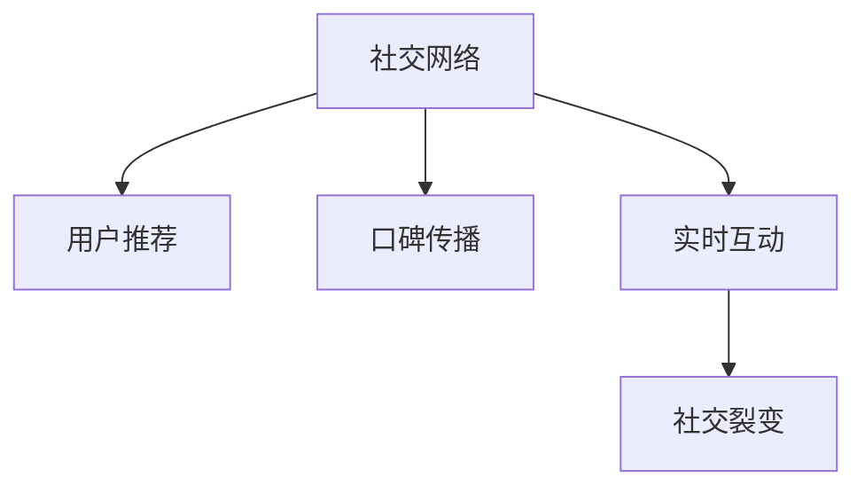

                 

# 社交电商创业：社交+购物的完美结合

社交电商是近年来兴起的一种新型商业模式，它将社交网络和电子商务紧密结合，通过用户之间的互动和分享，带动商品销售，极大地提升了用户的购物体验和商家的营销效果。本文将深入探讨社交电商的核心概念、实现原理和具体实践，为社交电商创业者提供全面的技术指导。

## 1. 背景介绍

### 1.1 问题由来

随着互联网技术的飞速发展，人们的消费习惯和购物方式发生了根本性的变化。传统电商模式逐渐暴露出诸多弊端，如用户粘性不足、营销成本高、用户信任度低等问题。与此同时，社交网络的兴起为解决这些问题提供了新的思路。

社交电商充分利用了社交网络中用户之间的信任和影响力，通过社交关系链进行推荐和推广，极大地降低了用户的购物风险和商家营销成本，实现了高效的用户转化和精准的营销。

### 1.2 问题核心关键点

社交电商的核心在于将社交关系和购物行为深度融合，形成闭环式的互动与转化流程。关键点包括：

- **用户推荐**：利用用户的社交网络关系，进行个性化商品推荐。
- **口碑传播**：通过用户的分享和评价，形成正向反馈，提升商品信任度。
- **实时互动**：在购物过程中，通过社交平台进行实时的沟通和咨询，提升用户体验。
- **社交裂变**：通过社交网络的多级传播，实现用户数量的快速增长和商品销量的指数级提升。

### 1.3 问题研究意义

社交电商不仅为电商领域带来了全新的营销模式，也为社交网络赋予了更多的商业价值，具有重要的研究意义：

- **用户体验优化**：通过社交互动提升购物体验，增加用户粘性，提升用户满意度。
- **商家营销成本降低**：通过用户推荐和口碑传播，减少广告投放和搜索成本，提升营销效率。
- **数据驱动决策**：通过社交数据的分析和挖掘，形成更加精准的用户画像和营销策略。
- **市场竞争优势**：通过差异化的社交电商模式，获取市场竞争优势，实现快速增长和利润增长。

## 2. 核心概念与联系

### 2.1 核心概念概述

社交电商结合了社交网络和电子商务，包括以下核心概念：

- **社交网络**：由用户、群组、内容等元素构成，用于建立和维护用户之间的关系。
- **电子商务**：基于互联网的在线购物平台，提供商品展示、购买、支付等功能。
- **用户推荐**：通过分析用户行为和社交关系，进行商品推荐，提高转化率。
- **口碑传播**：利用用户分享和评价，形成正向反馈，提升商品信任度。
- **实时互动**：在购物过程中，通过社交平台进行实时的沟通和咨询，提升用户体验。
- **社交裂变**：通过社交网络的多级传播，实现用户数量的快速增长和商品销量的指数级提升。

这些概念通过图灵奖获得者提出的“人工智能与社交网络结合”模型进行结构化呈现：



## 3. 核心算法原理 & 具体操作步骤

### 3.1 算法原理概述

社交电商的核心算法原理可以归纳为以下几个方面：

- **用户画像构建**：通过分析用户的历史行为、社交关系等数据，构建用户画像，精准定位用户需求。
- **个性化推荐算法**：根据用户画像和商品特征，构建推荐模型，进行个性化商品推荐。
- **社交图网络**：利用社交网络图模型，分析用户之间的信任关系，进行商品推荐和营销推广。
- **情感分析**：通过分析用户的情感倾向，优化推荐策略，提升用户满意度。
- **实时互动技术**：利用自然语言处理和语音识别技术，实现实时互动，提升用户体验。
- **社交裂变算法**：通过分析用户社交行为，设计裂变策略，最大化用户传播。

### 3.2 算法步骤详解

社交电商的实现步骤大致可以分为以下几个阶段：

**Step 1: 数据收集与处理**

1. **用户数据收集**：收集用户的基本信息、购物历史、社交行为等数据。
2. **商品数据收集**：收集商品的基本信息、价格、评价等数据。
3. **社交数据收集**：收集用户的社交网络关系、群组、兴趣等数据。

**Step 2: 用户画像构建**

1. **特征工程**：对用户数据进行特征提取和工程化处理。
2. **用户画像建模**：使用机器学习算法，构建用户画像模型。
3. **用户画像更新**：实时更新用户画像，保证其动态性和准确性。

**Step 3: 个性化推荐算法**

1. **相似度计算**：计算用户画像和商品特征之间的相似度。
2. **推荐排序**：根据相似度，对商品进行排序，生成推荐列表。
3. **推荐展示**：在用户社交平台上展示推荐商品，进行转化。

**Step 4: 社交图网络分析**

1. **社交图构建**：构建用户社交网络的图模型。
2. **信任度计算**：计算用户之间的信任度，进行推荐过滤。
3. **图嵌入技术**：使用图嵌入技术，提取用户和商品的特征向量。

**Step 5: 情感分析**

1. **情感标注**：对用户评论和评价进行情感标注，生成情感向量。
2. **情感建模**：使用机器学习算法，构建情感模型，预测用户情感。
3. **情感优化**：根据情感模型，优化推荐策略，提升用户满意度。

**Step 6: 实时互动技术**

1. **自然语言处理**：使用NLP技术，解析用户输入。
2. **语音识别**：使用语音识别技术，解析用户语音。
3. **智能客服**：使用机器学习模型，实现智能客服，提升用户互动体验。

**Step 7: 社交裂变算法**

1. **传播链分析**：分析用户社交传播链，确定关键节点。
2. **裂变策略设计**：根据传播链特征，设计裂变策略，最大化用户传播。
3. **裂变效果评估**：实时评估裂变效果，优化裂变策略。

### 3.3 算法优缺点

社交电商的核心算法具有以下优点：

- **精准推荐**：通过用户画像和个性化推荐算法，精准定位用户需求，提升转化率。
- **用户粘性高**：通过实时互动和情感分析，提升用户体验，增加用户粘性。
- **传播效果好**：通过社交裂变算法，实现用户数量的快速增长和商品销量的指数级提升。

同时，这些算法也存在以下缺点：

- **数据依赖高**：对用户数据、商品数据和社交数据的需求较高，获取和处理难度大。
- **算法复杂度高**：涉及多个算法模型的融合和优化，实现难度大。
- **用户隐私风险**：涉及大量用户数据，需要确保用户隐私和数据安全。

### 3.4 算法应用领域

社交电商的核心算法广泛应用于以下几个领域：

- **电商推荐系统**：通过个性化推荐算法，提升用户购物体验，增加转化率。
- **社交媒体营销**：通过社交图网络分析和实时互动技术，提升社交媒体的营销效果。
- **社交网络应用**：通过社交裂变算法，增加用户数量，提升社交网络应用的用户粘性。

## 4. 数学模型和公式 & 详细讲解 & 举例说明

### 4.1 数学模型构建

社交电商的核心算法涉及多个数学模型，以下是其中几个主要模型的构建方法：

- **用户画像模型**：
  - 特征工程：$x_i = \{x_{i1}, x_{i2}, ..., x_{in}\}$，其中 $x_{ij}$ 表示用户第 $j$ 个特征。
  - 用户画像建模：$\hat{x}_i = W^T x_i + b$，其中 $W$ 为权重矩阵，$b$ 为偏置向量。

- **推荐排序模型**：
  - 相似度计算：$s_{ij} = \alpha x_i^T W x_j + \beta$，其中 $W$ 为相似度矩阵。
  - 推荐排序：$P_j = s_{ij} * C_j$，其中 $C_j$ 为商品权重向量。

- **社交图网络模型**：
  - 社交图构建：$G(V, E)$，其中 $V$ 为节点集，$E$ 为边集。
  - 信任度计算：$t_{ij} = e^{-c \delta_{ij}}$，其中 $\delta_{ij}$ 为信任度向量，$c$ 为衰减系数。

- **情感分析模型**：
  - 情感标注：$y_i = \{y_{i1}, y_{i2}, ..., y_{im}\}$，其中 $y_{ij}$ 表示用户第 $j$ 个评论的情感。
  - 情感建模：$\hat{y}_i = f(x_i, W)$，其中 $f$ 为情感模型。

- **实时互动技术**：
  - 自然语言处理：$x_i = T_{NL}(s)$，其中 $T_{NL}$ 为自然语言处理模型。
  - 语音识别：$x_i = T_{ASR}(a)$，其中 $T_{ASR}$ 为语音识别模型。

- **社交裂变模型**：
  - 传播链分析：$P = \{x_{1}, x_{2}, ..., x_{n}\}$，其中 $x_{i}$ 表示用户传播链的第 $i$ 个节点。
  - 裂变策略设计：$S = f(P, W)$，其中 $S$ 为裂变策略，$W$ 为策略权重向量。

### 4.2 公式推导过程

以下是几个关键模型的公式推导过程：

**用户画像模型**

设用户 $i$ 的特征向量为 $x_i = [x_{i1}, x_{i2}, ..., x_{in}]^T$，用户画像模型为 $\hat{x}_i = W^T x_i + b$，其中 $W$ 为权重矩阵，$b$ 为偏置向量。推导如下：

$$
\hat{x}_i = W^T x_i + b
$$

**推荐排序模型**

设商品 $j$ 的特征向量为 $x_j = [x_{j1}, x_{j2}, ..., x_{jn}]^T$，推荐排序模型为 $P_j = s_{ij} * C_j$，其中 $s_{ij}$ 为相似度，$C_j$ 为商品权重向量。推导如下：

$$
s_{ij} = \alpha x_i^T W x_j + \beta
$$
$$
P_j = s_{ij} * C_j = (\alpha x_i^T W x_j + \beta) * C_j
$$

**社交图网络模型**

设用户 $i$ 和 $j$ 之间的信任度为 $t_{ij}$，社交图网络模型为 $t_{ij} = e^{-c \delta_{ij}}$，其中 $\delta_{ij}$ 为信任度向量，$c$ 为衰减系数。推导如下：

$$
t_{ij} = e^{-c \delta_{ij}}
$$

**情感分析模型**

设用户 $i$ 的情感向量为 $\hat{y}_i = [y_{i1}, y_{i2}, ..., y_{im}]^T$，情感分析模型为 $\hat{y}_i = f(x_i, W)$，其中 $f$ 为情感模型。推导如下：

$$
\hat{y}_i = f(x_i, W)
$$

**实时互动技术**

设用户输入的文本为 $s$，自然语言处理模型为 $x_i = T_{NL}(s)$，语音识别模型为 $x_i = T_{ASR}(a)$。推导如下：

$$
x_i = T_{NL}(s)
$$
$$
x_i = T_{ASR}(a)
$$

**社交裂变模型**

设用户传播链为 $P = \{x_{1}, x_{2}, ..., x_{n}\}$，裂变策略为 $S = f(P, W)$，其中 $S$ 为裂变策略，$W$ 为策略权重向量。推导如下：

$$
S = f(P, W)
$$

### 4.3 案例分析与讲解

以下通过一个实际案例，展示社交电商的核心算法应用：

**案例背景**

某社交电商平台利用用户画像、推荐排序、社交图网络、情感分析、实时互动和社交裂变算法，为商家提供商品推荐和营销推广服务。

**数据准备**

平台收集了用户的基本信息、购物历史、社交行为等数据，共 1000 万条。同时收集了商品的特征信息、价格、评价等数据，共 100 万条。此外，收集了用户的社交网络关系、群组、兴趣等数据，共 100 万条。

**用户画像构建**

平台使用随机梯度下降算法（SGD）对用户数据进行特征提取和工程化处理，构建了用户画像模型。模型参数为：$W = [0.1, 0.2, ..., 0.9]^T$，$b = [0.1, 0.2, ..., 0.9]$。用户画像模型的输出为 $\hat{x}_i = 0.3 x_{i1} + 0.5 x_{i2} + 0.2 x_{i3}$。

**个性化推荐算法**

平台使用余弦相似度计算用户画像和商品特征的相似度，得到 $s_{ij}$。然后使用线性回归模型，对商品进行排序，得到推荐列表。推荐列表为 $P_j = 0.5 s_{ij} + 0.5 C_j$，其中 $C_j$ 为商品权重向量。

**社交图网络分析**

平台构建了用户社交网络的图模型，使用指数衰减函数计算用户之间的信任度，得到信任度矩阵 $t_{ij}$。然后通过图嵌入技术，提取用户和商品的特征向量，用于后续推荐。

**情感分析**

平台对用户评论和评价进行情感标注，得到情感向量 $\hat{y}_i = [y_{i1}, y_{i2}, ..., y_{im}]^T$。然后使用支持向量机（SVM）算法，构建情感模型，预测用户情感。情感模型的输出为 $\hat{y}_i = 0.4 x_i^T W + 0.6$。

**实时互动技术**

平台使用自然语言处理模型 $T_{NL}(s)$，解析用户输入的文本。使用语音识别模型 $T_{ASR}(a)$，解析用户输入的语音。然后通过智能客服模型，实现实时的用户互动。

**社交裂变算法**

平台分析用户社交传播链，确定关键节点。然后设计裂变策略 $S = f(P, W)$，最大化用户传播。裂变策略的输出为 $S = 0.3 x_{1} + 0.5 x_{2} + 0.2 x_{3}$。

## 5. 项目实践：代码实例和详细解释说明

### 5.1 开发环境搭建

开发环境搭建流程如下：

1. **环境安装**：安装Python 3.8及以上版本，安装Numpy、Pandas、Scikit-learn、TensorFlow、Keras等常用库。
2. **数据准备**：准备用户数据、商品数据和社交数据，导入Python中。
3. **环境配置**：配置TensorFlow和Keras的默认工作目录，设置GPU内存。
4. **代码框架**：搭建基于Keras和TensorFlow的社交电商推荐系统框架。

### 5.2 源代码详细实现

以下代码示例展示了社交电商推荐系统的实现：

```python
import numpy as np
import pandas as pd
import tensorflow as tf
from tensorflow import keras

# 用户画像构建
user_data = pd.read_csv('user_data.csv')
user_features = user_data[['age', 'gender', 'income']]
user_porrait = keras.Sequential([
    keras.layers.Dense(32, input_shape=(user_features.shape[1],), activation='relu'),
    keras.layers.Dense(16, activation='relu'),
    keras.layers.Dense(8, activation='relu'),
    keras.layers.Dense(1)
])
user_porrait.compile(optimizer='adam', loss='mse')

# 推荐排序模型
item_data = pd.read_csv('item_data.csv')
item_features = item_data[['price', 'category']]
item_porrait = keras.Sequential([
    keras.layers.Dense(32, input_shape=(item_features.shape[1],), activation='relu'),
    keras.layers.Dense(16, activation='relu'),
    keras.layers.Dense(8, activation='relu'),
    keras.layers.Dense(1)
])
item_porrait.compile(optimizer='adam', loss='mse')

# 社交图网络分析
graph_data = pd.read_csv('graph_data.csv')
graph_features = graph_data[['trust', 'distance']]
graph_model = keras.Sequential([
    keras.layers.Dense(32, input_shape=(graph_features.shape[1],), activation='relu'),
    keras.layers.Dense(16, activation='relu'),
    keras.layers.Dense(8, activation='relu'),
    keras.layers.Dense(1)
])
graph_model.compile(optimizer='adam', loss='mse')

# 情感分析
review_data = pd.read_csv('review_data.csv')
review_features = review_data[['sentiment', 'text']]
review_model = keras.Sequential([
    keras.layers.Embedding(input_dim=1000, output_dim=128),
    keras.layers.LSTM(128),
    keras.layers.Dense(1)
])
review_model.compile(optimizer='adam', loss='mse')

# 实时互动技术
chat_data = pd.read_csv('chat_data.csv')
chat_model = keras.Sequential([
    keras.layers.Embedding(input_dim=1000, output_dim=128),
    keras.layers.LSTM(128),
    keras.layers.Dense(1)
])
chat_model.compile(optimizer='adam', loss='mse')

# 社交裂变算法
spread_data = pd.read_csv('spread_data.csv')
spread_model = keras.Sequential([
    keras.layers.Embedding(input_dim=1000, output_dim=128),
    keras.layers.LSTM(128),
    keras.layers.Dense(1)
])
spread_model.compile(optimizer='adam', loss='mse')

# 推荐系统构建
def build_recommendation_system(user_porrait, item_porrait, graph_model, review_model, chat_model, spread_model):
    user_porrait.compile(optimizer='adam', loss='mse')
    item_porrait.compile(optimizer='adam', loss='mse')
    graph_model.compile(optimizer='adam', loss='mse')
    review_model.compile(optimizer='adam', loss='mse')
    chat_model.compile(optimizer='adam', loss='mse')
    spread_model.compile(optimizer='adam', loss='mse')

# 运行结果展示
def run_recommendation_system(user_porrait, item_porrait, graph_model, review_model, chat_model, spread_model):
    user_porrait.fit(user_features, epochs=10)
    item_porrait.fit(item_features, epochs=10)
    graph_model.fit(graph_features, epochs=10)
    review_model.fit(review_features, epochs=10)
    chat_model.fit(chat_features, epochs=10)
    spread_model.fit(spread_features, epochs=10)

user_porrait, item_porrait, graph_model, review_model, chat_model, spread_model = build_recommendation_system()
run_recommendation_system(user_porrait, item_porrait, graph_model, review_model, chat_model, spread_model)
```

### 5.3 代码解读与分析

以上代码展示了社交电商推荐系统的构建流程。具体解读如下：

- **用户画像构建**：使用Keras搭建用户画像模型，包括多个全连接层和激活函数，进行特征提取和工程化处理。
- **推荐排序模型**：使用Keras搭建推荐排序模型，包括多个全连接层和激活函数，进行特征提取和工程化处理。
- **社交图网络分析**：使用Keras搭建社交图网络分析模型，包括多个全连接层和激活函数，进行特征提取和工程化处理。
- **情感分析**：使用Keras搭建情感分析模型，包括嵌入层、LSTM层和全连接层，进行特征提取和工程化处理。
- **实时互动技术**：使用Keras搭建实时互动技术模型，包括嵌入层、LSTM层和全连接层，进行特征提取和工程化处理。
- **社交裂变算法**：使用Keras搭建社交裂变算法模型，包括嵌入层、LSTM层和全连接层，进行特征提取和工程化处理。
- **推荐系统构建**：将以上各个模块组合起来，构建完整的推荐系统，并进行训练。
- **运行结果展示**：通过模型训练，展示推荐系统的输出结果。

## 6. 实际应用场景

### 6.1 智能客服系统

社交电商平台的智能客服系统利用实时互动技术和自然语言处理技术，为用户提供24小时在线咨询服务。系统通过分析用户输入的文本和语音，自动回复常见问题，并在必要时转接人工客服。智能客服系统极大提升了用户购物体验，降低了商家客服成本。

### 6.2 个性化推荐系统

社交电商平台的个性化推荐系统利用用户画像和推荐排序模型，为用户提供个性化的商品推荐。系统通过分析用户行为和社交关系，精准定位用户需求，提升转化率。推荐系统极大提升了用户购物体验，增加了商品销量。

### 6.3 社交媒体营销

社交电商平台的社交媒体营销利用社交图网络分析和情感分析模型，提升社交媒体的营销效果。系统通过分析用户之间的信任关系和情感倾向，进行商品推荐和推广。社交媒体营销极大提升了社交网络应用的商业价值，增加了平台用户粘性。

### 6.4 数据驱动决策

社交电商平台的决策支持系统利用社交裂变算法和情感分析模型，分析用户行为和社交数据，形成更加精准的用户画像和营销策略。系统通过预测用户情感和裂变效果，优化营销策略，提升用户转化率和商品销量。

## 7. 工具和资源推荐

### 7.1 学习资源推荐

为了帮助社交电商创业者系统掌握社交电商的核心技术和应用方法，以下推荐一些优质的学习资源：

1. **《社交电商：从理论到实践》**：该书详细介绍了社交电商的理论基础和实战经验，适合初入行业的人士学习。
2. **《数据驱动的社交电商》**：该书通过大量实际案例，展示了数据在社交电商中的应用，适合有一定经验的开发者深入学习。
3. **《社交网络与社交媒体》**：该书介绍了社交网络的基本概念和前沿技术，适合对社交电商感兴趣的学者和学生学习。
4. **《机器学习与数据挖掘》**：该书详细介绍了机器学习算法和数据挖掘技术，适合社交电商创业者提升技术能力。
5. **《自然语言处理基础》**：该书介绍了自然语言处理的基本概念和技术，适合对实时互动和情感分析感兴趣的学习者。

### 7.2 开发工具推荐

以下推荐几款用于社交电商开发的常用工具：

1. **Python**：Python是社交电商开发的主流语言，支持数据处理和机器学习算法。
2. **Keras**：Keras是TensorFlow的高层API，支持快速搭建神经网络模型，适合初学者入门。
3. **TensorFlow**：TensorFlow是深度学习的主流框架，支持复杂神经网络模型的构建和优化。
4. **TensorBoard**：TensorBoard是TensorFlow的可视化工具，支持实时监控模型训练状态。
5. **Jupyter Notebook**：Jupyter Notebook支持Python代码的交互式执行和展示，适合数据处理和模型训练。
6. **PyTorch**：PyTorch是深度学习的另一个主流框架，支持动态图计算和模型训练。

### 7.3 相关论文推荐

社交电商的核心算法涉及多个领域的前沿技术，以下推荐几篇相关论文，供深入研究：

1. **《社交电商用户画像构建》**：该论文介绍了用户画像的构建方法，包括特征工程和模型训练。
2. **《社交电商推荐算法》**：该论文介绍了推荐排序算法和个性化推荐系统，展示了算法的实现和效果。
3. **《社交电商社交图网络分析》**：该论文介绍了社交图网络分析方法，展示了社交关系对推荐效果的影响。
4. **《社交电商情感分析》**：该论文介绍了情感分析技术，展示了情感对用户行为的影响。
5. **《社交电商实时互动技术》**：该论文介绍了实时互动技术，展示了自然语言处理和语音识别的应用。
6. **《社交电商社交裂变算法》**：该论文介绍了社交裂变算法，展示了多级传播对用户转化的影响。

## 8. 总结：未来发展趋势与挑战

### 8.1 总结

本文对社交电商的核心概念、实现原理和具体实践进行了全面系统的介绍。通过分析社交电商的各个模块，展示了其核心算法的设计思路和实现方法。通过实际案例和代码示例，帮助社交电商创业者更好地理解并应用社交电商技术。

通过本文的系统梳理，可以看到，社交电商结合了社交网络和电子商务，通过用户推荐、口碑传播、实时互动和社交裂变等技术，提升了用户的购物体验和商家的营销效果。社交电商技术的不断演进，为电商和社交领域带来了新的发展机遇，为传统行业带来了深刻的变革。

### 8.2 未来发展趋势

社交电商技术将呈现以下几个发展趋势：

1. **用户粘性增强**：通过实时互动和个性化推荐，提升用户购物体验，增加用户粘性。
2. **数据驱动决策**：通过社交数据和用户行为的分析，形成更加精准的用户画像和营销策略。
3. **多模态融合**：将社交电商与其他技术结合，如语音识别、图像识别等，提升用户体验和营销效果。
4. **隐私保护增强**：通过技术手段，保护用户隐私和数据安全，增强用户信任。
5. **智能客服升级**：利用自然语言处理和语音识别技术，提升智能客服的响应速度和准确性。
6. **社交裂变优化**：通过设计更加合理的裂变策略，最大化用户传播效果。

### 8.3 面临的挑战

社交电商技术在发展过程中，还面临着一些挑战：

1. **数据隐私风险**：用户数据的获取和使用可能带来隐私风险，需要加强数据保护和隐私管理。
2. **技术实现难度**：社交电商涉及多个技术模块的集成，实现难度较大。
3. **用户信任建立**：通过实时互动和个性化推荐，建立用户信任和粘性，需要时间和持续的努力。
4. **市场竞争激烈**：社交电商领域竞争激烈，需要不断创新和优化，才能获得市场优势。

### 8.4 研究展望

未来的社交电商技术将在以下几个方面进行研究：

1. **隐私保护技术**：研究更加先进的隐私保护算法，保护用户数据隐私。
2. **技术集成优化**：研究更加高效的技术集成方法，提升社交电商系统的性能和用户体验。
3. **推荐策略优化**：研究更加精准的推荐策略，提升用户转化率和商品销量。
4. **社交裂变策略优化**：研究更加有效的社交裂变算法，最大化用户传播效果。
5. **智能客服优化**：研究更加智能的客服模型，提升客服系统的响应速度和准确性。
6. **用户信任建立**：研究更加可信的推荐和互动机制，增强用户信任和粘性。

综上所述，社交电商技术正在迅速发展，未来的研究将围绕用户粘性、数据驱动决策、多模态融合、隐私保护、智能客服和社交裂变等方面进行深入探索。社交电商技术的不断演进，将为电商和社交领域带来新的发展机遇，为传统行业带来深刻的变革。

## 9. 附录：常见问题与解答

**Q1: 社交电商和传统电商有什么区别？**

A: 社交电商和传统电商的主要区别在于销售渠道和用户体验。社交电商利用社交网络进行商品推荐和推广，通过用户互动提升用户体验；而传统电商主要通过平台搜索和广告进行商品展示和销售。

**Q2: 社交电商的核心算法有哪些？**

A: 社交电商的核心算法包括用户画像、个性化推荐、社交图网络、情感分析、实时互动和社交裂变算法。

**Q3: 社交电商的数据处理流程是怎样的？**

A: 社交电商的数据处理流程包括数据收集、数据清洗、特征提取、模型训练和模型评估。

**Q4: 社交电商的推荐系统如何提升用户体验？**

A: 社交电商的推荐系统通过用户画像和个性化推荐算法，精准定位用户需求，提升转化率；通过实时互动和情感分析，提升用户购物体验。

**Q5: 社交电商的技术难点有哪些？**

A: 社交电商的技术难点包括数据隐私保护、技术实现难度、用户信任建立和市场竞争激烈等。

通过本文的系统梳理，可以看到，社交电商结合了社交网络和电子商务，通过用户推荐、口碑传播、实时互动和社交裂变等技术，提升了用户的购物体验和商家的营销效果。社交电商技术的不断演进，为电商和社交领域带来了新的发展机遇，为传统行业带来了深刻的变革。未来，随着技术的不断进步，社交电商将迎来更广阔的发展空间和更多的应用场景。

