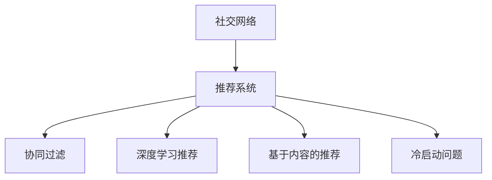

                 

# 社交网络推荐系统的发展：连接用户兴趣

在社交网络（Social Network）的世界中，推荐系统（Recommendation System）扮演着连接用户与内容的桥梁角色，帮助用户发现并连接到自己感兴趣的内容和群体，提升用户体验，提高内容消费效率。本文将深入探讨社交网络推荐系统的发展历程、核心概念与算法、数学模型与公式推导、项目实践与实际应用场景，并对未来的发展趋势与挑战进行展望，力求全面解读这一领域的前沿技术与实践。

## 1. 背景介绍

### 1.1 问题由来

随着社交网络的普及，用户所接触到的信息量呈爆炸式增长。如何帮助用户在无限信息流中快速找到自己感兴趣的内容，成为社交网络推荐系统的核心挑战。推荐系统通过分析用户的历史行为数据，推荐可能符合用户兴趣的内容，从而提升用户体验和平台粘性。

从最初的基于内容的推荐算法，到如今的协同过滤和深度学习推荐，社交网络推荐系统不断发展，逐步成为社交网络服务中不可或缺的组成部分。本文将回顾推荐系统的发展历程，并分析其在社交网络中应用的具体场景和挑战。

### 1.2 问题核心关键点

社交网络推荐系统的关键点在于如何高效准确地识别和连接用户的兴趣，实现个性化推荐。以下是几个核心关键点：

- 如何收集和处理用户行为数据？
- 如何表示和推荐用户兴趣？
- 如何避免过拟合和冷启动问题？
- 如何衡量推荐系统的评估指标？
- 如何优化推荐算法以提升效果？

## 2. 核心概念与联系

### 2.1 核心概念概述

为更好地理解社交网络推荐系统的工作原理和优化方向，本节将介绍几个密切相关的核心概念：

- 社交网络（Social Network）：由用户及其关系构成的社交图谱，用于描述人与人之间的连接关系。
- 推荐系统（Recommendation System）：利用用户历史行为数据，为用户推荐可能感兴趣的内容或群体的系统。
- 协同过滤（Collaborative Filtering）：通过分析用户间的相似度，为用户推荐可能感兴趣的内容。
- 深度学习推荐（Deep Learning Recommendation）：利用深度神经网络模型，挖掘用户和内容的潜在特征。
- 基于内容的推荐（Content-Based Recommendation）：根据物品的属性特征，为用户推荐可能感兴趣的内容。
- 冷启动问题（Cold Start Problem）：用户没有足够的历史行为数据，难以推荐。

这些核心概念之间的逻辑关系可以通过以下Mermaid流程图来展示：



这个流程图展示了大语言模型的核心概念及其之间的关系：

1. 社交网络通过图谱描述用户关系，是推荐系统数据来源之一。
2. 推荐系统通过协同过滤、深度学习推荐等技术，为用户推荐内容或群体。
3. 冷启动问题涉及如何为新用户或未交互内容提供推荐。

这些概念共同构成了推荐系统的工作框架，使其能够高效地识别用户兴趣并推荐相关内容。

## 3. 核心算法原理 & 具体操作步骤

### 3.1 算法原理概述

社交网络推荐系统的核心思想是通过分析用户的历史行为数据，识别用户兴趣，并推荐可能感兴趣的内容。其核心算法包括以下几种：

- 协同过滤算法：通过分析用户间的相似度，为用户推荐可能感兴趣的内容。
- 基于内容的推荐算法：根据物品的属性特征，为用户推荐可能感兴趣的内容。
- 深度学习推荐算法：利用深度神经网络模型，挖掘用户和内容的潜在特征。

### 3.2 算法步骤详解

#### 协同过滤算法

协同过滤算法通过分析用户间的相似度，为用户推荐可能感兴趣的内容。具体步骤如下：

1. **收集用户行为数据**：收集用户对物品的评分或点击等行为数据。
2. **计算用户相似度**：使用余弦相似度等方法，计算用户间的相似度。
3. **计算物品评分**：根据用户相似度，计算新用户对未交互物品的评分。
4. **推荐物品**：将评分排序，推荐评分较高的物品。

#### 基于内容的推荐算法

基于内容的推荐算法通过分析物品的属性特征，为用户推荐可能感兴趣的内容。具体步骤如下：

1. **收集物品属性**：收集物品的特征信息，如标签、类别、关键词等。
2. **计算物品相似度**：使用余弦相似度等方法，计算物品间的相似度。
3. **推荐物品**：根据用户历史行为，推荐与已交互物品相似的物品。

#### 深度学习推荐算法

深度学习推荐算法通过训练深度神经网络模型，挖掘用户和内容的潜在特征，为用户推荐可能感兴趣的内容。具体步骤如下：

1. **数据预处理**：对用户行为数据和物品属性数据进行预处理，构建数据集。
2. **模型训练**：使用深度神经网络模型，如神经协同过滤（Neural Collaborative Filtering）等，训练推荐模型。
3. **推荐物品**：使用训练好的模型，预测用户对未交互物品的评分，推荐评分较高的物品。

### 3.3 算法优缺点

协同过滤算法的优点在于简单易实现，不需要物品的属性信息。但缺点是容易受数据稀疏性影响，难以应对新物品的推荐。

基于内容的推荐算法的优点在于不受数据稀疏性影响，适用于长尾物品推荐。但缺点是对物品属性信息的依赖较大，且难以处理物品间复杂的关联关系。

深度学习推荐算法的优点在于能够挖掘用户和物品的潜在特征，适用于大规模数据集。但缺点是对硬件资源要求较高，训练成本较高。

### 3.4 算法应用领域

社交网络推荐系统在多种领域中得到广泛应用，例如：

- 电商推荐：为用户推荐可能感兴趣的商品。
- 新闻推荐：为用户推荐可能感兴趣的新闻文章。
- 视频推荐：为用户推荐可能感兴趣的视频内容。
- 音乐推荐：为用户推荐可能感兴趣的音乐作品。
- 社区推荐：为用户推荐可能感兴趣的用户群体或兴趣小组。

## 4. 数学模型和公式 & 详细讲解

### 4.1 数学模型构建

社交网络推荐系统的数学模型可以构建为用户-物品评分矩阵 $R \in \mathbb{R}^{N \times M}$，其中 $N$ 为用户的数量，$M$ 为物品的数量。用户 $i$ 对物品 $j$ 的评分表示为 $R_{ij}$。

推荐系统的目标是最小化预测评分与真实评分之间的误差。常用的评价指标包括均方误差（Mean Squared Error, MSE）和均方根误差（Root Mean Squared Error, RMSE）：

$$
\text{MSE} = \frac{1}{NM} \sum_{i=1}^{N} \sum_{j=1}^{M} (R_{ij} - \hat{R}_{ij})^2
$$

$$
\text{RMSE} = \sqrt{\frac{1}{NM} \sum_{i=1}^{N} \sum_{j=1}^{M} (R_{ij} - \hat{R}_{ij})^2}
$$

### 4.2 公式推导过程

以协同过滤算法为例，假设有两个用户 $u_1$ 和 $u_2$，分别对物品 $i$ 和 $j$ 评分，记为 $R_{1i}$ 和 $R_{2j}$。使用余弦相似度计算两个用户间的相似度 $s$：

$$
s = \cos \theta = \frac{\sum_{k=1}^{N} (R_{1k} \times R_{2k})}{\sqrt{\sum_{k=1}^{N} R_{1k}^2} \times \sqrt{\sum_{k=1}^{N} R_{2k}^2}}
$$

新用户 $u_3$ 对未交互物品 $k$ 的预测评分 $\hat{R}_{3k}$ 可以表示为：

$$
\hat{R}_{3k} = \sum_{i=1}^{N} s_i R_{ik}
$$

其中 $s_i$ 为用户 $i$ 对物品 $k$ 的评分，即：

$$
s_i = \frac{\sum_{j=1}^{M} (R_{ij} \times R_{ik})}{\sqrt{\sum_{j=1}^{M} R_{ij}^2} \times \sqrt{\sum_{j=1}^{M} R_{ik}^2}}
$$

通过上述公式，协同过滤算法可以根据用户间的相似度，为用户推荐可能感兴趣的物品。

### 4.3 案例分析与讲解

以电商推荐系统为例，分析协同过滤算法的应用。电商推荐系统需要为用户推荐可能感兴趣的商品。假设用户 $i$ 对商品 $j$ 的评分 $R_{ij}$ 表示为购买数量。

1. **数据收集**：收集用户对商品的历史购买数据，构建用户-商品评分矩阵 $R$。
2. **相似度计算**：使用余弦相似度计算用户间的相似度。
3. **评分预测**：根据相似度，预测新用户对未交互商品评分，推荐评分较高的商品。

## 5. 项目实践：代码实例和详细解释说明

### 5.1 开发环境搭建

在进行推荐系统开发前，我们需要准备好开发环境。以下是使用Python进行TensorFlow开发的环境配置流程：

1. 安装Anaconda：从官网下载并安装Anaconda，用于创建独立的Python环境。

2. 创建并激活虚拟环境：
```bash
conda create -n tf-env python=3.8 
conda activate tf-env
```

3. 安装TensorFlow：根据CUDA版本，从官网获取对应的安装命令。例如：
```bash
conda install tensorflow
```

4. 安装TensorFlow Addons：包含更多的推荐系统算法和工具。
```bash
conda install tensorflow-addons
```

5. 安装各类工具包：
```bash
pip install numpy pandas scikit-learn matplotlib tqdm jupyter notebook ipython
```

完成上述步骤后，即可在`tf-env`环境中开始推荐系统开发。

### 5.2 源代码详细实现

下面我们以协同过滤算法为例，给出使用TensorFlow实现电商推荐系统的代码实现。

首先，定义用户-商品评分矩阵和用户相似度矩阵：

```python
import tensorflow as tf
import numpy as np

R = np.random.randn(100, 100)  # 生成随机评分矩阵
U = np.random.randn(100, 10)   # 生成随机用户向量
V = np.random.randn(100, 10)   # 生成随机物品向量

R_tensor = tf.constant(R)
U_tensor = tf.constant(U)
V_tensor = tf.constant(V)
```

然后，计算用户相似度矩阵：

```python
def similarity_matrix(user_vector, item_vector):
    dot = tf.linalg.matmul(user_vector, item_vector, transpose_b=True)
    numerator = tf.reduce_sum(tf.multiply(dot, user_vector), axis=1)
    denominator = tf.linalg.norm(user_vector, axis=1) * tf.linalg.norm(item_vector, axis=1)
    return numerator / denominator

S_tensor = similarity_matrix(U_tensor, V_tensor)
```

接着，计算新用户对未交互商品的评分：

```python
new_user_vector = np.random.randn(1, 10)  # 生成新用户向量
new_item_vector = np.random.randn(1, 10)  # 生成新物品向量

dot = tf.linalg.matmul(new_user_vector, new_item_vector, transpose_b=True)
numerator = tf.reduce_sum(tf.multiply(dot, new_user_vector), axis=1)
denominator = tf.linalg.norm(new_user_vector, axis=1) * tf.linalg.norm(new_item_vector, axis=1)
S_tensor_new = numerator / denominator

prediction_tensor = tf.reduce_sum(S_tensor_new * R_tensor, axis=1)
```

最后，输出预测评分结果：

```python
predictions = prediction_tensor.numpy()
```

### 5.3 代码解读与分析

让我们再详细解读一下关键代码的实现细节：

**R、U、V矩阵定义**：
- `R` 矩阵表示用户-商品评分矩阵，随机生成评分数据。
- `U` 矩阵表示用户向量，随机生成。
- `V` 矩阵表示物品向量，随机生成。

**相似度矩阵计算函数**：
- 使用TensorFlow的`tf.linalg.matmul`函数计算矩阵点乘。
- 计算分子和分母，并使用`tf.reduce_sum`函数求和。
- 最后计算余弦相似度，得到相似度矩阵。

**新用户评分预测**：
- 生成新用户向量和物品向量。
- 使用`tf.linalg.matmul`函数计算点乘。
- 计算分子和分母，并使用`tf.reduce_sum`函数求和。
- 计算余弦相似度，得到新用户向量与物品向量的相似度。
- 使用新用户向量和物品向量的相似度，预测新用户对未交互商品的评分。

**预测评分结果**：
- 将预测评分结果从TensorFlow的Tensor对象转换为NumPy数组，供后续分析使用。

可以看到，TensorFlow使得协同过滤算法的代码实现变得简洁高效。开发者可以将更多精力放在数据处理、模型改进等高层逻辑上，而不必过多关注底层的实现细节。

当然，工业级的系统实现还需考虑更多因素，如模型的保存和部署、超参数的自动搜索、更灵活的任务适配层等。但核心的协同过滤算法基本与此类似。

## 6. 实际应用场景

### 6.1 智能客服系统

智能客服系统通过推荐系统，能够为用户推荐最合适的解决方案。当用户提出问题时，推荐系统可以根据用户的历史查询记录，推荐相关问题的答案。此外，推荐系统还可以根据用户对解决方案的反馈，不断优化推荐结果，提高问题解决的准确性。

### 6.2 金融推荐系统

金融推荐系统通过推荐系统，能够为用户推荐最合适的理财产品。推荐系统可以根据用户的历史交易记录和兴趣偏好，推荐适合用户的理财产品。此外，推荐系统还可以根据市场动态和用户行为变化，实时调整推荐策略，为用户提供最优的投资建议。

### 6.3 电商推荐系统

电商推荐系统通过推荐系统，能够为用户推荐最合适的商品。推荐系统可以根据用户的历史浏览、购买记录和兴趣偏好，推荐适合的商品。此外，推荐系统还可以根据季节变化和用户行为变化，实时调整推荐策略，提高商品的转化率。

### 6.4 未来应用展望

随着推荐系统的发展，未来在更多领域将得到应用，为各行各业带来变革性影响。

在智慧医疗领域，推荐系统可以帮助医生推荐最合适的治疗方案和药品。在智能教育领域，推荐系统可以推荐最合适的学习内容和教师。在智慧城市治理中，推荐系统可以推荐最合适的城市事件和应急方案。此外，在企业生产、社会治理、文娱传媒等众多领域，推荐系统也将不断涌现，为经济社会发展注入新的动力。相信随着技术的日益成熟，推荐系统必将在构建人机协同的智能时代中扮演越来越重要的角色。

## 7. 工具和资源推荐

### 7.1 学习资源推荐

为了帮助开发者系统掌握推荐系统的工作原理和优化方向，这里推荐一些优质的学习资源：

1. 《推荐系统》系列博文：由推荐系统专家撰写，深入浅出地介绍了推荐系统原理、协同过滤、深度学习推荐等前沿话题。

2. CS237《深度学习在自然语言处理中的应用》课程：斯坦福大学开设的推荐系统课程，有Lecture视频和配套作业，带你入门推荐系统领域的基本概念和经典模型。

3. 《推荐系统实战》书籍：详细介绍了推荐系统的实现和应用，涵盖协同过滤、深度学习推荐、冷启动等诸多技术。

4. TensorFlow官方文档：TensorFlow的官方文档，提供了海量的推荐系统样例代码和文档，是上手实践的必备资料。

5. Kaggle推荐系统竞赛：Kaggle的推荐系统竞赛，涵盖多个推荐系统挑战赛，提供丰富的实践经验。

通过对这些资源的学习实践，相信你一定能够快速掌握推荐系统的工作原理和优化方法，并用于解决实际的推荐问题。

### 7.2 开发工具推荐

高效的开发离不开优秀的工具支持。以下是几款用于推荐系统开发的常用工具：

1. TensorFlow：基于Python的开源深度学习框架，灵活动态的计算图，适合快速迭代研究。推荐系统在TensorFlow中有多种实现，如TensorFlow Addons、TensorFlow Recommenders等。

2. PyTorch：基于Python的开源深度学习框架，灵活且高效。推荐系统在PyTorch中也有多种实现，如PyTorch LightGBM、PyTorch Recommenders等。

3. TensorFlow Addons：包含更多的推荐系统算法和工具，如协同过滤、深度学习推荐等。

4. Keras：基于TensorFlow和Theano的高层次深度学习框架，简单易用。推荐系统在Keras中有多种实现，如Keras Recommenders。

5. Weights & Biases：模型训练的实验跟踪工具，可以记录和可视化模型训练过程中的各项指标，方便对比和调优。

6. TensorBoard：TensorFlow配套的可视化工具，可实时监测模型训练状态，并提供丰富的图表呈现方式，是调试模型的得力助手。

合理利用这些工具，可以显著提升推荐系统的开发效率，加快创新迭代的步伐。

### 7.3 相关论文推荐

推荐系统的发展源于学界的持续研究。以下是几篇奠基性的相关论文，推荐阅读：

1. Matrix Factorization Techniques for Recommender Systems（即矩阵分解推荐算法）：提出了矩阵分解方法，用于挖掘用户和物品的潜在特征。

2. Deep Rank: A Hierarchical Learning Framework for Deep Ranking（即Deep Rank推荐算法）：提出了Deep Rank框架，用于深度神经网络推荐。

3. Multi-Task Learning from Matrix Factorization（即多任务学习推荐算法）：提出了多任务学习方法，用于提高推荐系统的泛化能力。

4. Collaborative Filtering for Implicit Feedback Datasets（即协同过滤推荐算法）：提出了协同过滤方法，用于处理用户隐式反馈数据。

5. Recommender Systems in the Era of Big Data: A Data-Parallel Framework（即大数据推荐系统）：提出了基于大数据的推荐系统框架，用于高效处理大规模推荐数据。

这些论文代表了大推荐系统的发展脉络。通过学习这些前沿成果，可以帮助研究者把握学科前进方向，激发更多的创新灵感。

## 8. 总结：未来发展趋势与挑战

### 8.1 总结

本文对社交网络推荐系统的发展历程、核心概念与算法、数学模型与公式推导、项目实践与实际应用场景进行了全面系统的介绍。首先阐述了推荐系统的发展历程和核心概念，明确了推荐系统在社交网络中的应用场景和挑战。其次，从原理到实践，详细讲解了协同过滤、基于内容的推荐、深度学习推荐等推荐算法的数学模型和公式推导，给出了推荐任务开发的完整代码实例。同时，本文还广泛探讨了推荐系统在智能客服、金融推荐、电商推荐等多个领域的应用前景，展示了推荐系统的广阔潜力。此外，本文精选了推荐系统的各类学习资源，力求为读者提供全方位的技术指引。

通过本文的系统梳理，可以看到，社交网络推荐系统已经成为了连接用户兴趣的重要工具，极大地提升了用户消费体验和平台粘性。未来，伴随推荐算法和技术的不断演进，社交网络推荐系统必将在更多领域得到应用，为经济社会发展注入新的动力。

### 8.2 未来发展趋势

展望未来，社交网络推荐系统将呈现以下几个发展趋势：

1. 数据融合与多模态推荐：推荐系统将进一步融合多种数据源，如文本、图片、视频等，实现多模态推荐。
2. 动态实时推荐：推荐系统将实现实时推荐，根据用户实时行为动态调整推荐策略。
3. 交互式推荐：推荐系统将支持用户与推荐结果的互动，如评分、点赞等，进一步提升推荐效果。
4. 个性化推荐：推荐系统将通过多任务学习、元学习等方法，实现更精确的个性化推荐。
5. 公平推荐：推荐系统将通过公平性约束，防止推荐结果偏见，确保推荐公平。

以上趋势凸显了社交网络推荐系统的广阔前景。这些方向的探索发展，必将进一步提升推荐系统的性能和应用范围，为人类提供更优质的智能推荐服务。

### 8.3 面临的挑战

尽管社交网络推荐系统已经取得了瞩目成就，但在迈向更加智能化、普适化应用的过程中，它仍面临着诸多挑战：

1. 数据稀疏性：推荐系统需要大量数据来训练模型，但实际应用中数据稀疏性往往较大，难以处理长尾物品推荐。
2. 冷启动问题：新用户或未交互物品难以推荐，如何通过少量数据或外部信息快速推荐，是推荐系统面临的难点。
3. 过拟合问题：推荐模型容易受数据集偏差影响，过拟合现象常见，如何防止过拟合，提高模型泛化能力，是推荐系统需要解决的问题。
4. 计算效率：推荐系统需要处理大规模数据集，计算效率低，如何优化算法，提高推荐速度，是推荐系统需要解决的问题。
5. 安全性与隐私保护：推荐系统需要保护用户隐私，防止数据泄露，如何保证用户数据安全，是推荐系统需要解决的问题。

正视推荐系统面临的这些挑战，积极应对并寻求突破，将是推荐系统走向成熟的必由之路。相信随着学界和产业界的共同努力，这些挑战终将一一被克服，推荐系统必将在构建人机协同的智能时代中扮演越来越重要的角色。

### 8.4 研究展望

面对社交网络推荐系统所面临的种种挑战，未来的研究需要在以下几个方面寻求新的突破：

1. 探索无监督和半监督推荐方法：摆脱对大量标注数据的依赖，利用自监督学习、主动学习等无监督和半监督范式，最大限度利用非结构化数据，实现更加灵活高效的推荐。

2. 研究参数高效和计算高效的推荐范式：开发更加参数高效的推荐方法，如AdamRank等，在固定大部分预训练参数的同时，只更新极少量的任务相关参数。同时优化推荐模型的计算图，减少前向传播和反向传播的资源消耗，实现更加轻量级、实时性的部署。

3. 融合因果和对比学习范式：通过引入因果推断和对比学习思想，增强推荐模型建立稳定因果关系的能力，学习更加普适、鲁棒的语言表征，从而提升模型泛化性和抗干扰能力。

4. 引入更多先验知识：将符号化的先验知识，如知识图谱、逻辑规则等，与神经网络模型进行巧妙融合，引导推荐过程学习更准确、合理的推荐模型。同时加强不同模态数据的整合，实现视觉、语音等多模态信息与文本信息的协同建模。

5. 结合因果分析和博弈论工具：将因果分析方法引入推荐模型，识别出推荐决策的关键特征，增强推荐结果的因果性和逻辑性。借助博弈论工具刻画人机交互过程，主动探索并规避推荐模型的脆弱点，提高系统稳定性。

6. 纳入伦理道德约束：在推荐模型训练目标中引入伦理导向的评估指标，过滤和惩罚有偏见、有害的输出倾向。同时加强人工干预和审核，建立推荐模型行为的监管机制，确保推荐结果符合人类价值观和伦理道德。

这些研究方向的探索，必将引领社交网络推荐系统技术迈向更高的台阶，为构建安全、可靠、可解释、可控的智能推荐系统铺平道路。面向未来，社交网络推荐系统还需要与其他人工智能技术进行更深入的融合，如知识表示、因果推理、强化学习等，多路径协同发力，共同推动自然语言理解和智能交互系统的进步。只有勇于创新、敢于突破，才能不断拓展推荐系统的边界，让智能技术更好地造福人类社会。

## 9. 附录：常见问题与解答

**Q1：推荐系统如何处理数据稀疏性问题？**

A: 推荐系统处理数据稀疏性的主要方法包括：

1. 协同过滤算法：通过分析用户间的相似度，为用户推荐可能感兴趣的内容。
2. 矩阵分解方法：将用户-物品评分矩阵分解为低秩矩阵，用于填充缺失值。
3. 深度神经网络方法：利用深度学习模型，对用户和物品进行嵌入表示，缓解数据稀疏性。

**Q2：推荐系统如何避免冷启动问题？**

A: 推荐系统处理冷启动问题的主要方法包括：

1. 基于内容的推荐：根据物品的属性特征，为用户推荐可能感兴趣的内容。
2. 协同过滤算法：通过分析用户间的相似度，为用户推荐可能感兴趣的内容。
3. 元学习：使用元学习算法，通过少量数据快速推荐。
4. 主动学习：通过主动获取用户反馈，逐步完善推荐模型。

**Q3：推荐系统如何防止过拟合？**

A: 推荐系统防止过拟合的方法包括：

1. 数据增强：通过数据增强技术，扩充训练集，防止过拟合。
2. 正则化：使用L2正则、Dropout等正则化技术，防止过拟合。
3. 集成学习：使用集成学习算法，提高模型的泛化能力。
4. 模型融合：通过模型融合技术，提高模型的泛化能力。

**Q4：推荐系统如何提升计算效率？**

A: 推荐系统提升计算效率的方法包括：

1. 分布式计算：使用分布式计算技术，提高计算效率。
2. 模型压缩：使用模型压缩技术，减少模型大小和计算量。
3. 近似算法：使用近似算法，提高计算速度。
4. 矩阵分解：使用矩阵分解方法，减少计算量。

**Q5：推荐系统如何保障用户隐私？**

A: 推荐系统保障用户隐私的方法包括：

1. 差分隐私：通过差分隐私技术，保护用户数据隐私。
2. 数据匿名化：使用数据匿名化技术，防止用户数据泄露。
3. 安全计算：使用安全计算技术，保护用户数据安全。
4. 用户控制：赋予用户数据控制权，用户可以自主选择是否使用推荐服务。

大语言模型推荐系统是一个充满挑战和机遇的领域，相信随着技术的不断进步，推荐系统必将在更多领域得到应用，为人类提供更优质的智能推荐服务。

