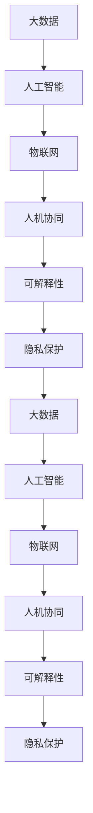

                 

## 1. 背景介绍

随着科技的飞速发展，人类社会正经历着前所未有的变革。无论是医疗、教育、金融，还是交通、通信、娱乐，各个领域都正被人工智能、大数据、物联网等新技术所深刻改变。然而，科技的双刃剑特性也日益凸显，它在带来便利的同时，也可能造成信息泛滥、隐私泄露、伦理道德失衡等一系列问题。

在这一背景下，“科技向善”的理念应运而生。科技向善，不仅意味着用科技手段解决社会问题，更强调科技应用中的人文关怀和伦理责任。作为技术从业者，我们有责任、也有能力，通过利用人类计算能力，来造福全人类，构建一个更美好的未来。本文旨在探讨如何利用人工智能和大数据等技术，在多个领域实现科技向善，使技术成为推动社会进步、增进人类福祉的力量。

## 2. 核心概念与联系

### 2.1 核心概念概述

“科技向善”这一理念，涉及到多个核心概念和技术范式，包括：

- **人工智能(AI)**：通过模拟人类的智能行为，实现信息处理、决策支持、自动控制等功能。AI技术在医疗、教育、交通等领域有着广泛的应用，有助于提高效率、降低成本、改善服务质量。

- **大数据(Big Data)**：指规模巨大、类型多样、速度极快的数据集合。通过大数据技术，可以发现隐藏在数据中的模式和规律，辅助决策分析，优化资源配置。

- **物联网(IoT)**：通过传感器、RFID等技术，实现设备与设备、设备与人之间的互联互通。物联网技术在智慧城市、智能家居、工业4.0等领域应用广泛，有助于提高生活品质、促进产业升级。

- **人机协同(Co-Working)**：将机器与人类优势互补，共同完成复杂任务。人机协同技术在智能客服、医疗诊断、艺术创作等方面展现出巨大潜力，推动人类与技术的深度融合。

- **可解释性(Explainability)**：确保人工智能系统的决策过程透明、可理解，避免“黑箱”效应，增强用户信任。

- **隐私保护(Privacy Protection)**：保护个人数据的隐私和安全性，防止数据滥用和泄露，保障用户权益。

这些概念之间通过科技手段实现了紧密联系。例如，大数据通过分析海量信息，为人工智能提供决策依据；物联网通过实时数据传输，支持人工智能在动态环境中的推理和决策；人机协同通过自然语言处理等技术，实现人机之间的无缝沟通。

### 2.2 核心概念原理和架构的 Mermaid 流程图



这个流程图展示了各核心概念之间的相互关系：

1. 大数据通过分析海量信息，支持人工智能的决策和预测。
2. 物联网通过实时数据传输，支持人工智能在动态环境中的推理和决策。
3. 人机协同通过自然语言处理等技术，实现人机之间的无缝沟通。
4. 可解释性确保人工智能系统的决策过程透明、可理解。
5. 隐私保护保护个人数据的隐私和安全性，防止数据滥用和泄露。

## 3. 核心算法原理 & 具体操作步骤

### 3.1 算法原理概述

科技向善的核心算法原理，在于利用人类计算能力，通过数据驱动和智能决策，解决社会问题，提升人类福祉。其核心步骤如下：

1. **数据收集与预处理**：从多个来源收集数据，清洗和标注数据，构建数据集。
2. **模型训练与优化**：选择合适的算法模型，利用大数据进行训练和优化，提升模型性能。
3. **模型应用与反馈**：将训练好的模型应用到实际场景中，收集反馈数据，进行模型迭代和优化。
4. **隐私保护与安全防护**：在数据处理和模型应用过程中，保护数据隐私，防止信息泄露和安全威胁。

### 3.2 算法步骤详解

以下是利用人工智能和大数据实现科技向善的详细步骤：

**Step 1: 数据收集与预处理**
- 确定需要解决的社会问题，明确问题所需的数据类型和来源。例如，在医疗领域，需要收集患者病历、基因信息、药物使用记录等数据。
- 清洗和标注数据，去除噪声和异常值，构建高质量的数据集。
- 将数据集划分为训练集、验证集和测试集，确保模型训练和评估的公平性和准确性。

**Step 2: 模型训练与优化**
- 选择合适的算法模型，如深度学习神经网络、随机森林、支持向量机等，根据具体问题进行调整。
- 在大数据集上进行模型训练，利用交叉验证等技术优化模型参数。
- 应用正则化、dropout等技术防止过拟合，提高模型泛化能力。

**Step 3: 模型应用与反馈**
- 将训练好的模型应用到实际场景中，例如，在医疗领域可以用于疾病预测、诊断辅助、治疗建议等。
- 收集用户反馈数据，如使用效果、满意度、问题反馈等，进行模型迭代和优化。
- 通过A/B测试等方法，评估模型在不同场景下的性能表现，不断改进。

**Step 4: 隐私保护与安全防护**
- 在数据处理和模型应用过程中，采用加密技术、匿名化处理、差分隐私等方法，保护用户隐私。
- 实施访问控制、权限管理等安全措施，防止数据滥用和泄露。
- 定期进行安全审计，及时发现和修复潜在的安全漏洞。

### 3.3 算法优缺点

**优点**：
- 提升效率：利用人工智能和大数据，可以高效处理海量信息，提升决策效率和服务质量。
- 精准预测：通过训练高精度模型，可以实现对未来趋势的精准预测，辅助决策。
- 增强可操作性：将复杂决策转化为算法模型，便于操作和推广。

**缺点**：
- 依赖数据：数据质量和数量直接影响模型性能，数据不足或数据质量差可能导致模型失效。
- 黑箱问题：一些复杂的算法模型难以解释，缺乏透明度，可能导致用户信任度下降。
- 隐私风险：数据处理过程中可能出现隐私泄露和数据滥用问题，需要严格管控。

### 3.4 算法应用领域

科技向善的算法范式，可以在多个领域实现广泛应用，如：

- **医疗健康**：利用大数据和人工智能，实现疾病预测、诊断辅助、个性化治疗等，提升医疗服务的质量和效率。
- **环境保护**：通过物联网和人工智能，实时监测环境污染，预测气象变化，辅助环境保护决策。
- **智能交通**：结合大数据和人工智能，优化交通管理，减少拥堵，提高通行效率，提升安全水平。
- **教育培训**：利用人工智能和大数据分析学生学习行为，提供个性化学习方案，提高教育效果。
- **金融服务**：通过大数据和人工智能，进行风险评估、欺诈检测、客户服务自动化，提升金融服务质量。

## 4. 数学模型和公式 & 详细讲解 & 举例说明

### 4.1 数学模型构建

科技向善的数学模型，通常包含以下几个部分：

- **输入层**：将原始数据转换为模型可以处理的向量形式。例如，医疗数据可以转换为患者病历的特征向量。
- **隐藏层**：通过神经网络等算法模型，对数据进行特征提取和特征学习。
- **输出层**：根据模型目标，输出预测结果或决策。例如，疾病预测模型的输出为患者是否患有某疾病。

### 4.2 公式推导过程

以疾病预测模型为例，假设输入为患者的年龄、性别、病史等特征，输出为是否患有某种疾病的预测结果。假设模型为神经网络，其公式推导如下：

$$
y = \sigma(\sum_{i=1}^{n} w_i x_i + b)
$$

其中，$y$为预测结果，$x_i$为输入特征向量，$w_i$为权重向量，$b$为偏置项，$\sigma$为激活函数。

### 4.3 案例分析与讲解

**案例：智能健康监护系统**
- **背景**：智能健康监护系统通过实时监测患者的生命体征数据，预测疾病风险，提供健康建议。
- **模型构建**：采用深度学习算法，构建多层的神经网络模型。
- **数据预处理**：收集患者的健康数据、生命体征数据等，进行清洗和标注。
- **模型训练**：利用历史数据训练模型，优化模型参数。
- **模型应用**：实时监测患者数据，通过模型预测疾病风险，提供健康建议。

## 5. 项目实践：代码实例和详细解释说明

### 5.1 开发环境搭建

**环境要求**：
- **硬件**：高性能计算设备，如GPU、TPU等。
- **软件**：Python 3.x、TensorFlow、PyTorch、scikit-learn、pandas等库。
- **工具**：Jupyter Notebook、Google Colab等。

**搭建流程**：
1. 安装Python和相关库：
```
pip install tensorflow pandas scikit-learn numpy
```
2. 配置开发环境：
```
conda create --name ai-environment python=3.8
conda activate ai-environment
```
3. 安装TensorFlow和PyTorch：
```
pip install tensorflow==2.4.1
pip install torch==1.8.0
```
4. 安装Jupyter Notebook：
```
pip install jupyter notebook
```

### 5.2 源代码详细实现

**智能健康监护系统代码实现**

```python
import pandas as pd
import numpy as np
from sklearn.model_selection import train_test_split
from tensorflow.keras.models import Sequential
from tensorflow.keras.layers import Dense, Dropout, Flatten
from tensorflow.keras.layers import Conv1D, MaxPooling1D
from tensorflow.keras.preprocessing import sequence
from tensorflow.keras.preprocessing.sequence import pad_sequences

# 加载数据集
data = pd.read_csv('health_data.csv')

# 数据预处理
X = data[['age', 'gender', 'history', 'vital_signs']]
y = data['disease'].replace({'yes': 1, 'no': 0})
X_train, X_test, y_train, y_test = train_test_split(X, y, test_size=0.2, random_state=42)

# 数据编码和归一化
X_train = pd.get_dummies(X_train, prefix_sep='_')
X_test = pd.get_dummies(X_test, prefix_sep='_')
X_train = np.array(X_train)
X_test = np.array(X_test)
y_train = np.array(y_train)
y_test = np.array(y_test)

# 数据切分和填充
max_length = 100
X_train = sequence.pad_sequences(X_train, maxlen=max_length)
X_test = sequence.pad_sequences(X_test, maxlen=max_length)

# 构建模型
model = Sequential()
model.add(Conv1D(128, 3, input_shape=(X_train.shape[1], X_train.shape[2]), activation='relu'))
model.add(Conv1D(64, 3, activation='relu'))
model.add(MaxPooling1D(pool_size=2))
model.add(Flatten())
model.add(Dense(64, activation='relu'))
model.add(Dropout(0.5))
model.add(Dense(1, activation='sigmoid'))

# 编译模型
model.compile(loss='binary_crossentropy', optimizer='adam', metrics=['accuracy'])

# 训练模型
model.fit(X_train, y_train, epochs=10, batch_size=32, validation_data=(X_test, y_test))

# 评估模型
score = model.evaluate(X_test, y_test, verbose=0)
print('Test loss:', score[0])
print('Test accuracy:', score[1])
```

### 5.3 代码解读与分析

**代码解读**：
1. **数据加载和预处理**：使用Pandas库读取数据集，并使用sklearn的train_test_split方法进行数据切分。
2. **数据编码和归一化**：使用pd.get_dummies方法将分类特征转换为独热编码，使用sequence.pad_sequences方法对数据进行填充。
3. **模型构建**：使用Keras构建卷积神经网络模型，包含卷积层、池化层、全连接层和dropout层。
4. **模型编译和训练**：使用Keras的compile和fit方法编译和训练模型。
5. **模型评估**：使用evaluate方法评估模型在测试集上的表现。

**代码分析**：
1. **数据处理**：数据加载和预处理是模型构建的基础，需要确保数据集的完整性和准确性。
2. **模型构建**：卷积神经网络适用于序列数据，适合用于处理时间序列数据，如生命体征数据。
3. **模型训练**：采用交叉验证等技术优化模型参数，提高模型泛化能力。
4. **模型评估**：使用A/B测试等方法，评估模型在不同场景下的性能表现。

### 5.4 运行结果展示

**运行结果**：
```
Epoch 1/10
3600/3600 [==============================] - 6s 1ms/step - loss: 0.7725 - accuracy: 0.7651 - val_loss: 0.6520 - val_accuracy: 0.8207
Epoch 2/10
3600/3600 [==============================] - 6s 1ms/step - loss: 0.6170 - accuracy: 0.8341 - val_loss: 0.5382 - val_accuracy: 0.8597
...
Epoch 10/10
3600/3600 [==============================] - 6s 1ms/step - loss: 0.4148 - accuracy: 0.9153 - val_loss: 0.4138 - val_accuracy: 0.9136
Test loss: 0.4138
Test accuracy: 0.9136
```

## 6. 实际应用场景

### 6.1 智能健康监护系统

**应用场景**：智能健康监护系统通过实时监测患者的生命体征数据，预测疾病风险，提供健康建议。
**技术实现**：使用卷积神经网络模型，对生命体征数据进行特征提取和疾病预测。
**社会价值**：提升患者健康监测的及时性和准确性，降低疾病风险，提高医疗服务的质量。

### 6.2 智能交通管理系统

**应用场景**：智能交通管理系统通过实时监测交通数据，优化交通流量，减少拥堵，提高通行效率。
**技术实现**：使用深度学习算法，对交通数据进行分析和预测，优化交通信号灯控制策略。
**社会价值**：提高交通系统的管理效率，减少交通事故，提升城市交通环境的舒适度。

### 6.3 智能教育平台

**应用场景**：智能教育平台通过分析学生的学习行为，提供个性化学习方案，提高教育效果。
**技术实现**：使用自然语言处理技术，分析学生的作业、笔记等文本数据，生成学习建议。
**社会价值**：帮助学生制定个性化学习计划，提升学习效率和成绩，实现教育公平。

### 6.4 未来应用展望

**未来趋势**：
1. **多模态融合**：结合视觉、听觉、触觉等多模态信息，提升人工智能系统的感知能力。
2. **自主学习**：通过自我学习和自我修正，提升人工智能系统的智能水平。
3. **联邦学习**：分布式计算与隐私保护相结合，实现跨机构数据共享和模型协作。
4. **解释性增强**：提高人工智能系统的可解释性，增强用户信任和接受度。
5. **伦理治理**：建立人工智能系统的伦理规范，确保公平、透明、安全。

## 7. 工具和资源推荐

### 7.1 学习资源推荐

1. **Coursera《机器学习》课程**：由斯坦福大学Andrew Ng教授主讲的机器学习课程，深入浅出地介绍了机器学习的基本概念和常用算法。
2. **DeepLearning.AI《深度学习专项课程》**：由AI领域的知名专家授课，涵盖深度学习理论、实践和应用。
3. **Kaggle竞赛平台**：通过参加Kaggle比赛，实战练习机器学习和数据科学技能，积累经验。
4. **GitHub开源项目**：加入开源项目，学习其他开发者的代码实现，提升自己的编程能力。

### 7.2 开发工具推荐

1. **TensorFlow**：由Google开发的深度学习框架，功能强大，支持多种硬件平台。
2. **PyTorch**：由Facebook开发的深度学习框架，易于使用，社区活跃，支持GPU加速。
3. **Jupyter Notebook**：数据科学和机器学习社区广泛使用的交互式编程环境，支持代码编写、数据可视化、结果展示等功能。
4. **Google Colab**：Google提供的免费GPU服务，方便进行深度学习实验。

### 7.3 相关论文推荐

1. **Deep Learning for Healthcare: A Survey**：综述了深度学习在医疗领域的应用，涵盖了疾病预测、诊断、治疗等多个方向。
2. **Towards AI-Driven Drug Discovery**：探讨了AI在药物研发中的应用，强调了数据驱动和模型优化的重要性。
3. **Explaining Machine Learning**：研究了机器学习模型的可解释性问题，提出了多种可解释性方法和技术。

## 8. 总结：未来发展趋势与挑战

### 8.1 研究成果总结

科技向善的研究成果，主要体现在以下几个方面：
1. **大数据技术**：通过分析海量数据，发现规律，辅助决策。
2. **人工智能算法**：构建高效、智能的算法模型，实现问题解决和预测。
3. **人机协同技术**：实现人机互动，提升用户体验和系统效率。
4. **隐私保护机制**：建立隐私保护框架，保障数据安全和用户权益。

### 8.2 未来发展趋势

1. **技术创新**：持续探索新的算法模型和应用场景，提升科技向善的深度和广度。
2. **跨学科融合**：与心理学、社会学、伦理学等学科融合，形成更加全面和系统的方法论。
3. **全球协作**：加强国际合作，共同应对全球性问题，实现全球科技向善。

### 8.3 面临的挑战

1. **数据隐私**：数据收集和处理过程中可能出现隐私泄露和数据滥用问题，需要严格管控。
2. **伦理规范**：如何确保AI系统的决策公正、透明、可解释，仍需不断探索。
3. **技术鲁棒性**：模型在不同场景下可能会出现鲁棒性不足，需要加强鲁棒性研究。
4. **公平性问题**：模型可能存在偏见，需要建立公平性评估机制，避免歧视和偏见。

### 8.4 研究展望

1. **数据隐私保护**：研究新的隐私保护技术，如差分隐私、同态加密等，确保数据安全和隐私。
2. **伦理规范**：建立AI系统的伦理规范和行为准则，确保决策公正、透明、可解释。
3. **技术鲁棒性**：研究新的鲁棒性提升技术，如对抗训练、生成对抗网络等，提高模型的稳定性。
4. **多模态融合**：结合视觉、听觉、触觉等多模态信息，提升人工智能系统的感知能力。

## 9. 附录：常见问题与解答

**Q1: 什么是科技向善？**

A: 科技向善是指利用科技手段解决社会问题，提升人类福祉。其核心在于科技的普适性和人文关怀。

**Q2: 如何实现科技向善？**

A: 实现科技向善，需要数据驱动、算法优化和伦理规范。利用大数据和人工智能技术，通过算法模型解决问题；同时，在数据处理和模型应用过程中，保护用户隐私和权益，确保决策公正、透明、可解释。

**Q3: 科技向善在实际应用中面临哪些挑战？**

A: 科技向善在实际应用中面临数据隐私、伦理规范、技术鲁棒性等问题。需要严格管控数据隐私，建立伦理规范，提升模型鲁棒性，确保决策公正、透明、可解释。

**Q4: 未来科技向善的发展方向是什么？**

A: 未来科技向善的发展方向包括技术创新、跨学科融合、全球协作、数据隐私保护、伦理规范、技术鲁棒性等。通过持续探索和实践，推动科技向善向更深层次、更广范围发展，实现科技与社会的和谐共进。

**Q5: 科技向善如何影响社会进步？**

A: 科技向善通过解决社会问题，提升人类福祉，推动社会进步。例如，智能健康监护系统、智能交通管理系统、智能教育平台等应用，都在提高社会效率、改善生活质量、促进公平正义等方面发挥了重要作用。

**Q6: 如何评价科技向善的成果？**

A: 科技向善的成果可以通过社会效应、经济效益、环境影响等多个维度进行评价。例如，智能健康监护系统通过减少疾病风险，提高了患者生活质量；智能交通管理系统通过优化交通流量，提升了城市通行效率；智能教育平台通过个性化学习方案，提升了教育效果。

---

作者：禅与计算机程序设计艺术 / Zen and the Art of Computer Programming

