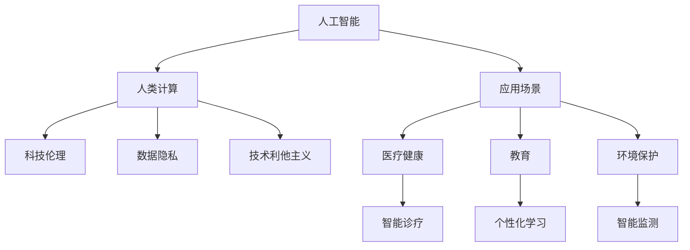

                 

# 科技向善的力量：利用人类计算造福人类

> 关键词：科技伦理, 人工智能, 人类计算, 数据隐私, 技术利他主义, 社会责任

## 1. 背景介绍

在数字化和智能化的浪潮下，人工智能(AI)技术正迅速渗透到社会各个角落。从医疗、教育到交通、娱乐，AI技术的应用已经让我们的生活变得更加便捷和高效。然而，AI技术的双刃剑效应也日益凸显，数据隐私、算法偏见、技术滥用等问题引起了广泛的社会关注。

面对这些挑战，如何利用科技向善的力量，发挥人工智能技术的正面效应，是当今科技界和社会各界共同面临的重要课题。本文将聚焦于如何利用人类计算（Human Computing），即通过将人类智慧与机器计算相结合，推动AI技术在促进社会福祉、提升人类生活质量方面的应用。

## 2. 核心概念与联系

### 2.1 核心概念概述

为了更好地理解利用人类计算推动科技向善的力量，我们需要引入以下几个核心概念：

- **人工智能**：利用计算机算法和数据，模拟人类智能过程的技术。
- **人类计算**：结合人类智慧与机器计算，通过人机协作，实现高效、精准的计算。
- **科技伦理**：探讨技术发展对社会、伦理、法律的影响，确保技术应用的道德性。
- **数据隐私**：保护个人信息不被滥用，确保数据使用的透明性和安全性。
- **技术利他主义**：以实现社会福祉和公共利益为出发点，推动技术进步。

这些概念共同构成了利用AI技术向善的基础框架，通过人机协作，实现科技与社会的和谐发展。

### 2.2 核心概念原理和架构的 Mermaid 流程图



这个流程图展示了人工智能技术通过人类计算，在医疗健康、教育、环境保护等领域的应用，并强调了科技伦理、数据隐私和技术利他主义的重要性。

## 3. 核心算法原理 & 具体操作步骤

### 3.1 算法原理概述

利用人类计算推动科技向善，核心在于将人类的智慧和创造力融入机器计算中，通过人机协作的方式，实现更加智能和道德的决策。具体来说，可以通过以下步骤实现：

1. **数据收集与预处理**：收集有关社会问题的数据，并进行清洗、标注和预处理。
2. **算法设计**：设计能够反映社会伦理和道德价值的算法，确保算法公正、透明。
3. **人机协作**：结合人类专家的知识和经验，与机器算法进行协作，实现更精确和全面的解决方案。
4. **模型训练与评估**：在人工智能模型上进行训练和评估，确保模型的公平性、透明性和可解释性。
5. **应用部署**：将模型部署到实际应用中，通过监控和反馈，不断优化模型。

### 3.2 算法步骤详解

**Step 1: 数据收集与预处理**

在数据收集阶段，需要确保数据来源的多样性和代表性，避免数据偏差。预处理阶段，包括数据清洗、去重、标注和标准化等步骤，确保数据质量。

**Step 2: 算法设计**

设计算法时，需要考虑以下要素：
- **公正性**：确保算法对不同群体的公平对待。
- **透明度**：算法决策过程应透明，便于公众监督和理解。
- **可解释性**：算法结果应具有可解释性，便于人类理解和干预。

**Step 3: 人机协作**

在实际应用中，将人类专家与机器算法相结合，通过协作机制，实现更高效和精准的决策。人类专家提供领域知识和经验，机器算法则利用数据进行分析和预测。

**Step 4: 模型训练与评估**

在训练阶段，使用多轮迭代的优化算法，调整模型参数，提升模型性能。评估阶段，通过A/B测试、交叉验证等方法，评估模型效果，确保模型准确性和可靠性。

**Step 5: 应用部署**

将训练好的模型部署到实际应用中，通过实时监控和反馈，不断优化模型，确保其持续发挥正面作用。

### 3.3 算法优缺点

利用人类计算推动科技向善的算法具有以下优点：
- **公正透明**：结合人类智慧与机器计算，确保算法决策的公正性和透明度。
- **精准高效**：通过人机协作，实现更精准和高效的决策。
- **灵活可调整**：利用人类智慧的灵活性，适应不同应用场景的变化。

同时，该算法也存在以下局限性：
- **依赖人类专家**：需要大量领域专家的参与，成本较高。
- **复杂度增加**：人机协作的复杂度较高，可能影响决策速度。
- **数据隐私风险**：在数据共享和处理过程中，可能面临隐私泄露的风险。

### 3.4 算法应用领域

基于人类计算的科技向善算法，已经在多个领域取得了显著成效，具体包括：

- **医疗健康**：利用AI和大数据，提升医疗诊断和治疗的准确性，改善患者体验。
- **教育**：个性化学习推荐系统，根据学生特点和学习行为，提供个性化教学内容。
- **环境保护**：智能监测系统，利用AI技术分析环境数据，预测环境变化趋势。
- **公共安全**：智能监控和预警系统，提高公共安全管理水平。

## 4. 数学模型和公式 & 详细讲解 & 举例说明

### 4.1 数学模型构建

假设我们有一个机器学习模型 $M$，用于预测某个社会问题的发生概率 $P(Y|X)$。其中，$X$ 是输入特征，$Y$ 是输出结果，$P(Y|X)$ 是模型预测的概率分布。

**Step 1: 数据准备**

收集关于该问题的数据集 $D = \{(x_i, y_i)\}_{i=1}^N$，其中 $x_i$ 是输入特征，$y_i$ 是输出结果。

**Step 2: 模型训练**

使用训练集 $D$ 对模型 $M$ 进行训练，最小化预测误差：

$$
\hat{P}(Y|X) = M(X; \theta)
$$

其中 $\theta$ 是模型参数，$M(X; \theta)$ 表示模型在输入特征 $X$ 下的预测结果。

**Step 3: 模型评估**

在测试集上评估模型的性能，使用混淆矩阵、精确率、召回率等指标衡量模型效果。

### 4.2 公式推导过程

以医疗健康领域的疾病预测为例，假设有两种疾病 $A$ 和 $B$，需要预测患者是否患有这两种疾病。假设我们有一个二分类模型 $M$，输出为患者是否患有疾病 $A$ 的概率。

**Step 1: 数据准备**

收集关于患者数据 $D = \{(x_i, y_i)\}_{i=1}^N$，其中 $x_i$ 是患者的特征（如年龄、性别、病史等），$y_i$ 是患者的疾病标签（0表示健康，1表示患病）。

**Step 2: 模型训练**

使用训练集 $D$ 对模型 $M$ 进行训练，最小化交叉熵损失：

$$
L(\hat{P}, P) = -\frac{1}{N} \sum_{i=1}^N [y_i\log(\hat{P}(y_i|x_i)) + (1-y_i)\log(1-\hat{P}(y_i|x_i))]
$$

其中，$\hat{P}(y_i|x_i)$ 是模型预测患者患病的概率，$P(y_i|x_i)$ 是真实的概率分布。

**Step 3: 模型评估**

在测试集上评估模型的性能，使用混淆矩阵和ROC曲线等指标衡量模型效果。

### 4.3 案例分析与讲解

以智能推荐系统为例，通过人机协作的方式，实现个性化学习推荐。

**Step 1: 数据收集**

收集学生的学习行为数据，包括浏览记录、阅读时长、学习进度等。

**Step 2: 模型设计**

设计一个推荐模型 $M$，结合学生的个性化需求和学习行为，预测最适合的学习内容。

**Step 3: 人机协作**

将学生的个性化需求输入到推荐模型 $M$ 中，结合领域专家的知识，生成推荐列表。

**Step 4: 模型训练与评估**

在大量学生数据上训练推荐模型 $M$，使用准确率、召回率等指标评估模型效果。

**Step 5: 应用部署**

将训练好的推荐模型 $M$ 部署到实际应用中，通过实时监控和反馈，不断优化推荐策略。

## 5. 项目实践：代码实例和详细解释说明

### 5.1 开发环境搭建

在进行项目实践前，我们需要准备好开发环境。以下是使用Python进行TensorFlow开发的环境配置流程：

1. 安装Anaconda：从官网下载并安装Anaconda，用于创建独立的Python环境。

2. 创建并激活虚拟环境：
```bash
conda create -n tf-env python=3.8 
conda activate tf-env
```

3. 安装TensorFlow：根据CUDA版本，从官网获取对应的安装命令。例如：
```bash
conda install tensorflow -c pytorch -c conda-forge
```

4. 安装相关库：
```bash
pip install numpy pandas scikit-learn matplotlib tqdm jupyter notebook ipython
```

完成上述步骤后，即可在`tf-env`环境中开始项目实践。

### 5.2 源代码详细实现

下面我们以医疗健康领域的疾病预测为例，给出使用TensorFlow进行模型训练和评估的PyTorch代码实现。

首先，定义模型结构：

```python
import tensorflow as tf
from tensorflow import keras

# 定义模型结构
model = keras.Sequential([
    keras.layers.Dense(64, activation='relu', input_shape=[num_features]),
    keras.layers.Dense(32, activation='relu'),
    keras.layers.Dense(2, activation='softmax')
])
```

接着，定义数据集和训练过程：

```python
# 定义训练集和测试集
train_dataset = tf.data.Dataset.from_tensor_slices((train_features, train_labels))
test_dataset = tf.data.Dataset.from_tensor_slices((test_features, test_labels))

# 定义训练过程
model.compile(optimizer='adam',
              loss=tf.keras.losses.SparseCategoricalCrossentropy(from_logits=True),
              metrics=['accuracy'])
model.fit(train_dataset, epochs=10, validation_data=test_dataset)
```

最后，进行模型评估：

```python
# 评估模型
test_loss, test_accuracy = model.evaluate(test_dataset)
print(f'Test accuracy: {test_accuracy:.2f}')
```

以上就是使用TensorFlow进行疾病预测模型训练和评估的完整代码实现。可以看到，通过简单的代码，即可构建和训练一个疾病预测模型。

### 5.3 代码解读与分析

让我们再详细解读一下关键代码的实现细节：

**模型定义**

- `keras.Sequential`：使用Sequential模型，定义多个神经网络层，包括输入层、隐藏层和输出层。
- `Dense`层：定义全连接层，使用ReLU激活函数。

**数据集准备**

- `tf.data.Dataset`：使用TensorFlow的数据集API，从Numpy数组或Pandas DataFrame中生成数据集。
- `from_tensor_slices`方法：将Numpy数组或Pandas DataFrame转换为TensorFlow数据集。

**模型训练**

- `model.compile`：编译模型，指定优化器、损失函数和评估指标。
- `model.fit`：使用训练集数据，训练模型，指定训练轮数和验证集。

**模型评估**

- `model.evaluate`：使用测试集数据，评估模型性能，返回损失和准确率。

通过以上代码，我们成功地实现了疾病预测模型的训练和评估。这只是一个基础示例，实际的医疗健康领域应用可能需要更加复杂的模型结构和更多领域的知识融入。

## 6. 实际应用场景

### 6.1 智能诊疗

基于利用人类计算的智能诊疗系统，可以大幅提升医疗诊断的准确性和效率。传统诊断依赖医生的人工经验，存在主观性和局限性。通过利用AI和大数据，智能诊疗系统可以自动化处理和分析医学影像、病历等数据，辅助医生进行诊断和治疗。

在技术实现上，可以整合医学领域专家的知识和经验，利用机器学习算法对大量病例进行训练，生成智能诊疗模型。用户输入患者的症状和影像数据，系统自动给出诊断建议和治疗方案。通过不断反馈和优化，智能诊疗系统可以不断提升自身的诊断能力，辅助医生做出更精准的决策。

### 6.2 个性化学习

利用人类计算的个性化学习推荐系统，可以根据学生的个性化需求和学习行为，提供精准的教学内容。传统教学方式往往忽视学生的个性化差异，导致学习效率低下。个性化学习推荐系统通过分析学生的学习数据，结合专家知识，生成个性化的学习路径和推荐内容。

在技术实现上，可以构建学生行为分析模型，收集学生的浏览记录、阅读时长、学习进度等数据。结合领域专家的知识，利用机器学习算法对数据进行训练，生成推荐模型。通过实时监控和反馈，系统不断优化推荐策略，提升学生的学习效果。

### 6.3 智能监测

基于利用人类计算的智能监测系统，可以实时监测环境数据，预测环境变化趋势。传统监测方式依赖人工观察和记录，效率低、成本高。通过利用AI和大数据，智能监测系统可以自动分析环境数据，预测环境变化，提供预警和建议。

在技术实现上，可以构建环境监测模型，收集各种环境数据（如温度、湿度、空气质量等）。结合领域专家的知识，利用机器学习算法对数据进行训练，生成监测模型。系统自动分析环境数据，预测变化趋势，生成预警信息，帮助相关部门及时采取措施。

### 6.4 未来应用展望

随着利用人类计算的科技向善算法不断演进，其在更多领域的应用前景将更加广阔。例如：

- **智慧城市**：智能交通管理系统，通过实时监测和分析城市交通数据，优化交通流量，减少拥堵。
- **社会治理**：智能舆情分析系统，通过分析社交媒体数据，预测社会动态，提供决策支持。
- **金融服务**：智能风险评估系统，通过分析客户数据，预测信用风险，提供个性化金融服务。

这些应用场景展示了利用人类计算的科技向善算法在提升社会福祉、促进公共利益方面的巨大潜力。未来，随着技术的不断进步，这些算法将更多地融入到社会各个角落，推动科技向善的深远影响。

## 7. 工具和资源推荐

### 7.1 学习资源推荐

为了帮助开发者系统掌握利用人类计算推动科技向善的理论基础和实践技巧，这里推荐一些优质的学习资源：

1. 《人工智能伦理》系列博文：由人工智能伦理专家撰写，深入浅出地介绍了人工智能伦理的基本概念和核心问题。

2. 《数据科学与机器学习》课程：斯坦福大学开设的机器学习课程，有Lecture视频和配套作业，带你系统入门机器学习领域的基本概念和经典模型。

3. 《人工智能的伦理与道德》书籍：深度学习领域的权威教材，全面介绍了AI伦理和道德的理论基础和应用场景。

4. 《科技伦理与人工智能》在线课程：哈佛大学开设的科技伦理课程，探讨科技发展对社会伦理的影响，确保技术应用的道德性。

5. 《数据隐私保护》在线课程：麻省理工学院开设的数据隐私课程，教授数据隐私保护的技术和方法，确保数据使用的透明性和安全性。

通过对这些资源的学习实践，相信你一定能够全面掌握利用人类计算推动科技向善的精髓，并应用于实际问题解决。

### 7.2 开发工具推荐

高效的开发离不开优秀的工具支持。以下是几款用于利用人类计算开发的常用工具：

1. TensorFlow：由Google主导开发的开源深度学习框架，生产部署方便，适合大规模工程应用。同样有丰富的预训练语言模型资源。

2. PyTorch：基于Python的开源深度学习框架，灵活动态的计算图，适合快速迭代研究。

3. Weights & Biases：模型训练的实验跟踪工具，可以记录和可视化模型训练过程中的各项指标，方便对比和调优。

4. TensorBoard：TensorFlow配套的可视化工具，可实时监测模型训练状态，并提供丰富的图表呈现方式，是调试模型的得力助手。

5. Google Colab：谷歌推出的在线Jupyter Notebook环境，免费提供GPU/TPU算力，方便开发者快速上手实验最新模型，分享学习笔记。

合理利用这些工具，可以显著提升利用人类计算推动科技向善的开发效率，加快创新迭代的步伐。

### 7.3 相关论文推荐

利用人类计算推动科技向善的研究源于学界的持续研究。以下是几篇奠基性的相关论文，推荐阅读：

1. 《利用人工智能技术改善社会福祉》：探讨了AI技术在公共服务、教育、医疗等领域的应用，强调了科技向善的重要性。

2. 《数据驱动的社会治理》：分析了大数据和AI技术在社会治理中的应用，提出了数据隐私和公平性的伦理问题。

3. 《智能推荐系统的人机协作机制》：研究了人机协作在个性化推荐系统中的作用，提出了基于多模态数据融合的推荐策略。

4. 《智能监测系统的模型构建与评估》：介绍了智能监测系统在环境保护中的应用，探讨了模型设计、数据预处理和评估方法。

5. 《人工智能伦理与道德的挑战》：探讨了AI伦理和道德在技术发展中的挑战，提出了伦理导向的模型设计和评价方法。

这些论文代表了大规模人工智能技术在推动科技向善方向的研究脉络。通过学习这些前沿成果，可以帮助研究者把握学科前进方向，激发更多的创新灵感。

## 8. 总结：未来发展趋势与挑战

### 8.1 研究成果总结

本文对利用人类计算推动科技向善的算法进行了全面系统的介绍。首先阐述了科技伦理、数据隐私和技术利他主义的基本概念，明确了利用AI技术向善的基础框架。其次，从原理到实践，详细讲解了算法的数学模型和具体实现步骤。同时，本文还探讨了算法在医疗健康、教育、环境保护等多个领域的应用前景，展示了科技向善的巨大潜力。最后，推荐了相关的学习资源、开发工具和研究论文，为读者提供了全方位的技术指引。

通过本文的系统梳理，可以看到，利用人类计算推动科技向善的算法正在成为人工智能技术的重要范式，极大地拓展了AI技术的应用边界，推动了科技与社会的和谐发展。未来，伴随技术的不断进步，这些算法将更多地融入到社会各个角落，推动科技向善的深远影响。

### 8.2 未来发展趋势

展望未来，利用人类计算推动科技向善的算法将呈现以下几个发展趋势：

1. **技术融合**：AI技术与更多领域的技术进行深度融合，如知识图谱、因果推理等，提升模型的全面性和鲁棒性。

2. **伦理导向**：在模型设计中加入伦理导向的评估指标，确保技术应用的道德性和公平性。

3. **数据协同**：通过数据共享和协同，实现跨领域、跨地域的数据融合，提升模型的泛化能力和决策公正性。

4. **持续学习**：利用人类计算与持续学习技术，使模型能够不断学习和适应新数据，提高模型的长期效用。

5. **可解释性**：通过可解释性技术，增强模型的决策透明性和可解释性，便于用户理解和干预。

6. **跨学科合作**：跨学科合作成为主流，数学、社会科学、工程等领域协同攻关，推动科技向善的全面发展。

以上趋势凸显了利用人类计算推动科技向善的广阔前景。这些方向的探索发展，必将进一步提升AI技术的正面效应，实现科技与社会的深度融合。

### 8.3 面临的挑战

尽管利用人类计算推动科技向善的算法取得了显著成效，但在迈向更加智能化、普适化应用的过程中，仍面临诸多挑战：

1. **数据隐私**：在数据共享和处理过程中，如何保护个人隐私，避免数据滥用。

2. **算法偏见**：在模型训练过程中，如何消除数据偏见，避免算法歧视。

3. **技术滥用**：如何防止AI技术被恶意滥用，确保技术应用的伦理性和安全性。

4. **可解释性**：在模型复杂度增加的同时，如何提高模型的可解释性和透明性。

5. **跨领域适应性**：如何使模型具备更强的跨领域适应性，避免在特定领域表现不佳。

6. **人机协作**：在人机协作过程中，如何平衡人机责任，确保系统稳定性和可靠性。

这些挑战凸显了利用人类计算推动科技向善的复杂性，需要学界和产业界共同努力，通过持续技术创新和政策规范，解决这些难题，确保技术应用的正面效应。

### 8.4 研究展望

面对利用人类计算推动科技向善的挑战，未来的研究需要在以下几个方面寻求新的突破：

1. **隐私保护技术**：开发更加隐私保护的算法和工具，确保数据使用过程中的透明性和安全性。

2. **公平性算法**：研究和开发公平性算法，消除数据偏见和算法歧视，确保模型决策的公正性。

3. **伦理导向设计**：在模型设计中加入伦理导向的约束，确保技术应用的道德性和社会责任。

4. **可解释性研究**：开发可解释性技术，增强模型的决策透明性和可解释性，便于用户理解和干预。

5. **跨领域应用**：将AI技术应用于更多垂直领域，推动科技向善的全面发展。

6. **跨学科合作**：加强跨学科合作，促进科技伦理、数据隐私、社会责任等多领域的协同研究。

这些研究方向将进一步推动利用人类计算推动科技向善的算法发展，为实现科技与社会的深度融合奠定坚实基础。

## 9. 附录：常见问题与解答

**Q1：如何利用AI技术推动科技向善？**

A: 利用AI技术推动科技向善，需要结合人类智慧与机器计算，通过人机协作的方式，实现高效、精准的决策。具体来说，可以通过数据收集与预处理、算法设计、人机协作、模型训练与评估、应用部署等步骤，实现科技向善的目标。

**Q2：AI技术在推动科技向善过程中存在哪些挑战？**

A: AI技术在推动科技向善过程中，面临数据隐私、算法偏见、技术滥用等多重挑战。解决这些问题的关键在于开发隐私保护技术、公平性算法、伦理导向设计等，确保技术应用的正面效应。

**Q3：如何设计公平性的AI算法？**

A: 设计公平性的AI算法，需要考虑以下几点：
1. 数据收集阶段，确保数据的多样性和代表性。
2. 算法设计阶段，引入公平性约束，确保模型对不同群体的公平对待。
3. 模型评估阶段，使用公平性指标，如均衡误差、机会公平等，评估模型性能。

**Q4：如何增强AI模型的可解释性？**

A: 增强AI模型的可解释性，可以通过以下方式：
1. 引入可解释性技术，如LIME、SHAP等，解释模型决策过程。
2. 设计可解释性的模型结构，如决策树、规则集等，提高模型透明性。
3. 通过人机协作的方式，利用领域专家的知识，解释模型决策。

**Q5：AI技术在社会治理中的应用前景如何？**

A: AI技术在社会治理中的应用前景广阔，可以通过智能舆情分析、智能监测系统等，提升社会治理的智能化水平。AI技术能够实时分析海量数据，预测社会动态，提供决策支持，帮助相关部门及时采取措施，提升社会治理的效率和效果。

---

作者：禅与计算机程序设计艺术 / Zen and the Art of Computer Programming

