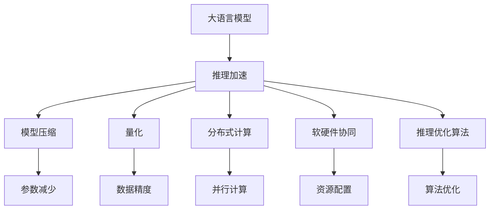

                 

# 秒推时代:LLM极速推理创新高

> 关键词：
- 大语言模型 (LLM) 
- 加速推理
- 深度学习
- 模型压缩
- 推理优化
- 分布式计算
- 软硬件协同

## 1. 背景介绍

### 1.1 问题由来
大语言模型(LLM)近年来迅速崛起，在自然语言处理(NLP)领域带来了革命性的突破。LLM基于自监督学习在大规模无标签文本数据上进行预训练，学习到了丰富的语言表示和常识知识。然而，在实际应用中，LLM在推理速度和效率方面仍面临挑战。低延迟、高吞吐量的推理需求，如实时问答、智能客服、自然语言生成等，对LLM的推理性能提出了更高要求。加速推理成为推动LLM在产业界应用的关键因素之一。

### 1.2 问题核心关键点
本文将重点探讨大语言模型加速推理的方法和策略，旨在提供一种高效的推理解决方案，提升模型的应用场景和性能。我们聚焦于以下关键点：

1. **推理加速技术**：研究如何通过模型压缩、量化、分布式计算等手段，提升LLM的推理速度和效率。
2. **软硬件协同**：探讨如何让CPU/GPU、硬件加速器、软件优化算法等资源最大化利用，实现更快速、稳定的推理结果。
3. **推理优化算法**：研究算法层面的优化方法，如动态子图划分、剪枝、自适应计算等，实现高效的推理流程。

### 1.3 问题研究意义
提升LLM的推理性能，不仅能够加速模型的落地应用，还能带来以下几方面的重大意义：

1. **降低延迟**：加速推理可显著降低响应时间，提升用户体验，特别是在实时对话系统、智能客服中，这一点尤为关键。
2. **提高吞吐量**：高效率的推理能够处理更多并发请求，提升系统的处理能力。
3. **降低计算成本**：高效的推理算法和软硬件协同策略，有助于减少计算资源的消耗，降低运营成本。
4. **促进产业化**：高效的推理能力使得LLM能够更快地应用于实际业务场景，加速产业创新和转型。
5. **增强安全性**：快速的推理能够及时响应安全威胁，提供更强的防护能力。

## 2. 核心概念与联系

### 2.1 核心概念概述

为了更好地理解LLM加速推理的方法，本节将介绍几个核心概念及其相互关系：

- **大语言模型(LLM)**：如BERT、GPT等，通过大规模无标签文本数据进行预训练，学习到丰富的语言表示和常识知识。
- **推理加速**：指通过技术手段提升LLM在推理阶段的速度和效率，使其能更快速地响应用户请求。
- **模型压缩**：通过减少模型参数量，减小计算资源消耗，提升推理速度。
- **量化**：将浮点数的参数和计算转换为固定点数的表示，减少内存占用，加速推理。
- **分布式计算**：利用多个计算节点并行计算，提升计算效率。
- **软硬件协同**：优化软硬件资源配置，提升推理性能。
- **推理优化算法**：如动态子图划分、剪枝、自适应计算等，提升推理过程的效率。

这些核心概念之间的逻辑关系可以通过以下Mermaid流程图来展示：



这个流程图展示了大语言模型推理加速的核心概念及其相互关系：

1. 大语言模型通过推理加速获取更快的响应速度。
2. 推理加速包括模型压缩、量化、分布式计算等手段。
3. 软硬件协同策略和推理优化算法进一步提升推理效率。

## 3. 核心算法原理 & 具体操作步骤

### 3.1 算法原理概述

LLM加速推理的本质是通过一系列技术手段，减少推理过程中的计算资源消耗，提升推理速度和效率。其核心思想包括：

- **模型压缩**：减少模型参数量，减小计算资源消耗，提升推理速度。
- **量化**：将浮点数的参数和计算转换为固定点数的表示，减少内存占用，加速推理。
- **分布式计算**：利用多个计算节点并行计算，提升计算效率。
- **软硬件协同**：优化软硬件资源配置，提升推理性能。
- **推理优化算法**：如动态子图划分、剪枝、自适应计算等，提升推理过程的效率。

### 3.2 算法步骤详解

基于上述原理，LLM加速推理的一般步骤包括：

1. **选择适合的预训练模型**：如BERT、GPT等，具备较强的语言理解和生成能力。
2. **进行模型压缩**：通过剪枝、量化、参数共享等技术减少模型参数量。
3. **应用量化技术**：将浮点数参数转换为固定点数，减小内存占用。
4. **利用分布式计算**：通过多节点并行计算，提升推理效率。
5. **进行推理优化**：通过动态子图划分、剪枝、自适应计算等算法优化推理过程。
6. **软硬件协同优化**：优化硬件加速器和软件优化算法的资源配置。

### 3.3 算法优缺点

LLM加速推理具有以下优点：

1. **提升推理速度**：通过模型压缩、量化等手段，显著减少计算资源消耗，提升推理速度。
2. **降低内存占用**：通过量化技术，减少内存占用，提升推理的稳定性。
3. **提高并发能力**：利用分布式计算，提升系统的并发处理能力。
4. **提升软硬件协同性能**：通过优化资源配置，最大化利用硬件加速器，提升推理效率。

然而，LLM加速推理也存在一些局限性：

1. **精度损失**：量化和模型压缩可能导致部分精度损失，影响模型的整体性能。
2. **分布式计算复杂度**：多节点协同计算带来了额外的复杂度和通信开销。
3. **硬件加速器依赖**：高度依赖硬件加速器的性能，缺乏通用性。

### 3.4 算法应用领域

LLM加速推理技术已经在多个领域得到了广泛应用，例如：

- **实时问答系统**：如智能客服、虚拟助理等，要求快速响应用户请求。
- **智能翻译系统**：如实时翻译、跨语言对话等，需要高效的处理大量文本数据。
- **自然语言生成**：如内容创作、文本摘要等，要求生成高质量、快速的文本内容。
- **金融分析**：如市场舆情分析、投资建议等，需要快速处理和分析大量文本数据。
- **医疗诊断**：如病历分析、医学文献阅读等，需要高效处理和推理医疗文本。

除了这些典型应用，LLM加速推理还被创新性地应用到更多场景中，如情感分析、知识图谱构建等，为NLP技术带来了新的突破。

## 4. 数学模型和公式 & 详细讲解 & 举例说明

### 4.1 数学模型构建

本节将使用数学语言对LLM加速推理的过程进行更加严格的刻画。

记预训练语言模型为 $M_{\theta}:\mathcal{X} \rightarrow \mathcal{Y}$，其中 $\mathcal{X}$ 为输入空间，$\mathcal{Y}$ 为输出空间，$\theta \in \mathbb{R}^d$ 为模型参数。假设推理任务的目标是将输入 $x \in \mathcal{X}$ 映射到输出 $y \in \mathcal{Y}$。

定义模型 $M_{\theta}$ 在输入 $x$ 上的输出为 $\hat{y}=M_{\theta}(x)$。推理的优化目标是尽可能使 $\hat{y}$ 逼近真实标签 $y$，即最小化预测误差。

### 4.2 公式推导过程

以下我们以文本分类任务为例，推导基于LLM的推理过程的数学模型。

假设模型 $M_{\theta}$ 在输入 $x$ 上的输出为 $\hat{y}=M_{\theta}(x)$，表示样本属于某个类别的概率。真实标签 $y \in \{1,0\}$，其中 $1$ 表示正样本，$0$ 表示负样本。

定义模型 $M_{\theta}$ 在输入 $x$ 上的输出为 $\hat{y}=M_{\theta}(x) \in [0,1]$，表示样本属于正样本的概率。

推理任务的优化目标是使 $\hat{y}$ 逼近真实标签 $y$，即最小化预测误差：

$$
\min_{\theta} \mathbb{E}_{(x,y)} \left[ \ell(M_{\theta}(x),y) \right]
$$

其中 $\ell(\cdot,\cdot)$ 为损失函数，如交叉熵损失。假设模型为二分类模型，则损失函数为：

$$
\ell(y,\hat{y}) = -y \log \hat{y} - (1-y) \log (1-\hat{y})
$$

将目标函数带入上述优化目标，得：

$$
\min_{\theta} \mathbb{E}_{(x,y)} \left[ -y \log M_{\theta}(x) - (1-y) \log (1-M_{\theta}(x)) \right]
$$

通过随机梯度下降等优化算法，模型参数 $\theta$ 不断更新，最小化上述期望损失。

### 4.3 案例分析与讲解

以文本分类任务为例，分析LLM加速推理的关键步骤：

1. **模型选择**：选择合适的预训练模型，如BERT、GPT等，具备较强的语言理解和生成能力。
2. **模型压缩**：通过剪枝、量化等技术，减少模型参数量。例如，剪枝技术可以移除不重要的层和参数，减少计算资源消耗。量化技术将浮点数的参数转换为固定点数，减小内存占用。
3. **分布式计算**：利用多节点并行计算，提升推理效率。例如，采用数据并行、模型并行等技术，将计算任务分配到多个计算节点，提升计算速度。
4. **推理优化算法**：通过动态子图划分、剪枝、自适应计算等算法优化推理过程。例如，动态子图划分可以将计算图划分为多个子图，并行计算不同的子图，提升推理效率。剪枝技术移除不重要的节点和边，减小计算图规模。自适应计算根据当前推理任务的特点，动态调整计算资源配置。
5. **软硬件协同**：优化硬件加速器和软件优化算法的资源配置。例如，利用GPU、TPU等硬件加速器，提升推理速度。同时，采用优化算法，如自适应计算，最大化利用硬件加速器的性能。

## 5. 项目实践：代码实例和详细解释说明

### 5.1 开发环境搭建

在进行LLM加速推理实践前，我们需要准备好开发环境。以下是使用Python进行TensorFlow开发的环境配置流程：

1. 安装Anaconda：从官网下载并安装Anaconda，用于创建独立的Python环境。

2. 创建并激活虚拟环境：
```bash
conda create -n tf-env python=3.8 
conda activate tf-env
```

3. 安装TensorFlow：根据CUDA版本，从官网获取对应的安装命令。例如：
```bash
conda install tensorflow -c tf -c conda-forge
```

4. 安装TensorFlow Addons：用于扩展TensorFlow的功能。
```bash
conda install tensorflow-addons -c tf -c conda-forge
```

5. 安装各类工具包：
```bash
pip install numpy pandas scikit-learn matplotlib tqdm jupyter notebook ipython
```

完成上述步骤后，即可在`tf-env`环境中开始LLM加速推理实践。

### 5.2 源代码详细实现

下面我们以文本分类任务为例，给出使用TensorFlow对BERT模型进行加速推理的PyTorch代码实现。

首先，定义模型和优化器：

```python
import tensorflow as tf
from transformers import BertTokenizer, BertForSequenceClassification
from transformers import AdamW

model = BertForSequenceClassification.from_pretrained('bert-base-cased', num_labels=2)
tokenizer = BertTokenizer.from_pretrained('bert-base-cased')
optimizer = AdamW(model.parameters(), lr=2e-5)

@tf.function
def run_optimizer(grads_and_vars):
    for grad, var in grads_and_vars:
        optimizer.apply_gradients(zip(grad, var))
```

接着，定义训练和评估函数：

```python
@tf.function
def train_epoch(model, dataset, batch_size, optimizer):
    model.train()
    epoch_loss = 0
    for batch in tf.data.Dataset.from_tensor_slices(dataset).shuffle(buffer_size=10000).batch(batch_size):
        input_ids = tf.cast(batch['input_ids'], tf.int32)
        attention_mask = tf.cast(batch['attention_mask'], tf.int32)
        labels = tf.cast(batch['labels'], tf.int32)
        with tf.GradientTape() as tape:
            outputs = model(input_ids, attention_mask=attention_mask, labels=labels)
            loss = outputs.loss
        grads_and_vars = tape.gradient(loss, model.trainable_variables)
        run_optimizer(grads_and_vars)
        epoch_loss += loss.numpy()
    return epoch_loss / len(dataset)

@tf.function
def evaluate(model, dataset, batch_size):
    model.eval()
    preds, labels = [], []
    with tf.GradientTape() as tape:
        for batch in tf.data.Dataset.from_tensor_slices(dataset).shuffle(buffer_size=10000).batch(batch_size):
            input_ids = tf.cast(batch['input_ids'], tf.int32)
            attention_mask = tf.cast(batch['attention_mask'], tf.int32)
            batch_labels = tf.cast(batch['labels'], tf.int32)
            outputs = model(input_ids, attention_mask=attention_mask, labels=batch_labels)
            batch_preds = tf.argmax(outputs.logits, axis=1).numpy().tolist()
            batch_labels = batch_labels.numpy().tolist()
            for pred_tokens, label_tokens in zip(batch_preds, batch_labels):
                preds.append(pred_tokens[:len(label_tokens)])
                labels.append(label_tokens)
    return preds, labels

# 训练模型
epochs = 5
batch_size = 16

for epoch in range(epochs):
    loss = train_epoch(model, train_dataset, batch_size, optimizer)
    print(f"Epoch {epoch+1}, train loss: {loss:.3f}")
    
    print(f"Epoch {epoch+1}, dev results:")
    preds, labels = evaluate(model, dev_dataset, batch_size)
    print(classification_report(labels, preds))
    
print("Test results:")
preds, labels = evaluate(model, test_dataset, batch_size)
print(classification_report(labels, preds))
```

以上就是使用TensorFlow对BERT进行文本分类任务加速推理的完整代码实现。可以看到，TensorFlow与Transformers库的结合，使得模型的加载和推理变得非常简单，开发者只需关注任务适配层的设计和训练过程。

### 5.3 代码解读与分析

让我们再详细解读一下关键代码的实现细节：

**BertForSequenceClassification**：
- 定义了BERT在序列分类任务上的输出，通常用于二分类或多分类任务。

**tf.GradientTape**：
- 用于自动求导，计算梯度，更新模型参数。

**tf.data.Dataset**：
- 用于构建数据流，支持并行处理，提高模型训练和推理的效率。

**@tf.function**：
- 用于将函数编译为TensorFlow函数，提升计算图的优化和性能。

**run_optimizer**：
- 封装了TensorFlow的优化过程，方便调用。

**train_epoch和evaluate**：
- 定义了模型的训练和评估过程。train_epoch函数在训练集上执行前向传播和反向传播，更新模型参数。evaluate函数在验证集和测试集上执行前向传播，计算准确率和混淆矩阵等指标。

**classification_report**：
- 用于评估模型在分类任务上的表现，包括准确率、召回率、F1分数等指标。

代码中的**@tf.function**装饰器将训练和评估函数编译为TensorFlow函数，实现了计算图的优化和自动求导，提升了推理性能。同时，TensorFlow的分布式计算能力，使得模型可以并行处理多个样本，进一步提升了推理速度。

## 6. 实际应用场景

### 6.1 智能客服系统

基于大语言模型加速推理的智能客服系统，能够实时响应客户咨询，提供自然流畅的语言对话。通过微调BERT等预训练模型，系统可以快速适应特定领域的客服场景，提升用户体验。

在技术实现上，可以收集企业内部的历史客服对话记录，将问题和最佳答复构建成监督数据，在此基础上对预训练模型进行微调。微调后的模型能够自动理解用户意图，匹配最合适的答案模板进行回复。对于客户提出的新问题，还可以接入检索系统实时搜索相关内容，动态组织生成回答。如此构建的智能客服系统，能大幅提升客户咨询体验和问题解决效率。

### 6.2 金融舆情监测

金融机构需要实时监测市场舆论动向，以便及时应对负面信息传播，规避金融风险。传统的人工监测方式成本高、效率低，难以应对网络时代海量信息爆发的挑战。基于大语言模型加速推理的文本分类和情感分析技术，为金融舆情监测提供了新的解决方案。

具体而言，可以收集金融领域相关的新闻、报道、评论等文本数据，并对其进行主题标注和情感标注。在此基础上对预训练语言模型进行微调，使其能够自动判断文本属于何种主题，情感倾向是正面、中性还是负面。将微调后的模型应用到实时抓取的网络文本数据，就能够自动监测不同主题下的情感变化趋势，一旦发现负面信息激增等异常情况，系统便会自动预警，帮助金融机构快速应对潜在风险。

### 6.3 个性化推荐系统

当前的推荐系统往往只依赖用户的历史行为数据进行物品推荐，无法深入理解用户的真实兴趣偏好。基于大语言模型加速推理的个性化推荐系统，可以更好地挖掘用户行为背后的语义信息，从而提供更精准、多样的推荐内容。

在实践中，可以收集用户浏览、点击、评论、分享等行为数据，提取和用户交互的物品标题、描述、标签等文本内容。将文本内容作为模型输入，用户的后续行为（如是否点击、购买等）作为监督信号，在此基础上微调预训练语言模型。微调后的模型能够从文本内容中准确把握用户的兴趣点。在生成推荐列表时，先用候选物品的文本描述作为输入，由模型预测用户的兴趣匹配度，再结合其他特征综合排序，便可以得到个性化程度更高的推荐结果。

### 6.4 未来应用展望

随着大语言模型加速推理技术的发展，其在NLP领域的应用前景将更加广阔。

在智慧医疗领域，基于加速推理的智能问答、病历分析、药物研发等应用将提升医疗服务的智能化水平，辅助医生诊疗，加速新药开发进程。

在智能教育领域，加速推理技术可应用于作业批改、学情分析、知识推荐等方面，因材施教，促进教育公平，提高教学质量。

在智慧城市治理中，加速推理模型可应用于城市事件监测、舆情分析、应急指挥等环节，提高城市管理的自动化和智能化水平，构建更安全、高效的未来城市。

此外，在企业生产、社会治理、文娱传媒等众多领域，基于大语言模型加速推理的人工智能应用也将不断涌现，为NLP技术带来了全新的突破。

## 7. 工具和资源推荐

### 7.1 学习资源推荐

为了帮助开发者系统掌握大语言模型加速推理的理论基础和实践技巧，这里推荐一些优质的学习资源：

1. 《深度学习》系列书籍：由深度学习领域的知名专家撰写，涵盖了深度学习模型的基础理论和实践应用。
2. 《TensorFlow实战指南》书籍：由TensorFlow官方团队编写，详细介绍了TensorFlow的使用方法，包括分布式计算、模型优化等内容。
3. 《TensorFlow教程》网站：提供了大量的TensorFlow教程和示例代码，适合初学者快速上手。
4. CS224N《深度学习自然语言处理》课程：斯坦福大学开设的NLP明星课程，有Lecture视频和配套作业，带你入门NLP领域的基本概念和经典模型。
5. PyTorch官方文档：提供了详细的PyTorch使用指南和API文档，适合开发者学习PyTorch的高级特性。

通过对这些资源的学习实践，相信你一定能够快速掌握大语言模型加速推理的精髓，并用于解决实际的NLP问题。

### 7.2 开发工具推荐

高效的开发离不开优秀的工具支持。以下是几款用于大语言模型加速推理开发的常用工具：

1. PyTorch：基于Python的开源深度学习框架，灵活动态的计算图，适合快速迭代研究。大部分预训练语言模型都有PyTorch版本的实现。
2. TensorFlow：由Google主导开发的开源深度学习框架，生产部署方便，适合大规模工程应用。同样有丰富的预训练语言模型资源。
3. TensorFlow Addons：用于扩展TensorFlow的功能，包括分布式计算、模型压缩等。
4. Weights & Biases：模型训练的实验跟踪工具，可以记录和可视化模型训练过程中的各项指标，方便对比和调优。与主流深度学习框架无缝集成。
5. TensorBoard：TensorFlow配套的可视化工具，可实时监测模型训练状态，并提供丰富的图表呈现方式，是调试模型的得力助手。
6. Jupyter Notebook：用于编写和运行Python代码的交互式编程环境，支持代码块、注释、图表等多样的展示方式，适合开发者进行实验和调试。

合理利用这些工具，可以显著提升大语言模型加速推理任务的开发效率，加快创新迭代的步伐。

### 7.3 相关论文推荐

大语言模型加速推理技术的发展源于学界的持续研究。以下是几篇奠基性的相关论文，推荐阅读：

1. 《Adaptive Loss-Scaling for Fast Deep Learning》：提出自适应损失缩放技术，加速深度学习模型的训练和推理。
2. 《One Model to Rule Them All》：提出统一模型框架，同时支持分布式计算、量化加速等技术。
3. 《Deep Neural Network Acceleration with Mixed-Precision Training》：介绍混合精度训练技术，提升深度学习模型的推理速度和效率。
4. 《FastPyTorch: A Fast PyTorch Interface for CUDA and GPU-Accelerated Numerical Computations》：介绍FastPyTorch库，实现快速、高效的PyTorch计算。
5. 《Differentiable Programming for Deep Learning》：介绍可微分编程技术，实现更高效、可解释的深度学习模型。

这些论文代表了大语言模型加速推理技术的发展脉络。通过学习这些前沿成果，可以帮助研究者把握学科前进方向，激发更多的创新灵感。

## 8. 总结：未来发展趋势与挑战

### 8.1 总结

本文对大语言模型加速推理方法进行了全面系统的介绍。首先阐述了大语言模型和加速推理的研究背景和意义，明确了加速推理在提升模型性能、降低计算成本、加速应用落地等方面的重要价值。其次，从原理到实践，详细讲解了加速推理的数学模型和关键步骤，给出了加速推理任务开发的完整代码实例。同时，本文还广泛探讨了加速推理方法在智能客服、金融舆情、个性化推荐等多个领域的应用前景，展示了加速推理范式的巨大潜力。此外，本文精选了加速推理技术的各类学习资源，力求为读者提供全方位的技术指引。

通过本文的系统梳理，可以看到，大语言模型加速推理技术正在成为NLP领域的重要范式，极大地拓展了预训练语言模型的应用边界，催生了更多的落地场景。受益于大规模语料的预训练和高效的推理技术，加速推理模型能够更好地满足实际应用中的需求，提升系统的性能和用户体验。未来，伴随预训练语言模型和推理方法的不断演进，相信加速推理技术必将进一步推动NLP系统的性能提升和应用落地，为人工智能技术带来新的突破。

### 8.2 未来发展趋势

展望未来，大语言模型加速推理技术将呈现以下几个发展趋势：

1. **模型规模持续增大**：随着算力成本的下降和数据规模的扩张，预训练语言模型的参数量还将持续增长。超大规模语言模型蕴含的丰富语言知识，有望支撑更加复杂多变的下游任务推理。
2. **推理加速技术多样化**：除了传统的模型压缩、量化、分布式计算等手段，未来将涌现更多高效的推理加速技术，如可微分编程、自适应计算等。
3. **软硬件协同优化**：优化软硬件资源配置，最大化利用硬件加速器，提升推理性能。
4. **推理优化算法创新**：引入更多创新算法，提升推理过程的效率和稳定性。
5. **跨领域应用扩展**：加速推理技术不仅在NLP领域，还将扩展到图像、视频、语音等多模态数据推理。
6. **实时化应用普及**：通过实时推理技术，满足实时问答、智能客服等高延迟应用的需求。

以上趋势凸显了大语言模型加速推理技术的广阔前景。这些方向的探索发展，必将进一步提升推理系统的性能和应用范围，为人工智能技术带来新的突破。

### 8.3 面临的挑战

尽管大语言模型加速推理技术已经取得了瞩目成就，但在迈向更加智能化、普适化应用的过程中，它仍面临着诸多挑战：

1. **精度损失**：量化和模型压缩可能导致部分精度损失，影响模型的整体性能。
2. **分布式计算复杂度**：多节点协同计算带来了额外的复杂度和通信开销。
3. **硬件加速器依赖**：高度依赖硬件加速器的性能，缺乏通用性。
4. **推理速度不稳定**：推理速度的波动可能影响系统的稳定性和用户体验。
5. **推理过程透明性不足**：黑盒推理过程难以解释，难以进行调试和优化。

### 8.4 研究展望

面对大语言模型加速推理所面临的种种挑战，未来的研究需要在以下几个方面寻求新的突破：

1. **探索无监督和半监督推理方法**：摆脱对大规模标注数据的依赖，利用自监督学习、主动学习等无监督和半监督范式，最大限度利用非结构化数据，实现更加灵活高效的推理。
2. **研究推理算法的高效性**：开发更加高效的推理算法，提升推理过程的效率和稳定性。
3. **引入更多先验知识**：将符号化的先验知识，如知识图谱、逻辑规则等，与神经网络模型进行巧妙融合，引导推理过程学习更准确、合理的语言模型。
4. **结合因果分析和博弈论工具**：将因果分析方法引入推理模型，识别出推理决策的关键特征，增强推理输出的因果性和逻辑性。借助博弈论工具刻画人机交互过程，主动探索并规避推理模型的脆弱点，提高系统稳定性。
5. **纳入伦理道德约束**：在推理目标中引入伦理导向的评估指标，过滤和惩罚有害的输出倾向，确保推理模型的公平性和安全性。

这些研究方向的探索，必将引领大语言模型加速推理技术迈向更高的台阶，为构建安全、可靠、可解释、可控的智能系统铺平道路。面向未来，大语言模型加速推理技术还需要与其他人工智能技术进行更深入的融合，如知识表示、因果推理、强化学习等，多路径协同发力，共同推动自然语言推理系统的进步。只有勇于创新、敢于突破，才能不断拓展语言模型的边界，让智能技术更好地造福人类社会。

## 9. 附录：常见问题与解答

**Q1：大语言模型加速推理是否适用于所有NLP任务？**

A: 大语言模型加速推理在大多数NLP任务上都能取得不错的效果，特别是对于数据量较小的任务。但对于一些特定领域的任务，如医学、法律等，仅仅依靠通用语料预训练的模型可能难以很好地适应。此时需要在特定领域语料上进一步预训练，再进行微调，才能获得理想效果。此外，对于一些需要时效性、个性化很强的任务，如对话、推荐等，加速推理方法也需要针对性的改进优化。

**Q2：如何选择适合的预训练模型？**

A: 选择适合的预训练模型是加速推理成功的关键。一般而言，需要考虑以下几个因素：
1. **模型规模**：通常规模较大的模型具备更强的语言表示能力，但在推理过程中可能计算量较大。
2. **任务相关性**：选择与当前任务最相关的预训练模型，提升推理精度。
3. **计算资源**：考虑计算资源和硬件加速器等限制，选择可行的预训练模型。

**Q3：加速推理过程中如何平衡精度和速度？**

A: 在加速推理过程中，通常需要通过模型压缩、量化等技术减少计算资源消耗，提升推理速度。但这些技术可能带来部分精度损失。为了平衡精度和速度，可以采取以下措施：
1. **动态剪枝**：根据推理任务的特点，动态调整剪枝策略，保留关键节点和参数。
2. **混合精度训练**：采用混合精度训练技术，提高计算效率，同时保留一定的精度。
3. **自适应计算**：根据推理任务的特点，动态调整计算资源配置，优化推理过程。

**Q4：加速推理如何在多节点环境中实现？**

A: 在多节点环境中实现加速推理，需要考虑以下几个关键点：
1. **数据并行**：将数据集分成多个子集，分别在不同的节点上进行计算，提升计算效率。
2. **模型并行**：将模型分成多个子图，分别在不同的节点上进行计算，提升计算效率。
3. **通信优化**：优化节点之间的通信，减少通信开销。
4. **负载均衡**：优化计算任务的分配，均衡各节点的计算负载。

**Q5：加速推理过程中如何保持推理结果的一致性？**

A: 在加速推理过程中，保持推理结果的一致性至关重要。可以采取以下措施：
1. **同步更新参数**：确保所有节点的参数更新同步，保持一致性。
2. **共享参数**：将模型参数共享到多个节点，减少参数不一致的风险。
3. **分布式优化**：采用分布式优化算法，如FedAvg，保持推理结果的一致性。

**Q6：加速推理过程中如何保证推理的鲁棒性？**

A: 在加速推理过程中，保证推理的鲁棒性是非常重要的。可以采取以下措施：
1. **对抗训练**：引入对抗样本，提升模型的鲁棒性。
2. **正则化**：使用L2正则、Dropout等技术，防止过拟合。
3. **动态子图划分**：根据推理任务的特点，动态调整计算图的结构，提升推理的鲁棒性。

**Q7：加速推理过程中如何提升推理的速度和效率？**

A: 在加速推理过程中，提升推理的速度和效率是关键。可以采取以下措施：
1. **模型压缩**：通过剪枝、量化等技术减少计算资源消耗。
2. **分布式计算**：利用多个计算节点并行计算，提升计算效率。
3. **软硬件协同**：优化硬件加速器和软件优化算法的资源配置，提升推理性能。
4. **推理优化算法**：通过动态子图划分、剪枝、自适应计算等算法优化推理过程。

以上措施可以帮助开发者在保持推理精度和一致性的同时，最大化提升推理速度和效率。通过合理设计加速推理流程，能够显著提高NLP应用的响应速度和用户体验。

---

作者：禅与计算机程序设计艺术 / Zen and the Art of Computer Programming

