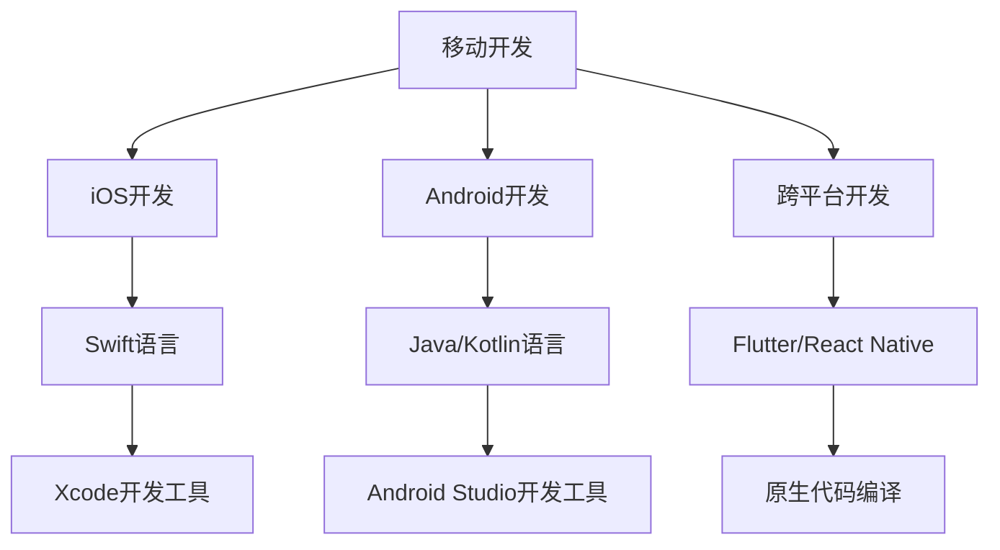

                 

# 移动端全栈开发：iOS和Android平台技能

> 关键词：移动端开发, 全栈开发, iOS, Android, Swift, Kotlin, Flutter, React Native

## 1. 背景介绍

移动应用开发是当前软件开发领域最热门的方向之一。随着智能手机和移动互联网的普及，越来越多的企业和个人开始投入到移动应用的开发中，以获取新的业务增长点和用户群体。移动端全栈开发技能，即同时掌握iOS和Android平台的开发技术，能够帮助开发者更高效地开发跨平台应用，满足不同用户的设备需求，提升用户体验，降低开发成本。本文将对iOS和Android平台的开发技能进行详细介绍，并探讨其在实际应用中的典型场景和未来发展趋势。

## 2. 核心概念与联系

### 2.1 核心概念概述

移动端全栈开发技能涵盖了iOS和Android两个平台的基本开发技术，以及跨平台开发的最新技术。主要包括：

- **iOS开发**：基于Apple的Xcode开发工具，使用Swift语言，遵循Apple的开发规范和设计模式。
- **Android开发**：基于Google的Android Studio开发工具，使用Java或Kotlin语言，遵循Android的开发规范和设计模式。
- **跨平台开发**：使用Flutter或React Native等技术，实现一套代码适配多个平台的应用开发。

这些核心概念之间的联系主要体现在以下几个方面：

1. **开发工具的通用性**：iOS和Android开发都依赖于现代化的开发工具和构建系统，如Xcode和Android Studio。
2. **编程语言的互通性**：Swift和Kotlin作为当前最流行的移动端开发语言，它们有一些共通的基础特性和语法结构，且都有丰富的第三方库和框架。
3. **设计原则的一致性**：无论是iOS还是Android，都遵循“用户为中心”的设计原则，注重界面美观、交互友好和性能优化。
4. **跨平台开发的桥梁**：Flutter和React Native等技术，通过编译成原生代码的方式，实现了代码的跨平台复用，大幅降低了开发成本。

### 2.2 核心概念原理和架构的 Mermaid 流程图



这个流程图展示了移动端全栈开发技能的核心概念及其联系：

1. **iOS开发**：通过Swift语言和Xcode工具，实现iOS应用开发。
2. **Android开发**：通过Java/Kotlin语言和Android Studio工具，实现Android应用开发。
3. **跨平台开发**：通过Flutter/React Native技术，实现一套代码适配iOS和Android平台。

这些技术相互独立，又相互依存，共同构成了现代移动端全栈开发的核心。

## 3. 核心算法原理 & 具体操作步骤

### 3.1 算法原理概述

iOS和Android平台的开发技术原理在本质上差异不大，都是基于面向对象编程(OOP)和事件驱动编程(EDP)，通过设计模式和MVC（Model-View-Controller）架构实现。但iOS和Android在平台特性和API上有所不同，需要开发者学习和适应不同的开发规范和设计模式。

### 3.2 算法步骤详解

iOS和Android的开发步骤大致相同，可以归纳为以下几个主要阶段：

1. **需求分析和设计**：通过用户调研和市场分析，明确应用需求和功能，并设计用户界面和交互流程。
2. **搭建开发环境**：安装Xcode或Android Studio，配置开发环境，包括SDK、模拟器和调试工具等。
3. **实现核心功能**：根据设计文档，实现应用的核心功能模块，如用户认证、数据存储、网络请求等。
4. **集成第三方库和框架**：引入第三方库和框架，如依赖管理工具CocoaPods或Gradle，UI控件库React Native或Flutter等。
5. **测试和优化**：通过单元测试、集成测试和用户测试，确保应用功能稳定性和性能，并进行必要的性能优化和代码重构。
6. **发布和维护**：将应用打包发布到应用商店，并根据用户反馈进行持续维护和更新。

### 3.3 算法优缺点

iOS和Android平台开发技术的优缺点如下：

#### iOS开发

**优点**：
- 统一的App Store审核机制，确保应用质量。
- Apple提供一套完整的开发工具和框架，开发效率高。
- Swift语言简洁，编译速度快，性能优秀。

**缺点**：
- iOS应用只限于苹果设备，市场规模有限。
- 更新审核严格，发布周期长。
- 生态系统相对封闭，第三方工具和库较少。

#### Android开发

**优点**：
- 开放的市场环境，用户基础广泛。
- 成熟的Android开发工具链，开发工具丰富。
- 多平台兼容性，开发者可以一次开发多次发布。

**缺点**：
- 应用市场分散，品牌碎片化，管理难度高。
- 应用生态复杂，第三方库和插件管理复杂。
- 性能优化难度大，需要考虑多设备、多版本的兼容性。

#### 跨平台开发

**优点**：
- 一次开发多平台适配，提高开发效率，降低开发成本。
- 跨平台库和框架不断涌现，丰富的开发工具和资源。
- 代码可移植性强，学习成本低。

**缺点**：
- 性能优化难度大，部分平台特性能无法充分发挥。
- 跨平台开发需要克服不同平台的差异性，调试和测试复杂。
- 编译后代码的体积较大，可能影响性能。

### 3.4 算法应用领域

iOS和Android平台开发技能在多个领域都有广泛的应用，包括但不限于：

- **电商**：构建购物、支付、物流等电商核心功能。
- **社交**：实现即时通讯、内容分享、视频直播等功能。
- **金融**：提供移动支付、理财、贷款等金融服务。
- **医疗**：实现电子病历、在线诊疗、健康管理等功能。
- **教育**：开发在线课程、作业批改、互动教学等功能。
- **政府服务**：提供政务查询、预约服务、电子证照等功能。

## 4. 数学模型和公式 & 详细讲解 & 举例说明

### 4.1 数学模型构建

移动端应用的开发不仅涉及编程技术，还涉及一些数学模型的构建，如布局优化、性能调优等。以布局优化为例，通过线性规划模型可以求解最优布局方案。

设应用界面布局为$A$，大小为$w \times h$，界面元素大小为$C_1, C_2, \ldots, C_n$，位置为$(x_i, y_i)$，则目标是最小化布局面积$S$，即：

$$
\min S = \sum_{i=1}^n C_i
$$

约束条件包括：
- 元素不重叠：$x_i + C_i \leq w$，$y_i + C_i \leq h$。
- 元素对齐：$x_i \geq 0$，$y_i \geq 0$。

### 4.2 公式推导过程

对于上述优化问题，可以建立拉格朗日函数：

$$
\mathcal{L}(\boldsymbol{x}, \boldsymbol{\lambda}) = \sum_{i=1}^n C_i + \lambda_1 (\sum_{i=1}^n C_i - S) + \lambda_2 \sum_{i=1}^n C_i (w - x_i) + \lambda_3 \sum_{i=1}^n C_i (h - y_i)
$$

分别对$x_i$、$y_i$和$S$求偏导数，得：

$$
\begin{align*}
\frac{\partial \mathcal{L}}{\partial x_i} &= C_i + \lambda_2 (h - y_i) - \lambda_1 = 0 \\
\frac{\partial \mathcal{L}}{\partial y_i} &= C_i + \lambda_3 (w - x_i) - \lambda_1 = 0 \\
\frac{\partial \mathcal{L}}{\partial S} &= 1 + \lambda_1 = 0
\end{align*}
$$

解上述方程组，可以得到布局的优化方案。

### 4.3 案例分析与讲解

以一个电商应用为例，该应用需要在有限的空间内展示商品信息、用户头像、订单状态等界面元素。通过构建上述线性规划模型，可以在不同设备尺寸和分辨率下，生成最佳的布局方案，提升用户体验和应用性能。

## 5. 项目实践：代码实例和详细解释说明

### 5.1 开发环境搭建

iOS和Android开发环境搭建如下：

#### iOS开发环境搭建

1. **安装Xcode**：从App Store下载并安装Xcode。
2. **配置macOS环境**：确保macOS系统为最新版本，并安装CocoaPods和Swift。
3. **创建新项目**：打开Xcode，创建新的iOS项目，选择App类型。

#### Android开发环境搭建

1. **安装Android Studio**：从官网下载安装Android Studio。
2. **配置Android环境**：安装Android SDK、Android NDK和AVD（Android虚拟设备）。
3. **创建新项目**：打开Android Studio，创建新的Android项目，选择Phone和Tablet应用程序类型。

### 5.2 源代码详细实现

以下是一个简单的iOS应用的代码实现，实现用户登录功能：

```swift
import UIKit

class ViewController: UIViewController {

    @IBOutlet weak var usernameTextField: UITextField!
    @IBOutlet weak var passwordTextField: UITextField!

    @IBAction func loginButtonClicked(_ sender: UIButton) {
        let username = usernameTextField.text!
        let password = passwordTextField.text!
        
        let url = URL(string: "https://example.com/login")!
        let request = URLRequest(url: url)
        
        let session = URLSession.shared.dataTask(with: request) { (data, response, error) in
            if let data = data {
                let json = try? JSONSerialization.jsonObject(with: data, options: []) as? [String: Any]
                if let authToken = json["authToken"] as? String {
                    // 用户登录成功
                } else {
                    // 用户登录失败
                }
            }
        }
        session.resume()
    }

    override func viewDidLoad() {
        super.viewDidLoad()
        // 初始化界面和事件
    }
}
```

### 5.3 代码解读与分析

上述代码实现了一个简单的iOS应用登录功能，主要步骤如下：

1. **界面布局**：在Storyboard中创建两个UITextField和一个UIButton，分别用于输入用户名和密码，以及登录按钮。
2. **事件处理**：在ViewController中添加两个IBOutlet，用于获取用户输入的文本。添加loginButtonClicked方法，处理用户点击登录按钮的事件。
3. **网络请求**：通过URLSession发送GET请求到服务器，获取登录验证信息。
4. **登录逻辑**：解析服务器返回的JSON数据，获取认证令牌，并进行登录逻辑判断。

### 5.4 运行结果展示

运行应用后，用户输入用户名和密码，点击登录按钮，应用将发送网络请求到服务器，并在界面上显示登录结果。

## 6. 实际应用场景

### 6.1 电商应用

电商应用是一个典型的移动端全栈开发案例，需要同时支持iOS和Android平台。电商应用的核心功能包括商品展示、购物车、订单管理、支付功能等，需要开发者熟悉iOS和Android平台的开发技术，同时掌握跨平台开发技术，如Flutter或React Native。

### 6.2 金融应用

金融应用通常涉及高并发、高安全性的要求，需要开发者在iOS和Android平台上实现完善的支付功能、身份认证、数据加密、安全传输等功能。此外，金融应用还必须遵守各种法律法规，如支付安全标准和隐私保护政策。

### 6.3 医疗应用

医疗应用需要处理敏感的用户数据，如病历、诊断结果等，需要在iOS和Android平台上实现安全的数据存储和传输。同时，医疗应用还需要支持语音识别、图像识别等技术，提升用户体验和诊断效率。

### 6.4 未来应用展望

未来，随着移动应用的不断发展和普及，移动端全栈开发技能的需求将进一步增加。新技术的涌现，如AR/VR、物联网等，将为移动应用开发者提供更多的机会和挑战。跨平台开发的持续演进，如Flutter、React Native等技术的不断完善，将进一步降低开发成本，提升开发效率。

## 7. 工具和资源推荐

### 7.1 学习资源推荐

- **Udacity**：提供iOS和Android开发的课程，涵盖基础知识和进阶技术。
- **Coursera**：提供移动应用开发的系列课程，涵盖React Native、Flutter等跨平台开发技术。
- **Apple Developer**：提供iOS开发的官方文档和教程，涵盖Swift语言、Xcode工具和设计模式等。
- **Google Developers**：提供Android开发的官方文档和教程，涵盖Java/Kotlin语言、Android Studio工具和设计模式等。
- **Stack Overflow**：提供丰富的开发者问答社区，解决开发过程中的各种问题。

### 7.2 开发工具推荐

- **Xcode**：苹果官方提供的iOS开发工具，功能强大，易用性高。
- **Android Studio**：谷歌官方提供的Android开发工具，支持Android开发全过程。
- **Flutter**：谷歌开源的跨平台开发框架，支持iOS和Android平台的快速开发。
- **React Native**：Facebook开源的跨平台开发框架，支持iOS和Android平台的快速开发。
- **Swift和Kotlin**：当前最流行的移动开发语言，支持多平台开发。

### 7.3 相关论文推荐

- **Deep Learning for Mobile Applications**：探讨深度学习在移动应用中的应用，如语音识别、图像处理等。
- **Human-Computer Interaction Design for Mobile Applications**：探讨移动应用的用户界面和交互设计，提升用户体验。
- **Mobile Application Development in the Cloud**：探讨云计算在移动应用开发中的应用，如云存储、云函数等。

## 8. 总结：未来发展趋势与挑战

### 8.1 研究成果总结

iOS和Android平台开发技能经过多年的发展和演进，已经成为移动应用开发的核心技能之一。当前的移动应用开发主要依赖于iOS和Android平台，同时借助跨平台开发技术，如Flutter和React Native，实现了快速开发和高效部署。

### 8.2 未来发展趋势

未来，移动应用开发将面临更多的挑战和机遇：

- **技术创新**：AR/VR、物联网等新技术的应用将为移动应用开发带来新的机遇，开发者需要不断学习新技术，提升技术能力。
- **用户体验**：用户体验将成为应用开发的核心，开发者需要更多地关注界面设计、交互流程和性能优化。
- **安全性和隐私**：移动应用涉及大量用户数据，安全性、隐私保护将成为重要的关注点，开发者需要更多地关注数据加密、安全传输等技术。
- **跨平台开发**：跨平台开发的持续演进，如Flutter和React Native等技术的不断完善，将进一步降低开发成本，提升开发效率。

### 8.3 面临的挑战

尽管移动应用开发技术不断进步，但仍然面临一些挑战：

- **技术更新快**：新技术的快速涌现，要求开发者不断学习和适应，增加了学习成本和开发难度。
- **市场竞争激烈**：移动应用市场的竞争日益激烈，要求开发者不断提高应用质量和用户体验。
- **平台差异性**：iOS和Android平台在API、开发规范等方面存在差异，需要开发者具备跨平台开发能力。

### 8.4 研究展望

未来的研究将聚焦于以下几个方向：

- **混合开发模式**：探索将iOS和Android开发技术混合使用的模式，提高开发效率和代码复用性。
- **跨平台性能优化**：研究如何在跨平台开发中优化性能，提高应用响应速度和用户体验。
- **自动化测试**：开发更高效、更全面的自动化测试工具，提升应用的质量和稳定性。
- **云原生应用**：研究云原生技术在移动应用开发中的应用，提升应用的扩展性和可维护性。

## 9. 附录：常见问题与解答

**Q1：iOS和Android开发的区别是什么？**

A: iOS和Android开发的主要区别在于平台特性和开发规范。iOS开发使用Swift语言，遵循Apple的开发规范和设计模式；Android开发使用Java或Kotlin语言，遵循Android的开发规范和设计模式。此外，iOS应用只能在苹果设备上运行，而Android应用可以在多种品牌和型号的设备上运行。

**Q2：如何提升iOS和Android应用的用户体验？**

A: 提升用户体验需要从界面设计、交互流程和性能优化等多个方面入手：
- 界面设计：注重界面美观、布局合理、颜色协调，提升用户的视觉体验。
- 交互流程：设计简洁、直观的操作流程，使用户能快速完成任务。
- 性能优化：优化应用加载速度、响应时间和资源消耗，提升用户的使用体验。

**Q3：如何进行移动端应用的跨平台开发？**

A: 跨平台开发主要依赖于Flutter和React Native等技术，可以概括为以下几个步骤：
- 选择合适的跨平台开发框架，如Flutter或React Native。
- 安装开发工具，并配置开发环境。
- 创建新项目，并引入跨平台库和框架。
- 实现核心功能模块，并编写跨平台代码。
- 测试和优化应用性能，并进行发布部署。

**Q4：移动端开发常用的第三方库和框架有哪些？**

A: 移动端开发常用的第三方库和框架包括：
- Swift库：如SwiftyBeans、Alamofire、Moya等。
- Java/Kotlin库：如Retrofit、Glide、RxJava等。
- 跨平台库：如Flutter、React Native、WebRTC等。

**Q5：移动端开发需要掌握哪些核心技术？**

A: 移动端开发需要掌握的核心技术包括：
- iOS和Android平台开发技术，如Swift、Java/Kotlin、Xcode、Android Studio等。
- 跨平台开发技术，如Flutter、React Native等。
- 前端技术，如HTML、CSS、JavaScript等。
- 后端技术，如RESTful API、数据库等。

---

作者：禅与计算机程序设计艺术 / Zen and the Art of Computer Programming

