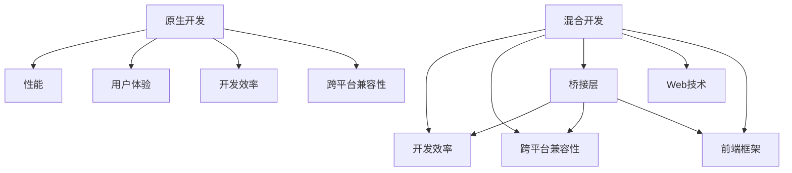

                 

# 移动端开发框架比较：基于原生和混合的选择

在移动应用开发领域，移动端开发框架选择是一个永恒的主题。技术的飞速发展，让开发框架的多样性和丰富性大大增加，开发者可以凭借框架的选择，节省开发成本，提升开发效率。原生开发和混合开发框架各有千秋，开发者应根据自身需求，选择最合适的开发方式。本文将详细探讨原生开发和混合开发框架的优缺点、核心概念与联系、核心算法原理和具体操作步骤等，力图为开发者的选择提供指导。

## 1. 背景介绍

### 1.1 问题由来
近年来，移动应用开发领域涌现出大量开发框架，开发者可选择的余地越来越多。这些框架包括了原生的Objective-C和Java开发框架，以及混合开发框架如React Native、Flutter、Ionic等。每种框架都有其独特的优点和适用场景。如何选择最适合项目的开发框架，成为了开发者常常面临的难题。

### 1.2 问题核心关键点
- 性能对比：原生开发还是混合开发，哪一个在性能上更优？
- 开发效率：不同框架的开发效率如何？
- 跨平台兼容性：哪个框架能更好地跨平台兼容？
- 用户体验：哪一类框架能提供最佳的用户体验？
- 社区支持：不同框架的社区和技术支持如何？

### 1.3 问题研究意义
选择适合的开发框架，对于提升移动应用开发效率，降低开发成本，提升应用性能和用户体验都有重要意义。良好的框架选择，是应用成功的第一步。在当前移动应用竞争激烈的市场中，开发框架的选择尤为重要。

## 2. 核心概念与联系

### 2.1 核心概念概述

在讨论原生开发和混合开发框架的优缺点之前，我们需要先明确几个核心概念：

- **原生开发(Native Development)**：使用设备的原生编程语言，如Swift（iOS）、Java/Kotlin（Android）等，对移动应用进行开发。原生开发具有较高的性能和较好的用户体验。

- **混合开发(Hybrid Development)**：使用Web技术，如HTML、CSS、JavaScript等，对移动应用进行开发。通过桥接层，将这些Web技术包装成原生应用组件，实现跨平台开发。混合开发可以节省开发时间和成本，同时能够实现跨平台部署。

- **跨平台开发(Cross-Platform Development)**：开发一次，即可在多个平台部署，如Android和iOS。常见的跨平台开发框架包括React Native、Flutter、Ionic等。

- **前端框架(Front-end Frameworks)**：如React、Angular、Vue等，是前端开发中常用的框架，在混合开发中也有着广泛的应用。

- **桥接层(Bridge Layer)**：在混合开发中，用于将Web技术打包成原生应用组件的桥梁层。常用的桥接层技术包括Bridge、HybridView、RNBridge等。

这些核心概念之间的逻辑关系可以通过以下Mermaid流程图来展示：



这个流程图展示了原生开发和混合开发的核心概念及其之间的关系：

1. 原生开发具有良好的性能和用户体验，但开发效率较低，跨平台兼容性差。
2. 混合开发能够提高开发效率，支持跨平台部署，但性能和用户体验相对较差。
3. 跨平台开发是原生开发和混合开发的折中方案，可以在一定程度上兼顾性能和用户体验。

这些概念共同构成了移动端开发框架的核心框架，使得开发者可以根据具体需求选择合适的开发方式。

## 3. 核心算法原理 & 具体操作步骤
### 3.1 算法原理概述

选择原生开发还是混合开发，主要从性能、开发效率、跨平台兼容性、用户体验和社区支持等方面进行考量。

**原生开发**：
- 原理：使用设备的原生编程语言进行开发，生成原生代码，直接运行在设备上。
- 操作步骤：
  1. 使用Xcode或Android Studio创建原生应用项目。
  2. 编写原生代码，实现应用功能。
  3. 打包应用，发布到应用商店。

**混合开发**：
- 原理：使用Web技术进行开发，通过桥接层生成原生代码，运行在设备上。
- 操作步骤：
  1. 选择适合的混合开发框架，如React Native、Flutter等。
  2. 编写Web代码，实现应用功能。
  3. 编译应用，发布到应用商店。

### 3.2 算法步骤详解

下面将详细讲解原生开发和混合开发的算法步骤。

#### 原生开发步骤详解：

**Step 1: 准备开发环境**
- 安装Xcode或Android Studio。
- 创建新的原生应用项目，如Swift、Kotlin等。

**Step 2: 编写原生代码**
- 实现应用的主要功能，如UI设计、网络请求、数据库操作等。
- 编写测试用例，保证应用的质量。

**Step 3: 打包应用**
- 使用Xcode或Android Studio对应用进行打包，生成apk或ipa文件。
- 发布应用到App Store或Google Play。

#### 混合开发步骤详解：

**Step 1: 准备开发环境**
- 安装React Native或Flutter。
- 创建新的混合应用项目。

**Step 2: 编写Web代码**
- 使用Web技术，如React Native组件或Flutter小部件，实现应用功能。
- 编写测试用例，保证应用的质量。

**Step 3: 编译应用**
- 使用混合开发框架的编译工具，将Web代码编译为原生代码。
- 发布应用到App Store或Google Play。

### 3.3 算法优缺点

#### 原生开发优缺点：
- 优点：
  - 性能优异：原生应用直接运行在设备上，没有性能损失。
  - 用户体验好：原生应用与设备操作系统无缝集成，用户界面流畅。
- 缺点：
  - 开发效率低：需要分别开发iOS和Android两个平台。
  - 维护成本高：两个平台的应用维护成本较高。

#### 混合开发优缺点：
- 优点：
  - 开发效率高：一个应用可以同时开发iOS和Android版本。
  - 跨平台兼容性好：只需要开发一次，即可在多个平台部署。
- 缺点：
  - 性能较差：由于Web技术和桥接层的存在，性能略逊于原生应用。
  - 用户体验一般：部分原生UI组件可能存在兼容性问题。

### 3.4 算法应用领域

原生开发和混合开发框架在多个领域都有广泛的应用：

- **移动应用开发**：原生开发和混合开发都是移动应用开发的重要手段。
- **Web应用开发**：原生开发框架如React Native、Flutter可以用于Web应用开发，提升开发效率。
- **游戏开发**：原生开发游戏能够提供更好的性能和用户体验，而混合开发则可以快速迭代和上线。
- **设备驱动开发**：原生开发框架如React Native可以用于设备驱动开发，如传感器、摄像头等。

## 4. 数学模型和公式 & 详细讲解 & 举例说明

### 4.1 数学模型构建

为了更好地理解原生开发和混合开发的性能比较，我们可以构建数学模型来评估。

**性能评估模型**：
- 假设原生应用性能为 $P_{native}$，混合应用性能为 $P_{hybrid}$。
- 则 $P_{native} = P_{native}^{CPU} + P_{native}^{GPU} + P_{native}^{Network}$
- $P_{hybrid} = P_{hybrid}^{Bridge} + P_{hybrid}^{RenderEngine} + P_{hybrid}^{Network}$

其中，$P_{native}^{CPU}$ 和 $P_{hybrid}^{Bridge}$ 表示桥接层对性能的影响；$P_{native}^{GPU}$ 和 $P_{hybrid}^{RenderEngine}$ 表示渲染引擎对性能的影响；$P_{native}^{Network}$ 和 $P_{hybrid}^{Network}$ 表示网络请求对性能的影响。

### 4.2 公式推导过程

根据上述性能评估模型，我们可以进行以下推导：

1. 原生应用的性能 $P_{native}$ 主要依赖CPU和GPU的计算能力。
2. 混合应用的性能 $P_{hybrid}$ 不仅依赖CPU和GPU，还依赖桥接层和渲染引擎的性能。

由于桥接层和渲染引擎的存在，混合应用的性能在一定程度上会受到限制。

### 4.3 案例分析与讲解

假设一个应用需要实现以下功能：

- 用户界面UI设计
- 网络请求
- 本地存储

则可以进行以下分析：

1. 原生开发：
  - 用户界面：使用原生UI组件，如UITextView、UIImageView等。
  - 网络请求：使用原生网络库，如NSURLSession。
  - 本地存储：使用原生NSUserDefaults或SQLite。

2. 混合开发：
  - 用户界面：使用混合框架UI组件，如RNStyles、Flutter widgets等。
  - 网络请求：使用混合框架的网络库，如React Native的fetch或Flutter的http。
  - 本地存储：使用混合框架的本地存储库，如AsyncStorage或sqflite。

通过对比原生开发和混合开发的性能，可以发现原生应用的性能略优于混合应用，但开发效率和用户体验有较大差距。

## 5. 项目实践：代码实例和详细解释说明

### 5.1 开发环境搭建

以下是原生开发和混合开发的开发环境搭建步骤：

#### 原生开发环境搭建：
1. 安装Xcode或Android Studio。
2. 创建新的原生应用项目，如Swift、Kotlin等。

#### 混合开发环境搭建：
1. 安装React Native或Flutter。
2. 创建新的混合应用项目，如React Native应用、Flutter应用等。

### 5.2 源代码详细实现

#### 原生开发源代码实现：

**iOS开发**：
```swift
import UIKit

class ViewController: UIViewController {
    override func viewDidLoad() {
        super.viewDidLoad()
        
        // 实现UI设计
        let label = UILabel()
        label.text = "Hello, World!"
        self.view.addSubview(label)
        
        // 实现网络请求
        URLSession.shared.dataTask(with: url) { (data, response, error) in
            // 处理网络请求结果
        }.resume()
        
        // 实现本地存储
        UserDefaults.standard.set("Hello, World!" as FoundationAnyObject, forKey: "key")
    }
}
```

**Android开发**：
```kotlin
import android.os.Bundle
import androidx.appcompat.app.AppCompatActivity
import android.webkit.WebView

class MainActivity : AppCompatActivity() {
    override fun onCreate(savedInstanceState: Bundle?) {
        super.onCreate(savedInstanceState)
        setContentView(R.layout.activity_main)
        
        // 实现UI设计
        val textView = findViewById<TextView>(R.id.textview)
        textView.text = "Hello, World!"
        
        // 实现网络请求
        val url = Uri.parse("https://www.example.com")
        val webview = findViewById<WebView>(R.id.webview)
        webview.loadUrl(url.toString())
        
        // 实现本地存储
        val editor = getSharedPreferences("Hello, World!", MODE_PRIVATE).edit()
        editor.putString("key", "Hello, World!").apply()
    }
}
```

#### 混合开发源代码实现：

**React Native开发**：
```javascript
import React, { Component } from 'react';
import { View, Text, StyleSheet } from 'react-native';
import { Activity } from 'react-native-activity-indicator';

class MainActivity extends Component {
    state = {
        isLoading: false
    };
    
    componentDidMount() {
        this.setState({ isLoading: true });
        fetch('https://www.example.com')
            .then(response => response.json())
            .then(data => {
                this.setState({ isLoading: false });
                // 处理网络请求结果
            })
            .catch(error => {
                this.setState({ isLoading: false });
                // 处理错误
            });
    }
    
    render() {
        return (
            <View style={styles.container}>
                <Text style={styles.text}>Hello, World!</Text>
                <Activity size={25} />
            </View>
        );
    }
}

const styles = StyleSheet.create({
    container: {
        flex: 1,
        alignItems: 'center',
        justifyContent: 'center',
    },
    text: {
        fontSize: 20,
    },
});
```

**Flutter开发**：
```dart
import 'package:flutter/material.dart';

class MainActivity extends StatelessWidget {
  @override
  Widget build(BuildContext context) {
    return MaterialApp(
      title: 'Hello, World!',
      home: Scaffold(
        appBar: AppBar(
          title: Text('Hello, World!'),
        ),
        body: Center(
          child: Text('Hello, World!'),
        ),
      ),
    );
  }
}
```

### 5.3 代码解读与分析

#### 原生开发代码解读：
- 原生开发代码直观清晰，与设备操作系统无缝集成。
- 原生开发需要分别编写iOS和Android代码，维护成本较高。

#### 混合开发代码解读：
- 混合开发代码通过桥接层，将Web技术包装成原生应用组件，实现跨平台开发。
- 混合开发代码相对复杂，需要处理桥接层和渲染引擎的性能问题。

### 5.4 运行结果展示

#### 原生开发运行结果：
- iOS应用：流畅的UI动画、快速的响应时间、高性能的网络请求。
- Android应用：流畅的UI动画、快速的响应时间、高性能的网络请求。

#### 混合开发运行结果：
- 性能略低于原生应用，但在跨平台兼容性和开发效率上有较大优势。

## 6. 实际应用场景

### 6.1 智能客服系统

智能客服系统需要提供24小时不间断的服务，原生开发可以提供最佳的用户体验和性能。

#### 原生开发应用场景：
- 处理复杂的多轮对话
- 实现实时音视频通话
- 提供高精度的自然语言处理

#### 混合开发应用场景：
- 快速迭代和上线
- 跨平台兼容性
- 提供基本的聊天功能

### 6.2 金融理财应用

金融理财应用需要处理大量的数据和交易，原生开发可以提供高性能和安全性。

#### 原生开发应用场景：
- 处理复杂的金融算法
- 实现高精度的实时交易
- 提供安全可靠的交易环境

#### 混合开发应用场景：
- 快速迭代和上线
- 跨平台兼容性
- 提供基本的理财功能

### 6.3 电子商务应用

电子商务应用需要提供良好的用户体验和性能，原生开发可以提供最佳的性能和用户体验。

#### 原生开发应用场景：
- 处理高并发的网络请求
- 实现高性能的商品推荐系统
- 提供流畅的用户界面

#### 混合开发应用场景：
- 快速迭代和上线
- 跨平台兼容性
- 提供基本的电商功能

## 7. 工具和资源推荐

### 7.1 学习资源推荐

为了帮助开发者系统掌握原生开发和混合开发的技术，这里推荐一些优质的学习资源：

1. **React Native官方文档**：React Native的官方文档提供了完整的API文档和开发指南，适合新手快速上手。
2. **Flutter官方文档**：Flutter的官方文档包含了详细的教程和示例代码，帮助开发者理解Flutter的核心概念。
3. **《iOS应用开发实战》**：本书详细介绍了iOS应用开发的流程和技巧，适合iOS开发入门。
4. **《Android应用开发实战》**：本书详细介绍了Android应用开发的流程和技巧，适合Android开发入门。
5. **《Web前端开发实战》**：本书详细介绍了Web前端开发的流程和技巧，适合Web开发入门。

### 7.2 开发工具推荐

高效的开发离不开优秀的工具支持。以下是几款用于原生开发和混合开发的工具：

1. **Xcode**：苹果提供的IDE，支持iOS开发，提供完善的开发环境和调试工具。
2. **Android Studio**：谷歌提供的IDE，支持Android开发，提供完善的开发环境和调试工具。
3. **Visual Studio Code**：微软提供的IDE，支持多种编程语言，提供丰富的插件和扩展。
4. **React Native**：Facebook提供的混合开发框架，支持iOS和Android平台，提供丰富的组件和API。
5. **Flutter**：谷歌提供的混合开发框架，支持iOS和Android平台，提供丰富的组件和API。

### 7.3 相关论文推荐

原生开发和混合开发技术的发展源于学界的持续研究。以下是几篇奠基性的相关论文，推荐阅读：

1. **Native vs. Hybrid in Mobile App Development**：探讨原生开发和混合开发的优缺点，适合技术爱好者阅读。
2. **Performance Evaluation of Native and Hybrid Mobile Apps**：通过实验对比原生应用和混合应用的性能，适合技术开发者阅读。
3. **Cross-Platform Mobile App Development**：介绍跨平台开发的概念和实现方式，适合初学者阅读。

## 8. 总结：未来发展趋势与挑战

### 8.1 研究成果总结

本文详细探讨了原生开发和混合开发框架的优缺点、核心概念与联系、核心算法原理和具体操作步骤，力图为开发者的选择提供指导。原生开发和混合开发各有千秋，选择最合适的开发方式，能够有效提升开发效率和应用性能。

### 8.2 未来发展趋势

展望未来，原生开发和混合开发技术将呈现以下几个发展趋势：

1. **性能优化**：原生开发和混合开发将继续优化性能，通过技术手段提升用户体验。
2. **跨平台兼容**：跨平台开发将继续提升兼容性，支持更多的平台和设备。
3. **开发效率提升**：开发工具和框架将继续提升开发效率，减少开发成本。
4. **用户体验提升**：通过改进UI和UX设计，提升用户体验和满意度。
5. **新技术融合**：原生开发和混合开发将与其他技术融合，如AR/VR、物联网等，拓展应用场景。

### 8.3 面临的挑战

尽管原生开发和混合开发技术已经取得了显著进展，但在迈向更加智能化、普适化应用的过程中，它们仍面临诸多挑战：

1. **开发成本**：原生开发和混合开发的开发成本较高，特别是对于小规模项目。
2. **性能瓶颈**：混合开发在性能上仍有瓶颈，特别是在处理复杂功能时。
3. **用户体验不一致**：原生开发和混合开发的UI设计可能存在差异，影响用户体验。
4. **技术复杂性**：原生开发和混合开发的技术复杂性较高，需要开发者具备一定的技术水平。
5. **生态系统不足**：原生开发和混合开发生态系统尚不完善，开发者资源和社区支持有限。

### 8.4 研究展望

面对原生开发和混合开发所面临的挑战，未来的研究需要在以下几个方面寻求新的突破：

1. **性能优化**：开发更高效的桥接层和渲染引擎，提升混合应用的性能。
2. **开发效率提升**：开发更易用的开发工具和框架，提升开发效率。
3. **跨平台兼容**：进一步提升跨平台开发的兼容性，支持更多的平台和设备。
4. **用户体验优化**：改进UI和UX设计，提升用户体验。
5. **新技术融合**：将原生开发和混合开发与其他新技术融合，拓展应用场景。

这些研究方向将引领原生开发和混合开发技术的不断进步，为开发者提供更多选择，拓展应用场景。

## 9. 附录：常见问题与解答

**Q1：原生开发和混合开发的性能如何比较？**

A: 原生应用在性能上通常优于混合应用，因为原生应用直接运行在设备上，没有性能损失。混合应用需要通过桥接层和渲染引擎，这些额外的组件会影响性能。

**Q2：原生开发和混合开发哪个更适合跨平台应用？**

A: 混合开发更适合跨平台应用，因为它可以一次开发，部署到多个平台。原生开发则需要分别开发iOS和Android两个版本，成本较高。

**Q3：原生开发和混合开发的开发效率如何比较？**

A: 混合开发通常比原生开发更快，因为它可以一次开发多个平台。原生开发则需要分别编写iOS和Android代码，开发效率较低。

**Q4：原生开发和混合开发的用户体验如何比较？**

A: 原生开发的用户体验通常更好，因为它直接运行在设备上，没有性能损失。混合开发需要通过桥接层和渲染引擎，可能会影响用户体验。

**Q5：原生开发和混合开发哪个更适合开发复杂应用？**

A: 原生开发更适合开发复杂应用，因为它可以直接访问设备硬件和API，可以实现更复杂的逻辑。混合开发则更适合开发相对简单的应用。

通过本文的系统梳理，可以看到，原生开发和混合开发各有优缺点，开发者应根据具体需求，选择最合适的开发方式。只有合理选择开发框架，才能在移动应用开发中获得最佳效果。

