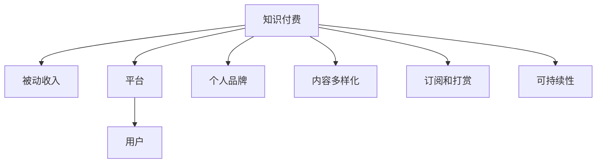

                 

# 程序员利用知识付费实现被动收入的秘诀

## 1. 背景介绍

在数字化、网络化的今天，程序员不再仅仅是代码的编写者，他们还成为了知识内容的提供者。随着知识付费平台的兴起，程序员可以借助自己的专业技能，通过知识付费的方式获得被动收入。无论是兼职还是全职，知识付费为程序员提供了新的职业机会和发展空间。本文将探讨程序员利用知识付费实现被动收入的秘诀，帮助广大程序员实现职业转型和财务自由。

## 2. 核心概念与联系

### 2.1 核心概念概述

为了更好地理解如何通过知识付费实现被动收入，本节将介绍几个关键概念及其相互之间的联系：

- **知识付费**：指通过平台或个人向用户提供有价值的知识内容，以付费形式获取回报。这种模式让专家能够分享自己的知识和经验，获取经济收益。

- **被动收入**：指通过投资或非劳动性工作获得的不需要主动努力就能持续产生的收入。对于程序员而言，利用知识付费平台分享技术文章、视频教程等，能够在不增加工作量的情况下实现收入增长。

- **知识付费平台**：如得到、知乎live、知识星球等，为知识提供者和消费者搭建起桥梁，促进了知识的市场化。

- **个人品牌建设**：通过持续在知识付费平台上发布有价值的内容，树立个人品牌，提升知名度和影响力。

- **内容多样化**：知识付费的内容形式多样，包括文章、视频、直播、课程等，满足不同用户的需求。

- **用户订阅和打赏**：知识付费的盈利模式包括订阅和打赏，用户为优质内容支付费用，创作者因此获得收入。

- **可持续性**：知识付费模式具有较强的可持续性，通过不断输出高质量内容，可以持续吸引用户付费。

这些概念之间的逻辑关系可以通过以下Mermaid流程图来展示：



这个流程图展示出知识付费与其他相关概念的联系：

1. 知识付费是被动收入的重要来源之一。
2. 平台是知识付费的基础，提供交易和交流的环境。
3. 个人品牌是创作者提升影响力的手段。
4. 内容多样化满足用户多样化的需求。
5. 订阅和打赏是知识付费的主要盈利模式。
6. 可持续性保证了知识付费的长期发展。

## 3. 核心算法原理 & 具体操作步骤
### 3.1 算法原理概述

知识付费的盈利模型主要基于订阅和打赏。核心算法原理是通过平台收集用户的数据，对内容进行个性化推荐，增加用户的订阅和打赏意愿。同时，平台也会根据内容的质量和受欢迎程度进行收益分配，激励创作者输出更多优质内容。

### 3.2 算法步骤详解

知识付费的算法步骤可以分为以下几个关键环节：

**Step 1: 内容创作与发布**
- 选择合适的知识付费平台，注册并创建个人账号。
- 创作符合平台规范的优质内容，如文章、视频、直播等。
- 定期发布新内容，保持更新频率。

**Step 2: 内容分发与推荐**
- 利用平台的分发机制，将内容推送给目标用户。
- 使用机器学习算法对用户数据进行分析，个性化推荐相关内容。
- 通过数据分析和A/B测试，优化推荐算法，提高用户满意度。

**Step 3: 用户互动与反馈**
- 鼓励用户留言、评论、点赞等互动行为。
- 根据用户反馈不断改进内容，提升用户体验。
- 设置打赏机制，激励用户对优质内容进行付费支持。

**Step 4: 收益计算与分配**
- 平台根据订阅用户数量、打赏金额、内容质量等因素计算创作者收益。
- 定期向创作者支付收益，保障创作者的经济利益。

### 3.3 算法优缺点

知识付费算法的主要优点包括：

1. **高效匹配**：利用推荐算法能够高效地将内容推荐给感兴趣的用户，提高内容的曝光率和转化率。
2. **多样化内容**：内容多样化能够满足不同用户的需求，扩大创作者的用户基础。
3. **激励机制**：打赏和订阅机制能够激励创作者持续输出优质内容。

然而，该算法也存在一些局限性：

1. **质量参差不齐**：虽然平台能够推荐优质内容，但用户对内容的评判标准不同，容易陷入劣币驱逐良币的困境。
2. **依赖平台**：创作者依赖平台的分发和收益分配机制，难以完全掌控收益和曝光。
3. **市场竞争**：知识付费市场竞争激烈，创作者需要不断创新才能保持竞争力。
4. **内容盗版**：部分创作者通过盗版或抄袭他人内容，损害原创者的利益。

### 3.4 算法应用领域

知识付费的算法广泛应用于以下几个领域：

- **技术教程**：如编程语言、框架、工具等。
- **职场技能**：如简历撰写、面试技巧、项目管理等。
- **个人发展**：如时间管理、财务管理、心理学等。
- **娱乐和兴趣**：如游戏攻略、摄影技巧、音乐欣赏等。
- **教育培训**：如中小学辅导、职业教育、职业认证等。

## 4. 数学模型和公式 & 详细讲解 & 举例说明

### 4.1 数学模型构建

知识付费的数学模型主要涉及以下几个变量：

- $C$：创作者发布的总内容数
- $U$：用户的总人数
- $R_i$：用户对第$i$个内容的评分
- $P_i$：用户对第$i$个内容的打赏金额
- $S_i$：用户对第$i$个内容的订阅次数
- $A_i$：第$i$个内容的广告曝光次数

通过这些变量，可以构建如下的收益模型：

$$
\text{收益} = \alpha \times \left( \sum_{i=1}^{C} \left( \beta \times R_i + \gamma \times P_i + \delta \times S_i \right) \right) + \epsilon \times A_i
$$

其中，$\alpha$、$\beta$、$\gamma$、$\delta$为模型的权重，$\epsilon$为误差项。

### 4.2 公式推导过程

以订阅收入为例，推导过程如下：

设用户对内容的订阅数量为$S$，则订阅收入$I$可以表示为：

$$
I = S \times P
$$

其中$P$为用户单次订阅价格。

根据平台的数据统计，可以得出用户订阅内容$i$的期望值$E(S_i)$为：

$$
E(S_i) = \frac{\sum_{j=1}^{U} I_j}{U}
$$

其中$I_j$为第$j$个用户对内容$i$的订阅次数。

将$I$代入上式，可得：

$$
E(S_i) = \frac{\sum_{j=1}^{U} S_j \times P}{U}
$$

进一步化简可得：

$$
S_i = E(S_i) \times \frac{U}{P}
$$

因此，创作者的总订阅收入$I'$可以表示为：

$$
I' = \sum_{i=1}^{C} S_i \times P
$$

代入上式可得：

$$
I' = \frac{U}{P} \times \sum_{i=1}^{C} E(S_i)
$$

结合之前的收益模型，最终可以得出总收益$B$的表达式：

$$
B = \alpha \times \left( \sum_{i=1}^{C} \left( \beta \times R_i + \gamma \times P_i + \delta \times S_i \right) \right) + \epsilon \times A_i
$$

### 4.3 案例分析与讲解

以一位技术博客作者为例，分析其如何通过知识付费实现被动收入。

**案例背景**：
某技术博客作者拥有大量技术文章和视频教程，希望通过知识付费平台实现被动收入。

**内容发布**：
作者在知识付费平台上创建账号，发布了一系列编程语言、算法、数据结构等内容。

**内容分发**：
平台根据作者的浏览数据、订阅数据、打赏数据等，对内容进行推荐，提高内容的曝光率和用户转化率。

**用户互动**：
用户对作者的某篇文章进行留言、点赞、评论，作者及时回复互动，提升用户粘性。

**收益计算**：
平台根据订阅次数、打赏金额、广告曝光等数据计算收益，定期向作者支付。

通过以上步骤，作者实现了技术文章、视频教程等内容的变现，增加了被动收入。

## 5. 项目实践：代码实例和详细解释说明

### 5.1 开发环境搭建

知识付费平台的开发环境搭建需要以下几个步骤：

1. 选择合适的开发语言和框架，如Python和Flask。
2. 安装相应的依赖库，如MySQL数据库、Redis缓存等。
3. 搭建服务器环境，支持高并发请求。

**示例代码**：

```python
from flask import Flask, render_template
import mysql.connector

app = Flask(__name__)

@app.route('/')
def index():
    return render_template('index.html')

if __name__ == '__main__':
    app.run(debug=True)
```

### 5.2 源代码详细实现

下面是一个简单的知识付费平台后台管理系统示例，用于管理创作者和内容：

**示例代码**：

```python
import mysql.connector
from flask import Flask, request, render_template

app = Flask(__name__)

# 连接MySQL数据库
mydb = mysql.connector.connect(
  host="localhost",
  user="yourusername",
  password="yourpassword",
  database="mydatabase"
)

# 创建内容表
mycursor = mydb.cursor()
mycursor.execute("CREATE TABLE content (id INT AUTO_INCREMENT PRIMARY KEY, title VARCHAR(255), content TEXT, creator VARCHAR(255), publish_date DATE)")

# 添加内容
def add_content(title, content, creator):
    sql = "INSERT INTO content (title, content, creator, publish_date) VALUES (%s, %s, %s, NOW())"
    val = (title, content, creator)
    mycursor.execute(sql, val)
    mydb.commit()

@app.route('/add_content', methods=['GET', 'POST'])
def add_content_page():
    if request.method == 'POST':
        title = request.form['title']
        content = request.form['content']
        creator = request.form['creator']
        add_content(title, content, creator)
        return redirect('/')
    return render_template('add_content.html')

# 获取内容
def get_content(id):
    sql = "SELECT * FROM content WHERE id = %s"
    val = (id,)
    mycursor.execute(sql, val)
    result = mycursor.fetchone()
    return result

@app.route('/content/<id>')
def content_page(id):
    content = get_content(id)
    return render_template('content.html', content=content)

if __name__ == '__main__':
    app.run(debug=True)
```

### 5.3 代码解读与分析

**代码解读**：
- 使用Flask框架搭建Web应用。
- 通过MySQL数据库存储内容信息，包括标题、内容、作者、发布日期等。
- 提供添加内容和获取内容的功能，实现基本的后台管理。

**代码分析**：
- 该示例代码简单实现了后台管理系统，支持添加和查看内容。
- 实际应用中，还需要考虑权限控制、数据安全、日志记录等高级功能。
- 数据库连接和查询部分使用了MySQL Connector库，需要根据实际环境配置连接参数。

## 6. 实际应用场景

### 6.1 技术博客

技术博客是知识付费的重要应用场景之一。技术博主通过分享自己的技术心得、项目经验、开发技巧等内容，吸引读者订阅和打赏。

**应用示例**：
某技术博主在CSDN、掘金等平台上发布文章，吸引了大量读者订阅和打赏。博主还可以提供专属会员服务，如提供高级技术文章、一对一咨询等。

### 6.2 在线课程

在线课程是知识付费的另一重要形式。通过在线课程平台，程序员可以分享自己的课程，如编程语言、框架、算法等。

**应用示例**：
某程序员在网易云课堂、慕课网等平台上发布编程语言教程，获得了大量订阅和打赏。博主还可以设立专属VIP会员，提供更多课程和专属服务。

### 6.3 技术咨询

技术咨询是指程序员提供技术支持，帮助用户解决问题。这种模式可以结合知识付费，通过付费咨询方式获取收益。

**应用示例**：
某技术博主在知乎上提供技术咨询服务，用户可以付费提问，博主回答后获得报酬。这种方式可以帮助博主积累粉丝和收入，提升影响力。

### 6.4 未来应用展望

未来，知识付费将有以下几个发展趋势：

1. **多渠道分发**：知识付费平台将拓展更多渠道，如视频平台、社交媒体等，实现内容的全面覆盖。
2. **AI推荐系统**：利用AI算法提高内容推荐准确度，增加用户粘性。
3. **内容众筹**：用户可以众筹支付内容创作，获得专属权益，如优先发布、专属互动等。
4. **内容付费墙**：设置付费墙，通过付费才能访问高质量内容，提升内容的价值感。
5. **虚拟现实和增强现实**：通过VR/AR技术，提供沉浸式学习体验，增强用户的互动感。

## 7. 工具和资源推荐

### 7.1 学习资源推荐

为了帮助程序员系统掌握知识付费的相关知识，这里推荐一些优质的学习资源：

1. **《知识付费时代：内容创作者指南》**：一本关于知识付费的全面书籍，涵盖内容创作、平台运营、用户互动等多个方面。

2. **《付费内容营销：打造粉丝经济》**：一书介绍如何通过付费内容吸引用户，构建粉丝经济。

3. **《流量变现：打造粉丝经济》**：一本关于流量变现的实战指南，帮助创作者实现商业变现。

4. **《互联网营销与流量变现》**：一门关于互联网营销和流量变现的在线课程，涵盖流量获取、内容运营、收益分配等多个方面。

5. **《知识付费平台技术架构设计》**：一篇关于知识付费平台技术架构的深度文章，涵盖平台设计、数据存储、安全防护等多个技术点。

通过对这些资源的学习实践，相信程序员能够快速掌握知识付费的精髓，实现职业转型和财务自由。

### 7.2 开发工具推荐

知识付费平台的开发需要考虑多种技术栈，以下是几款常用的开发工具：

1. **Flask**：Python轻量级Web框架，适合快速开发Web应用。
2. **Django**：Python全功能Web框架，适合大型Web应用开发。
3. **MySQL**：关系型数据库，适合存储结构化数据。
4. **Redis**：内存数据库，适合缓存和实时数据处理。
5. **Docker**：容器化技术，适合部署和管理Web应用。
6. **Kubernetes**：容器编排工具，适合自动化管理多个容器。

合理利用这些工具，可以显著提升知识付费平台的开发效率和稳定性。

### 7.3 相关论文推荐

知识付费的相关研究主要集中在以下几个方面：

1. **《内容推荐系统：理论与实践》**：介绍内容推荐系统的基本原理和算法实现。
2. **《知识付费用户行为分析与建模》**：分析知识付费平台用户行为，提出针对性的推荐策略。
3. **《付费内容平台的商业化策略》**：探讨付费内容平台的盈利模式和商业化策略。
4. **《知识付费平台的数据安全与隐私保护》**：研究知识付费平台的数据安全与隐私保护问题。
5. **《知识付费平台的可持续性发展策略》**：提出知识付费平台的可持续发展策略，保障平台健康发展。

这些论文代表了大规模知识付费平台的研究方向，值得深入学习。

## 8. 总结：未来发展趋势与挑战

### 8.1 总结

本文对程序员利用知识付费实现被动收入的方法进行了全面系统的介绍。首先，阐述了知识付费的背景和意义，明确了被动收入的重要性和实现途径。其次，从原理到实践，详细讲解了知识付费的算法原理和操作步骤，提供了知识付费平台的代码实例和详细解读。同时，本文还探讨了知识付费在技术博客、在线课程、技术咨询等场景中的应用，展示了知识付费的广阔前景。最后，推荐了相关的学习资源和开发工具，帮助程序员掌握知识付费的关键技能。

通过本文的系统梳理，可以看到，知识付费为程序员提供了一条全新的职业发展路径，具有广阔的市场潜力和应用前景。相信随着知识付费市场的不断成熟，程序员能够利用这一模式实现个人价值和经济利益的双重提升。

### 8.2 未来发展趋势

展望未来，知识付费领域将呈现以下几个发展趋势：

1. **内容个性化**：利用AI技术，根据用户兴趣和行为数据，提供个性化的内容推荐，提升用户体验。
2. **内容多样化**：随着用户需求的多样化，知识付费平台将提供更多类型的内容，如视频、直播、音频等。
3. **平台多样化**：知识付费平台将拓展更多渠道，实现内容的全面覆盖。
4. **用户互动增强**：利用AI、VR/AR等技术，增强用户互动和沉浸感，提升用户粘性。
5. **生态系统构建**：知识付费平台将构建完整的生态系统，涵盖创作者、用户、平台等多方利益。

这些趋势凸显了知识付费领域的广阔前景，为创作者和用户提供了更多可能性。

### 8.3 面临的挑战

尽管知识付费领域前景广阔，但在实际应用中也面临着一些挑战：

1. **市场竞争激烈**：知识付费平台众多，创作者需要不断创新，才能在激烈的市场竞争中脱颖而出。
2. **内容质量参差不齐**：创作者良莠不齐，部分内容质量低劣，容易误导用户。
3. **用户信任问题**：用户对知识付费平台和创作者存在信任问题，需要平台和创作者共同努力，建立信任机制。
4. **收益分配不公**：平台与创作者之间的收益分配机制可能存在不公，影响创作者的经济利益。
5. **盗版和抄袭**：部分创作者通过盗版或抄袭他人内容，损害原创者的利益。

这些挑战需要创作者和平台共同应对，建立公正合理的生态系统。

### 8.4 研究展望

未来，知识付费领域的研究将重点关注以下几个方面：

1. **内容质量控制**：建立严格的内容审核机制，保障内容的质量和真实性。
2. **用户信任建设**：通过平台的公开透明、用户反馈机制等，增强用户对平台的信任。
3. **收益分配优化**：建立公平合理的收益分配机制，保障创作者的经济利益。
4. **内容多样化创新**：开发更多形式的内容，如短视频、互动直播等，提升用户体验。
5. **AI与知识付费结合**：利用AI技术提升内容推荐和用户互动的效果，增强平台的智能化水平。

这些研究方向将推动知识付费平台的持续发展和优化，为创作者和用户带来更多价值。

## 9. 附录：常见问题与解答

**Q1：知识付费平台如何选择？**

A: 选择知识付费平台时，要考虑平台的用户规模、内容质量、盈利模式、用户体验等因素。一般而言，平台用户越多，内容质量越高，盈利模式越合理，用户体验越好，越适合创作者选择。

**Q2：如何提升内容曝光率？**

A: 提升内容曝光率可以通过以下几个方法：
1. 优化SEO，提升内容的搜索排名。
2. 利用平台推荐算法，精准推送给目标用户。
3. 利用社交媒体、博客等渠道进行推广。
4. 与其他创作者进行合作，互相推荐内容。

**Q3：如何激励用户付费？**

A: 激励用户付费可以通过以下几个方法：
1. 提供高质量、有价值的内容，满足用户需求。
2. 设置专属会员，提供特权和优惠。
3. 提供限时优惠、专属折扣等激励措施。
4. 通过用户互动，建立社区氛围，提升用户粘性。

**Q4：如何管理内容版权？**

A: 管理内容版权可以通过以下几个方法：
1. 发布原创声明，明确版权归属。
2. 利用版权保护工具，如版权登记、数字水印等。
3. 与平台签订版权协议，明确版权归属和收益分配。
4. 积极打击盗版行为，保护原创者利益。

**Q5：如何维护用户隐私？**

A: 维护用户隐私可以通过以下几个方法：
1. 遵守隐私保护法律法规，如GDPR等。
2. 保护用户数据安全，防止数据泄露。
3. 明确隐私政策，告知用户数据使用方式。
4. 用户数据存储和处理时，进行数据加密。

通过这些问答，希望能帮助程序员更好地理解知识付费的相关问题和解决方法，实现职业转型和财务自由。

---

作者：禅与计算机程序设计艺术 / Zen and the Art of Computer Programming

