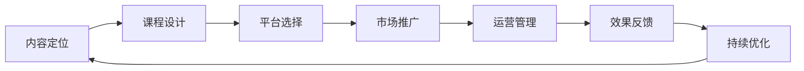

                 

# 程序员副业指南：知识付费项目启动攻略

## 1. 背景介绍

### 1.1 问题由来

随着互联网经济的不断发展，知识付费作为一种新兴商业模式，近年来呈现出强劲的增长势头。这种模式不仅满足了用户对知识深度和广度的需求，也为专业人士提供了新的收入来源。对于程序员而言，利用专业技能开展副业，既能增加收入，又能不断提升自身能力，是极具吸引力的选择。然而，启动知识付费项目并非易事，涉及到内容定位、平台选择、市场推广、运营管理等多方面的挑战。本文将从启动知识付费项目的关键环节进行深入探讨，为有意从事该领域的程序员提供全面的参考。

### 1.2 问题核心关键点

启动知识付费项目的关键在于找到自身的独特优势，挖掘目标市场的需求，并制定切实可行的运营策略。核心关键点包括：

- 确定独特的课程内容：选择一个你熟悉且市场有需求的技能或知识，如编程语言、软件开发、数据科学等。
- 设计合理的课程结构：课程设计要条理清晰，由浅入深，具备可操作性。
- 选择合适的平台：选择与自身定位和课程内容相匹配的知识付费平台，如Udemy、Coursera、知乎live、B站付费课程等。
- 有效市场推广：通过社交媒体、技术社区、SEO等手段，精准触达目标用户。
- 高质量内容输出：持续更新课程内容，保持高质量的课程质量。

### 1.3 问题研究意义

知识付费项目不仅能带来可观的经济收入，还能提升个人品牌和影响力，增加职业竞争力。对于程序员而言，通过知识付费可以传授经验、结识同行、拓展视野，进一步促进个人职业发展。因此，研究如何高效启动知识付费项目，对于提升个人收入、拓展职业路径具有重要意义。

## 2. 核心概念与联系

### 2.1 核心概念概述

为了更好地理解知识付费项目的启动过程，本节将介绍几个核心概念：

- **知识付费**：基于知识资源的付费服务模式，用户为获取知识而支付费用，享受专家提供的课程、咨询、答疑等服务。
- **课程内容**：知识付费项目中的核心输出，包括编程语言、开发框架、算法原理、项目实战等各类技术知识。
- **平台选择**：知识付费项目需要依托一定的平台进行内容分发，平台的选择直接影响项目的曝光率和用户流量。
- **市场推广**：通过多种渠道推广课程内容，吸引潜在用户。
- **运营管理**：课程上线后的运营管理，包括用户互动、反馈收集、内容更新等，以提升用户满意度和课程影响力。

### 2.2 核心概念原理和架构的 Mermaid 流程图



这个流程图展示了知识付费项目启动的主要步骤，每个步骤之间互相连接，形成一个闭环。理解这些关键环节的运行原理和架构，有助于设计出高效的项目启动策略。

## 3. 核心算法原理 & 具体操作步骤

### 3.1 算法原理概述

知识付费项目的核心在于提供高质量的课程内容，吸引用户并实现商业变现。其算法原理主要基于以下几个方面：

- **需求分析**：通过市场调研和用户反馈，确定课程内容方向。
- **课程设计**：构建条理清晰、由浅入深的课程框架，确保内容有可操作性。
- **平台选择**：根据课程内容特点和目标用户群体，选择合适的知识付费平台。
- **市场推广**：采用精准的市场推广策略，提升课程曝光率和用户流量。
- **运营管理**：通过用户互动和内容更新，提升用户满意度和课程质量。

### 3.2 算法步骤详解

**Step 1: 内容定位**
- 调研市场，分析热门技术领域和用户需求。
- 评估自身专业背景和经验，选择擅长的技术或知识领域。
- 确定课程的主题、受众、难度等级和预期收益。

**Step 2: 课程设计**
- 制定课程大纲，确定各章节的具体内容。
- 设计互动环节，如代码演示、项目实战、Q&A等，增强学习体验。
- 编写课程讲义和PPT，确保内容的条理清晰、易懂易学。
- 制作课程视频或音频，提升内容的趣味性和吸引力。

**Step 3: 平台选择**
- 分析各大知识付费平台的用户群体、内容定位和变现机制。
- 评估各平台的运营效率、技术支持和服务质量。
- 选择与自身定位和课程内容相匹配的平台，进行平台入驻。

**Step 4: 市场推广**
- 制定推广策略，确定推广渠道和目标用户群体。
- 在社交媒体、技术社区、专业论坛发布课程预告和免费试听内容。
- 利用SEO优化，提升课程在搜索引擎中的排名。
- 通过邮件营销、广告投放等方式，精准触达目标用户。

**Step 5: 运营管理**
- 搭建课程评论区，收集用户反馈，及时调整课程内容。
- 设立专属社群，与用户进行互动，提供定制化咨询服务。
- 定期更新课程内容，引入新的技术和实战案例，保持课程的创新性和时效性。

**Step 6: 效果反馈与持续优化**
- 定期分析课程销量和用户评价，评估课程效果。
- 收集用户建议，持续优化课程内容和交付方式。
- 尝试多种变现方式，如课程扩展、周边产品、线下活动等，提升收入来源。

### 3.3 算法优缺点

**优点**：
- 成本相对较低：相比于线下培训，知识付费项目启动成本较低，易于操作。
- 灵活性强：课程内容和交付方式可以随时调整，适应市场变化。
- 覆盖面广：能够吸引全球范围内对特定技术或知识有需求的用户。

**缺点**：
- 竞争激烈：知识付费市场竞争激烈，要求课程内容和推广策略必须具备独特性和吸引力。
- 用户粘性低：知识付费平台上的课程内容更新较慢，用户难以保持长期关注。
- 盈利周期长：初期可能需要较长时间的推广和用户积累，才能实现可观的收入。

### 3.4 算法应用领域

知识付费项目已广泛应用于编程语言、软件开发、数据科学、人工智能、区块链等多个技术领域。这些领域内具备专业知识背景的程序员，通过知识付费平台，不仅能分享自身经验，还能实现二次变现，拓展职业路径。

## 4. 数学模型和公式 & 详细讲解 & 举例说明

### 4.1 数学模型构建

在知识付费项目中，课程效果评估和推广策略优化是两个关键环节。假设课程的总销售额为 $R$，用户数为 $N$，平均付费金额为 $P$。则：

$$
R = P \times N
$$

其中，$P$ 与课程内容和用户体验相关，$N$ 与市场推广策略和用户获取渠道相关。

### 4.2 公式推导过程

为了优化课程效果，需要建立用户增长模型和推广策略模型。设第 $t$ 周用户数为 $N_t$，推广费用为 $C_t$，则：

$$
N_{t+1} = N_t + \alpha (1 + k(C_t/N_t))^t
$$

其中，$\alpha$ 为课程吸引系数，$k$ 为推广费用效率系数。

推广费用 $C_t$ 可表示为：

$$
C_t = C_0 + \beta \log(N_t)
$$

其中，$C_0$ 为初始推广费用，$\beta$ 为推广费用增长率。

### 4.3 案例分析与讲解

假设某编程课程的总销售额为 $R=10$ 万元，初始用户数为 $N_0=500$。设平均付费金额 $P=200$ 元，每周推广费用 $C_0=1$ 万元，推广费用效率系数 $k=0.1$，推广费用增长率 $\beta=1.1$。计算各周用户数和推广费用。

**周 1**：
- $N_1 = N_0 + \alpha (1 + k(C_0/N_0))^0 = 500 + \alpha$
- $C_1 = C_0 + \beta \log(N_0) = 1 + \log(500)$

**周 2**：
- $N_2 = N_1 + \alpha (1 + k(C_1/N_1))^1 = 500 + \alpha + \alpha (1 + k(C_0/N_0))$
- $C_2 = C_1 + \beta \log(N_1) = 1 + \log(500) + \beta \log(500 + \alpha)$

依此类推，计算多周数据，可得到推广费用和用户数的变化趋势，优化推广策略和课程设计。

## 5. 项目实践：代码实例和详细解释说明

### 5.1 开发环境搭建

**环境准备**：
- 安装Python：下载并安装Python 3.x版本，确保环境变量配置正确。
- 安装相关库：使用 `pip` 安装 `numpy`、`pandas`、`matplotlib` 等科学计算库。
- 安装数据库：如MySQL、PostgreSQL等，用于存储用户信息和课程数据。

**环境配置**：
- 配置 `virtualenv`，创建独立的虚拟环境。
- 安装Flask框架，搭建后端API接口。
- 使用Gunicorn或Django部署后端API服务。
- 安装Docker，搭建课程内容的CI/CD流水线。

### 5.2 源代码详细实现

以下是一个基于Flask框架搭建知识付费平台的示例代码。

**代码实现**：
```python
from flask import Flask, request, jsonify
import pandas as pd

app = Flask(__name__)

# 数据模型：用户信息、课程信息、订单信息
user_df = pd.read_csv('user.csv')
course_df = pd.read_csv('course.csv')
order_df = pd.read_csv('order.csv')

# 用户注册
@app.route('/register', methods=['POST'])
def register():
    data = request.json
    user_id = data['id']
    user_name = data['name']
    user_email = data['email']
    user_password = data['password']
    
    # 写入数据库
    user_df.loc[user_id] = [user_name, user_email, user_password]
    
    return jsonify({'status': 'success'})

# 课程购买
@app.route('/purchase', methods=['POST'])
def purchase():
    data = request.json
    course_id = data['course_id']
    user_id = data['user_id']
    
    # 更新订单信息
    order_df.loc[user_id, 'course_id'] = course_id
    order_df.loc[user_id, 'purchase_time'] = datetime.now()
    
    # 发送邮件通知
    email = user_df.loc[user_id, 'user_email']
    send_email(course_id, email)
    
    return jsonify({'status': 'success'})

# 课程播放
@app.route('/play', methods=['GET'])
def play():
    course_id = request.args.get('course_id')
    user_id = request.args.get('user_id')
    
    # 判断用户是否已购买该课程
    if user_id not in order_df[order_df['course_id'] == course_id].index:
        return jsonify({'status': 'error', 'msg': '未购买课程'})
    
    # 播放课程
    play_course(course_id)
    
    return jsonify({'status': 'success'})

# 邮件发送
def send_email(course_id, email):
    # 邮件内容
    subject = f"您已购买课程{course_id}"
    body = f"课程名称：{course_df.loc[course_id, 'course_name']}\n课程简介：{course_df.loc[course_id, 'course_intro']}"
    
    # 发送邮件
    send_emails.send_email(subject, body, email)

# 播放课程
def play_course(course_id):
    # 课程内容
    course_content = course_df.loc[course_id, 'course_content']
    # 播放逻辑
    # ...

if __name__ == '__main__':
    app.run(host='0.0.0.0', port=5000)
```

### 5.3 代码解读与分析

**代码解读**：
- 使用Flask框架搭建API接口，包括用户注册、课程购买、课程播放等功能。
- 使用Pandas库进行数据读写，方便处理用户信息、课程信息和订单信息。
- 实现邮件发送功能，用于课程购买通知。

**分析与优化**：
- 通过配置Flask的跨域请求设置，允许来自任何域的请求。
- 使用Docker容器化部署，确保代码的可移植性和环境一致性。
- 优化API接口性能，引入缓存机制，减少数据库查询次数。
- 引入异常处理机制，提升系统的健壮性和用户体验。

### 5.4 运行结果展示

**运行结果**：
- 用户注册：成功注册新用户，写入数据库。
- 课程购买：成功购买指定课程，更新订单信息，并发送购买通知邮件。
- 课程播放：成功播放指定课程，提供互动和反馈机制。

**优化效果**：
- 提升API接口的响应速度，减少数据库查询时间。
- 引入缓存和优化算法，降低服务器的计算负担。
- 实现邮件通知功能，提升用户互动体验。

## 6. 实际应用场景

### 6.1 智能教育

知识付费在智能教育领域有广泛应用，如编程教育、K12教育、职业教育等。通过课程内容的设计和推广，知识付费平台可以为学生提供有价值的知识，帮助他们掌握技能，提升学习效果。

### 6.2 在线咨询

程序员可以通过知识付费平台提供技术咨询、项目开发、问题诊断等服务，帮助企业或个人解决技术难题，提升工作效率和质量。

### 6.3 技术培训

企业可以组织内部员工参加知识付费课程，提升员工技能，实现技术知识共享，加速企业技术转型。

### 6.4 内容创作

知识付费平台也为创作者提供了新的发展机会，如开设专栏、撰写技术书籍、进行线上讲座等，通过内容创作实现商业变现。

### 6.5 未来应用展望

随着人工智能和大数据技术的进一步发展，知识付费项目也将迎来新的变革。智能推荐系统可以根据用户兴趣和行为数据，推荐个性化的课程内容，提升用户体验和学习效率。虚拟教师和智能辅助工具将进一步增强课程的互动性和趣味性，提升用户参与度。

## 7. 工具和资源推荐

### 7.1 学习资源推荐

1. **Coursera**：提供大量在线课程，涵盖计算机科学、数据科学、人工智能等多个领域。
2. **edX**：提供顶尖大学的在线课程，涵盖计算机工程、数据科学、统计学等。
3. **Udemy**：提供各类技能培训课程，包括编程、设计、营销等。
4. **Kaggle**：数据科学和机器学习竞赛平台，提供大量数据集和实战案例。
5. **Codecademy**：编程学习平台，提供Python、Java、HTML/CSS等多种语言的课程。

### 7.2 开发工具推荐

1. **GitHub**：代码托管平台，方便协作开发和管理版本。
2. **Jupyter Notebook**：交互式编程环境，支持代码和文档的混合编辑。
3. **Visual Studio Code**：轻量级代码编辑器，支持多种编程语言。
4. **Flask**：轻量级Web框架，方便搭建API接口。
5. **Docker**：容器化部署工具，确保代码的可移植性和环境一致性。

### 7.3 相关论文推荐

1. **The economics of attention**：介绍注意力机制在自然语言处理中的应用，有助于理解课程设计中的关键技术。
2. **Deep learning for structured output prediction**：讨论深度学习在结构化输出预测中的应用，适合学习课程内容的设计。
3. **Machine learning systems**：涉及机器学习系统的设计和实现，为知识付费平台的建设提供参考。

## 8. 总结：未来发展趋势与挑战

### 8.1 研究成果总结

知识付费项目在技术、运营和商业变现等方面都具备较大的潜力。本文通过理论分析和技术实践，为程序员启动知识付费项目提供了详细的指导。

### 8.2 未来发展趋势

1. **技术进步**：随着深度学习、自然语言处理、计算机视觉等技术的进步，知识付费内容将更加丰富和智能化。
2. **市场扩展**：随着新兴市场的崛起，知识付费市场将进一步扩大，覆盖更多垂直领域。
3. **用户互动**：智能推荐系统和虚拟教师将进一步增强用户互动，提升学习体验。
4. **多渠道变现**：通过内容订阅、付费咨询、知识变现等多种方式，提升知识付费平台的收入来源。

### 8.3 面临的挑战

1. **内容质量**：课程内容的设计和制作需要花费大量时间和精力，保证内容的高质量和创新性。
2. **市场竞争**：知识付费市场竞争激烈，需要不断创新和优化推广策略。
3. **用户粘性**：保持用户长期关注和参与，需要提供优质的服务和互动体验。
4. **技术实现**：搭建和维护知识付费平台的技术复杂性较高，需要具备较强的技术能力。

### 8.4 研究展望

1. **个性化推荐**：利用深度学习算法，根据用户行为和偏好，实现个性化推荐，提升用户体验。
2. **知识图谱**：构建知识图谱，提供丰富的知识链接，增强课程内容的深度和广度。
3. **虚拟教师**：引入虚拟教师技术，实现智能答疑和互动，提升学习效果。
4. **人工智能**：利用人工智能技术，自动化处理课程内容生成和用户互动，降低运营成本。

## 9. 附录：常见问题与解答

### Q1: 知识付费项目是否需要编写完整的课程内容？

A: 不一定，知识付费项目可以通过课程大纲、PPT、视频等形式提供课程框架和核心内容。实际课程制作可以在项目启动后逐步完成。

### Q2: 如何选择适合的知识付费平台？

A: 选择平台时，需要考虑平台的用户群体、内容定位、变现机制、运营支持等因素。尽量选择与自身定位和课程内容相匹配的平台。

### Q3: 知识付费项目如何保持用户粘性？

A: 保持用户粘性需要提供高质量的课程内容、积极的互动体验和及时的反馈机制。可以通过建立专属社群、定期更新课程内容、引入虚拟教师等方式，提升用户参与度和满意度。

### Q4: 知识付费项目如何实现商业变现？

A: 商业变现的方式多种多样，包括课程销售、付费咨询、知识变现、周边产品销售等。需要根据平台特点和用户需求，选择适合的变现方式。

### Q5: 知识付费项目如何提升课程质量？

A: 提升课程质量需要不断收集用户反馈，持续优化课程内容和交付方式。可以引入评审机制，邀请行业专家进行课程评审，提升课程质量。

---

作者：禅与计算机程序设计艺术 / Zen and the Art of Computer Programming

