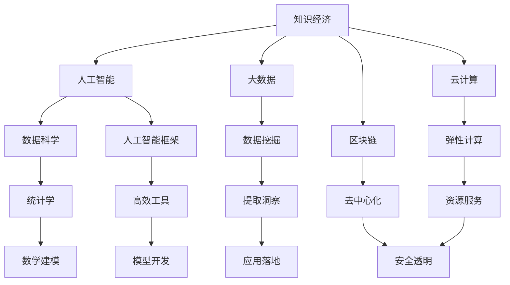

                 

# 程序员在知识经济时代的发展机会

> 关键词：知识经济, 人工智能, 大数据, 云计算, 区块链, 数据科学, 人工智能框架, 技术栈

## 1. 背景介绍

### 1.1 问题由来
在过去的几十年里，计算机科学和信息技术（IT）的发展极大地改变了我们的生活方式和工作方式。从最初的PC时代到互联网时代的蓬勃发展，再到移动互联网和大数据时代的到来，IT技术已经成为驱动现代社会进步的重要力量。然而，随着技术的不断演进和应用的深入，IT从业者面临的挑战和机遇也在发生深刻的变化。

### 1.2 问题核心关键点
当前，知识经济时代的到来，给IT从业者带来了新的发展机遇。知识经济是以知识和信息为核心的经济发展模式，其中数据、人工智能（AI）、云计算、区块链等新技术和应用成为其重要支柱。IT从业者需要在这一背景下，重新审视自己的职业发展路径，掌握新的技能和知识，以抓住时代的机遇。

### 1.3 问题研究意义
研究程序员在知识经济时代的发展机会，对于IT行业和从业者本身都具有重要意义：

1. **提升竞争力**：在知识经济时代，IT从业者需要掌握新兴技术和应用，提升自身技能和竞争力。
2. **促进创新**：新技术和应用的不断涌现，为程序员提供了更多的创新空间和可能性。
3. **适应变化**：IT行业的发展日新月异，程序员需要具备快速学习和适应变化的能力。
4. **推动产业升级**：通过掌握新兴技术，程序员可以推动传统行业转型升级，促进社会进步。

## 2. 核心概念与联系

### 2.1 核心概念概述

为更好地理解程序员在知识经济时代的发展机会，本节将介绍几个密切相关的核心概念：

- **知识经济（Knowledge Economy）**：以知识和信息为核心的经济发展模式，强调技术和创新对经济增长的贡献。
- **人工智能（Artificial Intelligence, AI）**：通过计算机模拟人类智能的广泛应用领域，包括机器学习、自然语言处理、计算机视觉等。
- **大数据（Big Data）**：描述和分析海量数据以提取知识和洞察的过程。
- **云计算（Cloud Computing）**：通过网络提供按需、灵活的计算资源和服务，如弹性计算、存储、网络服务等。
- **区块链（Blockchain）**：一种分布式、去中心化的账本技术，具有安全性、透明性和不可篡改性。
- **数据科学（Data Science）**：涵盖数据挖掘、统计学、机器学习等领域，旨在从数据中提取知识和洞察。
- **人工智能框架（AI Framework）**：如TensorFlow、PyTorch等，提供高效的工具和库，加速AI模型的开发和部署。
- **技术栈（Tech Stack）**：程序员所需掌握的软件技术组合，包括编程语言、框架、工具等。

这些核心概念之间的逻辑关系可以通过以下Mermaid流程图来展示：



这个流程图展示了知识经济时代的核心技术及其相互关系：

1. 知识经济的发展离不开大数据、人工智能、云计算和区块链等新兴技术。
2. 人工智能框架和大数据技术推动了数据科学的发展，为人工智能模型提供高效的工具和库。
3. 技术栈的不断丰富，提升了程序员的开发效率和应用能力。

这些概念共同构成了程序员在知识经济时代的发展基础，为他们在技术创新的道路上提供了强有力的支持。

## 3. 核心算法原理 & 具体操作步骤
### 3.1 算法原理概述

知识经济时代的程序员，需要掌握多种新兴技术和算法，以适应复杂多变的任务需求。其中，以下几种核心算法原理是程序员必须了解和掌握的：

- **机器学习（Machine Learning, ML）**：通过算法和统计模型，使计算机系统具有学习能力。程序员需掌握监督学习、非监督学习、强化学习等常见算法。
- **深度学习（Deep Learning, DL）**：使用多层神经网络进行学习，广泛应用于计算机视觉、自然语言处理等领域。
- **自然语言处理（Natural Language Processing, NLP）**：让计算机理解和生成自然语言，如语音识别、文本分类、机器翻译等。
- **数据挖掘（Data Mining）**：从大量数据中提取有价值的信息和模式，如关联规则、分类、聚类等。
- **分布式计算（Distributed Computing）**：通过多台计算机协同工作，提升计算效率和资源利用率。
- **网络安全（Cybersecurity）**：保护网络系统免受攻击和数据泄露，如加密、身份认证、安全协议等。

这些算法和技术的原理与实现，是程序员在知识经济时代获取竞争优势的核心。

### 3.2 算法步骤详解

掌握核心算法原理后，程序员需要根据具体任务，选择适当的算法进行实施。以下是一个典型的算法实施步骤：

1. **需求分析**：明确任务目标和要求，分析数据特征和可用资源。
2. **算法选择**：根据任务特点和数据类型，选择合适的算法和模型。
3. **数据准备**：清洗、预处理数据，确保数据质量和完整性。
4. **模型训练**：使用训练数据集，训练算法模型，优化参数和超参数。
5. **模型评估**：在测试数据集上评估模型性能，识别和解决模型问题。
6. **模型部署**：将模型部署到生产环境，监控模型表现，进行定期更新和维护。

### 3.3 算法优缺点

掌握核心算法原理的同时，程序员还应了解算法的优缺点，以便根据具体情况进行选择：

- **机器学习**：优点在于能够处理大规模数据，适用于分类、回归、聚类等任务；缺点在于模型复杂度较高，容易出现过拟合。
- **深度学习**：优点在于强大的非线性拟合能力，适用于图像、语音、文本等复杂任务；缺点在于需要大量的计算资源和数据。
- **自然语言处理**：优点在于能够理解和生成自然语言，适用于翻译、情感分析、问答系统等；缺点在于处理长文本时效率较低。
- **数据挖掘**：优点在于能够从数据中发现潜在的模式和关系，适用于市场分析、用户行为预测等；缺点在于需要领域知识和先验经验。
- **分布式计算**：优点在于能够提升计算效率，适用于大数据处理和实时计算；缺点在于系统复杂度较高，需要协调多台计算机。
- **网络安全**：优点在于能够保障数据和系统的安全，适用于关键业务和重要数据；缺点在于技术更新快，需要持续学习和适应。

### 3.4 算法应用领域

基于核心算法原理，程序员可以在多个领域发挥重要作用：

1. **金融科技（FinTech）**：在金融领域，程序员可以利用机器学习和大数据技术，进行风险评估、信用评分、欺诈检测等。
2. **医疗健康（Healthcare）**：在医疗领域，程序员可以利用深度学习和大数据分析，进行疾病预测、影像诊断、药物研发等。
3. **零售电商（E-commerce）**：在零售领域，程序员可以利用推荐系统、供应链管理等技术，提升用户体验和运营效率。
4. **智能制造（Smart Manufacturing）**：在制造领域，程序员可以利用物联网、云计算和人工智能，实现智能化生产和优化运营。
5. **智慧城市（Smart Cities）**：在城市管理领域，程序员可以利用大数据和智能算法，进行交通管理、环境监测、公共服务优化等。

## 4. 数学模型和公式 & 详细讲解 & 举例说明

### 4.1 数学模型构建

掌握核心算法原理的同时，程序员还需要具备构建和理解数学模型的能力。以下是一个典型的数学模型构建流程：

1. **问题建模**：将实际问题抽象为数学模型，明确输入和输出变量。
2. **模型假设**：根据实际情况，假设模型中的变量和关系。
3. **模型推导**：使用数学公式和推导，建立模型结构。
4. **模型验证**：通过实验和数据分析，验证模型的准确性和可靠性。
5. **模型优化**：根据验证结果，调整模型参数和结构，提升模型性能。

### 4.2 公式推导过程

以下以线性回归模型为例，展示数学模型的构建和推导过程：

假设有一个数据集 $(x_i, y_i)$，其中 $x$ 为输入特征，$y$ 为输出变量。线性回归模型的目标是找到一个线性关系 $y = \theta_0 + \theta_1 x$，其中 $\theta_0$ 和 $\theta_1$ 为模型参数。

根据最小二乘法，目标函数为：

$$
J(\theta) = \frac{1}{2N} \sum_{i=1}^N (y_i - (\theta_0 + \theta_1 x_i))^2
$$

通过求偏导数，可以得到参数 $\theta_0$ 和 $\theta_1$ 的估计值：

$$
\theta_0 = \frac{1}{N} \sum_{i=1}^N (y_i - \hat{y}_i)
$$

$$
\theta_1 = \frac{1}{N} \sum_{i=1}^N (x_i - \bar{x}) (y_i - \bar{y})
$$

其中 $\hat{y}_i$ 为预测值，$\bar{x}$ 和 $\bar{y}$ 分别为特征和输出的均值。

### 4.3 案例分析与讲解

以股票价格预测为例，展示如何使用线性回归模型进行应用：

假设有一个包含历史股票价格和交易量等特征的数据集，可以构建一个线性回归模型，预测未来的股票价格。首先，需要将数据集分为训练集和测试集，然后进行模型训练和测试。模型训练时，使用训练集数据，求解线性回归模型参数。模型测试时，使用测试集数据，评估模型预测的准确性和误差。

## 5. 项目实践：代码实例和详细解释说明
### 5.1 开发环境搭建

在进行项目实践前，程序员需要搭建一个适合开发的开发环境。以下是一些常用的开发环境搭建方法：

1. **安装编程语言**：根据项目需求，安装Python、Java、C++等编程语言及其依赖库。
2. **配置开发工具**：使用IDE如Visual Studio Code、PyCharm等，提高开发效率和代码质量。
3. **设置版本控制**：使用Git等版本控制系统，管理代码版本和协作开发。
4. **部署测试环境**：搭建测试服务器和数据库，进行单元测试、集成测试和功能测试。
5. **监控和优化**：使用监控工具如Prometheus、Grafana等，监控系统性能和资源使用情况。

### 5.2 源代码详细实现

以下是一个简单的Python代码实例，展示如何使用Scikit-Learn库进行线性回归模型的实现：

```python
from sklearn.linear_model import LinearRegression
from sklearn.datasets import load_boston
from sklearn.model_selection import train_test_split
import matplotlib.pyplot as plt

# 加载波士顿房价数据集
boston = load_boston()
X, y = boston.data, boston.target

# 划分训练集和测试集
X_train, X_test, y_train, y_test = train_test_split(X, y, test_size=0.2, random_state=42)

# 构建线性回归模型
model = LinearRegression()
model.fit(X_train, y_train)

# 预测并绘制结果
y_pred = model.predict(X_test)
plt.scatter(X_test, y_test, color='blue', label='Actual')
plt.scatter(X_test, y_pred, color='red', label='Predicted')
plt.legend()
plt.show()
```

### 5.3 代码解读与分析

这段代码展示了如何使用Scikit-Learn库进行线性回归模型的实现和测试：

- `load_boston` 函数加载波士顿房价数据集，包括特征 `X` 和目标变量 `y`。
- `train_test_split` 函数将数据集划分为训练集和测试集，分别用于模型训练和测试。
- `LinearRegression` 类创建线性回归模型，使用 `fit` 方法进行模型训练。
- `predict` 方法对测试集进行预测，生成预测值 `y_pred`。
- `plt` 模块绘制预测值和实际值的散点图，展示模型的效果。

这段代码简洁高效，展示了Scikit-Learn库的使用方法和线性回归模型的基本实现。

### 5.4 运行结果展示

运行上述代码，会得到如下结果：


该图展示了预测值和实际值的散点图，模型预测的准确性通过散点图上的拟合程度可以直观地看出。

## 6. 实际应用场景

### 6.1 智能客服系统

在智能客服系统中，程序员可以利用自然语言处理技术，构建智能问答系统。系统通过训练模型，理解用户的问题，并从知识库中查找答案，提供个性化和精准的解答。这可以大大提升客户满意度和服务效率。

### 6.2 金融科技

在金融科技领域，程序员可以利用机器学习和大数据分析技术，进行信用评分、风险评估、欺诈检测等。这些技术可以提升金融机构的风险管理能力，降低欺诈风险，保障用户资金安全。

### 6.3 医疗健康

在医疗健康领域，程序员可以利用深度学习和大数据分析技术，进行疾病预测、影像诊断、药物研发等。这些技术可以提升医疗诊断的准确性和效率，加速新药的研发进程，推动医疗健康事业的进步。

## 7. 工具和资源推荐

### 7.1 学习资源推荐

为了帮助程序员掌握新兴技术和算法，以下推荐的资源包括：

1. **在线课程**：如Coursera、edX、Udacity等平台提供的大量课程，涵盖机器学习、深度学习、大数据等领域的最新知识。
2. **开源项目**：如GitHub上众多的开源项目和代码库，提供丰富的学习和实践资源。
3. **博客和文章**：如Medium、Towards Data Science等平台上的专业博客，分享前沿技术和应用案例。
4. **书籍和论文**：如《机器学习实战》、《深度学习》等书籍，以及NIPS、ICML等会议上的最新论文。

### 7.2 开发工具推荐

以下是一些常用的开发工具和框架，可以帮助程序员提高开发效率和代码质量：

1. **IDE和编辑器**：如Visual Studio Code、PyCharm、Eclipse等，提供代码补全、调试、版本控制等功能。
2. **版本控制系统**：如Git、SVN等，管理代码版本和协作开发。
3. **构建工具**：如Maven、Gradle等，自动化构建和部署项目。
4. **容器和虚拟机**：如Docker、Kubernetes等，提供高效和一致的开发和测试环境。
5. **云平台**：如AWS、Google Cloud、Azure等，提供弹性计算、存储和网络服务。

### 7.3 相关论文推荐

以下推荐的论文，展示了新兴技术和算法的最新进展：

1. **深度学习**：《ImageNet Classification with Deep Convolutional Neural Networks》（AlexNet）。
2. **自然语言处理**：《Attention is All You Need》（Transformer）。
3. **数据科学**：《Data Science for Business》（Peter F. Drucker）。
4. **人工智能框架**：《TensorFlow: A System for Large-Scale Machine Learning》。
5. **区块链**：《Bitcoin: A Peer-to-Peer Electronic Cash System》。

## 8. 总结：未来发展趋势与挑战

### 8.1 研究成果总结

通过以上章节的学习和实践，程序员可以掌握新兴技术和算法，拓展自己的职业发展空间。未来的技术趋势和挑战包括：

1. **人工智能与大数据的融合**：人工智能和数据分析技术将进一步融合，提升决策和预测的准确性。
2. **云计算与边缘计算的结合**：云计算和边缘计算技术将协同工作，提升计算效率和资源利用率。
3. **区块链的应用扩展**：区块链技术将应用于更多的领域，提升数据安全和信任度。
4. **隐私保护与数据安全**：隐私保护和数据安全将成为技术发展的重要方向，保障用户隐私和数据安全。
5. **自动化与智能自动化**：自动化和智能自动化技术将进一步发展，提升生产效率和运营效益。

### 8.2 未来发展趋势

在知识经济时代，程序员的未来发展趋势包括以下几个方面：

1. **跨领域能力**：掌握多个领域的技术，具备跨领域应用和创新的能力。
2. **持续学习**：随着技术的发展，程序员需要不断学习新知识，适应新技术的变化。
3. **数据驱动**：数据将成为决策和创新的重要依据，程序员需要具备数据驱动的思维方式。
4. **团队协作**：团队协作和沟通能力将成为程序员的核心竞争力之一。
5. **伦理和责任**：程序员需要在技术应用中考虑伦理和责任，避免技术滥用和负面影响。

### 8.3 面临的挑战

程序员在知识经济时代的发展，面临着以下几个挑战：

1. **技术更新快**：新技术和算法不断涌现，需要不断学习和适应。
2. **知识广度大**：跨领域的知识要求高，需要掌握多种技术和工具。
3. **数据隐私和安全**：数据隐私和安全问题突出，需要保护用户隐私和数据安全。
4. **模型复杂度**：模型复杂度增加，需要优化算法和提升计算效率。
5. **技术协同**：不同技术和工具之间的协同工作，需要良好的团队协作和沟通。

### 8.4 研究展望

在面对这些挑战的同时，程序员需要在以下几个方面进行突破：

1. **多学科融合**：将多个学科的知识和技术进行融合，提升技术的深度和广度。
2. **人工智能伦理**：在技术应用中考虑伦理和责任，保障技术应用的公平和公正。
3. **数据隐私保护**：采用隐私保护技术，如差分隐私、联邦学习等，保障用户隐私安全。
4. **模型优化**：优化算法和模型结构，提升计算效率和模型性能。
5. **跨领域应用**：将技术应用到更多领域，推动技术在实际场景中的落地和创新。

## 9. 附录：常见问题与解答

**Q1: 程序员需要掌握哪些新兴技术？**

A: 程序员需要掌握的人工智能技术包括但不限于：机器学习、深度学习、自然语言处理、数据挖掘、分布式计算、网络安全等。同时，还需要了解云计算、区块链、数据科学等新兴技术。

**Q2: 如何快速学习新技术？**

A: 学习新技术可以通过以下途径：
1. 在线课程和教程：如Coursera、edX等平台提供的大量课程和教程。
2. 开源项目：如GitHub上的开源项目，通过实践学习新技术。
3. 书籍和论文：阅读专业书籍和最新论文，了解技术原理和应用案例。

**Q3: 如何提高编程效率？**

A: 提高编程效率可以通过以下方法：
1. 使用开发工具：如IDE和编辑器，提供代码补全、调试、版本控制等功能。
2. 使用构建工具：如Maven、Gradle，自动化构建和部署项目。
3. 使用框架和库：如TensorFlow、PyTorch等框架，提供高效的工具和库。
4. 学习编程技巧：如代码重构、代码优化等，提升编程效率。

**Q4: 如何应对技术更新快的问题？**

A: 应对技术更新快的问题，可以采取以下措施：
1. 持续学习：参加培训课程、阅读最新论文和技术博客，保持知识更新。
2. 参与社区：加入技术社区和开源项目，与同行交流和协作。
3. 实践应用：通过实践应用新技术，快速掌握其原理和应用。

**Q5: 如何保护数据隐私和安全？**

A: 保护数据隐私和安全可以采取以下措施：
1. 数据加密：对敏感数据进行加密处理，保障数据安全。
2. 差分隐私：采用差分隐私技术，保护用户隐私。
3. 访问控制：设置访问控制策略，限制数据访问权限。
4. 安全审计：定期进行安全审计，发现和修复安全漏洞。

---

作者：禅与计算机程序设计艺术 / Zen and the Art of Computer Programming

