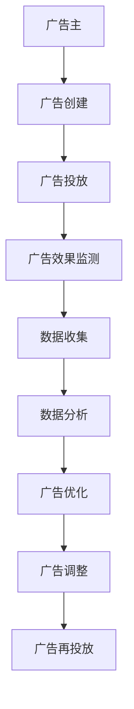

                 

# 程序员如何利用Facebook广告投放知识产品

## 1. 背景介绍

在当今数字化时代，广告投放已经成为企业品牌推广、产品销售的重要手段。Facebook作为全球最大的社交平台，拥有海量的用户基础和强大的数据分析能力，使其成为广告主竞相投放广告的首选平台。然而，要充分利用Facebook的广告投放工具，不仅需要掌握相关技术知识，还需要深入理解广告投放的原理和策略。本文将详细探讨如何通过编程和算法优化Facebook广告投放，以提升广告效果和投资回报率。

## 2. 核心概念与联系

### 2.1 核心概念概述

为了深入理解Facebook广告投放的知识产品，我们首先需要明确几个关键概念：

- **Facebook广告投放**：通过在Facebook上展示广告，吸引目标用户点击、转化和互动，达到品牌推广、产品销售的目的。
- **知识产品**：即基于数据科学、机器学习等技术，为用户提供广告投放策略优化建议和自动化投放解决方案的智能系统。
- **编程技术**：利用编程语言和工具，对广告投放过程中的数据进行收集、处理和分析，以实现广告投放的自动化和智能化。

### 2.2 核心概念原理和架构的 Mermaid 流程图



上述流程图展示了Facebook广告投放的基本流程和数据流向。广告主通过创建和投放广告，收集广告效果数据，并通过数据分析和优化，调整广告投放策略，实现更高效的广告投放。

## 3. 核心算法原理 & 具体操作步骤

### 3.1 算法原理概述

Facebook广告投放的知识产品主要基于以下算法原理：

- **A/B测试**：通过同时测试两个或多个广告版本，选择效果最好的广告投放。
- **多臂老虎机算法(MAB)**：在有限资源下，不断调整广告投放策略，优化广告效果。
- **强化学习**：通过试错和反馈机制，学习最优的广告投放策略。
- **预测模型**：使用机器学习模型预测广告点击率、转化率等指标，优化广告投放决策。

### 3.2 算法步骤详解

Facebook广告投放的知识产品通常包括以下几个关键步骤：

1. **广告创建**：选择合适的广告形式（图片、视频、轮播等）和创意（文案、图片、视频内容）。
2. **广告投放设置**：设置广告投放的目标受众、预算、广告组和广告集。
3. **广告投放执行**：自动投放广告，并监测广告效果。
4. **数据收集和分析**：收集广告效果数据（点击率、转化率、互动率等），并进行分析。
5. **广告优化**：根据数据分析结果，调整广告投放策略，优化广告效果。
6. **广告调整和再投放**：对效果不佳的广告进行调整，或重新投放至其他受众。

### 3.3 算法优缺点

Facebook广告投放的知识产品具有以下优点：

- **自动化**：自动化投放广告，减少人工干预，提高效率。
- **智能化**：利用机器学习模型预测广告效果，优化投放策略。
- **可扩展性**：支持多种广告形式和创意，适用于不同规模的广告主。

同时，这些产品也存在以下缺点：

- **复杂性**：需要掌握多种算法和技术，才能有效使用。
- **成本较高**：知识产品的使用需要付费，对于小型广告主而言，成本较高。
- **数据隐私**：需要收集大量用户数据，涉及用户隐私和数据保护问题。

### 3.4 算法应用领域

Facebook广告投放的知识产品广泛应用于以下领域：

- **品牌推广**：提升品牌知名度和美誉度。
- **产品销售**：增加产品销量和市场份额。
- **用户互动**：提高用户参与度和忠诚度。
- **市场调研**：收集用户反馈，了解市场趋势。

## 4. 数学模型和公式 & 详细讲解 & 举例说明

### 4.1 数学模型构建

为了优化广告投放效果，我们通常使用以下数学模型：

- **点击率预测模型**：使用逻辑回归、决策树等模型，预测广告被点击的概率。
- **转化率预测模型**：使用线性回归、神经网络等模型，预测广告被转化的概率。
- **预算分配模型**：使用多臂老虎机算法，优化广告预算的分配策略。

### 4.2 公式推导过程

以点击率预测模型为例，假设广告的特征向量为 $x$，广告被点击的概率为 $y$。则点击率预测模型可以表示为：

$$
y = \sigma(\sum_{i=1}^n w_ix_i + b)
$$

其中，$\sigma$ 为逻辑函数，$w_i$ 为特征系数，$b$ 为截距。通过最大化点击率，可以求解出最优的特征系数 $w$ 和截距 $b$。

### 4.3 案例分析与讲解

假设我们有一个电商广告投放案例，需要预测广告点击率。广告的特征包括：广告标题、广告图片、广告受众性别、广告受众年龄等。我们使用逻辑回归模型进行预测，并通过最大化点击率来求解最优参数。

## 5. 项目实践：代码实例和详细解释说明

### 5.1 开发环境搭建

要使用Facebook广告投放的知识产品，首先需要搭建开发环境。以下是使用Python和Facebook广告API进行广告投放的开发环境配置流程：

1. 安装Facebook SDK：
```bash
pip install facebook-sdk
```

2. 配置广告账户和应用：
- 在Facebook开发者平台上创建广告账户和应用。
- 获取广告账户的API密钥和应用ID。

3. 编写广告投放代码：
- 创建一个广告组和广告集。
- 设置广告受众、预算和投放时间。
- 创建广告创意并自动投放。

### 5.2 源代码详细实现

以下是一个简单的Python代码示例，展示如何使用Facebook SDK进行广告投放：

```python
from facebook import SDK
from facebook.api import Ads

# 初始化SDK
sdk = SDK(access_token='YOUR_ACCESS_TOKEN', app_id='YOUR_APP_ID')

# 创建广告组
group =Ads.create(
    name="E-commerce Ads Group",
    app_id=sdk.app_id,
    obj_type="AD_GROUP"
)

# 创建广告集
campaign = Ads.create(
    name="E-commerce Campaign",
    app_id=sdk.app_id,
    obj_type="AD_SET",
    ad_group_id=group['id'],
    criteria={
        "and": [
            {"field": "gender", "operator": "EQUALS", "values": ["male"]},
            {"field": "age", "operator": "BETWEEN", "values": [20, 30]}
        ]
    },
    budget=1000.00,
    daily_budget=100.00,
    start_time="2022-01-01",
    end_time="2022-02-01"
)

# 创建广告创意
ad = Ads.create(
    name="E-commerce Ad",
    app_id=sdk.app_id,
    obj_type="AD",
    ad_set_id=campaign['id'],
    ad_format="IMAGEN",
    ad_name="Product Image Ad",
    creative={
        "text": "Click here to see our latest products",
        "link": "https://example.com"
    }
)

# 自动投放广告
Ads.bulk_add(ad)
```

### 5.3 代码解读与分析

上述代码实现了以下步骤：

1. 初始化Facebook SDK，并创建广告组和广告集。
2. 设置广告集投放的受众、预算和投放时间。
3. 创建广告创意，并进行自动投放。

这个示例展示了如何使用Facebook SDK进行广告投放，并设置了基本的投放策略。在实际应用中，还需要根据广告主的需求，进一步优化广告创意和投放策略，以提高广告效果。

### 5.4 运行结果展示

运行上述代码后，将在广告账户中创建广告组和广告集，并自动投放广告。通过Facebook的广告管理界面，可以查看广告的点击率、转化率等效果指标，并根据效果进行进一步的优化调整。

## 6. 实际应用场景

### 6.1 智能广告投放平台

利用Facebook广告投放的知识产品，可以构建智能广告投放平台，自动优化广告投放策略，提高广告效果和投资回报率。平台可以集成了多种广告投放工具和技术，如A/B测试、多臂老虎机算法、预测模型等，为用户提供一站式的广告投放解决方案。

### 6.2 广告效果分析与优化

Facebook广告投放的知识产品可以帮助广告主进行广告效果分析，识别出效果不佳的广告，并提出优化建议。平台可以通过数据分析，生成广告效果报告，帮助广告主了解广告的投放效果，并根据反馈进行广告优化。

### 6.3 动态广告投放

利用Facebook广告投放的知识产品，可以实现动态广告投放，根据用户的实时行为数据，动态调整广告内容和投放策略，提高广告的点击率和转化率。例如，根据用户的浏览历史和行为特征，自动推荐相关产品广告。

### 6.4 未来应用展望

随着数据科学和人工智能技术的不断进步，Facebook广告投放的知识产品将变得更加智能化和自动化。未来，这些产品将能够实时分析广告效果，自动优化广告投放策略，甚至可以根据用户的个性化需求，提供定制化的广告内容。

## 7. 工具和资源推荐

### 7.1 学习资源推荐

为了深入学习Facebook广告投放的知识产品，以下推荐一些优质的学习资源：

1. Facebook广告API文档：官方提供的API文档，详细介绍了广告投放的各种操作方法和数据结构。
2. Facebook广告投放课程：一些在线课程和教程，如Udacity的Facebook广告投放课程。
3. Facebook广告优化指南：Facebook官方提供的广告优化指南，介绍了广告投放的策略和技巧。
4. Facebook广告优化案例：Facebook官方博客和开发者社区中的广告优化案例，提供了丰富的实战经验。

### 7.2 开发工具推荐

以下是几款用于Facebook广告投放开发的常用工具：

1. Facebook SDK：官方提供的SDK，支持广告投放的各个环节，如广告创建、广告组管理等。
2. Python：常用编程语言，支持数据处理和分析，适合广告投放的自动化开发。
3. Jupyter Notebook：数据分析和机器学习的常用工具，支持代码编写和运行。

### 7.3 相关论文推荐

为了深入理解Facebook广告投放的知识产品，以下推荐一些相关论文：

1. "Advertising on Facebook: A Framework for Targeting and Optimization"：探讨Facebook广告投放的目标受众选择和投放优化策略。
2. "Machine Learning for Advertising: A Survey"：综述了机器学习在广告投放中的应用，包括点击率预测、预算分配等。
3. "An Online Learning Framework for Ads Attribution"：研究如何利用在线学习框架，优化广告投放的转化率和效果。

## 8. 总结：未来发展趋势与挑战

### 8.1 研究成果总结

本文系统介绍了Facebook广告投放的知识产品和算法原理，展示了如何通过编程技术进行广告投放的自动化和智能化。这些技术不仅能够提升广告效果和投资回报率，还能为广告主提供精准的目标受众选择和投放策略优化。

### 8.2 未来发展趋势

未来，Facebook广告投放的知识产品将朝着以下方向发展：

1. 自动化程度更高：通过自动化技术，实现广告投放的完全自动化，减少人工干预。
2. 智能化水平提升：利用机器学习模型，提升广告投放的精度和效果。
3. 个性化定制增强：根据用户行为数据，提供定制化的广告内容和策略。
4. 跨平台广告投放：支持在多个平台（如Instagram、WhatsApp等）上进行广告投放，实现多平台联动。

### 8.3 面临的挑战

尽管Facebook广告投放的知识产品已经取得了一定的进展，但仍面临以下挑战：

1. 数据隐私问题：广告投放需要收集用户数据，涉及用户隐私和数据保护问题。
2. 成本问题：知识产品的使用需要付费，对于小型广告主而言，成本较高。
3. 广告效果评估：广告效果的评估和优化仍然存在一定的难度，需要结合业务经验和数据分析。
4. 广告投放策略的灵活性：广告投放策略需要根据市场变化和广告主需求进行灵活调整。

### 8.4 研究展望

未来的研究需要从以下几个方面进行探索：

1. 用户隐私保护：研究如何在广告投放过程中保护用户隐私，提升用户信任度。
2. 广告效果优化：结合实际业务需求，开发更加精准的广告投放策略和优化算法。
3. 跨平台广告投放：研究如何实现跨平台广告投放，提升广告的覆盖率和效果。
4. 广告投放自动化：开发更高效的广告投放自动化工具，减少人工干预，提升广告投放效率。

总之，随着技术的不断进步，Facebook广告投放的知识产品将不断优化和升级，为广告主提供更高效、精准的广告投放解决方案。

## 9. 附录：常见问题与解答

**Q1: Facebook广告投放是否适用于所有广告主？**

A: 尽管Facebook广告投放的知识产品功能强大，但并非所有广告主都适合使用。广告主需要根据自己的业务需求和预算，选择最合适的广告投放方式。对于小型广告主而言，可能需要更多的手动调整和优化。

**Q2: 如何优化Facebook广告投放的点击率？**

A: 优化广告投放的点击率可以从以下几个方面入手：
1. 选择合适的广告形式和创意，吸引用户的注意力。
2. 设置精准的目标受众，确保广告投放到最相关的人群。
3. 利用A/B测试，不断尝试不同的广告版本，找到最优的广告创意。
4. 定期更新广告内容，保持广告的新鲜感和吸引力。

**Q3: 如何提高Facebook广告投放的转化率？**

A: 提高广告投放的转化率需要综合考虑多个因素：
1. 优化广告创意，使其更具吸引力和说服力。
2. 设置合理的广告落地页，确保用户点击广告后可以顺畅转化。
3. 利用再营销技术，对已经点击广告的用户进行二次投放，提高转化率。
4. 进行详细的广告效果分析，根据数据反馈调整广告投放策略。

**Q4: 如何平衡广告投放的预算和效果？**

A: 平衡广告投放的预算和效果需要根据实际业务需求进行调整：
1. 设定合理的每日预算和总预算，确保广告投放的可持续性。
2. 利用多臂老虎机算法，动态调整广告预算，优化广告效果。
3. 定期评估广告投放的效果，及时调整预算分配策略。
4. 结合市场变化和用户反馈，灵活调整广告投放策略。

**Q5: 如何处理Facebook广告投放中的数据隐私问题？**

A: 在广告投放过程中，需要注意以下数据隐私问题：
1. 严格遵守Facebook的数据隐私政策，确保用户数据的安全和隐私。
2. 使用匿名化数据进行广告投放，减少对用户隐私的影响。
3. 提供用户选择的权利，让用户可以随时选择退出广告投放。
4. 定期进行隐私合规审查，确保广告投放过程符合法律法规要求。

---

作者：禅与计算机程序设计艺术 / Zen and the Art of Computer Programming

