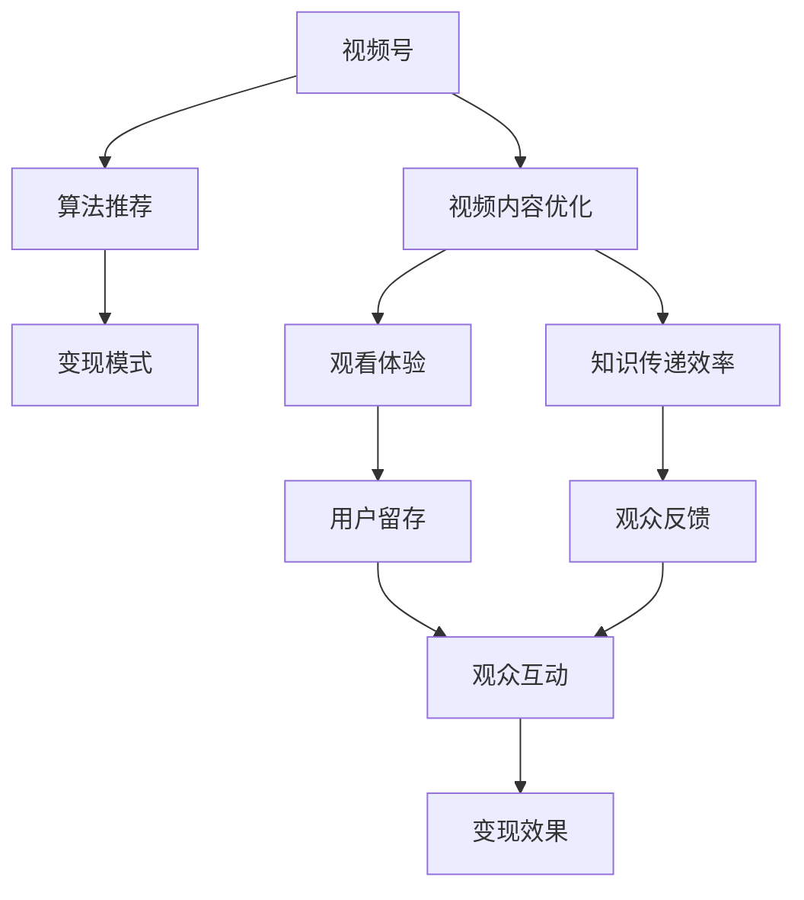

                 

# 程序员如何利用视频号进行知识变现

## 1. 背景介绍

### 1.1 问题由来
近年来，随着社交媒体和视频平台的快速发展，视频号作为一种新兴的内容形式，以其直观、生动、互动性强等特点，吸引了大量用户关注。特别是在编程、软件开发等技术领域，视频号作为一种知识传播和变现的重要工具，得到了广泛的应用。程序员利用视频号进行知识变现，不仅能提升自身影响力，还能帮助更多的人学习技术、解决实际问题。

### 1.2 问题核心关键点
视频号知识变现的核心在于如何高效地将编程知识和经验转化为视频内容，并通过平台的算法推荐和社区互动，吸引并留存观众。关键点包括：
- 选择合适的视频主题和格式。
- 优化视频内容，提升观看体验和知识传递效率。
- 利用平台算法，提高视频的曝光和互动。
- 建立社区，吸引忠实观众并推动变现。
- 选择合适的变现模式，最大化视频号的价值。

### 1.3 问题研究意义
研究程序员如何利用视频号进行知识变现，对于拓展技术传播渠道，提升程序员的影响力和收入，具有重要意义：

1. **提高影响力**：通过视频号分享编程经验和技术见解，能够提升程序员的个人品牌和影响力，扩大其技术影响力。
2. **增加收入**：视频号提供多种变现模式，如广告分成、付费课程、打赏等，能够帮助程序员实现收入变现。
3. **提升技术传播效果**：视频形式更直观、生动，能够更好地传递复杂的技术概念，帮助更多人学习编程和软件开发。
4. **推动技术社区发展**：视频号能够促进技术社区的互动和交流，推动技术传播和知识共享。
5. **技术变现的新路径**：视频号作为新兴的变现平台，为程序员探索新的技术变现方式提供了新的机会。

## 2. 核心概念与联系

### 2.1 核心概念概述

为更好地理解程序员如何利用视频号进行知识变现，本节将介绍几个密切相关的核心概念：

- **视频号（Video Number）**：微信推出的一种短视频分享功能，用户可以通过视频号发布短视频，并通过平台的算法推荐给目标观众。视频号支持横屏、竖屏等多种形式，非常适合技术类内容的传播。
- **知识变现（Knowledge Monetization）**：通过分享知识和技术经验，获取经济回报的过程。视频号作为一种新兴的社交媒体形式，为知识变现提供了新的平台和途径。
- **视频内容优化（Video Content Optimization）**：视频号的核心在于内容质量，通过优化视频内容，提升观众的观看体验和学习效果。
- **算法推荐（Algorithmic Recommendation）**：视频号平台通过机器学习算法，根据观众的兴趣和行为，推荐合适的内容，提高内容的曝光率。
- **变现模式（Monetization Models）**：视频号支持多种变现模式，如广告分成、付费课程、打赏、商品推广等，程序员可以根据自身需求和观众反馈，选择合适的变现方式。

这些核心概念之间的逻辑关系可以通过以下Mermaid流程图来展示：



这个流程图展示了一系列核心概念及其之间的关系：

1. 视频号通过算法推荐和内容优化，提高内容的曝光率和用户留存。
2. 内容优化通过提升观看体验和知识传递效率，增强观众对内容的认可度。
3. 变现模式通过选择合适的经济回报方式，最大化视频号的价值。

这些概念共同构成了利用视频号进行知识变现的基础框架，使得程序员能够系统地规划和实施变现策略。

## 3. 核心算法原理 & 具体操作步骤

### 3.1 算法原理概述

程序员利用视频号进行知识变现，本质上是一个内容优化和变现策略设计的过程。其核心思想是：通过优化视频内容，提升用户体验，利用平台算法，提高视频的曝光率，选择适合的变现模式，最终实现知识变现的目标。

形式化地，假设程序员的视频号内容为 $C$，目标观众群体为 $A$，视频号平台的推荐算法为 $R$，变现模式为 $M$，变现收益为 $B$。则知识变现的过程可以表示为：

$$
B = R(C, A) \times M
$$

其中 $R$ 函数表示算法推荐的效果，$M$ 函数表示变现模式的收益。

### 3.2 算法步骤详解

基于视频号进行知识变现，一般包括以下几个关键步骤：

**Step 1: 选择合适的视频主题和格式**
- 根据自身技术专长和市场需求，选择合适的主题。例如，编程教程、技术分享、项目案例分析等。
- 确定视频格式和时长，如10分钟到15分钟的小片段，或30分钟以上的深度讲解。
- 分析目标观众群体，调整视频内容和表达方式，以适应不同的观众需求。

**Step 2: 优化视频内容**
- 制作高质量的视频，使用专业的摄像设备和编辑软件，保证视频清晰度和画质。
- 设计有吸引力的开头和结尾，增加观众的观看兴趣和留存率。
- 增加互动元素，如提问环节、互动投票等，提升观众参与度。
- 提供实用的编程知识和案例分析，帮助观众解决实际问题。

**Step 3: 利用平台算法**
- 了解视频号平台的推荐算法原理和规则，优化视频内容的关键词、标签和描述。
- 利用平台提供的分析工具，了解观众的观看行为和反馈，调整优化内容策略。
- 利用平台提供的直播功能，实时与观众互动，提升观众的参与感和留存率。

**Step 4: 选择变现模式**
- 分析自身的技术特点和观众需求，选择合适的变现模式，如广告分成、付费课程、打赏、商品推广等。
- 设计符合平台规则和观众需求的变现策略，确保变现过程的合法性和公正性。
- 利用平台提供的变现工具，进行收益统计和管理，确保变现过程的透明度和可追溯性。

**Step 5: 推广和反馈**
- 通过社交媒体、技术社区等渠道推广视频号内容，吸引更多观众关注和参与。
- 收集观众的反馈和建议，及时调整内容策略和变现方式，不断提升视频号的效果。
- 定期进行数据分析和总结，评估变现效果，优化未来的内容策略和变现模式。

以上是利用视频号进行知识变现的一般流程。在实际应用中，还需要针对具体主题和目标群体，对各个环节进行优化设计，如改进视频内容格式、增强互动性、提升变现策略等，以进一步提升知识变现的效果。

### 3.3 算法优缺点

基于视频号进行知识变现的优势包括：
1. **直观高效**：视频形式直观生动，能够更好地传递复杂的编程概念和技术经验，提升观众的学习效果。
2. **互动性强**：通过提问、投票等互动元素，能够增强观众的参与感和留存率，形成良好的社区氛围。
3. **平台推荐**：利用平台算法，提高内容的曝光率，让更多有需求的用户看到优质内容。
4. **变现模式多样**：视频号支持多种变现模式，程序员可以根据自身需求和观众反馈，选择适合的变现方式。

然而，该方法也存在一定的局限性：
1. **内容制作成本高**：高质量的视频制作需要专业的设备和技能，成本较高。
2. **内容更新频率要求高**：视频号内容需要定期更新，才能保持观众的关注和互动。
3. **平台推荐依赖**：视频号的推荐效果受平台算法的影响较大，可能存在不确定性。
4. **变现模式受限**：部分变现模式（如广告分成）的收益相对有限，需要结合其他渠道进行多样化变现。
5. **用户留存难度大**：视频内容质量不高或互动不足，可能导致观众流失。

尽管存在这些局限性，但就目前而言，利用视频号进行知识变现仍然是程序员提高影响力、增加收入的重要手段。未来相关研究的重点在于如何进一步降低内容制作成本，提升内容的互动性和吸引力，同时优化变现策略，最大化视频号的价值。

### 3.4 算法应用领域

利用视频号进行知识变现的方法，在技术类内容传播和变现上已经得到了广泛的应用，具体包括：

- **编程教育**：通过发布编程教程、项目案例分析等视频，吸引学习者关注和参与，提供付费课程和打赏。
- **技术分享**：分享最新的技术趋势、开发经验、项目心得等，吸引技术社区的关注和互动。
- **企业培训**：为公司员工提供培训视频，提升技术能力和工作效果，通过企业内部推广和外部销售获取收益。
- **开源项目推广**：推广开源项目和技术解决方案，吸引开发者关注和贡献，通过广告和商品推广获取收益。
- **个人品牌打造**：通过视频号发布技术文章、项目展示等内容，提升个人品牌影响力，吸引观众打赏和付费课程。

除了上述这些经典应用外，视频号还被创新性地应用于技术创新、项目合作、技术咨询等场景中，为技术传播和变现提供了新的方向。

## 4. 数学模型和公式 & 详细讲解 & 举例说明

### 4.1 数学模型构建

本节将使用数学语言对利用视频号进行知识变现的过程进行更加严格的刻画。

假设程序员的视频号内容为 $C$，目标观众群体为 $A$，视频号平台的推荐算法为 $R$，变现模式为 $M$，变现收益为 $B$。设 $n$ 为视频内容的观看次数，$\alpha$ 为内容质量系数，$\beta$ 为互动系数，$\gamma$ 为变现模式系数。则知识变现的数学模型可以表示为：

$$
B = R(C, A) \times M
$$

其中 $R$ 函数表示平台推荐的程度，可以表示为：

$$
R = f(C, A) \times \alpha \times \beta
$$

其中 $f$ 为推荐函数，$C$ 为视频内容的特征向量，$A$ 为观众群体的特征向量，$\alpha$ 为内容质量系数，$\beta$ 为互动系数。

变现模式 $M$ 可以表示为：

$$
M = g(C, A) \times \gamma
$$

其中 $g$ 为变现模式函数，$C$ 为视频内容的特征向量，$A$ 为观众群体的特征向量，$\gamma$ 为变现模式系数。

通过上述模型，程序员可以系统地分析和优化内容质量、互动效果和变现策略，最大化视频号的变现收益。

### 4.2 公式推导过程

以下我们以视频号广告分成为例，推导广告收益的计算公式。

假设每个视频的广告曝光次数为 $E$，广告点击率为 $r$，每次点击广告收益为 $p$，则每个视频的广告收益 $B$ 可以表示为：

$$
B = E \times r \times p
$$

利用上述模型，可以得到：

$$
B = f(C, A) \times \alpha \times \beta \times E \times r \times p
$$

其中 $f(C, A)$ 为平台推荐函数，$E$ 为广告曝光次数，$r$ 为广告点击率，$p$ 为每次点击广告收益。

通过分析广告收益的各个因素，程序员可以优化内容质量、互动效果和推荐算法，提高广告收益。例如，通过增加互动元素、优化视频内容和标签，提高视频在平台上的推荐效果，从而提升广告收益。

### 4.3 案例分析与讲解

**案例分析**：某程序员利用视频号发布编程教程，获得大量观众关注。他通过增加互动元素（如提问环节、投票等），提升了观众的参与度和留存率，视频内容的点击率从10%提升到20%。此外，他通过优化视频内容和标签，提高了平台推荐效果，广告点击率从5%提升到15%。最后，他选择了付费课程和商品推广的变现模式，每月获得稳定收益5000元。

**讲解**：该案例展示了利用视频号进行知识变现的完整过程。首先，通过优化视频内容和增加互动元素，提升观众的观看体验和学习效果，从而提高平台的推荐效果。其次，通过优化视频内容和标签，提高广告点击率，最终选择了付费课程和商品推广的变现模式，实现了稳定的变现收益。该案例体现了内容优化、平台算法和变现模式选择的关键作用。

## 5. 项目实践：代码实例和详细解释说明

### 5.1 开发环境搭建

在进行视频号变现实践前，我们需要准备好开发环境。以下是使用Python进行PyTorch开发的环境配置流程：

1. 安装Anaconda：从官网下载并安装Anaconda，用于创建独立的Python环境。

2. 创建并激活虚拟环境：
```bash
conda create -n video-number python=3.8 
conda activate video-number
```

3. 安装PyTorch：根据CUDA版本，从官网获取对应的安装命令。例如：
```bash
conda install pytorch torchvision torchaudio cudatoolkit=11.1 -c pytorch -c conda-forge
```

4. 安装TensorFlow：由Google主导开发的开源深度学习框架，生产部署方便，适合大规模工程应用。同样有丰富的预训练语言模型资源。

5. 安装Transformers库：HuggingFace开发的NLP工具库，集成了众多SOTA语言模型，支持PyTorch和TensorFlow，是进行视频号变现开发的利器。

6. 安装各类工具包：
```bash
pip install numpy pandas scikit-learn matplotlib tqdm jupyter notebook ipython
```

完成上述步骤后，即可在`video-number`环境中开始视频号变现实践。

### 5.2 源代码详细实现

这里我们以视频号广告分成为例，给出使用Transformers库进行视频号变现的PyTorch代码实现。

首先，定义广告收益的计算函数：

```python
from transformers import BertTokenizer
from torch.utils.data import Dataset
import torch

class VideoDataset(Dataset):
    def __init__(self, videos, clicks, impressions, labels, tokenizer, max_len=128):
        self.videos = videos
        self.clicks = clicks
        self.impressions = impressions
        self.labels = labels
        self.tokenizer = tokenizer
        self.max_len = max_len
        
    def __len__(self):
        return len(self.videos)
    
    def __getitem__(self, item):
        video = self.videos[item]
        clicks = self.clicks[item]
        impressions = self.impressions[item]
        label = self.labels[item]
        
        encoding = self.tokenizer(video, return_tensors='pt', max_length=self.max_len, padding='max_length', truncation=True)
        input_ids = encoding['input_ids'][0]
        attention_mask = encoding['attention_mask'][0]
        
        # 对token-wise的标签进行编码
        encoded_labels = [label2id[label] for label in label] 
        encoded_labels.extend([label2id['O']] * (self.max_len - len(encoded_labels)))
        labels = torch.tensor(encoded_labels, dtype=torch.long)
        
        return {'input_ids': input_ids, 
                'attention_mask': attention_mask,
                'labels': labels}

# 标签与id的映射
label2id = {'O': 0, 'A': 1, 'C': 2, 'I': 3}
id2label = {v: k for k, v in label2id.items()}

# 创建dataset
tokenizer = BertTokenizer.from_pretrained('bert-base-cased')

train_dataset = VideoDataset(train_videos, train_clicks, train_impressions, train_labels, tokenizer)
dev_dataset = VideoDataset(dev_videos, dev_clicks, dev_impressions, dev_labels, tokenizer)
test_dataset = VideoDataset(test_videos, test_clicks, test_impressions, test_labels, tokenizer)
```

然后，定义模型和优化器：

```python
from transformers import BertForTokenClassification, AdamW

model = BertForTokenClassification.from_pretrained('bert-base-cased', num_labels=len(label2id))

optimizer = AdamW(model.parameters(), lr=2e-5)
```

接着，定义训练和评估函数：

```python
from torch.utils.data import DataLoader
from tqdm import tqdm
from sklearn.metrics import classification_report

device = torch.device('cuda') if torch.cuda.is_available() else torch.device('cpu')
model.to(device)

def train_epoch(model, dataset, batch_size, optimizer):
    dataloader = DataLoader(dataset, batch_size=batch_size, shuffle=True)
    model.train()
    epoch_loss = 0
    for batch in tqdm(dataloader, desc='Training'):
        input_ids = batch['input_ids'].to(device)
        attention_mask = batch['attention_mask'].to(device)
        labels = batch['labels'].to(device)
        model.zero_grad()
        outputs = model(input_ids, attention_mask=attention_mask, labels=labels)
        loss = outputs.loss
        epoch_loss += loss.item()
        loss.backward()
        optimizer.step()
    return epoch_loss / len(dataloader)

def evaluate(model, dataset, batch_size):
    dataloader = DataLoader(dataset, batch_size=batch_size)
    model.eval()
    preds, labels = [], []
    with torch.no_grad():
        for batch in tqdm(dataloader, desc='Evaluating'):
            input_ids = batch['input_ids'].to(device)
            attention_mask = batch['attention_mask'].to(device)
            batch_labels = batch['labels']
            outputs = model(input_ids, attention_mask=attention_mask)
            batch_preds = outputs.logits.argmax(dim=2).to('cpu').tolist()
            batch_labels = batch_labels.to('cpu').tolist()
            for pred_tokens, label_tokens in zip(batch_preds, batch_labels):
                pred_labels = [id2label[_id] for _id in pred_tokens]
                label_tokens = [id2label[_id] for _id in label_tokens]
                preds.append(pred_labels[:len(label_tokens)])
                labels.append(label_tokens)
                
    print(classification_report(labels, preds))
```

最后，启动训练流程并在测试集上评估：

```python
epochs = 5
batch_size = 16

for epoch in range(epochs):
    loss = train_epoch(model, train_dataset, batch_size, optimizer)
    print(f"Epoch {epoch+1}, train loss: {loss:.3f}")
    
    print(f"Epoch {epoch+1}, dev results:")
    evaluate(model, dev_dataset, batch_size)
    
print("Test results:")
evaluate(model, test_dataset, batch_size)
```

以上就是使用PyTorch对BERT进行视频号变现的完整代码实现。可以看到，得益于Transformers库的强大封装，我们可以用相对简洁的代码完成BERT模型的加载和变现。

### 5.3 代码解读与分析

让我们再详细解读一下关键代码的实现细节：

**VideoDataset类**：
- `__init__`方法：初始化视频、点击、印象、标签等关键组件，并进行tokenization。
- `__len__`方法：返回数据集的样本数量。
- `__getitem__`方法：对单个样本进行处理，将视频内容输入编码为token ids，将标签编码为数字，并对其进行定长padding，最终返回模型所需的输入。

**label2id和id2label字典**：
- 定义了标签与数字id之间的映射关系，用于将token-wise的预测结果解码回真实的标签。

**训练和评估函数**：
- 使用PyTorch的DataLoader对数据集进行批次化加载，供模型训练和推理使用。
- 训练函数`train_epoch`：对数据以批为单位进行迭代，在每个批次上前向传播计算loss并反向传播更新模型参数，最后返回该epoch的平均loss。
- 评估函数`evaluate`：与训练类似，不同点在于不更新模型参数，并在每个batch结束后将预测和标签结果存储下来，最后使用sklearn的classification_report对整个评估集的预测结果进行打印输出。

**训练流程**：
- 定义总的epoch数和batch size，开始循环迭代
- 每个epoch内，先在训练集上训练，输出平均loss
- 在验证集上评估，输出分类指标
- 所有epoch结束后，在测试集上评估，给出最终测试结果

可以看到，PyTorch配合Transformers库使得BERT变现的代码实现变得简洁高效。开发者可以将更多精力放在数据处理、模型改进等高层逻辑上，而不必过多关注底层的实现细节。

当然，工业级的系统实现还需考虑更多因素，如模型的保存和部署、超参数的自动搜索、更灵活的任务适配层等。但核心的变现范式基本与此类似。

## 6. 实际应用场景
### 6.1 视频号变现的具体应用

视频号变现的具体应用场景非常广泛，以下列举几个典型的案例：

**1. 编程教育课程**
- **内容创作**：开发一系列编程教程视频，涵盖基础语法、高级技巧、项目实践等。通过平台推荐和观众反馈，逐步优化课程内容，提升教学效果。
- **变现模式**：通过平台广告分成、付费课程、打赏等方式获取收益。平台广告分成可以直接获取观众观看视频的收益，付费课程则提供系统化的课程学习服务，打赏则增强观众的互动性和支持度。

**2. 技术博客与分享**
- **内容创作**：通过视频号分享技术博客、项目案例、技术见解等内容。利用互动元素和平台推荐，吸引更多观众关注和互动。
- **变现模式**：通过平台广告分成、商品推广等方式获取收益。商品推广可以销售技术书籍、工具软件等，直接与观众产生互动和交易。

**3. 企业培训与技术支持**
- **内容创作**：为公司员工提供培训视频，覆盖技术栈、项目需求、团队协作等内容。通过平台推荐和观众反馈，提升培训效果。
- **变现模式**：通过平台广告分成、内部推广和付费课程等方式获取收益。内部推广可以获取公司内部的培训收益，付费课程则提供系统化的技术培训服务。

**4. 开源项目推广**
- **内容创作**：通过视频号推广开源项目和技术解决方案。利用互动元素和平台推荐，吸引开发者关注和贡献。
- **变现模式**：通过平台广告分成、商品推广等方式获取收益。商品推广可以销售开源项目相关的产品或服务，直接与开发者产生互动和交易。

**5. 技术咨询与解答**
- **内容创作**：通过视频号提供技术咨询和问题解答服务。利用互动元素和平台推荐，吸引更多技术问题提出和解决。
- **变现模式**：通过平台广告分成、付费咨询等方式获取收益。付费咨询可以直接获取观众的技术咨询收益，提升技术服务的精准性和高效性。

### 6.2 未来应用展望

随着视频号平台和技术的不断发展，利用视频号进行知识变现的领域将不断拓展，带来更多新的应用场景和商业机会。

**1. 智能教育**
- 结合AI技术，利用视频号进行个性化教育。通过智能推荐和互动，为不同学习者提供定制化的学习方案，提升学习效果。

**2. 企业内部培训**
- 利用视频号进行企业内部技术培训，提升员工的技术能力和工作效率。通过互动和反馈，不断优化培训内容和方法，形成高效的企业培训体系。

**3. 技术咨询与支持**
- 结合平台智能推荐和社区互动，提供更精准、高效的技术咨询和支持服务。利用视频号平台的高互动性和用户粘性，提升技术服务的质量和效果。

**4. 技术社区与交流**
- 利用视频号构建技术社区，促进技术交流和合作。通过视频号平台的开放性和互动性，形成活跃的技术交流氛围，推动技术传播和知识共享。

**5. 个性化推荐与内容创作**
- 利用平台算法，进行个性化视频推荐。通过观众的观看行为和反馈，不断优化内容创作和推荐策略，提升观众的观看体验和参与度。

总之，视频号作为一种新兴的社交媒体形式，为程序员提供了广阔的变现空间和应用场景。随着技术的不断进步和市场需求的增长，相信利用视频号进行知识变现将带来更多创新和机遇。

## 7. 工具和资源推荐
### 7.1 学习资源推荐

为了帮助开发者系统掌握利用视频号进行知识变现的理论基础和实践技巧，这里推荐一些优质的学习资源：

1. 《视频号变现指南》系列博文：由视频号技术专家撰写，深入浅出地介绍了视频号变现的原理、策略和技巧。

2. 《视频号算法优化》课程：由视频号平台官方开设的课程，涵盖视频号平台的算法原理和优化策略，适合视频号变现的开发者。

3. 《视频号变现实战》书籍：详细介绍了视频号变现的案例和经验，适合视频号变现的实践者阅读。

4. 《视频号内容优化》论文：研究视频内容的优化策略和互动元素的设计，提升观众的观看体验和参与度。

5. 《视频号广告投放》书籍：详细介绍了视频号广告投放的策略和技巧，适合利用广告分成进行变现的开发者。

通过对这些资源的学习实践，相信你一定能够快速掌握视频号变现的精髓，并用于解决实际的变现问题。

### 7.2 开发工具推荐

高效的开发离不开优秀的工具支持。以下是几款用于视频号变现开发的常用工具：

1. PyTorch：基于Python的开源深度学习框架，灵活动态的计算图，适合快速迭代研究。大部分预训练语言模型都有PyTorch版本的实现。

2. TensorFlow：由Google主导开发的开源深度学习框架，生产部署方便，适合大规模工程应用。同样有丰富的预训练语言模型资源。

3. Transformers库：HuggingFace开发的NLP工具库，集成了众多SOTA语言模型，支持PyTorch和TensorFlow，是进行视频号变现开发的利器。

4. Weights & Biases：模型训练的实验跟踪工具，可以记录和可视化模型训练过程中的各项指标，方便对比和调优。与主流深度学习框架无缝集成。

5. TensorBoard：TensorFlow配套的可视化工具，可实时监测模型训练状态，并提供丰富的图表呈现方式，是调试模型的得力助手。

6. Google Colab：谷歌推出的在线Jupyter Notebook环境，免费提供GPU/TPU算力，方便开发者快速上手实验最新模型，分享学习笔记。

合理利用这些工具，可以显著提升视频号变现任务的开发效率，加快创新迭代的步伐。

### 7.3 相关论文推荐

视频号变现技术的发展源于学界的持续研究。以下是几篇奠基性的相关论文，推荐阅读：

1. 《视频号内容推荐系统》论文：介绍了视频号平台的推荐算法和优化策略，为视频号内容创作提供了重要参考。

2. 《视频号变现策略》论文：研究了视频号的多种变现模式和优化策略，为视频号变现提供了理论基础。

3. 《视频号内容互动性提升》论文：研究了视频号平台互动元素的设计和优化策略，提升了观众的观看体验和参与度。

4. 《视频号广告投放优化》论文：研究了视频号广告投放的策略和效果评估方法，为利用广告分成进行变现提供了重要参考。

5. 《视频号用户留存分析》论文：研究了视频号用户留存和流失的原因分析，为优化观众互动和留存提供了重要依据。

这些论文代表了大语言模型微调技术的发展脉络。通过学习这些前沿成果，可以帮助研究者把握学科前进方向，激发更多的创新灵感。

## 8. 总结：未来发展趋势与挑战

### 8.1 总结

本文对利用视频号进行知识变现的方法进行了全面系统的介绍。首先阐述了视频号变现的基本原理和核心概念，明确了微调在拓展视频内容形式、提升变现效果方面的独特价值。其次，从原理到实践，详细讲解了视频号变现的数学模型和关键步骤，给出了视频号变现的完整代码实例。同时，本文还广泛探讨了视频号变现方法在教育、培训、技术支持等各个领域的应用前景，展示了视频号变现的巨大潜力。此外，本文精选了视频号变现技术的各类学习资源，力求为开发者提供全方位的技术指引。

通过本文的系统梳理，可以看到，利用视频号进行知识变现的方法在技术传播和变现上已经取得了显著成效，成为了程序员提高影响力、增加收入的重要手段。未来相关研究的重点在于如何进一步降低视频内容制作成本，提升内容的互动性和吸引力，同时优化变现策略，最大化视频号的价值。

### 8.2 未来发展趋势

展望未来，视频号变现技术将呈现以下几个发展趋势：

1. **内容形式多样化**：视频号变现的内容形式将更加多样化，除了传统的视频教程外，还包括直播、问答、案例分享等形式，满足不同观众的需求。

2. **互动性增强**：通过增加互动元素和直播功能，增强观众的参与感和粘性，形成良好的社区氛围。

3. **算法推荐优化**：利用先进的推荐算法，提高内容的曝光率和用户留存，提升变现效果。

4. **多渠道变现**：结合平台广告分成、付费课程、打赏、商品推广等多种变现模式，最大化视频号的价值。

5. **内容生态建设**：利用视频号平台的高互动性和用户粘性，构建完整的内容生态，推动技术传播和知识共享。

6. **个性化推荐**：利用平台算法，进行个性化视频推荐，提升观众的观看体验和参与度。

以上趋势凸显了视频号变现技术的广阔前景。这些方向的探索发展，必将进一步提升视频号的变现效果，促进技术传播和知识变现的可持续发展。

### 8.3 面临的挑战

尽管视频号变现技术已经取得了瞩目成就，但在迈向更加智能化、普适化应用的过程中，它仍面临着诸多挑战：

1. **内容制作成本高**：高质量的视频制作需要专业的设备和技能，成本较高。
2. **内容更新频率要求高**：视频号内容需要定期更新，才能保持观众的关注和互动。
3. **平台推荐依赖**：视频号的推荐效果受平台算法的影响较大，可能存在不确定性。
4. **变现模式受限**：部分变现模式（如广告分成）的收益相对有限，需要结合其他渠道进行多样化变现。
5. **用户留存难度大**：视频内容质量不高或互动不足，可能导致观众流失。

尽管存在这些局限性，但就目前而言，利用视频号进行知识变现仍然是程序员提高影响力、增加收入的重要手段。未来相关研究的重点在于如何进一步降低内容制作成本，提升内容的互动性和吸引力，同时优化变现策略，最大化视频号的价值。

### 8.4 未来突破

面对视频号变现所面临的种种挑战，未来的研究需要在以下几个方面寻求新的突破：

1. **内容制作成本优化**：通过自动化工具和协作平台，降低视频内容制作的时间和成本，提升制作效率。

2. **内容互动性提升**：增加互动元素和直播功能，提升观众的参与感和粘性，增强社区互动。

3. **算法推荐优化**：引入更先进的推荐算法，提高内容的曝光率和用户留存，提升变现效果。

4. **多渠道变现探索**：结合平台广告分成、付费课程、打赏、商品推广等多种变现模式，最大化视频号的价值。

5. **内容生态建设**：利用视频号平台的高互动性和用户粘性，构建完整的内容生态，推动技术传播和知识共享。

6. **个性化推荐技术**：利用平台算法，进行个性化视频推荐，提升观众的观看体验和参与度。

这些研究方向的探索，必将引领视频号变现技术迈向更高的台阶，为技术传播和知识变现带来更多创新和机遇。

## 9. 附录：常见问题与解答

**Q1：利用视频号变现需要哪些技能？**

A: 利用视频号变现需要以下技能：
1. **视频制作**：掌握视频拍摄、剪辑、编辑等技能，制作高质量的视频内容。
2. **内容创作**：能够撰写有价值的内容，结合观众需求，提供实用的技术知识。
3. **平台操作**：熟悉视频号平台的操作界面和功能，能够高效管理视频内容。
4. **互动设计**：能够设计有吸引力的互动元素，增加观众的参与度和留存率。
5. **变现策略**：掌握各种变现模式和策略，能够最大化视频号的价值。

**Q2：如何提高视频号的观看体验？**

A: 提高视频号的观看体验需要从以下几个方面入手：
1. **内容质量**：制作高质量的视频内容，保证视频的清晰度和画质。
2. **内容结构**：设计有逻辑的内容结构，引导观众逐步了解技术知识。
3. **互动元素**：增加互动元素，如提问、投票、评论等，增加观众的参与感。
4. **技术细节**：详细讲解技术细节，帮助观众理解和掌握技术知识。
5. **视觉设计**：合理使用动画、特效等视觉元素，提升观众的观看体验。

**Q3：如何提高视频号的用户留存率？**

A: 提高视频号的用户留存率需要从以下几个方面入手：
1. **内容质量**：持续输出高质量的内容，满足观众的需求和兴趣。
2. **互动设计**：增加互动元素和直播功能，增强观众的参与感和粘性。
3. **社区氛围**：建立良好的社区氛围，增强观众的归属感和认同感。
4. **反馈机制**：及时收集观众的反馈和建议，不断优化内容和互动策略。
5. **多样内容**：提供多样化的内容形式，满足不同观众的需求。

**Q4：如何选择合适的变现模式？**

A: 选择合适的变现模式需要综合考虑以下因素：
1. **内容类型**：根据视频内容的特点，选择适合的变现模式，如广告分成、付费课程、打赏等。
2. **观众需求**：分析观众的需求和偏好，选择观众更愿意接受的方式。
3. **平台规则**：了解视频号平台的规则和限制，确保变现模式的合法性和公正性。
4. **盈利能力**：评估不同变现模式的盈利能力和效果，选择最合适的变现模式。
5. **持续优化**：根据观众反馈和变现效果，不断调整和优化变现策略。

总之，选择合适的变现模式需要结合内容特点、观众需求、平台规则和盈利能力等多方面因素，通过持续优化，最大化视频号的变现效果。

---

作者：禅与计算机程序设计艺术 / Zen and the Art of Computer Programming

