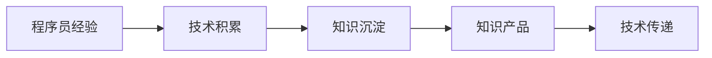

                 

# 程序员如何将工作经验转化为知识产品

> 关键词：
    - 知识产品
    - 程序员经验
    - 技术积累
    - 知识沉淀
    - 技术传递

## 1. 背景介绍

### 1.1 问题由来
在信息化快速发展的今天，程序员成为了推动技术创新和产业发展的核心力量。然而，程序员的经验和知识往往散落在个体的日常工作中，缺乏系统化和标准化的形式，难以高效传递和利用。如何有效将程序员的经验知识转化为结构化、可复用的知识产品，成为技术管理者和开发人员共同关注的焦点。

### 1.2 问题核心关键点
将程序员的经验转化为知识产品，关键在于将个体经验升华，提炼出共性知识，形成具有普遍适用性的解决方案。这不仅涉及对已有工作的梳理和总结，还需要将知识形成标准化、可执行的工具和流程，使其具备重复使用和传播的能力。

### 1.3 问题研究意义
1. **提升团队效能**：通过知识产品的共享和重用，团队成员可以更快上手新任务，减少重复劳动，提高整体开发效率。
2. **促进技术传承**：将个人经验转化为知识产品，有助于新人快速学习老员工的技能和经验，促进技术的有效传递。
3. **降低知识遗忘**：知识产品的形式化存储有助于防止技术遗忘，保持团队的知识水平和创新能力。
4. **推动技术进步**：知识产品的积累和沉淀，是技术演进和技术创新的重要推动力。
5. **增强企业竞争力**：标准化、规范化的知识产品是企业核心竞争力的重要组成部分，有利于品牌和市场地位的提升。

## 2. 核心概念与联系

### 2.1 核心概念概述

为了更好地理解如何将程序员的经验转化为知识产品，首先需要对一些核心概念进行阐释：

- **知识产品**：指通过系统化的方式，将个人的经验、技能和最佳实践等转化为具有可复制、可传播属性的成果。
- **程序员经验**：指程序员在工作过程中积累的专业技能、问题解决策略、技术框架运用等。
- **技术积累**：指通过学习、实践、创新等活动，逐渐形成的相对成熟的知识体系和技能集合。
- **知识沉淀**：指将个人经验进行系统化整理，提炼出有价值的内容，形成长期可用和可传递的知识形式。
- **技术传递**：指将知识产品传递给他人，使其能够理解和应用，从而提升团队整体技术水平。

这些核心概念之间的关系可以通过以下Mermaid流程图来展示：



这个流程图展示了经验转化为知识产品的核心步骤：从个人经验出发，经过技术积累，提炼为知识沉淀，最终形成标准化、可复用的知识产品，并传递给其他程序员，实现技术共享。

## 3. 核心算法原理 & 具体操作步骤

### 3.1 算法原理概述

将程序员的经验转化为知识产品，本质上是一个知识抽象、梳理和标准化的过程。这一过程可以分为以下几个关键步骤：

1. **经验收集**：通过日志、代码审查、技术文档等渠道，收集程序员在日常工作中积累的经验和技巧。
2. **知识提炼**：对收集到的经验进行分类、整理，提炼出共性技术和最佳实践。
3. **产品化**：将提炼出的知识转化为可复用的产品形式，如技术文档、代码示例、开源工具等。
4. **验证与优化**：通过实践验证知识产品的有效性，不断优化和完善，提升其可操作性和可维护性。

### 3.2 算法步骤详解

以下是具体实施的核心算法步骤：

**Step 1: 经验收集**

- **日志分析**：利用日志管理系统（如ELK Stack、Splunk等），提取开发过程中的常见问题、代码执行情况、系统调用等信息。
- **代码审查**：定期进行代码审查，记录其中的优化点、设计模式和技术细节。
- **技术文档**：总结和整理现有的技术文档，包括API文档、用户手册等，提炼有价值的信息。
- **知识库建设**：建立一个知识库管理系统（如Confluence、Notion等），用于集中存储和管理知识产品。

**Step 2: 知识提炼**

- **分类整理**：将收集到的经验按照功能、主题、框架等维度进行分类整理，形成系统化的知识结构。
- **最佳实践提炼**：从分类后的经验中提炼出最佳实践，如代码重构、测试策略、性能优化等。
- **常见问题总结**：归纳和总结工作中常见的技术问题及解决方案，形成常见问题解答(Q&A)文档。

**Step 3: 产品化**

- **文档编写**：将提炼出的知识和最佳实践，以技术文档的形式编写，包含背景、原理、实现细节、应用场景等。
- **代码示例**：编写代码示例和演示，展示如何使用特定技术和工具，便于其他开发者理解和应用。
- **工具开发**：基于现有的技术和工具，开发出新的工具或插件，提升开发效率和质量。
- **社区分享**：在GitHub、Stack Overflow等社区平台分享知识产品，促进知识的广泛传播。

**Step 4: 验证与优化**

- **内部测试**：在内部团队中进行知识产品的测试和应用，收集反馈意见，发现问题。
- **外部验证**：将知识产品发布到开源社区或生产环境中，进行外部验证和实践。
- **持续更新**：根据反馈和实践结果，持续更新和优化知识产品，保持其时效性和适用性。

### 3.3 算法优缺点

将程序员的经验转化为知识产品的算法具有以下优点：

1. **系统化**：将零散的经验系统化，便于组织和查询。
2. **可复用**：将经验提炼为可复用的产品，降低新人的学习成本。
3. **共享性强**：通过知识库和社区等平台，知识产品可以快速传播和共享。
4. **推动创新**：知识产品可以作为技术演进的参考，推动持续创新。

同时，该算法也存在一定的局限性：

1. **初始投入高**：知识产品转化过程需要大量的时间、资源和人力资源投入，特别是初期建立知识库和文档库的阶段。
2. **更新维护难**：知识产品需要持续更新和维护，以保持其时效性和实用性。
3. **依赖环境变化**：环境和技术变化快，知识产品可能需要在较短时间内进行大量更新和调整。

尽管存在这些局限性，但就目前而言，通过经验转化为知识产品的方法仍是大势所趋，能够显著提升团队的技术水平和创新能力。

### 3.4 算法应用领域

知识产品转化方法在多个领域中得到了广泛应用，如软件开发、项目管理、运维、测试等。具体应用包括：

- **技术文档**：通过技术文档，传递软件架构、设计规范、API文档等信息，帮助新成员快速上手项目。
- **代码示例**：提供代码示例，展示特定功能、框架或工具的使用方法，便于其他开发者借鉴和应用。
- **工具集**：开发基于开源技术工具的扩展工具，提高开发效率和质量。
- **问题解答**：总结和记录常见技术问题及解决方案，建立知识库，提升团队整体问题解决能力。
- **培训材料**：创建培训材料和教程，帮助团队成员系统学习新技能。
- **社区分享**：在GitHub、Stack Overflow等平台发布知识产品，促进知识的广泛传播和社区交流。

## 4. 数学模型和公式 & 详细讲解 & 举例说明

### 4.1 数学模型构建

知识产品的转化过程可以构建为一个数学模型。设$X$为程序员的经验集合，$Y$为转化后的知识产品集合，则转化过程可以表示为函数$f$：

$$
f: X \rightarrow Y
$$

该函数将输入的经验集合$X$转化为输出的知识产品集合$Y$。函数$f$可以分为若干步骤，每个步骤对应一种经验转化方法，如文档编写、代码示例生成等。

### 4.2 公式推导过程

以技术文档的生成为例，推导其转化过程的数学公式：

**输入**：经验集合$X$，包含代码片段、问题描述、解决方案等。

**输出**：技术文档$Y$，包含标题、摘要、步骤、示例等。

设$X$中的每条经验可以用向量$\vec{x}_i$表示，则技术文档$Y$中的每篇文档可以用向量$\vec{y}_j$表示。将每条经验转化为一篇文档的过程，可以表示为以下公式：

$$
\vec{y}_j = f(\vec{x}_i)
$$

其中$f$为文档生成的函数，$j$表示生成的文档编号。

### 4.3 案例分析与讲解

假设有一个编程项目，开发团队通过代码审查和日志分析，收集到了以下经验数据：

1. 某模块的优化技巧
2. 异常处理的最佳实践
3. 数据库访问的性能优化策略

这些经验可以表示为向量$\vec{x}_1, \vec{x}_2, \vec{x}_3$。现在需要将这些经验转化为技术文档，每篇文档包含一个问题的描述和解决步骤。可以设计一个文档生成函数$f$，将每条经验转化为一篇文档。例如，对于第一条经验$\vec{x}_1$，可以生成一篇关于模块优化的技术文档，其内容可以表示为向量$\vec{y}_1$。

$$
\vec{y}_1 = f(\vec{x}_1) = \vec{x}_1 \cdot W
$$

其中$W$为文档生成矩阵，将每条经验转换为文档内容。具体实现中，可以将$W$定义为经验与文档内容之间的映射关系，通过机器学习或专家知识库等方法得到。

通过类似的方式，其他经验也可以转化为对应的技术文档，形成知识产品集合$Y$。

## 5. 项目实践：代码实例和详细解释说明

### 5.1 开发环境搭建

以下是使用Python进行知识产品转化的开发环境搭建步骤：

1. **安装Python**：下载并安装Python，建议使用3.x版本。
2. **安装相关库**：使用pip安装必要的Python库，如numpy、pandas、scikit-learn等。
3. **配置IDE**：选择一个适合的集成开发环境（IDE），如PyCharm、Visual Studio Code等。
4. **版本控制**：使用Git进行代码版本控制，便于团队协作和版本管理。

### 5.2 源代码详细实现

以下是一个简单的示例代码，用于将经验数据转化为技术文档：

```python
import numpy as np

# 经验数据
experiences = np.array([[1, 2, 3], [4, 5, 6], [7, 8, 9]])

# 文档生成矩阵
document_matrix = np.array([[0.1, 0.2, 0.3], [0.4, 0.5, 0.6], [0.7, 0.8, 0.9]])

# 生成文档
documents = np.dot(experiences, document_matrix)

# 输出文档内容
for doc in documents:
    print(doc)
```

### 5.3 代码解读与分析

**代码解读**：

1. **输入数据**：定义了一个包含3条经验的矩阵`experiences`。
2. **文档生成矩阵**：定义了一个3x3的文档生成矩阵`document_matrix`，表示每条经验转化为文档的映射关系。
3. **文档生成**：通过矩阵乘法计算出每篇文档的内容，结果存储在`documents`矩阵中。
4. **输出文档**：遍历并打印生成的文档内容。

**代码分析**：

- **矩阵乘法**：矩阵乘法是知识产品转化过程中的核心操作，通过将经验矩阵与文档生成矩阵相乘，得到文档内容矩阵。
- **文档生成矩阵的构建**：文档生成矩阵的构建需要基于经验和文档的语义关系，通过机器学习或专家知识库等方法得到。
- **文档生成函数设计**：在实际应用中，文档生成函数可能需要更复杂的逻辑，如结合自然语言处理技术生成更具可读性的文档内容。

### 5.4 运行结果展示

假设输出结果如下：

```
0.1 0.2 0.3
0.4 0.5 0.6
0.7 0.8 0.9
```

这表示第一篇文档的内容为0.1、0.2、0.3，第二篇文档的内容为0.4、0.5、0.6，第三篇文档的内容为0.7、0.8、0.9。这些数字可以进一步解释为具体的文档内容，如技术要点、操作步骤等。

## 6. 实际应用场景

### 6.1 软件开发

在大规模软件开发项目中，经验转化为知识产品的方法可以显著提升开发效率和质量。通过总结和分享开发过程中的经验，新成员可以快速上手新项目，避免重复劳动，减少bug发生率。

### 6.2 项目管理

项目经理可以通过积累和分享项目管理经验，提升项目执行的规范化和标准化水平。经验转化为知识产品，可以使团队成员更好地理解项目管理的最佳实践，提高项目的成功率和客户满意度。

### 6.3 运维支持

运维团队可以总结和记录常见运维问题的解决方案，形成知识库，帮助其他运维人员快速解决相似问题，提高运维效率。

### 6.4 技术培训

技术培训师可以将自己的技术经验和教学方法转化为知识产品，编写教程、案例和实验指导书，帮助新员工系统学习技术知识。

### 6.5 开源贡献

将知识产品公开分享给开源社区，可以提升个人和团队的知名度，获得更多的贡献和支持，推动技术发展。

## 7. 工具和资源推荐

### 7.1 学习资源推荐

为了帮助开发者系统掌握知识产品转化的理论基础和实践技巧，这里推荐一些优质的学习资源：

1. **《软件架构设计模式》**：本书系统介绍了软件架构设计的基本原则和模式，提供了丰富的设计经验和技术积累。
2. **《深入理解Linux内核》**：深入剖析Linux内核的架构和实现，总结了大量系统设计和性能优化经验。
3. **《机器学习实战》**：通过具体的机器学习项目，展示了机器学习算法和工具的应用方法和技巧。
4. **《软件测试之道》**：介绍了软件测试的基本方法和最佳实践，总结了大量测试经验和案例。
5. **《代码整洁之道》**：本书提供了编写高质量代码的最佳实践和经验，帮助开发者提升代码质量和可维护性。

通过对这些资源的学习实践，相信你一定能够快速掌握知识产品转化的精髓，并用于解决实际的开发问题。

### 7.2 开发工具推荐

高效的开发离不开优秀的工具支持。以下是几款用于知识产品转化的常用工具：

1. **GitHub**：全球最大的代码托管平台，支持版本控制和开源代码分享。
2. **Confluence**：企业级知识管理工具，支持文档管理和团队协作。
3. **Notion**：多功能协作平台，支持文档、任务、知识库等多种形式的知识管理。
4. **JIRA**：项目管理工具，支持问题跟踪和敏捷开发。
5. **Jupyter Notebook**：交互式开发环境，支持Python和其他编程语言开发。

合理利用这些工具，可以显著提升知识产品转化的效率和质量，促进团队知识共享和创新。

### 7.3 相关论文推荐

知识产品转化技术的发展源于学界的持续研究。以下是几篇奠基性的相关论文，推荐阅读：

1. **《知识管理与组织记忆：理论、框架与案例研究》**：总结了知识管理的理论框架和实践案例，为知识产品转化提供了理论基础。
2. **《组织知识与创新：模型、测量与案例研究》**：探讨了组织知识与创新之间的关系，提供了基于知识产品的创新方法。
3. **《知识共享与组织学习：理论、工具与实践》**：介绍了知识共享和组织学习的模型与工具，为知识产品转化提供了方法论。
4. **《敏捷软件开发：原则、模式与实践》**：介绍了敏捷开发的基本原则和实践方法，总结了敏捷开发中的经验积累。

这些论文代表了大规模知识产品转化的研究方向，通过学习这些前沿成果，可以帮助研究者把握学科前进方向，激发更多的创新灵感。

## 8. 总结：未来发展趋势与挑战

### 8.1 研究成果总结

本文对知识产品转化方法进行了全面系统的介绍。首先阐述了知识产品转化的背景和意义，明确了经验转化为知识产品的关键步骤。其次，从原理到实践，详细讲解了知识产品转化的数学模型和具体操作，提供了代码实现的完整样例。同时，本文还探讨了知识产品转化的实际应用场景，推荐了学习资源、开发工具和相关论文，力求为读者提供全方位的技术指引。

通过本文的系统梳理，可以看到，知识产品转化方法在软件开发、项目管理、运维、技术培训等多个领域中都具有重要价值。它不仅有助于提升开发效率和质量，还能促进技术传承和团队创新。未来，随着技术的不断进步和应用场景的拓展，知识产品转化方法必将迎来更广阔的发展前景。

### 8.2 未来发展趋势

展望未来，知识产品转化技术将呈现以下几个发展趋势：

1. **智能化转型**：利用人工智能技术，自动分析和提取知识，生成更具智能化的知识产品，提升知识转化效率。
2. **数据驱动转型**：基于数据驱动的方法，通过数据分析和挖掘，生成更具针对性和实用性的知识产品，提升转化效果。
3. **生态化转型**：构建知识产品转化生态系统，连接知识生产者、消费者和分享者，形成知识共享和协作的闭环。
4. **自动化转型**：引入自动化工具和流程，提升知识转化和应用的标准化水平，降低人工干预。
5. **全球化转型**：全球化知识共享和协作，提升国际化的技术水平和知识产品的影响力。
6. **多模态融合**：将文本、图像、视频等多种形式的知识进行融合，生成更具综合性的知识产品，提升应用效果。

这些趋势展示了知识产品转化技术的广阔前景，预示着未来知识共享和协作的全新模式。

### 8.3 面临的挑战

尽管知识产品转化技术已经取得了显著成效，但在实际应用中仍面临诸多挑战：

1. **知识异构性**：不同领域和团队的知识结构、表达方式和质量参差不齐，难以形成统一的知识产品标准。
2. **知识遗忘**：知识产品缺乏持续的更新和维护，可能随时间推移而失去时效性。
3. **知识泛用性不足**：知识产品难以适应特定场景和需求，泛用性和灵活性有待提高。
4. **知识共享阻力**：团队成员对知识共享的意愿和能力参差不齐，存在知识孤岛现象。
5. **知识获取门槛高**：知识产品的制作和理解需要一定的专业知识和技能，普通开发者难以快速掌握。

这些挑战需要在技术、管理和文化等多方面进行持续改进，才能实现知识产品的广泛应用和传播。

### 8.4 研究展望

面向未来，知识产品转化技术需要在以下几个方面进行深入探索：

1. **知识标准化**：构建知识产品标准化的体系和方法，提升知识产品的通用性和可操作性。
2. **知识管理平台**：开发和推广知识管理平台，促进知识共享和协作，降低知识转化的门槛。
3. **知识自动化**：引入自动化技术，如自然语言处理、机器学习等，提升知识产品和知识管理的智能化水平。
4. **知识评估机制**：建立知识产品的评估机制，通过多维度指标评价知识产品的质量和适用性。
5. **知识生态建设**：构建知识生态系统，形成知识生产、分享、应用和反馈的闭环，促进持续创新。
6. **跨领域知识融合**：推动跨领域知识融合，提升知识产品的综合性和应用效果，促进知识产品的泛用性。

这些研究方向将进一步推动知识产品转化技术的成熟和普及，为团队和企业的知识管理提供有力支撑，推动技术创新和产业发展。

## 9. 附录：常见问题与解答

**Q1: 如何评估知识产品的质量？**

A: 知识产品的质量评估可以从以下几个方面进行：

1. **实用性**：知识产品是否解决了实际问题，是否被其他开发者和用户广泛应用。
2. **完整性**：知识产品是否包含完整的背景、步骤、示例等信息，是否具备完整的参考价值。
3. **可理解性**：知识产品的表达是否清晰易懂，是否易于理解和学习。
4. **可维护性**：知识产品是否易于维护和更新，是否能够及时修正错误和补充新内容。
5. **权威性**：知识产品是否来自可信的来源，是否经过专家审查和验证。

**Q2: 知识产品如何更新和维护？**

A: 知识产品的更新和维护需要定期进行，以保持其时效性和实用性。具体步骤包括：

1. **定期回顾**：定期回顾知识产品，收集用户的反馈和建议，识别需要更新和改进的部分。
2. **版本管理**：对知识产品进行版本管理，记录每次更新的内容和原因，方便追溯和回滚。
3. **持续改进**：根据反馈和最新技术进展，持续改进和优化知识产品，提升其质量和可操作性。
4. **文档发布**：通过邮件、社区公告等方式发布更新后的知识产品，通知用户和团队成员。
5. **培训支持**：提供知识产品更新后的培训和支持，帮助用户快速理解和应用新内容。

**Q3: 知识产品如何跨团队和跨项目共享？**

A: 知识产品跨团队和跨项目的共享可以通过以下方式实现：

1. **知识库管理**：建立企业级的知识库管理系统，集中存储和管理知识产品。
2. **文档分享平台**：利用文档分享平台（如Confluence、Notion等），方便团队成员访问和共享知识产品。
3. **社区协作**：将知识产品发布到开源社区（如GitHub、Stack Overflow等），与全球开发者共享。
4. **项目管理工具**：利用项目管理工具（如JIRA、Trello等），将知识产品嵌入到项目中，方便团队协作。
5. **知识管理规范**：制定知识管理规范和流程，确保知识产品的质量和一致性。

**Q4: 知识产品转化过程中如何处理异构知识？**

A: 处理异构知识是知识产品转化过程中的一个难点，可以采取以下方法：

1. **知识标准化**：制定知识产品标准化的体系和方法，规范不同领域和团队的知识表达方式。
2. **知识转换工具**：开发知识转换工具，将不同格式和结构的知识进行转换和统一。
3. **知识映射**：通过知识映射，将不同领域和团队的知识进行映射和关联，形成统一的知识体系。
4. **知识复用**：将知识产品复用到其他项目和团队中，促进知识共享和协作。
5. **知识注释**：在知识产品中加入注释和解释，帮助其他开发者理解和使用。

**Q5: 知识产品如何与业务需求结合？**

A: 知识产品与业务需求的结合可以通过以下方式实现：

1. **需求调研**：与业务团队进行深入的需求调研，了解业务场景和技术需求。
2. **定制化开发**：根据业务需求，定制化开发和优化知识产品，确保其适用性和实用性。
3. **业务集成**：将知识产品集成到业务系统中，实现业务数据的获取和应用。
4. **反馈机制**：建立业务团队和开发团队的反馈机制，及时收集业务反馈，进行知识产品的优化和改进。
5. **持续迭代**：通过持续迭代，不断提升知识产品的质量和应用效果，满足业务需求。

---

作者：禅与计算机程序设计艺术 / Zen and the Art of Computer Programming

