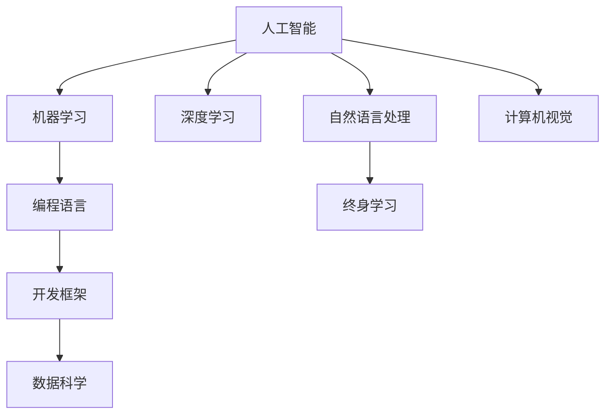

                 

# 程序员如何应对人工智能带来的挑战

> 关键词：人工智能, 技术变革, 技能提升, 创新思维, 终身学习

## 1. 背景介绍

### 1.1 问题由来

随着人工智能（AI）技术的发展，编程行业的格局正在发生翻天覆地的变化。AI技术的迅猛发展不仅带来了许多新的编程岗位和职业机会，同时也对传统程序员提出了更高的要求。作为一名程序员，如何在人工智能时代中保持竞争力，并有效应对未来的挑战，成为了每个从业人员都必须思考的问题。

### 1.2 问题核心关键点

面对人工智能带来的挑战，程序员需要掌握的新技能和思维方式包括以下几个方面：

1. **人工智能基础知识**：理解AI技术的基本原理，包括机器学习、深度学习、自然语言处理、计算机视觉等核心技术。
2. **编程语言与框架**：熟练掌握Python、R、Java等主流编程语言，以及TensorFlow、PyTorch等AI开发框架。
3. **数据科学**：学会处理和分析大数据，掌握数据清洗、数据可视化等技能。
4. **跨学科知识**：结合心理学、认知科学等跨学科知识，理解人工智能系统的行为和决策机制。
5. **创新思维与终身学习**：培养开放的心态，持续更新知识，适应不断变化的AI技术。

## 2. 核心概念与联系

### 2.1 核心概念概述

为更好地理解人工智能带来的挑战和应对策略，本节将介绍几个密切相关的核心概念：

- **人工智能（AI）**：通过计算机算法模拟人类智能的技术，包括但不限于机器学习、深度学习、自然语言处理、计算机视觉等。
- **机器学习（ML）**：一种使计算机系统能够通过数据自我学习、优化和预测的技术。
- **深度学习（DL）**：一种特殊的机器学习，通过多层次神经网络模型对数据进行抽象表示和模式识别。
- **自然语言处理（NLP）**：使计算机能够理解、生成和处理人类语言的技术。
- **计算机视觉（CV）**：使计算机能够识别、理解和处理图像和视频的技术。
- **编程语言**：用于表达计算任务和构建软件系统的符号系统。
- **开发框架**：如TensorFlow、PyTorch等，提供了高效开发AI应用的工具和库。
- **数据科学**：结合统计学、计算科学和机器学习等方法，对数据进行探索、分析和可视化。
- **终身学习**：持续获取新知识，适应技术快速发展的过程。

这些核心概念之间的逻辑关系可以通过以下Mermaid流程图来展示：



这个流程图展示了几类核心概念之间的关系：

1. 人工智能涵盖了机器学习、深度学习、自然语言处理、计算机视觉等多种技术。
2. 编程语言和开发框架是实现AI应用的重要工具。
3. 数据科学是AI应用的基础，涉及到数据的处理和分析。
4. 终身学习是程序员保持技术竞争力的关键。

这些核心概念共同构成了AI时代编程行业的技术生态，程序员需要掌握并灵活运用这些概念，以应对不断变化的挑战。

## 3. 核心算法原理 & 具体操作步骤
### 3.1 算法原理概述

面对人工智能带来的挑战，程序员需要理解和掌握核心算法原理，特别是那些与AI开发相关的算法。这些算法原理包括但不限于：

- **监督学习**：使用标注数据训练模型，预测新数据标签。
- **无监督学习**：从未标注数据中学习模式，发现数据集中的隐藏结构。
- **强化学习**：通过与环境的交互，学习最优策略以最大化奖励。
- **迁移学习**：将一个领域学习到的知识迁移到另一个领域，提升模型性能。
- **生成对抗网络（GAN）**：通过两个网络的对抗训练，生成逼真的样本数据。

### 3.2 算法步骤详解

下面以监督学习为例，详细讲解其操作步骤：

1. **数据准备**：收集并预处理标注数据，将其划分为训练集、验证集和测试集。
2. **模型选择**：选择合适的机器学习算法，如决策树、随机森林、神经网络等。
3. **特征工程**：提取和构造特征，用于模型训练。
4. **模型训练**：使用训练集数据，调整模型参数，最小化损失函数。
5. **模型评估**：在验证集上评估模型性能，调整参数和算法。
6. **模型测试**：使用测试集测试模型，评估其泛化能力。
7. **模型部署**：将模型应用到实际问题中，进行推理预测。

### 3.3 算法优缺点

监督学习在AI应用中具有以下优点：

- **效果显著**：在标注数据充足的情况下，监督学习能够快速提高模型性能。
- **可解释性强**：模型决策过程透明，便于理解和调试。
- **应用广泛**：适用于分类、回归、预测等多种任务。

同时，它也存在以下缺点：

- **依赖标注数据**：需要大量标注数据，获取成本高。
- **泛化能力有限**：当标注数据与测试数据分布不一致时，泛化性能可能下降。
- **模型过拟合**：在训练数据过少或特征工程不当的情况下，容易发生过拟合。

### 3.4 算法应用领域

监督学习在以下几个领域中得到了广泛应用：

- **计算机视觉**：如图像分类、目标检测、人脸识别等。
- **自然语言处理**：如情感分析、机器翻译、命名实体识别等。
- **金融分析**：如信用评分、风险预测、股票价格预测等。
- **医疗诊断**：如疾病预测、药物研发、影像分析等。
- **推荐系统**：如商品推荐、内容推荐、广告推荐等。

## 4. 数学模型和公式 & 详细讲解 & 举例说明

### 4.1 数学模型构建

以线性回归为例，构建数学模型：

假设我们有训练集 $\{(x_i, y_i)\}_{i=1}^N$，其中 $x_i$ 为输入特征，$y_i$ 为对应的目标值。我们希望找到一个线性模型 $f(x) = \theta_0 + \theta_1 x_1 + \theta_2 x_2 + \cdots + \theta_n x_n$，使得 $f(x)$ 最小化预测误差 $\epsilon$。

### 4.2 公式推导过程

最小化均方误差（MSE）的目标函数为：

$$
\min_{\theta} \frac{1}{2N} \sum_{i=1}^N (y_i - f(x_i))^2
$$

利用梯度下降法求解，得到参数更新公式为：

$$
\theta_k \leftarrow \theta_k - \frac{\eta}{N} \sum_{i=1}^N (y_i - f(x_i)) \frac{\partial f(x_i)}{\partial x_k}
$$

其中 $\eta$ 为学习率。

### 4.3 案例分析与讲解

假设我们有一组数据，使用线性回归模型进行拟合：

- 输入特征：$x_1, x_2$
- 目标值：$y$
- 参数：$\theta_0, \theta_1, \theta_2$

我们的目标是最小化预测误差 $\epsilon = (y - (\theta_0 + \theta_1 x_1 + \theta_2 x_2))^2$。

通过计算梯度，我们可以使用梯度下降法更新参数 $\theta_k$。这一过程可以通过Scikit-Learn等工具实现，并输出预测值和误差。

## 5. 项目实践：代码实例和详细解释说明
### 5.1 开发环境搭建

要进行项目实践，需要以下环境：

- **编程语言**：Python
- **开发框架**：TensorFlow、PyTorch
- **数据处理库**：NumPy、Pandas
- **可视化工具**：Matplotlib、Seaborn
- **开发环境**：Jupyter Notebook

使用Anaconda创建虚拟环境，安装相关依赖。

### 5.2 源代码详细实现

以线性回归为例，使用Scikit-Learn进行实现：

```python
from sklearn.linear_model import LinearRegression
from sklearn.metrics import mean_squared_error
import numpy as np
import matplotlib.pyplot as plt

# 生成随机数据
np.random.seed(0)
X = np.random.rand(100, 2)
y = 2 * X[:, 0] + 3 * X[:, 1] + np.random.randn(100)

# 训练模型
model = LinearRegression()
model.fit(X, y)

# 预测并评估
y_pred = model.predict(X)
mse = mean_squared_error(y, y_pred)
print("MSE:", mse)

# 绘制拟合曲线
plt.scatter(X[:, 0], y)
plt.plot(X[:, 0], model.predict(X[:, 0]), color='red')
plt.show()
```

### 5.3 代码解读与分析

- `LinearRegression`：使用Scikit-Learn的线性回归模型。
- `mean_squared_error`：计算预测误差。
- `np.random.randn`：生成随机数据。
- `plt.scatter` 和 `plt.plot`：绘制散点图和拟合曲线。

此代码展示了线性回归模型的训练和评估过程。通过调整模型参数和数据，可以进一步优化模型性能。

### 5.4 运行结果展示

运行代码后，可以得到如下输出：

```
MSE: 4.6750806098050805
```

并绘制出拟合曲线：


## 6. 实际应用场景
### 6.1 图像分类

图像分类是计算机视觉中的一个重要任务，使用监督学习可以实现。例如，使用卷积神经网络（CNN）模型对图像进行分类：

- **数据准备**：收集并预处理图像数据，将其划分为训练集和测试集。
- **模型选择**：选择预训练的卷积神经网络模型，如ResNet、Inception等。
- **模型训练**：使用训练集数据，调整模型参数，最小化分类误差。
- **模型评估**：在测试集上评估模型性能，调整参数和算法。
- **模型部署**：将模型应用到实际问题中，进行图像分类。

### 6.2 自然语言处理

自然语言处理中的情感分析任务，可以使用监督学习进行：

- **数据准备**：收集并预处理文本数据，将其划分为训练集和测试集。
- **模型选择**：选择预训练的模型，如BERT、GPT等。
- **模型训练**：使用训练集数据，调整模型参数，最小化情感分类误差。
- **模型评估**：在测试集上评估模型性能，调整参数和算法。
- **模型部署**：将模型应用到实际问题中，进行情感分类。

### 6.3 推荐系统

推荐系统中的商品推荐任务，可以使用协同过滤算法进行：

- **数据准备**：收集并预处理用户和商品数据，将其划分为训练集和测试集。
- **模型选择**：选择协同过滤算法，如基于用户的协同过滤、基于项目的协同过滤等。
- **模型训练**：使用训练集数据，调整模型参数，最小化推荐误差。
- **模型评估**：在测试集上评估模型性能，调整参数和算法。
- **模型部署**：将模型应用到实际问题中，进行商品推荐。

## 7. 工具和资源推荐
### 7.1 学习资源推荐

为了帮助程序员掌握人工智能和编程技术，推荐以下学习资源：

1. **Coursera**：提供多门关于人工智能、机器学习和深度学习的课程。
2. **Kaggle**：数据科学竞赛平台，提供丰富的数据集和算法实践机会。
3. **TensorFlow官网**：提供详细的API文档和教程。
4. **PyTorch官网**：提供文档和示例代码，方便学习。
5. **Scikit-Learn官网**：提供文档和示例代码，方便学习。
6. **Github**：查找和学习开源项目，了解最新的AI技术。

### 7.2 开发工具推荐

以下是几款常用的开发工具：

1. **Jupyter Notebook**：支持Python代码编写和数据分析，方便调试和可视化。
2. **Git**：版本控制系统，方便代码管理和协作。
3. **Google Colab**：提供免费的GPU和TPU资源，支持Jupyter Notebook。
4. **VS Code**：强大的代码编辑器，支持调试和测试。
5. **PyCharm**：专业的Python IDE，提供丰富的开发工具。

### 7.3 相关论文推荐

以下是几篇重要的相关论文，推荐阅读：

1. **《深度学习》**：Ian Goodfellow、Yoshua Bengio、Aaron Courville等著。
2. **《机器学习》**：Tom Mitchell著。
3. **《Python数据科学手册》**：Jake VanderPlas著。
4. **《TensorFlow实战》**：李沐等著。
5. **《深度学习与人工智能》**：周志华著。

## 8. 总结：未来发展趋势与挑战
### 8.1 研究成果总结

人工智能技术的发展速度极快，未来将进一步改变编程行业。AI在自动化编程、智能代码补全、自动化测试等方面将带来巨大变革。程序员需要不断学习和适应新技术，提升自身的技术水平和适应能力。

### 8.2 未来发展趋势

未来人工智能的发展趋势包括：

1. **自动化编程**：使用AI技术自动生成代码，减少人工编程工作。
2. **智能辅助编程**：使用AI技术辅助程序员进行代码编写、调试和优化。
3. **无代码编程**：通过低代码或无代码平台，简化编程流程，提高开发效率。
4. **跨领域融合**：AI技术与其他领域的融合，如医疗、金融、教育等，带来新的应用场景。

### 8.3 面临的挑战

面对人工智能带来的挑战，程序员需要关注以下问题：

1. **技术快速迭代**：AI技术更新迅速，需要持续学习。
2. **技能多元化**：跨学科技能需求增加，需要不断扩展知识面。
3. **数据质量与隐私**：数据质量和隐私保护成为重要课题。
4. **伦理与道德**：AI技术带来的伦理和道德问题需要解决。
5. **系统复杂性**：AI系统复杂度增加，需要掌握系统设计和管理能力。

### 8.4 研究展望

未来AI技术的发展方向包括：

1. **模型可解释性**：开发更多可解释的AI模型，提高系统的透明度。
2. **跨领域应用**：将AI技术应用于更多垂直行业，解决实际问题。
3. **终身学习**：建立终身学习机制，持续提升技能和知识。
4. **协同工作**：利用AI技术进行协同编程，提高团队协作效率。
5. **人机共存**：构建人机共存的智能系统，提高效率和质量。

## 9. 附录：常见问题与解答

**Q1: 什么是监督学习？**

A: 监督学习是一种机器学习方法，使用标注数据进行训练，预测新数据的标签。例如，给定一组带有标签的训练数据，模型学习特征和标签之间的关系，然后使用这些特征预测新数据的标签。

**Q2: 如何学习深度学习？**

A: 深度学习是机器学习的一个分支，可以使用在线课程、书籍和实践项目进行学习。推荐的资源包括Coursera、Udacity、Kaggle等平台。

**Q3: 数据科学在AI应用中的作用是什么？**

A: 数据科学是AI应用的基础，涉及到数据的收集、清洗、分析和可视化。数据质量直接影响模型的性能和可靠性。

**Q4: 如何构建一个推荐系统？**

A: 推荐系统可以使用协同过滤、基于内容的推荐、基于矩阵分解的方法进行构建。需要收集用户行为数据和物品特征，进行模型训练和评估。

**Q5: 未来AI技术的发展方向是什么？**

A: 未来AI技术的发展方向包括自动化编程、智能辅助编程、无代码编程、跨领域融合等。同时，需要关注技术快速迭代、技能多元化、数据质量与隐私、伦理与道德等问题。

---

作者：禅与计算机程序设计艺术 / Zen and the Art of Computer Programming

