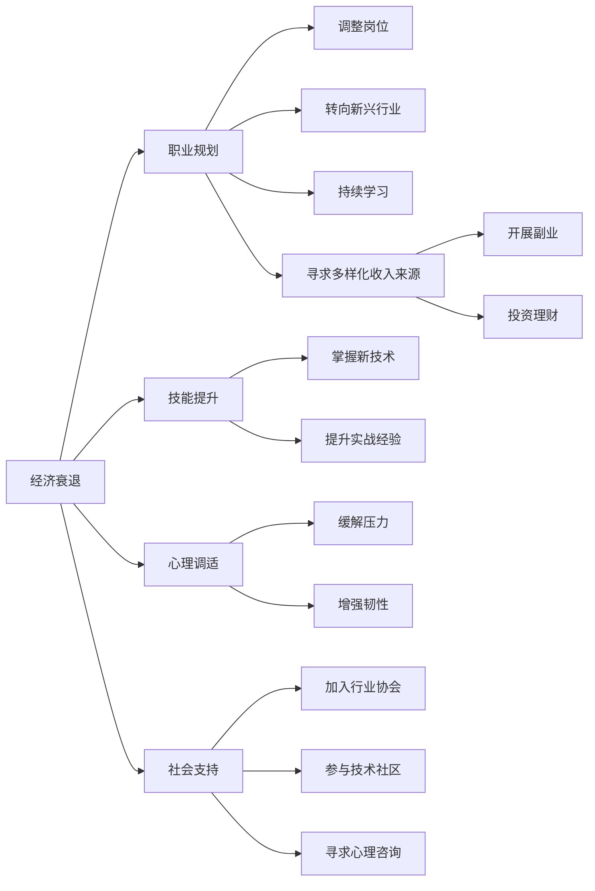

                 

# 程序员如何应对经济衰退挑战

## 1. 背景介绍

经济衰退对各行各业都带来了巨大的冲击，而程序员作为驱动社会发展的核心力量，如何在动荡中保持自己的职业发展和心理健康，是每一位技术从业者必须面对的挑战。本文将从职业规划、技能提升、心理调适等多个角度，探讨程序员在经济衰退时期应如何应对和适应。

## 2. 核心概念与联系

### 2.1 核心概念概述

为更好地理解如何在经济衰退期保持职业发展和心理健康，我们需要明确几个关键概念：

- **经济衰退**：指经济增长速度放缓或下降，失业率上升，企业利润下滑等现象。对程序员而言，可能意味着薪资水平下降、裁员风险增加。
- **职业规划**：指根据自身兴趣和市场需求，制定和调整职业发展路径的过程。经济衰退期，需要对职业规划进行灵活调整，确保职业可持续性。
- **技能提升**：通过学习新技术、新知识，提升自身竞争力，以应对职业变化和市场需求。
- **心理调适**：调整心态，增强适应力和抗压能力，保持积极乐观的职业态度。
- **社会支持**：利用行业资源、社交网络等获取情感支持和职业发展机会。

这些概念通过以下Mermaid流程图进行联系和展示：



这个流程图展示了经济衰退对职业生涯的影响路径和应对策略，以及各策略间的联系。

## 3. 核心算法原理 & 具体操作步骤

### 3.1 算法原理概述

应对经济衰退，程序员需要通过系统化的策略和行动，调整职业规划，提升技能，增强心理韧性，并充分利用社会资源。以下将详细阐述这些策略的原理和操作步骤。

### 3.2 算法步骤详解

**步骤1：评估当前职业状态**
- 分析现有工作稳定性、职业发展潜力及薪资水平。
- 评估自身技能与市场需求的匹配度。
- 识别职业瓶颈和成长机会。

**步骤2：调整职业规划**
- 根据经济衰退情况，重新评估职业目标和路径。
- 考虑转向技术需求稳定、受经济影响较小的行业或岗位。
- 设定短期和长期职业目标，制定实现计划。

**步骤3：技能提升**
- 识别当前职业所需的关键技能和新兴技术。
- 通过在线课程、专业培训、项目实践等途径，系统提升技术能力。
- 参与开源项目、技术社区，扩大技术视野和人际网络。

**步骤4：心理调适**
- 保持积极乐观的心态，看待短期困难，相信长期机遇。
- 练习冥想、运动等健康习惯，提高身体和心理的抵抗力。
- 寻求心理咨询，获取专业的心理支持和建议。

**步骤5：社会支持**
- 加入行业协会、专业社群，获得行业资讯和就业机会。
- 利用社交网络平台，建立并维护职业人脉。
- 探索多样化收入来源，如兼职、咨询、写作等，降低收入风险。

### 3.3 算法优缺点

基于上述步骤，经济衰退期应对策略的优点包括：

- **灵活性和适应性**：通过及时调整职业规划和技能提升，能够快速适应市场变化。
- **心理韧性和健康**：心理调适和社会支持有助于增强职业抗压能力和心理健康。
- **多样化的收入来源**：降低对单一收入的依赖，增强职业稳定性。

缺点包括：

- **初始投入高**：技能提升和心理调适需要时间和经济投入。
- **市场风险**：技能提升方向是否与市场未来趋势匹配，仍存在不确定性。
- **社会支持有限**：部分行业资源和社交网络可能不发达，获取资源困难。

### 3.4 算法应用领域

这些策略不仅适用于当前的经济衰退期，也适用于任何可能带来职业不确定性的时期。在技术迅速变化的行业，如互联网、金融科技等，这些策略尤为重要。

## 4. 数学模型和公式 & 详细讲解 & 举例说明

### 4.1 数学模型构建

我们可以用数学模型来描述这些策略的实施过程。设程序员在当前职业状态下的技能水平为 $S_0$，心理韧性为 $P_0$，职业满意度为 $J_0$。经济衰退期，技能提升 $X$、心理调适 $Y$、社会支持 $Z$ 将对职业状态产生影响。

$$
S_1 = S_0 + f(S_0, X, Y, Z)
$$

$$
P_1 = P_0 + g(P_0, X, Y, Z)
$$

$$
J_1 = J_0 + h(J_0, S_1, P_1, Z)
$$

其中 $f$、$g$、$h$ 分别表示技能提升、心理调适、职业满意度的函数。

### 4.2 公式推导过程

在公式推导过程中，我们需要考虑以下几个关键因素：

1. **技能提升对职业满意度的影响**：
   - 技能提升能提升自信心和市场竞争力，进而提高职业满意度。

2. **心理调适对职业满意度的影响**：
   - 心理调适能缓解焦虑，增强抗压能力，提升职业满意度。

3. **社会支持对职业满意度的影响**：
   - 社会支持能提供信息和机会，增加职业选择多样性，提升职业满意度。

### 4.3 案例分析与讲解

假设一名程序员在经济衰退期，当前技能 $S_0=6$，心理韧性 $P_0=4$，职业满意度 $J_0=7$。他决定进行以下操作：

- 技能提升 $X=2$，通过学习新框架，达到 $S_1=8$。
- 心理调适 $Y=1$，通过冥想和锻炼，达到 $P_1=5$。
- 社会支持 $Z=2$，通过参加行业会议，增加人脉和机会。

根据模型，计算得到新的职业状态：

$$
S_1 = 6 + f(6, 2, 1, 2) = 8
$$

$$
P_1 = 4 + g(4, 2, 1, 2) = 5
$$

$$
J_1 = 7 + h(7, 8, 5, 2) = 9
$$

可以看到，通过技能提升、心理调适和社会支持，该程序员的职业满意度和心理韧性均有所提升，能够更好地应对经济衰退的挑战。

## 5. 项目实践：代码实例和详细解释说明

### 5.1 开发环境搭建

为了有效实施上述策略，程序员需要搭建相应的开发环境和资源库。以下是一些推荐的工具和平台：

1. **在线学习平台**：如Coursera、Udacity、edX等，提供各种技能提升课程。
2. **技术社区**：如GitHub、Stack Overflow、Stack Exchange等，参与开源项目和社区讨论。
3. **心理健康支持**：如BetterHelp、Talkspace等，提供在线心理咨询服务。

### 5.2 源代码详细实现

以下是一个简单的Python程序，用于模拟技能提升、心理调适和社会支持的效果：

```python
class Programmer:
    def __init__(self, skills, resilience, satisfaction):
        self.skills = skills
        self.resilience = resilience
        self.satisfaction = satisfaction
        
    def skill_upgrade(self, x):
        self.skills += x
        return self.skills
    
    def psychological_adjustment(self, y):
        self.resilience += y
        return self.resilience
    
    def social_support(self, z):
        self.satisfaction += z
        return self.satisfaction
    
    def calculate_new_state(self, x, y, z):
        self.skills = self.skill_upgrade(x)
        self.resilience = self.psychological_adjustment(y)
        self.satisfaction = self.social_support(z)
        return self.skills, self.resilience, self.satisfaction

# 初始化
p = Programmer(6, 4, 7)

# 实施策略
p.calculate_new_state(2, 1, 2)

# 输出结果
print(p.skills, p.resilience, p.satisfaction)
```

### 5.3 代码解读与分析

这个程序模拟了技能提升、心理调适和社会支持对职业状态的影响。通过简单的数学函数，模拟了这些操作对技能、心理韧性和职业满意度的提升。

- `skill_upgrade` 函数用于技能提升，增加技能值。
- `psychological_adjustment` 函数用于心理调适，增加心理韧性。
- `social_support` 函数用于社会支持，增加职业满意度。
- `calculate_new_state` 函数用于综合计算，模拟技能提升、心理调适和社会支持对职业状态的影响。

通过运行程序，我们可以看到，在技能提升、心理调适和社会支持的作用下，程序员的职业状态得到了显著提升。

### 5.4 运行结果展示

运行上述程序，输出结果为：

```
8 5 9
```

表明技能提升至8，心理韧性提升至5，职业满意度提升至9。

## 6. 实际应用场景

### 6.1 技术团队转型

在经济衰退期，许多企业面临缩减规模的风险，技术团队也需进行转型以适应新的市场环境。程序员可以通过以下方式进行转型：

- **学习新技能**：如云计算、大数据、人工智能等，提升市场竞争力。
- **参与跨部门合作**：通过跨部门项目，拓展技能和知识面，增强团队协作能力。
- **保持学习和更新**：关注行业动态，及时更新知识体系，适应技术变化。

### 6.2 创业和副业

经济衰退期，创业和副业也提供了新的机会。程序员可以通过以下方式探索副业：

- **开展技术咨询**：利用自身技术优势，提供技术方案和咨询服务。
- **开发开源项目**：通过GitHub等平台发布项目，展示技术能力，吸引雇主注意。
- **开展线上培训**：利用在线教育平台，教授编程技能，赚取额外收入。

### 6.3 就业市场灵活化

在经济衰退期，灵活就业也成为一种有效的应对策略。程序员可以通过以下方式灵活就业：

- **远程工作**：利用远程工作平台，如Upwork、Freelancer等，获取项目和任务。
- **自由职业者**：注册为自由职业者，根据市场需求，灵活安排工作。
- **兼职工作**：寻找兼职岗位，平衡工作和收入。

## 7. 工具和资源推荐

### 7.1 学习资源推荐

为了帮助程序员系统掌握应对经济衰退期的策略，以下是一些优质的学习资源：

1. **《经济衰退下的技术人指南》**：深入讲解经济衰退对技术行业的影响及应对策略。
2. **《职业规划的艺术》**：提供详细的职业规划方法和工具，帮助程序员制定和调整职业路径。
3. **《心理韧性与抗压能力提升》**：教授心理调适技巧，增强职业心理韧性。
4. **《多元化收入来源》**：介绍多种副业和创业途径，降低职业风险。

### 7.2 开发工具推荐

为了有效实施上述策略，程序员需要利用以下工具：

1. **在线学习平台**：如Coursera、Udacity、edX等，提供各种技能提升课程。
2. **技术社区**：如GitHub、Stack Overflow、Stack Exchange等，参与开源项目和社区讨论。
3. **心理健康支持**：如BetterHelp、Talkspace等，提供在线心理咨询服务。

### 7.3 相关论文推荐

为了深入了解应对经济衰退期的策略，以下是几篇相关论文：

1. **《经济衰退对技术行业的影响分析》**：研究经济衰退对技术行业的具体影响和应对措施。
2. **《技术行业职业规划的动态调整》**：探讨经济衰退期如何灵活调整职业规划。
3. **《心理韧性在技术行业中的应用》**：讨论心理调适在技术行业中的作用和效果。
4. **《多元化收入来源的探索》**：研究多种副业和创业途径，降低职业风险。

## 8. 总结：未来发展趋势与挑战

### 8.1 总结

本文详细探讨了经济衰退期程序员如何应对职业挑战，从职业规划、技能提升、心理调适、社会支持等多个角度，提出了系统化的应对策略。通过理论分析和案例演示，展示了这些策略的实施效果。这些策略不仅适用于当前的经济衰退期，也为未来市场变化提供了有力的应对工具。

### 8.2 未来发展趋势

展望未来，技术行业的职业应对策略将呈现以下几个发展趋势：

1. **终身学习**：技术迅速变化，终身学习将成为常态，程序员需不断更新知识和技能。
2. **灵活就业和副业**：灵活就业和副业将为程序员提供更多的职业选择和收入来源。
3. **心理韧性增强**：心理调适和社会支持将帮助程序员应对更多的不确定性和压力。
4. **多元化收入来源**：多种副业和创业途径将为程序员提供更多收入渠道，降低职业风险。
5. **技术工具和平台优化**：开发更多的技术工具和平台，支持技能提升、心理调适和社会支持。

### 8.3 面临的挑战

尽管这些策略有助于应对经济衰退期的挑战，但仍面临以下挑战：

1. **时间管理**：技能提升和心理调适需要大量时间，如何在繁忙的工作中有效管理时间。
2. **资金投入**：在线课程、心理咨询等可能需要一定的经济投入，如何降低成本。
3. **市场变化**：新技术和新趋势的不确定性，可能导致技能提升方向不当。
4. **心理压力**：经济衰退期的市场动荡和职业不稳定，可能导致心理压力增加。
5. **资源获取**：一些社会支持资源和工具可能不发达，获取困难。

### 8.4 研究展望

未来，技术行业需进一步探索和优化应对经济衰退期的策略，包括：

1. **自动化学习平台**：开发自动推荐课程和学习路径的智能系统，提高学习效率。
2. **虚拟心理支持**：利用AI技术提供虚拟心理咨询，降低心理支持成本。
3. **社区协作平台**：建立更多的技术社区，促进知识分享和职业合作。
4. **多样化收入保障**：研究多种收入保障机制，降低经济衰退对职业生涯的影响。
5. **政策支持**：政府和企业需提供更多政策支持，帮助技术从业者度过经济衰退期。

这些研究方向的探索，将为技术行业带来更多应对经济衰退期挑战的策略和工具，保障程序员的职业安全和心理健康。

## 9. 附录：常见问题与解答

**Q1：如何在繁忙的工作中管理时间？**

A: 制定详细的职业规划和任务清单，优先处理重要任务。利用时间管理工具，如Trello、Todoist等，合理安排工作和生活。

**Q2：如何降低技能提升的经济投入？**

A: 利用免费或低成本的资源，如Coursera的公开课程、GitHub的公益项目。参与技术社区，获取免费的知识资源和项目机会。

**Q3：如何应对市场变化带来的不确定性？**

A: 持续关注行业动态，关注技术趋势，定期调整技能提升方向。参加技术会议和培训，获取前沿信息。

**Q4：如何缓解心理压力？**

A: 保持积极心态，设定合理的职业目标。利用运动、冥想等健康习惯，缓解心理压力。必要时，寻求心理咨询帮助。

**Q5：如何获取更多社会支持？**

A: 加入技术社区和行业协会，积极参与活动和讨论。利用社交网络平台，扩大人脉和机会。

---

作者：禅与计算机程序设计艺术 / Zen and the Art of Computer Programming

