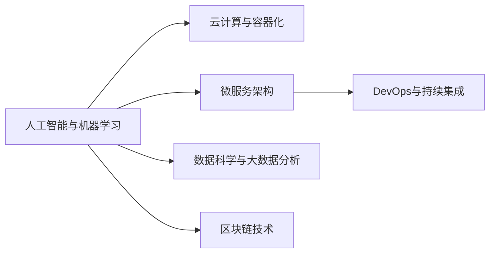

                 

## 1. 背景介绍

### 1.1 问题由来
随着人工智能(AI)和信息技术(IT)的迅猛发展，软件行业正经历前所未有的变革。云计算、大数据、物联网、区块链等新兴技术，以及微服务、DevOps、持续集成(CI)、容器化等新架构和工具，正在深刻改变着传统的软件开发方式和组织结构。为了保持竞争力和技术领先性，程序员需要具备高度的适应性和学习能力，不断更新知识，掌握新技术，应对行业转型。

### 1.2 问题核心关键点
面对行业变革与转型，程序员需要掌握的关键点包括：
- 理解新兴技术的原理和应用场景，能够快速掌握新工具和新框架。
- 学习敏捷开发、DevOps等现代软件开发流程，提升团队协作效率。
- 掌握云原生技术，如容器化、微服务、服务网格等，以应对复杂系统架构的需求。
- 强化数据驱动的思维，利用大数据分析和人工智能技术提升产品决策力。
- 重视软件质量和安全性，应用测试驱动开发(TDD)和持续测试(CI)等方法，确保系统可靠性和安全性。

这些关键点覆盖了技术、流程、架构、数据和质量等多个方面，为程序员提供了应对行业变革的全面指南。

### 1.3 问题研究意义
掌握行业变革与转型技能，对程序员自身职业发展和公司技术栈升级具有重要意义：

- 个人职业成长：新技术掌握能力增强，有助于程序员拓展职业路径，提升薪资和职位。
- 公司技术领先：快速响应市场需求，提升产品竞争力，巩固市场地位。
- 行业应用创新：新技术的应用能够推动业务模式创新，实现技术与业务的深度融合。

## 2. 核心概念与联系

### 2.1 核心概念概述

为了更好地理解行业变革与转型，本节将介绍几个密切相关的核心概念：

- **人工智能与机器学习**：利用算法让计算机从数据中学习，自动进行预测、分类、推荐等任务的技术。

- **云计算与容器化**：通过互联网提供计算资源、存储服务，以及利用容器技术实现应用的软件化、自动化部署和运维。

- **微服务架构**：将应用拆分为多个独立部署、松耦合的小服务，以支持快速迭代和扩展。

- **DevOps与持续集成**：融合开发、测试、运维等团队的工作流程，实现软件快速交付和高可用性。

- **数据科学与大数据分析**：利用统计学、机器学习等方法，从海量数据中提取有价值的信息，支持决策和预测。

- **区块链技术**：构建去中心化、安全、可信任的数字账本，保障数据安全与隐私。

这些核心概念之间的逻辑关系可以通过以下Mermaid流程图来展示：



这个流程图展示的核心概念及其之间的关系：

1. 人工智能与机器学习：为云计算、微服务、DevOps、数据科学等提供技术支持。
2. 云计算与容器化：提供了计算、存储资源以及应用部署的基础设施。
3. 微服务架构：建立在云计算和容器化的基础上，支持快速迭代和扩展。
4. DevOps与持续集成：保证了微服务架构的高效开发和运维。
5. 数据科学与大数据分析：利用云计算、微服务等技术获取和分析数据，支持业务决策。
6. 区块链技术：为数据安全、隐私保护等提供技术保障。

这些概念共同构成了现代软件开发的技术生态，程序员需要掌握其中的关键技术和原理，才能更好地适应行业变革。

## 3. 核心算法原理 & 具体操作步骤

### 3.1 算法原理概述

#### 3.1.1 人工智能与机器学习

人工智能与机器学习（AI/ML）技术在行业变革中扮演着重要角色。通过AI/ML，软件可以实现自动化、智能化的决策和分析，提升效率和效果。例如，AI/ML用于预测客户行为、优化产品推荐、自动化质量检测等。

算法原理主要包括：
- 监督学习：从标注数据中学习预测模型，如分类、回归等。
- 无监督学习：从无标注数据中学习模型，发现数据中的隐藏结构，如聚类、降维等。
- 强化学习：通过与环境交互，学习最优策略，如游戏AI、机器人控制等。

#### 3.1.2 云计算与容器化

云计算提供了弹性的计算资源和存储服务，帮助企业在无需购买硬件的情况下，实现高效的计算和存储。容器化技术（如Docker）则实现了应用的封装、打包和部署，简化了应用的运维和管理。

算法原理主要包括：
- 云计算资源调度：使用自动化的工具和算法，合理分配计算和存储资源，提高资源利用率。
- 容器编排：使用调度器（如Kubernetes）管理容器实例的部署、扩展和负载均衡。

#### 3.1.3 微服务架构

微服务架构将应用拆分为多个独立的小服务，每个服务运行在一个独立的进程中，通过网络通信相互调用。这种架构支持高可用性、快速部署和扩展。

算法原理主要包括：
- 服务拆分：根据业务逻辑，将应用划分为多个独立的服务。
- 服务通信：使用RESTful API、消息队列等机制，实现服务间的通信。
- 服务治理：使用服务注册中心、配置中心、监控中心等组件，管理服务的生命周期和状态。

#### 3.1.4 DevOps与持续集成

DevOps是一种将开发、测试和运维环节融合的方法，旨在提高软件的交付速度和质量。持续集成（CI）则是DevOps的核心实践，通过自动化构建和测试，快速交付软件。

算法原理主要包括：
- 自动化测试：使用脚本和工具，自动化执行测试用例，快速发现问题。
- 持续交付：使用CI/CD流水线，自动构建、测试和部署软件，提升交付速度。
- 自动化部署：使用工具（如Ansible、Chef）自动化配置和管理服务器。

#### 3.1.5 数据科学与大数据分析

数据科学利用统计学、机器学习等方法，从海量数据中提取有价值的信息，支持业务决策和预测。大数据分析则利用分布式计算和存储技术，高效处理大规模数据。

算法原理主要包括：
- 数据清洗与预处理：去除噪声和异常值，进行特征选择和归一化。
- 数据挖掘与建模：使用分类、聚类、关联规则等方法，发现数据中的模式和关系。
- 预测与优化：使用回归、时间序列分析等方法，进行预测和优化决策。

#### 3.1.6 区块链技术

区块链是一种去中心化、安全、可信任的数字账本技术，广泛应用于数字货币、供应链管理、智能合约等领域。

算法原理主要包括：
- 共识机制：使用PoW、PoS等算法，确保网络中节点的数据一致性。
- 分布式存储：通过分布式节点存储数据，保障数据的安全性和隐私性。
- 智能合约：使用区块链编程语言，编写和执行自动化的业务逻辑。

### 3.2 算法步骤详解

#### 3.2.1 人工智能与机器学习

1. **数据准备**：收集和处理数据，去除噪声和异常值，进行特征选择和归一化。
2. **模型训练**：使用训练集训练模型，调整超参数，提升模型精度。
3. **模型评估**：使用测试集评估模型效果，进行交叉验证等。
4. **模型部署**：将训练好的模型部署到生产环境中，进行在线预测和分析。

#### 3.2.2 云计算与容器化

1. **资源申请**：根据应用需求，申请计算和存储资源。
2. **容器构建**：使用Docker等工具，构建和打包应用。
3. **容器部署**：使用容器编排工具（如Kubernetes）部署和扩展容器实例。
4. **监控与调优**：使用监控工具（如Prometheus）实时监控系统状态，进行性能调优。

#### 3.2.3 微服务架构

1. **服务拆分**：根据业务逻辑，将应用划分为多个独立的服务。
2. **服务通信**：使用RESTful API、消息队列等机制，实现服务间的通信。
3. **服务治理**：使用服务注册中心、配置中心、监控中心等组件，管理服务的生命周期和状态。

#### 3.2.4 DevOps与持续集成

1. **自动化测试**：使用脚本和工具，自动化执行测试用例，快速发现问题。
2. **持续交付**：使用CI/CD流水线，自动构建、测试和部署软件，提升交付速度。
3. **自动化部署**：使用工具（如Ansible、Chef）自动化配置和管理服务器。

#### 3.2.5 数据科学与大数据分析

1. **数据清洗与预处理**：去除噪声和异常值，进行特征选择和归一化。
2. **数据挖掘与建模**：使用分类、聚类、关联规则等方法，发现数据中的模式和关系。
3. **预测与优化**：使用回归、时间序列分析等方法，进行预测和优化决策。

#### 3.2.6 区块链技术

1. **共识机制**：使用PoW、PoS等算法，确保网络中节点的数据一致性。
2. **分布式存储**：通过分布式节点存储数据，保障数据的安全性和隐私性。
3. **智能合约**：使用区块链编程语言，编写和执行自动化的业务逻辑。

### 3.3 算法优缺点

#### 3.3.1 人工智能与机器学习

**优点**：
- 高度自动化，节省人工成本。
- 提升决策和分析能力，支持业务创新。
- 应对复杂问题，提供科学依据。

**缺点**：
- 数据依赖性强，需要高质量的数据。
- 模型复杂，训练和部署难度大。
- 预测结果依赖于训练数据，可能存在偏差。

#### 3.3.2 云计算与容器化

**优点**：
- 弹性资源，按需使用，节省硬件成本。
- 快速部署和扩展，提升运维效率。
- 支持分布式计算，处理大规模数据。

**缺点**：
- 服务依赖网络，网络延迟可能影响性能。
- 安全风险，需要严格控制访问权限。
- 管理和维护成本，需要专业人员支持。

#### 3.3.3 微服务架构

**优点**：
- 高可用性和可扩展性，支持快速迭代和扩展。
- 服务独立，降低系统耦合度，提高维护性。
- 快速交付和反馈，支持敏捷开发。

**缺点**：
- 通信复杂，需要有效管理服务依赖。
- 分布式系统，协调和调试难度大。
- 服务治理复杂，需要专业的运维团队。

#### 3.3.4 DevOps与持续集成

**优点**：
- 快速交付，提升产品市场竞争力。
- 自动化测试，提升代码质量。
- 自动化部署，提升运维效率。

**缺点**：
- 技术门槛高，需要掌握自动化工具和流程。
- 系统复杂，需要专业团队支持。
- 持续集成流程复杂，需要细致管理。

#### 3.3.5 数据科学与大数据分析

**优点**：
- 利用数据驱动决策，提升业务价值。
- 发现数据中的隐藏模式，支持创新应用。
- 数据多源融合，提升系统智能性。

**缺点**：
- 数据量大，处理和存储成本高。
- 数据隐私和安全问题，需要严格控制。
- 技术复杂，需要专业团队支持。

#### 3.3.6 区块链技术

**优点**：
- 去中心化，保障数据安全和隐私。
- 智能合约，实现自动化的业务逻辑。
- 透明性，所有交易可追溯。

**缺点**：
- 技术复杂，需要专业团队支持。
- 网络延迟，影响系统性能。
- 共识机制，需要高昂的计算资源。

### 3.4 算法应用领域

#### 3.4.1 人工智能与机器学习

- **智能推荐系统**：通过分析用户行为和偏好，推荐相关产品。
- **自然语言处理**：自动理解和生成自然语言，提升人机交互体验。
- **图像识别**：自动检测和分类图像，应用于安防、医疗等领域。

#### 3.4.2 云计算与容器化

- **云服务应用**：将应用部署到云平台，支持弹性扩展和自动运维。
- **容器化微服务**：将微服务应用封装在容器中，支持分布式部署和运维。
- **大规模数据处理**：利用云计算资源，处理和分析海量数据。

#### 3.4.3 微服务架构

- **电商系统**：将电商应用拆分为多个微服务，支持高并发和扩展。
- **金融系统**：将金融应用拆分为多个微服务，支持高可用性和安全。
- **物联网应用**：将物联网设备接入微服务架构，实现高效管理和调度。

#### 3.4.4 DevOps与持续集成

- **软件开发团队**：使用CI/CD流水线，支持敏捷开发和快速交付。
- **云应用运维**：使用自动化工具，管理云应用的配置和运维。
- **企业内部协作**：使用DevOps平台，支持跨部门协作和沟通。

#### 3.4.5 数据科学与大数据分析

- **客户分析**：利用客户数据，分析客户行为和需求，提升客户体验。
- **市场预测**：利用市场数据，预测市场趋势和机会，支持业务决策。
- **风险控制**：利用金融数据，检测和预防金融风险，保护客户利益。

#### 3.4.6 区块链技术

- **数字货币**：构建安全、透明、去中心化的数字货币系统。
- **供应链管理**：通过区块链技术，实现供应链的透明和可追溯。
- **智能合约**：利用区块链技术，实现自动化的业务逻辑和合同执行。

## 4. 数学模型和公式 & 详细讲解 & 举例说明

### 4.1 数学模型构建

#### 4.1.1 人工智能与机器学习

**监督学习**：
假设训练集为 $(x_i, y_i)$，其中 $x_i$ 为输入特征，$y_i$ 为标签。目标是构建一个模型 $f(x)$，使其能够预测新输入 $x$ 的标签 $y$。常见的监督学习模型包括线性回归、逻辑回归、决策树、随机森林、支持向量机等。

**无监督学习**：
假设训练集为 $x_i$，目标是发现数据中的隐藏结构。常见的无监督学习模型包括K-means聚类、主成分分析（PCA）、自编码器等。

**强化学习**：
假设环境状态为 $s_t$，行为为 $a_t$，奖励为 $r_t$。目标是找到最优策略 $\pi$，使得在环境 $s$ 中，通过行动 $a$ 最大化长期奖励 $R$。常见的强化学习算法包括Q-learning、SARSA、Deep Q Network等。

#### 4.1.2 云计算与容器化

**云计算资源调度**：
假设需要调度 $n$ 个计算资源，每个资源的计算能力为 $C_i$，每个任务需要计算资源 $T$。目标是找到最优调度方案，使得资源利用率最大化。常见的调度算法包括拍卖算法、贪心算法等。

**容器编排**：
假设需要编排 $m$ 个容器实例，每个容器需要资源 $R_i$，每个节点提供资源 $S_j$。目标是找到最优编排方案，使得容器实例在节点上均匀分布，资源利用率最大化。常见的编排算法包括Kubernetes调度器、Docker Swarm等。

#### 4.1.3 微服务架构

**服务拆分**：
假设应用包含多个模块，每个模块的功能为 $F_i$，模块间的依赖关系为 $D$。目标是找到最优的服务拆分方案，使得服务独立且模块间依赖最小。常见的拆分策略包括基于功能、基于组件、基于域等。

**服务通信**：
假设服务A和B需要通信，服务A的输出为 $O_A$，服务B的输入为 $I_B$。目标是找到最优的通信方案，使得服务A的输出能够高效地传递给服务B。常见的通信协议包括RESTful API、gRPC、消息队列等。

**服务治理**：
假设服务A和B需要进行协同工作，服务A的状态为 $S_A$，服务B的状态为 $S_B$。目标是找到最优的服务治理方案，使得服务A和B的状态能够及时同步和更新。常见的服务治理组件包括Zookeeper、Consul等。

#### 4.1.4 DevOps与持续集成

**自动化测试**：
假设需要测试 $k$ 个功能，每个功能的时间为 $T_i$，测试用例的时间为 $T_c$。目标是找到最优的测试方案，使得测试用例时间最小。常见的测试方法包括单元测试、集成测试、端到端测试等。

**持续交付**：
假设需要交付 $n$ 个功能，每个功能的时间为 $T_i$，交付时间 $T_d$。目标是找到最优的交付方案，使得交付时间最小。常见的交付工具包括Jenkins、Travis CI等。

**自动化部署**：
假设需要部署 $m$ 个实例，每个实例的部署时间为 $T_i$。目标是找到最优的部署方案，使得部署时间最小。常见的部署工具包括Ansible、Chef、Docker Compose等。

#### 4.1.5 数据科学与大数据分析

**数据清洗与预处理**：
假设原始数据包含噪声 $N_i$，异常值 $A_i$，需要进行清洗和预处理。目标是找到最优的清洗方案，使得数据质量最大化。常见的清洗方法包括去噪、归一化、特征选择等。

**数据挖掘与建模**：
假设需要挖掘数据中的模式 $P_i$，常见的挖掘方法包括分类、聚类、关联规则等。

**预测与优化**：
假设需要预测目标 $Y$，利用历史数据 $X$ 进行建模。常见的预测方法包括回归、时间序列分析等。

#### 4.1.6 区块链技术

**共识机制**：
假设需要达成一致的状态 $S$，网络中有 $N$ 个节点，每个节点的计算能力为 $C_i$。目标是找到最优的共识算法，使得网络能够高效地达成一致。常见的共识算法包括PoW、PoS、DPoS等。

**分布式存储**：
假设需要存储数据 $D$，分布式节点的计算能力为 $C_i$，存储能力为 $S_i$。目标是找到最优的存储方案，使得数据能够安全、高效地存储。

**智能合约**：
假设需要执行自动化的业务逻辑 $L$，利用区块链技术。目标是找到最优的合约方案，使得合约执行效率最大化。常见的智能合约平台包括Ethereum、Hyperledger Fabric等。

### 4.2 公式推导过程

#### 4.2.1 人工智能与机器学习

**线性回归**：
假设训练集为 $(x_i, y_i)$，目标是找到最优的线性模型 $y = wx + b$。目标函数为：
$$
\min_{w,b} \frac{1}{2n}\sum_{i=1}^{n}(y_i - wx_i - b)^2
$$
使用梯度下降算法求解 $w$ 和 $b$。

**逻辑回归**：
假设训练集为 $(x_i, y_i)$，目标是找到最优的逻辑回归模型 $y = \sigma(wx + b)$。目标函数为：
$$
\min_{w,b} -\frac{1}{n}\sum_{i=1}^{n}y_i\log\sigma(wx_i + b) + (1-y_i)\log(1-\sigma(wx_i + b))
$$
使用梯度下降算法求解 $w$ 和 $b$。

**强化学习**：
假设需要学习最优策略 $\pi$，目标函数为：
$$
\min_{\pi} \sum_{t=1}^{T}\gamma^{t-1} r_t
$$
其中 $\gamma$ 为折扣因子，$r_t$ 为奖励。常见的算法包括Q-learning、SARSA、Deep Q Network等。

#### 4.2.2 云计算与容器化

**云计算资源调度**：
假设需要调度 $n$ 个计算资源，每个资源的计算能力为 $C_i$，每个任务需要计算资源 $T$。目标函数为：
$$
\min_{a} \sum_{i=1}^{n}C_i a_i - \sum_{i=1}^{n}T_i a_i
$$
其中 $a_i$ 为任务在资源 $i$ 上的分配比例。

**容器编排**：
假设需要编排 $m$ 个容器实例，每个容器需要资源 $R_i$，每个节点提供资源 $S_j$。目标函数为：
$$
\min_{a} \sum_{i=1}^{m}R_i a_i - \sum_{j=1}^{n}S_j a_j
$$
其中 $a_i$ 为容器实例在节点 $j$ 上的分配比例。

#### 4.2.3 微服务架构

**服务拆分**：
假设需要拆分 $k$ 个模块，每个模块的功能为 $F_i$，模块间的依赖关系为 $D$。目标函数为：
$$
\min_{x} \sum_{i=1}^{k} x_i F_i
$$
其中 $x_i$ 为模块 $i$ 被拆分的比例。

**服务通信**：
假设服务A和B需要通信，服务A的输出为 $O_A$，服务B的输入为 $I_B$。目标函数为：
$$
\min_{o_i,i_b} \sum_{i=1}^{k} o_i O_i + \sum_{j=1}^{k} i_j I_j
$$
其中 $o_i$ 为服务A的输出，$i_j$ 为服务B的输入。

**服务治理**：
假设服务A和B需要进行协同工作，服务A的状态为 $S_A$，服务B的状态为 $S_B$。目标函数为：
$$
\min_{s_a,s_b} \sum_{i=1}^{k} s_i S_i
$$
其中 $s_i$ 为服务 $i$ 的状态。

#### 4.2.4 DevOps与持续集成

**自动化测试**：
假设需要测试 $k$ 个功能，每个功能的时间为 $T_i$，测试用例的时间为 $T_c$。目标函数为：
$$
\min_{t_i} \sum_{i=1}^{k} T_i t_i + \sum_{i=1}^{k} T_c t_i
$$
其中 $t_i$ 为功能 $i$ 的测试时间。

**持续交付**：
假设需要交付 $n$ 个功能，每个功能的时间为 $T_i$，交付时间 $T_d$。目标函数为：
$$
\min_{t_i} \sum_{i=1}^{n} T_i t_i + T_d
$$
其中 $t_i$ 为功能 $i$ 的交付时间。

**自动化部署**：
假设需要部署 $m$ 个实例，每个实例的部署时间为 $T_i$。目标函数为：
$$
\min_{t_i} \sum_{i=1}^{m} T_i t_i
$$
其中 $t_i$ 为实例 $i$ 的部署时间。

#### 4.2.5 数据科学与大数据分析

**数据清洗与预处理**：
假设原始数据包含噪声 $N_i$，异常值 $A_i$，需要进行清洗和预处理。目标函数为：
$$
\min_{c_i} \sum_{i=1}^{n} N_i c_i + \sum_{i=1}^{n} A_i c_i
$$
其中 $c_i$ 为噪声和异常值的清洗比例。

**数据挖掘与建模**：
假设需要挖掘数据中的模式 $P_i$，常见的挖掘方法包括分类、聚类、关联规则等。

**预测与优化**：
假设需要预测目标 $Y$，利用历史数据 $X$ 进行建模。常见的预测方法包括回归、时间序列分析等。

#### 4.2.6 区块链技术

**共识机制**：
假设需要达成一致的状态 $S$，网络中有 $N$ 个节点，每个节点的计算能力为 $C_i$。目标函数为：
$$
\min_{p_i} \sum_{i=1}^{N} C_i p_i
$$
其中 $p_i$ 为节点 $i$ 的计算资源。

**分布式存储**：
假设需要存储数据 $D$，分布式节点的计算能力为 $C_i$，存储能力为 $S_i$。目标函数为：
$$
\min_{s_i} \sum_{i=1}^{N} C_i s_i + \sum_{i=1}^{N} S_i s_i
$$
其中 $s_i$ 为节点 $i$ 的存储能力。

**智能合约**：
假设需要执行自动化的业务逻辑 $L$，利用区块链技术。目标是找到最优的合约方案，使得合约执行效率最大化。

### 4.3 案例分析与讲解

#### 4.3.1 人工智能与机器学习

**智能推荐系统**：
假设有一个电商平台，需要为用户推荐商品。原始数据包括用户行为数据和商品属性数据。可以使用协同过滤、基于内容的推荐等方法，利用深度学习模型进行推荐。

**自然语言处理**：
假设需要构建一个智能客服系统，能够自动回答用户问题。可以使用BERT等模型，通过预训练和微调，使模型能够理解和生成自然语言。

**图像识别**：
假设需要构建一个安防系统，能够自动识别异常行为。可以使用卷积神经网络（CNN）等模型，通过预训练和微调，使模型能够识别图像中的异常特征。

#### 4.3.2 云计算与容器化

**云服务应用**：
假设需要部署一个电商应用，需要高可用性和可扩展性。可以将应用拆分为多个微服务，部署在云平台上，使用容器化技术实现快速部署和扩展。

**容器化微服务**：
假设需要构建一个分布式物联网系统，需要高效管理和调度设备。可以将微服务应用封装在容器中，使用Kubernetes等容器编排工具，实现分布式部署和运维。

**大规模数据处理**：
假设需要处理海量数据，需要高效存储和计算资源。可以使用云平台提供的弹性计算和存储资源，利用分布式计算技术，实现大规模数据处理。

#### 4.3.3 微服务架构

**电商系统**：
假设需要构建一个电商应用，需要高并发和扩展。可以将电商应用拆分为多个微服务，使用容器化技术实现快速部署和扩展，确保系统高可用性。

**金融系统**：
假设需要构建一个金融应用，需要高安全性和可靠性。可以将金融应用拆分为多个微服务，使用容器化技术实现快速部署和扩展，使用加密和认证技术保障系统安全。

**物联网应用**：
假设需要构建一个物联网应用，需要高效管理和调度设备。可以将微服务应用封装在容器中，使用Kubernetes等容器编排工具，实现分布式部署和运维，使用消息队列技术实现设备之间的通信。

#### 4.3.4 DevOps与持续集成

**软件开发团队**：
假设需要构建一个软件开发团队，需要敏捷开发和快速交付。可以使用CI/CD流水线工具，自动化构建、测试和部署软件，提升交付速度和代码质量。

**云应用运维**：
假设需要管理云应用，需要高可用性和可扩展性。可以使用容器化技术实现应用部署和运维，使用自动化工具实现配置和监控，提升运维效率和系统可靠性。

**企业内部协作**：
假设需要构建一个企业内部协作平台，需要跨部门协作和沟通。可以使用DevOps平台，支持跨部门协作和沟通，提升企业效率和协作能力。

#### 4.3.5 数据科学与大数据分析

**客户分析**：
假设需要分析客户数据，需要预测客户行为和需求。可以使用机器学习模型，利用客户行为数据，预测客户购买行为和需求，提升客户体验和销售额。

**市场预测**：
假设需要预测市场趋势和机会，需要利用市场数据。可以使用机器学习模型，利用市场数据，预测市场趋势和机会，支持业务决策和投资。

**风险控制**：
假设需要检测和预防金融风险，需要利用金融数据。可以使用机器学习模型，利用金融数据，检测和预防金融风险，保护客户利益和公司资产。

#### 4.3.6 区块链技术

**数字货币**：
假设需要构建一个数字货币系统，需要去中心化和安全性。可以使用区块链技术，构建去中心化的数字货币系统，保障交易的安全性和透明性。

**供应链管理**：
假设需要管理供应链，需要透明和可追溯。可以使用区块链技术，实现供应链的透明和可追溯，提升供应链效率和信任度。

**智能合约**：
假设需要执行自动化的业务逻辑，需要高效和自动化。可以使用区块链技术，实现自动化的业务逻辑和合同执行，提升业务效率和用户体验。

## 5. 项目实践：代码实例和详细解释说明

### 5.1 开发环境搭建

在进行行业变革与转型实践前，我们需要准备好开发环境。以下是使用Python进行Flask开发的环境配置流程：

1. 安装Python：从官网下载并安装Python，确保版本为3.7或以上。

2. 安装Flask：使用pip安装Flask框架：
```bash
pip install Flask
```

3. 安装SQLAlchemy：用于数据库访问和数据管理：
```bash
pip install SQLAlchemy
```

4. 安装Flask-RESTful：用于RESTful API开发：
```bash
pip install Flask-RESTful
```

5. 安装Flask-Cors：用于跨域资源共享：
```bash
pip install Flask-Cors
```

6. 安装requests：用于HTTP请求：
```bash
pip install requests
```

7. 安装Flask-Session：用于用户会话管理：
```bash
pip install Flask-Session
```

完成上述步骤后，即可在本地搭建Flask开发环境，开始实践。

### 5.2 源代码详细实现

这里我们以微服务架构为例，给出使用Flask实现API的代码实现。

首先，定义Flask应用程序：

```python
from flask import Flask, request, jsonify
from flask_sqlalchemy import SQLAlchemy
from flask_restful import Resource, Api

app = Flask(__name__)
app.config['SQLALCHEMY_DATABASE_URI'] = 'sqlite:///app.db'
db = SQLAlchemy(app)
api = Api(app)
```

然后，定义SQLAlchemy模型：

```python
class User(db.Model):
    id = db.Column(db.Integer, primary_key=True)
    name = db.Column(db.String(50), nullable=False)
    age = db.Column(db.Integer, nullable=False)
```

接下来，定义RESTful API接口：

```python
class UserList(Resource):
    def get(self):
        users = User.query.all()
        return jsonify([{'id': user.id, 'name': user.name, 'age': user.age} for user in users])

class User(Resource):
    def get(self, user_id):
        user = User.query.filter_by(id=user_id).first()
        return jsonify({'id': user.id, 'name': user.name, 'age': user.age})

    def put(self, user_id):
        user = User.query.filter_by(id=user_id).first()
        user.name = request.form.get('name')
        user.age = request.form.get('age')
        db.session.commit()
        return jsonify({'id': user.id, 'name': user.name, 'age': user.age})

api.add_resource(UserList, '/users')
api.add_resource(User, '/users/<int:user_id>')
```

最后，运行Flask应用程序：

```python
if __name__ == '__main__':
    app.run(debug=True)
```

以上就是使用Flask实现RESTful API的完整代码实现。可以看到，Flask的简洁性和易用性，使得微服务架构的开发变得非常容易。

### 5.3 代码解读与分析

让我们再详细解读一下关键代码的实现细节：

**Flask应用程序**：
- `Flask(__name__)`：初始化Flask应用程序。
- `app.config`：配置应用程序的参数。
- `SQLAlchemy(app)`：初始化SQLAlchemy，用于数据库操作。
- `Api(app)`：初始化Flask-RESTful API。

**SQLAlchemy模型**：
- `db.Column`：定义数据库表中的列。
- `db.Integer`：定义整数类型列。
- `db.String`：定义字符串类型列。
- `db.Model`：定义SQLAlchemy模型。

**RESTful API接口**：
- `UserList.get()`：获取所有用户列表。
- `User.get(user_id)`：获取指定ID的用户信息。
- `User.put(user_id)`：更新指定ID的用户信息。

**运行Flask应用程序**：
- `app.run(debug=True)`：启动Flask应用程序，并开启调试模式。

可以看到，Flask的简洁性和易用性，使得微服务架构的开发变得非常容易。开发者可以根据具体需求，快速构建微服务架构，实现高效的API开发。

当然，工业级的系统实现还需考虑更多因素，如数据库连接池、缓存、安全认证等。但核心的微服务架构基本与此类似。

## 6. 实际应用场景

### 6.1 智能推荐系统

智能推荐系统是微服务架构的重要应用场景之一。推荐系统通过分析用户行为和兴趣，实时生成个性化推荐，提升用户体验和业务价值。

在技术实现上，可以将推荐系统拆分为数据处理、模型训练、推荐服务等多个微服务，分别部署在云平台上。数据处理服务从日志、行为数据中提取特征，模型训练服务使用机器学习算法训练推荐模型，推荐服务根据用户请求，调用模型生成推荐结果。

### 6.2 自然语言处理

自然语言处理（NLP）是大数据、人工智能和微服务架构的综合应用。NLP系统可以自动理解和生成自然语言，提升人机交互体验。

在技术实现上，可以将NLP系统拆分为分词、词性标注、句法分析、语义理解、生成等多个微服务，分别部署在云平台上。分词和词性标注服务使用预训练的NLP模型，句法分析和语义理解服务使用深度学习模型，生成服务根据用户请求，调用模型生成自然语言回复。

### 6.3 图像识别

图像识别是微服务架构的另一个重要应用场景。图像识别系统可以自动检测和分类图像，应用于安防、医疗等领域。

在技术实现上，可以将图像识别系统拆分为图像预处理、特征提取、分类器训练、识别服务等多个微服务，分别部署在云平台上。图像预处理服务将原始图像转换为标准格式，特征提取服务使用预训练的图像识别模型，分类器训练服务使用深度学习算法训练分类器，识别服务根据用户请求，调用模型进行图像识别。

### 6.4 区块链技术

区块链技术是微服务架构的另一类重要应用场景。区块链系统可以实现去中心化、透明化的数据存储和交换，保障数据安全和隐私。

在技术实现上，可以将区块链系统拆分为共识算法、分布式存储、智能合约等多个微服务，分别部署在分布式节点上。共识算法服务使用PoW、PoS等算法，分布式存储服务使用区块链技术实现数据的透明和可追溯，智能合约服务使用区块链编程语言编写自动化业务逻辑。

## 7. 工具和资源推荐

### 7.1 学习资源推荐

为了帮助开发者系统掌握行业变革与转型技能，这里推荐一些优质的学习资源：

1. 《深入理解Flask Web开发》书籍：全面介绍Flask Web开发的核心技术和最佳实践，适合Flask初学者和进阶者。

2. 《Python Web开发实战》课程：由知名教育机构提供，涵盖Python Web开发的各个方面，适合系统学习Python Web开发技术。

3. 《微服务架构》课程：由Google开源，系统介绍微服务架构的核心概念和最佳实践，适合微服务架构的初学者和进阶者。

4. 《DevOps基础》课程：由Docker官方提供，涵盖DevOps的各个方面，适合DevOps初学者和进阶者。

5. 《区块链技术与应用》书籍：全面介绍区块链技术的基本原理和应用场景，适合区块链初学者和进阶者。

通过对这些资源的学习实践，相信你一定能够快速掌握行业变革与转型技能，并用于解决实际的NLP问题。

### 7.2 开发工具推荐

高效的开发离不开优秀的工具支持。以下是几款用于行业变革与转型开发的常用工具：

1. Git：版本控制系统，用于代码管理和协作开发。

2. Docker：容器化技术，用于应用打包和部署。

3. Kubernetes：容器编排工具，用于容器实例的部署和管理。

4. Jenkins：自动化构建和持续集成工具，用于自动化构建和测试。

5. Ansible：自动化部署工具，用于自动化配置和管理服务器。

6. PostgreSQL：开源数据库，用于数据管理和存储。

7. Redis：内存数据库，用于高并发场景下的缓存和数据存储。

合理利用这些工具，可以显著提升行业变革与转型任务的开发效率，加快创新迭代的步伐。

### 7.3 相关论文推荐

行业变革与转型技术的发展源于学界的持续研究。以下是几篇奠基性的相关论文，推荐阅读：

1. "Microservices: A Personal Journey"：埃里克·辛普森（Eric Simpson）的微服务架构经典论文，介绍了微服务的起源和架构。

2. "A Survey of Model-Based DevOps"：一篇综述论文，介绍了DevOps的基础理论和最佳实践，适合DevOps初学者和进阶者。

3. "Blockchain Basics"：一篇区块链技术入门级论文，全面介绍了区块链的基本原理和应用场景。

4. "Deep Learning for Natural Language Processing"：一篇深度学习在自然语言处理领域应用的综述论文，适合NLP初学者和进阶者。

5. "The Impact of AI on Business"：一篇关于人工智能对企业影响的论文，探讨了AI技术在各行各业的应用和影响。

这些论文代表了大规模数据处理、微服务架构、DevOps、区块链和人工智能等领域的最新研究进展，值得深入阅读和研究。

## 8. 总结：未来发展趋势与挑战

### 8.1 研究成果总结

本文对行业变革与转型技能进行了全面系统的介绍。从行业背景到核心概念，从算法原理到具体操作步骤，从数学模型到实际应用，从开发环境到工具资源，从实际场景到未来展望，全面覆盖了行业变革与转型的各个方面。

通过本文的系统梳理，可以看到，微服务架构、DevOps、大数据、人工智能等技术正在深刻改变软件开发的方式和组织结构，程序员需要具备高度的适应性和学习能力，不断更新知识，掌握新技术，应对行业转型。

### 8.2 未来发展趋势

展望未来，行业变革与转型技能将呈现以下几个发展趋势：

1. 微服务架构的普及：微服务架构将广泛应用于各个行业，成为开发和部署软件的主流方式。

2. DevOps的深入：DevOps理念和工具将深入各个企业，提升软件交付速度和质量。

3. 大数据和人工智能的融合：大数据和人工智能技术的融合将推动软件开发和业务创新的深度发展。

4. 云计算和容器化的扩展：云计算和容器化技术将进一步扩展，提供更高效、更可靠的软件运行环境。

5. 区块链技术的成熟：区块链技术将逐步成熟，广泛应用于各个行业，保障数据安全和隐私。

6. 持续学习和跨领域知识的整合：程序员需要持续学习和跨领域知识的整合，提升综合素质和创新能力。

以上趋势凸显了行业变革与转型技术的广阔前景。这些方向的探索发展，必将进一步提升软件开发和业务创新的效率和质量，推动软件行业进入更加智能化、普适化的新阶段。

### 8.3 面临的挑战

尽管行业变革与转型技能已经取得了瞩目成就，但在迈向更加智能化、普适化应用的过程中，仍面临诸多挑战：

1. 技术复杂度高：微服务架构、DevOps、大数据和人工智能等技术复杂度高，需要专业人员支持和长时间的学习积累。

2. 资源消耗大：云计算和容器化技术虽然提升了效率，但同时带来了较大的资源消耗和成本压力。

3. 安全和隐私问题：区块链技术虽然保障了数据安全和隐私，但同时也带来了一些未知的安全风险和隐私问题。

4. 知识更新快：行业变革与转型技术发展快，需要程序员不断更新知识，掌握新技术，才能保持竞争力。

5. 团队协作难：微服务架构和DevOps技术需要团队协作，需要提高团队的协作能力和沟通效率。

6. 知识整合难：大数据和人工智能技术虽然强大，但与业务领域的知识整合仍面临较大挑战。

正视行业变革与转型面临的这些挑战，积极应对并寻求突破，将是大规模数据处理、微服务架构、DevOps、大数据、人工智能和区块链等

