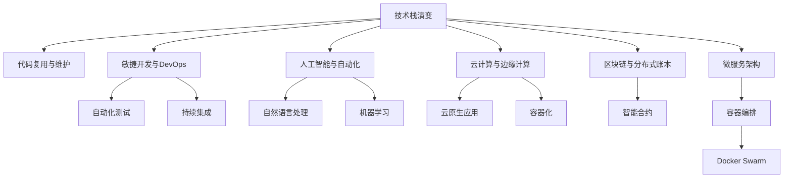

                 

# 程序员如何应对行业变革与转型

> 关键词：
1. 技术栈演变
2. 代码复用与维护
3. 敏捷开发与DevOps
4. 人工智能与自动化
5. 云计算与边缘计算
6. 区块链与分布式账本
7. 微服务架构与容器化

## 1. 背景介绍

在过去几十年里，IT技术经历了一系列深刻变革，从最初的单机程序到互联网应用的兴起，再到移动互联网和智能手机的普及，技术的演进改变了人们的生活方式和工作方式。然而，随着技术的快速发展和市场的竞争加剧，技术栈的不断迭代、代码的复杂度提升、团队协作效率的提高等挑战，也对程序员提出了更高的要求。

在当前和未来的技术趋势中，人工智能、云计算、边缘计算、微服务、区块链等技术日益成为主流，正在改变IT行业的生态格局。本文旨在探讨如何通过掌握关键技术和工具，提升程序员的专业技能，从而更好地应对行业变革与转型。

## 2. 核心概念与联系

### 2.1 核心概念概述

为更好地理解如何应对行业变革与转型，本节将介绍几个密切相关的核心概念：

- 技术栈演变：从早期的单体应用到微服务、容器化、DevOps，技术栈的演变反映了软件工程的最佳实践和工程管理水平的提升。
- 代码复用与维护：如何通过设计模式、框架、库等手段，实现代码的复用和维护，提升开发效率和软件质量。
- 敏捷开发与DevOps：敏捷开发和DevOps方法论极大地提升了软件开发和运维的效率，促进了持续集成和持续交付。
- 人工智能与自动化：通过机器学习、深度学习、自然语言处理等技术，提升程序的自动化和智能化水平。
- 云计算与边缘计算：云计算和边缘计算改变了IT基础设施的架构，使软件应用能够更灵活地部署和扩展。
- 区块链与分布式账本：区块链技术通过去中心化的方式，构建了更加安全、透明的数据交换和存储方式。
- 微服务架构与容器化：微服务架构通过将应用拆分成多个独立的服务，提高了系统的灵活性和可扩展性，容器化技术通过Docker等工具，实现了服务的快速部署和迁移。

这些核心概念之间的逻辑关系可以通过以下Mermaid流程图来展示：



这个流程图展示了这个领域的核心概念及其之间的关系：

1. 技术栈的演变推动了软件开发理念的进步，敏捷开发、DevOps等方法提升了开发和运维的效率。
2. 代码复用与维护技术使得软件更易于扩展和维护。
3. 人工智能和自动化技术提升了软件系统的智能化水平。
4. 云计算和边缘计算改变了IT基础设施的架构，带来了更加灵活和可扩展的应用模式。
5. 区块链和分布式账本技术提供了更加安全、透明的数据交换和存储方式。
6. 微服务架构和容器化技术提升了系统的灵活性和可扩展性。

这些概念共同构成了现代软件开发的基础框架，帮助我们更好地理解行业变革和技术演进的本质。

## 3. 核心算法原理 & 具体操作步骤

### 3.1 算法原理概述

本节将重点介绍一些与软件开发和系统运维相关的核心算法和原则，这些算法和技术是程序员应对行业变革与转型的重要工具。

- **DevOps自动化**：通过持续集成、持续交付(CI/CD)和自动化测试，提升软件开发的效率和质量。
- **微服务架构**：通过将应用拆分成多个独立的服务，提升系统的灵活性和可扩展性。
- **容器化技术**：通过Docker等容器技术，实现服务的快速部署和迁移。
- **敏捷开发方法**：通过Scrum、Kanban等敏捷方法，提升团队协作效率和产品交付速度。
- **机器学习与自然语言处理**：通过深度学习、自然语言处理等技术，提升程序的自动化和智能化水平。

### 3.2 算法步骤详解

以微服务架构和容器化为例子，我们详细讲解如何通过这些技术和方法，实现系统的灵活部署和扩展。

**步骤1：设计微服务架构**

1. **拆分应用**：将应用按照功能拆分为多个独立的服务。例如，电商应用可以拆分为用户服务、商品服务、订单服务等多个微服务。
2. **定义接口**：为每个微服务定义明确的API接口，便于服务之间的调用和通信。
3. **分布式数据库**：根据数据访问的特点，选择合适的分布式数据库存储方式，如NoSQL数据库。

**步骤2：容器化部署**

1. **打包服务**：将每个微服务打包为Docker镜像，并编写Dockerfile配置文件。
2. **服务编排**：使用容器编排工具Kubernetes，定义服务之间的依赖关系，并实现负载均衡和自动化部署。
3. **持续集成**：通过CI/CD工具，实现服务的持续集成和自动构建，提升开发效率。

**步骤3：微服务管理**

1. **自动化部署**：使用Kubernetes实现服务的自动化部署，支持滚动更新和回滚。
2. **服务监控**：通过Prometheus和Grafana等工具，实现服务的实时监控和告警。
3. **故障恢复**：通过Kubernetes的自我修复机制，自动恢复服务异常。

### 3.3 算法优缺点

**优点**：

1. **提升灵活性**：微服务架构和容器化技术大大提升了系统的灵活性和可扩展性。
2. **加快交付速度**：通过自动化部署和持续集成，可以快速交付和迭代开发。
3. **简化维护**：每个微服务独立部署和维护，提升了系统的稳定性和可靠性。
4. **降低成本**：通过资源的按需分配和回收，降低了系统的运维成本。

**缺点**：

1. **复杂度增加**：微服务架构增加了系统的复杂度，需要更细致的设计和规划。
2. **接口管理**：微服务之间的接口管理变得更加复杂，需要严格的规范和文档。
3. **故障传播**：微服务之间的依赖关系可能导致故障传播，需要更严密的监控和故障恢复机制。

### 3.4 算法应用领域

微服务架构和容器化技术已经在互联网应用、企业内部系统、云原生应用等多个领域得到了广泛应用，极大地提升了软件系统的灵活性和可扩展性。

- **互联网应用**：如电商、社交、新闻等互联网应用，通过微服务架构和容器化技术，提升了系统的稳定性和扩展性。
- **企业内部系统**：如ERP、HR、CRM等企业内部系统，通过微服务架构和容器化技术，提升了系统的集成和运维效率。
- **云原生应用**：如Kubernetes、Docker Swarm等云原生应用，通过微服务架构和容器化技术，实现了快速部署和扩展。

## 4. 数学模型和公式 & 详细讲解 & 举例说明

### 4.1 数学模型构建

在本节中，我们将通过一些数学模型来讲解软件开发和系统运维的核心概念。

**敏捷开发与DevOps**

- **Scrum**：敏捷开发方法论，通过迭代开发和每日站会，提升团队协作效率。
- **持续集成**：通过CI/CD工具，实现代码的持续集成和自动构建。

**微服务架构**

- **服务拆分**：将应用按照功能拆分为多个独立的服务，提升系统的灵活性和可扩展性。
- **服务通信**：通过API网关和分布式消息队列，实现服务之间的通信。

**机器学习与自然语言处理**

- **深度学习**：通过神经网络模型，实现复杂任务的自动化处理。
- **自然语言处理**：通过分词、词性标注、命名实体识别等技术，提升程序的智能化水平。

### 4.2 公式推导过程

以持续集成为例，我们推导CI/CD的核心公式。

**持续集成公式**

$$
CI=\text{代码质量} \times \text{集成频率} \times \text{构建速度}
$$

其中：

- **代码质量**：通过代码静态分析、单元测试等手段，提升代码的质量和稳定性。
- **集成频率**：通过频繁的集成和合并，减少集成风险。
- **构建速度**：通过自动化构建工具，提升构建速度和效率。

**微服务架构公式**

$$
MSA=\text{灵活性} \times \text{可扩展性} \times \text{故障隔离性}
$$

其中：

- **灵活性**：通过微服务架构，提升系统的灵活性和可扩展性。
- **可扩展性**：通过分布式系统架构，提升系统的扩展性。
- **故障隔离性**：通过服务的自治性，实现故障的隔离和恢复。

**机器学习与自然语言处理公式**

$$
NLP=\text{理解力} \times \text{生成力} \times \text{交互性}
$$

其中：

- **理解力**：通过分词、词性标注、命名实体识别等技术，提升程序的智能化水平。
- **生成力**：通过文本生成、语义推理等技术，实现程序的自动生成。
- **交互性**：通过自然语言交互技术，提升程序的交互性和用户体验。

### 4.3 案例分析与讲解

我们以电商应用为例，详细分析如何通过微服务架构和容器化技术，实现系统的快速部署和扩展。

**电商应用微服务架构**

1. **用户服务**：负责用户登录、注册、信息修改等业务逻辑。
2. **商品服务**：负责商品信息展示、订单管理等业务逻辑。
3. **订单服务**：负责订单生成、支付、物流等业务逻辑。
4. **推荐服务**：负责个性化推荐算法，提升用户购物体验。
5. **缓存服务**：通过Redis缓存，提升系统响应速度和稳定性。

**电商应用容器化部署**

1. **打包镜像**：将每个微服务打包为Docker镜像，并编写Dockerfile配置文件。
2. **编排服务**：使用Kubernetes定义服务之间的依赖关系，并实现负载均衡和自动化部署。
3. **持续集成**：通过CI/CD工具，实现服务的持续集成和自动构建，提升开发效率。

**电商应用微服务管理**

1. **自动化部署**：使用Kubernetes实现服务的自动化部署，支持滚动更新和回滚。
2. **服务监控**：通过Prometheus和Grafana等工具，实现服务的实时监控和告警。
3. **故障恢复**：通过Kubernetes的自我修复机制，自动恢复服务异常。

## 5. 项目实践：代码实例和详细解释说明

### 5.1 开发环境搭建

在进行软件开发和系统运维实践前，我们需要准备好开发环境。以下是使用Python进行PyTorch开发的环境配置流程：

1. 安装Anaconda：从官网下载并安装Anaconda，用于创建独立的Python环境。

2. 创建并激活虚拟环境：
```bash
conda create -n pytorch-env python=3.8 
conda activate pytorch-env
```

3. 安装PyTorch：根据CUDA版本，从官网获取对应的安装命令。例如：
```bash
conda install pytorch torchvision torchaudio cudatoolkit=11.1 -c pytorch -c conda-forge
```

4. 安装TensorFlow：
```bash
pip install tensorflow
```

5. 安装Docker和Kubernetes：
```bash
sudo apt-get update
sudo apt-get install docker.io -y
sudo apt-get install kubectl -y
```

完成上述步骤后，即可在`pytorch-env`环境中开始开发和部署实践。

### 5.2 源代码详细实现

下面我们以微服务架构和容器化为例子，给出使用Docker和Kubernetes实现服务的完整代码实例。

**微服务架构代码**

```python
from flask import Flask, request
import json

class UserService:
    def __init__(self):
        self.users = {}

    def add_user(self, username, password):
        self.users[username] = password

    def authenticate(self, username, password):
        return self.users.get(username) == password

app = Flask(__name__)

@app.route('/add_user', methods=['POST'])
def add_user():
    data = request.json
    username = data['username']
    password = data['password']
    user_service.add_user(username, password)
    return json.dumps({'message': 'User added successfully'}), 200

@app.route('/authenticate', methods=['POST'])
def authenticate():
    data = request.json
    username = data['username']
    password = data['password']
    if user_service.authenticate(username, password):
        return json.dumps({'message': 'Authentication successful'}), 200
    else:
        return json.dumps({'message': 'Authentication failed'}), 401

user_service = UserService()

if __name__ == '__main__':
    app.run(host='0.0.0.0', port=5000)
```

**容器化代码**

```Dockerfile
FROM python:3.8

WORKDIR /app

COPY . .

RUN pip install -r requirements.txt

EXPOSE 5000

CMD ["python", "app.py"]
```

**部署代码**

```bash
docker build -t user-service .
docker run -d --name user-service -p 5000:5000 user-service
```

**Kubernetes代码**

```yaml
apiVersion: apps/v1
kind: Deployment
metadata:
  name: user-service
spec:
  replicas: 3
  selector:
    matchLabels:
      app: user-service
  template:
    metadata:
      labels:
        app: user-service
    spec:
      containers:
      - name: user-service
        image: user-service:latest
        ports:
        - containerPort: 5000
---
apiVersion: v1
kind: Service
metadata:
  name: user-service
spec:
  selector:
    app: user-service
  ports:
    - protocol: TCP
      port: 80
      targetPort: 5000
---
apiVersion: apps/v1
kind: Deployment
metadata:
  name: recommendation-service
spec:
  replicas: 3
  selector:
    matchLabels:
      app: recommendation-service
  template:
    metadata:
      labels:
        app: recommendation-service
    spec:
      containers:
      - name: recommendation-service
        image: recommendation-service:latest
        ports:
        - containerPort: 6000
---
apiVersion: v1
kind: Service
metadata:
  name: recommendation-service
spec:
  selector:
    app: recommendation-service
  ports:
    - protocol: TCP
      port: 80
      targetPort: 6000
```

**部署代码**

```bash
kubectl apply -f user-service.yaml
kubectl apply -f recommendation-service.yaml
```

### 5.3 代码解读与分析

**微服务架构**

微服务架构的核心思想是将大型应用拆分为多个小型、独立的服务，每个服务独立运行，并通过API网关进行通信。这样可以提高系统的灵活性、可扩展性和容错性，使得每个服务可以独立部署、维护和扩展。

**容器化**

容器化技术通过Docker等工具，将应用打包为容器镜像，使得应用的部署和迁移变得更加简单和快速。容器化技术还可以通过Kubernetes等容器编排工具，实现服务的自动化部署、管理和扩展。

**微服务管理**

微服务管理的核心是实现服务的自动化部署、监控和故障恢复。通过Kubernetes的自我修复机制，可以自动恢复服务异常，保证系统的稳定性和可靠性。

## 6. 实际应用场景

### 6.1 智能客服系统

智能客服系统通过微服务架构和容器化技术，可以构建一个高效、稳定、可扩展的客户服务系统。系统可以支持多渠道客户服务，包括语音、文字、图片等多种形式，提升客户体验和满意度。

**系统架构**

1. **客户接入服务**：通过Nginx和F5等负载均衡设备，实现客户接入和路由。
2. **语音服务**：使用ASR和TTS技术，实现语音交互和语音识别。
3. **文字服务**：通过NLP技术，实现文本交互和问题解答。
4. **图片服务**：使用OCR技术，实现图片识别和处理。
5. **数据分析服务**：通过机器学习算法，分析客户行为和情感，提供个性化推荐和改进建议。

**系统部署**

1. **打包镜像**：将每个微服务打包为Docker镜像，并编写Dockerfile配置文件。
2. **编排服务**：使用Kubernetes定义服务之间的依赖关系，并实现负载均衡和自动化部署。
3. **持续集成**：通过CI/CD工具，实现服务的持续集成和自动构建，提升开发效率。

**系统监控**

1. **自动化部署**：使用Kubernetes实现服务的自动化部署，支持滚动更新和回滚。
2. **服务监控**：通过Prometheus和Grafana等工具，实现服务的实时监控和告警。
3. **故障恢复**：通过Kubernetes的自我修复机制，自动恢复服务异常。

### 6.2 金融舆情监测

金融舆情监测系统通过微服务架构和容器化技术，可以构建一个高效、实时、可扩展的舆情监测系统。系统可以实时监测金融市场舆情，提供实时的舆情分析和预警。

**系统架构**

1. **数据采集服务**：通过爬虫和API接口，采集金融市场数据。
2. **舆情分析服务**：通过NLP和机器学习算法，分析舆情变化趋势，提供实时预警。
3. **数据存储服务**：通过分布式数据库，存储和管理舆情数据。
4. **可视化服务**：通过Echarts等工具，实现舆情数据的可视化展示。

**系统部署**

1. **打包镜像**：将每个微服务打包为Docker镜像，并编写Dockerfile配置文件。
2. **编排服务**：使用Kubernetes定义服务之间的依赖关系，并实现负载均衡和自动化部署。
3. **持续集成**：通过CI/CD工具，实现服务的持续集成和自动构建，提升开发效率。

**系统监控**

1. **自动化部署**：使用Kubernetes实现服务的自动化部署，支持滚动更新和回滚。
2. **服务监控**：通过Prometheus和Grafana等工具，实现服务的实时监控和告警。
3. **故障恢复**：通过Kubernetes的自我修复机制，自动恢复服务异常。

### 6.3 个性化推荐系统

个性化推荐系统通过微服务架构和容器化技术，可以构建一个高效、可扩展、灵活的推荐系统。系统可以根据用户的行为和兴趣，提供个性化的推荐服务，提升用户体验和满意度。

**系统架构**

1. **用户服务**：负责用户登录、注册、信息修改等业务逻辑。
2. **商品服务**：负责商品信息展示、订单管理等业务逻辑。
3. **推荐服务**：负责个性化推荐算法，提升用户购物体验。
4. **缓存服务**：通过Redis缓存，提升系统响应速度和稳定性。

**系统部署**

1. **打包镜像**：将每个微服务打包为Docker镜像，并编写Dockerfile配置文件。
2. **编排服务**：使用Kubernetes定义服务之间的依赖关系，并实现负载均衡和自动化部署。
3. **持续集成**：通过CI/CD工具，实现服务的持续集成和自动构建，提升开发效率。

**系统监控**

1. **自动化部署**：使用Kubernetes实现服务的自动化部署，支持滚动更新和回滚。
2. **服务监控**：通过Prometheus和Grafana等工具，实现服务的实时监控和告警。
3. **故障恢复**：通过Kubernetes的自我修复机制，自动恢复服务异常。

### 6.4 未来应用展望

未来，随着技术的不断发展和应用的深入，微服务架构和容器化技术将在更多领域得到应用，为IT行业带来更多的变革和创新。

1. **云计算与边缘计算**：云计算和边缘计算技术的融合，将提升系统的灵活性和可扩展性，使得软件应用能够更灵活地部署和扩展。
2. **人工智能与自动化**：人工智能和自动化技术的普及，将提升程序的自动化和智能化水平，使得开发和运维更加高效和可靠。
3. **区块链与分布式账本**：区块链和分布式账本技术将提供更加安全、透明的数据交换和存储方式，提升系统的安全性和可靠性。
4. **微服务架构与容器化**：微服务架构和容器化技术的不断发展，将进一步提升系统的灵活性、可扩展性和可维护性，使得开发和运维更加高效和稳定。

## 7. 工具和资源推荐

### 7.1 学习资源推荐

为了帮助开发者系统掌握微服务架构和容器化技术的理论基础和实践技巧，这里推荐一些优质的学习资源：

1. **《Docker实战》**：全面介绍了Docker的安装、使用和最佳实践，是学习容器化技术的重要书籍。
2. **《Kubernetes实战》**：详细介绍了Kubernetes的安装、使用和最佳实践，是学习微服务管理和容器编排的重要书籍。
3. **《微服务架构设计》**：介绍了微服务架构的设计原则和实践经验，是学习微服务架构的重要书籍。
4. **《DevOps实践指南》**：介绍了DevOps的最佳实践和工具链，是学习DevOps的重要书籍。
5. **《机器学习实战》**：介绍了机器学习和深度学习的基本概念和实战案例，是学习人工智能和自动化技术的重要书籍。

### 7.2 开发工具推荐

高效的开发离不开优秀的工具支持。以下是几款用于微服务架构和容器化开发的常用工具：

1. **Docker**：Docker是一个开源的容器化平台，可以轻松打包、部署和管理应用程序。
2. **Kubernetes**：Kubernetes是一个开源的容器编排工具，可以自动管理Docker容器的部署、扩展和更新。
3. **Helm**：Helm是一个Kubernetes包管理工具，可以简化Kubernetes的应用部署和管理。
4. **Prometheus**：Prometheus是一个开源的监控和告警系统，可以实时监控应用程序的性能和稳定性。
5. **Grafana**：Grafana是一个开源的数据可视化工具，可以将Prometheus的数据可视化展示。

### 7.3 相关论文推荐

微服务架构和容器化技术的发展源于学界的持续研究。以下是几篇奠基性的相关论文，推荐阅读：

1. **《微服务架构》**：介绍微服务架构的基本概念和设计原则，是学习微服务架构的重要论文。
2. **《DevOps：应对软件开发自动化》**：介绍了DevOps的最佳实践和工具链，是学习DevOps的重要论文。
3. **《Docker实战》**：全面介绍了Docker的安装、使用和最佳实践，是学习容器化技术的重要论文。
4. **《Kubernetes实战》**：详细介绍了Kubernetes的安装、使用和最佳实践，是学习微服务管理和容器编排的重要论文。

这些论文代表了大语言模型微调技术的发展脉络。通过学习这些前沿成果，可以帮助研究者把握学科前进方向，激发更多的创新灵感。

## 8. 总结：未来发展趋势与挑战

### 8.1 总结

本文对微服务架构和容器化技术的核心概念、算法原理和具体操作步骤进行了全面系统的介绍。通过详细讲解微服务架构和容器化技术的应用场景和实践案例，帮助开发者更好地理解和掌握这一新技术。

## 9. 附录：常见问题与解答

**Q1：微服务架构和容器化技术是否适用于所有应用程序？**

A: 微服务架构和容器化技术适用于大多数大型、复杂的系统，但对于小型的、单一功能的系统，过度拆分可能导致系统复杂度和维护成本增加。需要根据实际情况选择合适的技术。

**Q2：微服务架构和容器化技术需要哪些基础知识？**

A: 微服务架构和容器化技术需要掌握基本的软件开发、网络、数据库、自动化部署等方面的知识。同时需要了解DevOps、CI/CD、持续集成等方面的知识。

**Q3：如何选择合适的微服务架构和容器化技术？**

A: 选择合适的微服务架构和容器化技术需要考虑系统规模、复杂度、业务需求、开发和运维成本等因素。需要根据实际情况进行选择和设计。

**Q4：微服务架构和容器化技术是否需要经常维护？**

A: 微服务架构和容器化技术需要持续维护和优化，包括服务拆分、重构、性能优化、故障恢复等。需要建立完善的运维机制和自动化工具。

**Q5：微服务架构和容器化技术是否需要经常更新？**

A: 微服务架构和容器化技术需要持续更新和升级，包括软件更新、硬件升级、系统优化等。需要建立完善的更新机制和自动化工具。

---

作者：禅与计算机程序设计艺术 / Zen and the Art of Computer Programming

