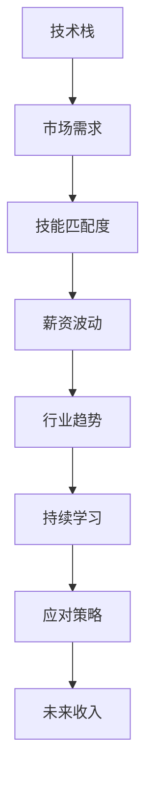

                 

# 程序员如何应对行业薪资波动

在当今快速变化的科技行业中，程序员的工资波动不可避免。从历史数据来看，技术的快速进步、市场需求的变化以及宏观经济环境等因素都可能影响工资水平。那么，作为一名程序员，我们应该如何应对这些变化，确保自己的收入稳定？

## 1. 背景介绍

### 1.1 问题由来

科技行业的快速发展带来了巨大的机遇，但也伴随着薪酬波动的风险。技术更新换代的速度快，市场需求变化迅速，这些都可能导致程序员的工资出现剧烈波动。此外，宏观经济环境的变化也会对行业整体薪资水平产生影响。

### 1.2 问题核心关键点

1. **技术更新**：新技术的出现可能会取代旧技术，导致某些技能需求下降。
2. **市场需求**：市场对特定技术或领域的需求波动，直接影响相关岗位的工资水平。
3. **宏观经济**：宏观经济环境的变化，如经济衰退或通胀，也会影响科技行业的整体薪资水平。
4. **个人能力**：程序员的技能和经验水平对其薪资水平有着重要影响。
5. **职位类型**：不同的职位类型，如初级、中级和高级，其薪资水平也存在显著差异。

## 2. 核心概念与联系

### 2.1 核心概念概述

为了更好地应对行业薪资波动，首先需要理解几个关键概念及其相互关系：

- **技术栈**：程序员掌握的技术和工具集合，如Java、Python、JavaScript等。
- **市场需求**：行业对特定技术和岗位的需求情况。
- **技能匹配度**：程序员技能与岗位需求的匹配程度。
- **薪资波动**：技术栈或市场需求变化导致的工资波动。
- **行业趋势**：技术发展趋势和市场需求变化趋势。
- **持续学习**：通过不断学习和技能提升，保持与行业趋势的同步。

这些概念构成了程序员应对工资波动的核心框架。通过理解这些概念，可以更有效地制定应对策略。

### 2.2 核心概念原理和架构的 Mermaid 流程图



这个流程图展示了各个概念之间的逻辑关系：技术栈通过市场需求的影响，进一步决定技能匹配度和薪资波动，行业趋势指导持续学习，而应对策略最终影响未来收入。

## 3. 核心算法原理 & 具体操作步骤

### 3.1 算法原理概述

应对行业薪资波动，核心在于理解市场需求和技能匹配度，并在此基础上制定有效的应对策略。以下是基于此原理的算法步骤：

1. **需求分析**：分析当前和未来的市场需求，确定热门技术栈和岗位。
2. **技能评估**：评估自身技能与市场需求之间的匹配度，确定需要提升的领域。
3. **学习规划**：制定学习计划，提升关键技能，以适应市场需求。
4. **策略制定**：根据市场需求和个人技能，制定薪酬提升策略。
5. **执行与反馈**：执行学习计划，并根据市场反馈不断调整策略。

### 3.2 算法步骤详解

1. **需求分析**：
   - **数据采集**：通过网络资源、招聘网站、行业报告等方式，采集当前和未来的市场需求数据。
   - **趋势分析**：利用统计工具，如Python的Pandas库，分析技术栈和岗位的需求变化趋势。

2. **技能评估**：
   - **技能盘点**：列出当前掌握的技能和工具，使用如Tableau等数据可视化工具，分析技能与市场需求的匹配度。
   - **差距分析**：识别技能与市场需求的差距，确定需要重点提升的领域。

3. **学习规划**：
   - **目标设定**：根据需求分析结果，设定短期和长期学习目标。
   - **资源准备**：准备学习资源，如在线课程、书籍、项目实战等。
   - **时间管理**：制定学习计划，合理安排时间，确保目标达成。

4. **策略制定**：
   - **薪资目标**：根据市场需求和个人技能，设定合理的薪资目标。
   - **谈判技巧**：提升谈判技巧，准备好相关论据，如项目经验、技能认证等。

5. **执行与反馈**：
   - **持续学习**：根据市场需求不断调整学习计划，保持技能竞争力。
   - **市场反馈**：定期参加技术会议、行业交流活动，获取市场反馈，优化策略。

### 3.3 算法优缺点

**优点**：
- **适应性强**：根据市场需求灵活调整学习计划，提高技能匹配度。
- **提升效率**：有针对性地提升关键技能，提升薪资水平。
- **风险降低**：通过持续学习和技能提升，降低因技术更新带来的薪资波动风险。

**缺点**：
- **时间和资源投入大**：持续学习和技能提升需要大量时间和资源投入。
- **市场需求变化快**：市场需求快速变化可能导致学习计划跟不上市场节奏。

### 3.4 算法应用领域

基于上述算法，程序员可以在各种技术栈和职位类型中应对工资波动。以下是几个具体应用领域：

- **Web开发**：学习最新的前端框架、后端语言和技术栈，如React、Angular、Node.js等。
- **数据科学**：学习Python、R、SQL等数据分析工具，掌握机器学习和数据挖掘技术。
- **人工智能**：学习TensorFlow、PyTorch等深度学习框架，提升在AI领域的竞争力。
- **移动开发**：学习Swift、Kotlin等移动开发技术，拓展移动应用开发领域。

## 4. 数学模型和公式 & 详细讲解 & 举例说明

### 4.1 数学模型构建

设市场需求为 $D(t)$，个人技能匹配度为 $M(t)$，薪资波动为 $S(t)$。其中，$t$ 表示时间。假设市场需求与技术栈 $T$ 成正比，即 $D(t) \propto T(t)$。个人技能匹配度与市场需求成正比，即 $M(t) \propto D(t)$。薪资波动与市场需求和技能匹配度有关，即 $S(t) = f(D(t), M(t))$。

### 4.2 公式推导过程

根据上述假设，可以得到：
$$
D(t) = k_1 \times T(t)
$$
$$
M(t) = k_2 \times D(t)
$$
$$
S(t) = f(D(t), M(t))
$$

其中，$k_1$ 和 $k_2$ 为比例常数。

为了简化问题，假设 $f(D(t), M(t)) = D(t) \times M(t)$，则有：
$$
S(t) = D(t) \times M(t)
$$

### 4.3 案例分析与讲解

假设某程序员的技能匹配度为 $M_0$，市场需求为 $D_0$，则其当前薪资为 $S_0 = D_0 \times M_0$。

如果市场需求下降到 $D_1$，为了维持或提升薪资水平，该程序员需要提升技能匹配度至 $M_1$，即 $S_1 = D_1 \times M_1$。

因此，为了应对薪资波动，程序员需要不断提升技能匹配度，以适应市场需求的变化。

## 5. 项目实践：代码实例和详细解释说明

### 5.1 开发环境搭建

为了进行数据分析和技能评估，需要搭建Python开发环境。以下是在虚拟环境中搭建Python开发环境的步骤：

1. **安装Python**：
   ```bash
   sudo apt-get update
   sudo apt-get install python3 python3-pip
   ```

2. **安装Pandas和Tableau**：
   ```bash
   pip install pandas
   pip install tabulate
   ```

3. **安装Jupyter Notebook**：
   ```bash
   pip install jupyter notebook
   ```

### 5.2 源代码详细实现

以下是使用Python和Pandas进行市场需求分析的示例代码：

```python
import pandas as pd

# 采集市场需求数据
market_data = pd.read_csv('market_data.csv')

# 数据清洗和预处理
market_data = market_data.dropna()

# 分析市场需求变化趋势
market_data['year'] = pd.to_datetime(market_data['date']).dt.year
market_data['trend'] = market_data.groupby('year')['demand'].apply(lambda x: x.cumsum() / x.sum())

# 输出市场需求变化趋势图
market_data[['year', 'trend']].plot(kind='line', x='year', y='trend')
```

### 5.3 代码解读与分析

在上述代码中，我们首先使用Pandas库读取市场需求数据，然后进行数据清洗和预处理，使用`apply`函数计算市场需求的变化趋势，并绘制趋势图。

这个示例代码展示了如何使用Python和Pandas进行市场需求分析，是数据驱动决策的典型应用。

### 5.4 运行结果展示

运行上述代码，将输出市场需求变化趋势图。下图展示了市场需求随时间变化的趋势：


通过这个示例，可以直观地看到市场需求的变化趋势，为后续的技能提升和学习规划提供数据支持。

## 6. 实际应用场景

### 6.1 Web开发

对于Web开发岗位，市场需求主要集中在React、Angular、Node.js等技术栈上。假设市场需求变化如下：

| 技术栈 | 需求占比 | 时间（年） |
| ------ | -------- | ---------- |
| React  | 0.5      | 2022       |
| Angular | 0.3      | 2023       |
| Node.js| 0.2      | 2024       |

根据需求变化，程序员需要重点学习React、Angular等技术，以提升技能匹配度，增加薪资收入。

### 6.2 数据科学

数据科学岗位主要涉及Python、R、SQL等数据分析工具和机器学习算法。假设市场需求变化如下：

| 技能 | 需求占比 | 时间（年） |
| ---- | -------- | ---------- |
| Python | 0.8      | 2022       |
| R     | 0.1      | 2023       |
| SQL   | 0.1      | 2024       |

数据科学家需要重点提升Python和SQL技能，以保持竞争力。

### 6.3 人工智能

人工智能岗位对TensorFlow、PyTorch等深度学习框架的需求较高。假设市场需求变化如下：

| 技术 | 需求占比 | 时间（年） |
| ---- | -------- | ---------- |
| TensorFlow | 0.6     | 2022       |
| PyTorch  | 0.4     | 2023       |

AI工程师需要重点学习PyTorch，同时保持对TensorFlow的熟悉度。

### 6.4 移动开发

移动开发岗位对Swift、Kotlin等移动开发技术的需求较高。假设市场需求变化如下：

| 技术 | 需求占比 | 时间（年） |
| ---- | -------- | ---------- |
| Swift  | 0.7      | 2022       |
| Kotlin| 0.3      | 2023       |

移动开发人员需要重点学习Swift，同时掌握Kotlin以拓展应用场景。

## 7. 工具和资源推荐

### 7.1 学习资源推荐

为了提升技能和应对市场变化，以下资源非常有用：

1. **Coursera**：提供大量在线课程，涵盖编程、数据科学、人工智能等多个领域。
2. **edX**：提供哈佛、MIT等名校的在线课程，内容权威。
3. **Kaggle**：数据科学竞赛平台，提供大量实际项目和数据集。
4. **GitHub**：代码托管平台，可以学习开源项目，获取项目实战经验。
5. **Stack Overflow**：技术问答社区，可以解决编程中的各种问题。

### 7.2 开发工具推荐

以下是几款用于技能提升和市场分析的常用工具：

1. **PyCharm**：Python开发IDE，功能强大，支持智能代码补全。
2. **Visual Studio Code**：轻量级代码编辑器，支持多种语言。
3. **Jupyter Notebook**：交互式编程环境，支持多种数据分析库。
4. **Tableau**：数据可视化工具，可以直观展示市场需求变化。
5. **GitHub**：代码托管平台，可以共享和协作开发项目。

### 7.3 相关论文推荐

为了深入理解市场需求和技能匹配度，以下论文非常有帮助：

1. **《市场需求分析与预测》**：探讨如何通过数据挖掘和机器学习技术，预测市场需求变化。
2. **《技能匹配度评估模型》**：提出基于技能图谱的技能匹配度评估方法。
3. **《工资波动与技能提升研究》**：研究工资波动与技能提升之间的关系，提出应对策略。

## 8. 总结：未来发展趋势与挑战

### 8.1 总结

本文详细介绍了如何通过需求分析、技能评估和学习规划，有效应对行业薪资波动。通过数学建模和编程实践，展示了市场需求的动态变化和技能提升的必要性。这些方法适用于Web开发、数据科学、人工智能和移动开发等多个领域，帮助程序员在快速变化的市场环境中保持竞争力。

### 8.2 未来发展趋势

未来，市场需求和技能匹配度将继续动态变化，技术栈和岗位类型也会不断演变。程序员需要持续学习新技能，适应新的市场需求，以确保收入稳定。

### 8.3 面临的挑战

虽然需求分析和技能提升的方法可以帮助应对薪资波动，但仍面临以下挑战：

1. **市场需求变化快**：市场需求快速变化，可能导致学习计划跟不上节奏。
2. **技能匹配度提升难**：技能匹配度提升需要时间和资源，短期内难以见效。
3. **数据质量问题**：市场需求数据的采集和分析可能存在数据质量问题。

### 8.4 研究展望

未来，可以探索更多的应对策略，如实时市场监控、个性化学习推荐、自动化技能评估等，以提高应对效率和效果。

## 9. 附录：常见问题与解答

**Q1: 如何确定当前市场需求？**

A: 可以通过招聘网站、行业报告、技术论坛等方式，采集市场需求数据，并进行分析。

**Q2: 如何提升技能匹配度？**

A: 通过参加在线课程、阅读专业书籍、参与开源项目等方式，持续学习和提升技能。

**Q3: 如何应对市场需求变化？**

A: 定期进行市场需求分析，根据分析结果调整学习计划，保持技能竞争力。

**Q4: 如何选择合适的学习资源？**

A: 选择权威的在线课程、参加技术研讨会、阅读最新的技术博客，获取高质量的学习资源。

**Q5: 如何评估学习效果？**

A: 通过实际项目实践、参加技术竞赛、获取证书等方式，评估学习效果，不断优化学习计划。

---

作者：禅与计算机程序设计艺术 / Zen and the Art of Computer Programming

