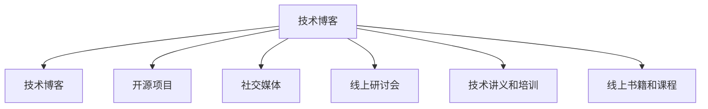

                 

## 1. 背景介绍

在现代信息社会，个人品牌建设已经成为程序员职业发展的关键要素。一个强有力的个人IP不仅能提升职业竞争力，还能带来更多的合作机会、资源交流和商业机会。如何打造一个高效、系统化的个人IP矩阵，成为每位程序员必修的课题。本文将从多个维度，系统介绍如何构建个人IP矩阵，通过IP矩阵的多维度协作，最大化提升个人品牌价值和影响力。

## 2. 核心概念与联系

### 2.1 核心概念概述

1. **个人IP（Personal Intellectual Property）**：指个人在某个领域内构建的品牌形象和影响力。包括但不限于技术专业、行业认知、公共演讲、写作能力等方面。

2. **个人IP矩阵**：将个人IP的不同维度整合为一个系统化、协同工作的结构。如技术博客、开源项目、社交媒体、线上研讨会等。

3. **技术博客**：定期发布高质量技术文章，分享经验、案例和前沿技术，建立专业性声誉。

4. **开源项目**：通过贡献代码和改进技术，提升技术社区的认知，建立技术影响力。

5. **社交媒体**：通过内容分享、互动和社交活动，建立和维护社群，增强个人品牌的可见度和互动性。

6. **线上研讨会和直播**：通过公开演讲和分享，提升技术影响力和行业认知，增加曝光机会。

7. **技术讲义和培训**：通过组织或参与培训，传授知识，提升实战经验，建立行业权威。

8. **线上书籍和课程**：通过写作和教学，系统化地分享知识，建立技术品牌影响力。

### 2.2 核心概念原理和架构的 Mermaid 流程图(Mermaid 流程节点中不要有括号、逗号等特殊字符)



## 3. 核心算法原理 & 具体操作步骤

### 3.1 算法原理概述

构建个人IP矩阵的原理在于将个人的技术能力、社交互动和内容传播进行系统化整合。核心思想是通过多渠道、多维度的协同效应，最大化提升个人品牌的价值和影响力。

### 3.2 算法步骤详解

**Step 1: 确定个人品牌定位**

- **自我评估**：明确个人的技术特长、兴趣领域和职业目标。
- **目标设定**：设定短期和长期的个人品牌建设目标，如成为某技术领域的权威专家、建立技术社区领导者地位等。

**Step 2: 选择合适的平台和工具**

- **技术博客**：选择如Medium、CSDN、GitHub Pages等平台。
- **社交媒体**：如LinkedIn、Twitter、Facebook等。
- **线上研讨会**：如Zoom、Webinar、Slido等。
- **培训和讲义**：如Coursera、Udemy、Bilibili等。

**Step 3: 内容规划和发布**

- **定期更新**：保持技术博客、开源项目、社交媒体的定期更新频率。
- **高质量内容**：确保发布内容的质量和深度，避免低质量内容的复制粘贴。
- **多样化形式**：发布博客、代码示例、项目报告、技术视频等多种形式的内容。

**Step 4: 互动和社群建设**

- **社交媒体互动**：积极参与讨论，回复评论，建立良好的社交互动。
- **开源项目贡献**：积极参与开源项目的维护和贡献，提升技术社区认知。
- **线上研讨会组织**：定期组织和参与线上研讨会，分享和交流。

**Step 5: 持续改进和反馈**

- **定期评估**：定期评估个人IP矩阵的成效，收集反馈。
- **优化策略**：根据反馈，调整内容和互动策略，持续改进。

### 3.3 算法优缺点

**优点**：
1. **多渠道协同**：通过不同渠道的协同工作，最大化提升个人品牌价值。
2. **广泛曝光**：多个平台的多样化内容，增加个人品牌的曝光率。
3. **社区建立**：通过内容分享和互动，建立和维护技术社区。

**缺点**：
1. **时间和精力投入**：多个平台的维护需要大量时间和精力。
2. **内容一致性**：需要确保各平台内容的风格和质量一致。
3. **技术更新**：需要不断更新知识和技术，以保持内容的领先性和相关性。

### 3.4 算法应用领域

个人IP矩阵不仅适用于技术类专家，也适用于跨领域的专业人士。如数据科学家、项目经理、市场营销专家等，都可以通过建立多维度的个人IP矩阵，提升自身的行业认知和影响力。

## 4. 数学模型和公式 & 详细讲解 & 举例说明

### 4.1 数学模型构建

假设个人IP矩阵包含 $N$ 个维度，每个维度的影响力和曝光度可以用一个向量 $\mathbf{x}_i \in \mathbb{R}^k$ 表示，其中 $k$ 是每个维度的属性数量，如访问量、互动数、内容质量等。影响力 $\mathbf{y}$ 可以用线性回归模型表示：

$$
\mathbf{y} = \mathbf{W} \mathbf{x} + \mathbf{b}
$$

其中 $\mathbf{W}$ 是权重矩阵，$\mathbf{b}$ 是截距向量。

### 4.2 公式推导过程

通过最小二乘法求解 $\mathbf{W}$ 和 $\mathbf{b}$：

$$
\mathbf{W} = (\mathbf{X}^T \mathbf{X})^{-1} \mathbf{X}^T \mathbf{y}
$$

$$
\mathbf{b} = \mathbf{y} - \mathbf{X} \mathbf{W}
$$

其中 $\mathbf{X}$ 是特征矩阵。

### 4.3 案例分析与讲解

假设某程序员在GitHub上有100个Star，在CSDN上有1000次阅读，在Twitter上有500次互动，则可以通过上述模型计算其在技术社区的影响力。设 $\mathbf{x}_1, \mathbf{x}_2, \mathbf{x}_3$ 分别代表GitHub、CSDN、Twitter上的数据向量，$\mathbf{y}$ 代表整体影响力，则权重 $\mathbf{W}$ 和截距 $\mathbf{b}$ 可以通过上述公式求得。

## 5. 项目实践：代码实例和详细解释说明

### 5.1 开发环境搭建

**Step 1: 技术博客**

1. **Medium**：注册并创建博客，定期发布高质量技术文章。
2. **CSDN**：注册并创建博客，发布技术文章和代码示例。
3. **GitHub Pages**：创建GitHub仓库，发布个人技术博客。

**Step 2: 社交媒体**

1. **LinkedIn**：创建LinkedIn账号，发布技术文章和互动。
2. **Twitter**：创建Twitter账号，定期发布技术更新和互动。
3. **Facebook**：创建Facebook账号，发布技术文章和互动。

**Step 3: 线上研讨会**

1. **Zoom**：注册并组织线上研讨会，分享技术经验和项目案例。
2. **Webinar**：注册并参加线上研讨会，展示技术能力和行业见解。
3. **Slido**：注册并使用互动工具，增强研讨会互动性。

**Step 4: 技术讲义和培训**

1. **Coursera**：注册并创建技术讲义，发布系统化技术教学。
2. **Udemy**：注册并创建技术课程，系统化分享知识。
3. **Bilibili**：创建Bilibili账号，发布技术视频和互动直播。

### 5.2 源代码详细实现

**技术博客**

```python
# 使用Python Flask创建技术博客

from flask import Flask, render_template

app = Flask(__name__)

@app.route('/')
def index():
    return render_template('index.html')

@app.route('/blog/<id>')
def blog(id):
    # 根据id加载博客内容
    blog_data = load_blog(id)
    return render_template('blog.html', data=blog_data)

if __name__ == '__main__':
    app.run(debug=True)
```

**社交媒体**

```python
# 使用Python Tweepy库创建Twitter账号

import tweepy

consumer_key = 'your_consumer_key'
consumer_secret = 'your_consumer_secret'
access_token = 'your_access_token'
access_token_secret = 'your_access_token_secret'

auth = tweepy.OAuthHandler(consumer_key, consumer_secret)
auth.set_access_token(access_token, access_token_secret)

api = tweepy.API(auth)

# 发布推文
api.update_status('Hello, world!')
```

**线上研讨会**

```python
# 使用Python Flask和WebRTC创建线上研讨会

from flask import Flask, render_template
from flask_socketio import SocketIO, emit

app = Flask(__name__)
socketio = SocketIO(app)

@app.route('/')
def index():
    return render_template('index.html')

@socketio.on('message')
def handle_message(message):
    emit('message', message, broadcast=True)

if __name__ == '__main__':
    socketio.run(app)
```

**技术讲义和培训**

```python
# 使用Python Jupyter Notebook创建技术讲义

from IPython.display import display
from IPython.display import HTML

def generate_lecture():
    # 加载课程内容
    lecture_data = load_lecture()

    # 将内容转换为HTML格式
    html_content = HTML(lecture_data)

    # 在Jupyter Notebook中显示
    display(html_content)

generate_lecture()
```

### 5.3 代码解读与分析

**技术博客**

- Flask：轻量级Web框架，快速搭建技术博客。
- 模板渲染：使用Jinja2模板，动态生成HTML页面。
- 数据库存储：使用SQLite数据库或MySQL数据库，存储博客内容和访问数据。

**社交媒体**

- Tweepy：Python的Twitter API库，方便发布和互动。
- OAuth认证：通过OAuth认证机制，获取Twitter账号的访问权限。

**线上研讨会**

- Flask：搭建后端服务器，处理WebSocket连接。
- SocketIO：实时通信库，处理客户端的WebSocket连接和消息推送。
- WebRTC：实时音视频通信技术，实现视频会议功能。

**技术讲义和培训**

- IPython：交互式Python环境，支持HTML渲染。
- Jupyter Notebook：支持代码、文本、HTML等多格式内容的展示。
- 视频和音频：通过嵌入YouTube或Vimeo链接，实现课程视频的播放。

### 5.4 运行结果展示

运行技术博客和社交媒体代码后，可以在浏览器中查看发布的内容和互动情况。运行线上研讨会代码后，可以实时参与视频会议和互动。运行技术讲义和培训代码后，可以在Jupyter Notebook中查看和互动。

## 6. 实际应用场景

**智能客服系统**

- 使用技术博客：分享智能客服的最新进展和技术经验。
- 使用开源项目：开发和维护智能客服系统，提升技术社区认知。
- 使用社交媒体：互动交流，建立和维护技术社群。

**金融舆情监测**

- 使用技术博客：分析金融舆情的最新趋势和技术应用。
- 使用线上研讨会：分享金融舆情监测的最新研究成果和案例。
- 使用技术讲义和培训：系统化介绍金融舆情监测的技术和工具。

**个性化推荐系统**

- 使用技术博客：分享个性化推荐系统的最新算法和案例。
- 使用开源项目：开发和维护个性化推荐系统，提升技术社区认知。
- 使用社交媒体：互动交流，建立和维护技术社群。

**未来应用展望**

未来，个人IP矩阵的应用场景将更加多样和广泛，涵盖更多垂直领域。如医疗健康、教育培训、市场营销、智能制造等。通过系统化地整合技术、社交和内容传播，可以极大地提升个人品牌的价值和影响力。

## 7. 工具和资源推荐

### 7.1 学习资源推荐

1. **《Python Web开发》系列教程**：深入介绍Python Flask和Django框架的Web开发技术。
2. **《Twitter API开发》教程**：介绍如何使用Tweepy库进行Twitter账号的开发和互动。
3. **《WebSocket编程》教程**：介绍如何使用Flask和SocketIO进行WebSocket服务器和客户端的开发。
4. **《Jupyter Notebook基础教程》**：介绍如何使用Jupyter Notebook进行技术教学和分享。
5. **《PyData Stack》社区**：提供大量的数据科学和机器学习资源，涵盖数据分析、可视化、模型构建等方面。

### 7.2 开发工具推荐

1. **PyCharm**：专业的Python IDE，支持代码编写、调试和测试。
2. **GitHub**：开源代码托管平台，支持版本控制和协作开发。
3. **Jupyter Notebook**：交互式编程环境，支持代码、文本、HTML等多格式内容的展示。
4. **Flask**：轻量级Web框架，支持快速搭建Web应用。
5. **SocketIO**：实时通信库，支持WebSocket连接和消息推送。
6. **Tweepy**：Twitter API库，支持Twitter账号的开发和互动。
7. **IPython**：交互式Python环境，支持实时交互和数据展示。

### 7.3 相关论文推荐

1. **《社会化媒体中的信息传播研究》**：介绍社交媒体如何影响信息传播和个体认知。
2. **《Web实时通信技术》**：介绍WebSocket和WebRTC的实时通信技术。
3. **《知识共享和协作社区研究》**：介绍技术社区的建立和管理。
4. **《内容推荐系统》**：介绍推荐系统的发展历程和算法。
5. **《技术讲义和培训系统》**：介绍在线课程的构建和应用。

## 8. 总结：未来发展趋势与挑战

### 8.1 研究成果总结

本文系统介绍了个人IP矩阵的概念和构建方法，通过技术博客、开源项目、社交媒体、线上研讨会、技术讲义和培训等维度，全面提升个人品牌的价值和影响力。通过案例分析和代码实现，展示了各个维度的具体实施方法。

### 8.2 未来发展趋势

1. **技术更新速度加快**：技术领域日新月异，个人IP矩阵需要不断更新内容和技术，保持领先。
2. **多渠道协同效应增强**：不同平台的协同工作将更加高效，提升整体影响力。
3. **内容形式多样化**：除了文字和代码，更多形式的内容将增加品牌的多样性和吸引力。
4. **社区建设更加活跃**：通过互动和社群建设，增强品牌与受众的连接。
5. **全球化影响扩大**：借助社交媒体和线上研讨会，提升全球影响力。

### 8.3 面临的挑战

1. **时间和精力投入**：多平台的多渠道协作需要大量时间和精力。
2. **内容一致性**：不同平台的内容风格和质量需要保持一致。
3. **技术更新**：不断更新知识和技能，保持内容的领先性和相关性。
4. **多渠道协调**：多渠道的协作需要高效的组织和规划。
5. **数据隐私和安全**：社交媒体和线上研讨会的互动需要关注数据隐私和安全。

### 8.4 研究展望

未来，个人IP矩阵将更加注重社区建设和品牌一致性，利用技术和平台的多样性，最大化提升个人品牌的影响力和价值。同时，随着技术的不断进步，将有更多新平台和新工具出现，进一步丰富个人IP矩阵的构建和应用。

## 9. 附录：常见问题与解答

**Q1: 如何平衡个人IP矩阵的多个维度？**

A: 可以采用项目管理工具，如Trello或Asana，对各个维度的任务进行规划和管理。确保每个维度的时间和精力分配合理，避免单一维度的过度投入。

**Q2: 如何选择合适的内容形式？**

A: 根据个人IP矩阵的目标受众和平台特点，选择合适的内容形式。如技术博客适合深度文章和代码示例，社交媒体适合短文和互动，线上研讨会适合系统性讲解和案例分享。

**Q3: 如何保持内容的质量和一致性？**

A: 可以设立内容审核流程，对发布的内容进行严格审核。同时，建立内容模板和风格指南，确保各个平台的内容风格和质量一致。

**Q4: 如何提升线上研讨会的互动效果？**

A: 设计有针对性的互动问题，引导参与者积极参与。同时，使用互动工具如Slido或Mentimeter，增加研讨会的互动性和参与感。

**Q5: 如何确保数据隐私和安全？**

A: 在社交媒体和线上研讨会上，采用匿名或假名身份，保护个人隐私。同时，定期进行数据安全检查，确保平台和工具的安全性。

---

作者：禅与计算机程序设计艺术 / Zen and the Art of Computer Programming

