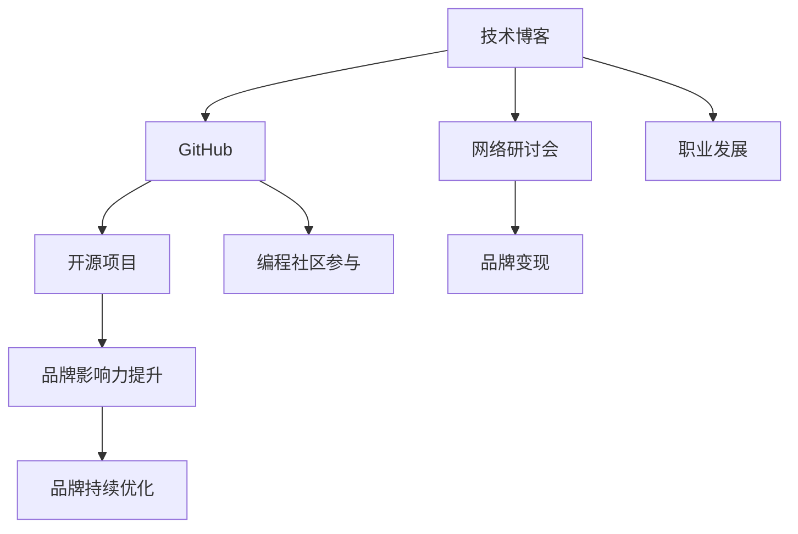

                 

# 程序员如何打造个人品牌IP

> 关键词：
1. 个人品牌建设
2. 技术博客
3. GitHub
4. 开源项目
5. 网络研讨会
6. 编程社区参与
7. 职业发展

## 1. 背景介绍

在信息技术高速发展的今天，编程不再只是计算机科学领域内的专业技能，它已经成为了一个全球化的技能，影响着各行各业。然而，技术技能只是成为一名成功的程序员的一部分，真正的成功在于建立个人品牌和影响力。

个人品牌不仅仅关乎你的技术能力，更重要的是你的知识共享能力、社区贡献和影响他人的能力。一位成功的程序员能够通过建立自己的品牌，不仅为自己赢得更多的工作机会，还能在技术界建立声誉，为行业带来价值。

本文将详细探讨程序员如何通过技术博客、GitHub、开源项目、网络研讨会、编程社区参与等方式打造个人品牌IP，并通过策略性运用这些渠道，助你加速职业发展。

## 2. 核心概念与联系

### 2.1 核心概念概述

建立个人品牌是一项系统工程，涉及多个核心概念和环节：

- **个人品牌建设**：通过一系列的行为和策略，塑造并传播一个程序员在行业内的形象和价值主张。
- **技术博客**：程序员通过撰写博客文章，分享技术见解和实践经验，建立行业影响力。
- **GitHub**：一个代码托管平台，程序员通过公开项目和代码，展示自己的技术能力和编程习惯。
- **开源项目**：参与或贡献开源项目，能够提升个人在技术社区的影响力。
- **网络研讨会**：通过线上或线下的技术交流活动，分享专业知识，与同行交流。
- **编程社区参与**：在Stack Overflow、Reddit等编程社区中积极发言和提问，扩大影响力。
- **职业发展**：通过提升个人品牌，获得更多的职业机会和行业认可。

这些概念之间的联系构成了一个完整的个人品牌建设框架。技术博客和GitHub是个人品牌建设的基础，开源项目和社区参与则是提升品牌影响力的重要手段，而网络研讨会和职业发展则是品牌最终变现的途径。

### 2.2 核心概念原理和架构的 Mermaid 流程图



这个流程图展示了个人品牌建设的各个环节及其内在联系。技术博客和GitHub为品牌建设提供了内容支撑，开源项目和社区参与则有助于提升品牌在技术界的知名度，而网络研讨会和职业发展则帮助品牌转化为实际的职业机会。

## 3. 核心算法原理 & 具体操作步骤

### 3.1 算法原理概述

建立个人品牌的算法原理可以类比为优化问题，旨在最大化品牌影响力和个人收益。在这个过程中，我们需要关注以下几个关键点：

1. **内容质量**：技术博客和GitHub上的内容要高质量、实用且有趣，能够吸引读者和用户的关注。
2. **社区参与度**：在编程社区和开源项目中积极参与讨论和贡献代码，提升个人在技术社区中的存在感。
3. **品牌曝光率**：通过网络研讨会等形式，将个人的品牌和技术能力展示给更广泛的人群。
4. **职业机会**：积极参与行业内的活动和项目，建立人脉和关系网，增加职业机会。

### 3.2 算法步骤详解

1. **确定目标受众**：明确你的目标受众是谁，了解他们的需求和兴趣，以便提供符合他们期望的内容。
2. **创建内容**：在技术博客和GitHub上发布有价值的内容，包括技术文章、代码示例、项目案例等。
3. **参与社区**：在Stack Overflow、Reddit等社区积极发言和提问，回答问题，分享见解。
4. **贡献开源项目**：在GitHub上寻找感兴趣的项目，并贡献代码或提出改进建议。
5. **举办或参与研讨会**：组织或参加线上/线下技术研讨会，分享专业知识，扩大影响力。
6. **职业发展**：利用个人品牌吸引潜在的雇主或合作者，获取更多的职业机会。

### 3.3 算法优缺点

#### 优点

1. **提升知名度**：通过技术博客和开源项目展示技术能力，提升在技术社区中的知名度。
2. **建立信任**：高质量的内容和持续的贡献能够建立信任，获得更多人的认可。
3. **职业机会增加**：品牌效应使得更多的机会主动找上门，职业发展更快。
4. **知识共享**：帮助他人解决问题，能够拓展自己的知识网络和影响力。

#### 缺点

1. **时间和精力投入大**：需要持续不断地创造和维护内容，对时间和精力要求高。
2. **初期回报慢**：建立个人品牌需要时间和耐心，初期可能看不到明显的效果。
3. **网络研讨会挑战**：线上线下活动的组织和执行需要专业能力，有一定门槛。

### 3.4 算法应用领域

个人品牌建设不仅适用于技术领域的专家，也可以应用于各种行业和领域，如金融、医疗、教育等。通过建立专业品牌，个人可以在这些领域内获得更多的职业机会和发展空间。

## 4. 数学模型和公式 & 详细讲解

### 4.1 数学模型构建

建立一个个人品牌的数学模型可以简化为一个加权平均模型，其中每个操作对品牌的影响都有一个权重。以品牌价值V为例，可以表示为：

$$
V = \alpha \times \text{博客质量} + \beta \times \text{GitHub贡献} + \gamma \times \text{社区参与} + \delta \times \text{研讨会活动} + \epsilon \times \text{职业发展}
$$

其中，$\alpha$、$\beta$、$\gamma$、$\delta$、$\epsilon$分别为每个操作的权重。

### 4.2 公式推导过程

为简化模型，我们假设每个操作对品牌的影响是线性的，且各操作间互相独立。则品牌价值V的表达式可以简化为：

$$
V = \sum_{i=1}^{n} \theta_i \times X_i
$$

其中，$X_i$为第i个操作，$\theta_i$为对应操作的权重。

### 4.3 案例分析与讲解

假设一名程序员小王，他决定通过博客、GitHub、社区参与、开源贡献和研讨会提升品牌价值。我们假设每个操作对品牌的影响系数如下：

- 博客质量：$0.6$
- GitHub贡献：$0.3$
- 社区参与：$0.1$
- 研讨会活动：$0.05$
- 职业发展：$0.05$

通过实际数据的收集和计算，我们可以得到小王的品牌价值V的表达式：

$$
V = 0.6 \times \text{博客质量} + 0.3 \times \text{GitHub贡献} + 0.1 \times \text{社区参与} + 0.05 \times \text{研讨会活动} + 0.05 \times \text{职业发展}
$$

在实际操作中，小王需要根据自身情况调整各操作的权重，以达到最佳的品牌价值提升效果。

## 5. 项目实践：代码实例和详细解释说明

### 5.1 开发环境搭建

要开始个人品牌建设的项目实践，需要搭建一个开发环境，以便进行内容的创作和分享。以下是在Windows系统下搭建开发环境的步骤：

1. **安装Python**：
   - 从Python官网下载并安装最新版本Python。
   - 添加Python到系统环境变量，确保后续命令的调用。

2. **安装GitHub**：
   - 从GitHub官网下载并安装GitHub Desktop。
   - 完成GitHub账户的配置，注册并登录。

3. **安装代码编辑器**：
   - 下载并安装Visual Studio Code或Sublime Text等代码编辑器。
   - 安装Git插件和Markdown插件，以便直接编辑和发布博客内容。

4. **安装博客平台**：
   - 安装和配置Jekyll或Hexo等静态博客生成器。
   - 在GitHub上创建个人博客仓库，并将其部署到GitHub Pages。

5. **安装研讨会平台**：
   - 注册并登录Zoom或Meetup等线上研讨会平台。
   - 创建和发布线上研讨会信息，邀请感兴趣的参与者。

### 5.2 源代码详细实现

以下是一个简单的技术博客创建过程的代码实现：

```python
import os
import markdown

# 创建一个Markdown文件
def create_blog(blog_title, blog_content):
    blog_file = f"{blog_title}.md"
    with open(blog_file, 'w') as f:
        f.write(blog_content)
    print(f"博客创建成功: {blog_file}")

# 渲染Markdown文件
def render_blog(blog_file):
    html_file = f"{blog_file}.html"
    os.system(f"hexo-generate && hexo generate && hexo publish && hexo new {blog_file}")
    with open(html_file, 'r') as f:
        print(f.read())

# 发布博客到GitHub
def publish_blog(blog_file):
    with open(blog_file, 'r') as f:
        content = f.read()
    os.system(f'git add {blog_file}')
    os.system(f'git commit -m "Add blog {blog_title}"')
    os.system(f'git push origin master')

# 示例
blog_title = "编程技巧分享"
blog_content = """
# 编程技巧分享

这里分享一些编程技巧，希望能够帮助大家提升编程效率。

## 技巧1

...

## 技巧2

...

# 更多内容

继续阅读 ...
"""

create_blog(blog_title, blog_content)
render_blog(blog_title)
publish_blog(blog_title)
```

这段代码实现了一个简单的技术博客的创建、渲染和发布过程。你可以根据自己的需求进行调整和扩展，比如增加博客评论、标签、分类等功能。

### 5.3 代码解读与分析

这段代码通过Python脚本实现了博客的创建、渲染和发布。具体步骤如下：

1. **创建博客**：使用`create_blog`函数创建一个Markdown文件，文件名为博客标题，内容为博客内容。
2. **渲染博客**：使用`render_blog`函数将Markdown文件渲染为HTML文件，并发布到GitHub Pages。
3. **发布博客**：使用`publish_blog`函数将博客文件推送到GitHub。

每个函数的功能清晰明了，便于理解和修改。实际应用中，你可能需要添加更多的博客管理和维护功能，如评论、分类、标签等。

### 5.4 运行结果展示

运行以上代码后，你应该能够看到一个完整的技术博客，包括博客内容、页面样式和GitHub上的页面。通过这个博客，你可以开始分享你的技术见解，吸引更多的读者和用户。

## 6. 实际应用场景

### 6.1 GitHub项目展示

在GitHub上托管和展示你的代码项目，是展示你技术能力和编程风格的好方式。通过参与开源项目或发布自己的项目，可以吸引更多的关注和合作机会。

### 6.2 网络研讨会

通过组织或参与线上/线下的技术研讨会，分享你的专业知识，扩大你的影响力和知名度。这种方式能够直接与同行交流，建立更深层次的人脉关系。

### 6.3 编程社区参与

积极参与Stack Overflow、Reddit等编程社区，回答问题、提出建议和分享见解，能够提升你在技术社区中的声誉。这种方式能够帮助你获得更多的关注和合作机会。

## 7. 工具和资源推荐

### 7.1 学习资源推荐

1. **《程序员如何打造个人品牌》**：深入浅出地介绍了如何通过技术博客、GitHub、开源项目等方式建立个人品牌。
2. **《GitHub教程》**：官方文档和视频教程，教你如何在GitHub上托管和管理项目。
3. **《开源项目指南》**：GitHub上的官方指南，介绍如何贡献和参与开源项目。
4. **《网络研讨会平台指南》**：Zoom、Meetup等平台的官方指南，教你如何组织和管理线上研讨会。
5. **《编程社区参与指南》**：Stack Overflow、Reddit等社区的官方指南，教你如何在这些社区中建立存在感和影响力。

### 7.2 开发工具推荐

1. **Visual Studio Code**：一款强大的代码编辑器，支持多种语言和插件。
2. **Sublime Text**：另一款流行的代码编辑器，界面简洁，支持Markdown等格式。
3. **GitHub Desktop**：一款用户友好的GitHub客户端，便于管理代码仓库。
4. **Jekyll**：一个基于Ruby的静态博客生成器，支持Markdown和自定义主题。
5. **Meetup**：一个组织和管理线上/线下活动的网络平台。

### 7.3 相关论文推荐

1. **《打造个人品牌：技术领域的有效策略》**：探讨如何通过技术博客、开源项目等建立个人品牌。
2. **《开源项目对个人品牌的影响研究》**：分析开源项目对个人品牌的影响机制。
3. **《网络研讨会在个人品牌建设中的作用》**：探讨网络研讨会如何帮助提升个人品牌。
4. **《编程社区中的品牌建设策略》**：分析如何在编程社区中建立和维护个人品牌。

## 8. 总结：未来发展趋势与挑战

### 8.1 研究成果总结

本文通过深入分析技术博客、GitHub、开源项目、网络研讨会、编程社区参与等方式，探讨了如何通过建立个人品牌IP加速职业发展的过程。通过对这些方式的深入理解，程序员可以更好地展示自己的技术能力和编程习惯，获得更多的职业机会和行业认可。

### 8.2 未来发展趋势

1. **内容个性化**：未来的技术博客和开源项目将更加注重个性化和差异化，以满足用户对多样化内容的需求。
2. **社区互动性**：编程社区将更加注重用户互动和交流，提升社区的活跃度和粘性。
3. **品牌全球化**：随着技术全球化的趋势，个人品牌也将更加国际化，提升在全球范围内的影响力和知名度。
4. **技术发展驱动**：新技术和工具的出现将推动个人品牌建设的创新和发展。

### 8.3 面临的挑战

1. **时间和精力投入**：建立个人品牌需要持续的时间和精力投入，可能会对日常工作和生活带来压力。
2. **内容质量保证**：如何保证内容的高质量和持续性，避免内容同质化，是一个重要挑战。
3. **社区参与度**：如何在编程社区中建立存在感和影响力，吸引更多的关注和参与。
4. **品牌定位和差异化**：如何在众多技术博客和开源项目中脱颖而出，建立独特的品牌定位。

### 8.4 研究展望

未来，个人品牌建设将更加注重技术能力和个人魅力的结合，强调专业性和亲和力的平衡。通过持续的内容输出和社区互动，建立和维护个人品牌IP，程序员将能够在技术领域获得更多的职业机会和发展空间。

## 9. 附录：常见问题与解答

**Q1: 我如何开始建立个人品牌？**

A: 从创建一个技术博客和GitHub仓库开始，定期发布有价值的内容，积极参与开源项目和编程社区，举办或参与技术研讨会。通过这些步骤，逐步建立你的个人品牌。

**Q2: 个人品牌建设需要投入大量时间和精力，我应该如何平衡工作和生活？**

A: 制定一个合理的时间计划，将个人品牌建设融入日常工作和生活中。利用碎片时间进行内容创作和社区互动，逐步建立影响力。

**Q3: 如何提升我在GitHub上的贡献度？**

A: 选择感兴趣的项目，关注项目的贡献指南和代码风格，积极参与讨论和贡献代码。通过提交高质量的代码和完善项目文档，提升你在GitHub上的贡献度。

**Q4: 如何通过网络研讨会提升个人影响力？**

A: 准备好研讨会的主题和内容，选择合适的平台，邀请感兴趣的同行参与。通过分享专业知识，与同行建立联系，提升个人影响力。

**Q5: 编程社区参与有哪些技巧？**

A: 积极回答问题，提出建设性意见，参与社区的讨论和活动。通过持续的互动和贡献，提升你在社区中的存在感和影响力。

---

作者：禅与计算机程序设计艺术 / Zen and the Art of Computer Programming

