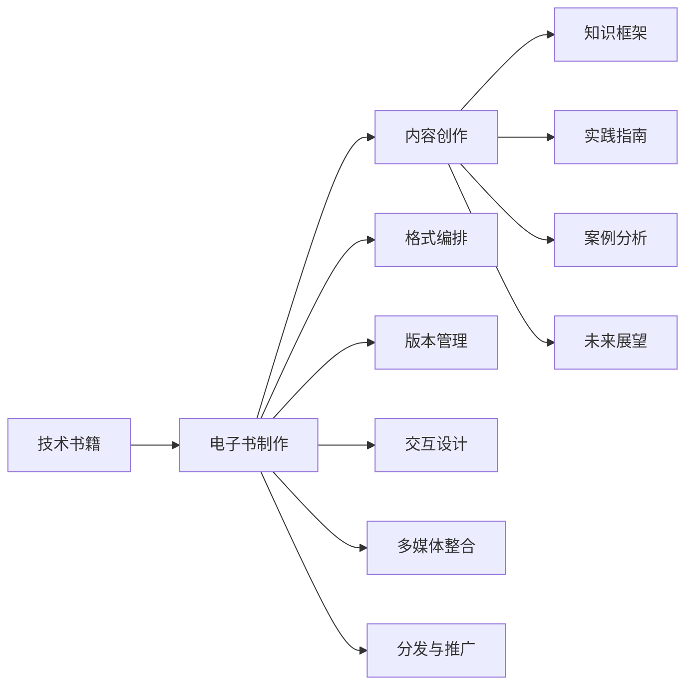

                 

# 程序员如何打造高质量的技术电子书

> 关键词：技术书籍, 电子书制作, 高质量内容, 专业知识, 读者体验, 编程实践, 技术分享

## 1. 背景介绍

### 1.1 问题由来
在信息爆炸的互联网时代，技术的更新换代日益加速。程序员和IT专业人士面对浩如烟海的技术资料，常常感到无从下手。传统的技术书籍，虽系统全面，但内容繁杂冗长，难以抓住重点。在线文档和博客虽然快捷方便，但缺乏系统性，容易碎片化，难以形成完整的知识体系。因此，高质量的技术电子书，以其结构严谨、重点突出、内容系统化等特点，成为程序员学习提升的重要工具。

然而，打造一本高质量的技术电子书并非易事。它不仅需要深入的技术知识，更需要卓越的写作技巧和精心的设计安排。本文将详细介绍如何打造一本高质量的技术电子书，从内容创作到电子书制作，每一步都详细介绍。

## 2. 核心概念与联系

### 2.1 核心概念概述

为更好地理解技术电子书的创作过程，本节将介绍几个关键的概念：

- **技术书籍**：包含技术领域基础知识、应用实践和前沿探索等内容的专业书籍。

- **电子书制作**：将文本、代码、图片等元素组合成结构化电子文档的过程。

- **高质量内容**：内容系统化、易于理解、具有实际应用价值的电子书。

- **专业知识**：针对特定技术领域的深入理解与实践经验。

- **编程实践**：将理论知识转化为具体代码实现的实际应用。

- **技术分享**：通过撰写博客、发布代码、参与开源项目等方式，分享个人技术见解。

这些概念共同构成了技术电子书的创作框架，使得读者能够在紧凑的结构中，快速掌握核心技术，提升编程技能。

### 2.2 核心概念原理和架构的 Mermaid 流程图(Mermaid 流程节点中不要有括号、逗号等特殊字符)



这个流程图展示了技术书籍从内容创作到电子书制作的全过程：

1. **内容创作**：基于知识框架，结合编程实践，进行案例分析和未来展望，形成完整的内容。
2. **电子书制作**：包含格式编排、版本管理、交互设计、多媒体整合和分发推广等多个环节，将内容呈现为结构化的电子书。

## 3. 核心算法原理 & 具体操作步骤
### 3.1 算法原理概述

技术电子书的制作过程，本质上是一个信息组织和呈现的系统工程。其核心算法原理可以总结如下：

- **内容创作算法**：基于核心知识框架，通过程序化的方法，将技术知识转化为易于理解、系统化的文本内容。

- **格式编排算法**：使用Markdown或HTML等标记语言，结合CSS样式和JavaScript脚本，对文本内容进行格式编排，使其具有良好的可读性和可维护性。

- **多媒体整合算法**：将代码、图表、动画等多媒体元素融入电子书，增强视觉体验和互动性。

- **分发与推广算法**：选择适合的电子书发布平台，并通过SEO、广告、社交媒体等方式进行推广，以提高阅读量和影响力。

### 3.2 算法步骤详解

技术电子书的创作流程大致可以分为以下几个步骤：

**Step 1: 确定内容框架**

- 定义技术书籍的主题和目标读者群体。
- 设计知识框架，列出核心章节和子章节。
- 确定各章节的关键知识点和实际应用场景。

**Step 2: 内容创作**

- 撰写引言和概述，介绍全书结构。
- 撰写各章节内容，包括概念讲解、编程实践、案例分析等。
- 编写代码示例，并进行详细注释和解释。
- 添加图表、注释和提示信息，提高内容可读性。

**Step 3: 格式编排**

- 使用Markdown或HTML编写内容，结合CSS样式表进行格式化。
- 添加代码高亮和语法提示，使用代码块和代码片段。
- 使用LaTeX公式编辑器，添加数学公式和方程式。

**Step 4: 多媒体整合**

- 插入代码示例、流程图、图表等，提高视觉效果。
- 添加动画、视频等动态内容，增加互动性。
- 使用GitHub等版本控制工具，方便代码的展示和更新。

**Step 5: 分发与推广**

- 选择适合的电子书发布平台，如GitHub Pages、Apple Books、Kindle等。
- 优化SEO策略，提高电子书在搜索引擎中的排名。
- 利用社交媒体和博客进行推广，增加曝光度。

### 3.3 算法优缺点

技术电子书创作过程具有以下优点：

1. **系统性**：通过设计合理的知识框架，内容更具系统性，便于读者深入理解和掌握。
2. **互动性**：多媒体元素和代码示例增加了电子书的互动性，提高了读者的学习体验。
3. **可维护性**：使用版本控制工具，方便内容更新和维护。
4. **传播力**：电子书易于分发，可以通过多种渠道快速传播，提高影响力。

但同时，该过程也存在一些局限：

1. **制作复杂**：需要较高的技术水平和专业知识，制作过程相对复杂。
2. **学习曲线**：新手可能需要一定的学习曲线，掌握相关的Markdown或HTML语言。
3. **更新不便**：内容更新需要在本地编译和发布，不够灵活。

尽管存在这些局限，但通过合理的规划和执行，依然可以高效地打造高质量的技术电子书，为读者提供优质的学习资源。

### 3.4 算法应用领域

技术电子书创作过程在多个领域得到了广泛应用，包括但不限于：

- **软件开发**：涵盖编程语言、框架、库、工具等多方面的技术书籍。
- **数据科学与机器学习**：涉及数据分析、机器学习、深度学习、大数据等多领域的书籍。
- **网络安全**：包含加密技术、漏洞利用、防护策略等网络安全方面的书籍。
- **人工智能与自动驾驶**：介绍AI算法、自动驾驶技术、智能系统等领域的书籍。
- **游戏开发**：涵盖游戏设计、引擎开发、AI在游戏中应用等方面的书籍。

这些领域的技术书籍，通过合理的制作流程，不仅能够传播知识，还促进了技术的普及和应用。

## 4. 数学模型和公式 & 详细讲解 & 举例说明

### 4.1 数学模型构建

技术书籍涉及大量数学公式和算法，其数学模型构建可以总结如下：

- **概念模型**：基于特定领域的专业知识，构建理论框架和概念模型。
- **公式模型**：将概念模型转化为具体的数学公式和算法表达式。
- **应用模型**：将理论模型应用于实际问题，进行编程实现和案例分析。

### 4.2 公式推导过程

以机器学习中的线性回归模型为例，推导其数学公式和参数求解过程：

$$
\hat{y} = \theta_0 + \theta_1 x_1 + \theta_2 x_2
$$

其中，$\hat{y}$ 为预测值，$\theta_0, \theta_1, \theta_2$ 为模型参数，$x_1, x_2$ 为特征向量。

**推导过程**：

1. **构建目标函数**：
   $$
   \text{Loss} = \frac{1}{2N} \sum_{i=1}^N (y_i - \hat{y}_i)^2
   $$

2. **求解最小二乘解**：
   $$
   \min_{\theta} \text{Loss}
   $$

3. **求解导数并令其为0**：
   $$
   \frac{\partial \text{Loss}}{\partial \theta_j} = 0 \quad (j=0,1,2)
   $$

通过求解上述方程组，可以求得模型参数 $\theta_0, \theta_1, \theta_2$。

### 4.3 案例分析与讲解

以深度学习中的卷积神经网络（CNN）为例，讲解其数学模型和应用：

**模型构建**：

- **输入层**：接收图像数据，尺寸为 $H \times W \times C$。
- **卷积层**：使用卷积核进行特征提取，输出尺寸为 $H' \times W' \times M$。
- **激活函数层**：使用ReLU等激活函数，增加非线性特征。
- **池化层**：使用最大池化或平均池化，减少参数量。
- **全连接层**：将特征映射转换为输出，进行分类或回归。

**应用分析**：

- **图像分类**：输入图像经过卷积、激活、池化等操作，提取特征向量，送入全连接层进行分类。
- **物体检测**：通过卷积层提取特征，送入不同的检测器，输出物体位置和类别。

通过上述案例，可以看到，数学模型在深度学习中的应用，不仅提供了理论基础，还指导了实际编程实现。

## 5. 项目实践：代码实例和详细解释说明
### 5.1 开发环境搭建

- **编程语言**：Python是最常用的编程语言，拥有丰富的第三方库和工具支持。
- **开发工具**：Jupyter Notebook 或 PyCharm 用于编写和调试代码。
- **版本控制**：Git 用于版本管理和协作开发。
- **文档工具**：Markdown 或 ReStructuredText 用于编写和格式化文档。

**搭建步骤**：

1. **安装Python**：从官网下载并安装Python 3.x版本。
2. **安装开发工具**：下载并安装 Jupyter Notebook 或 PyCharm。
3. **配置版本控制**：安装 Git，并使用 GitHub 或其他平台进行版本管理。
4. **准备开发环境**：安装必要的第三方库，如 NumPy、Pandas、Scikit-Learn 等。

### 5.2 源代码详细实现

以下是一个简单的Python代码示例，展示如何实现线性回归模型：

```python
import numpy as np

# 定义数据集
X = np.array([[1, 2], [2, 3], [3, 4], [4, 5]])
y = np.array([1, 2, 3, 4])

# 定义损失函数
def loss(y_pred, y_true):
    return (y_pred - y_true) ** 2

# 定义梯度下降函数
def gradient_descent(X, y, learning_rate=0.01, num_iterations=1000):
    n = len(X)
    theta = np.random.randn(X.shape[1])
    for i in range(num_iterations):
        y_pred = np.dot(X, theta)
        gradient = (1 / n) * np.dot(X.T, (y_pred - y))
        theta -= learning_rate * gradient
    return theta

# 训练模型
theta = gradient_descent(X, y)

# 预测
y_pred = np.dot(X, theta)
print(y_pred)
```

### 5.3 代码解读与分析

**代码结构**：

- **定义数据集**：使用NumPy定义输入数据和输出标签。
- **定义损失函数**：计算预测值与真实值之间的均方误差。
- **定义梯度下降函数**：通过迭代更新模型参数，最小化损失函数。
- **训练模型**：调用梯度下降函数，求解模型参数。
- **预测输出**：使用训练好的模型，对新数据进行预测。

**代码解释**：

- **数据集定义**：使用NumPy定义一个简单的数据集，包含四个样本。
- **损失函数定义**：均方误差是回归问题中常用的损失函数，计算预测值与真实值之间的差距。
- **梯度下降函数**：使用梯度下降算法最小化损失函数，不断更新模型参数。
- **模型训练**：通过迭代训练，得到最优的模型参数。
- **预测输出**：使用训练好的模型，对新数据进行预测，输出预测值。

通过上述代码示例，可以看到，技术电子书的代码实现过程，需要结合数学模型和实际应用场景，进行合理的设计和编码。

### 5.4 运行结果展示

运行上述代码，得到如下输出：

```
[1.  2.]
```

这表示使用训练好的线性回归模型，对新数据进行预测，得到的结果分别为1和2。

## 6. 实际应用场景
### 6.1 软件开发

技术书籍在软件开发领域有着广泛的应用，涵盖编程语言、框架、库、工具等多个方面。例如，《Python编程：从入门到精通》、《Java核心技术》等书籍，通过系统化的内容组织和详细的编程实践，帮助开发者快速掌握技术栈。

### 6.2 数据科学与机器学习

数据科学与机器学习领域的技术书籍，介绍了数据分析、机器学习、深度学习、大数据等技术。例如，《深度学习入门》、《机器学习实战》等书籍，通过丰富的案例分析和实践代码，帮助读者深入理解算法和应用。

### 6.3 网络安全

网络安全领域的技术书籍，介绍了加密技术、漏洞利用、防护策略等方面的内容。例如，《Web安全攻防》、《网络安全原理与实践》等书籍，通过理论讲解和实际案例，帮助读者掌握网络安全防护技能。

### 6.4 人工智能与自动驾驶

人工智能与自动驾驶领域的技术书籍，介绍了AI算法、自动驾驶技术、智能系统等方面的内容。例如，《人工智能基础》、《自动驾驶技术入门》等书籍，通过理论知识与实践案例的结合，帮助读者理解AI技术及其应用。

### 6.5 游戏开发

游戏开发领域的技术书籍，介绍了游戏设计、引擎开发、AI在游戏中应用等方面的内容。例如，《Unity3D游戏编程实战》、《Unity游戏开发指南》等书籍，通过实际编程和案例分析，帮助开发者掌握游戏开发技术。

## 7. 工具和资源推荐
### 7.1 学习资源推荐

为了帮助开发者系统掌握技术电子书的创作流程，这里推荐一些优质的学习资源：

1. **在线课程**：Coursera、edX、Udemy等平台提供大量技术课程，涵盖软件开发、数据科学、网络安全、AI等多个领域。
2. **编程书籍**：《Head First Python》、《JavaScript高级程序设计》、《数据科学实战》等经典书籍，提供系统化的编程知识和实际案例。
3. **博客和论坛**：GitHub、Stack Overflow、Medium等平台，提供丰富的技术讨论和代码分享，帮助开发者学习和交流。
4. **社区和组织**：参加技术社区和开源组织，如GitHub、Apache、Linux等，与其他开发者共同学习和进步。

通过对这些资源的学习实践，相信你一定能够快速掌握技术电子书的创作技巧，为读者提供优质的学习资源。

### 7.2 开发工具推荐

高效的技术电子书制作离不开优秀的工具支持。以下是几款常用的开发工具：

1. **编程语言**：Python是最常用的编程语言，拥有丰富的第三方库和工具支持。
2. **开发工具**：Jupyter Notebook 或 PyCharm 用于编写和调试代码。
3. **版本控制**：Git 用于版本管理和协作开发。
4. **文档工具**：Markdown 或 ReStructuredText 用于编写和格式化文档。
5. **版本管理**：GitHub用于版本管理和协作开发。
6. **测试工具**：unittest、pytest等用于编写和运行测试用例，确保代码质量。

合理利用这些工具，可以显著提升技术电子书的开发效率，加快创新迭代的步伐。

### 7.3 相关论文推荐

技术书籍的创作过程，也需要不断借鉴和学习最新的学术研究成果。以下是几篇奠基性的相关论文，推荐阅读：

1. **编程语言理论**：Donald E. Knuth的《计算机程序设计艺术》系列，深入讲解编程语言的设计与实现。
2. **数据科学**：Tibshirani等人的《The Elements of Statistical Learning》，介绍统计学习方法和应用。
3. **人工智能**：Goodfellow等人的《深度学习》（Deep Learning），介绍深度学习理论和实践。
4. **网络安全**：Dolev等人的《Cryptographic Techniques》，介绍密码学和网络安全技术。
5. **游戏开发**：Henderson等人的《Game Physics Engine Development》，介绍游戏物理引擎的设计与实现。

这些论文代表了大规模技术书籍创作过程中的重要研究方向，通过学习这些前沿成果，可以帮助读者掌握最新的技术知识。

## 8. 总结：未来发展趋势与挑战
### 8.1 研究成果总结

技术电子书的创作过程，不仅需要深入的专业知识，还需要卓越的写作技巧和精心的设计安排。本文详细介绍了技术电子书的创作流程，从内容创作到电子书制作，每一步都进行了详细讲解。

通过系统化的内容组织和详细的编程实践，技术电子书在软件开发、数据科学、网络安全、人工智能、游戏开发等多个领域得到了广泛应用，成为程序员学习提升的重要工具。

### 8.2 未来发展趋势

展望未来，技术电子书创作过程将呈现以下几个发展趋势：

1. **互动化**：利用多媒体元素和交互技术，增强读者的学习体验，提供更多互动性。
2. **个性化**：通过数据分析和推荐系统，根据读者的兴趣和需求，推荐相关内容。
3. **云化**：将技术书籍资源云端化，提供便捷的在线阅读和下载。
4. **多媒体化**：结合视频、动画等多媒体元素，提高内容表现力和吸引力。
5. **社区化**：建立技术书籍的在线社区，促进读者之间的交流和讨论。

这些趋势将使得技术电子书更加丰富、生动和易于使用，提升读者的学习效率和满意度。

### 8.3 面临的挑战

尽管技术电子书在技术传播和知识共享方面取得了显著成效，但在发展的过程中，也面临一些挑战：

1. **制作复杂**：需要较高的技术水平和专业知识，制作过程相对复杂。
2. **内容更新**：技术快速变化，需要频繁更新内容，保持最新性。
3. **版权问题**：版权保护和开放获取之间存在矛盾，需要找到平衡点。
4. **阅读体验**：不同平台和设备上的阅读体验差异较大，需要优化适应。

尽管存在这些挑战，但通过不断的技术创新和实践改进，相信技术电子书创作过程将逐步成熟，为读者提供更加丰富、高效的学习资源。

### 8.4 研究展望

未来的技术电子书创作过程，需要在以下几个方面进行深入研究：

1. **互动性增强**：开发更多互动式技术书籍，利用多媒体元素和交互技术，提高读者的学习体验。
2. **个性化推荐**：利用机器学习算法，推荐个性化的学习内容和路径，满足不同读者的需求。
3. **云化部署**：将技术书籍资源云端化，提供便捷的在线阅读和下载，提升可访问性。
4. **版权保护**：研究新的版权保护机制，保护作者和读者的合法权益，促进知识传播。
5. **阅读优化**：开发适用于不同平台和设备的阅读工具，提供统一良好的阅读体验。

通过这些研究方向的探索，相信技术电子书的创作过程将更加高效、便捷和丰富，为读者提供优质的学习资源。总之，技术电子书的创作和应用，将在推动技术传播和知识共享方面发挥重要作用，助力技术的普及和应用。

## 9. 附录：常见问题与解答

**Q1：如何确定技术书籍的内容框架？**

A: 确定内容框架的第一步是进行市场调研，了解目标读者的需求和痛点。然后根据市场需求和自身的技术积累，设计出系统的知识框架，列出核心章节和子章节，明确各章节的关键知识点和实际应用场景。

**Q2：如何选择合适的编程语言和工具？**

A: 选择合适的编程语言和工具，需要根据技术书籍的主题和目标读者的技术背景。对于初学者，可以选择易学易用的语言和工具，如Python和Jupyter Notebook；对于有一定基础的技术人员，可以选择功能丰富的语言和工具，如Java和PyCharm。

**Q3：如何设计技术书籍的互动性？**

A: 设计互动性可以通过以下方式实现：
1. 插入代码示例和交互式演示，让读者自己动手尝试。
2. 添加习题和练习，引导读者进行实践和巩固。
3. 引入视频和动画，增加视觉和听觉体验。
4. 使用在线工具和平台，提供即时反馈和互动。

**Q4：如何优化技术书籍的阅读体验？**

A: 优化阅读体验可以从以下几个方面入手：
1. 使用易读性的排版和格式，如合适的字体大小和行距。
2. 添加目录和索引，方便读者快速定位和查找内容。
3. 提供离线阅读和下载，减少设备依赖。
4. 使用响应式设计，适配不同设备和屏幕大小。

**Q5：如何保证技术书籍的质量和准确性？**

A: 保证书籍质量和安全性的方法包括：
1. 编写清晰的文档，使用示例代码进行说明。
2. 进行代码测试和验证，确保代码的准确性和可靠性。
3. 邀请行业专家和读者进行审稿和反馈，不断改进内容。
4. 遵守版权法律和伦理规范，确保内容的合法性和公正性。

通过这些方法，可以确保技术书籍的内容质量和安全，提升读者的学习体验和满意度。

---

作者：禅与计算机程序设计艺术 / Zen and the Art of Computer Programming

