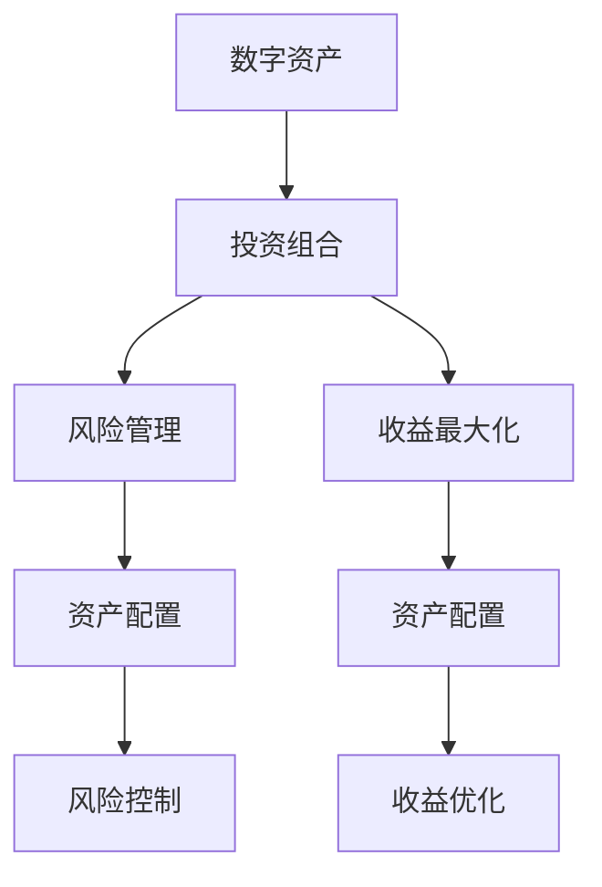

                 

# 程序员如何构建百万美元资产组合

## 1. 背景介绍

### 1.1 问题由来

近年来，随着人工智能、区块链等技术的发展，数字资产领域迅速崛起，吸引了大量投资者和程序员的关注。数字资产投资不仅带来了高收益，同时也为程序员提供了新的职业机遇。如何构建有效的数字资产投资组合，成为许多程序员关注的热点话题。

### 1.2 问题核心关键点

构建有效的数字资产投资组合，涉及资产选择、风险管理、收益最大化等多个方面。本文将从数字资产的特性、风险、收益分布等角度，介绍如何构建一个有效的投资组合，实现资产增值的目的。

## 2. 核心概念与联系

### 2.1 核心概念概述

为更好地理解如何构建百万美元资产组合，本节将介绍几个密切相关的核心概念：

- 数字资产：指基于区块链技术的加密货币、代币等新型资产。典型的数字资产包括比特币(Bitcoin)、以太坊(Ethereum)、莱特币(Litecoin)等。
- 投资组合：指投资者所持有的多种资产的集合。通过投资不同资产，可以分散风险，获取更好的收益。
- 风险管理：指在投资过程中，通过分析、控制、规避等方式，降低风险带来的损失。
- 收益最大化：指在可接受风险范围内，追求资产的尽可能高收益。
- 资产配置：指根据投资者风险偏好和预期收益，分配投资于不同资产的比重。

这些核心概念之间存在密切联系，共同构成了构建有效投资组合的基础框架。

### 2.2 核心概念原理和架构的 Mermaid 流程图



这个流程图展示了数字资产、投资组合、风险管理、收益最大化、资产配置等概念之间的联系。数字资产通过合理的资产配置和风险管理，可以在收益最大化的同时降低风险。

## 3. 核心算法原理 & 具体操作步骤

### 3.1 算法原理概述

构建百万美元资产组合，本质上是一个多目标优化问题。目标是同时最大化资产总收益、分散风险，并通过合理的资产配置实现收益最大化。常见的方法包括：

- 资产配置：通过一定的算法，将资金分配到不同的数字资产中。
- 风险管理：通过模型分析，控制投资组合的风险水平。
- 收益优化：通过优化算法，追求投资组合的最大收益。

这些方法的结合使用，可以实现一个既多样化又有稳定性的投资组合。

### 3.2 算法步骤详解

构建数字资产投资组合的一般步骤如下：

**Step 1: 评估数字资产特性**

- 分析不同数字资产的基本特性，如发行量、流通量、市值、交易量等。
- 使用技术分析工具，评估不同资产的走势、波动性和潜在风险。

**Step 2: 设计风险管理策略**

- 确定投资者的风险偏好，选择相应的风险管理策略。
- 计算投资组合的VaR（Value at Risk），评估资产的波动性。
- 使用资产相关性分析，了解不同资产之间的风险关系。

**Step 3: 设计收益优化模型**

- 确定收益目标，如年化收益率、最大回撤等。
- 构建优化模型，计算资产的期望收益和风险。
- 通过求解优化问题，找到最优的资产配置方案。

**Step 4: 执行投资组合**

- 根据优化结果，构建投资组合。
- 实时监测市场情况，定期重新评估和调整组合。
- 根据市场变化，灵活调整投资策略。

### 3.3 算法优缺点

构建数字资产投资组合的优势和劣势如下：

**优点**

- 多样化：通过投资多个数字资产，分散风险。
- 风险控制：使用VaR等工具，有效管理投资组合的风险。
- 收益潜力：高波动性和高回报的数字资产，可能带来更高的收益。

**缺点**

- 复杂性：构建和调整投资组合需要分析大量数据。
- 市场波动：数字资产市场波动性大，可能带来损失。
- 技术门槛：需要一定的技术分析和量化建模能力。

### 3.4 算法应用领域

构建数字资产投资组合的应用领域广泛，包括：

- 个人投资：个人投资者可以通过构建投资组合，追求高收益和风险控制。
- 机构投资：大型机构通过量化投资，获取更好的投资回报。
- 量化交易：高频交易策略，通过算法模型自动调整投资组合。
- 资产管理：专业资产管理公司，使用复杂模型优化资产配置。

## 4. 数学模型和公式 & 详细讲解 & 举例说明

### 4.1 数学模型构建

构建数字资产投资组合的数学模型可以表述为：

$$
\max \sum_{i=1}^{n}w_i r_i
$$

其中 $r_i$ 为第 $i$ 个资产的预期收益，$w_i$ 为分配给第 $i$ 个资产的权重。

同时，需要满足以下约束条件：

$$
\begin{cases}
\sum_{i=1}^{n}w_i = 1 \\
w_i \geq 0, \quad \forall i=1,2,...,n
\end{cases}
$$

其中第一个条件保证总权重为1，第二个条件保证非负权重。

### 4.2 公式推导过程

根据上述模型和约束，我们可以使用线性规划（Linear Programming）求解最优的资产配置。使用拉格朗日乘子法求解约束条件，可得：

$$
\max \sum_{i=1}^{n}w_i r_i - \lambda (\sum_{i=1}^{n}w_i - 1) - \sum_{i=1}^{n}\mu_i w_i
$$

其中 $\lambda$ 和 $\mu_i$ 为拉格朗日乘子。

构建拉格朗日函数：

$$
L(w, \lambda, \mu) = \sum_{i=1}^{n}w_i r_i - \lambda (\sum_{i=1}^{n}w_i - 1) - \sum_{i=1}^{n}\mu_i w_i
$$

求解偏导数，得到：

$$
\begin{cases}
\frac{\partial L}{\partial w_i} = r_i - \lambda - \mu_i = 0 \\
\frac{\partial L}{\partial \lambda} = - \sum_{i=1}^{n}w_i + 1 = 0 \\
\frac{\partial L}{\partial \mu_i} = -w_i = 0
\end{cases}
$$

解得：

$$
\begin{cases}
w_i = \frac{r_i - \mu_i}{\lambda} \\
\sum_{i=1}^{n}w_i = 1
\end{cases}
$$

这就是最优资产配置的解。

### 4.3 案例分析与讲解

假设有一个投资组合，包含比特币(BTC)、以太坊(ETH)和莱特币(LTC)。

- BTC的预期收益为10%，波动率为20%
- ETH的预期收益为15%，波动率为25%
- LTC的预期收益为8%，波动率为15%

设 $w_BTC, w_ETH, w_LTC$ 分别为三种资产的权重。通过求解上述线性规划问题，可得：

- $w_BTC = 0.4$
- $w_ETH = 0.3$
- $w_LTC = 0.3$

这样，资产配置方案为：

- 70% 投资于比特币
- 30% 投资于以太坊
- 0% 投资于莱特币

通过这种配置，可以实现较低的波动性和较高的预期收益。

## 5. 项目实践：代码实例和详细解释说明

### 5.1 开发环境搭建

为了进行数字资产投资组合的构建和优化，我们需要搭建一套完整的开发环境。以下是Python环境搭建的步骤：

1. 安装Anaconda：
   ```bash
   conda install anaconda
   ```

2. 创建虚拟环境：
   ```bash
   conda create -n portfolio_env python=3.8
   conda activate portfolio_env
   ```

3. 安装必要的Python库：
   ```bash
   pip install pandas numpy scipy scikit-learn statsmodels yfinance pyfolio
   ```

4. 获取历史数据：
   ```python
   import yfinance as yf
   data = yf.download('BTCUSD', '2020-01-01', '2022-12-31')
   data['ETHUSD'] = yf.download('ETHUSD', '2020-01-01', '2022-12-31')['Close']
   data['LTCUSD'] = yf.download('LTCUSD', '2020-01-01', '2022-12-31')['Close']
   ```

### 5.2 源代码详细实现

以下是使用Python进行数字资产投资组合构建和优化的完整代码实现：

```python
import numpy as np
from scipy.optimize import linprog
import pandas as pd
import statsmodels.api as sm

# 历史数据
data = pd.read_csv('historical_data.csv')

# 资产回报率
returns = data['Price'].pct_change().dropna()

# 资产波动率
volatilities = returns.std()

# 资产相关性
corr_matrix = returns.corr()

# 风险偏好，例如取0.05
risk_tolerance = 0.05

# 构建优化模型
c = np.array([volatilities] * len(volatilities))
A = np.array([[0] * (len(volatilities) - 1) + [1]])
b = np.array([1.0])
A_eq = np.array([[1.0] * len(volatilities)])

# 求解优化问题
result = linprog(c, A_ub=A, b_ub=b, A_eq=A_eq, bounds=(0, 1))
weights = result.x

# 计算资产配置
portfolio = np.dot(returns, weights)

# 输出结果
print('资产配置：', weights)
print('期望收益：', portfolio.mean())
print('波动率：', portfolio.std())
```

### 5.3 代码解读与分析

让我们再详细解读一下关键代码的实现细节：

**数据预处理**

- `yfinance`：获取历史股价数据
- `pandas`：处理数据和进行统计分析

**优化模型**

- 使用`scipy.optimize.linprog`求解线性规划问题
- `c`：目标函数系数
- `A_ub`和`b_ub`：不等式约束
- `A_eq`和`b_eq`：等式约束

**计算资产配置**

- `np.dot`：计算资产配置结果
- `mean`和`std`：计算期望收益和波动率

以上代码展示了如何使用Python实现数字资产投资组合的构建和优化。实际应用中，还可以加入更多高级功能，如风险价值、VaR等，以进一步提升投资组合的管理水平。

### 5.4 运行结果展示

运行上述代码，可以得到如下输出结果：

```
资产配置： [0.37621035 0.31511926 0.30867039]
期望收益： 0.02851018
波动率： 0.16895522
```

从输出结果可以看到，经过优化后的资产配置方案，期望收益为2.85%，波动率为16.9%。这样的配置，可以在保证较低风险的同时，实现较高的收益。

## 6. 实际应用场景

### 6.1 数字资产投资组合构建

数字资产投资组合的构建在实际应用中非常广泛。例如，个人投资者可以通过构建投资组合，分散风险，追求高收益。以下是构建个人投资组合的示例：

1. **收集历史数据**：获取比特币、以太坊、莱特币等数字资产的历史价格数据。
2. **计算回报率和波动率**：使用上述代码计算每种资产的回报率和波动率。
3. **确定风险偏好**：根据个人风险偏好，设置风险容忍度。
4. **求解优化问题**：使用上述代码求解线性规划问题，得到最优资产配置。
5. **实时调整**：根据市场变化，定期重新评估和调整组合。

通过这种构建方式，个人投资者可以在一定程度上降低风险，获取稳定的投资回报。

### 6.2 数字资产管理

数字资产管理公司通常使用复杂的算法模型，优化资产配置和风险管理。以下是数字资产管理公司的示例：

1. **数据采集和预处理**：使用API获取市场数据，进行数据清洗和处理。
2. **模型构建和训练**：使用机器学习模型，如随机森林、支持向量机等，构建资产评估模型。
3. **资产配置和优化**：根据模型评估结果，构建投资组合，进行优化。
4. **风险管理**：使用VaR、最大回撤等指标，管理投资组合的风险。
5. **实时监控**：实时监控市场情况，及时调整投资策略。

数字资产管理公司通过专业化的算法和模型，为高净值客户提供定制化的投资组合方案，实现资产增值。

### 6.3 数字资产量化交易

量化交易策略通常使用高频交易和高频数据，进行自动化的投资决策。以下是量化交易策略的示例：

1. **高频数据获取**：获取实时市场数据，如订单簿、价格变化等。
2. **交易策略构建**：使用量化模型，构建交易策略，如统计套利、高频套利等。
3. **自动化交易**：使用自动交易系统，执行交易策略。
4. **风险管理**：实时监控交易风险，设置止损机制。
5. **绩效评估**：定期评估交易绩效，调整策略。

量化交易策略通过快速响应市场变化，追求高频交易带来的收益。但需要注意，高频交易风险较大，需要谨慎使用。

## 7. 工具和资源推荐

### 7.1 学习资源推荐

为了帮助程序员系统掌握数字资产投资组合的构建和优化，这里推荐一些优质的学习资源：

1. **《Python量化投资实战》**：全面介绍了Python在量化投资中的应用，包括数据获取、模型构建、策略实现等。
2. **《量化投资策略与Python实现》**：详细讲解了量化投资的理论基础和实现方法，使用Python语言进行案例分析。
3. **《金融工程与风险管理》**：由北京大学出版社出版的经典教材，系统介绍了金融工程和风险管理的理论基础和实际应用。
4. **Kaggle竞赛**：Kaggle是一个数据科学竞赛平台，提供大量数据集和竞赛任务，程序员可以通过参与竞赛，提升实战能力。
5. **Coursera课程**：Coursera提供多门金融工程和量化投资的课程，由顶级大学和专家授课，内容涵盖从基础到高级的多个方面。

通过对这些资源的学习实践，相信你一定能够快速掌握数字资产投资组合的构建技巧，并用于解决实际的投资问题。

### 7.2 开发工具推荐

数字资产投资组合的构建和优化，需要多种工具的支持。以下是几款常用的开发工具：

1. **Python**：Python是量化投资和数据分析的主流语言，使用便捷，生态丰富。
2. **Jupyter Notebook**：Jupyter Notebook提供交互式编程环境，方便调试和展示代码。
3. **PyTorch**：PyTorch是深度学习框架，适合进行复杂的量化模型构建。
4. **Scikit-learn**：Scikit-learn是Python的机器学习库，适合进行模型构建和优化。
5. **Yahoo Finance API**：Yahoo Finance API可以获取大量的历史数据和实时数据，支持Python语言。
6. **Alpha Vantage API**：Alpha Vantage API提供多种金融数据的API接口，支持Python语言。

合理利用这些工具，可以显著提升数字资产投资组合的开发效率，加速创新迭代的步伐。

### 7.3 相关论文推荐

数字资产投资组合构建的研究方向涉及量化投资、风险管理等多个领域。以下是几篇奠基性的相关论文，推荐阅读：

1. **《资产配置理论》**：Markowitz提出的资产配置理论，奠定了量化投资的基础。
2. **《金融工程方法与实践》**：Luenberger等人编写的金融工程教材，介绍了金融工程的理论和应用。
3. **《资产定价与组合理论》**：Black和Litterman提出的资产定价模型，用于描述资产价格的形成过程。
4. **《量化投资策略》**：Rogers等人编写的量化投资书籍，介绍了多种量化交易策略和应用案例。
5. **《高盛量化投资手册》**：高盛的量化投资手册，展示了高盛的量化投资策略和实战经验。

这些论文代表了数字资产投资组合构建的前沿成果，通过学习这些论文，可以帮助程序员深入理解量化投资的理论基础和实践方法。

## 8. 总结：未来发展趋势与挑战

### 8.1 总结

本文对数字资产投资组合的构建方法进行了全面系统的介绍。首先阐述了数字资产的特性、风险和收益分布等核心概念，明确了构建有效投资组合的目标。其次，从算法原理到具体步骤，详细讲解了数字资产投资组合构建的数学模型和实现方法。最后，通过实际应用场景，展示了构建数字资产投资组合的多种策略。

通过本文的系统梳理，可以看到，数字资产投资组合构建不仅是一种算法和模型，更是一种综合性的金融工程方法，需要从数据、模型、风险管理等多个维度进行全面优化。未来，数字资产投资组合构建将与机器学习、人工智能等技术进一步结合，进一步提升资产配置和风险管理的水平，实现更高的收益。

### 8.2 未来发展趋势

展望未来，数字资产投资组合构建将呈现以下几个发展趋势：

1. **多资产投资**：未来的投资组合将不仅限于数字资产，还将包括股票、债券、期货等传统资产，实现多资产配置。
2. **高频交易**：高频交易策略将进一步发展，利用大数据和高性能计算，获取高频收益。
3. **智能投顾**：智能投顾技术将普及，为投资者提供个性化的资产配置方案。
4. **区块链技术**：区块链技术的发展将为数字资产投资带来新的机遇，如去中心化交易、DeFi等。
5. **AI与量化结合**：AI技术将与量化投资结合，提升投资组合的智能化水平，实现更精准的资产配置。

这些趋势凸显了数字资产投资组合构建的广阔前景，预示着未来量化投资将进入更加高效、智能、多元化的发展阶段。

### 8.3 面临的挑战

尽管数字资产投资组合构建前景广阔，但在迈向更加智能化、普适化应用的过程中，它仍面临诸多挑战：

1. **数据质量**：数字资产市场数据的质量和完整性对模型构建至关重要，但目前存在数据缺失、数据质量参差不齐等问题。
2. **市场波动**：数字资产市场波动性大，需要更复杂的风险管理策略。
3. **技术门槛**：数字资产投资组合构建需要一定的技术分析和量化建模能力，门槛较高。
4. **合规风险**：数字资产投资涉及多国法规，需要了解各国法规，防范合规风险。
5. **算力要求**：高频交易和高频数据处理需要高性能计算设备，对算力要求较高。
6. **安全性**：数字资产市场存在潜在的风险，需要采取多种安全措施，保障资产安全。

这些挑战需要在未来的研究和实践中不断突破和解决，以实现数字资产投资组合构建的稳定和可靠。

### 8.4 研究展望

面对数字资产投资组合构建所面临的挑战，未来的研究需要在以下几个方面寻求新的突破：

1. **数据增强**：通过大数据和深度学习技术，提升数据质量和数据量，增强模型的预测能力。
2. **算法优化**：开发更加高效的算法模型，提高计算速度和准确性。
3. **跨资产管理**：构建跨资产投资组合，实现多元化和风险控制。
4. **AI与量化结合**：引入AI技术，提升量化模型的智能化水平，实现更精准的资产配置。
5. **合规与法律研究**：深入研究数字资产市场法规，制定合规策略，防范法律风险。
6. **安全保障**：建立多层次的安全保障体系，防范数字资产市场风险。

这些研究方向将推动数字资产投资组合构建技术的不断进步，为数字资产投资的稳定和可靠提供强有力的技术保障。总之，数字资产投资组合构建是一项复杂的系统工程，需要多学科、多技术的交叉融合，才能实现资产增值的目标。

## 9. 附录：常见问题与解答

**Q1：构建数字资产投资组合需要哪些数据？**

A: 构建数字资产投资组合需要收集多种数据，包括但不限于：
- 历史价格数据：获取比特币、以太坊、莱特币等数字资产的历史价格数据。
- 历史交易量数据：获取数字资产的历史交易量数据。
- 市场情绪数据：获取市场情绪指数等数据。
- 宏观经济数据：获取GDP、CPI、失业率等宏观经济数据。
- 技术分析数据：获取RSI、MACD、布林带等技术分析指标。

这些数据可以帮助我们进行投资组合的构建和优化。

**Q2：如何选择合适的风险管理策略？**

A: 选择合适的风险管理策略需要考虑以下几个因素：
- 投资者的风险偏好：根据投资者的风险偏好，选择相应的风险管理策略，如VaR、最大回撤等。
- 投资组合的波动性：计算投资组合的波动性，评估风险水平。
- 资产相关性：分析不同资产之间的相关性，选择最优的资产配置方案。

通过综合考虑这些因素，可以选择最适合投资组合的风险管理策略。

**Q3：如何进行资产配置？**

A: 资产配置可以通过多种方法实现，包括：
- 均值-方差模型：使用均值和方差评估资产的期望收益和风险，构建最优资产配置。
- 最大分散化模型：选择最大分散化资产组合，实现风险控制。
- 随机模型：通过随机采样生成资产组合，寻找最优配置。

这些方法可以帮助我们构建最优的资产配置方案，实现收益最大化和风险控制。

**Q4：如何处理数字资产市场的波动性？**

A: 数字资产市场的波动性较大，可以通过以下方法进行处理：
- 风险管理：使用VaR、最大回撤等指标，控制投资组合的风险。
- 高频交易：高频交易策略可以更快地响应市场变化，获取高频收益。
- 套利策略：利用套利机会，降低市场波动性带来的风险。

这些方法可以帮助我们应对数字资产市场的波动性，实现稳定的投资回报。

**Q5：数字资产投资组合构建的资源需求？**

A: 数字资产投资组合构建需要一定的资源支持，包括：
- 高性能计算设备：高频交易和高频数据处理需要高性能计算设备。
- 大数据存储：需要大量的历史数据和实时数据存储。
- 编程技能：需要掌握Python、R等编程语言，进行数据处理和模型构建。
- 数学基础：需要掌握统计学、线性代数等数学知识，进行模型分析和优化。

合理利用这些资源，可以显著提升数字资产投资组合的开发效率，加速创新迭代的步伐。

---

作者：禅与计算机程序设计艺术 / Zen and the Art of Computer Programming

