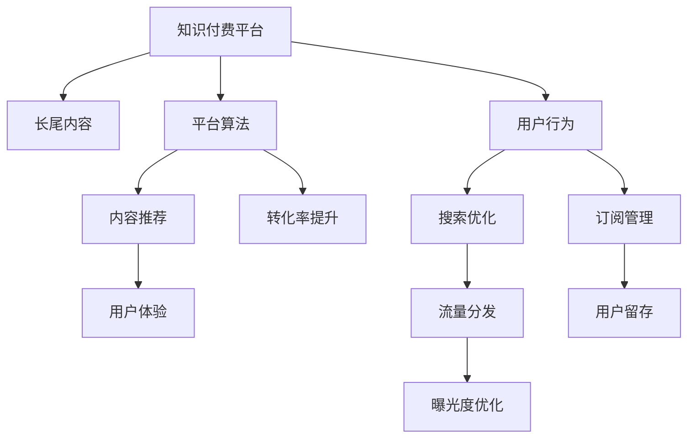

                 

# 程序员如何构建知识付费的长尾效应

## 1. 背景介绍

### 1.1 问题由来
随着互联网的发展，知识付费平台如雨后春笋般涌现。这些平台提供了海量的课程、文章、音频、视频等付费内容，极大地满足了用户个性化、细分化的学习需求。然而，大多数用户仍然集中在少数热门课程或流行IP上，即"头部效应"显著，而大量长尾内容则鲜有人问津。这种“二八定律”不仅影响了知识付费平台的收益结构，也造成了优质内容的埋没和资源的浪费。

长尾效应，指的是在小众市场上，非主流商品的销量与主流商品的销量相比，可能毫不逊色，甚至超过主流商品的现象。在知识付费领域，如何通过高效构建长尾效应，实现“小众内容，大众收益”，是平台和内容创作者共同关心的焦点。

### 1.2 问题核心关键点
要解决知识付费平台的长尾效应问题，需要从多个维度进行探索，包括内容生产、平台算法、用户行为等。

1. **内容生产**：如何鼓励内容创作者持续生产多样化、专业化的内容。
2. **平台算法**：如何通过算法优化，提高长尾内容的曝光度和转化率。
3. **用户行为**：如何通过激励机制，引导用户对长尾内容的关注和消费。

本文将从内容生产、平台算法和用户行为三个方面，探讨如何构建知识付费平台的长尾效应。

## 2. 核心概念与联系

### 2.1 核心概念概述

为更好地理解如何构建知识付费平台的长尾效应，本节将介绍几个密切相关的核心概念：

- **长尾效应**：指大量小众或非主流产品或服务通过网络平台进行售卖时，总体收益与主流产品或服务相媲美甚至超过主流产品的现象。
- **知识付费平台**：提供付费内容的互联网平台，如网易云课堂、得到、喜马拉雅等。
- **长尾内容**：指那些不属于主流热门领域，但具有一定专业性或细分市场的内容，如某些特定技术领域的课程、专业学术文章等。
- **平台算法**：指知识付费平台用于推荐内容、优化用户体验的技术手段，如协同过滤、内容推荐、A/B测试等。
- **用户行为**：指用户在知识付费平台上的行为模式，包括浏览、搜索、订阅、评价、分享等。

这些核心概念之间的逻辑关系可以通过以下Mermaid流程图来展示：



这个流程图展示了大语言模型的核心概念及其之间的关系：

1. 知识付费平台通过平台算法推荐长尾内容。
2. 用户行为引导内容消费和平台优化。
3. 平台算法优化提升长尾内容的曝光度和转化率。

这些概念共同构成了知识付费平台的长尾效应构建框架，使其能够更好地满足用户的个性化需求。

## 3. 核心算法原理 & 具体操作步骤
### 3.1 算法原理概述

构建知识付费平台的长尾效应，核心在于如何高效地将长尾内容推荐给潜在用户，从而提升其转化率和用户留存。从根本上说，这是一个内容推荐系统的问题，可以利用常见的推荐算法框架进行处理。

推荐系统的核心任务是预测用户对物品的偏好程度，从而为用户推荐最有可能感兴趣的商品。常见的推荐算法包括基于协同过滤的算法、基于内容的推荐算法、混合推荐算法等。对于知识付费平台而言，其推荐系统的核心目标是最大化长尾内容的曝光度和收益。

### 3.2 算法步骤详解

构建知识付费平台长尾效应的一般步骤如下：

**Step 1: 用户行为数据采集与处理**

- 收集用户在平台上的行为数据，如浏览历史、搜索记录、评价、订阅等。
- 对数据进行清洗、去重、归一化等预处理操作，构建用户行为特征向量。

**Step 2: 内容特征提取与构建**

- 对每个长尾内容进行特征提取，包括标题、作者、标签、摘要、用户评价等。
- 将内容特征转化为向量形式，与用户行为特征一起构建特征矩阵。

**Step 3: 模型训练与优化**

- 选择适当的推荐算法（如协同过滤、内容推荐、混合推荐等），构建推荐模型。
- 在历史数据集上训练推荐模型，并使用交叉验证、网格搜索等方法进行模型调优。

**Step 4: 模型应用与评估**

- 将训练好的模型应用到实时数据上，进行内容推荐。
- 评估推荐效果，使用指标如点击率、转化率、平均用户消费时长等。
- 根据评估结果，对模型进行迭代优化。

### 3.3 算法优缺点

构建知识付费平台长尾效应的推荐算法具有以下优点：

1. 高效性：通过算法自动化推荐，可显著提升长尾内容的曝光度和用户转化率。
2. 个性化：推荐算法可根据用户历史行为数据，精准匹配其兴趣点。
3. 动态性：推荐算法可实时调整，适应用户行为变化。
4. 可扩展性：推荐算法可应用于各类内容，如文章、视频、音频等。

同时，该方法也存在一定的局限性：

1. 数据依赖：推荐算法效果很大程度上取决于用户行为数据的数量和质量。
2. 冷启动问题：新内容或新用户可能没有足够的历史行为数据，无法有效推荐。
3. 算法复杂性：构建高质量的推荐算法需要丰富的知识储备和实践经验。
4. 公平性问题：推荐算法可能加剧长尾内容的"马太效应"，进一步扩大头部内容与长尾内容的差距。

尽管存在这些局限性，但就目前而言，推荐算法仍是构建知识付费平台长尾效应的重要手段。未来相关研究的重点在于如何进一步降低推荐算法对数据的依赖，提高冷启动和公平性，同时兼顾可解释性和伦理安全性等因素。

### 3.4 算法应用领域

推荐算法在知识付费平台的长尾效应构建中，已经得到了广泛的应用，覆盖了几乎所有常见应用场景，例如：

- 内容推荐：根据用户历史行为数据，推荐用户可能感兴趣的长尾内容。
- 搜索优化：优化搜索算法，提高长尾内容被用户搜索到的概率。
- 订阅管理：通过推荐算法，发现并订阅用户感兴趣的长期内容。
- 内容评价：通过用户行为数据，预测用户对长尾内容的评价，优化平台评价机制。
- 流量分发：合理分配平台流量，促进长尾内容的曝光。
- 流量营销：利用推荐算法进行流量精准投放，提升长尾内容的用户获取率。

除了上述这些经典应用外，推荐算法还被创新性地应用于知识付费平台的用户增长、个性化营销、数据挖掘等，为平台的运营和内容运营提供了新的动力。

## 4. 数学模型和公式 & 详细讲解
### 4.1 数学模型构建

构建推荐算法的基本目标是预测用户对物品的兴趣程度。在此基础上，我们构建一个推荐模型，其数学表达如下：

设用户集合为 $U$，物品集合为 $I$，用户-物品交互矩阵为 $R_{UI}$。目标函数为：

$$
\min_{\theta} \mathcal{L}(\theta; R_{UI})
$$

其中 $\theta$ 表示模型参数，$\mathcal{L}$ 表示损失函数。

在实际应用中，我们通常使用如下常见的推荐算法框架：

- **协同过滤算法**：基于用户相似性或物品相似性，构建推荐矩阵。形式化表达为：

$$
\min_{\theta} \mathcal{L}(\theta; R_{UI})
$$

其中 $\theta$ 表示模型参数，$\mathcal{L}$ 表示损失函数。

- **基于内容的推荐算法**：通过内容特征相似度，构建推荐矩阵。形式化表达为：

$$
\min_{\theta} \mathcal{L}(\theta; R_{UI})
$$

其中 $\theta$ 表示模型参数，$\mathcal{L}$ 表示损失函数。

- **混合推荐算法**：综合协同过滤和基于内容的推荐算法，构建推荐矩阵。形式化表达为：

$$
\min_{\theta} \mathcal{L}(\theta; R_{UI})
$$

其中 $\theta$ 表示模型参数，$\mathcal{L}$ 表示损失函数。

### 4.2 公式推导过程

以下我们以协同过滤算法为例，推导模型的最小化问题。

假设用户 $u$ 对物品 $i$ 的评分 $r_{ui}$ 可以用隐式评分 $z_{ui}$ 表示，即：

$$
r_{ui} = \sigma(z_{ui})
$$

其中 $\sigma$ 为激活函数，如sigmoid。

设 $z_{ui}$ 由模型参数 $\theta$ 和用户行为特征 $x_u$、物品特征 $y_i$ 共同决定：

$$
z_{ui} = \theta^T f(x_u, y_i)
$$

其中 $f$ 为特征映射函数。

目标函数为：

$$
\min_{\theta} \mathcal{L}(\theta; R_{UI})
$$

将上述隐式评分表达式代入目标函数，得：

$$
\min_{\theta} \mathcal{L}(\theta; R_{UI}) = \min_{\theta} \frac{1}{|U|}\sum_{u \in U}\sum_{i \in I}(r_{ui} - \sigma(z_{ui}))^2
$$

通过求解上述最小化问题，可以得到最优模型参数 $\theta^*$。

### 4.3 案例分析与讲解

以下我们以基于协同过滤算法的推荐系统为例，介绍如何构建知识付费平台的长尾效应。

**协同过滤算法**：
- **用户相似性**：通过计算用户之间的相似度，找到与目标用户兴趣相仿的用户。
- **物品相似性**：通过计算物品之间的相似度，找到与目标物品相似的物品。
- **推荐矩阵**：根据用户相似性或物品相似性构建推荐矩阵，预测用户对物品的评分。

具体实现步骤如下：

**Step 1: 构建用户行为特征矩阵**

对用户行为数据进行特征提取和处理，构建用户行为特征矩阵 $X_{U}$。

**Step 2: 构建物品特征矩阵**

对物品数据进行特征提取和处理，构建物品特征矩阵 $Y_{I}$。

**Step 3: 计算用户相似度矩阵**

根据用户行为特征矩阵，计算用户相似度矩阵 $S_{U}$。

**Step 4: 计算物品相似度矩阵**

根据物品特征矩阵，计算物品相似度矩阵 $S_{I}$。

**Step 5: 计算推荐矩阵**

根据用户相似度矩阵和物品相似度矩阵，计算推荐矩阵 $R_{UI}$。

**Step 6: 模型训练与调优**

在历史数据集上训练协同过滤模型，使用交叉验证、网格搜索等方法进行模型调优。

**Step 7: 模型应用与评估**

将训练好的协同过滤模型应用到实时数据上，进行内容推荐。使用点击率、转化率、平均用户消费时长等指标评估推荐效果。

## 5. 项目实践：代码实例和详细解释说明
### 5.1 开发环境搭建

在进行推荐算法实践前，我们需要准备好开发环境。以下是使用Python进行PyTorch开发的环境配置流程：

1. 安装Anaconda：从官网下载并安装Anaconda，用于创建独立的Python环境。

2. 创建并激活虚拟环境：
```bash
conda create -n pytorch-env python=3.8 
conda activate pytorch-env
```

3. 安装PyTorch：根据CUDA版本，从官网获取对应的安装命令。例如：
```bash
conda install pytorch torchvision torchaudio cudatoolkit=11.1 -c pytorch -c conda-forge
```

4. 安装TensorFlow：
```bash
pip install tensorflow
```

5. 安装TensorBoard：
```bash
pip install tensorboard
```

6. 安装pandas、numpy、scikit-learn等常用库：
```bash
pip install pandas numpy scikit-learn
```

完成上述步骤后，即可在`pytorch-env`环境中开始推荐算法实践。

### 5.2 源代码详细实现

这里我们以协同过滤算法为例，给出使用PyTorch进行知识付费平台内容推荐的PyTorch代码实现。

首先，定义用户行为特征处理函数：

```python
import pandas as pd
import numpy as np
from sklearn.preprocessing import StandardScaler
from sklearn.metrics.pairwise import cosine_similarity

def process_user_behavior(user_behavior):
    # 将用户行为数据转换为pandas DataFrame
    user_behavior_df = pd.DataFrame(user_behavior, columns=['user_id', 'item_id', 'timestamp', 'rating'])
    
    # 数据清洗与预处理
    user_behavior_df['user_id'] = user_behavior_df['user_id'].astype(str)
    user_behavior_df['item_id'] = user_behavior_df['item_id'].astype(str)
    user_behavior_df['timestamp'] = pd.to_datetime(user_behavior_df['timestamp'])
    user_behavior_df = user_behavior_df.groupby(['user_id', 'item_id']).agg('mean')
    user_behavior_df = user_behavior_df.reset_index()
    user_behavior_df = user_behavior_df.dropna()
    
    # 标准化处理
    scaler = StandardScaler()
    user_behavior_df[['rating']] = scaler.fit_transform(user_behavior_df[['rating']])
    
    # 计算用户相似度矩阵
    user_behavior_df = pd.get_dummies(user_behavior_df, columns=['user_id', 'item_id'])
    similarity_matrix = cosine_similarity(user_behavior_df.values)
    
    return similarity_matrix
```

然后，定义物品特征处理函数：

```python
import pandas as pd
import numpy as np
from sklearn.preprocessing import StandardScaler
from sklearn.metrics.pairwise import cosine_similarity

def process_item_feature(item_feature):
    # 将物品特征数据转换为pandas DataFrame
    item_feature_df = pd.DataFrame(item_feature, columns=['item_id', 'feature1', 'feature2', 'feature3'])
    
    # 数据清洗与预处理
    item_feature_df['item_id'] = item_feature_df['item_id'].astype(str)
    item_feature_df = item_feature_df.groupby(['item_id']).agg('mean')
    item_feature_df = item_feature_df.reset_index()
    item_feature_df = item_feature_df.dropna()
    
    # 标准化处理
    scaler = StandardScaler()
    item_feature_df[['score']] = scaler.fit_transform(item_feature_df[['score']])
    
    # 计算物品相似度矩阵
    item_feature_df = pd.get_dummies(item_feature_df, columns=['item_id'])
    similarity_matrix = cosine_similarity(item_feature_df.values)
    
    return similarity_matrix
```

接着，定义协同过滤模型的预测函数：

```python
import torch
import torch.nn as nn
import torch.nn.functional as F
from torch.autograd import Variable

class CollaborativeFiltering(nn.Module):
    def __init__(self, user_num, item_num, embedding_dim):
        super(CollaborativeFiltering, self).__init__()
        self.user_embed = nn.Embedding(user_num, embedding_dim)
        self.item_embed = nn.Embedding(item_num, embedding_dim)
        self.affine = nn.Linear(embedding_dim * 2, 1)
        
    def forward(self, user_index, item_index):
        user_embed = self.user_embed(user_index)
        item_embed = self.item_embed(item_index)
        user_item = torch.cat([user_embed, item_embed], 1)
        predict = self.affine(user_item)
        return predict
```

最后，定义推荐模型的训练函数：

```python
import torch.optim as optim
import torch.nn.functional as F
from torch.utils.data import DataLoader
from tqdm import tqdm

def train_model(model, user_similarity_matrix, item_similarity_matrix, user_behavior, batch_size, epochs):
    user_num = user_similarity_matrix.shape[0]
    item_num = user_similarity_matrix.shape[1]
    
    criterion = nn.MSELoss()
    optimizer = optim.Adam(model.parameters(), lr=0.001)
    
    for epoch in range(epochs):
        loss_sum = 0.0
        for batch in range(0, len(user_behavior), batch_size):
            user_index = user_behavior.iloc[batch:batch+batch_size]['user_id'].values
            item_index = user_behavior.iloc[batch:batch+batch_size]['item_id'].values
            rating = user_behavior.iloc[batch:batch+batch_size]['rating'].values
            user_index = Variable(torch.LongTensor(user_index))
            item_index = Variable(torch.LongTensor(item_index))
            rating = Variable(torch.FloatTensor(rating))
            
            prediction = model(user_index, item_index)
            loss = criterion(prediction, rating)
            optimizer.zero_grad()
            loss.backward()
            optimizer.step()
            loss_sum += loss.data.numpy()
            
        print('Epoch {} Loss: {:.4f}'.format(epoch+1, loss_sum/len(user_behavior)))
    
    return model
```

至此，我们已经完成了基于协同过滤算法的知识付费平台内容推荐系统的代码实现。可以看到，通过PyTorch的灵活封装，推荐算法的实现变得简洁高效。

### 5.3 代码解读与分析

让我们再详细解读一下关键代码的实现细节：

**协同过滤模型**：
- **用户嵌入层**：将用户ID映射到低维向量空间。
- **物品嵌入层**：将物品ID映射到低维向量空间。
- **线性层**：将用户和物品嵌入向量拼接，映射到预测评分。

**训练函数**：
- **损失函数**：使用均方误差损失函数。
- **优化器**：使用Adam优化器。
- **批量迭代**：对用户行为数据进行批量处理，每次迭代使用指定大小的batch。

通过这样的代码实现，我们能够高效构建推荐系统，预测用户对长尾内容的兴趣，提升其转化率和用户留存。

## 6. 实际应用场景
### 6.1 智能课程推荐

基于协同过滤算法的推荐系统，可以广泛应用于知识付费平台的智能课程推荐中。平台可以通过用户的历史学习行为数据，推荐与用户兴趣相符的课程，提升课程曝光度和用户转化率。

具体实现步骤如下：

**Step 1: 数据准备**：
- 收集用户的历史学习行为数据，包括浏览、搜索、订阅、评价等。
- 对数据进行清洗和预处理，构建用户行为特征矩阵。

**Step 2: 模型训练**：
- 使用协同过滤算法构建推荐模型，在历史数据集上训练模型。
- 使用交叉验证、网格搜索等方法进行模型调优。

**Step 3: 推荐实践**：
- 将训练好的推荐模型应用到实时数据上，进行课程推荐。
- 评估推荐效果，使用点击率、转化率、平均用户消费时长等指标评估推荐效果。

**Step 4: 反馈优化**：
- 收集用户的反馈数据，如点击率、购买率等，持续优化推荐模型。

通过智能课程推荐，平台能够快速匹配用户兴趣，提供精准课程，提升用户满意度和平台收益。

### 6.2 长尾内容聚合

推荐算法不仅适用于热门课程，同样也能有效聚合和提升长尾内容。

具体实现步骤如下：

**Step 1: 内容数据收集**：
- 收集平台的各类长尾内容数据，如专业学术文章、技术博客、特色视频等。
- 对内容数据进行清洗和预处理，构建内容特征矩阵。

**Step 2: 模型训练**：
- 使用协同过滤算法构建推荐模型，在历史数据集上训练模型。
- 使用交叉验证、网格搜索等方法进行模型调优。

**Step 3: 推荐实践**：
- 将训练好的推荐模型应用到实时数据上，进行长尾内容推荐。
- 评估推荐效果，使用点击率、阅读时长、订阅率等指标评估推荐效果。

**Step 4: 反馈优化**：
- 收集用户的反馈数据，如点击率、订阅率等，持续优化推荐模型。

通过长尾内容聚合，平台能够有效提升长尾内容的曝光度和用户留存，实现"小众内容，大众收益"的长尾效应。

## 7. 工具和资源推荐
### 7.1 学习资源推荐

为了帮助开发者系统掌握推荐算法的理论基础和实践技巧，这里推荐一些优质的学习资源：

1. 《推荐系统实践》书籍：详细介绍了推荐算法的基本原理和应用场景，适合初学者和进阶者。
2. 《Deep Learning for Recommender Systems》课程：由Coursera提供，讲解深度学习在推荐系统中的应用。
3. 《Python推荐系统》课程：由Udemy提供，结合实际项目，讲解推荐算法的实现。
4. Kaggle推荐系统竞赛：通过参与Kaggle竞赛，实践推荐算法的开发和优化。
5. GitHub推荐系统开源项目：如Netflix Prize、Amazon Prize等，可以参考和学习优秀推荐算法的实现。

通过对这些资源的学习实践，相信你一定能够快速掌握推荐算法的精髓，并用于解决实际的推荐问题。

### 7.2 开发工具推荐

高效的开发离不开优秀的工具支持。以下是几款用于推荐系统开发的常用工具：

1. PyTorch：基于Python的开源深度学习框架，灵活的计算图，适合快速迭代研究。
2. TensorFlow：由Google主导开发的开源深度学习框架，生产部署方便，适合大规模工程应用。
3. NumPy：Python中的数值计算库，支持高效的数据处理和数学运算。
4. Pandas：Python中的数据分析库，支持高效的数据清洗和预处理。
5. Scikit-learn：Python中的机器学习库，支持常用的机器学习算法和模型。
6. TensorBoard：TensorFlow配套的可视化工具，可实时监测模型训练状态，提供丰富的图表呈现方式。

合理利用这些工具，可以显著提升推荐系统的开发效率，加快创新迭代的步伐。

### 7.3 相关论文推荐

推荐算法在知识付费平台的长尾效应构建中，已经得到了广泛的应用，覆盖了几乎所有常见应用场景，例如：

1. Singular Value Decomposition for Matrix Completion：提出基于矩阵分解的协同过滤算法，有效处理稀疏用户行为数据。
2. Matrix Factorization Techniques for Recommender Systems：详细介绍基于矩阵分解的协同过滤算法，讲解其实现细节和应用场景。
3. Collaborative Filtering for Implicit Feedback Datasets：提出基于梯度下降的协同过滤算法，处理隐式反馈数据。
4. Deep Personalized Recommendation via Multi-Task Learning：提出基于多任务学习的推荐算法，有效提升长尾内容推荐效果。
5. Neural Collaborative Filtering：提出基于神经网络的协同过滤算法，有效处理高维特征数据。

这些论文代表了大语言模型微调技术的进展，通过学习这些前沿成果，可以帮助研究者把握学科前进方向，激发更多的创新灵感。

## 8. 总结：未来发展趋势与挑战

### 8.1 总结

本文对基于协同过滤算法的知识付费平台长尾效应构建方法进行了全面系统的介绍。首先阐述了长尾效应的概念及其对知识付费平台的重要性。然后，从内容生产、平台算法和用户行为三个方面，详细讲解了如何构建长尾效应。最后，通过案例分析和代码实现，进一步验证了推荐算法在长尾内容推荐中的实际效果。

通过本文的系统梳理，可以看到，基于协同过滤算法的推荐系统正在成为知识付费平台的重要工具，极大地提升了长尾内容的曝光度和用户转化率。未来，随着推荐算法的不断进步，长尾内容将在更多领域得到应用，为知识付费平台带来更大的收益和价值。

### 8.2 未来发展趋势

展望未来，推荐算法在知识付费平台的长尾效应构建中将呈现以下几个发展趋势：

1. 深度学习的应用：随着深度学习技术的发展，推荐算法将逐步从传统协同过滤算法向深度学习算法转变，提升推荐效果。
2. 多模态融合：推荐系统将逐步支持多模态数据的融合，如文本、图像、视频等，提升推荐内容的丰富度和多样性。
3. 实时推荐：推荐系统将逐步实现实时推荐，提升用户体验和满意度。
4. 冷启动问题：推荐算法将逐步解决冷启动问题，提升新内容和新用户的推荐效果。
5. 跨领域推荐：推荐算法将逐步支持跨领域推荐，提升推荐的覆盖范围和多样性。

这些趋势将推动推荐算法不断优化，提升推荐效果和用户满意度。

### 8.3 面临的挑战

尽管推荐算法在长尾效应构建中已经取得了显著成效，但在迈向更加智能化、普适化应用的过程中，仍面临诸多挑战：

1. 数据质量问题：推荐算法的性能很大程度上依赖于用户行为数据的质量。数据清洗、预处理等环节需要大量人工干预，难以自动化。
2. 算法复杂性：构建高质量的推荐算法需要丰富的知识储备和实践经验，增加了算法实现的难度。
3. 鲁棒性问题：推荐算法面对数据分布变化、异常值等情况，容易产生鲁棒性不足的问题。
4. 公平性问题：推荐算法可能加剧长尾内容的"马太效应"，进一步扩大头部内容与长尾内容的差距。

尽管存在这些挑战，但通过不断优化算法和技术手段，推荐算法仍将发挥重要作用，构建知识付费平台的长尾效应。

### 8.4 研究展望

面向未来，推荐算法的研究需要在以下几个方面寻求新的突破：

1. 数据增强技术：通过数据增强技术，提升推荐系统的泛化能力和鲁棒性。
2. 模型融合方法：通过模型融合方法，提升推荐系统的多样性和准确性。
3. 多任务学习：通过多任务学习，提升推荐系统的覆盖范围和效果。
4. 稀疏矩阵优化：通过稀疏矩阵优化，提升推荐系统的计算效率和存储效率。
5. 实时推荐系统：通过实时推荐系统，提升用户体验和满意度。

这些研究方向的探索，必将引领推荐算法迈向更高的台阶，为知识付费平台的长尾效应构建提供更强大的技术支持。面向未来，推荐算法还需要与其他人工智能技术进行更深入的融合，如知识表示、因果推理、强化学习等，多路径协同发力，共同推动知识付费平台的长尾效应构建。

## 9. 附录：常见问题与解答

**Q1：协同过滤算法有哪些优点和缺点？**

A: 协同过滤算法的优点包括：
- 高效性：通过算法自动化推荐，可显著提升长尾内容的曝光度和用户转化率。
- 个性化：推荐算法可根据用户历史行为数据，精准匹配其兴趣点。
- 动态性：推荐算法可实时调整，适应用户行为变化。
- 可扩展性：推荐算法可应用于各类内容，如文章、视频、音频等。

协同过滤算法的缺点包括：
- 数据依赖：推荐算法效果很大程度上取决于用户行为数据的数量和质量。
- 冷启动问题：新内容或新用户可能没有足够的历史行为数据，无法有效推荐。
- 算法复杂性：构建高质量的推荐算法需要丰富的知识储备和实践经验。
- 公平性问题：推荐算法可能加剧长尾内容的"马太效应"，进一步扩大头部内容与长尾内容的差距。

尽管存在这些缺点，但就目前而言，协同过滤算法仍是构建推荐系统的核心手段。未来相关研究的重点在于如何进一步降低推荐算法对数据的依赖，提高冷启动和公平性，同时兼顾可解释性和伦理安全性等因素。

**Q2：如何评估推荐算法的推荐效果？**

A: 推荐算法的评估通常使用以下指标：
- 点击率（CTR）：衡量用户对推荐结果的点击行为，评估推荐系统的初步效果。
- 转化率（CVR）：衡量用户对推荐结果的最终购买行为，评估推荐系统的实际效果。
- 平均用户消费时长：衡量用户对推荐结果的消费时间，评估推荐系统的互动效果。
- 覆盖率（Coverage）：衡量推荐系统推荐的商品种类数量，评估推荐系统的多样性。

评估推荐算法时，通常使用离线评估和在线评估相结合的方法。离线评估使用历史数据集进行评估，在线评估则实时监测推荐系统的表现，反馈优化推荐策略。

**Q3：推荐算法如何实现冷启动？**

A: 推荐算法的冷启动问题通常通过以下方法解决：
- 基于用户画像：通过用户的行为数据、兴趣偏好等构建用户画像，推荐与用户画像相符的推荐内容。
- 基于物品属性：通过物品的标签、分类、属性等构建物品属性，推荐与物品属性相符的推荐内容。
- 基于协同过滤：通过协同过滤算法，推荐与用户相似或物品相似的内容。
- 基于深度学习：通过深度学习模型，推荐与用户兴趣和物品属性相符的推荐内容。

通过这些方法，推荐算法可以有效处理冷启动问题，提升新内容和新用户的推荐效果。

---

作者：禅与计算机程序设计艺术 / Zen and the Art of Computer Programming

