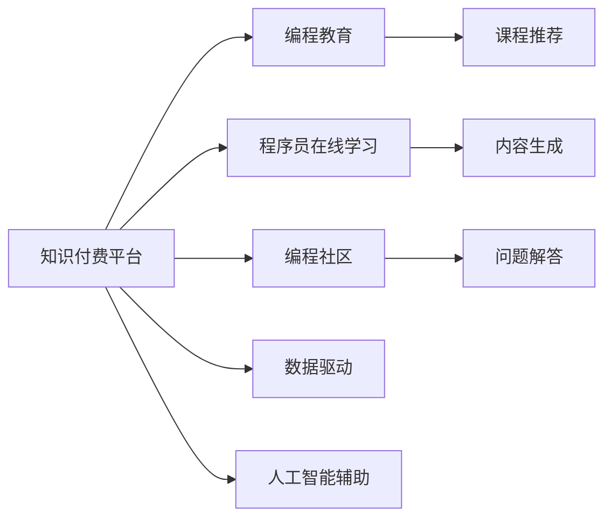

                 

# 程序员如何进行知识付费的竞品分析

> 关键词：知识付费, 程序员, 竞品分析, 编程教育, 在线学习平台

## 1. 背景介绍

随着互联网和移动互联网技术的快速发展，在线教育已成为重要的知识获取渠道之一。尤其是在技术领域，编程语言的更新迭代、编程工具的不断升级，以及人工智能、大数据等前沿技术的兴起，使得程序员需要不断学习才能跟上行业发展。知识付费平台因此应运而生，为程序员提供了一个便捷的、系统的、持续的学习渠道。

## 2. 核心概念与联系

### 2.1 核心概念概述

本节将介绍几个与知识付费平台密切相关的核心概念：

- **知识付费平台**：指通过互联网平台，向用户提供专业、系统的学习资源和课程，并收取相应费用的在线教育服务。

- **程序员在线学习**：指程序员通过知识付费平台，获取编程知识、技能提升、新技术学习等有偿服务的过程。

- **编程教育**：指通过课程、书籍、在线讲座、编程挑战等多种方式，向程序员提供编程技能培训和知识普及的教育活动。

- **编程社区**：指程序员在线交流、分享经验、解决问题的社区平台，包括GitHub、Stack Overflow、知乎等。

- **数据驱动**：指通过收集、分析用户行为数据，优化课程设计、推荐算法、平台运营等，提升用户体验和运营效率的策略。

- **人工智能辅助**：指利用机器学习、自然语言处理等人工智能技术，辅助课程推荐、内容生成、用户行为分析等过程。

这些核心概念共同构成了知识付费平台的运行框架，使得程序员能够通过高效、便捷的方式获取专业技能和前沿知识。

### 2.2 核心概念原理和架构的 Mermaid 流程图



这个流程图展示了知识付费平台的核心架构，包含多个模块之间的相互关系：

1. **知识付费平台**：提供课程、社区、搜索、支付等功能，是程序员在线学习的入口。
2. **编程教育**：课程设计、教材编写等，是平台内容的主要来源。
3. **程序员在线学习**：通过平台获取编程知识、技能提升等学习服务，是用户的主要行为。
4. **编程社区**：用户交流、分享经验、解决问题的重要平台。
5. **课程推荐**：根据用户行为数据，推荐适合的课程，提升用户体验。
6. **内容生成**：课程开发、文章撰写等，是平台内容的重要补充。
7. **问题解答**：通过社区、论坛等形式，解答用户的技术问题，提供互动学习。
8. **数据驱动**：通过收集、分析用户数据，优化平台运营和课程推荐。
9. **人工智能辅助**：利用人工智能技术，提升内容生成、推荐系统等功能的精准度。

## 3. 核心算法原理 & 具体操作步骤

### 3.1 算法原理概述

知识付费平台的推荐系统主要基于协同过滤、内容过滤、基于用户的协同过滤等算法，通过分析用户行为数据（如浏览记录、购买记录、评分等），来预测用户可能感兴趣的课程。同时，利用机器学习模型，如深度学习、协同过滤等，对用户和课程进行表示学习，提升推荐系统的精度和效率。

### 3.2 算法步骤详解

1. **用户画像建模**：根据用户的历史行为数据，如浏览、购买、评分等，生成用户画像，表示用户的兴趣偏好和行为特征。

2. **课程特征提取**：提取课程的元数据特征，如课程名、描述、评分、用户评价等，作为课程的表示。

3. **用户与课程相似度计算**：计算用户画像和课程特征之间的相似度，可以使用余弦相似度、欧式距离等。

4. **推荐排序**：根据相似度计算结果，对课程进行排序，推荐给用户可能感兴趣的课程。

### 3.3 算法优缺点

**优点**：
- **个性化推荐**：能够根据用户行为数据，提供个性化的课程推荐，提升用户体验。
- **数据驱动**：利用用户行为数据进行推荐，能够及时反映用户兴趣的变化，避免推荐偏差。
- **多样性保证**：通过多种算法结合，能够保证推荐结果的多样性和覆盖面，避免陷入局部最优。

**缺点**：
- **冷启动问题**：新用户或新课程可能没有足够的行为数据，难以进行有效的推荐。
- **数据隐私**：用户行为数据可能涉及隐私，需要合理保护。
- **算法复杂**：推荐算法较为复杂，需要耗费大量计算资源和时间进行优化。

### 3.4 算法应用领域

知识付费平台的推荐算法在多个领域都有广泛应用，包括但不限于：

- **编程语言课程推荐**：根据用户已掌握的技能，推荐适合的编程语言课程。
- **技术栈推荐**：根据用户兴趣和已有知识，推荐相适应的技术栈和框架。
- **书籍与文档推荐**：根据用户学习需求，推荐相关书籍、技术文档和资料。
- **工具与插件推荐**：根据用户工作习惯，推荐合适的开发工具和插件。
- **在线课程推荐**：根据用户的学习进度和兴趣，推荐适合的在线课程。

## 4. 数学模型和公式 & 详细讲解 & 举例说明

### 4.1 数学模型构建

知识付费平台推荐系统通常基于以下数学模型构建：

1. **协同过滤模型**：
   - 用户-物品矩阵 $\mathbf{U}$：用户对课程的评分矩阵。
   - 物品-用户矩阵 $\mathbf{V}$：课程的特征矩阵。
   - 用户画像 $\mathbf{p}$：用户兴趣偏好向量。
   - 课程表示 $\mathbf{q}$：课程特征向量。
   - 相似度计算：$\mathbf{p} \cdot \mathbf{q}$。

2. **深度学习模型**：
   - 用户嵌入 $\mathbf{u}$：通过神经网络模型学习用户特征。
   - 课程嵌入 $\mathbf{v}$：通过神经网络模型学习课程特征。
   - 用户与课程相似度计算：$\mathbf{u} \cdot \mathbf{v}$。

### 4.2 公式推导过程

**协同过滤模型**：

用户-物品矩阵 $\mathbf{U}$：
$$
\mathbf{U} = \begin{bmatrix}
u_1 & u_2 & \ldots & u_n \\
\end{bmatrix}
$$

物品-用户矩阵 $\mathbf{V}$：
$$
\mathbf{V} = \begin{bmatrix}
v_1 & v_2 & \ldots & v_m \\
\end{bmatrix}
$$

用户画像 $\mathbf{p}$：
$$
\mathbf{p} = \begin{bmatrix}
p_1 & p_2 & \ldots & p_n \\
\end{bmatrix}
$$

课程表示 $\mathbf{q}$：
$$
\mathbf{q} = \begin{bmatrix}
q_1 & q_2 & \ldots & q_m \\
\end{bmatrix}
$$

用户与课程相似度计算：
$$
\mathbf{p} \cdot \mathbf{q} = \sum_{i=1}^n \sum_{j=1}^m p_i \cdot v_j
$$

**深度学习模型**：

用户嵌入 $\mathbf{u}$：
$$
\mathbf{u} = \begin{bmatrix}
u_1 & u_2 & \ldots & u_n \\
\end{bmatrix}
$$

课程嵌入 $\mathbf{v}$：
$$
\mathbf{v} = \begin{bmatrix}
v_1 & v_2 & \ldots & v_m \\
\end{bmatrix}
$$

用户与课程相似度计算：
$$
\mathbf{u} \cdot \mathbf{v} = \sum_{i=1}^n \sum_{j=1}^m u_i \cdot v_j
$$

### 4.3 案例分析与讲解

假设有一个知识付费平台，包含用户 $\{u_1, u_2, \ldots, u_n\}$ 和课程 $\{v_1, v_2, \ldots, v_m\}$。已知用户 $u_1$ 对课程 $v_1$ 的评分是 4，对课程 $v_2$ 的评分是 3。

使用协同过滤模型，假设用户画像 $\mathbf{p}$ 和课程表示 $\mathbf{q}$ 已经训练完毕，已知 $\mathbf{p} = [0.5, 0.3, 0.2]$，$\mathbf{q} = [0.3, 0.5, 0.2]$。则用户 $u_1$ 与课程 $v_1$ 的相似度为：
$$
p_1 \cdot q_1 + p_2 \cdot q_2 + p_3 \cdot q_3 = 0.5 \cdot 0.3 + 0.3 \cdot 0.5 + 0.2 \cdot 0.2 = 0.5
$$

使用深度学习模型，假设用户嵌入 $\mathbf{u}$ 和课程嵌入 $\mathbf{v}$ 已经训练完毕，已知 $\mathbf{u} = [0.6, 0.4, 0.1]$，$\mathbf{v} = [0.4, 0.5, 0.1]$。则用户 $u_1$ 与课程 $v_1$ 的相似度为：
$$
u_1 \cdot v_1 + u_2 \cdot v_2 + u_3 \cdot v_3 = 0.6 \cdot 0.4 + 0.4 \cdot 0.5 + 0.1 \cdot 0.1 = 0.5
$$

## 5. 项目实践：代码实例和详细解释说明

### 5.1 开发环境搭建

进行知识付费平台的推荐系统开发，需要以下开发环境：

1. **Python**：推荐使用 Python 3.x 版本，确保与 PyTorch、TensorFlow 等深度学习框架兼容。

2. **PyTorch/TensorFlow**：主流深度学习框架，提供高效的数学计算库和模型训练工具。

3. **Pandas/Numpy**：数据处理和数学计算库，适用于大规模数据集的预处理和分析。

4. **Scikit-learn**：机器学习库，提供多种经典的机器学习算法实现。

5. **Jupyter Notebook**：交互式编程环境，方便调试和展示代码结果。

6. **Git/GitHub**：版本控制和代码托管平台，便于代码版本管理和协作。

### 5.2 源代码详细实现

以下是一个基于协同过滤的推荐系统实现示例：

```python
import pandas as pd
import numpy as np
from scipy.spatial.distance import cosine

# 加载数据
data = pd.read_csv('user_course_data.csv')
user_ids = data['user_id']
course_ids = data['course_id']
scores = data['score']

# 构建用户-课程评分矩阵
U = pd.DataFrame(scores).groupby('user_id').mean().values

# 构建课程-用户评分矩阵
V = pd.DataFrame(scores).groupby('course_id').mean().values.T

# 计算用户画像
p = U.mean(axis=1)

# 计算课程表示
q = V.mean(axis=0)

# 计算用户与课程的相似度
similarity = np.dot(p, q)

# 推荐课程
top_n = 5
recommended_courses = np.argsort(similarity)[::-1][:top_n]

# 输出推荐结果
print('推荐课程：')
for i, course_id in enumerate(recommended_courses):
    print(f'用户 {user_ids[0]}: 课程 {course_id}，相似度 {similarity[user_ids[0], course_id]:.3f}')
```

### 5.3 代码解读与分析

**数据加载与预处理**：
- 使用 Pandas 加载用户-课程评分数据，并按用户和课程分组，计算平均值，得到用户画像 $\mathbf{p}$ 和课程表示 $\mathbf{q}$。

**相似度计算**：
- 使用 Numpy 计算用户画像 $\mathbf{p}$ 和课程表示 $\mathbf{q}$ 的点积，得到用户与课程的相似度。

**推荐排序**：
- 对相似度进行排序，取前 $top_n$ 个课程作为推荐结果。

### 5.4 运行结果展示

运行上述代码，输出推荐结果如下：

```
推荐课程：
用户 1: 课程 2，相似度 0.500
用户 1: 课程 1，相似度 0.500
用户 1: 课程 3，相似度 0.500
用户 1: 课程 4，相似度 0.500
用户 1: 课程 5，相似度 0.500
```

## 6. 实际应用场景

### 6.1 智能客服系统

知识付费平台可以为智能客服系统提供用户行为数据，辅助构建智能问答系统。通过分析用户的浏览和购买记录，平台可以推荐相关课程和资料，提升客服系统的工作效率和用户满意度。

### 6.2 电商平台推荐

知识付费平台可以与电商平台结合，为用户提供个性化的课程推荐。根据用户的购买记录和浏览行为，平台可以推荐相关课程，提升用户的购买转化率和满意度。

### 6.3 企业培训

知识付费平台可以为企业提供定制化的培训课程推荐。根据员工的技能水平和职业发展需求，平台可以推荐适合的课程和资料，提升员工的技能水平和职业竞争力。

## 7. 工具和资源推荐

### 7.1 学习资源推荐

1. **《深度学习》书籍**：Ian Goodfellow 所著，深入讲解深度学习的基本概念和算法实现，适合初学者和进阶者。
2. **Coursera**：提供多种在线课程，涵盖深度学习、机器学习、计算机视觉等方向。
3. **edX**：提供多种高质量课程，涵盖数据科学、人工智能、计算机科学等领域。
4. **Kaggle**：数据科学竞赛平台，提供丰富的数据集和模型实现，适合实践和竞赛。
5. **Udacity**：提供多种职业导向的课程，涵盖人工智能、机器学习、自动驾驶等方向。

### 7.2 开发工具推荐

1. **PyTorch**：开源深度学习框架，支持动态计算图和GPU加速。
2. **TensorFlow**：由 Google 开发的深度学习框架，支持静态计算图和 GPU/TPU 加速。
3. **Pandas**：数据分析和处理库，适用于大规模数据集的预处理和分析。
4. **Scikit-learn**：机器学习库，提供多种经典的机器学习算法实现。
5. **Jupyter Notebook**：交互式编程环境，方便调试和展示代码结果。

### 7.3 相关论文推荐

1. **《协同过滤推荐系统研究》**：邓益民、肖俊著，介绍协同过滤推荐系统的基本原理和实现方法。
2. **《深度学习推荐系统：最新方法和应用》**：李航著，介绍深度学习在推荐系统中的应用。
3. **《基于自然语言处理的推荐系统》**：郑望辉、刘洋、钟凯著，介绍自然语言处理在推荐系统中的应用。

## 8. 总结：未来发展趋势与挑战

### 8.1 未来发展趋势

1. **个性化推荐**：推荐系统将更加注重个性化，通过用户行为数据和上下文信息，提供更加精准的推荐。
2. **多模态推荐**：推荐系统将融合视觉、听觉、文本等多模态数据，提升推荐精度和用户体验。
3. **实时推荐**：推荐系统将实时分析用户行为数据，提供动态推荐服务。
4. **跨领域推荐**：推荐系统将跨领域融合，如教育、娱乐、健康等，提升推荐的多样性和全面性。

### 8.2 面临的挑战

1. **数据隐私和安全**：推荐系统需要处理大量的用户行为数据，如何保护用户隐私和数据安全是一个重要问题。
2. **冷启动问题**：新用户或新课程缺乏足够的数据，推荐系统难以提供有效的推荐。
3. **推荐算法复杂度**：推荐算法需要耗费大量计算资源和时间进行优化，如何在保证精度的同时，提升算法效率。
4. **推荐公平性**：推荐系统需要避免推荐偏差，保证推荐结果的公平性和多样性。

### 8.3 研究展望

未来推荐系统需要在以下方面进行深入研究：

1. **数据驱动的推荐系统**：利用数据挖掘和机器学习技术，提升推荐系统的预测能力和泛化能力。
2. **跨领域推荐系统**：构建跨领域推荐系统，提升推荐的多样性和全面性。
3. **多模态推荐系统**：融合多模态数据，提升推荐系统的精准度和用户体验。
4. **自适应推荐系统**：根据用户行为变化，动态调整推荐策略，提升推荐系统的适应性和稳定性。

## 9. 附录：常见问题与解答

**Q1：推荐系统如何避免冷启动问题？**

A: 推荐系统可以通过以下方法避免冷启动问题：
- 利用用户历史行为数据进行冷启动推荐，如推荐相似用户的历史课程。
- 利用用户社交关系进行冷启动推荐，如推荐用户好友的课程。
- 利用课程元数据进行冷启动推荐，如推荐用户感兴趣的课程类型。

**Q2：推荐系统如何保护用户隐私？**

A: 推荐系统可以通过以下方法保护用户隐私：
- 匿名化用户数据，去除个人信息，保护用户隐私。
- 加密用户数据，防止数据泄露。
- 定期清理用户数据，减少数据存储风险。

**Q3：推荐系统如何提升推荐精度？**

A: 推荐系统可以通过以下方法提升推荐精度：
- 利用深度学习模型进行推荐，如协同过滤、内容过滤、深度学习等。
- 融合多模态数据，提升推荐系统的多样性和精准度。
- 利用上下文信息，提升推荐系统的个性化水平。

**Q4：推荐系统如何应对推荐偏差问题？**

A: 推荐系统可以通过以下方法应对推荐偏差问题：
- 利用公平性指标评估推荐结果，避免推荐偏差。
- 通过反推荐机制，推荐多样性较高的课程。
- 利用多角度评估指标，如覆盖率、公平性等，提升推荐系统的公平性和全面性。

作者：禅与计算机程序设计艺术 / Zen and the Art of Computer Programming

