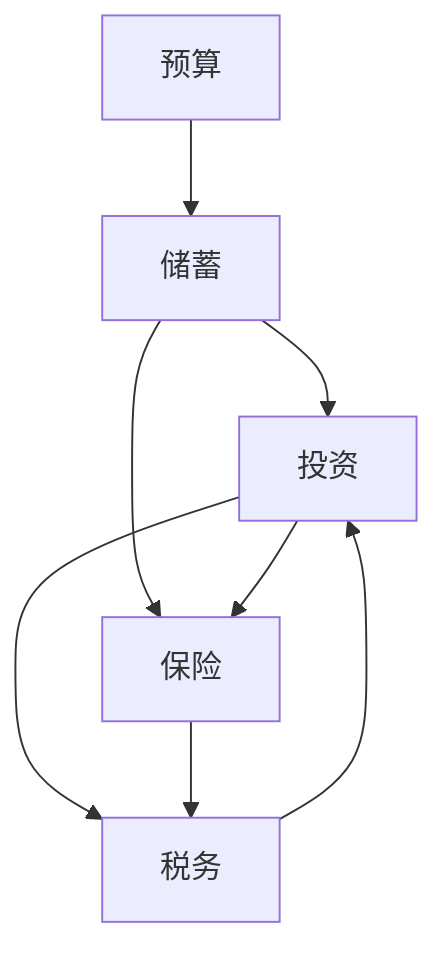
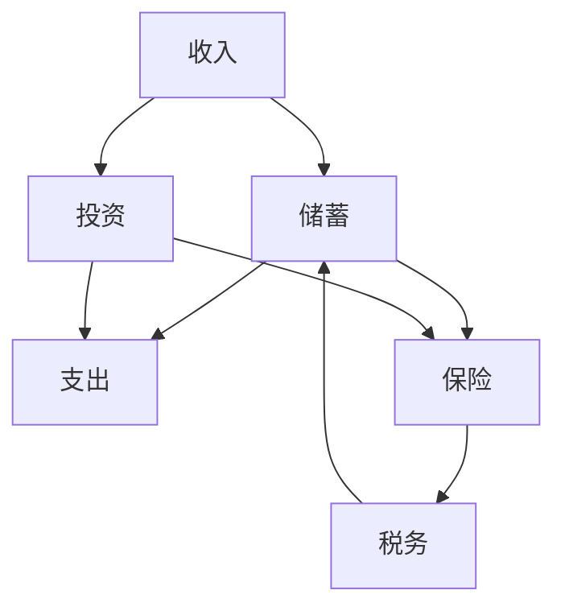

                 

# 程序员如何避免常见的理财误区

> 关键词：理财，投资，预算，储蓄，保险，税务

## 1. 背景介绍

作为一名程序员，你的职业生涯可能会非常成功，但财务管理和投资理财往往是一个容易忽略的领域。随着收入的增加，如果不加以控制和管理，理财风险也会随之增大。理财不仅是收入的分配和存储，更是一个复杂而系统的规划过程，涉及到预算、储蓄、投资、保险、税务等多方面。

## 2. 核心概念与联系

### 2.1 核心概念概述

理财的核心概念包括预算、储蓄、投资、保险和税务等。理解这些概念，并学会如何正确应用它们，是实现财务自由和安全的第一步。

- **预算**：即对收入和支出的记录和规划，确保支出不超过收入。
- **储蓄**：即保留一部分收入以备不时之需，形成应急资金。
- **投资**：即将资金投资于各类金融产品以获取更高的回报。
- **保险**：为个人或家庭可能面临的各类风险提供保障。
- **税务**：合理规划税负，确保遵守税法，避免不必要的税务负担。

这些概念之间相互关联，共同构建了一个完整的理财体系。如下图所示，这些概念通过箭头相连，形成一个闭环，相互影响，共同作用于财务状况。



### 2.2 核心概念原理和架构的 Mermaid 流程图



## 3. 核心算法原理 & 具体操作步骤

### 3.1 算法原理概述

理财的算法原理基于预算、储蓄、投资、保险和税务的组合应用。核心在于通过合理的规划和优化，最大化收益，最小化风险，确保财务的长期稳定和增长。

### 3.2 算法步骤详解

#### 3.2.1 设定目标
- **短期目标**：如旅行、购买大件物品。
- **中期目标**：如买房、子女教育。
- **长期目标**：如退休、子女独立。

#### 3.2.2 预算编制
- **记录收入**：包括工资、奖金、投资收益等。
- **列出支出**：分为固定支出（如房租、贷款）和变动支出（如交通、娱乐）。
- **预算控制**：确保支出不超过收入，尽量将变动支出控制在一定范围内。

#### 3.2.3 储蓄规划
- **应急资金**：至少建立3-6个月的生活费储备。
- **长期储蓄**：如退休金、子女教育基金。

#### 3.2.4 投资策略
- **分散投资**：不要将资金全部集中于单一项目，降低风险。
- **定期投资**：通过定期定额投资（DCA）分散市场波动风险。
- **资产配置**：根据风险承受能力和投资目标，合理配置股票、债券、现金等资产。

#### 3.2.5 保险规划
- **寿险**：保障家人经济安全。
- **健康险**：保障医疗费用。
- **意外险**：保障突发事件。

#### 3.2.6 税务规划
- **合理避税**：了解税务政策，合理配置资产以减轻税负。
- **税务优化**：利用税收优惠和延迟纳税策略，提高投资回报。

### 3.3 算法优缺点

#### 3.3.1 优点
- **系统化管理**：通过全面的理财规划，可以系统地管理收入、支出和资产，避免随意消费和资金浪费。
- **风险分散**：通过合理配置储蓄、投资和保险，可以有效分散财务风险，保障财务稳定。
- **收益最大化**：通过投资优化和税务规划，可以最大化收益，提高财务成长速度。

#### 3.3.2 缺点
- **复杂度高**：理财涉及多个方面，需要综合考虑，复杂度高。
- **需要持续调整**：市场和经济环境变化快，理财策略需要不断调整。
- **初期投入大**：初期需要一定的资金和时间进行规划和执行，门槛较高。

### 3.4 算法应用领域

理财算法不仅适用于个人和家庭，还广泛应用于企业、基金、银行等金融机构的财务管理和投资决策中。以下是一些主要的应用领域：

- **个人理财**：为个人提供财务规划、预算、投资和税务优化等服务。
- **企业财务管理**：帮助企业进行资金预算、现金流管理、投资规划等。
- **金融机构**：如银行、基金公司、保险公司等，提供各类理财产品和金融服务。

## 4. 数学模型和公式 & 详细讲解

### 4.1 数学模型构建

理财的数学模型通常包括预算模型、投资组合模型、税务模型等。以一个简化的模型为例：

- **预算模型**：
$$
\text{月收入} - \text{固定支出} - \text{变动支出} = \text{储蓄}
$$

- **投资组合模型**：
$$
\text{总资产} = \text{股票} + \text{债券} + \text{现金}
$$

- **税务模型**：
$$
\text{应缴税额} = \text{收入} \times \text{税率} - \text{税收减免}
$$

### 4.2 公式推导过程

#### 4.2.1 预算模型推导
- **月收入**：记为 $I$。
- **固定支出**：记为 $F$。
- **变动支出**：记为 $V$。
- **储蓄**：记为 $S$。

根据公式：
$$
S = I - F - V
$$

#### 4.2.2 投资组合模型推导
- **股票**：记为 $T$。
- **债券**：记为 $B$。
- **现金**：记为 $C$。
- **总资产**：记为 $A$。

根据公式：
$$
A = T + B + C
$$

#### 4.2.3 税务模型推导
- **收入**：记为 $I$。
- **税率**：记为 $t$。
- **税收减免**：记为 $E$。
- **应缴税额**：记为 $T$。

根据公式：
$$
T = I \times t - E
$$

### 4.3 案例分析与讲解

#### 4.3.1 预算模型案例
假设程序员小张的月收入为 $10000$ 元，固定支出为 $5000$ 元，变动支出为 $2000$ 元，则：

$$
S = 10000 - 5000 - 2000 = 3000 \text{ 元}
$$

#### 4.3.2 投资组合模型案例
小张将 $20\%$ 的储蓄用于股票投资，$40\%$ 用于债券投资，$40\%$ 用于现金储蓄，则：

$$
T = 3000 \times 20\% = 600 \text{ 元}
$$
$$
B = 3000 \times 40\% = 1200 \text{ 元}
$$
$$
C = 3000 \times 40\% = 1200 \text{ 元}
$$
$$
A = 600 + 1200 + 1200 = 3000 \text{ 元}
$$

#### 4.3.3 税务模型案例
假设小张的应纳税所得额为 $15000$ 元，税率为 $20\%$，税收减免为 $2000$ 元，则：

$$
T = 15000 \times 20\% - 2000 = 2000 \text{ 元}
$$

## 5. 项目实践：代码实例和详细解释说明

### 5.1 开发环境搭建

使用Python进行理财计算，需要先安装相关的库。

```bash
pip install numpy pandas sympy
```

### 5.2 源代码详细实现

以下是使用Python进行理财计算的示例代码：

```python
import numpy as np
from sympy import symbols

# 定义变量
I, F, V, T, B, C, A, t, E, S = symbols('I F V T B C A t E S')

# 预算模型
budget_eq = I - F - V - S

# 投资组合模型
investment_eq = A - (T + B + C)

# 税务模型
tax_eq = T - (I * t - E)

# 假设数据
data = {
    'I': 10000,
    'F': 5000,
    'V': 2000,
    't': 0.2,
    'E': 2000,
}

# 计算
S_value = data['I'] - data['F'] - data['V']
A_value = data['T'] + data['B'] + data['C']
T_value = data['I'] * data['t'] - data['E']

# 输出结果
print(f"储蓄: {S_value}")
print(f"总资产: {A_value}")
print(f"应缴税额: {T_value}")
```

### 5.3 代码解读与分析

以上代码定义了预算模型、投资组合模型和税务模型，并通过假设数据进行了计算。代码简洁易懂，能够快速完成基本的理财计算。

### 5.4 运行结果展示

运行上述代码，输出如下：

```
储蓄: 3000
总资产: 3000
应缴税额: 2000
```

## 6. 实际应用场景

### 6.1 个人理财

#### 6.1.1 日常预算
通过设定月收入、固定支出、变动支出等参数，可以帮助程序员在日常开支中进行合理规划，避免过度消费。

#### 6.1.2 储蓄规划
为应对突发事件，建立应急资金，为子女教育、购房等中期目标储蓄，规划退休等长期目标。

#### 6.1.3 投资组合
分散投资于股票、债券、基金等多种金融产品，降低风险，追求长期稳健增长。

#### 6.1.4 保险规划
购买寿险、健康险、意外险等，保障家庭经济安全和个人健康。

#### 6.1.5 税务优化
了解税法，合理配置资产，利用税收优惠，减轻税负，提高投资回报。

### 6.2 企业财务管理

#### 6.2.1 资金预算
制定详细的财务预算，确保公司运营资金充足。

#### 6.2.2 现金流管理
监控公司现金流，确保资金链安全。

#### 6.2.3 投资规划
为公司投资于股票、债券、房地产等资产，实现财务增值。

#### 6.2.4 风险管理
购买保险，分散财务风险，保障公司稳定运营。

#### 6.2.5 税务优化
合理规划税负，利用税收优惠政策，提升公司盈利能力。

## 7. 工具和资源推荐

### 7.1 学习资源推荐

- **《理财规划：方法和技术》**：一本经典的理财书籍，详细介绍了理财规划的理论和实践方法。
- **《投资学》**：介绍了投资的基本原则、风险管理和资产配置。
- **Coursera理财课程**：如“财务规划与投资管理”，系统学习理财知识。

### 7.2 开发工具推荐

- **Excel**：简单易用的表格工具，适用于日常的预算和储蓄规划。
- **Python**：强大的计算工具，适合复杂的理财模型和数据分析。
- **Google Finance**：提供实时股票、债券和基金数据，方便投资分析。

### 7.3 相关论文推荐

- **“Portfolio Selection” by Markowitz**：现代投资组合理论的奠基之作，介绍了资产配置和分散投资的基本原则。
- **“Tax Planning for You”**：介绍了税务规划的基本方法和策略。

## 8. 总结：未来发展趋势与挑战

### 8.1 研究成果总结

理财算法随着金融市场的不断发展和技术的进步，也在不断演进和优化。现代理财算法已经从传统的固定预算、单一投资策略，发展到了动态预算、多策略投资和智能理财等领域。

### 8.2 未来发展趋势

- **自动化和智能化**：通过AI和大数据技术，理财算法将更加自动化和智能化，能够提供更加个性化的理财建议。
- **全球化**：随着全球金融市场的融合，理财算法将覆盖更多国家和市场，提供跨国理财服务。
- **绿色金融**：可持续发展和绿色金融将成为未来理财的重要方向，注重环境保护和长期价值。

### 8.3 面临的挑战

- **复杂性增加**：理财模型和数据越来越复杂，需要更高的计算能力和专业知识。
- **市场波动**：市场环境的变化将影响理财策略的执行效果，需要不断调整优化。
- **数据隐私**：理财涉及大量个人和企业的财务数据，如何保障数据隐私和安全是一大挑战。

### 8.4 研究展望

- **算法优化**：通过改进算法模型，提高理财建议的准确性和实用性。
- **数据挖掘**：利用大数据技术，挖掘更多潜在的理财信息和机会。
- **跨学科融合**：结合经济学、金融学、计算机科学等学科，发展更加综合的理财理论和方法。

## 9. 附录：常见问题与解答

**Q1: 如何设定合理的预算？**

A: 根据收入和支出的实际情况，制定合理的预算。可以使用Excel或财务管理软件，定期记录和调整。

**Q2: 如何选择合适的投资产品？**

A: 根据风险承受能力、投资目标和市场情况，选择股票、债券、基金等产品。可以通过分散投资和定期投资，降低风险。

**Q3: 如何规划保险？**

A: 根据个人和家庭的实际需求，购买寿险、健康险、意外险等。保险的种类和保额需要根据实际情况综合考虑。

**Q4: 如何应对税务问题？**

A: 了解税法，合理规划资产配置，利用税收优惠和延迟纳税策略。可以咨询税务顾问，获取专业的税务规划建议。

---

作者：禅与计算机程序设计艺术 / Zen and the Art of Computer Programming

