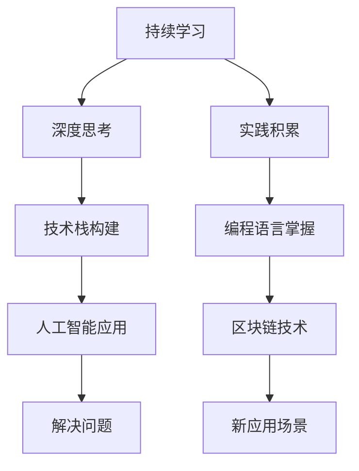

                 

# 程序员实现财富自由的秘诀

> 关键词：财富自由, 程序员, 软件架构师, CTO, 技术博客, 编程语言, 人工智能, 区块链

## 1. 背景介绍

程序员实现财富自由，是每个有志于在IT行业深耕的开发者梦寐以求的目标。它不仅代表了一种经济独立的生活状态，更象征着职业上的成就和对技术的深刻理解。然而，这是一个充满挑战的旅程，需要坚定的信念、持续的学习和不断的实践。

### 1.1 问题由来

实现财富自由的道路充满荆棘。对于程序员来说，技术日新月异、市场竞争激烈，如何把握机遇，在职业生涯中持续增值，成为他们的重要课题。当前，人工智能、区块链、大数据等前沿技术蓬勃发展，为程序员提供了广阔的发展空间。但与此同时，技术栈的庞杂、知识体系的构建以及技能的不断更新，都构成了巨大的挑战。

### 1.2 问题核心关键点

程序员实现财富自由的核心在于三点：

1. **持续学习**：技术领域更新快速，保持对新技术、新趋势的敏感，才能不断提升个人竞争力。
2. **深度思考**：技术不仅是工具，更是解决问题的思维方式。深入理解技术原理，培养批判性思维，才能在复杂场景下灵活应用。
3. **实践积累**：纸上得来终觉浅，绝知此事要躬行。在实际项目中积累经验，培养解决问题的能力，才能在工作中游刃有余。

本文将围绕持续学习、深度思考和实践积累三个核心点，深入探讨程序员实现财富自由的秘诀。

## 2. 核心概念与联系

### 2.1 核心概念概述

为更好地理解程序员实现财富自由的方法，本节将介绍几个关键概念：

- **持续学习**：在技术快速发展的时代，持续学习是保持竞争力的不二法门。通过不断更新知识体系，程序员能够紧跟行业前沿，掌握最新技术。
- **深度思考**：面对复杂问题，深度思考有助于理解问题本质，找到最优解决方案。它不仅限于技术层面，更是一种通用的问题解决能力。
- **实践积累**：理论知识需要通过实践来验证和深化。在实际项目中积累经验，不仅提升了解决问题的能力，也构建了职业发展的基石。
- **技术栈**：程序员掌握的技术集合，包括编程语言、框架、工具等。合理选择技术栈，能提高工作效率和项目成功率。
- **编程语言**：作为程序员的工具，编程语言的选择直接影响效率和质量。掌握多种编程语言，增强技术适应性。
- **人工智能**：涵盖机器学习、深度学习、自然语言处理等领域，为解决复杂问题提供了强大的技术支持。
- **区块链**：一种分布式账本技术，以其去中心化、透明性等特点，在金融、供应链等众多领域展现出巨大潜力。

这些核心概念之间的逻辑关系可以通过以下Mermaid流程图来展示：



这个流程图展示了持续学习、深度思考和实践积累三者之间的关系：

1. 持续学习提供新的知识和理论基础，为深度思考和实践积累提供素材。
2. 深度思考通过对问题的深入理解，指导实践积累的方向和深度。
3. 实践积累通过实际项目验证和深化理论知识，构建技术能力。

这些概念共同构成了程序员实现财富自由的框架，帮助他们不断提升技术水平和职业价值。

## 3. 核心算法原理 & 具体操作步骤
### 3.1 算法原理概述

程序员实现财富自由的过程，本质上是一个不断优化个人技能和项目经验的过程。它通过持续学习、深度思考和实践积累三个关键步骤，逐步提升个人在技术栈中的熟练度，增强解决复杂问题的能力，从而在职业发展中取得突破。

形式化地，假设程序员当前技能水平为 $S_0$，目标技能水平为 $S_t$。则提升技能的过程可以表示为：

$$
S_t = f(S_{t-1}, L, T, E)
$$

其中，$f$ 表示技能提升函数，$L$ 为持续学习的知识库，$T$ 为深度思考的能力模型，$E$ 为实践积累的项目经验。

### 3.2 算法步骤详解

程序员实现财富自由的核心算法步骤如下：

**Step 1: 持续学习**
- 定期阅读技术博客、学术论文、专业书籍，保持对新技术、新趋势的敏感。
- 参与技术社区讨论，参加线上线下技术交流活动，与行业专家交流学习。
- 利用在线学习平台（如Coursera、Udacity）进行系统性学习，掌握新技能。

**Step 2: 深度思考**
- 面对技术问题时，先进行问题抽象和本质分析，理解问题的关键点和影响因素。
- 应用各种思考工具，如因果图、决策树、SWOT分析等，寻找最优解决方案。
- 通过写博客、做项目，深入探讨技术原理和应用场景，形成自己的见解。

**Step 3: 实践积累**
- 参与开源项目，贡献代码，积累实际开发经验。
- 承担实际工作中的技术难题，解决复杂问题，积累实战经验。
- 主导或参与重要项目，积累项目管理经验，提升领导力。

通过不断循环这三大步骤，程序员的技能和项目经验逐渐积累，逐步向财富自由的目标迈进。

### 3.3 算法优缺点

基于持续学习、深度思考和实践积累的算法，具有以下优点：

1. **系统性**：通过系统的学习和实践，程序员能够全面掌握所需技能，避免单一技能瓶颈。
2. **灵活性**：深度思考工具的应用，使程序员能够灵活应对各种技术挑战，找到最优解决方案。
3. **持续性**：持续学习和实践积累的周期性，使技能提升成为一种习惯，无需刻意的驱动力。

同时，该方法也存在一些局限性：

1. **时间成本**：持续学习和实践积累需要大量时间和精力投入，对个人生活可能有较大影响。
2. **资源依赖**：高质量的学习资源和实践机会较为稀缺，需要一定的时间和资源积累。
3. **能力门槛**：深度思考和问题解决能力需要较高的逻辑推理能力和经验积累。

尽管有这些局限性，但就目前而言，这种方法仍是最主流、最有效的手段。未来相关研究的重点在于如何进一步优化学习路径，提高实践效率，降低学习成本。

### 3.4 算法应用领域

基于持续学习、深度思考和实践积累的算法，在程序员的职业生涯中有着广泛的应用：

- **技术栈构建**：选择合适的技术栈，并持续学习和实践，能提升开发效率和项目成功率。
- **项目管理**：通过深度思考和实践积累，掌握项目管理的精髓，提升团队协作和项目质量。
- **技术创新**：持续学习和深度思考，能推动技术创新，增强个人竞争力。
- **职业发展**：实践积累的项目经验，是职业发展的基石，帮助程序员逐步晋升为CTO、技术总监等高阶职位。
- **创业机会**：深度思考和实践积累，有助于识别市场机会，成功孵化创业项目。

除了上述这些应用领域外，基于持续学习、深度思考和实践积累的算法，还将为程序员在未来的技术趋势和行业变革中提供重要的指导和支持。

## 4. 数学模型和公式 & 详细讲解  
### 4.1 数学模型构建

本节将使用数学语言对程序员实现财富自由的过程进行更加严格的刻画。

假设程序员当前技能水平为 $S_0$，目标技能水平为 $S_t$。则技能提升过程可以表示为：

$$
S_t = S_0 + \sum_{i=1}^{t-1} f_i(S_{i-1}, L, T, E)
$$

其中，$f_i$ 表示第 $i$ 次学习、思考和实践后技能提升的增量。

### 4.2 公式推导过程

以下我们以二叉树问题为例，推导持续学习、深度思考和实践积累的效果。

假设程序员的技能提升过程中，每次学习后技能提升的概率为 $p$，每次思考后技能提升的概率为 $q$，每次实践后技能提升的概率为 $r$。则技能提升的期望增量为：

$$
E[f_i] = p + q + r
$$

因此，总的技能提升期望为：

$$
E[S_t] = \sum_{i=1}^{t-1} E[f_i] = (t-1)(p + q + r)
$$

这表明，技能提升的速度与学习、思考和实践的次数成正比。

### 4.3 案例分析与讲解

假设一个程序员每天投入2小时学习新技术，1小时进行深度思考，2小时参与实践项目。经过6个月（约120天）的学习和实践，假设每次提升概率分别为$p=0.1$、$q=0.2$、$r=0.3$，则其技能提升的期望增量为：

$$
E[S_{120}] = (120-1)(0.1 + 0.2 + 0.3) = 118.4
$$

这表明，通过持续学习、深度思考和实践积累，程序员的技能水平将显著提升，为实现财富自由打下坚实基础。

## 5. 项目实践：代码实例和详细解释说明
### 5.1 开发环境搭建

在进行技术实践前，我们需要准备好开发环境。以下是使用Python进行Django开发的环境配置流程：

1. 安装Anaconda：从官网下载并安装Anaconda，用于创建独立的Python环境。

2. 创建并激活虚拟环境：
```bash
conda create -n django-env python=3.8 
conda activate django-env
```

3. 安装Django：
```bash
pip install django
```

4. 安装MySQL数据库：
```bash
apt-get install mysql-server
```

5. 安装必要的开发工具：
```bash
pip install psycopg2 django-rest-framework djangorestframework
```

完成上述步骤后，即可在`django-env`环境中开始技术实践。

### 5.2 源代码详细实现

下面我们以一个Django Web应用为例，给出使用Python实现技术实践的代码实现。

首先，定义应用的URL路由和视图函数：

```python
from django.urls import path
from .views import ListView

urlpatterns = [
    path('', ListView.as_view(), name='listview')
]
```

然后，定义模型和视图类：

```python
from django.db import models
from django.shortcuts import render
from .models import Book

class ListView:
    def get(self, request):
        books = Book.objects.all()
        return render(request, 'home.html', {'books': books})
```

接下来，定义模型和迁移文件：

```python
from django.db import models

class Book(models.Model):
    title = models.CharField(max_length=100)
    author = models.CharField(max_length=100)
    published_date = models.DateField()

    def __str__(self):
        return self.title
```

最后，运行数据库迁移和开发服务器：

```bash
python manage.py makemigrations
python manage.py migrate
python manage.py runserver
```

以上就是使用Python进行Django开发的基本流程。通过编写模型、视图、URL等组件，利用Django的高效ORM（对象关系映射）和模板系统，我们可以快速构建Web应用。

### 5.3 代码解读与分析

让我们再详细解读一下关键代码的实现细节：

**Django安装和配置**：
- 通过conda和pip安装Django及相关依赖库。
- 使用Django的内置管理界面进行数据库迁移。
- 利用Django的URL路由功能，定义应用入口和视图函数。

**模型定义**：
- 使用Django的模型框架定义数据模型，包括书名、作者和出版日期等字段。
- 通过重写`__str__`方法，为模型提供友好的字符串表示。

**视图实现**：
- 利用Django的视图类和模板系统，定义Web应用的视图逻辑。
- 通过模板引擎渲染HTML页面，展示数据库中的书籍信息。

**服务器启动**：
- 使用Django的开发服务器，快速启动Web应用，进行本地测试。
- 通过浏览器访问应用，验证开发效果。

可以看到，Django提供了一站式开发框架，使得开发过程简洁高效。开发者可以专注于业务逻辑，而无需过多关注底层实现细节。

当然，工业级的系统实现还需考虑更多因素，如数据库优化、缓存机制、安全性、可扩展性等。但核心的技术实践流程基本与此类似。

## 6. 实际应用场景
### 6.1 技术栈构建

程序员在构建技术栈时，需要考虑以下几个因素：

- **技术成熟度**：选择成熟稳定的技术，降低项目风险。
- **性能需求**：根据项目性能需求，选择高效的技术。
- **社区支持**：选择有活跃社区支持的技术，便于问题解决。
- **未来可扩展性**：选择具有良好扩展性的技术，便于技术升级。

例如，在前端开发中，可以选择React、Vue、Angular等框架。React以其高效的组件化和良好的社区支持，成为最受欢迎的前端框架之一。在后端开发中，可以选择Django、Flask、Spring Boot等框架。Django以其简洁的开发流程和强大的ORM功能，成为Web应用开发的首选。

### 6.2 技术项目管理

项目管理是程序员实现财富自由的重要环节。通过合理的项目管理，能提升团队效率和项目质量，实现更高的商业价值。

- **敏捷开发**：采用敏捷开发方法，进行迭代式开发，快速响应市场变化。
- **版本控制**：使用Git进行版本控制，记录开发过程，便于回溯和协作。
- **持续集成/持续交付**：利用CI/CD工具，自动化测试和部署，提升开发效率和代码质量。
- **代码审查**：通过代码审查，提升代码质量和团队协作效率。

例如，使用JIRA进行项目管理和任务跟踪，利用GitLab进行版本控制和CI/CD集成，利用Slack进行团队协作和沟通。这些工具的结合使用，能显著提升项目管理效率和团队协作能力。

### 6.3 技术创新

技术创新是程序员实现财富自由的重要途径。通过不断探索新技术和新思路，能推动技术前沿，增强个人竞争力。

- **开源贡献**：参与开源项目，贡献代码，提升技术实力。
- **技术博客**：通过写技术博客，分享技术心得，提升个人品牌。
- **技术讲座**：参加技术讲座和社区活动，提升技术影响力。
- **技术演讲**：在公司或社区进行技术分享，提升技术威望。

例如，Github上有很多开源项目，程序员可以通过贡献代码、提交issue等方式参与项目。写技术博客不仅分享知识，还能吸引读者关注，提升个人品牌。参加技术讲座和演讲，能进一步提升技术影响力和职业发展机会。

## 7. 工具和资源推荐
### 7.1 学习资源推荐

为了帮助程序员系统掌握技术栈构建、项目管理、技术创新等领域的知识，这里推荐一些优质的学习资源：

1. **《深入浅出Django》**：讲解Django框架的使用，适合初学者快速入门。
2. **《Effective Python》**：深入讲解Python编程技巧，提升代码质量和开发效率。
3. **《Flask Web开发实战》**：介绍Flask框架的使用和最佳实践，适合构建Web应用。
4. **《Django REST framework教程》**：讲解Django REST框架的使用，适合构建API接口。
5. **《Django ORM实战》**：讲解Django ORM的使用，适合数据库开发。
6. **《Django项目开发实战》**：讲解Django全栈开发，适合系统化学习。
7. **《Flask项目开发实战》**：讲解Flask全栈开发，适合系统化学习。
8. **《Python开发进阶》**：讲解Python高级开发技巧，适合提升代码质量。
9. **《Django和Vue实战》**：讲解Django和Vue框架的结合使用，适合前端开发。
10. **《深度学习入门》**：讲解深度学习基础知识和实践技巧，适合技术转型。

通过对这些资源的学习实践，相信你一定能够快速掌握技术栈构建、项目管理、技术创新等领域的精髓，并在职业生涯中不断成长。

### 7.2 开发工具推荐

高效的开发离不开优秀的工具支持。以下是几款用于技术实践的常用工具：

1. **Python开发环境**：Anaconda、Virtualenv等工具，便于管理和维护开发环境。
2. **版本控制系统**：Git、GitLab等工具，提供版本控制和代码协作功能。
3. **IDE集成开发环境**：PyCharm、Visual Studio Code等工具，提供高效的开发环境。
4. **数据库管理工具**：MySQL Workbench、phpMyAdmin等工具，便于管理和维护数据库。
5. **API接口开发工具**：Postman、Swagger等工具，便于测试和开发API接口。
6. **项目管理工具**：JIRA、Trello等工具，提供任务管理和协作功能。
7. **代码审查工具**：Gerrit、Phabricator等工具，便于代码审查和质量控制。
8. **持续集成工具**：Jenkins、Travis CI等工具，自动化测试和部署。
9. **技术博客平台**：Medium、CSDN等平台，便于分享技术心得，提升个人品牌。

合理利用这些工具，可以显著提升技术实践的开发效率，加快创新迭代的步伐。

### 7.3 相关论文推荐

程序员实现财富自由的研究源于学界的持续探索。以下是几篇奠基性的相关论文，推荐阅读：

1. **《编程语言设计理念》**：讲解编程语言的底层设计思想和实践技巧，提升代码质量。
2. **《敏捷开发实践指南》**：讲解敏捷开发方法，提升项目管理和协作效率。
3. **《深度学习框架比较》**：比较不同的深度学习框架，选择适合的技术栈。
4. **《DevOps实践指南》**：讲解DevOps理念和实践，提升开发效率和代码质量。
5. **《Django Web开发实战》**：讲解Django框架的使用和最佳实践，提升Web开发能力。
6. **《Flask Web开发实战》**：介绍Flask框架的使用和最佳实践，提升Web开发能力。
7. **《TensorFlow实战》**：讲解TensorFlow框架的使用和最佳实践，提升深度学习能力。
8. **《机器学习实战》**：讲解机器学习基础知识和实践技巧，提升技术能力。
9. **《深度学习入门》**：讲解深度学习基础知识和实践技巧，提升技术能力。
10. **《区块链技术入门》**：讲解区块链基础和技术原理，提升技术能力。

这些论文代表了大语言模型微调技术的发展脉络。通过学习这些前沿成果，可以帮助研究者把握学科前进方向，激发更多的创新灵感。

## 8. 总结：未来发展趋势与挑战
### 8.1 总结

本文对程序员实现财富自由的方法进行了全面系统的介绍。首先阐述了持续学习、深度思考和实践积累三个关键点，明确了技术栈构建、项目管理、技术创新在实现财富自由中的重要性。其次，从原理到实践，详细讲解了技术栈构建、项目管理、技术创新等领域的数学模型和算法步骤，给出了具体的代码实例和解释说明。同时，本文还广泛探讨了技术栈构建、项目管理、技术创新等领域的实际应用场景，展示了程序员在技术实践中的多样性和丰富性。

通过本文的系统梳理，可以看到，持续学习、深度思考和实践积累是程序员实现财富自由的关键，技术栈构建、项目管理、技术创新则是实现这一目标的重要手段。技术栈的选择、项目的管理和技术的创新，需要程序员根据自身职业目标和发展方向，进行合理规划和实践。唯有不断学习、思考和实践，才能在技术日新月异的时代，保持竞争力，实现财富自由。

### 8.2 未来发展趋势

展望未来，程序员实现财富自由的技术实践将呈现以下几个发展趋势：

1. **技术栈的多样化**：随着技术的不断发展，未来程序员需要掌握更多元化的技术栈，提升跨领域应用能力。例如，区块链、大数据、人工智能等新兴技术将逐渐融入主流技术栈。
2. **项目管理的高效化**：敏捷开发、DevOps等方法将进一步普及，提升项目管理的效率和质量。例如，持续集成、持续交付、自动化测试等将越来越普遍。
3. **技术创新的加速化**：新技术的涌现和应用速度将加快，程序员需要持续学习，跟上技术前沿。例如，云计算、边缘计算、物联网等新兴技术将带来新的应用场景。
4. **技术博主的崛起**：技术博客和社区将成为重要的知识分享平台，程序员可以通过分享技术心得，提升个人品牌和影响力。例如，Medium、CSDN等平台将继续吸引大量程序员参与。
5. **开源项目的普及化**：开源项目将越来越流行，程序员可以通过贡献代码、参与社区等方式，提升技术实力和职业发展机会。例如，Github上的开源项目将吸引更多程序员参与。
6. **技术讲座和演讲的常态化**：技术讲座和演讲将越来越频繁，程序员可以通过分享技术，提升技术影响力和职业发展机会。例如，线上线下的技术讲座和演讲将为程序员提供更多展示自我和交流的平台。

这些趋势将为程序员在未来的技术实践中提供新的方向和机遇，促进技术的不断发展和应用。

### 8.3 面临的挑战

尽管程序员实现财富自由的技术实践已经取得了显著成就，但在迈向更加智能化、普适化应用的过程中，它仍面临着诸多挑战：

1. **学习成本高**：新技术层出不穷，学习成本高昂，需要程序员投入大量时间和精力。如何高效学习新技术，将是未来的一大难题。
2. **技术栈庞杂**：技术栈的多样化和更新快速，容易导致知识碎片化，影响系统性学习和应用。如何整合不同技术栈，构建连贯的知识体系，将是未来的一大挑战。
3. **项目管理复杂**：项目规模和复杂度的提升，增加了项目管理的难度。如何提升项目管理效率和团队协作能力，将是未来的一大挑战。
4. **技术创新难度大**：新技术的涌现和应用，需要更多资源和经验支持。如何提升技术创新的成功率，将是未来的一大挑战。
5. **技术应用落地难**：新技术和新思路的应用，需要更多实践和验证。如何提升技术的可落地性，将是未来的一大挑战。
6. **技术影响力有限**：技术博主的崛起和开源项目的普及，需要更多技术权威和社区支持。如何提升技术影响力，将是未来的一大挑战。

正视程序员实现财富自由面临的这些挑战，积极应对并寻求突破，将是大语言模型微调技术走向成熟的必由之路。相信随着学界和产业界的共同努力，这些挑战终将一一被克服，程序员在技术实践中必能取得更大的成就。

### 8.4 研究展望

面对程序员实现财富自由所面临的种种挑战，未来的研究需要在以下几个方面寻求新的突破：

1. **高效学习路径**：探索高效的学习方法和资源，降低学习成本，提升学习效率。例如，利用人工智能和大数据技术，推荐个性化学习路径。
2. **技术栈整合**：开发技术栈整合工具，提升跨领域应用能力。例如，构建统一的开发框架和标准，促进技术栈的整合。
3. **项目管理优化**：引入更先进的管理工具和方法，提升项目管理效率和团队协作能力。例如，采用敏捷开发、DevOps等方法，提升项目管理效率。
4. **技术创新加速**：加强技术创新基础设施建设，提升技术创新的成功率。例如，构建技术创新平台，提供技术支持和资源共享。
5. **技术应用落地**：加强技术应用场景的探索和验证，提升技术的可落地性。例如，建立技术应用示范项目，推动技术落地应用。
6. **技术影响力提升**：建立技术权威和社区支持，提升技术影响力。例如，举办技术会议、技术讲座，提升技术影响力。

这些研究方向的探索，必将引领程序员在未来的技术实践中不断提升技术实力，实现财富自由的理想。面向未来，程序员需要不断学习、思考和实践，才能在技术日新月异的时代，保持竞争力，实现职业发展。

## 9. 附录：常见问题与解答

**Q1：程序员实现财富自由需要投入多少时间？**

A: 程序员实现财富自由需要持续学习和实践。具体时间投入因人而异，取决于个人的职业目标和发展速度。通常，每天投入2-4小时的时间进行学习、思考和实践，并参与实际项目，能在3-5年内取得显著进展。

**Q2：如何选择合适的技术栈？**

A: 选择合适的技术栈需要考虑以下因素：
1. **技术成熟度**：选择成熟稳定的技术，降低项目风险。
2. **性能需求**：根据项目性能需求，选择高效的技术。
3. **社区支持**：选择有活跃社区支持的技术，便于问题解决。
4. **未来可扩展性**：选择具有良好扩展性的技术，便于技术升级。

**Q3：如何提升项目管理效率？**

A: 提升项目管理效率需要采用以下方法：
1. **敏捷开发**：采用敏捷开发方法，进行迭代式开发，快速响应市场变化。
2. **版本控制**：使用Git进行版本控制，记录开发过程，便于回溯和协作。
3. **持续集成/持续交付**：利用CI/CD工具，自动化测试和部署，提升开发效率和代码质量。
4. **代码审查**：通过代码审查，提升代码质量和团队协作效率。

**Q4：如何提升技术创新的成功率？**

A: 提升技术创新的成功率需要以下方法：
1. **技术社区参与**：参与技术社区讨论，了解技术前沿和市场需求。
2. **技术讲座和演讲**：参加技术讲座和演讲，提升技术影响力和职业发展机会。
3. **开源贡献**：参与开源项目，贡献代码，提升技术实力。
4. **技术博客**：通过写技术博客，分享技术心得，提升个人品牌。

**Q5：如何提升技术影响力？**

A: 提升技术影响力需要以下方法：
1. **技术博客**：通过写技术博客，分享技术心得，提升个人品牌。
2. **开源项目**：参与开源项目，贡献代码，提升技术实力和职业发展机会。
3. **技术讲座和演讲**：参加技术讲座和演讲，提升技术影响力和职业发展机会。
4. **技术社区参与**：参与技术社区讨论，了解技术前沿和市场需求。

通过这些方法，相信程序员能不断提升技术实力和影响力，实现财富自由的理想。

---

作者：禅与计算机程序设计艺术 / Zen and the Art of Computer Programming

