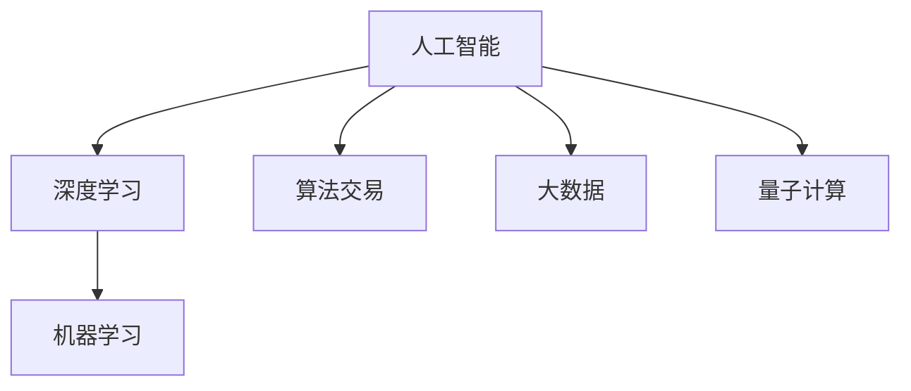

                 

# 程序员的投资策略：新兴科技领域的早期投资

> 关键词：人工智能,深度学习,机器学习,算法交易,大数据,量子计算

## 1. 背景介绍

### 1.1 问题由来
随着信息技术的迅猛发展，人工智能（AI）已经成为全球科技创新的重要引擎，引领了诸多领域的变革。从智能客服、自动驾驶到智慧医疗，AI的应用已经渗透到了日常生活的方方面面。然而，人工智能技术的早期投资风险大、回报周期长，使得许多投资者望而却步。

### 1.2 问题核心关键点
新兴科技领域的早期投资是一个复杂多变的过程，涉及技术、市场、政策等多方面的因素。如何判断一个AI项目的前景，选择正确的投资策略，成为早期投资成功的关键。本文旨在从投资策略的角度，探讨新兴科技领域的早期投资问题。

### 1.3 问题研究意义
掌握AI领域早期投资策略，对于投资者规避风险、获取高额回报具有重要意义：

1. **规避风险**：通过深入了解AI技术的演进趋势，投资者能够选择具有较好发展前景的技术和公司，降低投资风险。
2. **获取回报**：早期投资AI项目，往往能获得更高的投资回报。对于具有高潜力的AI项目，及早介入将为投资者带来可观的收益。
3. **参与创新**：早期投资使投资者能够直接参与到新技术的研发和商业化过程中，从产品设计到市场推广，获得第一手的信息和反馈。

## 2. 核心概念与联系

### 2.1 核心概念概述

为了更好地理解AI领域的早期投资策略，本节将介绍几个密切相关的核心概念：

- **人工智能（Artificial Intelligence, AI）**：使计算机系统能够模拟人类智能活动的技术和应用。
- **深度学习（Deep Learning, DL）**：利用多层神经网络，通过大量数据进行训练，实现模式识别、决策制定等任务。
- **机器学习（Machine Learning, ML）**：通过数据和算法训练模型，使计算机系统具备学习能力。
- **算法交易（Algorithmic Trading）**：利用AI算法进行金融市场的交易策略，实现自动化投资。
- **大数据（Big Data）**：大规模、多样化的数据集，为AI模型提供丰富的训练数据。
- **量子计算（Quantum Computing）**：利用量子力学原理进行计算，有望大幅度提高计算效率。

这些概念之间的逻辑关系可以通过以下Mermaid流程图来展示：



这个流程图展示了一些核心概念及其之间的关系：

1. 人工智能是基础，包括深度学习、机器学习和量子计算等多种技术手段。
2. 深度学习和机器学习是实现人工智能的两种重要技术途径。
3. 算法交易和量子计算则代表AI技术在金融和计算效率方面的应用。
4. 大数据则为AI提供充足的训练数据。

这些概念共同构成了AI技术的核心框架，为其在金融、医疗、制造等多个领域的应用提供了技术支持。

## 3. 核心算法原理 & 具体操作步骤
### 3.1 算法原理概述

AI领域的早期投资，本质上是基于算法和技术的前景预测。投资成功的关键在于识别出具有显著优势的AI项目，进行有效的投资布局。这需要投资者具备深厚的技术背景和敏锐的市场洞察力。

投资决策的过程包括以下几个关键步骤：

1. **技术筛选**：选择具有先进技术、优秀团队、良好市场前景的项目。
2. **数据验证**：通过测试集和实验验证技术算法的有效性。
3. **市场分析**：评估项目所在的市场需求和潜在用户群体。
4. **财务评估**：进行详细的财务分析，预测投资回报。
5. **风险控制**：制定风险管理策略，分散投资风险。

### 3.2 算法步骤详解

以下是AI领域早期投资的一般步骤：

**Step 1: 技术评估**
- 选择具有先进技术和良好市场前景的AI项目。
- 评估项目的核心算法，判断其是否具备技术领先性和可扩展性。
- 考察项目的团队成员，是否具备强大的技术实力和丰富的行业经验。

**Step 2: 数据验证**
- 通过小规模实验，验证技术的有效性。
- 利用公开数据集或自建数据集，测试模型的性能指标。
- 对比同类算法，评估技术优势。

**Step 3: 市场分析**
- 调研目标市场，分析潜在用户群体和需求。
- 考察市场竞争态势，识别主要竞争对手。
- 分析行业趋势，预测市场增长潜力。

**Step 4: 财务评估**
- 预测项目的未来收入和利润，计算投资回报率。
- 分析项目的成本和风险，确定合理的投资估值。
- 考虑退出策略，评估短期和长期回报。

**Step 5: 风险控制**
- 制定详细的风险管理计划，包括投资分散、止损策略等。
- 建立风险监控机制，定期评估投资项目的状态。
- 进行投资组合优化，降低整体风险。

### 3.3 算法优缺点

AI领域的早期投资策略具有以下优点：

1. **高回报潜力**：早期投资于具有潜力的AI项目，往往能获得较高的投资回报。
2. **技术领先**：选择技术领先的公司和团队，能够获取技术创新的先机。
3. **市场空间大**：AI技术覆盖的领域广泛，市场需求大，投资机会多。

同时，这种策略也存在一定的局限性：

1. **高风险**：技术迭代快，市场变化大，早期投资风险较高。
2. **缺乏数据**：在项目早期，往往缺乏充分的数据进行验证，评估难度大。
3. **竞争激烈**：AI领域竞争激烈，投资决策需要细致判断。
4. **资源消耗**：前期调研和验证需要大量时间和资金投入，成本高。

尽管存在这些局限性，但就目前而言，AI领域早期投资策略仍是获取高额回报的重要手段。未来相关研究的重点在于如何进一步降低风险、提高投资准确性，同时兼顾可解释性和伦理安全性等因素。

### 3.4 算法应用领域

AI领域的早期投资策略广泛应用于以下几个方面：

- **金融科技**：利用AI算法进行量化交易、风险控制、信用评估等，提升金融服务的智能化水平。
- **医疗健康**：在药物发现、影像分析、患者监测等领域，应用AI技术提升诊断和治疗效果。
- **智能制造**：通过AI技术优化生产流程、预测维护、智能仓储等，提升制造业的自动化和智能化水平。
- **智慧城市**：利用AI进行城市管理、环境监测、交通优化等，构建更高效、更智慧的城市系统。
- **自动驾驶**：在智能交通、自动驾驶等领域，通过AI技术实现车辆自主导航和决策，推动自动驾驶技术的商业化应用。

除了上述这些应用领域外，AI技术还在教育、零售、物流等诸多领域展现出了广阔的应用前景，为各行各业带来了变革性创新。随着AI技术的不断演进，相信早期投资策略将在更多领域得到应用，为科技创新和产业升级注入新的动力。

## 4. 数学模型和公式 & 详细讲解 & 举例说明

### 4.1 数学模型构建

AI领域的早期投资策略主要基于以下几个数学模型：

- **技术评估模型**：利用回归分析、分类算法等，评估技术算法的有效性和先进性。
- **市场分析模型**：利用时间序列分析、市场调研数据等，预测市场需求和市场趋势。
- **财务评估模型**：利用NPV、IRR等财务指标，预测项目的投资回报率。
- **风险控制模型**：利用蒙特卡洛模拟、VaR等方法，评估投资组合的风险水平。

### 4.2 公式推导过程

以技术评估模型为例，我们假设有一组数据集 $D=\{(x_i,y_i)\}_{i=1}^N$，其中 $x_i$ 为技术指标向量，$y_i$ 为技术评估结果。可以使用线性回归模型 $y_i=\theta^T x_i + \epsilon_i$ 进行建模，其中 $\theta$ 为模型参数，$\epsilon_i$ 为误差项。模型的拟合优度可以通过最小化残差平方和 $\sum_{i=1}^N(y_i-\theta^T x_i)^2$ 来评估。

### 4.3 案例分析与讲解

假设我们有一家AI创业公司，其核心技术是利用深度学习进行自然语言处理。我们对该公司进行了如下技术评估：

1. **数据集准备**：收集了公司在公开数据集上的测试结果，并进行了内部测试。
2. **模型构建**：构建了线性回归模型，利用训练集数据拟合模型参数 $\theta$。
3. **性能验证**：在测试集上验证模型性能，计算预测误差。

通过这样的技术评估，我们可以判断该公司的技术是否具有较好的有效性，是否值得进行进一步的投资。

## 5. 项目实践：代码实例和详细解释说明

### 5.1 开发环境搭建

在进行AI领域早期投资策略的实践前，我们需要准备好开发环境。以下是使用Python进行数据分析和模型构建的环境配置流程：

1. 安装Anaconda：从官网下载并安装Anaconda，用于创建独立的Python环境。

2. 创建并激活虚拟环境：
```bash
conda create -n ai-env python=3.8 
conda activate ai-env
```

3. 安装必要的Python包：
```bash
pip install numpy pandas scikit-learn statsmodels matplotlib seaborn
```

4. 安装必要的数据处理工具：
```bash
pip install pandas_profiling
```

完成上述步骤后，即可在`ai-env`环境中开始AI投资策略的开发实践。

### 5.2 源代码详细实现

以下是一个简单的Python代码示例，展示了如何利用线性回归模型进行AI项目的技术评估：

```python
import numpy as np
from sklearn.linear_model import LinearRegression
from sklearn.metrics import mean_squared_error

# 准备数据
x = np.array([[0.1, 0.2], [0.3, 0.5], [0.7, 0.8]])
y = np.array([0.3, 0.5, 0.8])

# 构建模型
model = LinearRegression()
model.fit(x, y)

# 预测
y_pred = model.predict([[0.4, 0.6]])

# 评估
mse = mean_squared_error(y, y_pred)
print("预测误差：", mse)
```

### 5.3 代码解读与分析

让我们再详细解读一下关键代码的实现细节：

**数据准备**：
- `x` 为特征向量，`y` 为目标变量。

**模型构建**：
- 使用 `LinearRegression` 构建线性回归模型。
- 通过 `fit` 方法拟合模型参数 $\theta$。

**预测和评估**：
- 使用 `predict` 方法对新的特征向量进行预测。
- 利用 `mean_squared_error` 计算预测误差，评估模型性能。

## 6. 实际应用场景

### 6.1 金融科技

利用AI算法进行金融市场的量化交易，已经成为金融机构的重要投资策略。通过大数据分析、机器学习建模等技术手段，量化交易系统能够实时监测市场变化，预测价格趋势，进行自动化交易。

在技术实现上，可以收集金融市场的历史数据，利用机器学习算法构建预测模型，通过算法自动生成交易策略。在投资决策时，可以实时监控市场动态，及时调整交易策略，提升投资回报率。

### 6.2 医疗健康

AI在医疗健康领域的应用前景广阔，特别是在疾病预测、影像分析、个性化治疗等方面，取得了显著进展。通过深度学习算法，AI模型可以分析医疗影像、基因数据等高维数据，提供精准的医疗诊断和治疗方案。

在实际应用中，可以收集大量医疗数据，训练AI模型进行疾病预测和影像分析。在投资决策时，可以评估模型的准确性和鲁棒性，判断其市场潜力。

### 6.3 智能制造

智能制造是制造业的未来发展方向，通过AI技术实现生产流程的自动化和智能化，提升生产效率和产品质量。利用机器学习算法，AI系统可以实时监控生产数据，预测设备故障，优化生产计划。

在技术实现上，可以采集生产数据，利用时间序列分析等技术手段，训练AI模型进行预测和优化。在投资决策时，可以评估模型的预测效果和优化能力，判断其市场前景。

### 6.4 智慧城市

智慧城市是城市管理的新模式，通过AI技术实现城市各领域的智能化管理。利用机器学习算法，AI系统可以实现交通管理、环境监测、公共安全等应用。

在实际应用中，可以收集城市数据，训练AI模型进行城市管理。在投资决策时，可以评估模型的应用效果和市场潜力，判断其商业价值。

### 6.5 自动驾驶

自动驾驶是AI技术的典型应用之一，通过AI算法实现车辆的自主导航和决策，推动无人驾驶技术的商业化应用。利用深度学习算法，AI系统可以实时感知环境信息，进行路径规划和决策。

在技术实现上，可以采集车辆传感器数据，利用深度学习算法进行环境感知和路径规划。在投资决策时，可以评估算法的感知能力和决策效果，判断其市场潜力。

## 7. 工具和资源推荐

### 7.1 学习资源推荐

为了帮助开发者系统掌握AI领域的早期投资策略，这里推荐一些优质的学习资源：

1. 《深度学习》系列书籍：由斯坦福大学教授Ian Goodfellow等所著，系统介绍了深度学习的基本概念和算法。
2. Coursera《机器学习》课程：由斯坦福大学教授Andrew Ng主讲，介绍了机器学习的基本理论和应用实例。
3. 《Python数据科学手册》：由Jake VanderPlas所著，介绍了Python在数据科学和机器学习中的应用。
4. 《金融机器学习》书籍：由Peter Hall和Geoffrey score等所著，介绍了机器学习在金融领域的应用。
5. 《人工智能导论》：由周志华所著，系统介绍了人工智能的基本概念和前沿技术。

通过对这些资源的学习实践，相信你一定能够快速掌握AI领域的早期投资策略，并用于解决实际的投资问题。

### 7.2 开发工具推荐

高效的开发离不开优秀的工具支持。以下是几款用于AI投资策略开发的常用工具：

1. Jupyter Notebook：Python数据分析和模型构建的理想环境，支持代码编写和结果展示。
2. Scikit-learn：Python机器学习库，提供了丰富的算法和工具。
3. TensorFlow和PyTorch：深度学习框架，支持高效的数据处理和模型构建。
4. Pandas：数据处理库，支持数据清洗、转换和分析。
5. NumPy：数值计算库，支持高效的数据计算和处理。

合理利用这些工具，可以显著提升AI投资策略的开发效率，加快创新迭代的步伐。

### 7.3 相关论文推荐

AI领域的早期投资策略研究源于学界的持续研究。以下是几篇奠基性的相关论文，推荐阅读：

1. 《Deep Learning》论文：深度学习领域的经典论文，介绍了深度学习的基本概念和算法。
2. 《Pattern Recognition and Machine Learning》书籍：周志华所著，介绍了机器学习的基本理论和应用实例。
3. 《Financial Machine Learning》书籍：Peter Hall和Geoffrey score所著，介绍了机器学习在金融领域的应用。
4. 《Investment Banking: Valuation, Leveraged Buyouts, and Mergers and Acquisitions》书籍：Julian Robertson所著，介绍了金融投资的基本概念和策略。
5. 《AI Superpowers: China, Silicon Valley, and the New World Order》书籍：Kai-Fu Lee所著，介绍了AI技术在全球范围内的发展和应用。

这些论文代表了大数据、机器学习和金融AI的投资理论，提供了丰富的研究和应用参考。

## 8. 总结：未来发展趋势与挑战

### 8.1 总结

本文对AI领域的早期投资策略进行了全面系统的介绍。首先阐述了AI领域早期投资的背景和意义，明确了早期投资在规避风险、获取高额回报方面的独特价值。其次，从原理到实践，详细讲解了早期投资的技术评估、数据验证、市场分析、财务评估和风险控制等关键步骤，给出了投资策略的完整代码实例。同时，本文还广泛探讨了AI投资在金融科技、医疗健康、智能制造等领域的实际应用前景，展示了早期投资策略的巨大潜力。此外，本文精选了早期投资策略的各类学习资源，力求为读者提供全方位的技术指引。

通过本文的系统梳理，可以看到，AI领域早期投资策略在规避风险、获取高额回报、推动技术创新等方面具有重要意义。掌握早期投资策略，将有助于投资者在瞬息万变的AI市场中，把握机会，规避风险，实现资产增值。

### 8.2 未来发展趋势

展望未来，AI领域早期投资策略将呈现以下几个发展趋势：

1. **技术驱动**：AI技术的持续演进将推动早期投资策略的发展，更加智能化、自动化、高效化的投资工具将出现。
2. **数据驱动**：大数据和机器学习技术的应用，将使早期投资更加依赖于数据驱动，提高决策的科学性和准确性。
3. **全球化**：全球化投资将更加普及，AI技术在跨国投资中的应用将不断扩大。
4. **多元化**：早期投资将更加多元化，涵盖更多的行业和领域，如金融科技、医疗健康、智能制造等。
5. **合规性**：AI技术的应用将更加注重合规性，遵循国际和国内的法律法规，确保投资行为的合法性。
6. **可持续性**：可持续发展成为全球共识，早期投资将更加注重环保和社会责任。

这些趋势凸显了AI领域早期投资策略的广阔前景。技术、数据、全球化、多元化、合规性和可持续性等方向的研究，将推动早期投资策略的不断进步，为科技创新和产业升级注入新的动力。

### 8.3 面临的挑战

尽管AI领域早期投资策略已经取得了显著成效，但在迈向更加智能化、普适化应用的过程中，仍面临诸多挑战：

1. **数据获取难度**：获取高质量的行业数据，尤其是非公开数据，是一个巨大的挑战。数据不足和数据质量问题将影响投资决策的准确性。
2. **模型复杂性**：AI模型的复杂性越来越高，如何设计简单易懂、可解释性强的投资模型，是一个重要问题。
3. **市场变化快**：AI领域的技术迭代速度非常快，市场变化不确定性大，如何灵活应对市场变化，是一个挑战。
4. **技术门槛高**：AI领域的技术门槛高，需要高水平的技术团队和丰富的行业经验。
5. **法律法规**：AI技术的应用需要遵循法律法规，如何平衡技术创新和合规性，是一个重要挑战。
6. **投资风险高**：早期投资风险高，如何合理评估风险，制定有效的风险控制策略，是一个挑战。

这些挑战凸显了AI领域早期投资策略的复杂性和不确定性。未来相关研究的重点在于如何进一步降低投资风险、提高投资准确性，同时兼顾可解释性和伦理安全性等因素。

### 8.4 研究展望

面对AI领域早期投资策略所面临的种种挑战，未来的研究需要在以下几个方面寻求新的突破：

1. **无监督学习**：探索利用无监督学习技术进行早期投资决策，减少对标注数据的需求，提高决策的灵活性和准确性。
2. **多模态数据融合**：研究多模态数据的融合技术，如将文本、图像、声音等多种数据融合，提升投资模型的泛化能力和鲁棒性。
3. **自动化投资**：研究自动化投资策略，如基于强化学习的投资决策模型，提升投资决策的自动化和智能化水平。
4. **可解释性**：研究投资模型的可解释性技术，如可解释性AI（XAI），提高投资决策的透明度和可信度。
5. **伦理和社会责任**：研究AI投资的伦理和社会责任问题，确保投资行为符合社会价值观和伦理道德。
6. **跨学科研究**：推动跨学科研究，将AI技术与金融、法律、政策等学科相结合，提升投资策略的全面性和实用性。

这些研究方向的探索，必将引领AI领域早期投资策略的不断进步，为科技创新和产业升级注入新的动力。面向未来，AI领域早期投资策略还需要与其他人工智能技术进行更深入的融合，如知识表示、因果推理、强化学习等，多路径协同发力，共同推动自然语言理解和智能交互系统的进步。只有勇于创新、敢于突破，才能不断拓展AI技术的边界，让智能技术更好地造福人类社会。

## 9. 附录：常见问题与解答

**Q1：AI领域的早期投资风险大，如何规避风险？**

A: 规避AI投资风险，可以从以下几个方面入手：

1. **技术评估**：选择具有先进技术和优秀团队的项目。评估项目的技术可行性和技术优势。
2. **数据验证**：利用小规模实验和公开数据集验证技术的有效性。评估模型的准确性和鲁棒性。
3. **市场分析**：调研目标市场，分析潜在用户群体和需求。评估市场竞争态势和增长潜力。
4. **财务评估**：进行详细的财务分析，预测投资回报。评估项目的盈利能力和估值水平。
5. **风险控制**：制定详细的风险管理计划，包括投资分散、止损策略等。建立风险监控机制，定期评估投资项目的状态。

**Q2：AI领域的早期投资回报周期长，如何获取高额回报？**

A: 获取AI领域早期投资的高额回报，可以从以下几个方面入手：

1. **技术领先**：选择技术领先的公司和团队，获取技术创新的先机。
2. **市场潜力**：选择具有广阔市场前景的项目，评估市场需求和用户群体。
3. **团队实力**：评估团队的技术实力和行业经验，确保项目有强大的执行能力。
4. **项目成熟度**：选择具有较高成熟度的项目，降低投资风险。
5. **市场时机**：选择市场时机合适、竞争较少的产品，抓住市场机遇。

**Q3：AI领域的早期投资需要高水平的技术团队，如何评估团队实力？**

A: 评估AI项目团队实力，可以从以下几个方面入手：

1. **团队背景**：考察团队成员的教育背景和行业经验，确保团队具备扎实的理论基础和丰富的实践经验。
2. **项目历史**：评估团队以往的项目成果和市场表现，确保团队具备良好的执行能力。
3. **技术实力**：评估团队的技术实力和研发能力，确保团队具备强大的技术创新能力。
4. **行业影响力**：评估团队在行业内的影响力和声誉，确保团队具备良好的行业地位和资源。

**Q4：AI领域的早期投资需要大量数据，如何获取高质量的数据？**

A: 获取高质量的数据，可以从以下几个方面入手：

1. **公开数据集**：利用公开数据集进行模型验证和测试。
2. **数据众包**：通过数据众包平台获取标注数据，如Amazon Mechanical Turk等。
3. **合作研究**：与高校、研究机构合作，获取高质量的数据集。
4. **市场调研**：利用市场调研数据进行模型训练和验证，获取真实用户数据。
5. **用户反馈**：收集用户反馈数据，进行模型优化和验证。

**Q5：AI领域的早期投资需要灵活应对市场变化，如何灵活应对？**

A: 灵活应对市场变化，可以从以下几个方面入手：

1. **持续学习**：利用机器学习技术进行持续学习和模型优化，适应市场变化。
2. **数据更新**：定期更新数据集，确保模型具备最新的市场信息。
3. **多模型组合**：构建多模型组合，提升模型的泛化能力和鲁棒性。
4. **市场调研**：定期进行市场调研，获取最新的市场动态和用户需求。
5. **动态调整**：根据市场变化动态调整投资策略，优化投资组合。

总之，AI领域的早期投资策略需要投资者具备深厚的技术背景和敏锐的市场洞察力，通过技术评估、数据验证、市场分析、财务评估和风险控制等关键步骤，制定合理的投资决策，才能在瞬息万变的市场中把握机会，规避风险，获取高额回报。

---

作者：禅与计算机程序设计艺术 / Zen and the Art of Computer Programming

