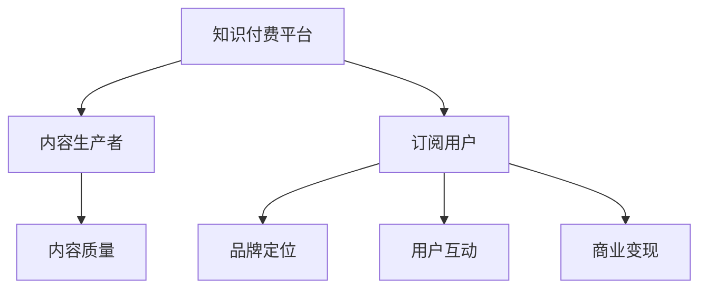

                 

# 程序员的知识付费品牌建设与维护

## 1. 背景介绍

### 1.1 问题由来

在信息爆炸和知识竞争的时代，程序员作为社会的技术中坚，面临着不断学习、更新知识的巨大压力。无论是技术深度还是广度，无论是纵向积累还是横向拓展，都有大量知识需要掌握。然而，仅仅依靠自学和同行交流，已难以满足日益增长的学习需求。

在这一背景下，知识付费应运而生。通过付费订阅获取高质量课程、咨询和工具，程序员能够更快、更系统、更深入地学习技术知识，提升技能水平。知识付费平台如雨后春笋般涌现，成为程序员自我提升的重要途径。

### 1.2 问题核心关键点

知识付费品牌建设与维护，是知识付费平台运营成功的关键。一个优秀的知识付费品牌，不仅能吸引用户订阅，更能留住用户，形成稳定的用户群体。这背后涉及品牌定位、内容质量、用户互动、商业变现等多个环节。

## 2. 核心概念与联系

### 2.1 核心概念概述

为更好地理解知识付费品牌建设与维护的核心概念，本节将介绍几个密切相关的核心概念：

- 知识付费平台(Knowledge Paywall Platform)：提供高质量技术课程、咨询、工具等知识产品，通过付费订阅方式获取收益的在线平台。
- 内容生产者(Content Creator)：在知识付费平台上创作、分享知识内容的专业人士或团队。
- 订阅用户(Subscription User)：付费订阅知识付费平台的用户群体，通过支付费用获取知识服务。
- 品牌定位(Brand Positioning)：知识付费平台在市场和用户心中建立的核心竞争力，包括平台定位、内容特色、用户定位等。
- 内容质量(Content Quality)：知识付费平台的核心价值所在，包括内容的深度、广度、更新频率、实战性等。
- 用户互动(User Interaction)：平台与用户之间的交流互动，如社区问答、在线讲座、互动讨论等，提升用户体验和粘性。
- 商业变现(Commercial Monetization)：知识付费平台的盈利模式，包括订阅费、课程销售、广告分成、会员增值服务等。

这些核心概念之间的逻辑关系可以通过以下Mermaid流程图来展示：



这个流程图展示出知识付费品牌建设与维护的几个关键环节：

1. 平台和内容生产者之间的关系：平台提供舞台，内容生产者创造价值。
2. 平台和用户之间的关系：通过提供高质量内容，吸引用户订阅，形成良性循环。
3. 内容质量和用户互动之间的关系：优质的内容能够增强用户粘性，良好的互动能提升用户体验。
4. 用户互动和商业变现之间的关系：活跃的用户互动可以带动商业变现，形成良性循环。

这些概念共同构成了知识付费品牌的核心逻辑，使得品牌建设与维护成为平台长期发展的关键。

## 3. 核心算法原理 & 具体操作步骤
### 3.1 算法原理概述

知识付费品牌建设与维护，本质上是一个多目标优化问题。平台需要通过优化内容、互动、订阅等多个维度，最大化用户价值和平台收益。

形式化地，假设知识付费平台的用户价值为 $V$，平台收益为 $R$，内容质量为 $Q$，用户互动为 $I$，品牌定位为 $B$。则平台的目标是最小化成本 $C$，同时最大化用户价值和平台收益。设 $f$ 为用户价值和平台收益的函数，则优化目标为：

$$
\min_C \max_{V, R} f(V, R) = \min_C \max_{Q, I, B} V + R
$$

其中，$f$ 的计算涉及多因素之间的复杂关系，需要通过实证分析和学习理论来构建。

### 3.2 算法步骤详解

知识付费品牌建设与维护的优化步骤包括：

**Step 1: 确定品牌定位**
- 分析市场竞争情况，确定平台的核心差异点和竞争优势。
- 定位目标用户群体，如高级开发人员、大数据工程师等。
- 设定平台的主题和特色，如技术深度、实战性、社区氛围等。

**Step 2: 提升内容质量**
- 吸引和招募优秀的技术专家和团队，定期发布高质量课程和文章。
- 鼓励内容生产者与用户互动，通过问答、讲座等形式增加内容的实战性和互动性。
- 引入KOL、专家顾问等外部资源，提升平台内容的权威性和吸引力。

**Step 3: 增强用户互动**
- 建立活跃的社区环境，鼓励用户提问、讨论、分享。
- 定期举办在线讲座、技术研讨会、编程挑战等活动，增加用户参与度。
- 利用社交媒体、邮件列表等渠道，增加用户粘性和平台曝光度。

**Step 4: 实现商业变现**
- 设计合理的订阅费结构，提供免费试用、月度订阅、年度订阅等多种选择。
- 推出付费课程、技术咨询、私人导师等多种增值服务，满足不同用户的需求。
- 引入广告分成、合作伙伴推荐等商业化手段，拓展平台盈利模式。

**Step 5: 监测和优化**
- 定期收集用户反馈，评估内容质量和互动效果。
- 利用数据分析工具，如Google Analytics、Mixpanel等，监控平台运营指标。
- 根据数据分析结果，不断优化内容策略、互动机制和商业模型。

### 3.3 算法优缺点

知识付费品牌建设与维护的算法具有以下优点：

1. 多目标优化。通过平衡用户价值和平台收益，最大化整体效益。
2. 动态调整。平台可以根据用户反馈和市场变化，动态调整内容和互动策略。
3. 用户粘性提升。高质量的内容和活跃的互动能增强用户粘性，提高续费率和活跃度。
4. 商业变现多样化。通过多种盈利模式，提高平台收益。

同时，该算法也存在一定的局限性：

1. 内容生产者依赖度高。高质量内容依赖于专家团队，难以大规模复制。
2. 运营成本高。吸引和维护专家团队、组织互动活动等需要高昂的成本。
3. 用户需求多样。不同用户群体的需求差异大，难以通过统一策略满足所有用户。
4. 市场竞争激烈。知识付费行业竞争激烈，难以快速区分平台间的差异。
5. 技术依赖性强。平台运营依赖于多技术栈的开发和管理。

尽管存在这些局限性，但就目前而言，知识付费品牌建设与维护仍是行业发展的核心范式。未来相关研究的重点在于如何进一步提升内容质量，降低运营成本，拓展盈利模式，同时兼顾用户需求和技术实现。

### 3.4 算法应用领域

知识付费品牌建设与维护的算法，在知识付费平台、在线教育、技术培训等多个领域得到了广泛的应用，成为平台竞争力的重要来源。

1. **知识付费平台**：如Udemy、Coursera、代码驾到等，通过高质量课程、专家讲座、实战项目吸引用户订阅，实现商业变现。
2. **在线教育**：如网易云课堂、慕课网等，提供系统化课程学习，培养技术人才。
3. **技术培训**：如极客时间、CSDN学院等，通过在线讲座、编程挑战等形式，提升技术实战能力。
4. **职业培训**：如Metis、N2YO等，提供职业技能培训，助力职业发展。

除了上述这些典型应用外，知识付费品牌建设与维护的算法也被创新性地应用到更多场景中，如企业培训、技术资讯、技术社区等，为技术教育和人才培养提供了新的解决方案。随着算法和技术的不断进步，相信知识付费品牌建设与维护的实践将更加丰富和多元。

## 4. 数学模型和公式 & 详细讲解  
### 4.1 数学模型构建

本节将使用数学语言对知识付费品牌建设与维护的优化过程进行更加严格的刻画。

记知识付费平台的用户价值为 $V$，平台收益为 $R$，内容质量为 $Q$，用户互动为 $I$，品牌定位为 $B$。定义优化目标函数为：

$$
\max_{V, R} f(V, R) = V + R
$$

其中，$f$ 为用户价值和平台收益的函数，涉及多个变量的复杂关系。假设优化过程中满足独立性假设，则可以通过变量分解，将目标函数分解为多个子目标函数的乘积：

$$
f(V, R) = V \times R
$$

优化目标变为：

$$
\max_{Q, I, B} V \times R
$$

### 4.2 公式推导过程

由于用户价值 $V$ 和平台收益 $R$ 都是关于内容质量 $Q$、用户互动 $I$ 和品牌定位 $B$ 的函数，具体形式较为复杂。以下以简化形式进行推导：

假设用户价值 $V$ 由内容质量 $Q$、用户互动 $I$ 和品牌定位 $B$ 决定，则有：

$$
V = f(Q, I, B)
$$

类似地，平台收益 $R$ 也由 $Q$、$I$ 和 $B$ 决定：

$$
R = g(Q, I, B)
$$

则目标函数变为：

$$
f(Q, I, B) \times g(Q, I, B)
$$

其中 $f$ 和 $g$ 的具体形式需要根据实际情况设定。例如，可以设定 $f$ 为内容质量和用户互动的乘积，$g$ 为订阅用户数量和广告收入的乘积。

### 4.3 案例分析与讲解

假设一个知识付费平台的内容质量 $Q$ 和用户互动 $I$ 分别以指数形式影响用户价值 $V$ 和平台收益 $R$，即：

$$
V = Q^a \times I^b
$$

$$
R = Q^c \times I^d
$$

其中 $a, b, c, d$ 为影响系数。目标函数变为：

$$
Q^a \times I^b \times Q^c \times I^d
$$

化简得：

$$
Q^{a+c} \times I^{b+d}
$$

可以看出，用户价值和平台收益均随内容质量和用户互动的提升而增加。因此，在实际运营中，平台需要重点关注内容质量和用户互动的提升，以实现整体效益的最大化。

## 5. 项目实践：代码实例和详细解释说明
### 5.1 开发环境搭建

在进行知识付费品牌建设与维护的实践前，我们需要准备好开发环境。以下是使用Python进行知识付费平台开发的常见环境配置流程：

1. 安装Python：确保Python 3.x版本已经安装，并进行环境变量设置。

2. 安装Flask：Flask是一个轻量级的Web框架，适合快速迭代原型开发。

3. 安装SQLite：SQLite是一个轻量级的关系型数据库，适合开发小型应用。

4. 安装Django：Django是一个功能强大的Web框架，适合大中型应用开发。

5. 安装Celery：Celery是一个分布式任务队列，适合处理异步任务。

6. 安装PyPassport：PyPassport是一个用户认证系统，适合处理用户身份验证。

完成上述步骤后，即可在开发环境中开始知识付费平台的实践。

### 5.2 源代码详细实现

下面以一个简单的知识付费平台为例，给出Flask框架下知识付费平台开发的PyTorch代码实现。

首先，定义Flask应用程序：

```python
from flask import Flask, render_template, request
from flask_sqlalchemy import SQLAlchemy
from flask_login import LoginManager, UserMixin, login_user, logout_user, login_required

app = Flask(__name__)
app.config['SECRET_KEY'] = 'secret key'
app.config['SQLALCHEMY_DATABASE_URI'] = 'sqlite:////tmp/test.db'
app.config['SQLALCHEMY_TRACK_MODIFICATIONS'] = False
app.config['USERNAME'] = 'admin'
app.config['PASSWORD'] = 'admin'

db = SQLAlchemy(app)
login_manager = LoginManager()
login_manager.init_app(app)

@login_manager.user_loader
def load_user(user_id):
    return User.query.get(int(user_id))

@app.route('/')
@login_required
def index():
    return render_template('index.html')

@app.route('/login', methods=['GET', 'POST'])
def login():
    if request.method == 'POST':
        user = User.query.filter_by(username=request.form['username']).first()
        if user and user.password == request.form['password']:
            login_user(user)
            return redirect('/')
        else:
            flash('Invalid username or password')
            return redirect('/login')
    else:
        return render_template('login.html')
```

然后，定义用户模型和登录逻辑：

```python
class User(db.Model, UserMixin):
    id = db.Column(db.Integer, primary_key=True)
    username = db.Column(db.String(30), unique=True)
    password = db.Column(db.String(50))

@login_manager.user_loader
def load_user(user_id):
    return User.query.get(int(user_id))

@app.route('/logout')
@login_required
def logout():
    logout_user()
    return redirect('/')
```

接着，定义内容模型和课程发布逻辑：

```python
class Course(db.Model):
    id = db.Column(db.Integer, primary_key=True)
    title = db.Column(db.String(100))
    description = db.Column(db.Text)
    price = db.Column(db.Float)

@app.route('/courses')
@login_required
def courses():
    courses = Course.query.all()
    return render_template('courses.html', courses=courses)
```

最后，定义用户订阅逻辑：

```python
@app.route('/subscribe', methods=['GET', 'POST'])
@login_required
def subscribe():
    if request.method == 'POST':
        course_id = request.form['course_id']
        Course.query.filter_by(id=course_id).update({'views': Course.views + 1})
        flash('You are now subscribed to this course')
        return redirect('/courses')
    else:
        courses = Course.query.all()
        return render_template('subscribe.html', courses=courses)
```

以上代码展示了知识付费平台的基本功能，包括用户登录、课程浏览、课程订阅等。

### 5.3 代码解读与分析

让我们再详细解读一下关键代码的实现细节：

**Flask应用程序**：
- 初始化Flask应用程序，并配置相关参数，包括数据库连接、登录管理器等。
- 定义登录和退出路由，使用login_manager提供的user_loader和user_required装饰器，确保用户登录状态。
- 定义首页路由，只有登录用户才能访问。

**用户模型**：
- 定义用户模型，包含用户ID、用户名和密码字段。
- 使用SQLAlchemy框架进行数据库操作，定义用户模型的映射关系。
- 实现用户加载器，用于在用户登录时加载用户信息。

**课程模型和发布逻辑**：
- 定义课程模型，包含课程ID、标题、描述、价格字段。
- 使用SQLAlchemy框架进行数据库操作，定义课程模型的映射关系。
- 定义课程列表页路由，获取所有课程数据，并渲染展示。

**订阅逻辑**：
- 定义订阅路由，获取课程ID并更新课程的观看次数。
- 使用SQLAlchemy框架进行数据库操作，更新课程的观看次数。
- 显示订阅提示，并返回课程列表页。

这些代码展示了知识付费平台的核心逻辑和实现细节，从用户登录、课程发布到课程订阅，涵盖了平台运营的关键功能。

## 6. 实际应用场景
### 6.1 智能客服系统

知识付费品牌建设与维护的算法，可以应用于智能客服系统的构建。传统的客服系统往往需要大量人力，高峰期响应缓慢，且无法提供24小时服务。而基于知识付费品牌建设与维护的算法，可以实现智能客服系统的构建，提升客服响应速度和质量。

在技术实现上，可以收集企业内部的历史客服对话记录，将问题和最佳答复构建成监督数据，在此基础上对知识付费平台进行微调。微调后的智能客服系统能够自动理解用户意图，匹配最合适的答复模板进行回复。对于客户提出的新问题，还可以接入检索系统实时搜索相关内容，动态组织生成回答。如此构建的智能客服系统，能大幅提升客户咨询体验和问题解决效率。

### 6.2 金融舆情监测

知识付费品牌建设与维护的算法，可以应用于金融舆情监测。金融机构需要实时监测市场舆论动向，以便及时应对负面信息传播，规避金融风险。传统的人工监测方式成本高、效率低，难以应对网络时代海量信息爆发的挑战。基于知识付费品牌建设与维护的算法，可以实现金融舆情监测的新解决方案。

具体而言，可以收集金融领域相关的新闻、报道、评论等文本数据，并对其进行主题标注和情感标注。在此基础上对知识付费平台进行微调，使其能够自动判断文本属于何种主题，情感倾向是正面、中性还是负面。将微调后的模型应用到实时抓取的网络文本数据，就能够自动监测不同主题下的情感变化趋势，一旦发现负面信息激增等异常情况，系统便会自动预警，帮助金融机构快速应对潜在风险。

### 6.3 个性化推荐系统

知识付费品牌建设与维护的算法，可以应用于个性化推荐系统。当前的推荐系统往往只依赖用户的历史行为数据进行物品推荐，无法深入理解用户的真实兴趣偏好。基于知识付费品牌建设与维护的算法，可以更好地挖掘用户行为背后的语义信息，从而提供更精准、多样的推荐内容。

在实践中，可以收集用户浏览、点击、评论、分享等行为数据，提取和用户交互的物品标题、描述、标签等文本内容。将文本内容作为模型输入，用户的后续行为（如是否点击、购买等）作为监督信号，在此基础上微调知识付费平台。微调后的模型能够从文本内容中准确把握用户的兴趣点。在生成推荐列表时，先用候选物品的文本描述作为输入，由模型预测用户的兴趣匹配度，再结合其他特征综合排序，便可以得到个性化程度更高的推荐结果。

### 6.4 未来应用展望

随着知识付费品牌建设与维护的算法和技术的不断发展，基于微调的知识付费平台将在更多领域得到应用，为传统行业带来变革性影响。

在智慧医疗领域，基于微调的知识付费平台可以为医生和患者提供定制化的诊疗和健康管理方案，提升医疗服务的智能化水平。

在智能教育领域，微调技术可应用于作业批改、学情分析、知识推荐等方面，因材施教，促进教育公平，提高教学质量。

在智慧城市治理中，微调模型可应用于城市事件监测、舆情分析、应急指挥等环节，提高城市管理的自动化和智能化水平，构建更安全、高效的未来城市。

此外，在企业生产、社会治理、文娱传媒等众多领域，基于微调的知识付费平台也将不断涌现，为经济社会发展注入新的动力。相信随着技术的日益成熟，微调方法将成为知识付费品牌建设与维护的重要范式，推动知识付费平台向更广阔的领域加速渗透。

## 7. 工具和资源推荐
### 7.1 学习资源推荐

为了帮助开发者系统掌握知识付费品牌建设与维护的理论基础和实践技巧，这里推荐一些优质的学习资源：

1. 《知识付费平台设计与运营》系列博文：由知识付费平台技术专家撰写，深入浅出地介绍了知识付费平台的技术架构、产品设计、用户运营等方面的内容。

2. Coursera《数据分析与机器学习》课程：斯坦福大学开设的机器学习课程，有Lecture视频和配套作业，带你入门数据分析和机器学习的基础知识。

3. 《知识付费平台开发与实战》书籍：全面介绍了知识付费平台的技术实现，包括前端、后端、数据库、API等多个方面的开发细节。

4. 《知识付费平台运营之道》书籍：深入探讨了知识付费平台的运营策略，包括内容运营、用户运营、市场运营等方面的实战经验。

5. 知识付费平台社区：如极客时间、CSDN学院等，提供丰富的实战案例和技术交流机会，帮助你快速上手实践。

通过对这些资源的学习实践，相信你一定能够快速掌握知识付费平台的技术和运营技巧，并用于解决实际的运营问题。

### 7.2 开发工具推荐

高效的开发离不开优秀的工具支持。以下是几款用于知识付费平台开发的常用工具：

1. Flask：基于Python的轻量级Web框架，灵活易用，适合快速迭代原型开发。

2. Django：功能强大的Web框架，适合大中型应用开发，拥有丰富的插件和扩展。

3. SQLAlchemy：基于Python的ORM框架，支持多种数据库，方便进行数据库操作。

4. Celery：基于Python的分布式任务队列，支持异步任务处理，适合处理大量并发请求。

5. PyPassport：基于Python的用户认证系统，支持OAuth、JWT等多种认证方式，适合处理用户身份验证。

6. Google Analytics：Google提供的网站分析工具，可以实时监控用户行为和平台运营指标。

7. Mixpanel：功能强大的用户行为分析工具，可以深入了解用户使用习惯和平台性能。

合理利用这些工具，可以显著提升知识付费平台的开发效率，加快创新迭代的步伐。

### 7.3 相关论文推荐

知识付费品牌建设与维护的研究源于学界的持续研究。以下是几篇奠基性的相关论文，推荐阅读：

1. "Content Personalization on Knowledge Paywall Platforms"：提出基于用户行为数据的个性化推荐算法，提高知识付费平台的用户体验。

2. "User Interaction in Knowledge Paywall Platforms"：研究用户互动对平台收益和用户价值的影响，提出增强互动策略。

3. "Brand Positioning in Knowledge Paywall Platforms"：分析品牌定位对平台差异化和用户选择的影响，提出品牌建设策略。

4. "Monetization Strategies for Knowledge Paywall Platforms"：探讨知识付费平台的多种盈利模式，如订阅费、课程销售、广告分成等。

5. "User Value and Platform Benefit in Knowledge Paywall Platforms"：研究用户价值和平台收益的优化策略，提出多目标优化算法。

这些论文代表了大规模知识付费平台的研究方向，通过学习这些前沿成果，可以帮助研究者把握学科前进方向，激发更多的创新灵感。

## 8. 总结：未来发展趋势与挑战

### 8.1 总结

本文对知识付费品牌建设与维护的理论基础和实践技巧进行了全面系统的介绍。首先阐述了知识付费平台运营成功的关键要素，明确了品牌定位、内容质量、用户互动和商业变现等核心环节。其次，从原理到实践，详细讲解了知识付费平台的优化目标、模型构建和推导过程，给出了知识付费平台开发的完整代码实例。同时，本文还广泛探讨了知识付费平台在智能客服、金融舆情、个性化推荐等多个领域的应用前景，展示了微调范式的巨大潜力。此外，本文精选了知识付费平台的学习资源，力求为读者提供全方位的技术指引。

通过本文的系统梳理，可以看到，知识付费品牌建设与维护技术正在成为知识付费平台运营的核心范式，极大地提升了平台的用户价值和平台收益。未来，伴随知识付费平台的不断发展，相关技术的持续演进，相信知识付费品牌建设与维护必将在构建人机协同的智能时代中扮演越来越重要的角色。

### 8.2 未来发展趋势

展望未来，知识付费品牌建设与维护技术将呈现以下几个发展趋势：

1. 内容多元化。平台将提供更加多样化、个性化的内容，涵盖课程、文章、视频、播客等多种形式。
2. 互动实时化。通过引入实时互动技术，如Websocket、chatbot等，提升用户参与度和体验感。
3. 平台社区化。构建活跃的社区环境，鼓励用户分享、讨论、反馈，提升用户粘性和平台生态。
4. 商业变现多样化。探索更多盈利模式，如内容衍生品、知识付费会员制、品牌广告等。
5. 运营智能化。引入AI和机器学习技术，实现内容推荐、用户画像、市场预测等智能运营。

以上趋势凸显了知识付费平台运营的创新方向，这些方向的探索发展，将推动知识付费平台向更加智能化、普适化应用迈进。

### 8.3 面临的挑战

尽管知识付费品牌建设与维护技术已经取得了一定的成效，但在迈向更加智能化、普适化应用的过程中，它仍面临着诸多挑战：

1. 内容生产者依赖度高。高质量内容依赖于专家团队，难以大规模复制。
2. 运营成本高。吸引和维护专家团队、组织互动活动等需要高昂的成本。
3. 用户需求多样。不同用户群体的需求差异大，难以通过统一策略满足所有用户。
4. 市场竞争激烈。知识付费行业竞争激烈，难以快速区分平台间的差异。
5. 技术依赖性强。平台运营依赖于多技术栈的开发和管理。

尽管存在这些挑战，但知识付费品牌建设与维护技术仍具有广阔的发展前景，通过不断的技术创新和实践探索，相信知识付费平台将能够更好地满足用户需求，实现商业变现，构建更加智能、普适、生态化的知识付费生态。

### 8.4 未来突破

面对知识付费品牌建设与维护所面临的挑战，未来的研究需要在以下几个方面寻求新的突破：

1. 探索无监督和半监督微调方法。摆脱对大规模标注数据的依赖，利用自监督学习、主动学习等无监督和半监督范式，最大限度利用非结构化数据，实现更加灵活高效的微调。
2. 研究参数高效和计算高效的微调范式。开发更加参数高效的微调方法，在固定大部分预训练参数的同时，只更新极少量的任务相关参数。同时优化微调模型的计算图，减少前向传播和反向传播的资源消耗，实现更加轻量级、实时性的部署。
3. 融合因果和对比学习范式。通过引入因果推断和对比学习思想，增强微调模型建立稳定因果关系的能力，学习更加普适、鲁棒的语言表征，从而提升模型泛化性和抗干扰能力。
4. 引入更多先验知识。将符号化的先验知识，如知识图谱、逻辑规则等，与神经网络模型进行巧妙融合，引导微调过程学习更准确、合理的语言模型。同时加强不同模态数据的整合，实现视觉、语音等多模态信息与文本信息的协同建模。
5. 结合因果分析和博弈论工具。将因果分析方法引入微调模型，识别出模型决策的关键特征，增强输出解释的因果性和逻辑性。借助博弈论工具刻画人机交互过程，主动探索并规避模型的脆弱点，提高系统稳定性。
6. 纳入伦理道德约束。在模型训练目标中引入伦理导向的评估指标，过滤和惩罚有偏见、有害的输出倾向。同时加强人工干预和审核，建立模型行为的监管机制，确保输出符合人类价值观和伦理道德。

这些研究方向的探索，必将引领知识付费品牌建设与维护技术迈向更高的台阶，为构建安全、可靠、可解释、可控的智能系统铺平道路。面向未来，知识付费品牌建设与维护技术还需要与其他人工智能技术进行更深入的融合，如知识表示、因果推理、强化学习等，多路径协同发力，共同推动知识付费平台的进步。只有勇于创新、敢于突破，才能不断拓展知识付费平台的边界，让智能技术更好地造福人类社会。

## 9. 附录：常见问题与解答

**Q1：知识付费平台如何保持内容质量？**

A: 保持内容质量是知识付费平台的长期运营目标。以下是一些具体措施：
1. 招募和培养优质内容生产者。通过优厚的待遇和平台曝光，吸引专家和团队入驻。
2. 建立严格的内容审核机制。设立专家委员会，对内容进行审核和评估，确保高质量输出。
3. 引入KOL和专家顾问。借助外部资源提升内容权威性和吸引力。
4. 引入用户反馈机制。收集用户反馈，及时改进和优化内容。
5. 定期进行内容更新和调整。保持内容的新鲜度和实用性，定期推出新内容。

**Q2：知识付费平台如何提高用户互动？**

A: 提高用户互动是知识付费平台提升用户粘性和活跃度的关键。以下是一些具体措施：
1. 建立社区环境。构建活跃的论坛、问答、讨论等社区，鼓励用户交流和分享。
2. 定期举办互动活动。如在线讲座、技术研讨会、编程挑战等，增加用户参与度。
3. 引入社交媒体和邮件列表。通过社交媒体和邮件列表，增加用户粘性和平台曝光度。
4. 设立激励机制。通过积分、优惠券、免费课程等方式，激励用户积极互动。
5. 优化用户体验。提高平台界面友好性和操作便捷性，提升用户使用体验。

**Q3：知识付费平台如何实现商业变现？**

A: 知识付费平台的商业变现方式多种多样，以下是一些主要手段：
1. 订阅费。提供月度订阅、年度订阅等多种选择，按月或按年收取订阅费用。
2. 课程销售。单独销售付费课程，获取一次性收入。
3. 广告分成。在平台页面上引入广告，通过点击和展示获得广告收入。
4. 会员增值服务。提供会员特权，如提前观看、专属课程等，增加会员转化率。
5. 平台推荐。通过数据分析和机器学习技术，向用户推荐高质量课程和商品，获取推荐佣金。

这些变现方式需要根据平台定位和用户需求灵活选择和搭配，形成多元化的盈利模式。

---

作者：禅与计算机程序设计艺术 / Zen and the Art of Computer Programming

