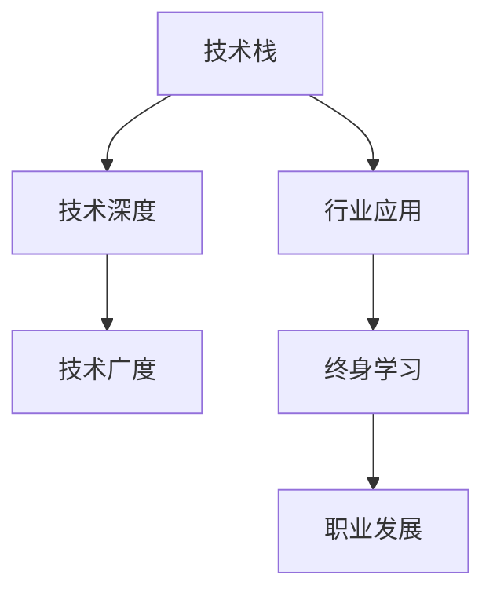

                 

# 程序员的职业生涯规划：长跑与长跑

## 1. 背景介绍

### 1.1 问题由来
在当前快速变化的科技环境中，程序员的职业生涯规划面临着前所未有的挑战和机遇。一方面，技术的日新月异使得知识更新加速，终身学习成为常态；另一方面，技术的深度和广度不断扩展，跨领域应用日益广泛。如何在这变幻莫测的领域中找到自己的方向，实现长期的职业成长，成为了每位程序员必须面对的问题。

### 1.2 问题核心关键点
程序员的职业生涯规划涉及到技术学习、行业选择、职业发展等多个方面，核心关键点包括：

- **技术栈选择**：根据自身的兴趣和职业目标，选择适合的编程语言和技术栈。
- **行业定位**：了解不同行业的技术需求和发展趋势，选择适合的行业方向。
- **技能提升**：持续学习新技术，提升自身技术能力和跨领域应用能力。
- **职业发展**：明确职业目标，制定详细的职业发展规划，逐步实现职位提升和职业转型。

## 2. 核心概念与联系

### 2.1 核心概念概述

为更好地理解程序员的职业生涯规划，本节将介绍几个关键概念及其相互联系：

- **技术栈(Stack)**：程序员在工作中常用的编程语言、框架和工具的集合。
- **技术深度**：指对某一技术领域的深入理解和熟练应用。
- **技术广度**：指对多个技术领域的广泛了解和应用。
- **行业应用**：指将技术应用到具体行业中的实际场景。
- **终身学习**：指程序员在职业生涯中不断学习新知识，适应技术发展的过程。
- **职业发展**：指通过不断学习和实践，逐步实现职位晋升和职业转型。

这些概念之间的关系可以通过以下Mermaid流程图来展示：



这个流程图展示了程序员职业发展的基本路径：从掌握某一技术栈开始，逐步深化技术理解，拓展技术应用领域，不断学习新知识，并最终实现职业成长。

## 3. 核心算法原理 & 具体操作步骤
### 3.1 算法原理概述

程序员的职业生涯规划可以视为一个动态的学习和适应过程，通过不断调整和优化技术栈、行业选择和技能提升，逐步实现职业目标。其核心算法原理可以概括为：

1. **目标设定**：明确职业目标，包括短期和长期的职位晋升和技能提升。
2. **需求分析**：分析不同职位和技术栈的需求，评估自身技能差距。
3. **路径规划**：根据需求分析结果，制定详细的学习和实践计划。
4. **执行与评估**：按照计划执行学习任务，定期评估进展和效果。
5. **调整优化**：根据评估结果和环境变化，调整学习计划和职业路径。

### 3.2 算法步骤详解

以下是程序员职业生涯规划的主要操作步骤：

**Step 1: 目标设定**
- 明确职业目标：短期目标（如入门某一技术栈）、中期目标（如晋升高级工程师）和长期目标（如成为技术专家或管理者）。
- 确定学习目标：通过自学或参加培训，掌握特定技能或技术栈。
- 制定时间表：根据目标和技能需求，制定详细的学习计划和时间表。

**Step 2: 需求分析**
- 行业需求调研：了解不同行业对技术栈的需求，选择有潜力的行业方向。
- 技能差距评估：通过技能自测和岗位要求对比，评估自身技能与目标职位之间的差距。
- 市场趋势分析：关注技术发展趋势和新兴技术，选择有前景的技术栈。

**Step 3: 路径规划**
- 技术栈选择：根据目标和市场需求，选择适合的编程语言和技术栈。
- 学习路径设计：制定详细的学习路径，包括学习资源、实践项目、评估标准等。
- 职业发展路径：规划职业发展的具体步骤，包括提升能力、获取证书、积累项目经验等。

**Step 4: 执行与评估**
- 学习执行：按照学习计划执行学习任务，如阅读书籍、观看视频、编写代码等。
- 实践验证：通过实际项目、开源贡献、技术博客等方式，验证学习效果。
- 定期评估：每季度或半年进行技能和职业进展评估，调整学习计划和职业路径。

**Step 5: 调整优化**
- 学习计划调整：根据评估结果和环境变化，调整学习内容和节奏。
- 职业路径调整：根据职业目标和市场需求，调整职业发展方向和策略。
- 资源优化：利用在线课程、技术社区、导师指导等资源，提升学习效率。

### 3.3 算法优缺点

程序员职业生涯规划的算法具有以下优点：

1. **系统性**：通过明确目标、需求分析和路径规划，提供系统的学习和职业发展路径。
2. **灵活性**：可以根据自身情况和环境变化，灵活调整学习计划和职业路径。
3. **可量化**：通过设定具体的学习目标和时间表，便于量化评估进展和效果。
4. **可持续性**：通过终身学习的理念，持续提升技能和职业竞争力。

同时，该算法也存在一些局限性：

1. **主观性强**：目标设定和需求分析受个人主观因素影响较大，可能导致选择偏差。
2. **时间成本高**：制定和调整学习计划需要较多时间和精力投入。
3. **环境适应性差**：过于细致的规划可能难以适应快速变化的技术和市场需求。
4. **资源依赖度高**：需要依赖优质的学习资源和导师指导，否则可能影响学习效果。

尽管存在这些局限性，但总体而言，基于目标设定、需求分析和路径规划的职业生涯规划方法，为程序员提供了一个较为系统、科学的职业发展框架。

### 3.4 算法应用领域

程序员职业生涯规划的方法在多个应用领域中都能发挥重要作用，例如：

- **技术岗职晋升**：适用于希望在现有公司或技术领域内晋升的程序员，通过学习新技能和承担新项目，逐步提升职位。
- **职业转型**：适用于希望从某一技术栈转向其他领域或行业的程序员，通过系统学习目标领域的技术和行业知识，成功转型。
- **创业与发展**：适用于计划自主创业或加入初创公司的程序员，通过学习和积累行业知识，提升创业成功率和公司发展潜力。

## 4. 数学模型和公式 & 详细讲解 & 举例说明

### 4.1 数学模型构建

为了更好地量化程序员职业生涯规划，我们可以构建一个基于时间和技能的数学模型。设 $t$ 表示时间（以年计），$S_t$ 表示在第 $t$ 年末掌握的技能水平，$g_t$ 表示在第 $t$ 年末获得的职业等级提升。模型的目标是最小化技能和职业等级提升的差距，即：

$$
\min_{g_t, S_t} \sum_{t=1}^T (S_{t}^* - S_t)^2 + (g_{t}^* - g_t)^2
$$

其中 $T$ 为规划期，$S_{t}^*$ 和 $g_{t}^*$ 分别为在第 $t$ 年末理想的技能和职业等级，需要根据目标设定和市场需求确定。

### 4.2 公式推导过程

以学习Python为例，假设每年学习时间固定为200小时，学习效率为每小时掌握5个新技能。则在第 $t$ 年末掌握的技能 $S_t$ 可以表示为：

$$
S_t = \sum_{i=1}^t 200 \times 5
$$

职业等级提升 $g_t$ 则可以通过参与项目、获得证书等方式计算。例如，每参与一个项目，职业等级提升1级，每获得一个证书，职业等级提升2级。则 $g_t$ 的计算公式为：

$$
g_t = \sum_{i=1}^t (1 \times \text{项目数}_i + 2 \times \text{证书数}_i)
$$

### 4.3 案例分析与讲解

假设某程序员计划在3年内从初级开发工程师晋升为高级工程师，每年学习时间固定为200小时。假设每年学习效率固定为每小时掌握5个新技能。项目需求每两年提升1个等级，证书需求每年获得1个。

首先，计算理想的技能水平 $S_t^*$ 和职业等级提升 $g_t^*$。设三年内掌握技能 $S_3 = 3 \times 200 \times 5 = 3000$ 个，职业等级提升 $g_3 = 2 \times (2 + 3) = 10$ 级。

其次，计算每年掌握的技能和职业等级提升的实际值。设每年参与2个项目，获得1个证书，则每年掌握的技能为 $S_1 = 200 \times 5 \times 2 = 2000$ 个，职业等级提升为 $g_1 = 1 \times 2 + 2 \times 1 = 4$ 级。以此类推，可计算出每年末的技能和职业等级提升值，并进行评估。

通过上述模型，该程序员可以明确每年需要掌握的技能和项目需求，进行有针对性的学习和实践，从而实现职业晋升目标。

## 5. 项目实践：代码实例和详细解释说明

### 5.1 开发环境搭建

在进行职业生涯规划的实际实践前，我们需要准备好开发环境。以下是使用Python进行职业生涯规划开发的完整环境配置流程：

1. 安装Anaconda：从官网下载并安装Anaconda，用于创建独立的Python环境。

2. 创建并激活虚拟环境：
```bash
conda create -n career-env python=3.8 
conda activate career-env
```

3. 安装必要的Python包：
```bash
pip install pandas numpy matplotlib sklearn joblib
```

4. 安装在线学习平台API接口：
```bash
pip install requests beautifulsoup4
```

5. 安装数据可视化工具：
```bash
pip install seaborn plotly
```

完成上述步骤后，即可在`career-env`环境中开始职业生涯规划的实践。

### 5.2 源代码详细实现

以下是一个使用Python和Plotly进行职业生涯规划的代码实现：

```python
import pandas as pd
import matplotlib.pyplot as plt
import plotly.graph_objects as go
from sklearn.metrics import mean_squared_error

# 假设数据：每年学习时间、技能提升、职业等级提升等
data = {
    'Year': [1, 2, 3],
    'Skill': [2000, 2500, 3000],
    'Level': [4, 6, 10]
}

# 创建DataFrame
df = pd.DataFrame(data)

# 计算理想值
df['Skill*'] = 3000
df['Level*'] = 10

# 计算误差平方和
mse = mean_squared_error(df['Skill'], df['Skill*'])
mse_level = mean_squared_error(df['Level'], df['Level*'])

# 计算实际值与理想值差距
df['Skill_diff'] = df['Skill'] - df['Skill*']
df['Level_diff'] = df['Level'] - df['Level*']

# 绘制误差分布图
fig = go.Figure(data=[go.Bar(x='total years', y='error', name='error distribution')])
fig.add_trace(go.Bar(x=df['Year'], y=df['Skill_diff']**2, name='Skill error'))
fig.add_trace(go.Bar(x=df['Year'], y=df['Level_diff']**2, name='Level error'))
fig.update_layout(title='Error Distribution by Years')
fig.show()

# 计算最终误差
final_mse = (df['Skill_diff']**2).mean() + (df['Level_diff']**2).mean()

# 输出最终结果
print(f'Final Mean Squared Error: {final_mse:.2f}')
```

### 5.3 代码解读与分析

让我们再详细解读一下关键代码的实现细节：

**数据准备**：
- 使用Pandas库创建DataFrame，包含每年掌握的技能数和职业等级提升数。

**理想值设定**：
- 根据职业目标设定理想的技能和职业等级，计算理想值。

**误差计算**：
- 使用sklearn库的mean_squared_error函数计算实际值与理想值之间的误差平方和。

**误差分布图绘制**：
- 使用Plotly库绘制误差分布图，分别显示技能和职业等级的误差平方和。

**最终误差计算**：
- 计算最终误差平方和，评估整个职业生涯规划的效果。

通过上述代码，我们可以清晰地看到每年掌握的技能和职业等级提升的实际值与理想值之间的差距，并进行量化评估。

## 6. 实际应用场景

### 6.1 技术岗职晋升

利用职业生涯规划的方法，技术岗职晋升的程序员可以通过系统化的学习计划，不断提升技能和承担项目，逐步实现职业晋升。例如，希望从初级开发工程师晋升为高级工程师的程序员，可以制定如下学习计划：

- 第一年：掌握一门新语言（如Java或Python）和基础算法，参与2-3个项目，获得1个证书。
- 第二年：深化对当前语言和框架的理解，掌握高级算法和架构设计，参与4-6个项目，获得2个证书。
- 第三年：担任团队负责人，参与复杂项目，通过高级项目评审，获得高级工程师认证。

通过这样的规划，程序员可以在3年内实现从初级到高级的职位晋升。

### 6.2 职业转型

对于希望从某一技术栈转向其他领域或行业的程序员，职业生涯规划尤为重要。以从后端开发转型为前端开发为例，可以制定如下规划：

- 第一年：学习前端技术栈（如HTML、CSS、JavaScript）和框架（如React或Vue），参与小型项目，积累实践经验。
- 第二年：深入学习前端技术，参与中大型项目，获得相关证书，积累行业经验。
- 第三年：在新的技术栈上担任重要角色，参与高难度项目，逐步成为前端专家。

通过系统化的学习和实践，程序员可以在3年内成功转型，进入新的职业领域。

### 6.3 创业与发展

对于计划自主创业或加入初创公司的程序员，职业生涯规划同样至关重要。以开发一款SaaS产品为例，可以制定如下规划：

- 第一年：掌握产品需求分析和项目管理，积累项目经验，组建初步团队。
- 第二年：开发核心产品功能，拓展市场，获取用户反馈，提升产品质量。
- 第三年：优化产品功能，拓展业务线，实现产品商业化，成为创业公司的技术负责人。

通过系统化的学习和实践，程序员可以在3年内实现从技术岗到创业管理岗的转型，成功发展自己的事业。

## 7. 工具和资源推荐

### 7.1 学习资源推荐

为了帮助程序员系统掌握职业生涯规划的理论基础和实践技巧，这里推荐一些优质的学习资源：

1. **《程序员生涯管理》系列书籍**：详细介绍了程序员职业发展的各个阶段，包括技术学习、行业选择、职业晋升等，提供了实用的职业规划建议。
2. **Coursera《职业生涯规划与管理》课程**：提供系统化的职业生涯规划知识，涵盖职业目标设定、技能提升、职业路径规划等内容。
3. **LinkedIn Learning《职业发展与转型》课程**：通过实际案例，讲解如何制定职业发展计划，成功转型或晋升。
4. **TED Talks《如何规划职业生涯》视频**：多位职业规划专家分享实战经验，提供有价值的职业规划建议。

通过这些资源的学习，程序员可以全面提升自己的职业规划能力，为职业生涯的顺利发展奠定坚实基础。

### 7.2 开发工具推荐

高效的开发离不开优秀的工具支持。以下是几款用于职业生涯规划开发的常用工具：

1. **Trello**：项目管理工具，帮助制定详细的学习计划和项目进度。
2. **JIRA**：缺陷跟踪和任务管理工具，便于记录和跟踪技能提升和项目进展。
3. **GitHub**：代码托管平台，便于存储和管理学习项目和代码库。
4. **Slack**：团队沟通工具，方便与团队成员和导师进行交流和反馈。
5. **Evernote**：笔记管理工具，便于记录学习笔记和职业规划思路。

合理利用这些工具，可以显著提升职业生涯规划任务的开发效率，加快创新迭代的步伐。

### 7.3 相关论文推荐

程序员职业生涯规划的研究涉及多个学科领域，以下是几篇奠基性的相关论文，推荐阅读：

1. **《程序员职业路径分析与建模》**：研究不同职业路径的特点和需求，提出基于数据驱动的职业规划方法。
2. **《人工智能领域人才流动与职业发展研究》**：分析AI领域人才的职业流动规律，提出相应的职业规划建议。
3. **《技术栈选择与职业晋升关联性研究》**：研究不同技术栈与职业晋升之间的关联性，提供职业规划指导。
4. **《终身学习与职业发展的互动关系》**：探讨终身学习在职业生涯发展中的重要性，提出终身学习的实践策略。

这些论文代表了大语言模型微调技术的发展脉络。通过学习这些前沿成果，可以帮助研究者把握学科前进方向，激发更多的创新灵感。

## 8. 总结：未来发展趋势与挑战

### 8.1 总结

本文对程序员的职业生涯规划进行了全面系统的介绍。首先阐述了程序员职业生涯规划的背景和意义，明确了技术学习、行业选择、职业发展等多个方面的关键点。其次，从原理到实践，详细讲解了职业生涯规划的数学模型和操作步骤，给出了职业生涯规划任务开发的完整代码实例。同时，本文还广泛探讨了职业生涯规划在技术岗职晋升、职业转型、创业与发展等多个行业领域的应用前景，展示了职业生涯规划范式的巨大潜力。

通过本文的系统梳理，可以看到，职业生涯规划为程序员提供了一个系统的职业发展框架，通过明确目标、需求分析和路径规划，逐步实现职业成长。利用学习计划和职业评估，程序员可以在职业生涯中不断提升技能和适应市场需求，最终实现职业目标。

### 8.2 未来发展趋势

展望未来，程序员职业生涯规划将呈现以下几个发展趋势：

1. **人工智能与规划结合**：随着AI技术的普及，职业生涯规划将越来越多地利用AI技术进行分析和优化，如基于机器学习的人才需求预测、职业路径推荐等。
2. **跨领域知识整合**：程序员需要掌握更多跨领域的知识，如项目管理、团队协作、用户体验等，提升综合竞争力。
3. **远程与协作增强**：随着远程工作的普及，职业生涯规划将更多地依赖在线协作工具和平台，如Slack、Trello等，提升工作效率和沟通协作。
4. **终身学习与技能提升**：终身学习的理念将更加深入人心，程序员需要不断学习新知识和新技术，保持竞争力。
5. **自动化与智能化**：利用AI技术自动化生成学习计划和职业评估，提升规划的科学性和效率。

这些趋势将进一步提升职业生涯规划的科学性和智能化水平，帮助程序员更好地应对职业发展的各种挑战。

### 8.3 面临的挑战

尽管职业生涯规划方法已经取得了显著成果，但在迈向更加智能化、普适化应用的过程中，它仍面临诸多挑战：

1. **个性化需求差异**：不同程序员的个性化需求差异较大，需要制定灵活多样的职业规划方案。
2. **环境变化适应性**：快速变化的技术和市场需求可能导致职业规划方案难以适应。
3. **时间管理压力**：制定和执行职业规划需要大量时间和精力，需要合理平衡工作与学习。
4. **资源获取难度**：获取高质量的学习资源和导师指导，需要较强的资源获取能力。
5. **心理调整挑战**：职业规划过程中可能遇到挫折和失败，需要较强的心理调整能力。

尽管存在这些挑战，但总体而言，基于目标设定、需求分析和路径规划的职业生涯规划方法，为程序员提供了一个较为系统、科学的职业发展框架。通过不断优化和调整，可以逐步实现职业目标。

### 8.4 研究展望

面对职业生涯规划所面临的种种挑战，未来的研究需要在以下几个方面寻求新的突破：

1. **个性化职业规划算法**：开发更加个性化和灵活的职业规划算法，根据不同程序员的需求和背景，制定针对性的职业规划方案。
2. **智能职业发展引擎**：利用AI技术，开发智能化的职业发展引擎，自动生成职业规划方案，并提供实时反馈和优化建议。
3. **跨领域知识图谱**：构建跨领域的知识图谱，帮助程序员系统地整合和管理不同领域的知识，提升综合竞争力。
4. **远程协作平台**：开发高效的远程协作平台，支持跨时区、跨团队的协作和沟通，提升远程工作的效率。
5. **心理辅导与支持**：提供职业规划过程中的心理辅导和支持，帮助程序员应对挫折和失败，保持积极心态。

这些研究方向的探索，将进一步提升职业生涯规划的科学性和实用性，为程序员提供更加全面的职业发展指导。

## 9. 附录：常见问题与解答

**Q1：职业生涯规划是否适用于所有程序员？**

A: 职业生涯规划适用于绝大多数程序员，特别是那些希望通过系统的学习和实践，实现职业成长和晋升的程序员。通过明确目标、需求分析和路径规划，程序员可以更好地应对职业发展的各种挑战，提升综合竞争力。

**Q2：职业生涯规划的时间成本如何平衡？**

A: 职业生涯规划需要投入大量时间和精力，但可以通过合理的时间管理策略来平衡工作和学习。建议利用碎片时间进行学习，如通勤途中、午休时间等，同时合理分配学习和项目任务，保持高效工作和学习状态。

**Q3：如何选择合适的技术栈？**

A: 选择合适的技术栈需要考虑自身的兴趣、职业目标和市场需求。建议通过调研不同行业的技术需求，选择有前景的技术栈进行学习，同时结合自身优势和兴趣，制定系统的学习计划。

**Q4：如何应对快速变化的市场需求？**

A: 职业生涯规划需要灵活调整，以适应快速变化的市场需求。建议定期评估自身技能和市场需求，及时调整学习计划和职业路径，保持与市场同步。同时，持续学习新技术和新知识，提升自身的适应能力。

**Q5：职业生涯规划如何与长期目标相结合？**

A: 职业生涯规划需要与长期目标相结合，制定可持续的发展计划。建议设定明确的长短期职业目标，通过系统化的学习计划和实践项目，逐步实现职业晋升和转型，同时保持对新技术和新领域的持续关注，提升长期竞争力。

通过本文的系统梳理，可以看到，职业生涯规划为程序员提供了一个系统的职业发展框架，通过明确目标、需求分析和路径规划，逐步实现职业成长。利用学习计划和职业评估，程序员可以在职业生涯中不断提升技能和适应市场需求，最终实现职业目标。尽管存在一些挑战，但总体而言，基于目标设定、需求分析和路径规划的职业生涯规划方法，为程序员提供了一个较为系统、科学的职业发展框架。通过不断优化和调整，可以逐步实现职业目标。

作者：禅与计算机程序设计艺术 / Zen and the Art of Computer Programming

