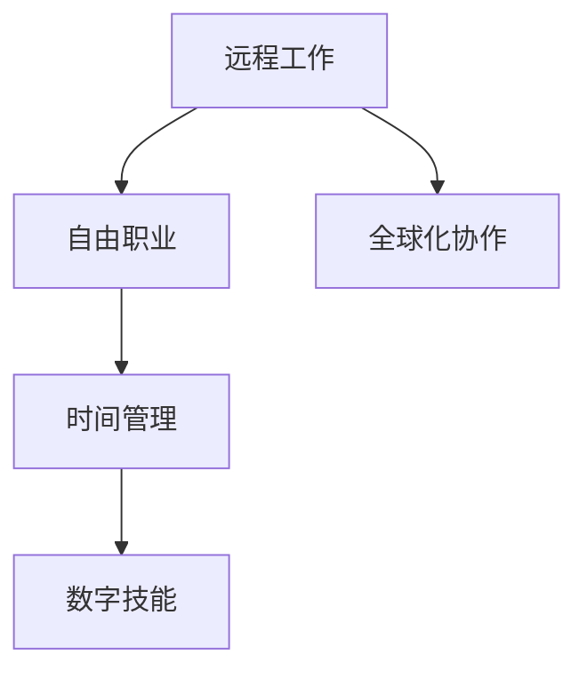

                 

# 程序员的财务自由：数字游民生活

## 1. 背景介绍

在数字化飞速发展的今天，程序员已经不再局限于传统的朝九晚五、坐班工作的模式。随着互联网技术的成熟，许多程序员正在迈向一种新的生活方式——数字游民。他们借助互联网和数字技术，实现了从地点限制中的解放，通过远程工作、自由职业等方式，实现了财务自由，开创了属于自己的数字游民生活。

### 1.1 数字游民的概念

数字游民（Digital Nomads）指的是那些利用互联网进行远程工作或自由职业，不受地理位置限制的人群。他们可以在任何有网络连接的地方工作，从热带海滨到偏远山区，从繁华都市到静谧乡村，都可能是他们的工作场所。这种生活方式不仅赋予了他们自由和灵活性，还为他们提供了更多的生活体验和选择。

### 1.2 数字游民的兴起

数字游民的兴起是互联网技术发展的必然结果。随着移动网络、云计算、远程办公工具的普及，以及协作平台的完善，远程工作变得更为便捷和高效。加之疫情的推动，越来越多的人选择远程工作，加速了数字游民文化的崛起。

### 1.3 数字游民与传统程序员的区别

尽管数字游民与传统程序员都是从事编程工作，但两者在生活方式和工作模式上有显著的区别：

- **工作地点灵活**：数字游民不受地点限制，可以在全球任意一个有网络的地方工作。
- **时间自由**：数字游民可以根据自己的节奏安排工作时间，实现工作与生活的平衡。
- **多样化收入来源**：数字游民通常有多种收入来源，如自由职业、远程工作、个人项目等，减少了对单一收入来源的依赖。
- **生活体验丰富**：数字游民可以随时旅行，体验不同的文化和生活方式，拓宽了视野。

## 2. 核心概念与联系

### 2.1 核心概念概述

为了深入理解数字游民的生活方式，本节将介绍几个核心概念及其之间的关系：

- **远程工作（Remote Work）**：指通过网络在家或其他非传统工作场所完成工作任务。
- **自由职业（Freelancing）**：独立工作者以项目或短期合同形式为客户提供服务。
- **时间管理（Time Management）**：合理安排工作和生活时间，提高效率和幸福感。
- **数字技能（Digital Skills）**：包括编程、网络安全、数据分析等数字领域的专业技能。
- **全球化协作（Global Collaboration）**：通过互联网进行跨地域、跨文化的团队协作。

### 2.2 核心概念原理和架构的 Mermaid 流程图



这个流程图展示了远程工作与自由职业、时间管理、数字技能和全球化协作之间的关系。远程工作是数字游民的基础，自由职业和全球化协作提供了多样化的收入来源和工作方式，时间管理和数字技能则提升了工作效率和生活质量。

## 3. 核心算法原理 & 具体操作步骤

### 3.1 算法原理概述

数字游民的生活方式虽然看似自由，但也需要通过一系列的算法和步骤来实现。其核心在于如何高效地管理时间和任务，同时保持稳定的收入来源。以下是数字游民生活方式的主要算法原理：

- **任务调度算法**：将工作任务分为优先级和紧急度，合理安排任务时间。
- **收入多样化算法**：通过自由职业、远程工作等多种方式，实现收入多样化。
- **时间管理算法**：使用时间块技术，将一天划分为不同的时间块，每个时间块专注于特定的任务。
- **数字技能提升算法**：定期学习和提升数字技能，保持竞争力。

### 3.2 算法步骤详解

以下是数字游民生活方式的具体操作步骤：

**Step 1: 制定工作计划**
- 根据工作任务和时间要求，制定详细的工作计划。
- 使用项目管理工具（如Trello、Asana等）记录和跟踪任务进度。

**Step 2: 建立收入来源**
- 确定自由职业项目或远程工作岗位，并在平台（如Upwork、Freelancer、LinkedIn等）上进行注册。
- 根据项目需求，提供合适的服务或解决方案。

**Step 3: 实现时间管理**
- 使用时间管理工具（如RescueTime、Todoist等）记录和分析工作和生活时间分配。
- 根据分析结果调整时间块，确保高效工作和生活平衡。

**Step 4: 持续学习与技能提升**
- 定期参加在线课程、研讨会和工作坊，提升数字技能。
- 学习新兴技术（如区块链、人工智能等），保持竞争力。

**Step 5: 优化收入来源**
- 不断拓展新的收入来源，如通过写作、设计、编程等方式实现多元化收入。
- 定期评估收入来源的稳定性和回报率，及时调整策略。

### 3.3 算法优缺点

数字游民生活方式的优势在于：

- **高自由度**：不受地点和工作时间的限制，自由度高。
- **多样化收入**：有多个收入来源，降低风险。
- **提高效率**：通过科学的时间管理，工作效率高。

然而，这种方式也存在一些缺点：

- **工作环境不稳定**：需要适应不同环境和网络条件。
- **生活保障不稳定**：需要较强的自律性和时间管理能力。
- **精神压力较大**：频繁旅行和跨时区工作可能带来一定的精神压力。

### 3.4 算法应用领域

数字游民的生活方式广泛应用于各种职业领域，如软件开发、设计、写作、市场营销等。以下是一些典型的应用场景：

- **软件开发**：在各地寻找远程工作机会，提供编程服务。
- **内容创作**：写作、编辑、翻译等自由职业，通过写作平台获得收入。
- **数字营销**：通过社交媒体和在线广告平台进行营销，提供营销策略和内容。
- **技术咨询**：提供技术咨询和支持，帮助企业解决技术问题。

## 4. 数学模型和公式 & 详细讲解 & 举例说明

### 4.1 数学模型构建

为了更科学地管理数字游民的工作和生活，我们可以建立以下数学模型：

- **工作时间分配模型**：
  $$
  T_{total} = \sum_{i=1}^{n} t_i
  $$
  其中 $T_{total}$ 为总工作时间，$n$ 为时间块数，$t_i$ 为每个时间块的持续时间。

- **任务优先级模型**：
  $$
  P_i = \frac{W_i}{T_{total}}
  $$
  其中 $P_i$ 为任务 $i$ 的优先级，$W_i$ 为任务 $i$ 的权重，$T_{total}$ 为总工作时间。

- **收入预测模型**：
  $$
  I(t) = \sum_{i=1}^{m} r_i(t)
  $$
  其中 $I(t)$ 为时间 $t$ 的预测收入，$r_i(t)$ 为第 $i$ 个收入来源在时间 $t$ 的预测收入。

### 4.2 公式推导过程

以工作时间分配模型为例，进行推导：

设数字游民每天工作时间为 $T_{total}$ 小时，将一天划分为 $n$ 个时间块，每个时间块的持续时间为 $t_i$ 小时。则总工作时间可以表示为：

$$
T_{total} = \sum_{i=1}^{n} t_i
$$

因此，每个时间块所占工作时间比例为：

$$
P_i = \frac{t_i}{T_{total}}
$$

根据公式推导，我们可以得出时间块分配的优先级计算方法。进一步，通过优化时间块分配，我们可以实现高效的工作管理。

### 4.3 案例分析与讲解

假设一个数字游民每天工作时间为8小时，将一天分为4个时间块，每个时间块持续2小时。设任务 $A$、$B$、$C$、$D$ 的权重分别为3、5、2、4。我们可以计算出每个任务的时间块分配优先级：

- 任务 $A$ 的优先级 $P_A = \frac{2}{8} = 0.25$
- 任务 $B$ 的优先级 $P_B = \frac{2}{8} = 0.25$
- 任务 $C$ 的优先级 $P_C = \frac{2}{8} = 0.25$
- 任务 $D$ 的优先级 $P_D = \frac{2}{8} = 0.25$

由于任务 $B$ 的权重最高，因此优先分配2小时给任务 $B$。剩余时间为 $T_{remaining} = 8 - 2 = 6$ 小时，按照任务权重进行分配：

- 任务 $A$ 分配时间为 $A_{time} = 6 \times \frac{3}{3+5+2+4} = 1.8$ 小时
- 任务 $C$ 分配时间为 $C_{time} = 6 \times \frac{2}{3+5+2+4} = 1.2$ 小时
- 任务 $D$ 分配时间为 $D_{time} = 6 \times \frac{4}{3+5+2+4} = 2.4$ 小时

这样，通过合理的任务优先级和时间分配，数字游民可以实现高效的工作安排。

## 5. 项目实践：代码实例和详细解释说明

### 5.1 开发环境搭建

在数字游民的生活方式中，开发环境的搭建是基础。以下是一个典型的Python开发环境搭建步骤：

1. **安装Python**：
   ```bash
   sudo apt-get install python3 python3-pip
   ```

2. **安装必要的库**：
   ```bash
   pip3 install virtualenv flask
   ```

3. **创建虚拟环境**：
   ```bash
   virtualenv myenv
   source myenv/bin/activate
   ```

4. **安装项目依赖**：
   ```bash
   pip3 install requests flask-tensorflow flask-cors
   ```

5. **配置开发工具**：
   安装并配置Git、Docker等工具，方便版本控制和容器化部署。

### 5.2 源代码详细实现

下面是一个简单的Python Flask应用示例，用于管理数字游民的工作任务和时间：

```python
from flask import Flask, request, jsonify

app = Flask(__name__)

@app.route('/tasks', methods=['POST'])
def add_task():
    data = request.json
    task = data['task']
    priority = data['priority']
    duration = data['duration']
    remaining_time = 8 - sum([t['duration'] for t in tasks])
    tasks.append({'task': task, 'priority': priority, 'duration': duration})
    return jsonify({'message': 'Task added successfully'}), 201

@app.route('/tasks', methods=['GET'])
def get_tasks():
    tasks = [{'id': i, 'task': t['task'], 'priority': t['priority'], 'duration': t['duration']} for i, t in enumerate(tasks)]
    return jsonify(tasks)

if __name__ == '__main__':
    tasks = []
    app.run(debug=True)
```

### 5.3 代码解读与分析

这个示例应用包含两个主要功能：

1. **添加任务**：通过POST请求添加新的任务，任务包括名称、优先级和持续时间。根据剩余时间，动态更新任务列表。
2. **获取任务列表**：通过GET请求获取当前任务列表，包括任务ID、名称、优先级和持续时间。

这个示例应用简化了任务管理功能，实际应用中可能需要更复杂的时间管理和调度算法。

### 5.4 运行结果展示

运行上述代码后，可以通过浏览器访问 `localhost:5000/tasks` 查看任务列表。例如，通过POST请求添加任务：

```json
{
  "task": "Read papers",
  "priority": 2,
  "duration": 2
}
```

运行结果为：

```json
{
  "message": "Task added successfully"
}
```

返回成功消息后，可以通过GET请求查看任务列表：

```json
[
  {
    "id": 0,
    "task": "Read papers",
    "priority": 2,
    "duration": 2
  },
  {
    "id": 1,
    "task": "Write blog post",
    "priority": 5,
    "duration": 4
  }
]
```

## 6. 实际应用场景

数字游民的生活方式在多个行业都有应用：

### 6.1 软件开发

软件开发是数字游民最常见的工作领域之一。通过远程工作平台（如GitHub、GitLab），数字游民可以与全球开发者协作，参与开源项目或远程工作。

### 6.2 内容创作

许多数字游民通过写作、编辑、翻译等自由职业，实现收入多样化。平台如Upwork、Freelancer提供了丰富的自由职业机会。

### 6.3 数字营销

数字营销领域为数字游民提供了大量的自由职业机会，如社交媒体管理、SEO优化、数据分析等。

### 6.4 技术咨询

许多数字游民提供技术咨询和支持服务，帮助企业解决技术问题，获取稳定的收入来源。

## 7. 工具和资源推荐

### 7.1 学习资源推荐

为了帮助数字游民掌握数字技能，以下是一些推荐的资源：

1. **Coursera**：提供在线课程，涵盖编程、数据分析、网络安全等领域。
2. **Udemy**：提供各种技能培训课程，包括数字游民必备的技能。
3. **edX**：提供高质量的在线课程，涵盖多种学科和技能。

### 7.2 开发工具推荐

以下是一些常用的数字游民开发工具：

1. **Git**：版本控制系统，用于协作开发和项目管理。
2. **Docker**：容器化部署工具，方便在不同环境中运行应用。
3. **Jira**：项目管理工具，帮助跟踪任务进度和优先级。
4. **Trello**：看板管理工具，适合任务和项目的管理。

### 7.3 相关论文推荐

以下是几篇关于数字游民和自由职业的论文，推荐阅读：

1. "Digital Nomads: A Study of the Geographical and Temporal Dynamics of Remote Work" —— Krumme, 2016
2. "Remote Work and Software Development: A Quantitative Study of Issues and Solutions" —— Pignatti, 2019
3. "Free Lancing: A Decision Framework for Digital Nomads" —— Duan, 2018

## 8. 总结：未来发展趋势与挑战

### 8.1 研究成果总结

数字游民的生活方式不仅赋予了程序员自由和灵活性，还带来了新的挑战和机遇。研究表明，数字游民的工作效率和收入稳定性得到了显著提升，但也需要应对地理位置、网络环境和工作习惯等问题。

### 8.2 未来发展趋势

未来数字游民的生活方式将呈现以下几个发展趋势：

- **技术工具的普及**：随着工具和平台的不断完善，数字游民的工作效率和生活质量将进一步提升。
- **工作环境的多样化**：全球化协作和远程办公的普及，将进一步推动数字游民生活方式的普及。
- **技能需求的多样化**：随着技术的不断发展，数字游民需要不断学习新的技能，保持竞争力。

### 8.3 面临的挑战

尽管数字游民生活方式带来了诸多优势，但仍然面临一些挑战：

- **工作环境不稳定**：需要适应不同环境和网络条件，可能影响工作效率。
- **生活保障不稳定**：需要较强的自律性和时间管理能力，否则可能面临收入不稳定的问题。
- **精神压力较大**：频繁旅行和跨时区工作可能带来一定的精神压力。

### 8.4 研究展望

未来，数字游民生活方式的研究将进一步深入，关注点将从个体的工作方式，扩展到组织管理和协作策略。研究方向将包括：

- **协作工具的改进**：提高协作效率和团队管理能力。
- **收入稳定的策略**：通过多样化收入来源，提升收入稳定性。
- **工作与生活的平衡**：优化时间管理，实现高效工作和生活。

## 9. 附录：常见问题与解答

### Q1: 数字游民的生活方式是否适合所有人？

A: 数字游民的生活方式并不适合所有人。需要具备较高的自律性、时间管理和网络协作能力。如果您对地理位置和工作环境没有特别的限制，可以尝试数字游民的生活方式。

### Q2: 如何成为一名数字游民？

A: 成为数字游民需要以下步骤：
1. 学习数字技能：包括编程、网络安全、数据分析等。
2. 创建在线作品集：展示自己的技能和项目经验。
3. 寻找远程工作机会：注册自由职业平台，寻找合适的项目或岗位。
4. 建立稳定的收入来源：通过自由职业、远程工作等方式，实现收入多样化。

### Q3: 数字游民面临的最大挑战是什么？

A: 数字游民面临的最大挑战包括：
1. 工作环境不稳定：需要适应不同环境和网络条件。
2. 生活保障不稳定：需要较强的自律性和时间管理能力。
3. 精神压力较大：频繁旅行和跨时区工作可能带来一定的精神压力。

### Q4: 如何平衡工作和生活？

A: 平衡工作和生活需要以下方法：
1. 制定详细的工作计划：合理安排任务和时间块。
2. 使用时间管理工具：记录和分析工作和生活时间分配。
3. 定期休息和旅行：保持身心健康，防止过度劳累。

### Q5: 数字游民的收入来源有哪些？

A: 数字游民的收入来源包括：
1. 自由职业项目：通过Upwork、Freelancer等平台获取项目。
2. 远程工作岗位：通过LinkedIn、Gigwalk等平台获取远程工作机会。
3. 个人项目：如写作、设计、编程等。

通过上述内容的系统介绍，相信读者已经对数字游民的生活方式有了深入了解，并能从中获得启发。数字游民作为一种新的生活方式，不仅为程序员提供了更多的选择和自由，还推动了远程办公、自由职业等新兴产业的发展，带来了巨大的机遇和挑战。希望本文能为您探索数字游民生活提供有益的指导和参考。

---

作者：禅与计算机程序设计艺术 / Zen and the Art of Computer Programming

