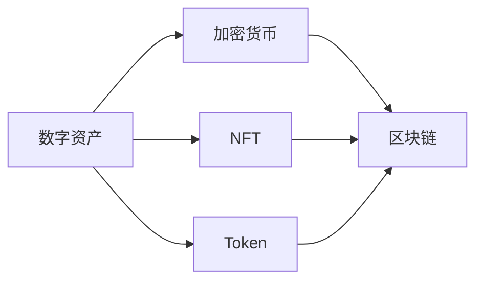

                 

# 程序员的财务自由：数字资产管理

在数字时代，程序员拥有独特的技能和视角，通过掌握数字资产管理的方法，可以更好地实现财务自由。本文将深入探讨程序员如何利用数字资产实现财务自由，包括数字资产的基本概念、管理策略、投资工具和风险规避措施。希望通过本文的学习，程序员可以更好地管理自己的财务，早日迈向财务自由。

## 1. 背景介绍

### 1.1 问题由来

随着数字技术的发展，程序员在数字资产领域有着天然的优势。程序员熟悉编程语言和技术栈，容易掌握数字资产管理工具和平台，同时具备较强的数据处理能力。然而，许多程序员往往没有系统的财务规划和管理经验，容易在数字资产管理上犯错误，导致资产缩水甚至亏损。

### 1.2 问题核心关键点

数字资产管理的核心关键点包括：
1. **理解数字资产**：理解区块链和加密货币等数字资产的基本概念和运作机制。
2. **分散投资**：避免过度集中投资，分散风险。
3. **长期持有**：理解数字资产的价值波动性，保持耐心，长期持有。
4. **风险管理**：通过技术手段和管理策略规避风险。
5. **税务规划**：了解数字资产税收政策，合理规划税务。

## 2. 核心概念与联系

### 2.1 核心概念概述

为更好地理解数字资产管理，本节将介绍几个关键概念：

- **数字资产**：包括加密货币（如比特币、以太坊等）、NFT（非同质化代币）、Token（通证）等，是存储于区块链上的电子资产。
- **区块链**：是一种去中心化的分布式账本技术，保障了数字资产的安全性和不可篡改性。
- **加密货币**：基于区块链技术，采用加密算法保障其安全性和匿名性。
- **NFT**：是一种独特的数字资产，每个NFT都有唯一的标识和所有权。
- **Token**：一种区块链上的数字代币，用于价值交换、记录事件等。

这些概念之间的逻辑关系可以通过以下Mermaid流程图来展示：



这个流程图展示了一系列数字资产的基本分类及其与区块链的关系。

## 3. 核心算法原理 & 具体操作步骤
### 3.1 算法原理概述

数字资产管理的基本原理是通过选择合适的资产种类、合理的分散投资和风险管理，实现资产增值。其核心算法包括：

1. **投资组合理论**：构建多样化的投资组合，分散投资风险。
2. **价值评估模型**：通过技术手段和市场分析，评估数字资产的价值。
3. **风险管理策略**：采用对冲、套期保值等策略，降低投资风险。
4. **税务规划**：了解数字资产税收政策，合理规划税务。

### 3.2 算法步骤详解

数字资产管理的步骤主要包括：

**Step 1: 理解数字资产**
- 学习区块链和加密货币等基本概念，了解其运作机制和特点。
- 掌握主要数字资产的信息和价值评估方法。

**Step 2: 分散投资**
- 根据风险承受能力和投资目标，选择合适的数字资产种类。
- 分散投资于不同的资产类别和区块链平台。

**Step 3: 价值评估**
- 使用技术手段和市场分析工具，评估数字资产的内在价值。
- 关注市场动态和行业趋势，及时调整投资策略。

**Step 4: 风险管理**
- 采用对冲、套期保值等策略，降低投资风险。
- 定期监控投资组合，及时调整仓位。

**Step 5: 税务规划**
- 了解数字资产税收政策，合理规划税务。
- 使用税务优化工具，降低税务成本。

### 3.3 算法优缺点

数字资产管理具有以下优点：
1. **高回报潜力**：数字资产具有较高的增值潜力，尤其在牛市中表现突出。
2. **分散风险**：通过多样化投资，分散风险，降低单资产波动对整体资产的影响。
3. **高流动性**：数字资产交易便捷，易于买卖和转移。
4. **透明性**：区块链的公开透明性，使得数字资产的记录和交易更加可追溯和可信。

同时，也存在以下缺点：
1. **波动性高**：数字资产价格波动大，容易引发较大风险。
2. **技术门槛**：需要较高的技术水平和风险管理能力。
3. **政策风险**：不同国家对数字资产的监管政策不同，可能带来政策风险。
4. **税务复杂**：数字资产的税务政策复杂，需要专业税务规划。

### 3.4 算法应用领域

数字资产管理的应用领域广泛，包括：
1. **个人财务规划**：利用数字资产实现个人财富增值，规划财务自由。
2. **企业投资管理**：企业可以通过数字资产投资，获取高回报。
3. **资产配置**：在传统金融资产和数字资产之间进行配置，优化资产组合。
4. **风险对冲**：利用数字资产进行风险对冲，保护现有资产。
5. **税务规划**：通过合理规划税务，降低数字资产交易成本。

## 4. 数学模型和公式 & 详细讲解 & 举例说明

### 4.1 数学模型构建

数字资产管理的数学模型主要包括投资组合理论、价值评估模型和风险管理策略。

假设某程序员有初始投资资金 $P$，投资于数字资产 $X_1, X_2, \ldots, X_n$，每个资产的初始投资比例为 $w_1, w_2, \ldots, w_n$，年化收益率为 $r_1, r_2, \ldots, r_n$。则投资组合的期望年化收益率为：

$$
r = \sum_{i=1}^n w_ir_i
$$

其中 $w_i$ 为资产 $X_i$ 的权重，$r_i$ 为资产 $X_i$ 的年化收益率。

### 4.2 公式推导过程

对于期望年化收益率的计算，可以使用Markowitz均值-方差模型进行推导。该模型假设资产收益率为正态分布，计算投资组合的期望收益率和方差，从而优化投资组合的权重分配。

设 $R_i$ 为资产 $X_i$ 的收益率，$\Sigma$ 为资产之间的协方差矩阵，则期望收益率和方差分别为：

$$
r = \sum_{i=1}^n w_iE(R_i)
$$

$$
\sigma^2 = \sum_{i=1}^n w_i^2\sigma_i^2 + 2\sum_{i=1}^n w_iw_j\rho_{ij}\sigma_i\sigma_j
$$

其中 $\sigma_i$ 为资产 $X_i$ 的波动率，$\rho_{ij}$ 为资产之间的相关系数。

通过求解优化问题，可以计算出最优的资产权重分配，从而实现投资组合的最大收益和最小风险。

### 4.3 案例分析与讲解

假设某程序员有初始投资资金 $P=100,000$，投资于比特币（Bitcoin）和以太坊（Ethereum），比特币的年化收益率为 $r_1=50\%$，以太坊的年化收益率为 $r_2=40\%$。假设比特币和以太坊之间的相关系数为 $\rho_{12}=0.5$，比特币和以太坊的波动率分别为 $\sigma_1=0.4$ 和 $\sigma_2=0.3$。

使用Markowitz均值-方差模型进行计算，期望年化收益率为：

$$
r = 0.5 \times 0.5 + 0.5 \times 0.4 = 0.45
$$

风险为：

$$
\sigma^2 = 0.5^2 \times 0.4^2 + 0.5^2 \times 0.3^2 + 2 \times 0.5 \times 0.5 \times 0.5 \times 0.3 \times 0.4 = 0.0225
$$

最优权重分配可以通过求解优化问题得出，在此省略计算过程。

## 5. 项目实践：代码实例和详细解释说明
### 5.1 开发环境搭建

在进行数字资产管理实践前，我们需要准备好开发环境。以下是使用Python进行区块链数据挖掘和数字资产管理的环境配置流程：

1. 安装Anaconda：从官网下载并安装Anaconda，用于创建独立的Python环境。

2. 创建并激活虚拟环境：
```bash
conda create -n blockchain-env python=3.8 
conda activate blockchain-env
```

3. 安装PyTorch、Pandas、NumPy等库：
```bash
pip install pytorch pandas numpy scipy
```

4. 安装CoinMarketCap API或Binance API：
```bash
pip install pycoinmarketcap
```

完成上述步骤后，即可在`blockchain-env`环境中开始数字资产管理实践。

### 5.2 源代码详细实现

下面我们以加密货币投资组合为例，给出使用Python进行数字资产管理的代码实现。

首先，定义加密货币数据获取函数：

```python
from pycoinmarketcap import Market

def get_crypto_price(crypto_list):
    market = Market()
    crypto_prices = []
    for crypto in crypto_list:
        crypto_price = market.get_crypto_price(crypto)
        crypto_prices.append(crypto_price)
    return crypto_prices
```

然后，定义投资组合的期望年化收益率的计算函数：

```python
def calculate_expected_return(weights, returns):
    expected_return = 0
    for i in range(len(weights)):
        expected_return += weights[i] * returns[i]
    return expected_return
```

接着，定义风险的计算函数：

```python
def calculate_risk(weights, returns, covariances):
    variance = 0
    for i in range(len(weights)):
        variance += weights[i] ** 2 * returns[i]
        for j in range(i+1, len(weights)):
            variance += 2 * weights[i] * weights[j] * covariances[i][j]
    return variance
```

最后，使用Markowitz模型进行投资组合优化：

```python
def optimize_portfolio(weights, returns, covariances, target_return):
    import scipy.optimize
    def objective(weights):
        expected_return = calculate_expected_return(weights, returns)
        risk = calculate_risk(weights, returns, covariances)
        return (target_return - expected_return) ** 2 / risk
    constraints = [{'type': 'eq', 'fun': lambda x: calculate_expected_return(x, returns) - target_return}]
    result = scipy.optimize.minimize(objective, weights, constraints=constraints)
    return result.x
```

完整代码如下：

```python
from pycoinmarketcap import Market
import numpy as np
import scipy.optimize

def get_crypto_price(crypto_list):
    market = Market()
    crypto_prices = []
    for crypto in crypto_list:
        crypto_price = market.get_crypto_price(crypto)
        crypto_prices.append(crypto_price)
    return crypto_prices

def calculate_expected_return(weights, returns):
    expected_return = 0
    for i in range(len(weights)):
        expected_return += weights[i] * returns[i]
    return expected_return

def calculate_risk(weights, returns, covariances):
    variance = 0
    for i in range(len(weights)):
        variance += weights[i] ** 2 * returns[i]
        for j in range(i+1, len(weights)):
            variance += 2 * weights[i] * weights[j] * covariances[i][j]
    return variance

def optimize_portfolio(weights, returns, covariances, target_return):
    def objective(weights):
        expected_return = calculate_expected_return(weights, returns)
        risk = calculate_risk(weights, returns, covariances)
        return (target_return - expected_return) ** 2 / risk
    constraints = [{'type': 'eq', 'fun': lambda x: calculate_expected_return(x, returns) - target_return}]
    result = scipy.optimize.minimize(objective, weights, constraints=constraints)
    return result.x
```

### 5.3 代码解读与分析

让我们再详细解读一下关键代码的实现细节：

**get_crypto_price函数**：
- 使用pycoinmarketcap库获取指定加密货币的市场价格。
- 输入加密货币列表，返回每个加密货币的市场价格。

**calculate_expected_return函数**：
- 计算投资组合的期望年化收益率。
- 输入资产权重和每个资产的年化收益率，计算加权平均年化收益率。

**calculate_risk函数**：
- 计算投资组合的风险。
- 输入资产权重、每个资产的年化收益率和协方差矩阵，计算组合的风险。

**optimize_portfolio函数**：
- 使用Markowitz均值-方差模型进行投资组合优化。
- 输入初始权重、每个资产的年化收益率和协方差矩阵，以及目标年化收益率。
- 定义目标函数，使用scipy.optimize库进行优化求解。

可以看到，Python配合NumPy、SciPy等库，可以方便地进行数字资产管理的数据计算和优化。开发者可以将更多精力放在模型设计、数据处理等高层逻辑上，而不必过多关注底层实现细节。

## 6. 实际应用场景
### 6.1 智能投顾

智能投顾是一种基于人工智能的资产管理服务，通过分析用户的财务状况和风险偏好，为其推荐最优的数字资产投资组合。智能投顾系统通常由以下模块组成：

- **用户画像生成**：通过问卷调查等方式，收集用户的个人信息、财务状况和风险偏好。
- **投资组合生成**：根据用户画像，使用Markowitz等模型生成最优投资组合。
- **实时监控**：通过API获取市场数据，实时监控投资组合表现，调整仓位。
- **税务规划**：根据税务政策，合理规划税务，降低税务成本。

智能投顾系统通过AI技术，帮助用户构建个性化的投资组合，实现财务自由的自动化管理。

### 6.2 加密货币交易平台

加密货币交易平台是数字资产管理的重要应用场景，通过提供便捷的交易、资产管理等功能，帮助用户进行数字资产的买卖和存储。交易平台通常包括以下功能：

- **交易系统**：提供买卖、交换等交易功能，支持多种加密货币。
- **资产管理**：提供冷钱包、热钱包等存储解决方案，保护资产安全。
- **市场分析**：提供实时市场数据和分析报告，帮助用户做出投资决策。
- **风险管理**：提供对冲、套期保值等风险管理工具，降低投资风险。

加密货币交易平台通过丰富的功能和服务，帮助用户实现数字资产的便捷管理和投资增值。

### 6.3 数字资产基金

数字资产基金是一种通过集合投资的方式，降低单个投资者风险的资产管理形式。数字资产基金通常由以下模块组成：

- **基金管理**：通过基金管理团队，进行基金的运营和投资决策。
- **风险控制**：通过分散投资、对冲等手段，降低基金风险。
- **资产配置**：通过量化模型，合理配置数字资产。
- **税务规划**：根据税务政策，合理规划税务，降低基金成本。

数字资产基金通过集合投资的方式，利用专业团队的管理经验和量化模型，降低单个投资者的风险，实现数字资产的稳健增值。

### 6.4 未来应用展望

随着数字资产管理的不断发展，未来将涌现更多创新应用，为程序员提供更加便捷和智能的财务管理工具：

- **智能合约**：通过区块链技术，实现自动化的数字资产管理。
- **去中心化交易所**：通过去中心化交易所，实现数字资产的无中心化交易。
- **NFT市场**：通过NFT市场，提供数字资产的展示、交易和所有权管理。
- **链上治理**：通过链上治理机制，实现数字资产管理的民主化和透明化。

这些创新应用将进一步提升数字资产管理的效率和安全性，为程序员实现财务自由提供更加可靠的工具。

## 7. 工具和资源推荐
### 7.1 学习资源推荐

为了帮助程序员掌握数字资产管理的方法，这里推荐一些优质的学习资源：

1. **《区块链原理与实践》**：深入浅出地介绍了区块链的基本概念和运作机制。
2. **《加密货币投资指南》**：提供加密货币投资策略和风险管理方法。
3. **Coursera的《区块链和加密货币》课程**：提供系统性的区块链和加密货币知识。
4. **Udacity的《数字资产管理》课程**：提供数字资产管理工具和平台的使用技巧。
5. **CoinMarketCap官方文档**：提供详细的区块链市场数据和API使用说明。

通过学习这些资源，程序员可以系统掌握数字资产管理的知识和技能，提升财务管理的水平。

### 7.2 开发工具推荐

高效的开发离不开优秀的工具支持。以下是几款用于数字资产管理开发的常用工具：

1. **Jupyter Notebook**：用于编写和运行Python代码，支持多种数据可视化库。
2. **PyCoinMarketCap**：提供区块链市场数据的API接口，方便数据获取和分析。
3. **Web3.js**：用于开发去中心化应用，支持以太坊等区块链平台。
4. **GitLab**：用于版本控制和项目管理，支持代码协作和持续集成。
5. **Blockchain Explorer**：用于分析和监控区块链交易数据。

合理利用这些工具，可以显著提升数字资产管理任务的开发效率，加快创新迭代的步伐。

### 7.3 相关论文推荐

数字资产管理的研究源于学界的持续研究。以下是几篇奠基性的相关论文，推荐阅读：

1. **《区块链技术综述》**：提供区块链技术的全面介绍和应用案例。
2. **《加密货币投资策略》**：提供加密货币投资策略和风险管理方法。
3. **《数字资产量化分析》**：提供数字资产的量化分析方法和优化模型。
4. **《去中心化金融(DeFi)》**：介绍去中心化金融的概念和技术实现。

这些论文代表了大资产管理技术的发展脉络。通过学习这些前沿成果，可以帮助程序员把握学科前进方向，激发更多的创新灵感。

## 8. 总结：未来发展趋势与挑战

### 8.1 总结

本文对数字资产管理的核心概念和操作步骤进行了详细阐述，通过实际应用场景的探讨，展示了数字资产管理的广阔前景和巨大潜力。通过学习本文，程序员可以更好地理解数字资产管理的原理和方法，掌握投资组合优化和风险管理技巧，为实现财务自由提供有力支持。

### 8.2 未来发展趋势

展望未来，数字资产管理将呈现以下几个发展趋势：

1. **智能合约**：通过区块链技术，实现自动化的数字资产管理。
2. **去中心化交易所**：通过去中心化交易所，实现数字资产的无中心化交易。
3. **NFT市场**：通过NFT市场，提供数字资产的展示、交易和所有权管理。
4. **链上治理**：通过链上治理机制，实现数字资产管理的民主化和透明化。

这些趋势凸显了大资产管理技术的创新和应用前景，将进一步推动数字资产管理的普及和应用。

### 8.3 面临的挑战

尽管数字资产管理技术已经取得了一定的成果，但在迈向更加智能化、普适化应用的过程中，它仍面临诸多挑战：

1. **市场波动性大**：数字资产价格波动大，容易引发较大风险。
2. **技术门槛高**：需要较高的技术水平和风险管理能力。
3. **政策风险高**：不同国家对数字资产的监管政策不同，可能带来政策风险。
4. **税务复杂**：数字资产的税务政策复杂，需要专业税务规划。

### 8.4 研究展望

面对数字资产管理所面临的挑战，未来的研究需要在以下几个方面寻求新的突破：

1. **提高市场透明度**：通过区块链技术，提高数字资产市场的透明度和信任度。
2. **降低投资门槛**：开发更加智能和友好的数字资产管理工具，降低投资门槛。
3. **优化风险管理**：开发更加精准的风险管理工具，降低投资风险。
4. **提升税务优化**：通过智能税务规划，降低数字资产交易成本。

这些研究方向将进一步推动数字资产管理技术的进步，为程序员实现财务自由提供更多助力。

## 9. 附录：常见问题与解答

**Q1：数字资产投资收益高，风险也高吗？**

A: 数字资产投资确实具有高回报潜力，但也伴随着高风险。数字资产价格波动大，容易引发较大风险。因此，需要制定合理的风险管理策略，分散投资，控制风险。

**Q2：如何选择适合自己的数字资产投资组合？**

A: 选择适合自己的数字资产投资组合需要考虑多方面因素，如风险承受能力、投资目标、市场趋势等。可以使用Markowitz均值-方差模型进行投资组合优化，获取最优的资产权重分配。

**Q3：如何规避数字资产投资风险？**

A: 规避数字资产投资风险需要采用多种策略，如分散投资、对冲、套期保值等。同时，需要定期监控市场动态，及时调整投资组合。

**Q4：数字资产投资需要掌握哪些技术？**

A: 数字资产投资需要掌握区块链、加密货币、量化分析等技术。同时，需要具备数据分析、风险管理等能力。

**Q5：数字资产投资需要了解哪些税务政策？**

A: 数字资产投资的税务政策复杂，需要了解不同国家和地区的数字资产税收政策，合理规划税务，降低税务成本。

这些问题的解答可以帮助程序员更好地理解数字资产管理的核心概念和操作步骤，掌握数字资产投资的策略和技巧。

---

作者：禅与计算机程序设计艺术 / Zen and the Art of Computer Programming

