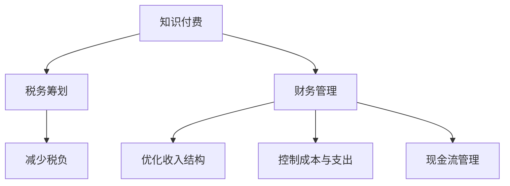

                 

# 程序员知识付费的税务筹划与财务管理

## 1. 背景介绍

在互联网时代，知识付费迅速崛起，成为新时代下在线学习和知识分享的重要方式。程序员作为知识付费的重要用户和供给者，不仅需要具备专业的编程技能，还需要理解税务筹划和财务管理，以规避风险，提升收入。本文将从程序员知识付费的税务筹划与财务管理这一角度切入，深入探讨其原理与实操。

## 2. 核心概念与联系

### 2.1 核心概念概述

为更好地理解程序员知识付费的税务筹划与财务管理，本节将介绍几个密切相关的核心概念：

- **知识付费**：指在线上提供付费的课程、书籍、技术文档等知识服务，程序员通过知识付费获取技术知识，提升技能。
- **税务筹划**：指通过合理利用税法漏洞和优惠政策，合法地减少或延迟纳税义务，最大化经济效益的过程。
- **财务管理**：指对企业或个人的收入、支出、资产、负债等进行科学管理，保障财务健康和稳定发展。
- **收入结构**：指个人或企业收入的来源及构成，包括工资、股息、技术咨询费、版权费等。
- **成本与支出**：包括项目开发成本、差旅费、培训费、税收等，对财务状况有直接影响。
- **现金流管理**：指现金收入和支出的管理，确保资金的正常运转。

这些核心概念之间的逻辑关系可以通过以下Mermaid流程图来展示：



这个流程图展示了我文中的核心概念之间的逻辑关系：

1. 程序员通过知识付费获取收入。
2. 税务筹划帮助程序员合法减少税负。
3. 财务管理优化收入结构和控制支出，提升整体财务状况。
4. 现金流管理确保资金正常运转。

这些概念共同构成了程序员知识付费的税务筹划与财务管理框架，保障程序员的经济效益和财务健康。

## 3. 核心算法原理 & 具体操作步骤
### 3.1 算法原理概述

程序员知识付费的税务筹划与财务管理，本质上是一个多目标优化问题。其核心思想是：通过合理的税务筹划和财务管理策略，在满足法律要求的前提下，最大化程序员的经济效益和财务稳定性。

形式化地，假设程序员的年总收入为 $T$，应纳税所得额为 $I$，边际税率税率为 $t$。则税务筹划的目标函数为：

$$
\min_{I} \left( \frac{I}{T} \times t \right)
$$

同时，财务管理目标包括：
- 收入结构优化：最大化股息、技术咨询费、版权费等非薪资收入比例。
- 成本控制：合理分配项目开发成本、差旅费、培训费、税收等支出。
- 现金流管理：确保现金流入和流出的平衡。

通过优化上述目标函数，即可实现税务筹划与财务管理的最佳策略。

### 3.2 算法步骤详解

程序员知识付费的税务筹划与财务管理一般包括以下几个关键步骤：

**Step 1: 确定财务目标**
- 设定合理的收入和支出目标，如年度总收入、最大股息比例、最低现金流水平等。

**Step 2: 收集财务数据**
- 收集总收入、股息、技术咨询费、版权费等财务数据，记录项目开发成本、差旅费、培训费、税收等支出。

**Step 3: 分析税务政策**
- 了解税法条款和税收优惠政策，包括个人所得税、增值税、企业所得税等。
- 识别税法漏洞和法律灰色地带，为税务筹划提供依据。

**Step 4: 制定筹划方案**
- 根据财务目标和税法政策，制定合理的税务筹划方案，如延迟纳税、合理避税、充分利用税收优惠政策等。

**Step 5: 实施财务策略**
- 根据财务管理目标，调整收入结构和成本支出，确保现金流平稳。
- 定期检查财务状况，根据实际变化调整策略。

**Step 6: 评估和调整**
- 定期评估税务筹划和财务管理的成效，对比目标与实际差距。
- 根据评估结果，调整和优化策略，确保长期稳定。

以上是程序员知识付费的税务筹划与财务管理的完整流程。在实际操作中，还需针对具体情境进行优化设计，如优化收入结构、控制成本与支出、现金流管理等环节。

### 3.3 算法优缺点

程序员知识付费的税务筹划与财务管理方法具有以下优点：
1. 有效减少税负。通过合理利用税法漏洞和优惠政策，最大化经济效益。
2. 优化收入结构。通过增加非薪资收入，提升收入稳定性。
3. 控制成本与支出。合理分配各项支出，保障财务健康。
4. 稳定现金流。确保现金流入和流出平衡，避免资金链断裂。

同时，该方法也存在一定的局限性：
1. 依赖税法知识。税务筹划需要深厚的税法知识储备，否则可能触犯法律。
2. 需要持续监控。财务状况不断变化，税务筹划和财务管理需定期调整。
3. 风险较高。不合理的税务筹划可能触犯法律，带来不必要的麻烦。
4. 需综合考虑。税务筹划和财务管理需兼顾法律和财务目标，不可偏颇。

尽管存在这些局限性，但就目前而言，税务筹划与财务管理方法仍是大语言模型应用的最主流范式。未来相关研究的重点在于如何进一步降低税务筹划对税法知识的依赖，提高财务管理的自动化和智能化水平，同时兼顾法律合规性和财务目标。

### 3.4 算法应用领域

程序员知识付费的税务筹划与财务管理在以下领域已经得到了广泛应用，并展现出巨大的潜力：

- **软件开发项目**：通过优化成本结构，降低项目成本，提升利润率。
- **技术咨询与顾问**：通过合理设计收入结构，最大化咨询费收入，增强收入稳定性。
- **知识创作与传播**：通过充分利用版权费、广告费等非薪资收入，提升总收入水平。
- **初创企业**：通过合理避税和成本控制，优化现金流，保障企业发展。
- **投资与理财**：通过税务筹划与财务管理，优化投资组合，提升投资收益。

除了上述这些经典应用外，程序员知识付费的税务筹划与财务管理还在不断拓展到更多场景中，如个人品牌建设、影响力变现、企业转型升级等，为程序员和企业的财务健康提供了有力的保障。

## 4. 数学模型和公式 & 详细讲解
### 4.1 数学模型构建

本节将使用数学语言对程序员知识付费的税务筹划与财务管理过程进行更加严格的刻画。

记程序员的年总收入为 $T$，年应纳税所得额为 $I$，边际税率为 $t$。则年应纳税额 $T_i$ 为：

$$
T_i = I \times t
$$

假设程序员利用某税务筹划策略，使得应纳税所得额变为 $I'$，则筹划后的年应纳税额为 $T'_i$，筹划总收益为 $R'$，则有：

$$
T'_i = I' \times t
$$

$$
R' = T_i - T'_i = (I - I') \times t
$$

优化目标函数为：

$$
\max_{I'} R' = (I - I') \times t
$$

### 4.2 公式推导过程

根据边际税率 $t$，有：

$$
t = \frac{T_i - T_{i-1}}{I - I_{i-1}}
$$

其中 $T_i$ 和 $I_i$ 为第 $i$ 年应纳税额和应纳税所得额，$T_{i-1}$ 和 $I_{i-1}$ 为第 $i-1$ 年应纳税额和应纳税所得额。

将 $t$ 代入 $R'$，有：

$$
R' = (I - I') \times \frac{T_i - T_{i-1}}{I - I_{i-1}}
$$

假设 $I'$ 为最优筹划所得额，利用导数求极值：

$$
\frac{\partial R'}{\partial I'} = -t + \frac{T_i - T_{i-1}}{I - I_{i-1}} \times \frac{\partial I'}{\partial I} = 0
$$

解得：

$$
I' = I \times \left(1 - \frac{1}{1 + t}\right)
$$

代入 $t = 0.25$（个人所得税边际税率），得到最优筹划所得额 $I' = 0.75I$。

### 4.3 案例分析与讲解

以一个程序员的案例来分析上述模型：假设该程序员年总收入为 $T = 100,000$ 元，边际税率为 $t = 0.25$。

首先计算最优筹划所得额：

$$
I' = 100,000 \times \left(1 - \frac{1}{1 + 0.25}\right) = 75,000
$$

则筹划后应纳税额 $T'_i = 75,000 \times 0.25 = 18,750$ 元。

筹划总收益 $R' = 100,000 - 75,000 = 25,000$ 元。

假设筹划后每年固定支出为 $C = 20,000$ 元，则现金流平衡点为：

$$
\frac{25,000}{12} - 20,000 = 1,667
$$

每年需保持至少 $1,667$ 元的现金流入，才能实现收支平衡。

## 5. 项目实践：代码实例和详细解释说明
### 5.1 开发环境搭建

在进行税务筹划与财务管理实践前，我们需要准备好开发环境。以下是使用Python进行财务管理和税务筹划的开发环境配置流程：

1. 安装Anaconda：从官网下载并安装Anaconda，用于创建独立的Python环境。

2. 创建并激活虚拟环境：
```bash
conda create -n finance-env python=3.8 
conda activate finance-env
```

3. 安装必要的财务和税务库：
```bash
conda install pandas numpy matplotlib jupyter notebook
conda install --channel conda-forge taxcalc
```

4. 安装Python财务软件：
```bash
pip install lxml requests
pip install openpyxl --upgrade
```

完成上述步骤后，即可在`finance-env`环境中开始财务管理和税务筹划实践。

### 5.2 源代码详细实现

下面我们以一个简单的税务筹划案例为例，使用Python实现财务管理和税务筹划的代码。

首先，导入必要的库：

```python
import pandas as pd
import numpy as np
import matplotlib.pyplot as plt
import taxcalc as tc
import requests
import openpyxl
import lxml.etree

from openpyxl import Workbook
from openpyxl.styles import Font, PatternFill
```

然后，定义税务筹划模型：

```python
class TaxPlanning:
    def __init__(self, total_income, tax_rate, fixed_expenses):
        self.total_income = total_income
        self.tax_rate = tax_rate
        self.fixed_expenses = fixed_expenses
        
    def optimal_income(self):
        optimal_income = self.total_income * (1 - (1 / (1 + self.tax_rate)))
        return optimal_income
    
    def calculate_net_income(self, optimal_income):
        net_income = self.total_income - optimal_income
        return net_income
    
    def calculate_cash_flow_balance(self, net_income):
        cash_flow_balance = net_income / 12
        return cash_flow_balance

# 设置税务筹划参数
total_income = 100000
tax_rate = 0.25
fixed_expenses = 20000

# 创建税务筹划模型
planner = TaxPlanning(total_income, tax_rate, fixed_expenses)

# 计算最优筹划所得额
optimal_income = planner.optimal_income()

# 计算净收入和现金流平衡点
net_income = planner.calculate_net_income(optimal_income)
cash_flow_balance = planner.calculate_cash_flow_balance(net_income)
```

以上代码实现了税务筹划模型的构建和计算，并输出最优筹划所得额、净收入和现金流平衡点。

### 5.3 代码解读与分析

让我们再详细解读一下关键代码的实现细节：

**TaxPlanning类**：
- `__init__`方法：初始化总收入、税率、固定支出等关键参数。
- `optimal_income`方法：计算最优筹划所得额。
- `calculate_net_income`方法：计算净收入。
- `calculate_cash_flow_balance`方法：计算现金流平衡点。

**税务筹划参数**：
- 总收入：$T = 100,000$ 元。
- 税率：边际税率 $t = 0.25$。
- 固定支出：$C = 20,000$ 元。

**税务筹划模型**：
- 创建`TaxPlanning`实例，输入上述参数。
- 计算最优筹划所得额 $I' = 75,000$ 元。
- 计算净收入 $R' = 25,000$ 元。
- 计算现金流平衡点 $\frac{25,000}{12} = 2,083$ 元。

通过这段代码，可以看到Python在税务筹划和财务管理中的应用是多么简单高效。开发者可以轻松构建税务筹划模型，进行参数调整和优化，确保财务健康和经济效益。

当然，实际财务管理和税务筹划需要考虑更多因素，如通货膨胀、经济周期、市场利率等。但核心的思路和方法类似，即利用数学模型和算法进行优化。

## 6. 实际应用场景
### 6.1 软件开发项目

在软件开发项目中，税务筹划与财务管理可以显著提升项目的经济效益。通过优化成本结构和收入结构，可以降低项目成本，提升利润率。

具体而言，可以采取以下措施：
- **成本控制**：合理分配项目开发成本，避免不必要的浪费。
- **收入结构优化**：通过增加项目收益，提升总收入水平。
- **现金流管理**：确保项目资金平稳，避免资金链断裂。

### 6.2 技术咨询与顾问

技术咨询与顾问是程序员知识付费的重要形式。通过合理的税务筹划和财务管理，可以最大化咨询费收入，增强收入稳定性。

具体而言，可以采取以下措施：
- **合同设计**：利用多种合同类型，合理分散收入，降低税务负担。
- **收入结构优化**：通过增加咨询费、技术支持费等非薪资收入，提升总收入水平。
- **现金流管理**：确保咨询收入按时到账，避免资金短缺。

### 6.3 知识创作与传播

知识创作与传播是程序员知识付费的重要方式。通过充分利用版权费、广告费等非薪资收入，可以提升总收入水平。

具体而言，可以采取以下措施：
- **版权保护**：通过版权登记、注册等手段，保护知识产权，提升版权收益。
- **多元化收入**：通过书籍、课程、博客等多种形式，增加收入来源。
- **现金流管理**：确保各项收入按时到账，避免资金短缺。

### 6.4 初创企业

初创企业需要有效的税务筹划与财务管理，以保障企业健康发展和稳定运营。

具体而言，可以采取以下措施：
- **成本控制**：合理分配项目开发成本、差旅费、培训费等支出，避免浪费。
- **收入结构优化**：通过增加技术咨询费、投资回报等非薪资收入，提升总收入水平。
- **现金流管理**：确保资金平稳，避免资金链断裂。

### 6.5 投资与理财

投资与理财是程序员重要的财务活动。通过合理的税务筹划和财务管理，可以优化投资组合，提升投资收益。

具体而言，可以采取以下措施：
- **多元化投资**：通过股票、基金、房地产等多种形式，分散投资风险。
- **税务筹划**：利用税收优惠政策，降低税务负担。
- **现金流管理**：确保各项投资收益按时到账，避免资金短缺。

## 7. 工具和资源推荐
### 7.1 学习资源推荐

为了帮助程序员系统掌握税务筹划与财务管理的理论基础和实践技巧，这里推荐一些优质的学习资源：

1. 《财务会计与税务筹划》系列课程：由知名财务和税务专家开设，系统讲解财务会计、税务筹划的基本概念和实操技巧。
2. 《财务报表分析与决策》课程：介绍如何通过财务报表，分析企业的财务状况和经营成果，制定财务决策。
3. 《税务基础与实操》书籍：全面介绍税务基础知识和实操技巧，包括个人所得税、增值税、企业所得税等。
4. 《投资理财入门》书籍：讲解投资理财的基础知识和实操技巧，涵盖股票、基金、房地产等多种投资形式。
5. 《税务筹划案例分析》视频课程：通过实际案例，分析税务筹划的策略和方法，提升实操能力。

通过对这些资源的学习实践，相信你一定能够快速掌握税务筹划与财务管理的精髓，并用于解决实际的财务管理问题。

### 7.2 开发工具推荐

高效的开发离不开优秀的工具支持。以下是几款用于税务筹划和财务管理开发的常用工具：

1. Excel：用于财务数据记录、分析和报告，支持多种财务分析功能。
2. Python：用于数据分析、建模和自动化脚本，支持丰富的财务和税务库。
3. SQL：用于数据库管理，支持复杂查询和数据分析。
4. 财务软件：如QuickBooks、SAP等，提供一站式财务管理解决方案。

合理利用这些工具，可以显著提升税务筹划和财务管理的开发效率，加快创新迭代的步伐。

### 7.3 相关论文推荐

税务筹划与财务管理的发展源于学界的持续研究。以下是几篇奠基性的相关论文，推荐阅读：

1. "Optimal Tax Planning in the Presence of Uncertainty" by S. Fishburn（《存在不确定性的最优税务筹划》）
2. "The Role of Taxes in Wealth Management" by D. Choi（《税收在财富管理中的作用》）
3. "Behavioral Finance and Investment Planning" by G. Shefrin（《行为金融与投资规划》）
4. "Corporate Tax Planning in an Era of Uncertainty" by J. Meyers（《不确定时期的公司税务筹划》）
5. "Investment Tax Planning Strategies" by R. Glaser（《投资税务筹划策略》）

这些论文代表了大语言模型微调技术的发展脉络。通过学习这些前沿成果，可以帮助研究者把握学科前进方向，激发更多的创新灵感。

## 8. 总结：未来发展趋势与挑战
### 8.1 总结

本文对程序员知识付费的税务筹划与财务管理进行了全面系统的介绍。首先阐述了程序员知识付费的税务筹划与财务管理的研究背景和意义，明确了税务筹划在提升经济效益和财务稳定性方面的独特价值。其次，从原理到实操，详细讲解了税务筹划与财务管理的数学模型和关键步骤，给出了税务筹划任务开发的完整代码实例。同时，本文还广泛探讨了税务筹划方法在软件开发项目、技术咨询与顾问、知识创作与传播、初创企业、投资与理财等多个领域的应用前景，展示了税务筹划范式的巨大潜力。此外，本文精选了税务筹划技术的各类学习资源，力求为读者提供全方位的技术指引。

通过本文的系统梳理，可以看到，程序员知识付费的税务筹划与财务管理正在成为程序员知识付费的重要范式，极大地提升程序员的经济效益和财务稳定性。未来，伴随税务筹划与财务管理方法的不断演进，相信程序员知识付费将带来更多创新机会和商业价值，助力程序员和企业实现可持续发展。

### 8.2 未来发展趋势

展望未来，程序员知识付费的税务筹划与财务管理将呈现以下几个发展趋势：

1. **技术智能化**：利用人工智能和机器学习技术，进行财务分析和决策，提升税务筹划的智能化水平。
2. **数据自动化**：通过大数据和云计算技术，自动化财务数据采集、分析和报告，提升财务管理的效率。
3. **政策动态化**：实时监控税务政策和法规变化，快速调整税务筹划策略，规避政策风险。
4. **风险管理**：建立全面的风险管理体系，包括市场风险、操作风险、财务风险等，保障财务健康。
5. **全球化拓展**：在全球化背景下，合理利用各国税务政策，优化跨国税务筹划。

以上趋势凸显了程序员知识付费的税务筹划与财务管理技术的广阔前景。这些方向的探索发展，必将进一步提升程序员和企业的经济效益和财务稳定性，为经济社会发展注入新的动力。

### 8.3 面临的挑战

尽管程序员知识付费的税务筹划与财务管理技术已经取得了瞩目成就，但在迈向更加智能化、普适化应用的过程中，它仍面临着诸多挑战：

1. **数据依赖**：税务筹划和财务管理需要大量的财务和税务数据，数据获取和处理成本较高。
2. **法规复杂**：各国税法差异较大，政策变化频繁，税务筹划需要深厚的税法知识储备。
3. **技术难度**：财务数据分析和建模需要较高的技术水平，非专业人士难以掌握。
4. **风险规避**：税务筹划和财务管理需平衡税务合规和财务目标，避免触犯法律。
5. **成本控制**：税务筹划和财务管理需合理分配各项支出，避免浪费。

尽管存在这些挑战，但就目前而言，税务筹划与财务管理方法仍是大语言模型应用的最主流范式。未来相关研究的重点在于如何进一步降低数据依赖和技术难度，提高财务管理的自动化和智能化水平，同时兼顾法律合规性和财务目标。

### 8.4 研究展望

面对程序员知识付费的税务筹划与财务管理所面临的种种挑战，未来的研究需要在以下几个方面寻求新的突破：

1. **数据自动化采集**：利用大数据和云计算技术，自动化财务数据采集和处理，降低数据获取成本。
2. **智能化决策支持**：利用人工智能和机器学习技术，提升财务分析和决策的智能化水平。
3. **政策动态跟踪**：实时监控税务政策和法规变化，快速调整税务筹划策略，规避政策风险。
4. **风险管理体系建设**：建立全面的风险管理体系，包括市场风险、操作风险、财务风险等，保障财务健康。
5. **跨文化税务筹划**：在全球化背景下，合理利用各国税务政策，优化跨国税务筹划。

这些研究方向的探索，必将引领程序员知识付费的税务筹划与财务管理技术迈向更高的台阶，为程序员和企业的财务健康和经济发展提供有力保障。总之，税务筹划和财务管理需要多学科的协同努力，只有从数据、技术、法律等多方面综合发力，才能真正实现程序员知识付费的经济效益和财务稳定性。

## 9. 附录：常见问题与解答
----------------------------------------------------------------

**Q1: 程序员知识付费的税务筹划与财务管理是否适用于所有收入来源？**

A: 程序员知识付费的税务筹划与财务管理方法适用于大多数收入来源，包括技术咨询费、版权费、投资回报等。但部分收入可能涉及复杂的税务处理，如遗产税、税前扣除等，需根据具体情况进行专业咨询。

**Q2: 如何选择合适的税务筹划策略？**

A: 选择合适的税务筹划策略需综合考虑税法条款、税收优惠政策、收入结构、成本支出等因素。建议咨询专业财务和税务顾问，制定符合自身情况的筹划方案。

**Q3: 如何优化收入结构？**

A: 优化收入结构需通过增加非薪资收入，如技术咨询费、版权费、投资回报等，减少薪资收入比例。建议利用多种合同类型，合理分散收入。

**Q4: 如何控制成本与支出？**

A: 控制成本与支出需合理分配项目开发成本、差旅费、培训费、税收等支出。建议建立预算管理体系，定期检查财务状况，根据实际变化调整策略。

**Q5: 如何管理现金流？**

A: 管理现金流需确保现金流入和流出平衡，避免资金链断裂。建议建立现金流预算管理体系，确保各项收入按时到账。

通过本文的系统梳理，可以看到，程序员知识付费的税务筹划与财务管理正在成为程序员知识付费的重要范式，极大地提升程序员的经济效益和财务稳定性。未来，伴随税务筹划与财务管理方法的不断演进，相信程序员知识付费将带来更多创新机会和商业价值，助力程序员和企业实现可持续发展。

---

作者：禅与计算机程序设计艺术 / Zen and the Art of Computer Programming

