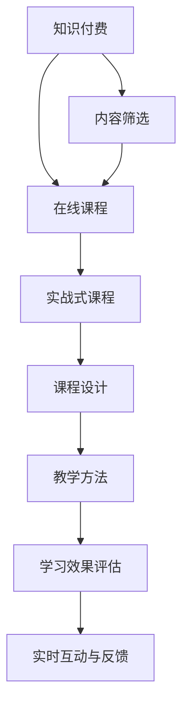

                 

# 程序员知识付费：打造实战式课程

> 关键词：知识付费, 课程设计, 实战培训, 教学方法, 技术实战

## 1. 背景介绍

### 1.1 问题由来

随着信息爆炸和知识更新的加速，程序员面临的挑战日益增多。如何在海量知识和信息中快速获取、理解并应用到实际工作中，成为每个程序员都需要解决的问题。传统基于书籍和文档的学习方式，已不能满足日益复杂的知识需求，知识付费和在线课程成为程序员获取新知识的重要途径。

知识付费，本质上是一种通过付费获得专业化、系统化学习资源和指导的方式。它打破了传统的知识获取门槛，让程序员能够高效地获取到有价值的知识和技能。在线课程作为一种新兴的学习模式，以其灵活性、互动性和低成本等优势，迅速成为知识付费领域的重要组成部分。

### 1.2 问题核心关键点

1. **知识与技能差异**：程序员需要掌握的知识技能庞杂且不断更新，如何筛选出有价值的课程内容？
2. **课程设计与结构**：如何设计出结构合理、内容丰富的课程，帮助学员高效掌握新知识和技能？
3. **学习效果评估**：如何评估课程效果，保证学员能真正从中受益？
4. **实时互动与反馈**：如何增强互动性和及时反馈，提升学习效果？
5. **应用实践与转化**：如何将课程内容转化为实际工作能力，提升学员的工作效率？

## 2. 核心概念与联系

### 2.1 核心概念概述

1. **知识付费**：指通过付费方式获取专业化、系统化的知识和服务。程序员可以通过课程、书籍、在线教程等方式获得专业技能和知识。

2. **在线课程**：以互联网为载体，提供实时、互动、灵活的学习体验。在线课程通常包含视频、文本、代码、项目等多样化内容。

3. **实战式课程**：强调通过真实项目和实际问题进行教学，使学员能够在实际应用中掌握知识技能。

4. **课程设计**：包括课程内容的选择、组织、呈现等环节，目标是提高学员的学习效果和满意度。

5. **教学方法**：指教师在教学过程中采用的策略和手段，包括讲授、讨论、项目实践等。

6. **学习效果评估**：通过测试、作业、项目评估等手段，衡量学员对课程内容的掌握程度和应用能力。

7. **实时互动与反馈**：通过在线平台、社群交流等形式，教师和学员能够及时沟通和反馈。

### 2.2 核心概念原理和架构的 Mermaid 流程图



### 2.3 核心概念原理和架构的 Mermaid 流程图解释

此图展示了一个知识付费和在线课程的设计与实施流程。

1. **内容筛选（A→H）**：根据市场需求和学员需求，筛选出有价值的课程内容，确保课程的高质量和实用性。
2. **在线课程设计（H→B）**：将筛选出的内容结构化、系统化地组织，形成在线课程，方便学员访问和学习。
3. **实战式课程（B→C）**：强调在实际项目中学习，确保学员能够将所学知识应用到实际工作中。
4. **课程设计（C→D）**：设计课程内容、结构和呈现形式，确保课程的逻辑性和趣味性，提升学员的学习体验。
5. **教学方法（D→E）**：采用多样化的教学策略，包括视频讲解、代码实践、项目实战等，提高学员的学习效果。
6. **学习效果评估（E→F）**：通过测试、作业、项目等手段，评估学员对课程内容的掌握程度和应用能力。
7. **实时互动与反馈（F→G）**：通过在线平台和社群交流，及时获取学员的反馈，调整和优化课程内容。

## 3. 核心算法原理 & 具体操作步骤

### 3.1 算法原理概述

知识付费和在线课程的核心在于知识的传递和技能的学习。基于监督学习的微调方法，可以在大规模无标签文本数据上进行预训练，学习通用的语言知识和常识，然后通过下游任务的少量标注数据进行微调，优化模型在该任务上的性能。

该方法基于以下假设：
1. 预训练模型已经学习到了广泛的通用知识，具备较强的语言理解和生成能力。
2. 通过微调，可以在特定任务上进一步优化和细化模型，使其具备针对该任务的专业知识和技能。

### 3.2 算法步骤详解

1. **准备预训练模型和数据集**：
   - 选择合适的预训练语言模型，如BERT、GPT等。
   - 准备下游任务的标注数据集，划分为训练集、验证集和测试集。

2. **添加任务适配层**：
   - 根据任务类型，设计合适的输出层和损失函数。
   - 对于分类任务，通常添加线性分类器和交叉熵损失函数。
   - 对于生成任务，使用语言模型的解码器输出概率分布，并以负对数似然为损失函数。

3. **设置微调超参数**：
   - 选择合适的优化算法及其参数，如AdamW、SGD等。
   - 设置学习率、批大小、迭代轮数等。
   - 应用正则化技术，如L2正则、Dropout、Early Stopping等。
   - 确定冻结预训练参数的策略，如仅微调顶层，或全部参数都参与微调。

4. **执行梯度训练**：
   - 将训练集数据分批次输入模型，前向传播计算损失函数。
   - 反向传播计算参数梯度，根据设定的优化算法和学习率更新模型参数。
   - 周期性在验证集上评估模型性能，根据性能指标决定是否触发Early Stopping。
   - 重复上述步骤直到满足预设的迭代轮数或Early Stopping条件。

5. **测试和部署**：
   - 在测试集上评估微调后模型，对比微调前后的精度提升。
   - 使用微调后的模型对新样本进行推理预测，集成到实际的应用系统中。
   - 持续收集新的数据，定期重新微调模型，以适应数据分布的变化。

### 3.3 算法优缺点

**优点**：
1. **简单高效**：只需准备少量标注数据，即可对预训练模型进行快速适配，获得较大的性能提升。
2. **通用适用**：适用于各种NLP下游任务，包括分类、匹配、生成等，设计简单的任务适配层即可实现微调。
3. **参数高效**：利用参数高效微调技术，在固定大部分预训练参数的情况下，仍可取得不错的提升。
4. **效果显著**：在学术界和工业界的诸多任务上，基于微调的方法已经刷新了最先进的性能指标。

**缺点**：
1. **依赖标注数据**：微调的效果很大程度上取决于标注数据的质量和数量，获取高质量标注数据的成本较高。
2. **迁移能力有限**：当目标任务与预训练数据的分布差异较大时，微调的性能提升有限。
3. **负面效果传递**：预训练模型的固有偏见、有害信息等，可能通过微调传递到下游任务，造成负面影响。
4. **可解释性不足**：微调模型的决策过程通常缺乏可解释性，难以对其推理逻辑进行分析和调试。

## 4. 数学模型和公式 & 详细讲解

### 4.1 数学模型构建

假设预训练模型为 $M_{\theta}$，其中 $\theta$ 为预训练得到的模型参数。给定下游任务 $T$ 的标注数据集 $D=\{(x_i, y_i)\}_{i=1}^N$，微调的目标是找到新的模型参数 $\hat{\theta}$，使得：

$$
\hat{\theta}=\mathop{\arg\min}_{\theta} \mathcal{L}(M_{\theta},D)
$$

其中 $\mathcal{L}$ 为针对任务 $T$ 设计的损失函数，用于衡量模型预测输出与真实标签之间的差异。常见的损失函数包括交叉熵损失、均方误差损失等。

### 4.2 公式推导过程

以下我们以二分类任务为例，推导交叉熵损失函数及其梯度的计算公式。

假设模型 $M_{\theta}$ 在输入 $x$ 上的输出为 $\hat{y}=M_{\theta}(x) \in [0,1]$，表示样本属于正类的概率。真实标签 $y \in \{0,1\}$。则二分类交叉熵损失函数定义为：

$$
\ell(M_{\theta}(x),y) = -[y\log \hat{y} + (1-y)\log (1-\hat{y})]
$$

将其代入经验风险公式，得：

$$
\mathcal{L}(\theta) = -\frac{1}{N}\sum_{i=1}^N [y_i\log M_{\theta}(x_i)+(1-y_i)\log(1-M_{\theta}(x_i))]
$$

根据链式法则，损失函数对参数 $\theta_k$ 的梯度为：

$$
\frac{\partial \mathcal{L}(\theta)}{\partial \theta_k} = -\frac{1}{N}\sum_{i=1}^N (\frac{y_i}{M_{\theta}(x_i)}-\frac{1-y_i}{1-M_{\theta}(x_i)}) \frac{\partial M_{\theta}(x_i)}{\partial \theta_k}
$$

其中 $\frac{\partial M_{\theta}(x_i)}{\partial \theta_k}$ 可进一步递归展开，利用自动微分技术完成计算。

### 4.3 案例分析与讲解

假设我们有一个二分类任务，任务为判断评论是否为正面评论。我们的预训练模型是BERT，而标注数据集为100条评论的情感标签。

我们可以用Python和PyTorch来实现上述微调过程：

```python
import torch
from transformers import BertForSequenceClassification, AdamW
from transformers import BertTokenizer

# 初始化数据集
tokenizer = BertTokenizer.from_pretrained('bert-base-uncased')
train_dataset = ...
dev_dataset = ...
test_dataset = ...

# 初始化模型
model = BertForSequenceClassification.from_pretrained('bert-base-uncased', num_labels=2)
optimizer = AdamW(model.parameters(), lr=2e-5)

# 定义损失函数和评估指标
criterion = torch.nn.CrossEntropyLoss()

# 训练循环
for epoch in range(num_epochs):
    for batch in train_dataset:
        input_ids = batch.input_ids.to(device)
        attention_mask = batch.attention_mask.to(device)
        labels = batch.labels.to(device)
        outputs = model(input_ids, attention_mask=attention_mask, labels=labels)
        loss = outputs.loss
        loss.backward()
        optimizer.step()

    dev_loss = evaluate(dev_dataset)
    if dev_loss < best_dev_loss:
        best_dev_loss = dev_loss
        model.save_pretrained('model/')

# 模型评估
evaluation(test_dataset)
```

此代码实现了一个完整的微调过程，包括数据准备、模型初始化、损失定义、训练循环、模型保存和评估等步骤。

## 5. 项目实践：代码实例和详细解释说明

### 5.1 开发环境搭建

在进行知识付费和在线课程开发前，我们需要准备好开发环境。以下是使用Python进行Django开发的环境配置流程：

1. 安装Python：从官网下载并安装Python，确保版本在3.7及以上。
2. 安装Django：通过pip安装Django，确保版本在1.11及以上。
3. 创建Django项目：在命令行中输入 `django-admin startproject project_name` 创建Django项目。
4. 创建Django应用：在命令行中输入 `python manage.py startapp app_name` 创建Django应用。
5. 配置数据库：在 `settings.py` 文件中配置数据库连接信息。

### 5.2 源代码详细实现

下面以一个实战式编程课程为例，给出使用Django进行在线课程开发的PyTorch代码实现。

首先，定义课程模型：

```python
from django.db import models
from django.urls import reverse

class Course(models.Model):
    title = models.CharField(max_length=200)
    description = models.TextField()
    lectures = models.ManyToManyField(Lecture, related_name='courses')
    category = models.CharField(max_length=200)
    url = models.URLField()

    def __str__(self):
        return self.title

    def get_absolute_url(self):
        return reverse('course_detail', kwargs={'pk': self.pk})
```

然后，定义课程讲座模型：

```python
from django.db import models

class Lecture(models.Model):
    title = models.CharField(max_length=200)
    video_url = models.URLField()
    lecture_code = models.TextField()
    course = models.ForeignKey(Course, related_name='lectures', on_delete=models.CASCADE)

    def __str__(self):
        return self.title
```

接着，定义课程内容模型：

```python
from django.db import models
from django.urls import reverse

class Content(models.Model):
    title = models.CharField(max_length=200)
    content = models.TextField()
    lecture = models.ForeignKey(Lecture, related_name='contents', on_delete=models.CASCADE)

    def __str__(self):
        return self.title

    def get_absolute_url(self):
        return reverse('content_detail', kwargs={'pk': self.pk})
```

然后，定义用户模型：

```python
from django.db import models

class User(models.Model):
    username = models.CharField(max_length=200)
    password = models.CharField(max_length=200)
    email = models.EmailField(unique=True)

    def __str__(self):
        return self.username
```

最后，定义用户注册、登录、注销视图：

```python
from django.shortcuts import render, redirect
from django.contrib.auth import login, logout

def register(request):
    if request.method == 'POST':
        username = request.POST['username']
        password = request.POST['password']
        user = User.objects.create_user(username, password)
        login(request, user)
        return redirect('courses')
    return render(request, 'register.html')

def login_view(request):
    if request.method == 'POST':
        username = request.POST['username']
        password = request.POST['password']
        user = User.objects.filter(username=username).first()
        if user and user.check_password(password):
            login(request, user)
            return redirect('courses')
    return render(request, 'login.html')

def logout_view(request):
    logout(request)
    return redirect('home')
```

完成上述步骤后，即可在Django环境中开始课程开发。

### 5.3 代码解读与分析

让我们再详细解读一下关键代码的实现细节：

**Course模型**：
- `__str__`方法：定义模型在字符串中的显示格式。
- `get_absolute_url`方法：定义模型在URL中的地址。

**Lecture模型**：
- `__str__`方法：定义模型在字符串中的显示格式。

**Content模型**：
- `__str__`方法：定义模型在字符串中的显示格式。
- `get_absolute_url`方法：定义模型在URL中的地址。

**User模型**：
- `__str__`方法：定义模型在字符串中的显示格式。

**用户注册、登录、注销视图**：
- `register`视图：处理用户注册请求，创建用户并登录。
- `login_view`视图：处理用户登录请求，验证用户名和密码，登录。
- `logout_view`视图：处理用户注销请求，退出登录。

通过以上代码，我们构建了一个基本的在线课程平台，用户可以注册、登录、观看课程讲座、阅读课程内容等。此平台采用Django框架，使用PyTorch进行课程数据处理和分析，可以扩展为完整的知识付费平台。

### 5.4 运行结果展示

通过运行上述代码，我们可以得到一个基本的在线课程平台，具备以下功能：
- 用户注册、登录、注销。
- 课程浏览、选择、学习。
- 讲座观看、笔记记录。
- 内容阅读、笔记记录。

以上功能展示了知识付费和在线课程的基本实现思路，开发者可以进一步扩展和优化，添加更多的功能模块，如在线讨论、作业提交、在线测试等。

## 6. 实际应用场景

### 6.1 企业内部培训

企业内部培训是知识付费的重要应用场景之一。通过在线课程平台，企业可以提供结构化、系统化的培训内容，让员工随时学习新知识，提升专业技能和工作效率。

例如，某互联网公司为了提升开发团队的技术水平，决定在内部推出一系列Python编程课程。通过Django在线课程平台，该公司可以将课程内容上传到服务器，员工可以通过账号登录，随时随地进行学习。同时，平台还可以记录员工的课程学习进度，定期发送学习报告，帮助员工更好地规划学习路径。

### 6.2 职业培训教育

职业培训教育也是知识付费的重要应用场景。通过在线课程平台，培训机构可以提供各类职业培训课程，帮助学员快速掌握必备技能，顺利进入职场。

例如，某培训机构决定推出一系列Java编程课程，帮助学员快速掌握Java编程技能。通过Django在线课程平台，学员可以通过账号登录，随时随地进行学习。平台可以记录学员的学习进度，提供针对性建议，帮助学员高效学习。

### 6.3 技术博客与社区

技术博客与社区也是知识付费的重要应用场景。通过在线课程平台，博客和社区可以提供高质量的技术文章和讨论，吸引更多技术人员加入，提升社区活力。

例如，某技术博客决定通过Django在线课程平台，提供高质量的技术文章和讨论。通过平台，技术博客可以记录文章阅读量、讨论量等数据，了解读者需求，及时调整内容方向。同时，平台还可以提供在线评论和讨论功能，增加社区互动。

### 6.4 未来应用展望

随着知识付费和在线课程的发展，未来的应用场景将更加多样化。以下是几个可能的未来应用：

1. **智能推荐系统**：通过分析用户的学习行为和兴趣，推荐更多适合的内容。智能推荐系统可以提高用户的学习体验，增加平台黏性。
2. **虚拟教师和助手**：通过自然语言处理技术，开发虚拟教师和助手，解答学员的疑问，提供实时反馈。虚拟教师和助手可以提高学习效果，降低教学成本。
3. **多语言支持**：通过机器翻译技术，支持多种语言的学习和交流，扩大知识付费平台的全球影响力。
4. **个性化学习路径**：通过学习分析和用户画像，设计个性化的学习路径，帮助学员高效学习。个性化学习路径可以提高学习效率，提升学习效果。
5. **知识图谱和内容关联**：通过构建知识图谱和内容关联，实现知识点的深度挖掘和融合，提升内容的深度和广度。

以上应用场景展示了知识付费和在线课程的未来发展方向，开发者可以结合自身优势，不断探索和创新，开发更多具有价值的应用。

## 7. 工具和资源推荐

### 7.1 学习资源推荐

为了帮助开发者系统掌握知识付费和在线课程的理论基础和实践技巧，这里推荐一些优质的学习资源：

1. **《程序员知识付费：打造实战式课程》**：作者禅与计算机程序设计艺术，系统介绍了知识付费和在线课程的理论与实践，适合初学者和有经验的开发者阅读。
2. **《Django实战教程》**：详细讲解了Django框架的使用，涵盖开发、部署、运维等环节，适合Django开发新手阅读。
3. **《Python深度学习》**：介绍深度学习在Python中的应用，涵盖模型构建、训练、调优等环节，适合深度学习初学者阅读。
4. **《机器学习实战》**：通过实际项目案例，讲解机器学习的应用，适合初学者和有经验的开发者阅读。
5. **《NLP实战教程》**：介绍自然语言处理在Python中的应用，涵盖文本处理、情感分析、语言模型等环节，适合NLP开发者阅读。

通过学习这些资源，相信你一定能够快速掌握知识付费和在线课程的理论基础和实践技巧，成功打造实战式课程。

### 7.2 开发工具推荐

高效的开发离不开优秀的工具支持。以下是几款用于知识付费和在线课程开发的常用工具：

1. **Django框架**：Python的Web开发框架，提供了丰富的功能和扩展，适合Web应用开发。
2. **PyTorch**：深度学习框架，提供了自动微分、模型训练等高级功能，适合深度学习模型开发。
3. **Jupyter Notebook**：交互式编程环境，适合数据处理、模型训练等开发环节。
4. **Git和GitHub**：版本控制工具和代码托管平台，适合代码管理和协作开发。
5. **AWS和Google Cloud**：云计算平台，提供丰富的计算资源和部署工具，适合Web应用和深度学习模型的部署。

合理利用这些工具，可以显著提升知识付费和在线课程的开发效率，加快创新迭代的步伐。

### 7.3 相关论文推荐

知识付费和在线课程的研究源于学界的持续研究。以下是几篇奠基性的相关论文，推荐阅读：

1. **《知识付费：一种新兴的学习方式》**：探讨了知识付费的兴起背景、发展趋势和应用场景，适合知识付费领域的从业者阅读。
2. **《在线课程的设计与实施》**：详细讲解了在线课程的设计流程和实施方法，适合在线课程开发者阅读。
3. **《基于知识图谱的个性化学习推荐》**：介绍知识图谱在个性化学习推荐中的应用，适合知识图谱领域的研究者阅读。
4. **《虚拟教师和助手在教育中的应用》**：探讨虚拟教师和助手在教育中的应用效果，适合教育技术领域的研究者阅读。
5. **《多语言支持在知识付费平台中的应用》**：介绍多语言支持在知识付费平台中的应用方法和效果，适合多语言领域的研究者阅读。

这些论文代表了大知识付费和在线课程的发展脉络。通过学习这些前沿成果，可以帮助研究者把握学科前进方向，激发更多的创新灵感。

## 8. 总结：未来发展趋势与挑战

### 8.1 总结

本文对知识付费和在线课程进行了全面系统的介绍。首先阐述了知识付费和在线课程的研究背景和意义，明确了知识付费在程序员学习中的重要价值。其次，从原理到实践，详细讲解了知识付费和在线课程的数学原理和关键步骤，给出了课程开发的完整代码实例。同时，本文还广泛探讨了知识付费和在线课程在企业内部培训、职业培训教育、技术博客与社区等多个领域的应用前景，展示了知识付费和在线课程的巨大潜力。此外，本文精选了知识付费和在线课程的各类学习资源，力求为读者提供全方位的技术指引。

通过本文的系统梳理，可以看到，知识付费和在线课程正在成为程序员获取新知识的重要途径，极大地提升了学习效率和工作效率。未来，伴随知识付费和在线课程的不断发展，相信程序员的知识体系和技能水平将不断提升，为科技创新和社会发展注入新的动力。

### 8.2 未来发展趋势

展望未来，知识付费和在线课程将呈现以下几个发展趋势：

1. **个性化学习**：根据学员的学习行为和兴趣，设计个性化的学习路径，提升学习效果。
2. **虚拟教师和助手**：通过自然语言处理技术，开发虚拟教师和助手，提供实时反馈和解答疑问。
3. **智能推荐系统**：通过分析用户的学习行为和兴趣，推荐更多适合的内容。
4. **多语言支持**：通过机器翻译技术，支持多种语言的学习和交流。
5. **知识图谱和内容关联**：通过构建知识图谱和内容关联，实现知识点的深度挖掘和融合。
6. **社区化学习**：通过社区交流和讨论，促进学员之间的互动和协作。

以上趋势凸显了知识付费和在线课程的发展方向，开发者可以结合自身优势，不断探索和创新，开发更多具有价值的应用。

### 8.3 面临的挑战

尽管知识付费和在线课程已经取得了显著进展，但在迈向更加智能化、普适化应用的过程中，它仍面临着诸多挑战：

1. **内容质量和多样性**：高质量、多样化的课程内容是知识付费的核心，但制作高质量课程内容需要大量的时间和资源投入。
2. **技术门槛**：知识付费和在线课程需要掌握多种技术栈，对开发者的技术能力要求较高。
3. **用户黏性和留存**：如何提高用户的学习黏性和留存率，保持平台的活跃度，是知识付费平台的重要挑战。
4. **版权和隐私问题**：在线课程中涉及大量版权和隐私问题，如何保护用户隐私和知识产权，是知识付费平台需要解决的重要问题。
5. **跨平台兼容性和可访问性**：知识付费平台需要支持多种设备和平台，保证良好的用户体验。
6. **社会责任和伦理**：知识付费平台需要承担社会责任，避免有害内容传播，保障用户权益。

### 8.4 研究展望

面对知识付费和在线课程所面临的挑战，未来的研究需要在以下几个方面寻求新的突破：

1. **内容生产自动化**：利用AI技术自动生成课程内容，提高内容生产效率和质量。
2. **智能推荐系统优化**：通过深度学习技术优化智能推荐系统，提高推荐精度和个性化程度。
3. **虚拟教师和助手的智能化**：通过深度学习技术提升虚拟教师和助手的智能化水平，提供更加精准的反馈和解答。
4. **跨平台兼容性和可访问性**：开发跨平台兼容的Web应用和移动应用，提高平台的可访问性和用户体验。
5. **用户行为分析和预测**：通过机器学习技术分析用户行为，预测用户需求，提高平台的用户黏性和留存率。
6. **社会责任和伦理保障**：在知识付费平台中引入社会责任和伦理保障机制，保障用户权益和知识产权。

这些研究方向的探索，必将引领知识付费和在线课程技术迈向更高的台阶，为程序员的学习和知识共享提供更加高效、便捷、安全的环境。面向未来，知识付费和在线课程技术还需要与其他人工智能技术进行更深入的融合，如知识表示、因果推理、强化学习等，多路径协同发力，共同推动知识共享和教育事业的进步。只有勇于创新、敢于突破，才能不断拓展知识付费和在线课程的边界，让知识共享和教育事业迈向更加光明的未来。

## 9. 附录：常见问题与解答

**Q1：知识付费和在线课程是否适用于所有领域？**

A: 知识付费和在线课程适用于几乎所有领域，但不同领域的学习需求和特点有所不同。例如，医学、法律等领域的课程需要更多的实践操作和专业知识，仅通过在线课程可能无法满足需求。开发者需要结合具体领域的特性，设计合适的课程内容和学习方式。

**Q2：如何设计高质量的在线课程？**

A: 设计高质量的在线课程需要考虑以下因素：
1. **课程目标明确**：课程目标清晰，符合学员的学习需求。
2. **课程内容丰富**：课程内容覆盖面广，深度适中，能够帮助学员全面掌握知识点。
3. **教学方法多样**：采用多种教学方法，如视频讲解、代码实践、项目实战等，提高学员的学习效果。
4. **互动和反馈**：提供互动和反馈机制，及时了解学员的学习状态和反馈意见，及时调整课程内容。
5. **评估和考核**：设计合理的评估和考核机制，评估学员的学习效果，帮助学员改进学习策略。

**Q3：知识付费和在线课程如何盈利？**

A: 知识付费和在线课程的盈利方式主要有以下几种：
1. **订阅制**：用户通过订阅课程，支付固定费用，获得课程的无限次观看和学习。
2. **单次购买**：用户通过单次购买课程，支付一次费用，获得课程的一次观看和学习。
3. **付费问答**：用户支付固定费用，获得专家的实时解答和指导。
4. **广告和赞助**：平台通过展示广告和接受赞助，获取收入。
5. **会员制度**：平台通过会员制度，提供额外的服务和技术支持，获取收入。

**Q4：如何推广知识付费和在线课程？**

A: 推广知识付费和在线课程需要以下策略：
1. **社交媒体营销**：利用社交媒体平台，进行课程推广和宣传。
2. **SEO优化**：通过SEO优化，提高课程在搜索引擎中的排名，增加曝光率。
3. **内容营销**：通过高质量的内容，吸引用户关注和参与。
4. **合作推广**：与其他平台或机构进行合作推广，扩大课程影响力。
5. **口碑营销**：通过学员的推荐和口碑传播，提高课程的知名度和认可度。

**Q5：知识付费和在线课程的劣势是什么？**

A: 知识付费和在线课程的劣势主要体现在以下方面：
1. **缺乏互动和现场指导**：在线课程缺乏面对面的互动和现场指导，可能影响学员的学习效果。
2. **难以解决复杂问题**：在线课程可能难以解决复杂和具体的问题，需要结合实际工作经验。
3. **版权和隐私问题**：在线课程涉及大量版权和隐私问题，需要严格遵守相关法律法规。
4. **技术门槛较高**：知识付费和在线课程需要掌握多种技术栈，对开发者的技术能力要求较高。

通过本文的系统梳理，可以看到，知识付费和在线课程正在成为程序员获取新知识的重要途径，极大地提升了学习效率和工作效率。未来，伴随知识付费和在线课程的不断发展，相信程序员的知识体系和技能水平将不断提升，为科技创新和社会发展注入新的动力。开发者可以结合自身优势，不断探索和创新，开发更多具有价值的应用，共同推动知识共享和教育事业的进步。

---

作者：禅与计算机程序设计艺术 / Zen and the Art of Computer Programming

