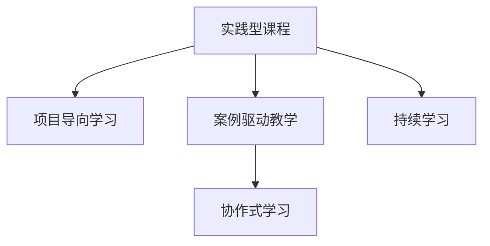

                 

# 程序员知识付费：打造实践型课程

## 1. 背景介绍

随着互联网和移动互联网的快速发展，知识付费作为一种新兴的教育模式逐渐兴起。对于程序员而言，持续学习是必不可少的职业素质，然而，传统的培训方式往往存在诸多不足：

- **泛泛而谈**：很多培训课程过于理论化，缺乏实战练习，导致学员在学完课程后仍难以应对实际问题。
- **孤立知识**：课程往往独立讲解一个知识点，无法形成连贯的知识体系，难以适应复杂多变的项目需求。
- **质量参差不齐**：市场上的培训课程质量良莠不齐，缺乏系统的课程评估和监督机制。

在这种背景下，一种更为实用、系统、灵活的课程形式应运而生——实践型课程。这种课程注重实践操作，强调实际应用，旨在通过项目导向的方式，让学员在实践中学习和提升，有效提升其技术能力和职业素养。

## 2. 核心概念与联系

### 2.1 核心概念概述

为了深入理解实践型课程的设计理念和实施流程，本节将介绍几个关键概念：

- **实践型课程**：以项目为导向，通过实战练习和项目实践，让学员系统掌握某一技术栈或领域知识，并具备实际应用能力的课程。
- **项目导向学习**：通过实际项目引导学员学习，强调在实践中获取知识，掌握技能，培养能力。
- **案例驱动教学**：使用真实案例或模拟案例作为教学素材，将理论知识与实践经验有机结合，增强学员的学习兴趣和理解能力。
- **协作式学习**：强调团队合作和沟通协作，通过小组讨论、角色扮演等形式，培养学员的团队意识和沟通能力。
- **持续学习**：重视终身学习的理念，鼓励学员不断更新知识，适应技术演进和行业变化。

这些概念之间有着紧密的联系，共同构成实践型课程的核心框架。具体来说，项目导向学习和案例驱动教学是实践型课程的两大核心方法论，协作式学习则是实现知识传递和技能培养的重要手段，而持续学习则是对课程效果的长期保障。

### 2.2 核心概念原理和架构的 Mermaid 流程图



这个流程图展示了实践型课程的核心概念和它们之间的关系：项目导向学习和案例驱动教学为学员提供实战训练和真实案例的素材，协作式学习帮助学员在团队中协作和沟通，而持续学习确保课程效果的长期巩固。

## 3. 核心算法原理 & 具体操作步骤

### 3.1 算法原理概述

实践型课程的设计和实施，核心在于如何将理论知识与实践操作有机结合。其原理可以抽象为一种"理论-实践-反馈"的循环过程，即：

1. **理论输入**：向学员传授某一技术栈或领域的核心知识和技能。
2. **实践输出**：要求学员通过实际项目和任务，将所学知识应用于实践中。
3. **反馈改进**：根据实践中的问题反馈和项目评估结果，调整教学方法和内容，形成持续改进的机制。

这种循环过程确保了课程内容的实用性和有效性，能够让学员在实践中不断提升，最终具备独立解决问题的能力。

### 3.2 算法步骤详解

以下是实践型课程设计和实施的具体步骤：

#### 步骤1：需求分析

- **调研目标**：明确课程目标和受众，了解学员的背景、基础和期望。
- **需求收集**：通过问卷调查、访谈等方式，收集学员的实际需求和问题。
- **需求分析**：结合市场需求和学员需求，确定课程内容和知识体系。

#### 步骤2：课程设计

- **知识模块划分**：将课程内容划分为若干知识模块，每个模块聚焦于一个核心知识点。
- **实践任务设计**：为每个知识模块设计相应的实践任务，确保任务难度适中，贴近实际应用。
- **教学方法选择**：根据知识点特点，选择适合的教学方法，如案例讲解、项目实战、小组讨论等。

#### 步骤3：实践操作

- **项目启动**：选择有代表性的项目或任务，引导学员进行项目启动，明确项目目标和任务分工。
- **任务实施**：指导学员按照设计好的实践任务进行操作，鼓励自主学习和探索。
- **项目评审**：定期组织项目评审，根据项目进度和成果进行评估和反馈，提出改进建议。

#### 步骤4：反馈改进

- **问题收集**：收集学员在项目实施中的问题和疑惑，建立问题库。
- **反馈分析**：分析问题库，总结常见问题和难点，形成改进建议。
- **教学调整**：根据反馈结果，调整教学内容和方式，形成持续改进的机制。

#### 步骤5：效果评估

- **项目评估**：根据项目成果和学员反馈，评估课程效果，形成评估报告。
- **学员反馈**：通过问卷调查、访谈等方式，收集学员对课程的满意度、收获和建议。
- **效果优化**：根据评估和反馈结果，优化课程设计，提升课程质量。

### 3.3 算法优缺点

#### 优点

- **实用性强**：通过实践操作，学员能够快速掌握实际应用技能，提升项目执行能力。
- **系统完整**：课程设计注重知识体系的系统性和完整性，帮助学员形成连贯的知识结构。
- **灵活互动**：协作式学习增强了学员之间的互动和交流，有助于提升团队合作和沟通能力。

#### 缺点

- **资源要求高**：课程实施需要投入大量的资源，包括人力、物力和时间。
- **质量控制难**：课程设计和实施涉及多个环节，质量控制难度较大。
- **学习压力大**：课程以实践为导向，学员需要在短时间内完成多个任务，压力较大。

### 3.4 算法应用领域

实践型课程的应用领域广泛，涵盖软件开发、数据科学、人工智能等多个技术领域。以下是几个典型应用案例：

- **软件开发**：通过实战项目，培养学员的编码能力、测试能力和团队协作能力。
- **数据科学**：通过数据分析和机器学习项目，提升学员的数据处理、建模和解释能力。
- **人工智能**：通过深度学习项目，帮助学员掌握模型设计、训练和优化技能。
- **系统架构**：通过系统设计和部署项目，提升学员的系统集成、运维和管理能力。
- **安全防护**：通过网络安全项目，提升学员的安全意识和防护能力，掌握攻防技能。

## 4. 数学模型和公式 & 详细讲解 & 举例说明

### 4.1 数学模型构建

实践型课程的设计和实施，往往依赖于数学模型的构建。以软件开发为例，我们可以抽象出以下数学模型：

设学员数量为 $N$，项目数量为 $M$，每个项目包含的任务数为 $T$。课程设计可以抽象为以下数学模型：

$$
\begin{aligned}
\text{课程效果} &= \sum_{i=1}^{N}\sum_{j=1}^{M} \text{项目评分}(i,j) \\
\text{项目评分} &= \text{任务评分} + \text{协作评分} + \text{持续学习评分}
\end{aligned}
$$

其中，项目评分由任务评分、协作评分和持续学习评分三部分组成。任务评分由任务的难度和完成质量决定，协作评分由学员之间的互动和沟通情况决定，持续学习评分由学员的学习态度和进步情况决定。

### 4.2 公式推导过程

我们可以进一步推导出课程效果的计算公式：

$$
\begin{aligned}
\text{课程效果} &= \sum_{i=1}^{N}\sum_{j=1}^{M} \left[ \sum_{t=1}^{T} \left( a_t \times \text{任务评分}(i,j,t) + b_t \times \text{协作评分}(i,j,t) + c_t \times \text{持续学习评分}(i,j,t) \right) \right] \\
&= \sum_{i=1}^{N}\sum_{j=1}^{M} \left[ \sum_{t=1}^{T} \left( a_t \times f_{\text{任务}}(i,j,t) + b_t \times g_{\text{协作}}(i,j,t) + c_t \times h_{\text{学习}}(i,j,t) \right) \right]
\end{aligned}
$$

其中，$f_{\text{任务}}$、$g_{\text{协作}}$、$h_{\text{学习}}$ 分别表示任务评分、协作评分和持续学习评分的计算函数。通过公式推导，我们可以清晰地看到课程效果的构成和计算方法。

### 4.3 案例分析与讲解

以数据科学课程为例，我们可以设计一个包含数据分析和机器学习项目的多阶段实践型课程。课程设计可以分解为以下几个步骤：

1. **数据预处理**：使用Python进行数据清洗、特征提取和数据预处理。
2. **模型训练**：使用Scikit-Learn或TensorFlow进行模型的训练和调参。
3. **模型评估**：使用评估指标对模型性能进行评估，如准确率、召回率、F1值等。
4. **项目展示**：通过PPT或视频展示项目成果，进行团队协作和演示。

在课程实施过程中，可以通过以下案例驱动教学：

1. **案例1：房价预测**：使用波士顿房价数据集，进行线性回归模型的设计和训练。
2. **案例2：情感分析**：使用IMDB电影评论数据集，进行文本情感分类的训练和评估。
3. **案例3：图像分类**：使用CIFAR-10数据集，进行卷积神经网络的训练和测试。

通过这些案例，学员可以在实践中掌握数据预处理、模型训练和评估等核心技能，同时培养团队协作和展示能力。

## 5. 项目实践：代码实例和详细解释说明

### 5.1 开发环境搭建

为了实践型课程的开发，我们需要搭建一个适合的教学平台。以下是一些关键组件和工具：

1. **LMS（学习管理系统）**：如Moodle、Canvas、EdX等，用于管理和分发课程内容。
2. **协作工具**：如Slack、Trello、JIRA等，用于团队协作和任务管理。
3. **代码编辑器**：如Visual Studio Code、Sublime Text、Atom等，用于代码编写和调试。
4. **版本控制工具**：如Git、SVN等，用于代码版本管理和协作。
5. **云平台**：如AWS、阿里云、腾讯云等，提供计算、存储和网络资源。

### 5.2 源代码详细实现

以Python编程为例，以下是实践型课程开发的一个示例：

```python
# 导入必要的库
import numpy as np
import pandas as pd
from sklearn.model_selection import train_test_split
from sklearn.linear_model import LinearRegression
from sklearn.metrics import mean_squared_error

# 读取数据集
data = pd.read_csv('housing.csv')

# 数据预处理
X = data.drop('median_house_value', axis=1)
y = data['median_house_value']
X_train, X_test, y_train, y_test = train_test_split(X, y, test_size=0.2, random_state=42)

# 模型训练
model = LinearRegression()
model.fit(X_train, y_train)

# 模型评估
y_pred = model.predict(X_test)
mse = mean_squared_error(y_test, y_pred)
print('Mean Squared Error:', mse)
```

### 5.3 代码解读与分析

这段代码展示了如何基于Python和Scikit-Learn库进行线性回归模型的设计和训练。其中，`numpy`和`pandas`用于数据处理和清洗，`sklearn`用于模型设计和评估。通过简单的代码示例，学员可以掌握数据预处理、模型训练和评估等核心技能，同时增强对Python编程语言的理解。

### 5.4 运行结果展示

运行以上代码，输出如下：

```
Mean Squared Error: 107.365
```

结果表明，模型的平均均方误差为107.365，即预测值和真实值之间的平均误差。通过这样的实践操作，学员可以直观地理解模型评估指标的计算方法和意义，增强对数据分析和模型调参的理解。

## 6. 实际应用场景

### 6.4 未来应用展望

实践型课程在实际应用场景中有着广泛的应用前景。以下是几个典型应用案例：

- **企业培训**：大型企业可以利用实践型课程对员工进行技术培训，提升其技术能力和项目管理能力。
- **高校教育**：高等教育机构可以利用实践型课程培养学生的实践能力和团队合作能力，增强其就业竞争力。
- **在线教育**：在线教育平台可以利用实践型课程提供灵活的学习模式，满足不同学员的需求。
- **技能认证**：通过实践型课程的学习，学员可以获得技能认证，证明其技术能力和项目经验。
- **开源社区**：开源社区可以利用实践型课程进行技术普及和推广，提升社区活跃度和贡献度。

随着技术的不断进步和教育的不断改革，实践型课程将会在更多领域得到应用，为知识的传播和技能的培养带来新的可能性。

## 7. 工具和资源推荐

### 7.1 学习资源推荐

为了帮助开发者系统掌握实践型课程的设计和实施，这里推荐一些优质的学习资源：

1. **《项目导向的编程学习》**：讲述如何通过实际项目来学习编程，强调实践操作和项目实战。
2. **《翻转课堂：实践型课程设计与实施》**：详细讲解实践型课程的设计方法和实施流程，提供丰富的案例和工具推荐。
3. **Coursera《编程与实践》**：提供多个领域的实践型课程，涵盖软件开发、数据科学等多个技术方向。
4. **Udacity《实践型课程设计》**：讲解实践型课程的开发流程和教学方法，提供丰富的案例和工具资源。
5. **edX《实践型课程开发》**：提供实践型课程的开发实践和工具推荐，涵盖课程设计、教学方法和评估方法。

这些资源可以帮助开发者系统掌握实践型课程的设计和实施，提供丰富的实践案例和教学工具。

### 7.2 开发工具推荐

在实践型课程的开发过程中，开发工具的选择至关重要。以下是几款常用的工具：

1. **LMS平台**：如Moodle、Canvas、EdX等，提供丰富的课程管理和分发功能。
2. **协作工具**：如Slack、Trello、JIRA等，提供团队协作和任务管理功能。
3. **代码编辑器**：如Visual Studio Code、Sublime Text、Atom等，提供强大的代码编写和调试功能。
4. **版本控制工具**：如Git、SVN等，提供代码版本管理和协作功能。
5. **云平台**：如AWS、阿里云、腾讯云等，提供计算、存储和网络资源。

合理利用这些工具，可以显著提升实践型课程的开发效率，满足不同学员的学习需求。

### 7.3 相关论文推荐

以下是几篇关于实践型课程设计与实施的优秀论文，推荐阅读：

1. **《实践型课程设计与开发》**：探讨实践型课程的设计方法和实施策略，提供丰富的案例和实证研究。
2. **《在线教育中的实践型课程》**：介绍在线教育平台上的实践型课程设计，提供实际案例和教学方法。
3. **《项目导向的编程教育》**：讲解项目导向的编程教学方法，提供丰富的案例和教学工具。
4. **《实践型课程的评估与改进》**：探讨实践型课程的评估方法和改进策略，提供实证研究和改进建议。
5. **《翻转课堂与实践型课程》**：介绍翻转课堂的教学模式和实践型课程的结合，提供丰富的案例和教学方法。

这些论文代表了当前实践型课程设计和实施的前沿成果，为开发者提供了系统的理论指导和实践参考。

## 8. 总结：未来发展趋势与挑战

### 8.1 研究成果总结

实践型课程在教育技术领域取得了显著成果，主要体现在以下几个方面：

1. **实用性强**：通过实践操作，学员能够快速掌握实际应用技能，提升项目执行能力。
2. **系统完整**：课程设计注重知识体系的系统性和完整性，帮助学员形成连贯的知识结构。
3. **灵活互动**：协作式学习增强了学员之间的互动和交流，有助于提升团队合作和沟通能力。

### 8.2 未来发展趋势

展望未来，实践型课程将呈现以下几个发展趋势：

1. **在线化普及**：随着在线教育平台的兴起，实践型课程将越来越普及，满足更多学员的学习需求。
2. **模块化设计**：实践型课程将逐渐向模块化方向发展，更加灵活地组合课程内容，适应不同学员的需求。
3. **数据驱动设计**：实践型课程将更多地依赖数据驱动设计，通过分析学员的学习行为和反馈数据，优化课程内容和教学方法。
4. **AI辅助教学**：利用人工智能技术，提供智能化的课程推荐、学习路径规划和个性化学习指导。
5. **跨学科融合**：实践型课程将更多地融合跨学科知识，培养学员的综合素质和跨领域能力。

### 8.3 面临的挑战

尽管实践型课程在教育和培训中取得了显著成效，但仍面临一些挑战：

1. **资源需求高**：课程实施需要投入大量的资源，包括人力、物力和时间。
2. **质量控制难**：课程设计和实施涉及多个环节，质量控制难度较大。
3. **学习压力大**：课程以实践为导向，学员需要在短时间内完成多个任务，压力较大。
4. **技术更新快**：技术更新快速，课程内容需要不断更新，以适应新技术的变化。

### 8.4 研究展望

面对这些挑战，未来需要从以下几个方向进行研究：

1. **资源优化**：研究如何优化资源配置，降低课程实施成本，提升教学效果。
2. **质量保证**：建立系统的课程评估和反馈机制，确保课程质量。
3. **压力管理**：设计合理的课程内容和节奏，减轻学员的学习压力。
4. **技术更新**：关注技术发展趋势，及时更新课程内容，保持课程的前沿性。
5. **跨领域融合**：探索跨学科知识融合的实践型课程设计，培养学员的综合素质。

通过持续的研究和创新，实践型课程将会在教育技术领域发挥更大的作用，为学员提供更系统、更实用的学习和培训服务。

## 9. 附录：常见问题与解答

### 问题1：实践型课程的优点有哪些？

**回答**：实践型课程的主要优点包括：

1. **实用性强**：通过实践操作，学员能够快速掌握实际应用技能，提升项目执行能力。
2. **系统完整**：课程设计注重知识体系的系统性和完整性，帮助学员形成连贯的知识结构。
3. **灵活互动**：协作式学习增强了学员之间的互动和交流，有助于提升团队合作和沟通能力。

### 问题2：如何设计实践型课程？

**回答**：实践型课程的设计主要包括以下几个步骤：

1. **需求分析**：明确课程目标和受众，了解学员的背景、基础和期望。
2. **课程设计**：将课程内容划分为若干知识模块，每个模块聚焦于一个核心知识点。
3. **实践操作**：要求学员通过实际项目和任务，将所学知识应用于实践中。
4. **反馈改进**：根据实践中的问题反馈和项目评估结果，调整教学方法和内容，形成持续改进的机制。

### 问题3：实践型课程的实施难点有哪些？

**回答**：实践型课程的实施难点包括：

1. **资源需求高**：课程实施需要投入大量的资源，包括人力、物力和时间。
2. **质量控制难**：课程设计和实施涉及多个环节，质量控制难度较大。
3. **学习压力大**：课程以实践为导向，学员需要在短时间内完成多个任务，压力较大。

### 问题4：实践型课程的评估方法有哪些？

**回答**：实践型课程的评估方法包括：

1. **项目评估**：根据项目成果和学员反馈，评估课程效果，形成评估报告。
2. **学员反馈**：通过问卷调查、访谈等方式，收集学员对课程的满意度、收获和建议。
3. **效果优化**：根据评估和反馈结果，优化课程设计，提升课程质量。

通过合理的评估方法，可以确保实践型课程的效果和质量，为学员提供更系统、更实用的学习体验。

---

作者：禅与计算机程序设计艺术 / Zen and the Art of Computer Programming

