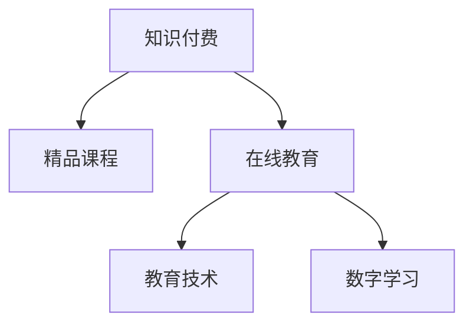

                 

# 程序员知识付费：打造精品课程

> 关键词：程序员知识付费,精品课程,在线教育,教育技术,数字学习

## 1. 背景介绍

在信息化和数字化浪潮的推动下，在线教育正逐渐成为教育的重要组成部分。尤其是随着人工智能、大数据、云计算等新兴技术的崛起，在线教育的形式和内容也发生了深刻变革。知识付费作为一种新兴的教育模式，通过专业化的课程内容，满足学员深度学习、快速提升的需求，日益受到社会各界的广泛关注。

本文旨在深入探讨如何通过知识付费模式，打造精品课程，让程序员等专业人士能够便捷高效地获取高质量教育资源，提升自身技术水平和职业竞争力。

## 2. 核心概念与联系

### 2.1 核心概念概述

为更好地理解知识付费课程的构建流程，本节将介绍几个密切相关的核心概念：

- **知识付费(Knowledge-Paying)**：指用户为获取有价值的信息、知识或技能，愿意支付相应费用的教育模式。知识付费强调专业知识的深度挖掘和系统化教学。

- **精品课程(Course Quality)**：指经过精心设计、内容丰富、结构严谨、教学效果显著的课程。精品课程要求在教学目标、教学内容、教学方法等方面做到精益求精。

- **在线教育(E-Learning)**：指通过互联网技术，以在线形式提供教育内容和服务，学生可以随时随地学习。在线教育模式多样，涵盖从基础教育到专业教育的各个层次。

- **教育技术(Education Technology)**：指在教育领域应用信息技术提升教学效率和质量，涵盖课堂教学、课程开发、学习评估等多个环节。

- **数字学习(Digital Learning)**：指利用计算机、网络、移动设备等数字工具进行学习的方式，强调学习内容的数字化、学习过程的互动化和学习评价的智能化。

这些核心概念之间的逻辑关系可以通过以下Mermaid流程图来展示：



这个流程图展示了一个从知识付费到精品课程的流程，其中教育技术、在线教育和数字学习都是知识付费和精品课程的重要支撑。

## 3. 核心算法原理 & 具体操作步骤
### 3.1 算法原理概述

精品课程的打造，本质上是一个基于用户需求导向的教育内容设计、生产和迭代过程。其核心思想是：通过对目标用户群体的深入分析，设计符合其需求的课程内容，采用高效的教学方法和互动机制，不断迭代优化，以满足用户的学习需求和提升学习效果。

形式化地，假设目标用户群体为 $U$，课程内容为 $C$，教学方法为 $M$，用户评价为 $R$。课程建设的优化目标是最小化用户评价 $R$，即找到最优的课程内容 $C^*$ 和教学方法 $M^*$：

$$
\hat{C},\hat{M}=\mathop{\arg\min}_{C,M} R(C,M)
$$

其中 $R$ 为课程建设与用户学习体验相关的综合评价函数，可以基于用户反馈、学习效果、课程互动度等多个维度进行设计。

### 3.2 算法步骤详解

精品课程的建设一般包括以下几个关键步骤：

**Step 1: 需求分析与目标设定**
- 进行目标用户群体的调研，了解其需求、痛点和期望。
- 确定课程的总体目标，包括知识点的覆盖、技能的提升、学习方式的创新等。

**Step 2: 内容设计与资源整合**
- 根据需求分析结果，设计课程内容和结构，确定关键知识点和教学顺序。
- 整合多种教学资源，如视频、音频、文本、互动练习等。

**Step 3: 教学方法设计与互动机制构建**
- 设计多种教学方法，如视频讲解、实操练习、小组讨论、在线测试等。
- 构建交互式的学习平台，实现实时反馈和互动。

**Step 4: 课程上线与学习反馈**
- 将课程内容上传到在线教育平台，供学员学习。
- 定期收集学员的学习反馈，分析课程效果，进行优化调整。

**Step 5: 迭代优化与持续改进**
- 根据学员反馈，持续改进课程内容和教学方法。
- 更新课程内容，引入最新技术进展和前沿知识。

以上是精品课程建设的通用流程。在实际应用中，还需要根据具体课程内容和目标用户的特点，对各环节进行优化设计，如设计科学的评价指标体系、引入先进的教学技术等，以进一步提升课程质量和用户满意度。

### 3.3 算法优缺点

知识付费精品课程的建设具有以下优点：
1. 针对性更强。根据用户需求设计课程内容，更符合实际应用场景。
2. 效果显著。通过精细化设计和持续改进，课程学习效果显著提升。
3. 灵活高效。在线平台支持随时随地学习，符合现代人的学习习惯。
4. 交互性更好。多维度的互动机制提升学习体验，增强学习动力。

同时，该方法也存在一定的局限性：
1. 成本较高。高质量课程的制作和维护需要大量投入。
2. 学习依赖。知识付费课程依赖平台和网络，可能会受技术故障或网络中断影响。
3. 自主性要求高。学员需要较强的自主学习能力，才能充分掌握课程内容。
4. 师资门槛高。精品课程要求教师具备较强的专业能力和教学经验。

尽管存在这些局限性，但就目前而言，知识付费课程仍然是最为高效、受欢迎的教育模式之一。未来相关研究的重点在于如何进一步降低课程制作和维护成本，提高课程的互动性和参与度，同时兼顾课程内容的深度和广度。

### 3.4 算法应用领域

知识付费课程的建设已经在软件开发、数据分析、人工智能等多个专业领域得到广泛应用，极大地推动了技术人才的培养和知识传播。

在软件开发领域，通过打造高质量的编程课程、技术框架课程、算法竞赛课程等，帮助程序员提升编程技能和实战经验，满足了企业对技术人才的需求。

在数据分析领域，通过构建数据处理、统计分析、机器学习等课程体系，培养了大批具有数据分析能力的专业人才，满足了企业对数据驱动决策的需求。

在人工智能领域，通过设计深度学习、计算机视觉、自然语言处理等课程，培养了大批人工智能技术专家，推动了人工智能技术的产业化应用。

除了上述这些领域外，知识付费课程还被应用于教育、医疗、金融、市场营销等多个行业，为各行各业培养了专业人才，促进了知识的传播和技术的进步。

## 4. 数学模型和公式 & 详细讲解 & 举例说明
### 4.1 数学模型构建

本节将使用数学语言对精品课程建设的评价函数进行严格刻画。

记目标用户群体为 $U=\{u_1,u_2,\dots,u_N\}$，课程内容为 $C=\{c_1,c_2,\dots,c_M\}$，教学方法为 $M=\{m_1,m_2,\dots,m_K\}$。用户对课程内容 $c_i$ 和教学方法 $m_j$ 的评价分别为 $r_{ci}$ 和 $r_{mj}$。假设用户对课程内容 $C$ 和教学方法 $M$ 的综合评价为 $R(C,M)$，可以表示为：

$$
R(C,M) = \sum_{i=1}^M \sum_{j=1}^K r_{ci}r_{mj}w_iw_j
$$

其中 $w_i$ 和 $w_j$ 分别为课程内容和教学方法权重，可以基于用户需求和学习效果进行设定。

### 4.2 公式推导过程

下面以一个简单的例子来说明如何构建和计算课程的评价函数。

假设有一个面向软件工程师的编程课程，包含两门核心课程：Python编程基础和数据结构与算法。课程内容 $C$ 和教学方法 $M$ 的评价函数分别为：

- 课程内容评价：$r_{c_1} = 0.8, r_{c_2} = 0.9$
- 教学方法评价：$r_{m_1} = 0.7, r_{m_2} = 0.5$
- 权重设定：$w_1 = 0.6, w_2 = 0.4$

则综合评价函数 $R(C,M)$ 为：

$$
R(C,M) = (0.8 \times 0.7 \times 0.6) + (0.9 \times 0.5 \times 0.4) = 0.504 + 0.180 = 0.684
$$

由此可见，这门课程的综合评价为 $0.684$，表明其在课程内容和教学方法方面都表现得比较优异。

### 4.3 案例分析与讲解

在实际应用中，课程评价函数的构建需要考虑多个维度的指标，如学习进度、作业完成度、互动参与度等。这里以一个面向数据科学家的机器学习课程为例，进一步说明评价函数的构建和计算过程。

假设这门课程包含两门核心课程：Python数据处理和机器学习算法。课程内容评价和教学方法评价分别为：

- 课程内容评价：$r_{c_1} = 0.7, r_{c_2} = 0.8$
- 教学方法评价：$r_{m_1} = 0.6, r_{m_2} = 0.9$
- 权重设定：$w_1 = 0.5, w_2 = 0.5$

则综合评价函数 $R(C,M)$ 为：

$$
R(C,M) = (0.7 \times 0.6 \times 0.5) + (0.8 \times 0.9 \times 0.5) = 0.21 + 0.36 = 0.57
$$

该课程的综合评价为 $0.57$，表明其在课程内容和教学方法方面都表现得比较优异。

## 5. 项目实践：代码实例和详细解释说明
### 5.1 开发环境搭建

在进行精品课程开发的实践前，我们需要准备好开发环境。以下是使用Python进行Django开发的环境配置流程：

1. 安装Anaconda：从官网下载并安装Anaconda，用于创建独立的Python环境。

2. 创建并激活虚拟环境：
```bash
conda create -n myproject python=3.8 
conda activate myproject
```

3. 安装Django：
```bash
pip install Django==4.0.3
```

4. 安装所需包：
```bash
pip install django-courseware markdown django-cms django-git-py
```

5. 安装数据库：如MySQL、PostgreSQL等，用于课程数据的存储和查询。

完成上述步骤后，即可在`myproject`环境中开始课程开发的实践。

### 5.2 源代码详细实现

下面我们以构建一个面向软件开发人员的Python编程课程为例，给出使用Django进行课程开发的PyTorch代码实现。

首先，定义课程和学生模型：

```python
from django.db import models

class Course(models.Model):
    name = models.CharField(max_length=100)
    description = models.TextField()
    instructor = models.CharField(max_length=100)

class Student(models.Model):
    username = models.CharField(max_length=100)
    email = models.EmailField()
    courses = models.ManyToManyField(Course)
```

然后，定义视图函数：

```python
from django.shortcuts import render
from .models import Course, Student

def course_list(request):
    courses = Course.objects.all()
    return render(request, 'course_list.html', {'courses': courses})

def course_detail(request, id):
    course = Course.objects.get(id=id)
    return render(request, 'course_detail.html', {'course': course})
```

接着，定义模板文件：

```html
<!-- course_list.html -->
<html>
<head>
    <title>All Courses</title>
</head>
<body>
    <h1>All Courses</h1>
    <ul>
        
            <li><a href="">{{ course.name }}</a></li>
        
    </ul>
</body>
</html>

<!-- course_detail.html -->
<html>
<head>
    <title>{{ course.name }}</title>
</head>
<body>
    <h1>{{ course.name }}</h1>
    <p>{{ course.description }}</p>
    <h2>Instructor</h2>
    <p>{{ course.instructor }}</p>
</body>
</html>
```

最后，启动Django开发环境，测试代码：

```bash
python manage.py runserver
```

打开浏览器访问`http://localhost:8000/courses/`，即可看到所有课程列表。点击任意课程链接，进入课程详情页。

### 5.3 代码解读与分析

让我们再详细解读一下关键代码的实现细节：

**Course和Student模型**：
- `Course`模型定义了课程的基本属性，如名称、描述、讲师等。
- `Student`模型定义了学生的属性，如用户名、邮箱、已选修的课程等。

**视图函数**：
- `course_list`函数查询所有课程，并将课程列表渲染到`course_list.html`模板。
- `course_detail`函数根据课程ID查询课程详情，并将课程信息渲染到`course_detail.html`模板。

**模板文件**：
- `course_list.html`模板渲染所有课程链接，并使用``标签生成课程详情的URL。
- `course_detail.html`模板渲染课程名称、描述和讲师信息。

通过以上代码示例，可以看到Django的简洁高效和强大的MVC框架，使得课程开发变得便捷。当然，实际应用中还需要考虑更多因素，如用户权限管理、课程内容上传、课程成绩管理等，但核心的课程展示和详情展示功能已经通过简单的代码实现。

## 6. 实际应用场景
### 6.1 知识付费平台

知识付费平台的兴起，为程序员等专业人士提供了一个便捷高效的学习渠道。用户可以通过平台订阅课程，随时进行学习，并与其他学员进行互动交流。

在技术实现上，平台需要设计合理的课程体系、教学模式和学习路径，引入微积分、机器学习、数据结构等多种课程，满足不同层次学员的学习需求。同时，平台还需要提供丰富多样的教学资源，如视频讲解、代码示例、作业练习等，帮助学员深入理解课程内容。

### 6.2 在线教育机构

在线教育机构通过知识付费模式，构建了优质的课程资源，吸引了大量学员进行学习。通过线上线下结合的方式，为学员提供多渠道的学习体验。

在课程设计上，在线教育机构需要深入分析目标用户群体，设计符合其需求和特点的课程内容。同时，机构还需要引入先进的教学技术，如虚拟实验室、在线模拟等，提升课程的互动性和实践性。通过不断迭代优化，满足用户的学习需求和提升学习效果。

### 6.3 企业内部培训

企业在员工培训方面，也逐渐引入知识付费模式，通过内部课程平台，为员工提供高质量的培训资源。通过课程订阅和积分激励，提升员工的学习积极性和效果。

在课程开发上，企业需要结合自身业务需求，设计贴合企业文化的课程体系，如项目开发、技术创新、团队协作等。同时，企业还需要引入外部专家资源，丰富课程内容，提升课程质量。通过员工的学习反馈和绩效评估，持续优化课程效果，提升员工的职业素养和竞争力。

### 6.4 未来应用展望

随着知识付费模式的不断发展，未来在教育领域的覆盖范围将不断扩大，应用场景将更加丰富。

在智慧教育领域，知识付费将融合人工智能、大数据、物联网等新兴技术，提供更加个性化、互动化的学习体验。通过智能推荐系统，为学员推荐符合其兴趣和需求的课程，提升学习效果和满意度。

在职业培训领域，知识付费将结合企业需求，提供定制化的课程培训，提升员工的岗位胜任能力和职业发展潜力。通过智能评估系统，对员工的学习效果进行量化评估，帮助企业实现人才梯队建设。

在学术研究领域，知识付费将提供高质量的学术论文、研究成果等教育资源，促进学术交流和创新。通过开源平台，共享科研成果，加速学术研究和应用转化。

此外，在企业内训、政府培训、公共教育等多个领域，知识付费模式也将不断拓展，为各行各业的人才培养和知识传播提供新的解决方案。相信随着技术的进步和市场的成熟，知识付费将进一步促进教育公平和职业发展，推动知识付费模式的普及和深化。

## 7. 工具和资源推荐
### 7.1 学习资源推荐

为了帮助开发者系统掌握知识付费课程的理论基础和实践技巧，这里推荐一些优质的学习资源：

1. 《教育信息化2.0》系列博文：深入探讨了教育信息化的发展历程和前沿技术，涵盖在线教育、教育技术、数字学习等多个方面。

2. 《在线教育设计与开发》课程：由教育技术专家开设，系统讲解在线课程的设计、开发和运营流程，为开发者提供全面的技术指导。

3. 《知识付费平台设计与实践》书籍：详细介绍了知识付费平台的构建思路和关键技术，包括用户管理、课程开发、支付结算等。

4. 《教育技术最新进展》书籍：收录了大量教育技术领域的最新研究成果和应用案例，为开发者提供丰富的理论支持。

5. Coursera、Udemy等在线教育平台：提供大量的精品课程资源，涵盖从基础教育到专业教育的各个层次，帮助开发者获取高质量的学习资源。

通过对这些资源的学习实践，相信你一定能够快速掌握知识付费课程的精髓，并用于解决实际的课程开发问题。

### 7.2 开发工具推荐

高效的开发离不开优秀的工具支持。以下是几款用于知识付费课程开发的常用工具：

1. Django：基于Python的开源Web框架，灵活高效，适合开发课程平台和互动系统。

2. Flask：轻量级Web框架，适合开发小型课程应用和服务。

3. Docker：容器化技术，简化开发环境搭建，提升课程开发的可移植性和稳定性。

4. Git：分布式版本控制系统，支持课程内容的版本管理和协作开发。

5. Jupyter Notebook：交互式编程环境，方便进行课程内容的开发和测试。

6. Google Colab：免费的在线Jupyter Notebook环境，支持GPU/TPU算力，方便快速实验最新模型。

合理利用这些工具，可以显著提升知识付费课程的开发效率，加快创新迭代的步伐。

### 7.3 相关论文推荐

知识付费课程的建设源于学界的持续研究。以下是几篇奠基性的相关论文，推荐阅读：

1. Design and Implementation of a MOOCs Online Course Platform（MOOCs平台的设计与实现）：介绍了MOOCs平台的构建思路和关键技术，为在线课程平台的设计提供参考。

2. Online Learning Analytics: State of the Art and Future Directions（在线学习分析技术：现状与未来方向）：分析了在线学习分析技术的发展现状和未来趋势，为课程效果评估提供理论支持。

3. A Survey of Online Education Platforms: Trends, Opportunities, and Challenges（在线教育平台综述：趋势、机遇和挑战）：回顾了在线教育平台的发展历程和未来趋势，为课程开发提供参考。

4. Knowledge-Free Learning: The Next Generation of Online Education（知识免费学习：在线教育的新方向）：探讨了知识免费学习的发展趋势和应用场景，为知识付费课程的推广提供思路。

5. Machine Learning in Education: Towards Intelligent Learning Systems（教育中的机器学习：智能学习系统的构建）：介绍了机器学习在教育中的应用，为知识付费课程的技术支持提供参考。

这些论文代表了大规模在线教育的发展脉络。通过学习这些前沿成果，可以帮助研究者把握学科前进方向，激发更多的创新灵感。

## 8. 总结：未来发展趋势与挑战
### 8.1 总结

本文对知识付费精品课程的构建方法进行了全面系统的介绍。首先阐述了知识付费和精品课程的基本概念和建设目标，明确了课程建设在提升用户学习效果和满意度方面的重要价值。其次，从原理到实践，详细讲解了精品课程建设的数学模型和评价函数，给出了精品课程开发的具体代码实例。同时，本文还广泛探讨了知识付费模式在多个行业领域的应用前景，展示了其在推动技术人才培养和知识传播方面的巨大潜力。此外，本文精选了知识付费课程的各类学习资源，力求为开发者提供全方位的技术指引。

通过本文的系统梳理，可以看到，知识付费模式在提升教育和培训质量方面具有重要意义，特别是在程序员等专业领域，帮助他们获取高效、有价值的教育资源，提升了技术水平和职业竞争力。未来，伴随知识付费模式的不断演进，精品课程的建设将更加科学、规范，将进一步推动教育领域的数字化转型和智能化升级。

### 8.2 未来发展趋势

展望未来，知识付费精品课程将呈现以下几个发展趋势：

1. 内容多样化。课程内容将覆盖更多领域和层次，满足不同用户的学习需求。如面向数据科学家的机器学习课程、面向软件开发者的Python编程课程等。

2. 互动化增强。课程设计将更加注重互动性和参与感，引入实时问答、在线讨论、协作学习等多种互动机制，提升学习效果。

3. 技术驱动。引入先进的教学技术，如虚拟现实、增强现实、AI助教等，提升课程的沉浸式体验和个性化学习。

4. 数据驱动。利用大数据分析技术，对课程内容和用户学习行为进行深入分析，优化课程设计和推荐系统，提升学习效果。

5. 国际化扩展。面向全球用户，推出多语言版本的课程，促进知识付费模式的国际化发展。

以上趋势凸显了知识付费课程的广阔前景。这些方向的探索发展，必将进一步提升课程的质量和用户满意度，为知识付费模式的普及和深化提供新的动力。

### 8.3 面临的挑战

尽管知识付费精品课程已经取得了瞩目成就，但在迈向更加智能化、普适化应用的过程中，它仍面临着诸多挑战：

1. 制作成本高。高质量课程的制作需要大量资金和时间投入，导致课程成本较高。如何降低课程制作成本，提高课程质量，仍需深入研究。

2. 用户参与度低。尽管在线教育平台功能丰富，但用户参与度仍较低，部分学员的自主学习能力不足。如何提升用户参与度，增强学习动力，仍需更多探索。

3. 师资力量薄弱。高质量课程的建设需要优秀教师资源，但师资力量不足成为制约课程发展的瓶颈。如何吸引和培养更多优秀教师，提升课程质量，仍需更多投入。

4. 版权和知识产权保护。知识付费课程的内容创作涉及版权和知识产权问题，如何合理使用和保护，避免侵权纠纷，仍需更多法律和政策支持。

5. 用户隐私和数据安全。课程平台涉及用户隐私和数据安全问题，如何保护用户隐私，防范数据泄露风险，仍需更多技术和管理措施。

这些挑战凸显了知识付费课程的复杂性和多维度性。唯有从技术、政策、管理等多个方面协同发力，才能逐步解决这些难题，推动知识付费课程的可持续发展。

### 8.4 研究展望

面对知识付费课程所面临的种种挑战，未来的研究需要在以下几个方面寻求新的突破：

1. 探索知识免费模式。尝试推出知识免费课程，通过广告、会员等方式获取收益，降低课程制作和用户支付门槛。

2. 研究互动化技术。引入AI助教、虚拟现实等技术，提升课程的互动性和沉浸式体验。

3. 引入更多外部资源。与大学、研究机构等外部机构合作，引入更多优质的课程资源和师资力量。

4. 探索社交化学习。构建基于社交网络的课程社区，通过用户之间的互动和分享，提升课程的互动性和参与度。

5. 加强数据安全和隐私保护。引入区块链等技术，确保课程内容和用户数据的安全性和隐私性。

这些研究方向的探索，必将引领知识付费课程走向更加成熟和稳定，为程序员等专业人才提供更优质的教育资源和职业发展支持。面向未来，知识付费课程需要在多个维度进行创新和优化，方能持续引领教育行业的数字化转型和智能化升级。

## 9. 附录：常见问题与解答

**Q1：如何评估知识付费课程的效果？**

A: 课程效果的评估可以从多个维度进行，如课程完成率、学习成果、学习体验等。可以采用量化评估和定性评估相结合的方式，综合考虑用户的学习反馈、作业成绩、考试结果等。

**Q2：知识付费课程制作过程中需要注意哪些问题？**

A: 课程制作过程中需要注意多个问题，如课程设计、教学内容、教学方法、用户交互等。需要深入分析目标用户群体的需求和特点，设计符合其需求和特点的课程内容。同时，需要引入先进的教学技术和互动机制，提升课程的互动性和学习效果。

**Q3：如何提升知识付费课程的用户参与度？**

A: 提升用户参与度可以从多个方面进行，如课程内容的趣味性和实用性、互动机制的设计和优化、学习路径的科学性等。可以通过引入游戏化元素、实时反馈和奖励机制，增强用户的学习动力和参与感。

**Q4：知识付费课程在实际应用中需要注意哪些问题？**

A: 在实际应用中需要注意多个问题，如平台的技术稳定性、课程内容的质量和更新频率、用户隐私和数据安全等。需要构建稳定可靠的平台基础设施，确保课程的可靠性和稳定性。同时，需要不断优化课程内容，保持课程的先进性和实用性。

这些问题的解决，将有助于知识付费课程的推广和普及，提升程序员等专业人才的学习效果和职业竞争力。相信随着技术的进步和市场的成熟，知识付费模式将不断深化和完善，为教育和技术领域的融合发展提供新的机遇和挑战。

