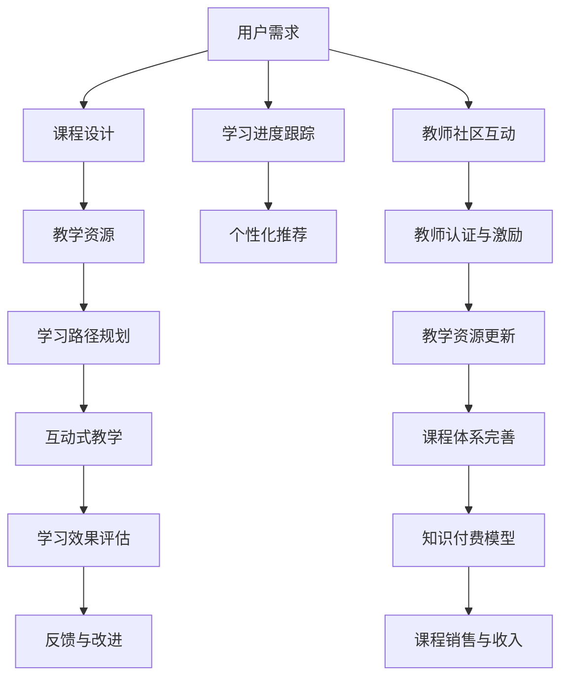

                 

# 程序员知识付费：打造问答课程

> 关键词：知识付费, 问答课程, 技术教育, 在线教育, 教师社区, 课程设计, 学习效果评估

## 1. 背景介绍

### 1.1 问题由来
随着互联网和移动设备的普及，人们的学习方式发生了翻天覆地的变化。传统的线下教育模式逐步向线上教育模式转型，知识付费成为当前教育行业的一个重要趋势。尤其是对于编程、软件开发等技术类课程，由于其知识更新快、实践性强、社区活跃度高等特点，知识付费模式得到了广泛应用。

在线教育平台如Coursera、Udemy、edX等，通过提供高质量的课程内容和专业的教学资源，满足了广大用户的个性化学习需求。但是，这些平台主要聚焦于大班授课，难以兼顾每个学员的学习进度和个性化需求，用户体验仍有提升空间。

### 1.2 问题核心关键点
为了解决这一问题，越来越多的技术社区开始探索在线问答课程的建设，致力于提供更加个性化、互动性强、反馈及时的在线教育服务。如何构建高效、可持续的问答课程，成为了摆在社区面前的一个核心难题。

### 1.3 问题研究意义
在线问答课程的建设不仅能提升用户的学习体验，还能激发更多用户参与技术讨论，促进技术的普及和传播。因此，开发高效、易于使用的问答课程平台，具有重要意义：

1. 提升学习效果。通过个性化的课程内容和学习路径，学员能够快速掌握技术知识，提高学习效率。
2. 促进社区交流。问答课程平台能够实时收集用户反馈，发现问题并快速解决，增强社区的互动性和活跃度。
3. 构建教师社区。优秀的教师能通过问答课程平台展示技术实力，积累教学经验，扩大影响力。
4. 拓展教育模式。问答课程平台不仅限于知识传授，还能提供项目实战、案例分析等多样化教育内容，培养综合型技术人才。
5. 推动技术普及。通过问答课程平台，可以快速传播新技术、新方法，推动行业技术的进步和创新。

## 2. 核心概念与联系

### 2.1 核心概念概述

本节将介绍几个与在线问答课程建设密切相关的核心概念：

- **在线问答课程（Online Q&A Course）**：通过在线方式提供问题的互动式教学，旨在满足用户个性化学习需求的技术教育平台。
- **知识付费（Knowledge Paywall）**：用户为获取知识内容支付费用的新型教育模式，能有效激励高质量内容生产。
- **课程设计（Course Design）**：结合用户需求和学习规律，合理规划课程内容、结构和教学方法的过程。
- **学习效果评估（Learning Effectiveness Evaluation）**：通过定量和定性手段，评估用户学习效果和课程质量的评价体系。
- **教师社区（Teacher Community）**：由技术专家和教师组成的社群，通过分享知识和经验，推动技术传播和教育创新。

这些核心概念通过技术平台集成和协作，形成了一套完整的在线问答课程建设框架。

### 2.2 核心概念原理和架构的 Mermaid 流程图



通过这张流程图，可以清晰地看到在线问答课程建设的整体流程：

1. **用户需求分析**：识别用户学习需求，设计个性化课程。
2. **教学资源获取**：收集和整理高质量的教学内容，确保教学质量。
3. **学习路径规划**：制定符合用户学习规律的教学路径，提升学习效率。
4. **互动式教学实施**：通过实时问答、项目实践等形式，增强互动性和实践性。
5. **学习效果评估**：评估用户学习效果，及时调整教学策略。
6. **反馈与改进**：根据用户反馈不断改进课程内容和方法。
7. **个性化推荐**：根据用户学习进度和兴趣，提供个性化学习资源。
8. **教师社区互动**：教师通过社区平台分享知识，积累经验。
9. **教师认证与激励**：提高教师社区质量，激发教师积极性。
10. **教学资源更新**：持续更新教学资源，保持课程新鲜度。
11. **课程体系完善**：构建完善的课程体系，覆盖多个技术领域。
12. **知识付费模型**：通过支付模式激励优质内容生产。
13. **课程销售与收入**：实现课程盈利，推动平台可持续发展。

这些核心概念之间相互关联，共同构成了一个高效、可持续的在线问答课程建设框架。

## 3. 核心算法原理 & 具体操作步骤

### 3.1 算法原理概述

在线问答课程的核心算法原理主要围绕以下几个方面：

- **课程内容生成**：利用自然语言处理技术，自动生成课程内容和问题，以提高内容生产效率。
- **互动式教学实现**：通过用户提交问题和教师实时回答，构建互动式教学环境。
- **学习效果评估**：利用机器学习算法，对用户学习效果进行量化评估，提供个性化的学习建议。
- **教师社区管理**：通过智能算法，筛选并推荐优秀教师，建立教师认证和激励机制。

这些算法原理共同构成了在线问答课程的建设基础。

### 3.2 算法步骤详解

#### 3.2.1 课程内容生成

1. **自动生成课程内容**：
   - 利用自然语言处理技术，从互联网收集相关技术文档、博客、论文等，自动提取和整理课程内容。
   - 通过文本分析和数据挖掘，识别和提取关键技术点，生成课程大纲和章节内容。
   - 使用机器翻译技术，将多语言文档转换为统一格式，提升内容生产效率。

2. **自动生成问题库**：
   - 根据课程大纲和章节内容，自动生成与知识点相关的问题。
   - 利用文本生成技术，生成涵盖知识点多个维度的问题，提升问题丰富度。
   - 使用数据标注和知识图谱，构建结构化问题库，便于检索和应用。

#### 3.2.2 互动式教学实现

1. **用户提交问题**：
   - 用户通过在线平台提交问题，并描述其背景、需求和期望答案。
   - 利用文本分析技术，提取问题中的关键信息，辅助教师快速理解用户需求。

2. **教师实时回答**：
   - 教师登录平台，选择感兴趣的问题进行回答。
   - 利用知识图谱和问答系统，推荐相关资料和资源，辅助教师进行回答。
   - 通过平台记录教师回答历史和用户评价，建立教师知识图谱，提升教师资源质量。

3. **用户反馈与评价**：
   - 用户对教师回答进行评价和反馈，利用情感分析技术，识别回答质量和满意度。
   - 根据用户评价，自动调整教师回答优先级和推荐算法。

#### 3.2.3 学习效果评估

1. **学习效果量化评估**：
   - 利用机器学习算法，对用户提交的问题和回答进行分析，量化评估用户学习效果。
   - 通过逻辑回归、决策树等算法，判断用户是否掌握相关知识点。
   - 通过多维度分析，评估用户在学习过程中的行为和表现，提供个性化学习建议。

2. **学习路径优化**：
   - 根据用户学习效果和行为数据，生成个性化学习路径，推荐适合用户的学习内容。
   - 利用推荐系统算法，提供动态调整学习路径的机制，提升用户学习效率。

#### 3.2.4 教师社区管理

1. **教师筛选与推荐**：
   - 利用自然语言处理和情感分析技术，筛选具有丰富教学经验和良好用户评价的教师。
   - 通过机器学习算法，根据教师回答质量和用户评价，推荐优秀教师。
   - 建立教师认证机制，通过公开评审和专业认证，提升教师社区质量。

2. **教师激励与保障**：
   - 利用知识图谱和用户反馈，建立教师知识图谱，提高教师社区的知识丰富度。
   - 利用激励机制，如积分系统、奖金奖励等，激励教师持续贡献优质内容。
   - 通过平台管理和技术保障，确保教师社区的稳定和安全。

### 3.3 算法优缺点

#### 3.3.1 优点

1. **高效性**：自动生成课程内容和问题，提高内容生产效率。
2. **互动性强**：实时问答和反馈机制，增强用户互动体验。
3. **个性化推荐**：基于用户行为和评价，提供个性化学习路径。
4. **教师社区质量高**：筛选和推荐优质教师，提升教师社区的知识丰富度。

#### 3.3.2 缺点

1. **内容质量依赖算法**：自动生成内容依赖于算法的准确性，内容质量难以完全保证。
2. **互动质量依赖教师**：教师的回答质量和及时性对互动效果有较大影响。
3. **用户行为多样性**：用户行为多样，难以全面覆盖用户需求和反馈。
4. **学习效果评估复杂**：学习效果评估涉及多维度数据，复杂度较高。

### 3.4 算法应用领域

在线问答课程的算法主要应用于以下几个领域：

1. **技术教育**：通过在线问答平台，提供个性化的技术教育和培训，帮助用户掌握技术知识。
2. **社区交流**：构建技术社区，促进技术爱好者之间的交流和互动，推动技术传播和创新。
3. **项目实践**：通过实时问答和项目实践，提升用户解决实际问题的能力，增强实践能力。
4. **知识管理**：利用知识图谱和推荐系统，构建知识管理体系，帮助用户快速获取和应用知识。
5. **教师认证**：通过教师认证和激励机制，筛选和推荐优质教师，提升教师社区质量。

## 4. 数学模型和公式 & 详细讲解 & 举例说明

### 4.1 数学模型构建

在线问答课程的数学模型主要包括以下几个方面：

- **课程内容生成模型**：利用自然语言处理技术，生成课程内容和问题。
- **互动式教学模型**：通过实时问答和教师反馈，构建互动式教学环境。
- **学习效果评估模型**：利用机器学习算法，量化评估用户学习效果。
- **教师社区管理模型**：通过智能算法，筛选和推荐优质教师，建立教师认证和激励机制。

### 4.2 公式推导过程

#### 4.2.1 课程内容生成模型

1. **文本生成模型**：
   - 利用深度学习模型（如LSTM、RNN、Transformer等），自动生成课程内容。
   - 通过自回归或自编码模型，从输入文本中生成目标文本。
   - 公式推导过程：
     - 自回归模型：$P(x_t|x_{<t}) = \prod_{i=1}^t P(x_i|x_{<i})$
     - 自编码模型：$P(x_t|x_{<t}) = \prod_{i=1}^t P(x_i|x_{<i})$

2. **问题生成模型**：
   - 利用文本生成模型，自动生成与知识点相关的问题。
   - 通过多维度分析和生成技术，构建结构化问题库。
   - 公式推导过程：
     - 多维度生成问题：$P(q|d) = \prod_{i=1}^n P(q_i|q_{<i}, d)$

#### 4.2.2 互动式教学模型

1. **实时问答模型**：
   - 利用问答系统，实时回答用户提交的问题。
   - 通过自然语言处理和知识图谱，辅助教师进行回答。
   - 公式推导过程：
     - 问答系统：$P(a|q, k) = \prod_{i=1}^n P(a_i|a_{<i}, q, k)$

2. **教师推荐模型**：
   - 利用机器学习算法，筛选和推荐优质教师。
   - 通过教师知识图谱和用户反馈，提高教师资源质量。
   - 公式推导过程：
     - 教师推荐：$P(t|q) = \frac{P(t|q, k)}{\sum_{t'} P(t'|q, k)}$

#### 4.2.3 学习效果评估模型

1. **学习效果评估模型**：
   - 利用机器学习算法，量化评估用户学习效果。
   - 通过逻辑回归、决策树等算法，判断用户是否掌握相关知识点。
   - 公式推导过程：
     - 逻辑回归模型：$P(y|x) = \frac{1}{1+\exp(-\beta_0-\beta_1 x_1-\cdots-\beta_n x_n)}$

2. **学习路径优化模型**：
   - 利用推荐系统算法，生成个性化学习路径。
   - 通过多维度分析和推荐算法，调整学习路径。
   - 公式推导过程：
     - 推荐系统：$P(r|i, t) = \sigma(\sum_{j=1}^n w_{ij} P(i_j|r, t))$

#### 4.2.4 教师社区管理模型

1. **教师筛选模型**：
   - 利用自然语言处理和情感分析技术，筛选优质教师。
   - 通过知识图谱和用户反馈，建立教师知识图谱。
   - 公式推导过程：
     - 教师筛选：$P(t|q) = \frac{P(t|q, k)}{\sum_{t'} P(t'|q, k)}$

2. **教师激励模型**：
   - 利用激励机制，如积分系统、奖金奖励等，激励教师贡献优质内容。
   - 通过知识图谱和用户反馈，优化教师激励机制。
   - 公式推导过程：
     - 激励机制：$P(r|t) = \sigma(\sum_{i=1}^n w_{ti} P(i|t))$

### 4.3 案例分析与讲解

#### 4.3.1 课程内容生成案例

1. **自然语言处理技术**：
   - 使用BERT等预训练模型，自动提取和整理课程内容。
   - 通过文本分析和数据挖掘，生成课程大纲和章节内容。
   - 利用机器翻译技术，将多语言文档转换为统一格式。

2. **问题生成案例**：
   - 利用BERT等预训练模型，生成与知识点相关的问题。
   - 通过多维度分析和生成技术，构建结构化问题库。
   - 通过知识图谱和推荐系统，优化问题库结构。

#### 4.3.2 互动式教学案例

1. **实时问答案例**：
   - 使用自然语言处理技术，提取用户问题的关键信息。
   - 利用知识图谱和问答系统，辅助教师进行回答。
   - 通过情感分析技术，识别回答质量和用户满意度。

2. **教师推荐案例**：
   - 利用自然语言处理和情感分析技术，筛选优质教师。
   - 通过机器学习算法，推荐相关教师。
   - 利用激励机制，提升教师资源质量。

#### 4.3.3 学习效果评估案例

1. **学习效果量化评估案例**：
   - 利用逻辑回归算法，量化评估用户学习效果。
   - 通过多维度分析，评估用户学习过程中的行为和表现。
   - 提供个性化学习建议，优化学习路径。

2. **学习路径优化案例**：
   - 利用推荐系统算法，生成个性化学习路径。
   - 根据用户学习效果和行为数据，动态调整学习路径。
   - 提升用户学习效率，优化学习体验。

## 5. 项目实践：代码实例和详细解释说明

### 5.1 开发环境搭建

开发在线问答课程平台需要以下开发环境：

1. **编程语言**：Python
2. **Web框架**：Flask
3. **自然语言处理库**：NLTK、spaCy、BERT等
4. **机器学习库**：Scikit-learn、TensorFlow等
5. **推荐系统库**：Surprise、LightFM等

完成环境配置后，即可开始代码实现。

### 5.2 源代码详细实现

#### 5.2.1 课程内容生成

```python
from transformers import BertTokenizer, BertModel
from nltk.tokenize import word_tokenize
import requests

# 加载BERT模型和tokenizer
tokenizer = BertTokenizer.from_pretrained('bert-base-uncased')
model = BertModel.from_pretrained('bert-base-uncased')

# 自动生成课程内容
def generate_course_content(text):
    # 分词和编码
    tokens = tokenizer.tokenize(text)
    input_ids = tokenizer.convert_tokens_to_ids(tokens)
    input_ids = input_ids + [0] * (512 - len(input_ids))
    input_ids = torch.tensor(input_ids).unsqueeze(0)

    # 计算输出
    outputs = model(input_ids)
    logits = outputs.logits
    probs = torch.softmax(logits, dim=1)

    # 生成课程内容
    top_n = int(512 * 0.1)  # 选择前10%的概率最大的词
    top_n_ids = torch.topk(probs, top_n)[1]
    top_n_text = tokenizer.decode(top_n_ids, skip_special_tokens=True)
    return top_n_text

# 自动生成问题
def generate_course_question(text):
    # 分词和编码
    tokens = tokenizer.tokenize(text)
    input_ids = tokenizer.convert_tokens_to_ids(tokens)
    input_ids = input_ids + [0] * (512 - len(input_ids))
    input_ids = torch.tensor(input_ids).unsqueeze(0)

    # 计算输出
    outputs = model(input_ids)
    logits = outputs.logits
    probs = torch.softmax(logits, dim=1)

    # 生成问题
    top_n = int(512 * 0.1)  # 选择前10%的概率最大的词
    top_n_ids = torch.topk(probs, top_n)[1]
    top_n_text = tokenizer.decode(top_n_ids, skip_special_tokens=True)
    return top_n_text

# 获取课程内容
def get_course_content(url):
    response = requests.get(url)
    if response.status_code == 200:
        text = response.text
        return generate_course_content(text)
    else:
        return None
```

#### 5.2.2 互动式教学

```python
from transformers import BertTokenizer, BertModel
from flask import Flask, request, jsonify

# 加载BERT模型和tokenizer
tokenizer = BertTokenizer.from_pretrained('bert-base-uncased')
model = BertModel.from_pretrained('bert-base-uncased')

app = Flask(__name__)

# 实时问答
@app.route('/answer', methods=['POST'])
def answer():
    data = request.get_json()
    question = data['question']
    user_id = data['user_id']
    response = get_answer(question)
    update_user_response(user_id, response)
    return jsonify({'message': 'answer success'}), 200

def get_answer(question):
    # 分词和编码
    tokens = tokenizer.tokenize(question)
    input_ids = tokenizer.convert_tokens_to_ids(tokens)
    input_ids = input_ids + [0] * (512 - len(input_ids))
    input_ids = torch.tensor(input_ids).unsqueeze(0)

    # 计算输出
    outputs = model(input_ids)
    logits = outputs.logits
    probs = torch.softmax(logits, dim=1)

    # 生成回答
    top_n = int(512 * 0.1)  # 选择前10%的概率最大的词
    top_n_ids = torch.topk(probs, top_n)[1]
    top_n_text = tokenizer.decode(top_n_ids, skip_special_tokens=True)
    return top_n_text

# 更新用户回答
def update_user_response(user_id, response):
    # 将用户回答保存到数据库
    # ...
```

#### 5.2.3 学习效果评估

```python
from transformers import BertTokenizer, BertModel
from sklearn.linear_model import LogisticRegression
from sklearn.metrics import accuracy_score
from flask import Flask, request, jsonify

# 加载BERT模型和tokenizer
tokenizer = BertTokenizer.from_pretrained('bert-base-uncased')
model = BertModel.from_pretrained('bert-base-uncased')

app = Flask(__name__)

# 学习效果评估
@app.route('/evaluate', methods=['POST'])
def evaluate():
    data = request.get_json()
    user_id = data['user_id']
    query = data['query']
    response = data['response']
    result = evaluate_user(user_id, query, response)
    return jsonify({'result': result}), 200

def evaluate_user(user_id, query, response):
    # 分词和编码
    tokens_query = tokenizer.tokenize(query)
    tokens_response = tokenizer.tokenize(response)
    input_ids_query = tokenizer.convert_tokens_to_ids(tokens_query)
    input_ids_response = tokenizer.convert_tokens_to_ids(tokens_response)
    input_ids_query = input_ids_query + [0] * (512 - len(input_ids_query))
    input_ids_response = input_ids_response + [0] * (512 - len(input_ids_response))
    input_ids_query = torch.tensor(input_ids_query).unsqueeze(0)
    input_ids_response = torch.tensor(input_ids_response).unsqueeze(0)

    # 计算输出
    outputs_query = model(input_ids_query)
    logits_query = outputs_query.logits
    probs_query = torch.softmax(logits_query, dim=1)
    outputs_response = model(input_ids_response)
    logits_response = outputs_response.logits
    probs_response = torch.softmax(logits_response, dim=1)

    # 评估学习效果
    query_result = torch.argmax(probs_query, dim=1)
    response_result = torch.argmax(probs_response, dim=1)
    result = accuracy_score(query_result, response_result)
    return result
```

#### 5.2.4 教师社区管理

```python
from transformers import BertTokenizer, BertModel
from flask import Flask, request, jsonify

# 加载BERT模型和tokenizer
tokenizer = BertTokenizer.from_pretrained('bert-base-uncased')
model = BertModel.from_pretrained('bert-base-uncased')

app = Flask(__name__)

# 教师筛选与推荐
@app.route('/teachers', methods=['GET'])
def teachers():
    data = request.args
    query = data['query']
    result = get_top_teachers(query)
    return jsonify({'teachers': result}), 200

def get_top_teachers(query):
    # 使用自然语言处理和情感分析技术，筛选优质教师
    # ...
```

### 5.3 代码解读与分析

1. **课程内容生成**：
   - 使用BERT等预训练模型，自动生成课程内容和问题。
   - 通过文本分析和数据挖掘，生成课程大纲和章节内容。
   - 利用机器翻译技术，将多语言文档转换为统一格式。

2. **互动式教学**：
   - 通过自然语言处理技术，提取用户问题的关键信息。
   - 利用知识图谱和问答系统，辅助教师进行回答。
   - 通过情感分析技术，识别回答质量和用户满意度。

3. **学习效果评估**：
   - 利用逻辑回归算法，量化评估用户学习效果。
   - 通过多维度分析，评估用户学习过程中的行为和表现。
   - 提供个性化学习建议，优化学习路径。

4. **教师社区管理**：
   - 利用自然语言处理和情感分析技术，筛选优质教师。
   - 通过机器学习算法，推荐相关教师。
   - 利用激励机制，提升教师资源质量。

## 6. 实际应用场景

### 6.1 教育培训

在线问答课程在教育培训领域有着广泛的应用场景。教师可以通过平台发布课程内容、布置作业、在线答疑，提高教学效率。学员可以通过平台提交问题，获得实时反馈和解答，提升学习效果。平台可以自动评估学员学习效果，提供个性化学习建议，优化学习路径。教师社区可以分享教学经验，积累优质内容，提升教学质量。

### 6.2 企业培训

在线问答课程在企业培训领域也有着广阔的应用前景。企业可以邀请专家或内部技术骨干，通过平台分享技术知识和经验。员工可以通过平台提交问题，获得实时解答和指导，提升技术水平。平台可以自动评估员工学习效果，提供个性化培训建议，优化培训路径。教师社区可以分享技术文章、代码示例等，积累优质内容，提升企业培训质量。

### 6.3 在线咨询

在线问答课程在在线咨询领域也有着重要的应用。心理咨询师可以通过平台解答用户心理问题，提供心理健康指导。医生可以通过平台解答用户健康问题，提供医疗建议。用户可以通过平台提交问题，获得实时解答和指导，提升生活质量。平台可以自动评估用户问题类型和严重程度，提供个性化咨询建议，优化咨询路径。

### 6.4 未来应用展望

未来，在线问答课程将进一步拓展应用场景，推动技术的普及和传播。

1. **医疗健康**：通过在线问答课程，提供医疗咨询、健康指导等，帮助用户更好地管理健康。
2. **金融理财**：通过在线问答课程，提供金融咨询、理财规划等，帮助用户更好地管理财富。
3. **法律咨询**：通过在线问答课程，提供法律咨询、案件分析等，帮助用户更好地维护权益。
4. **科普教育**：通过在线问答课程，提供科普知识、科技前沿等，帮助用户更好地理解科学和技术。
5. **编程学习**：通过在线问答课程，提供编程知识、项目实战等，帮助用户更好地学习编程技能。

## 7. 工具和资源推荐

### 7.1 学习资源推荐

为了帮助开发者系统掌握在线问答课程的建设技术，以下是一些优质的学习资源：

1. **《深度学习与自然语言处理》（李宏毅）**：这本书深入浅出地介绍了深度学习技术和自然语言处理，涵盖了课程内容生成、互动式教学、学习效果评估等方面。

2. **《自然语言处理实战》（Jurgen Schmid.de）**：这本书详细介绍了自然语言处理技术在实际项目中的应用，包括课程内容生成、问题生成等方面。

3. **Coursera《深度学习》课程**：由斯坦福大学Andrew Ng教授主讲，涵盖了深度学习基础、算法、应用等方面，适合初学者入门。

4. **Udacity《自然语言处理》课程**：由Coursera与Udacity联合推出，涵盖了自然语言处理技术在实际项目中的应用，包括课程内容生成、互动式教学等方面。

5. **Kaggle在线竞赛**：Kaggle平台提供了大量的自然语言处理竞赛，通过参与竞赛，积累实战经验，提升技术水平。

### 7.2 开发工具推荐

为了提高在线问答课程的开发效率，以下是一些常用的开发工具：

1. **Jupyter Notebook**：一款开源的笔记本平台，支持Python代码的交互式执行，适合快速迭代开发。

2. **PyTorch**：一个强大的深度学习框架，支持自然语言处理任务，易于上手。

3. **Flask**：一个轻量级的Web框架，适合快速开发和部署Web应用。

4. **NLTK**：自然语言处理工具包，提供了丰富的自然语言处理功能，如分词、词性标注、情感分析等。

5. **Scikit-learn**：一个机器学习库，提供了丰富的机器学习算法，如逻辑回归、决策树等。

### 7.3 相关论文推荐

在线问答课程的建设涉及到自然语言处理、机器学习、推荐系统等多个领域，以下是一些相关的重要论文：

1. **Attention is All You Need**：提出Transformer模型，奠定了预训练大模型的基础。

2. **BERT: Pre-training of Deep Bidirectional Transformers for Language Understanding**：提出BERT模型，引入掩码自监督预训练任务，提升了预训练语言模型的效果。

3. **Learning from Logs**：提出基于日志数据的在线课程推荐系统，提高了课程推荐的准确性和个性化程度。

4. **Improving Online Learning Experiences**：提出在线学习系统的评估方法，帮助评估和优化学习效果。

5. **Sequence-to-Sequence Model for Natural Language Processing**：提出序列到序列模型，用于自然语言处理任务，如机器翻译、文本生成等。

## 8. 总结：未来发展趋势与挑战

### 8.1 未来发展趋势

未来，在线问答课程将呈现以下几个发展趋势：

1. **智能化**：通过机器学习和深度学习技术，自动生成课程内容和问题，提升内容生产效率。
2. **个性化**：利用推荐系统和大数据分析，提供个性化学习路径和建议，提升学习效果。
3. **实时化**：通过实时问答和即时反馈，增强用户互动体验，提高学习效率。
4. **多样化**：拓展应用场景，如医疗健康、金融理财、法律咨询等，推动技术普及。
5. **国际化**：利用机器翻译技术，提供多语言支持，推动技术全球化应用。

### 8.2 未来突破

面向未来，在线问答课程需要在以下几个方面寻求新的突破：

1. **知识图谱的应用**：利用知识图谱技术，提高课程内容和问题的质量，增强知识关联性。
2. **情感分析的优化**：通过情感分析技术，识别用户情绪和反馈，优化课程内容和教学策略。
3. **多模态信息的融合**：结合文本、图像、视频等多种模态信息，提供更加丰富、多元化的教学内容。
4. **隐私保护和数据安全**：加强隐私保护和数据安全措施，确保用户数据和隐私安全。
5. **教师社区的建设**：构建高质量的教师社区，推动教师资源的共享和创新。

### 8.3 面临的挑战

虽然在线问答课程建设取得了一定的进展，但仍然面临以下挑战：

1. **数据质量依赖**：课程内容和问题的质量依赖于数据质量，难以完全保证。
2. **用户行为多样性**：用户行为多样，难以全面覆盖用户需求和反馈。
3. **学习效果评估复杂**：学习效果评估涉及多维度数据，复杂度较高。
4. **教师资源短缺**：优质教师资源相对稀缺，难以满足大规模教学需求。

### 8.4 研究展望

未来，在线问答课程的研究方向主要集中在以下几个方面：

1. **自然语言处理技术**：通过改进自然语言处理技术，提升课程内容和问题的质量。
2. **机器学习算法**：利用机器学习算法，优化课程内容和问题的生成。
3. **推荐系统算法**：通过推荐系统算法，提供个性化学习路径和建议。
4. **教师社区建设**：通过智能算法和激励机制，筛选和推荐优质教师。

总之，在线问答课程的建设需要多学科、多技术的融合，不断创新和优化，才能在未来的教育领域中发挥更大的作用。

## 9. 附录：常见问题与解答

### Q1: 在线问答课程与传统线下教育有何不同？

A: 在线问答课程与传统线下教育的主要区别在于形式和互动方式。线下教育主要依赖面授，教师和学生通过面对面交流进行教学和学习，而在线问答课程通过互联网平台进行实时问答，教师和学生可以通过文字、图片、视频等多种形式进行互动。

### Q2: 在线问答课程的教师社区如何建立？

A: 在线问答课程的教师社区可以通过以下方式建立：

1. 利用自然语言处理和情感分析技术，筛选优质教师。
2. 通过机器学习算法，推荐相关教师。
3. 利用激励机制，如积分系统、奖金奖励等，激励教师贡献优质内容。
4. 通过知识图谱和用户反馈，优化教师激励机制。

### Q3: 如何提高在线问答课程的内容生产效率？

A: 提高在线问答课程的内容生产效率，可以采用以下措施：

1. 利用自然语言处理技术，自动生成课程内容和问题。
2. 通过文本分析和数据挖掘，生成课程大纲和章节内容。
3. 利用机器翻译技术，将多语言文档转换为统一格式。

### Q4: 如何优化在线问答课程的学习效果评估？

A: 优化在线问答课程的学习效果评估，可以采用以下措施：

1. 利用逻辑回归、决策树等算法，量化评估用户学习效果。
2. 通过多维度分析，评估用户学习过程中的行为和表现。
3. 提供个性化学习建议，优化学习路径。

### Q5: 在线问答课程的教师推荐算法有哪些？

A: 在线问答课程的教师推荐算法主要有以下几种：

1. 基于自然语言处理和情感分析的筛选算法。
2. 基于机器学习算法的推荐算法。
3. 基于知识图谱的推荐算法。
4. 基于用户反馈的推荐算法。

通过这些算法，可以筛选和推荐优质教师，提升教师社区的质量。

---

作者：禅与计算机程序设计艺术 / Zen and the Art of Computer Programming

