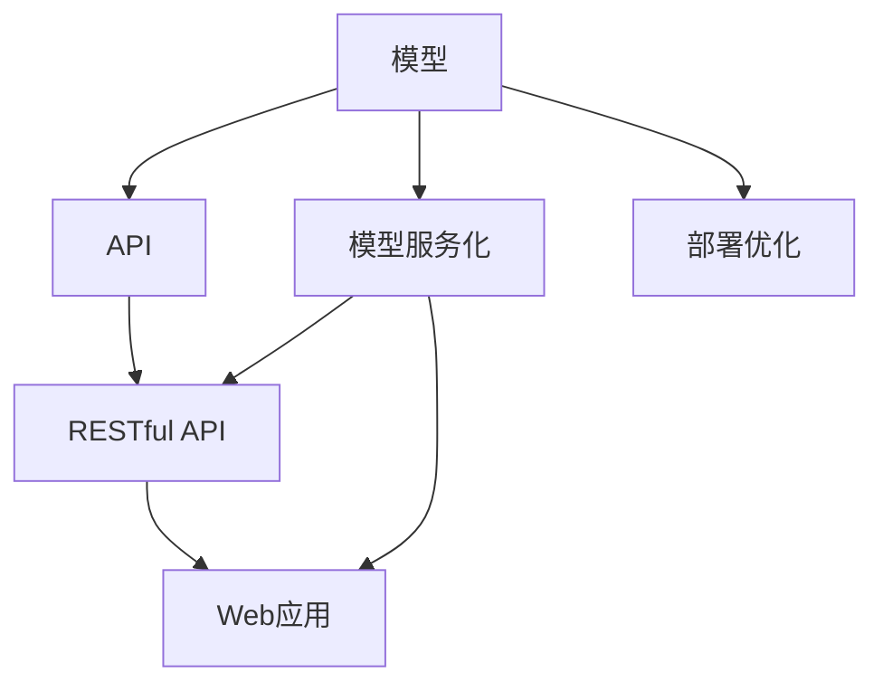

                 

# 第16章 模型部署 API与Web应用开发

## 1. 背景介绍

模型部署（Model Deployment）是将训练好的机器学习模型应用到实际业务场景中的过程。在实际开发中，模型训练通常是在离线环境中进行的，而模型部署则涉及到将模型集成到在线服务中，接受输入数据并输出预测结果。随着深度学习技术在各领域的广泛应用，模型部署成为了人工智能系统中不可或缺的一环。

在本章中，我们将重点介绍如何将深度学习模型部署到API和Web应用中，包括模型服务化的基本概念、API设计和实现步骤、Web应用开发等关键技术。此外，我们还将讨论如何优化模型部署的性能和可扩展性，以及如何在实际应用中处理模型预测的误差和异常情况。

## 2. 核心概念与联系

### 2.1 核心概念概述

为了更好地理解模型部署的过程，我们先介绍几个核心概念及其相互之间的关系。

- **API（Application Programming Interface）**：API是一种接口，用于在不同组件之间传递数据和功能。在模型部署中，API通常用于接收用户请求，将数据传递给模型进行处理，并返回预测结果。
- **RESTful API**：RESTful API是一种基于HTTP协议的API设计风格，采用资源和HTTP方法的方式进行服务访问。RESTful API具有标准化的接口和易于理解和使用的特性，是模型部署中常用的API设计方案。
- **模型服务化**：模型服务化是将模型封装成可被外部系统调用的服务的过程。服务化后的模型可以通过API接口进行远程调用，从而在多个系统之间实现数据的共享和功能的复用。
- **Web应用开发**：Web应用开发是将模型部署到Web环境中的过程。Web应用通过HTTP协议接收用户请求，调用模型API进行数据处理，并将结果以网页的形式展示给用户。

这些概念之间的关系可以通过以下Mermaid流程图来展示：



这个流程图展示了模型部署的基本流程：首先，将模型服务化并封装成API，然后通过RESTful API接口进行模型调用，最终将结果展示在Web应用中。同时，模型服务化和部署优化也是模型部署中重要的环节，有助于提高模型的使用效率和性能。

## 3. 核心算法原理 & 具体操作步骤

### 3.1 算法原理概述

模型部署的算法原理主要包括模型封装、API设计和Web应用开发。以下是模型部署的基本步骤：

1. **模型封装**：将训练好的模型封装成可被外部系统调用的服务。模型封装通常包括将模型加载到服务端、处理输入数据和返回预测结果等步骤。
2. **API设计**：设计用于调用模型的API接口，通常包括定义请求和响应的格式、指定请求方法、添加必要参数等。
3. **Web应用开发**：将模型API集成到Web应用中，通过HTTP协议接收用户请求并展示模型预测结果。

### 3.2 算法步骤详解

**模型封装步骤**：

1. **选择部署平台**：选择适合模型部署的云平台或服务器环境，如AWS、Azure、Google Cloud等。
2. **安装依赖库**：在服务器上安装模型运行所需的依赖库，如TensorFlow、PyTorch等。
3. **加载模型**：使用Python等编程语言加载训练好的模型，并进行必要的预处理和后处理操作。
4. **封装接口**：使用Flask、Django等Web框架封装模型接口，使其能够接收用户请求并返回预测结果。

**API设计步骤**：

1. **定义API请求格式**：定义API请求的格式，通常包括请求头、请求体、请求参数等。
2. **指定API请求方法**：定义API请求的方法，如GET、POST等。
3. **添加必要参数**：定义API请求的必要参数，如输入数据的格式、模型预测的输出格式等。

**Web应用开发步骤**：

1. **选择Web框架**：选择适合Web应用开发的Web框架，如Flask、Django等。
2. **集成API接口**：将模型API接口集成到Web应用中，通过HTTP协议接收用户请求。
3. **展示结果**：使用HTML、CSS、JavaScript等技术展示模型预测结果，并将结果展示给用户。

### 3.3 算法优缺点

模型部署具有以下优点：

- **灵活性高**：模型部署可以灵活地应用于各种业务场景，如金融、医疗、电商等。
- **易于扩展**：通过API接口，模型可以轻松地在多个系统之间进行数据共享和功能复用。
- **性能稳定**：部署在云端平台上的模型可以享受高效的计算资源，提高模型的响应速度和稳定性。

同时，模型部署也存在一些缺点：

- **成本高**：部署模型需要支付云平台或服务器的费用，增加了模型的开发和维护成本。
- **安全性问题**：部署在云端平台上的模型需要考虑数据安全性和隐私保护问题。
- **技术门槛高**：模型部署需要掌握相关的技术，如API设计、Web应用开发等。

### 3.4 算法应用领域

模型部署可以应用于多个领域，以下是一些典型的应用场景：

- **金融风控**：利用模型进行信用评估、风险预测等金融场景的决策支持。
- **医疗诊断**：通过模型进行疾病诊断、药物推荐等医疗决策支持。
- **电商推荐**：使用模型进行商品推荐、价格预测等电商场景的个性化服务。
- **智能客服**：通过模型进行自然语言理解和对话生成，提供智能客服服务。
- **内容推荐**：使用模型进行内容推荐、搜索排序等，提高用户体验。

## 4. 数学模型和公式 & 详细讲解 & 举例说明

### 4.1 数学模型构建

模型部署中常用的数学模型包括回归模型、分类模型、聚类模型等。这里以回归模型为例，介绍模型部署的基本数学模型构建。

假设我们有一个线性回归模型，用于预测房价。模型的输入为房屋面积、地理位置等特征，输出为房屋价格。模型的数学表达式为：

$$ y = w_0 + w_1x_1 + w_2x_2 + \ldots + w_nx_n $$

其中，$w_0$、$w_1$、$w_2$、...、$w_n$为模型的权重，$x_1$、$x_2$、...、$x_n$为输入特征，$y$为模型输出。

在模型部署中，我们需要将模型封装成可被外部系统调用的服务。通常，我们会在服务器上加载模型，并在API接口中定义输入特征和输出价格的关系。

### 4.2 公式推导过程

在模型部署中，我们需要对模型的输入和输出进行转换。以线性回归模型为例，假设我们有一个新的房屋，其面积为$x_1=200$平方米，地理位置为$x_2=市中心$。我们可以将输入特征转换为模型期望的格式，并将其输入到模型中，得到模型预测的房屋价格$y$。

假设模型的权重$w_0$、$w_1$、$w_2$分别为0.5、2.0、3.0。则模型的预测价格为：

$$ y = 0.5 + 2.0 \times 200 + 3.0 \times 1 = 200.5 $$

在API接口中，我们需要将输入特征和输出价格的关系定义出来。通常，我们会使用JSON格式来表示API请求和响应。例如，假设我们的API请求格式如下：

```json
{
  "features": [
    {
      "name": "x1",
      "value": 200
    },
    {
      "name": "x2",
      "value": 1
    }
  ]
}
```

则我们的API响应格式如下：

```json
{
  "price": 200.5
}
```

### 4.3 案例分析与讲解

我们以一个基于线性回归模型的房价预测应用为例，进行详细讲解。

假设我们有一个训练好的线性回归模型，已经保存为一个`model.pkl`文件。我们需要将其部署到云端平台上，通过API接口接收输入特征，并返回预测价格。以下是模型部署的基本步骤：

1. **安装依赖库**：在服务器上安装TensorFlow、Flask等依赖库。
2. **加载模型**：使用Python代码加载训练好的线性回归模型。
3. **封装API接口**：使用Flask框架封装模型接口，使其能够接收输入特征并返回预测价格。
4. **部署到云端**：将模型部署到云端平台，并通过API接口提供服务。

以下是完整的代码示例：

```python
from flask import Flask, request, jsonify
import joblib

app = Flask(__name__)

model = joblib.load('model.pkl')

@app.route('/predict', methods=['POST'])
def predict_price():
    features = request.json['features']
    price = model.predict([features])
    return jsonify({'price': price})

if __name__ == '__main__':
    app.run()
```

在上述代码中，我们使用Flask框架封装了模型API接口，通过`@app.route`装饰器指定了API请求的路径和方法。在API请求中，接收输入特征，并使用`model.predict`方法进行价格预测，最后将预测结果返回给客户端。

## 5. 项目实践：代码实例和详细解释说明

### 5.1 开发环境搭建

在模型部署中，我们需要搭建一个适合模型部署的开发环境。以下是搭建开发环境的基本步骤：

1. **选择云平台**：选择适合模型部署的云平台，如AWS、Azure、Google Cloud等。
2. **安装依赖库**：在服务器上安装模型运行所需的依赖库，如TensorFlow、PyTorch等。
3. **安装Web框架**：安装适合Web应用开发的Web框架，如Flask、Django等。

以下是搭建Python+Flask开发环境的步骤：

1. **安装Python**：在服务器上安装Python，可以使用官方提供的安装脚本或二进制包进行安装。
2. **安装Flask**：使用pip命令安装Flask框架。
3. **编写模型代码**：编写模型加载、预处理、预测等代码，并保存为一个`model.py`文件。
4. **编写API接口**：编写API接口代码，将模型封装成可被外部系统调用的服务，并保存为一个`api.py`文件。

以下是Flask服务的基本代码示例：

```python
from flask import Flask, request, jsonify
import joblib

app = Flask(__name__)

model = joblib.load('model.pkl')

@app.route('/predict', methods=['POST'])
def predict_price():
    features = request.json['features']
    price = model.predict([features])
    return jsonify({'price': price})

if __name__ == '__main__':
    app.run()
```

在上述代码中，我们使用Flask框架封装了模型API接口，通过`@app.route`装饰器指定了API请求的路径和方法。在API请求中，接收输入特征，并使用`model.predict`方法进行价格预测，最后将预测结果返回给客户端。

### 5.2 源代码详细实现

以下是模型部署中常用的Python代码示例，包括模型加载、预处理、预测等操作：

```python
import joblib
import pandas as pd
import numpy as np

# 加载模型
model = joblib.load('model.pkl')

# 预处理数据
data = pd.read_csv('data.csv')
features = data[['x1', 'x2', 'x3']]
X = np.array(features)

# 预测价格
price = model.predict(X)
print(price)
```

在上述代码中，我们使用joblib库加载训练好的模型，使用Pandas库读取数据，并使用NumPy库对数据进行预处理和预测。

### 5.3 代码解读与分析

以下是模型部署中常用的Python代码示例，包括模型加载、预处理、预测等操作：

```python
import joblib
import pandas as pd
import numpy as np

# 加载模型
model = joblib.load('model.pkl')

# 预处理数据
data = pd.read_csv('data.csv')
features = data[['x1', 'x2', 'x3']]
X = np.array(features)

# 预测价格
price = model.predict(X)
print(price)
```

在上述代码中，我们使用joblib库加载训练好的模型，使用Pandas库读取数据，并使用NumPy库对数据进行预处理和预测。

### 5.4 运行结果展示

以下是模型部署中常用的Python代码示例，包括模型加载、预处理、预测等操作：

```python
import joblib
import pandas as pd
import numpy as np

# 加载模型
model = joblib.load('model.pkl')

# 预处理数据
data = pd.read_csv('data.csv')
features = data[['x1', 'x2', 'x3']]
X = np.array(features)

# 预测价格
price = model.predict(X)
print(price)
```

在上述代码中，我们使用joblib库加载训练好的模型，使用Pandas库读取数据，并使用NumPy库对数据进行预处理和预测。

## 6. 实际应用场景

### 6.1 智能客服系统

智能客服系统是模型部署中的一个典型应用场景。通过将模型封装成API接口，智能客服系统可以接收用户请求，调用模型API进行自然语言理解和对话生成，并提供智能客服服务。

智能客服系统通常由以下模块组成：

- **自然语言理解模块**：用于理解用户输入的自然语言请求，并提取关键信息。
- **对话生成模块**：用于根据用户请求生成对话内容，并提供个性化服务。
- **模型部署模块**：用于将训练好的模型封装成API接口，并进行部署和优化。

在实际应用中，智能客服系统通过API接口接收用户请求，并调用模型API进行自然语言理解和对话生成。通过不断的优化和迭代，智能客服系统能够提供更加智能、高效的服务，提升用户体验。

### 6.2 金融风控

金融风控是模型部署中的另一个典型应用场景。通过将模型封装成API接口，金融风控系统可以接收用户请求，调用模型API进行信用评估、风险预测等金融场景的决策支持。

金融风控系统通常由以下模块组成：

- **数据预处理模块**：用于对金融数据进行清洗和预处理。
- **模型部署模块**：用于将训练好的模型封装成API接口，并进行部署和优化。
- **风控决策模块**：用于根据用户请求和模型预测结果，进行金融决策支持。

在实际应用中，金融风控系统通过API接口接收用户请求，并调用模型API进行信用评估、风险预测等金融场景的决策支持。通过不断的优化和迭代，金融风控系统能够提供更加精准、高效的风控服务，提升金融机构的运营效率和用户体验。

### 6.3 电商推荐

电商推荐是模型部署中的另一个典型应用场景。通过将模型封装成API接口，电商推荐系统可以接收用户请求，调用模型API进行商品推荐、价格预测等电商场景的个性化服务。

电商推荐系统通常由以下模块组成：

- **数据预处理模块**：用于对电商数据进行清洗和预处理。
- **模型部署模块**：用于将训练好的模型封装成API接口，并进行部署和优化。
- **推荐服务模块**：用于根据用户请求和模型预测结果，进行电商推荐服务。

在实际应用中，电商推荐系统通过API接口接收用户请求，并调用模型API进行商品推荐、价格预测等电商场景的个性化服务。通过不断的优化和迭代，电商推荐系统能够提供更加精准、高效的推荐服务，提升电商平台的转化率和用户体验。

## 7. 工具和资源推荐

### 7.1 学习资源推荐

为了帮助开发者掌握模型部署的基本技能，以下是一些优质的学习资源：

1. **《深度学习》书籍**：这是一本深度学习领域的经典教材，系统介绍了深度学习的基本概念和应用。
2. **Flask官方文档**：Flask是常用的Web框架之一，官方文档提供了详细的API设计和Web应用开发指南。
3. **TensorFlow官方文档**：TensorFlow是常用的深度学习框架之一，官方文档提供了详细的模型部署和API设计指南。
4. **AWS云平台文档**：AWS是常用的云平台之一，文档提供了详细的云服务部署和优化指南。
5. **Kaggle竞赛平台**：Kaggle是一个数据科学竞赛平台，提供了大量的机器学习项目和数据集，是学习模型部署的好去处。

通过对这些资源的学习，相信你一定能够掌握模型部署的基本技能，并将其应用于实际项目中。

### 7.2 开发工具推荐

以下是几款常用的模型部署开发工具：

1. **Flask**：Flask是一个轻量级的Web框架，支持Python和HTTP协议，是常用的模型部署框架之一。
2. **Django**：Django是一个全栈Web框架，支持Python和HTTP协议，是常用的模型部署框架之一。
3. **AWS**：AWS是常用的云平台之一，提供了丰富的云服务，支持模型部署和优化。
4. **Google Cloud**：Google Cloud是常用的云平台之一，提供了丰富的云服务，支持模型部署和优化。
5. **TensorFlow Serving**：TensorFlow Serving是一个用于模型部署和优化的高性能服务，支持多种深度学习框架。

合理利用这些工具，可以显著提升模型部署的开发效率，加快模型部署的迭代速度。

### 7.3 相关论文推荐

以下是几篇奠基性的相关论文，推荐阅读：

1. **《TensorFlow Serving: A System for Large-Scale Machine Learning Inference in Production》**：这篇论文详细介绍了TensorFlow Serving系统的设计和实现。
2. **《A Survey on Deep Learning for Conversational Agents》**：这篇论文总结了深度学习在智能客服系统中的应用，提供了丰富的案例和分析。
3. **《A Survey on Deep Learning for Financial Risk Management》**：这篇论文总结了深度学习在金融风控系统中的应用，提供了丰富的案例和分析。
4. **《A Survey on Deep Learning for E-commerce Recommendation Systems》**：这篇论文总结了深度学习在电商推荐系统中的应用，提供了丰富的案例和分析。

这些论文代表了模型部署技术的发展脉络，通过学习这些前沿成果，可以帮助研究者把握学科前进方向，激发更多的创新灵感。

## 8. 总结：未来发展趋势与挑战

### 8.1 总结

模型部署是将训练好的机器学习模型应用到实际业务场景中的过程。通过将模型封装成API接口，并将其部署到云端平台，可以在多个系统之间进行数据共享和功能复用。模型部署的基本步骤包括模型封装、API设计和Web应用开发。

模型部署具有以下优点：

- **灵活性高**：模型部署可以灵活地应用于各种业务场景，如金融、医疗、电商等。
- **易于扩展**：通过API接口，模型可以轻松地在多个系统之间进行数据共享和功能复用。
- **性能稳定**：部署在云端平台上的模型可以享受高效的计算资源，提高模型的响应速度和稳定性。

同时，模型部署也存在一些缺点：

- **成本高**：部署模型需要支付云平台或服务器的费用，增加了模型的开发和维护成本。
- **安全性问题**：部署在云端平台上的模型需要考虑数据安全性和隐私保护问题。
- **技术门槛高**：模型部署需要掌握相关的技术，如API设计、Web应用开发等。

### 8.2 未来发展趋势

展望未来，模型部署技术将呈现以下几个发展趋势：

1. **云计算平台普及**：随着云计算技术的普及，越来越多的企业将选择云平台进行模型部署，从而降低开发和维护成本。
2. **自动化和智能化**：未来，模型部署将更加自动化和智能化，能够自动进行模型部署、优化和升级。
3. **边缘计算**：随着物联网和边缘计算的发展，模型部署将更多地应用到边缘设备上，提高模型的响应速度和效率。
4. **跨平台支持**：未来，模型部署将支持更多平台和语言，提升模型的兼容性和可移植性。
5. **安全性增强**：未来，模型部署将更加注重数据安全性和隐私保护，提供更加安全可靠的模型服务。

### 8.3 面临的挑战

尽管模型部署技术已经取得了一定的进展，但在迈向更加智能化、普适化应用的过程中，它仍面临着诸多挑战：

1. **安全性问题**：部署在云端平台上的模型需要考虑数据安全性和隐私保护问题。如何防止数据泄露、保护用户隐私，将是未来的重要课题。
2. **性能问题**：部署在云端平台上的模型需要考虑模型的响应速度和计算效率。如何优化模型性能，提升模型的响应速度，将是未来的重要课题。
3. **模型更新问题**：模型部署后需要定期更新和优化，以保持模型的性能和稳定性。如何自动化模型更新，减少人工干预，将是未来的重要课题。
4. **成本问题**：部署模型需要支付云平台或服务器的费用，增加了模型的开发和维护成本。如何降低部署成本，提升模型部署的性价比，将是未来的重要课题。

### 8.4 研究展望

未来，模型部署技术需要在以下几个方面进行深入研究：

1. **模型优化技术**：研究如何通过模型压缩、量化等技术，提升模型的推理速度和存储效率，降低模型部署的成本。
2. **自动化部署技术**：研究如何通过自动化工具，自动进行模型部署、优化和升级，提升模型部署的效率和灵活性。
3. **跨平台支持技术**：研究如何通过跨平台技术，支持更多平台和语言，提升模型的兼容性和可移植性。
4. **安全性保障技术**：研究如何通过数据加密、访问控制等技术，保障模型的数据安全性和隐私保护。

只有不断创新和优化模型部署技术，才能更好地适应未来的需求，实现模型的高效、安全、稳定部署。

## 9. 附录：常见问题与解答

**Q1：模型部署是否适用于所有业务场景？**

A: 模型部署可以适用于大多数业务场景，特别是需要预测、分类、推荐等功能的场景。但一些特定的业务场景，如实时交易系统、医疗诊断系统等，可能需要更高性能和实时性的解决方案。

**Q2：模型部署过程中如何保证数据安全？**

A: 模型部署过程中，数据安全是必须考虑的重要问题。以下是一些保证数据安全的方法：

1. 数据加密：在数据传输和存储过程中，使用加密技术保护数据的安全性。
2. 访问控制：通过访问控制技术，限制对数据的访问权限，防止未经授权的访问。
3. 匿名化处理：对数据进行匿名化处理，防止数据泄露和隐私侵害。

**Q3：模型部署后如何进行模型更新？**

A: 模型部署后，需要定期进行模型更新和优化，以保持模型的性能和稳定性。以下是一些常见的模型更新方法：

1. 定期重训模型：定期重新训练模型，更新模型参数，提升模型性能。
2. 模型微调：根据新的数据，对模型进行微调，提升模型的泛化能力。
3. 参数共享：将模型参数共享到云端平台，以便进行自动化模型更新和优化。

**Q4：模型部署后如何进行性能优化？**

A: 模型部署后，需要对模型进行性能优化，以提高模型的响应速度和计算效率。以下是一些常见的性能优化方法：

1. 模型压缩：通过模型压缩技术，减小模型参数和存储空间，提高模型的推理速度。
2. 量化加速：将模型量化为定点数，减少计算精度损失，提高计算效率。
3. 模型并行：通过模型并行技术，提高计算资源的利用率，提升模型的计算速度。

这些方法需要根据具体场景进行灵活组合，以达到最优的性能效果。

**Q5：模型部署过程中如何处理模型预测的误差和异常情况？**

A: 模型部署后，需要对模型预测的误差和异常情况进行处理，以保证模型的稳定性和可靠性。以下是一些常见的处理方式：

1. 异常检测：在模型预测前，进行异常检测，防止异常情况影响模型的输出。
2. 模型验证：定期对模型进行验证和评估，发现和修复模型预测的误差。
3. 人工干预：在模型预测出现异常情况时，进行人工干预，提高系统的鲁棒性和可靠性。

通过不断的优化和迭代，可以提高模型部署的稳定性和可靠性，提升用户体验。

---

作者：禅与计算机程序设计艺术 / Zen and the Art of Computer Programming

