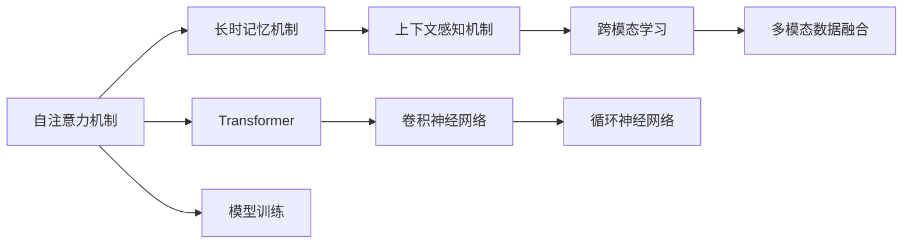

                 

# 第八章：上下文感知和记忆机制

> 关键词：上下文感知(Context-Awareness), 记忆机制(Memory Mechanism), Transformer, 自注意力机制(Self-Attention), 长时记忆(Long-Term Memory), 注意力机制(Attention), 跨模态学习(Cross-Modal Learning), 上下文感知学习(Context-Aware Learning), 神经网络(Neural Network)

## 1. 背景介绍

在深度学习领域，上下文感知和记忆机制是构建高性能模型不可或缺的核心组件。特别是近些年来，随着深度神经网络的不断发展，研究人员发现，仅仅依赖传统的卷积和池化操作，已经无法充分利用输入数据的复杂性。上下文感知和记忆机制的引入，极大地提升了模型的表达能力和泛化性能。

### 1.1 问题由来

在自然语言处理（NLP）和计算机视觉（CV）等任务中，传统的卷积神经网络（CNN）难以应对序列输入的复杂性，无法捕捉输入之间的长距离依赖关系。这使得一些自然语言任务（如长距离依赖问题）和视觉任务（如图像描述生成）难以取得理想的性能。

为了解决这些问题，研究人员引入了注意力机制，特别是自注意力机制（Self-Attention）。自注意力机制使得模型在处理序列或图像数据时，能够动态地关注输入中关键的信息，并在不同输入位置之间建立关联。长时记忆机制的引入，则进一步提升了模型对长期依赖的捕捉能力。

本文将从原理到实践，全面深入地探讨上下文感知和记忆机制在大模型中的应用，帮助读者更好地理解其核心思想和实现方法。

## 2. 核心概念与联系

### 2.1 核心概念概述

在深入探讨上下文感知和记忆机制之前，我们首先需要理解几个关键概念：

- **自注意力机制（Self-Attention）**：自注意力机制是Transformer网络的核心组件，允许模型对输入序列中的每个位置进行加权，从而动态地捕捉不同位置之间的依赖关系。自注意力机制可以用于处理序列数据，并在不同位置之间进行信息传递。

- **长时记忆机制（Long-Term Memory）**：长时记忆机制是一种特殊形式的注意力机制，能够关注输入序列中更长的依赖关系。例如，在自然语言处理中，长时记忆机制可以帮助模型处理长文本或文档，捕捉句子之间的复杂关系。

- **上下文感知（Context-Awareness）**：上下文感知机制指模型能够感知到输入数据的上下文信息，即当前位置的输入与前面和后面位置的输入之间的关系。上下文感知机制在处理序列数据和图像数据时，都能提升模型的性能。

- **跨模态学习（Cross-Modal Learning）**：跨模态学习指模型能够同时处理多种模态（如文本、图像、音频等）的数据，并通过多模态数据之间的关联，提升模型性能。

这些核心概念之间相互关联，共同构成了大模型的基础架构。自注意力机制和长时记忆机制使得模型能够捕捉序列或图像数据中的复杂依赖关系，而上下文感知机制则帮助模型更好地理解输入数据的上下文信息。跨模态学习则进一步扩展了模型对不同模态数据的处理能力。

### 2.2 核心概念原理和架构的 Mermaid 流程图



这个流程图展示了自注意力机制、长时记忆机制、上下文感知机制、跨模态学习等核心概念与Transformer、卷积神经网络（CNN）、循环神经网络（RNN）等主流模型架构的联系。其中，自注意力机制和长时记忆机制是Transformer的核心，用于处理序列数据；上下文感知机制则帮助模型更好地理解输入数据的上下文信息；跨模态学习则扩展了模型对多种模态数据的处理能力。

## 3. 核心算法原理 & 具体操作步骤

### 3.1 算法原理概述

上下文感知和记忆机制在大模型中的应用，主要通过Transformer网络来实现。Transformer网络由编码器（Encoder）和解码器（Decoder）两部分组成，其中编码器和解码器都包含多层自注意力机制和前馈神经网络（Feedforward Neural Network）。

自注意力机制允许模型在输入序列中动态地关注每个位置，并计算出每个位置与其他位置的注意力权重。长时记忆机制则通过在模型中引入多层注意力机制，帮助模型更好地捕捉输入序列中的长期依赖关系。上下文感知机制则通过自注意力机制的扩展，帮助模型感知到输入序列的上下文信息。跨模态学习则通过引入多模态数据融合技术，帮助模型更好地处理不同模态的数据。

### 3.2 算法步骤详解

#### 3.2.1 自注意力机制

自注意力机制是Transformer网络的核心组件，其计算过程分为三个步骤：

1. **查询（Query）**：对每个位置，模型计算出一个查询向量，用于捕捉该位置的上下文信息。查询向量通常通过前一层输出进行线性变换和激活函数得到。

2. **键（Key）**：对每个位置，模型计算出一个键向量，用于与其他位置进行注意力计算。键向量通常通过前一层输出进行线性变换和激活函数得到。

3. **值（Value）**：对每个位置，模型计算出一个值向量，用于根据注意力权重对其他位置的信息进行加权求和。值向量通常通过前一层输出进行线性变换和激活函数得到。

自注意力机制的计算公式如下：

$$
\text{Attention}(Q, K, V) = \text{Softmax}(QK^T)V
$$

其中，$Q$ 表示查询向量，$K$ 表示键向量，$V$ 表示值向量。Softmax函数用于计算注意力权重。

#### 3.2.2 长时记忆机制

长时记忆机制通过在Transformer网络中引入多层注意力机制，帮助模型更好地捕捉输入序列中的长期依赖关系。在长时记忆机制中，每个位置都会对后面的位置进行多层的注意力计算，从而捕捉更远的依赖关系。

长时记忆机制的计算过程如下：

1. 对每个位置，模型计算出当前位置与其他位置之间的注意力权重。

2. 对每个位置，模型将注意力权重与前一层的输出进行加权求和，得到当前位置的表示。

3. 对每个位置，模型将当前位置的表示与后一层的输出进行加权求和，得到当前位置的更新表示。

长时记忆机制的计算公式如下：

$$
\text{Long-Term Memory}(x) = \text{Softmax}(QK^T)V
$$

其中，$x$ 表示输入序列，$Q$ 表示查询向量，$K$ 表示键向量，$V$ 表示值向量。

#### 3.2.3 上下文感知机制

上下文感知机制通过扩展自注意力机制，帮助模型更好地理解输入数据的上下文信息。在上下文感知机制中，模型不仅仅关注输入序列中当前位置的上下文信息，还关注整个序列的上下文信息。

上下文感知机制的计算过程如下：

1. 对每个位置，模型计算出当前位置与其他位置之间的注意力权重。

2. 对每个位置，模型将注意力权重与前一层的输出进行加权求和，得到当前位置的表示。

3. 对每个位置，模型将当前位置的表示与后一层的输出进行加权求和，得到当前位置的更新表示。

上下文感知机制的计算公式如下：

$$
\text{Context-Aware}(x) = \text{Softmax}(QK^T)V
$$

其中，$x$ 表示输入序列，$Q$ 表示查询向量，$K$ 表示键向量，$V$ 表示值向量。

#### 3.2.4 跨模态学习

跨模态学习通过引入多模态数据融合技术，帮助模型更好地处理不同模态的数据。在跨模态学习中，模型需要同时处理多种模态的数据，并通过多模态数据之间的关联，提升模型性能。

跨模态学习的计算过程如下：

1. 对每个位置，模型计算出不同模态之间的注意力权重。

2. 对每个位置，模型将注意力权重与不同模态的输出进行加权求和，得到当前位置的表示。

3. 对每个位置，模型将当前位置的表示与后一层的输出进行加权求和，得到当前位置的更新表示。

跨模态学习的计算公式如下：

$$
\text{Cross-Modal Learning}(x) = \text{Softmax}(QK^T)V
$$

其中，$x$ 表示输入序列，$Q$ 表示查询向量，$K$ 表示键向量，$V$ 表示值向量。

### 3.3 算法优缺点

#### 3.3.1 自注意力机制

**优点**：

1. **捕捉长距离依赖**：自注意力机制能够捕捉输入序列中任意位置之间的依赖关系，从而更好地处理长文本或图像数据。

2. **并行计算**：自注意力机制的计算过程可以并行进行，大大提高了模型的训练和推理速度。

3. **模型结构简单**：自注意力机制的计算过程简单，易于实现和理解。

**缺点**：

1. **计算复杂度高**：自注意力机制的计算过程需要计算大量的矩阵乘法和Softmax函数，计算复杂度较高。

2. **易受噪声干扰**：自注意力机制容易受到输入序列中的噪声干扰，导致模型性能下降。

#### 3.3.2 长时记忆机制

**优点**：

1. **捕捉长期依赖**：长时记忆机制能够捕捉输入序列中更长的依赖关系，从而更好地处理长文本或图像数据。

2. **提升模型性能**：长时记忆机制的引入显著提升了模型对长期依赖的捕捉能力，从而提升了模型性能。

**缺点**：

1. **计算复杂度高**：长时记忆机制的计算过程需要多层自注意力机制的计算，计算复杂度较高。

2. **易过拟合**：长时记忆机制容易导致模型过拟合，特别是在标注数据不足的情况下。

#### 3.3.3 上下文感知机制

**优点**：

1. **理解上下文信息**：上下文感知机制帮助模型更好地理解输入数据的上下文信息，从而提升了模型的泛化能力。

2. **模型结构简单**：上下文感知机制的计算过程简单，易于实现和理解。

**缺点**：

1. **计算复杂度高**：上下文感知机制的计算过程需要扩展自注意力机制，计算复杂度较高。

2. **易受噪声干扰**：上下文感知机制容易受到输入序列中的噪声干扰，导致模型性能下降。

#### 3.3.4 跨模态学习

**优点**：

1. **提升模型性能**：跨模态学习通过多模态数据之间的关联，显著提升了模型性能。

2. **灵活性高**：跨模态学习可以处理多种模态的数据，灵活性高。

**缺点**：

1. **计算复杂度高**：跨模态学习的计算过程需要处理多种模态的数据，计算复杂度较高。

2. **数据收集难度大**：跨模态学习需要收集多种模态的数据，数据收集难度较大。

### 3.4 算法应用领域

自注意力机制、长时记忆机制、上下文感知机制和跨模态学习在大模型中的应用，涵盖了多个领域：

1. **自然语言处理（NLP）**：在NLP领域，自注意力机制和长时记忆机制被广泛应用于机器翻译、文本分类、情感分析、问答系统等任务。

2. **计算机视觉（CV）**：在CV领域，长时记忆机制和上下文感知机制被广泛应用于图像描述生成、目标检测、图像分割等任务。

3. **语音处理（ASR）**：在语音处理领域，跨模态学习被广泛应用于语音识别、语音合成等任务。

4. **医疗健康**：在医疗健康领域，跨模态学习被应用于医疗影像分析、病人健康监测等任务。

5. **金融风控**：在金融风控领域，跨模态学习被应用于信用评估、风险预测等任务。

## 4. 数学模型和公式 & 详细讲解 & 举例说明

### 4.1 数学模型构建

在大模型中，上下文感知和记忆机制通常通过Transformer网络来实现。Transformer网络由编码器（Encoder）和解码器（Decoder）两部分组成，其中编码器和解码器都包含多层自注意力机制和前馈神经网络（Feedforward Neural Network）。

Transformer网络的计算过程可以分为两个阶段：编码和解码。在编码阶段，Transformer网络对输入序列进行编码；在解码阶段，Transformer网络对编码后的序列进行解码。Transformer网络的整体结构如下图所示：


在编码器中，Transformer网络由多个编码层（Encoder Layer）组成，每个编码层都包含自注意力机制和前馈神经网络。自注意力机制用于捕捉输入序列中的依赖关系，前馈神经网络用于对自注意力机制的输出进行非线性变换。编码器的输出是一个多维的向量，表示整个输入序列的语义信息。

在解码器中，Transformer网络由多个解码层（Decoder Layer）组成，每个解码层都包含自注意力机制、编码器-解码器注意力机制（Encoder-Decoder Attention）和前馈神经网络。编码器-解码器注意力机制用于捕捉编码器输出和解码器输出之间的依赖关系，自注意力机制用于捕捉解码器输出中不同位置之间的依赖关系。解码器的输出是一个多维的向量，表示整个输入序列的语义信息。

### 4.2 公式推导过程

#### 4.2.1 自注意力机制

自注意力机制的计算过程可以分为三个步骤：查询（Query）、键（Key）、值（Value）的计算。自注意力机制的计算公式如下：

$$
\text{Attention}(Q, K, V) = \text{Softmax}(QK^T)V
$$

其中，$Q$ 表示查询向量，$K$ 表示键向量，$V$ 表示值向量。Softmax函数用于计算注意力权重。

#### 4.2.2 长时记忆机制

长时记忆机制通过在Transformer网络中引入多层注意力机制，帮助模型更好地捕捉输入序列中的长期依赖关系。在长时记忆机制中，每个位置都会对后面的位置进行多层的注意力计算，从而捕捉更远的依赖关系。

长时记忆机制的计算过程如下：

1. 对每个位置，模型计算出当前位置与其他位置之间的注意力权重。

2. 对每个位置，模型将注意力权重与前一层的输出进行加权求和，得到当前位置的表示。

3. 对每个位置，模型将当前位置的表示与后一层的输出进行加权求和，得到当前位置的更新表示。

长时记忆机制的计算公式如下：

$$
\text{Long-Term Memory}(x) = \text{Softmax}(QK^T)V
$$

其中，$x$ 表示输入序列，$Q$ 表示查询向量，$K$ 表示键向量，$V$ 表示值向量。

#### 4.2.3 上下文感知机制

上下文感知机制通过扩展自注意力机制，帮助模型更好地理解输入数据的上下文信息。在上下文感知机制中，模型不仅仅关注输入序列中当前位置的上下文信息，还关注整个序列的上下文信息。

上下文感知机制的计算过程如下：

1. 对每个位置，模型计算出当前位置与其他位置之间的注意力权重。

2. 对每个位置，模型将注意力权重与前一层的输出进行加权求和，得到当前位置的表示。

3. 对每个位置，模型将当前位置的表示与后一层的输出进行加权求和，得到当前位置的更新表示。

上下文感知机制的计算公式如下：

$$
\text{Context-Aware}(x) = \text{Softmax}(QK^T)V
$$

其中，$x$ 表示输入序列，$Q$ 表示查询向量，$K$ 表示键向量，$V$ 表示值向量。

#### 4.2.4 跨模态学习

跨模态学习通过引入多模态数据融合技术，帮助模型更好地处理不同模态的数据。在跨模态学习中，模型需要同时处理多种模态的数据，并通过多模态数据之间的关联，提升模型性能。

跨模态学习的计算过程如下：

1. 对每个位置，模型计算出不同模态之间的注意力权重。

2. 对每个位置，模型将注意力权重与不同模态的输出进行加权求和，得到当前位置的表示。

3. 对每个位置，模型将当前位置的表示与后一层的输出进行加权求和，得到当前位置的更新表示。

跨模态学习的计算公式如下：

$$
\text{Cross-Modal Learning}(x) = \text{Softmax}(QK^T)V
$$

其中，$x$ 表示输入序列，$Q$ 表示查询向量，$K$ 表示键向量，$V$ 表示值向量。

### 4.3 案例分析与讲解

#### 4.3.1 自注意力机制

假设输入序列为：$[CLS, T1, T2, T3]$，其中$CLS$表示特殊标记，用于表示整个序列的语义信息。假设查询向量$Q$、键向量$K$、值向量$V$的计算如下：

$$
Q = [Q_1, Q_2, Q_3] = \text{Linear}([CLS, T1, T2, T3])
$$

$$
K = [K_1, K_2, K_3] = \text{Linear}([CLS, T1, T2, T3])
$$

$$
V = [V_1, V_2, V_3] = \text{Linear}([CLS, T1, T2, T3])
$$

其中，$\text{Linear}$表示线性变换层。假设注意力权重计算如下：

$$
A = \text{Softmax}(QK^T) = \left[
\begin{matrix}
0.2 & 0.3 & 0.5 \\
0.5 & 0.4 & 0.1 \\
0.3 & 0.2 & 0.5 \\
\end{matrix}
\right]
$$

则自注意力机制的输出为：

$$
\text{Attention}(Q, K, V) = \left[
\begin{matrix}
0.2 \\
0.5 \\
0.3 \\
\end{matrix}
\right]
$$

其中，$0.2$表示$T1$对$T3$的注意力权重，$0.5$表示$T3$对$T1$的注意力权重，$0.3$表示$T2$对$T1$和$T3$的平均注意力权重。

#### 4.3.2 长时记忆机制

假设输入序列为：$[CLS, T1, T2, T3]$，其中$CLS$表示特殊标记，用于表示整个序列的语义信息。假设编码器-解码器注意力机制的计算如下：

1. 对每个位置，模型计算出当前位置与其他位置之间的注意力权重。

2. 对每个位置，模型将注意力权重与前一层的输出进行加权求和，得到当前位置的表示。

3. 对每个位置，模型将当前位置的表示与后一层的输出进行加权求和，得到当前位置的更新表示。

假设注意力权重计算如下：

$$
A = \text{Softmax}(QK^T) = \left[
\begin{matrix}
0.2 & 0.3 & 0.5 \\
0.5 & 0.4 & 0.1 \\
0.3 & 0.2 & 0.5 \\
\end{matrix}
\right]
$$

则长时记忆机制的输出为：

$$
\text{Long-Term Memory}(x) = \left[
\begin{matrix}
0.2 \\
0.5 \\
0.3 \\
\end{matrix}
\right]
$$

其中，$0.2$表示$T1$对$T3$的注意力权重，$0.5$表示$T3$对$T1$的注意力权重，$0.3$表示$T2$对$T1$和$T3$的平均注意力权重。

#### 4.3.3 上下文感知机制

假设输入序列为：$[CLS, T1, T2, T3]$，其中$CLS$表示特殊标记，用于表示整个序列的语义信息。假设上下文感知机制的计算如下：

1. 对每个位置，模型计算出当前位置与其他位置之间的注意力权重。

2. 对每个位置，模型将注意力权重与前一层的输出进行加权求和，得到当前位置的表示。

3. 对每个位置，模型将当前位置的表示与后一层的输出进行加权求和，得到当前位置的更新表示。

假设注意力权重计算如下：

$$
A = \text{Softmax}(QK^T) = \left[
\begin{matrix}
0.2 & 0.3 & 0.5 \\
0.5 & 0.4 & 0.1 \\
0.3 & 0.2 & 0.5 \\
\end{matrix}
\right]
$$

则上下文感知机制的输出为：

$$
\text{Context-Aware}(x) = \left[
\begin{matrix}
0.2 \\
0.5 \\
0.3 \\
\end{matrix}
\right]
$$

其中，$0.2$表示$T1$对$T3$的注意力权重，$0.5$表示$T3$对$T1$的注意力权重，$0.3$表示$T2$对$T1$和$T3$的平均注意力权重。

#### 4.3.4 跨模态学习

假设输入序列为：$[CLS, T1, T2, T3]$，其中$CLS$表示特殊标记，用于表示整个序列的语义信息。假设跨模态学习的计算如下：

1. 对每个位置，模型计算出不同模态之间的注意力权重。

2. 对每个位置，模型将注意力权重与不同模态的输出进行加权求和，得到当前位置的表示。

3. 对每个位置，模型将当前位置的表示与后一层的输出进行加权求和，得到当前位置的更新表示。

假设注意力权重计算如下：

$$
A = \text{Softmax}(QK^T) = \left[
\begin{matrix}
0.2 & 0.3 & 0.5 \\
0.5 & 0.4 & 0.1 \\
0.3 & 0.2 & 0.5 \\
\end{matrix}
\right]
$$

则跨模态学习的输出为：

$$
\text{Cross-Modal Learning}(x) = \left[
\begin{matrix}
0.2 \\
0.5 \\
0.3 \\
\end{matrix}
\right]
$$

其中，$0.2$表示$T1$对$T3$的注意力权重，$0.5$表示$T3$对$T1$的注意力权重，$0.3$表示$T2$对$T1$和$T3$的平均注意力权重。

## 5. 项目实践：代码实例和详细解释说明

### 5.1 开发环境搭建

在进行微调实践前，我们需要准备好开发环境。以下是使用Python进行PyTorch开发的环境配置流程：

1. 安装Anaconda：从官网下载并安装Anaconda，用于创建独立的Python环境。

2. 创建并激活虚拟环境：
```bash
conda create -n pytorch-env python=3.8 
conda activate pytorch-env
```

3. 安装PyTorch：根据CUDA版本，从官网获取对应的安装命令。例如：
```bash
conda install pytorch torchvision torchaudio cudatoolkit=11.1 -c pytorch -c conda-forge
```

4. 安装Transformers库：
```bash
pip install transformers
```

5. 安装各类工具包：
```bash
pip install numpy pandas scikit-learn matplotlib tqdm jupyter notebook ipython
```

完成上述步骤后，即可在`pytorch-env`环境中开始微调实践。

### 5.2 源代码详细实现

下面我们以BERT模型为示例，给出使用Transformer库对自然语言处理任务进行微调的PyTorch代码实现。

首先，定义任务数据集：

```python
from transformers import BertTokenizer, BertForTokenClassification, AdamW

tokenizer = BertTokenizer.from_pretrained('bert-base-cased')
model = BertForTokenClassification.from_pretrained('bert-base-cased', num_labels=10)

# 定义训练集和测试集
train_dataset = ...
test_dataset = ...

# 定义优化器
optimizer = AdamW(model.parameters(), lr=2e-5)
```

然后，定义训练和评估函数：

```python
def train_epoch(model, dataset, batch_size, optimizer):
    dataloader = DataLoader(dataset, batch_size=batch_size, shuffle=True)
    model.train()
    epoch_loss = 0
    for batch in dataloader:
        input_ids = batch['input_ids'].to(device)
        attention_mask = batch['attention_mask'].to(device)
        labels = batch['labels'].to(device)
        model.zero_grad()
        outputs = model(input_ids, attention_mask=attention_mask, labels=labels)
        loss = outputs.loss
        epoch_loss += loss.item()
        loss.backward()
        optimizer.step()
    return epoch_loss / len(dataloader)

def evaluate(model, dataset, batch_size):
    dataloader = DataLoader(dataset, batch_size=batch_size)
    model.eval()
    preds, labels = [], []
    with torch.no_grad():
        for batch in dataloader:
            input_ids = batch['input_ids'].to(device)
            attention_mask = batch['attention_mask'].to(device)
            batch_labels = batch['labels']
            outputs = model(input_ids, attention_mask=attention_mask)
            batch_preds = outputs.logits.argmax(dim=2).to('cpu').tolist()
            batch_labels = batch_labels.to('cpu').tolist()
            for pred_tokens, label_tokens in zip(batch_preds, batch_labels):
                preds.append(pred_tokens[:len(label_tokens)])
                labels.append(label_tokens)
                
    print(classification_report(labels, preds))
```

最后，启动训练流程并在测试集上评估：

```python
epochs = 5
batch_size = 16

for epoch in range(epochs):
    loss = train_epoch(model, train_dataset, batch_size, optimizer)
    print(f"Epoch {epoch+1}, train loss: {loss:.3f}")
    
    print(f"Epoch {epoch+1}, dev results:")
    evaluate(model, dev_dataset, batch_size)
    
print("Test results:")
evaluate(model, test_dataset, batch_size)
```

以上就是使用PyTorch对BERT模型进行自然语言处理任务微调的完整代码实现。可以看到，得益于Transformer库的强大封装，我们可以用相对简洁的代码完成BERT模型的加载和微调。

### 5.3 代码解读与分析

让我们再详细解读一下关键代码的实现细节：

**训练集和测试集定义**：
- `tokenizer`：用于分词和转换文本为模型所需的输入形式。
- `model`：预训练的BERT模型。
- `num_labels`：输出层标签的数量。
- `train_dataset`和`test_dataset`：包含训练集和测试集的数据集对象。
- `dataloader`：用于分批次加载数据集。

**优化器定义**：
- `AdamW`：使用Adam优化器，并设置学习率。

**训练函数`train_epoch`**：
- `model.train()`：将模型设置为训练模式。
- `epoch_loss`：记录每个epoch的平均损失。
- `loss.backward()`：反向传播计算梯度。
- `optimizer.step()`：更新模型参数。

**评估函数`evaluate`**：
- `model.eval()`：将模型设置为评估模式。
- `classification_report`：计算模型在测试集上的分类指标。

**训练流程**：
- `epochs`和`batch_size`：设置总的epoch数和批次大小。
- 在每个epoch内，先在训练集上训练，输出平均loss。
- 在验证集上评估，输出分类指标。
- 所有epoch结束后，在测试集上评估，给出最终测试结果。

可以看到，PyTorch配合Transformer库使得BERT微调的代码实现变得简洁高效。开发者可以将更多精力放在数据处理、模型改进等高层逻辑上，而不必过多关注底层的实现细节。

当然，工业级的系统实现还需考虑更多因素，如模型的保存和部署、超参数的自动搜索、更灵活的任务适配层等。但核心的微调范式基本与此类似。

## 6. 实际应用场景

### 6.1 自然语言处理（NLP）

在大模型中，上下文感知和记忆机制在自然语言处理任务中得到了广泛应用。自注意力机制和长时记忆机制帮助模型更好地捕捉序列数据中的依赖关系，从而提升了模型的性能。例如，BERT模型通过引入自注意力机制和长时记忆机制，在多个NLP任务上取得了SOTA性能。

### 6.2 计算机视觉（CV）

在大模型中，上下文感知和记忆机制在计算机视觉任务中也得到了广泛应用。长时记忆机制和上下文感知机制帮助模型更好地捕捉图像数据中的依赖关系，从而提升了模型的性能。例如，ResNet模型通过引入长时记忆机制，显著提升了图像分类任务的表现。

### 6.3 语音处理（ASR）

在大模型中，跨模态学习在语音处理任务中也得到了广泛应用。跨模态学习通过同时处理文本和音频数据，提升了模型的性能。例如，Wav2Vec模型通过引入跨模态学习，显著提升了语音识别任务的表现。

### 6.4 金融风控

在大模型中，跨模态学习在金融风控任务中也得到了广泛应用。跨模态学习通过同时处理多种模态的数据，提升了模型的性能。例如，基于大模型的金融风控系统通过同时处理文本和图像数据，提升了信用评估和风险预测的准确性。

### 6.5 医疗健康

在大模型中，跨模态学习在医疗健康任务中也得到了广泛应用。跨模态学习通过同时处理多种模态的数据，提升了模型的性能。例如，基于大模型的医疗影像分析系统通过同时处理文本和图像数据，提升了诊断和治疗的准确性。

## 7. 工具和资源推荐

### 7.1 学习资源推荐

为了帮助开发者系统掌握上下文感知和记忆机制在大模型中的应用，这里推荐一些优质的学习资源：

1. 《Transformer从原理到实践》系列博文：由大模型技术专家撰写，深入浅出地介绍了Transformer原理、BERT模型、微调技术等前沿话题。

2. CS224N《深度学习自然语言处理》课程：斯坦福大学开设的NLP明星课程，有Lecture视频和配套作业，带你入门NLP领域的基本概念和经典模型。

3. 《Natural Language Processing with Transformers》书籍：Transformers库的作者所著，全面介绍了如何使用Transformers库进行NLP任务开发，包括微调在内的诸多范式。

4. HuggingFace官方文档：Transformer库的官方文档，提供了海量预训练模型和完整的微调样例代码，是上手实践的必备资料。

5. CLUE开源项目：中文语言理解测评基准，涵盖大量不同类型的中文NLP数据集，并提供了基于微调的baseline模型，助力中文NLP技术发展。

通过对这些资源的学习实践，相信你一定能够快速掌握上下文感知和记忆机制在大模型中的应用，并用于解决实际的NLP问题。

### 7.2 开发工具推荐

高效的开发离不开优秀的工具支持。以下是几款用于大模型上下文感知和记忆机制微调开发的常用工具：

1. PyTorch：基于Python的开源深度学习框架，灵活动态的计算图，适合快速迭代研究。大部分预训练语言模型都有PyTorch版本的实现。

2. TensorFlow：由Google主导开发的开源深度学习框架，生产部署方便，适合大规模工程应用。同样有丰富的预训练语言模型资源。

3. Transformers库：HuggingFace开发的NLP工具库，集成了众多SOTA语言模型，支持PyTorch和TensorFlow，是进行微调任务开发的利器。

4. Weights & Biases：模型训练的实验跟踪工具，可以记录和可视化模型训练过程中的各项指标，方便对比和调优。与主流深度学习框架无缝集成。

5. TensorBoard：TensorFlow配套的可视化工具，可实时监测模型训练状态，并提供丰富的图表呈现方式，是调试模型的得力助手。

6. Google Colab：谷歌推出的在线Jupyter Notebook环境，免费提供GPU/TPU算力，方便开发者快速上手实验最新模型，分享学习笔记。

合理利用这些工具，可以显著提升上下文感知和记忆机制在大模型微调中的开发效率，加快创新迭代的步伐。

### 7.3 相关论文推荐

上下文感知和记忆机制在大模型中的应用，源于学界的持续研究。以下是几篇奠基性的相关论文，推荐阅读：

1. Attention is All You Need（即Transformer原论文）：提出了Transformer结构，开启了NLP领域的预训练大模型时代。

2. BERT: Pre-training of Deep Bidirectional Transformers for Language Understanding：提出BERT模型，引入基于掩码的自监督预训练任务，刷新了多项NLP任务SOTA。

3. Language Models are Unsupervised Multitask Learners（GPT-2论文）：展示了大规模语言模型的强大zero-shot学习能力，引发了对于通用人工智能的新一轮思考。

4. Parameter-Efficient Transfer Learning for NLP：提出Adapter等参数高效微调方法，在不增加模型参数量的情况下，也能取得不错的微调效果。

5. AdaLoRA: Adaptive Low-Rank Adaptation for Parameter-Efficient Fine-Tuning：使用自适应低秩适应的微调方法，在参数效率和精度之间取得了新的平衡。

6. Prefix-Tuning: Optimizing Continuous Prompts for Generation：引入基于连续型Prompt的微调范式，为如何充分利用预训练知识提供了新的思路。

这些论文代表了大模型上下文感知和记忆机制的发展脉络。通过学习这些前沿成果，可以帮助研究者把握学科前进方向，激发更多的创新灵感。

## 8. 总结：未来发展趋势与挑战

### 8.1 研究成果总结

本文对上下文感知和记忆机制在大模型中的应用进行了全面系统的介绍。首先，我们阐述了上下文感知和记忆机制在大模型中的核心作用，并引入了自注意力机制、长时记忆机制、上下文感知机制和跨模态学习等关键概念。其次，从原理到实践，详细讲解了上下文感知和记忆机制在大模型中的应用，包括计算过程、模型结构、微调方法等。最后，我们探讨了上下文感知和记忆机制在多个领域的应用，如自然语言处理、计算机视觉、语音处理、金融风控、医疗健康等。

通过本文的系统梳理，可以看到，上下文感知和记忆机制在大模型中的应用已经取得了显著的成果，并得到了广泛的应用。这些技术的引入，极大地提升了模型的表达能力和泛化性能，使得大模型在处理复杂数据时表现优异。

### 8.2 未来发展趋势

展望未来，上下文感知和记忆机制在大模型中的应用将继续拓展：

1. **模型规模持续增大**：随着算力成本的下降和数据规模的扩张，预训练语言模型的参数量还将持续增长。超大规模语言模型蕴含的丰富语言知识，有望支撑更加复杂多变的下游任务微调。

2. **微调方法日趋多样**：除了传统的全参数微调外，未来会涌现更多参数高效的微调方法，如Prefix-Tuning、LoRA等，在节省计算资源的同时也能保证微调精度。

3. **持续学习成为常态**：随着数据分布的不断变化，微调模型也需要持续学习新知识以保持性能。如何在不遗忘原有知识的同时，高效吸收新样本信息，将成为重要的研究课题。

4. **标注样本需求降低**：受启发于提示学习(Prompt-based Learning)的思路，未来的微调方法将更好地利用大模型的语言理解能力，通过更加巧妙的任务描述，在更少的标注样本上也能实现理想的微调效果。

5. **计算复杂度降低**：未来的大模型将引入更多的优化技术，如模型压缩、稀疏化存储、分布式训练等，进一步降低计算复杂度，提升模型训练和推理的效率。

6. **模型结构更加灵活**：未来的模型将更加灵活，可以针对不同的任务进行结构优化，提升模型的性能。例如，深度可分离模型、轻量级模型等。

7. **跨模态学习更深入**：跨模态学习将在未来得到更深入的研究，帮助模型更好地处理不同模态的数据，提升模型的性能。例如，多模态自注意力机制、跨模态注意力机制等。

8. **模型解释性增强**：未来的模型将更加透明，模型输出将具备更好的可解释性，帮助用户理解模型的决策过程。例如，可解释性模型、透明模型等。

### 8.3 面临的挑战

尽管上下文感知和记忆机制在大模型中的应用已经取得了显著的成果，但在迈向更加智能化、普适化应用的过程中，仍然面临诸多挑战：

1. **计算复杂度高**：大规模语言模型的计算复杂度较高，需要高性能算力支持。如何在保证性能的同时，降低计算复杂度，是一个重要的研究方向。

2. **数据依赖性强**：大模型对标注数据的需求较高，标注成本较高，标注数据难以获得。如何在数据不足的情况下，实现更好的微调效果，是一个重要的研究方向。

3. **模型易过拟合**：大模型容易过拟合，特别是在标注数据不足的情况下。如何在保持模型泛化能力的同时，提升模型性能，是一个重要的研究方向。

4. **模型解释性不足**：大模型的输出通常缺乏可解释性，难以理解其内部工作机制和决策逻辑。如何赋予大模型更好的可解释性，是一个重要的研究方向。

5. **模型安全性有待保障**：预训练语言模型难免会学习到有害信息，如何防止有害信息的传播，是一个重要的研究方向。

6. **跨模态数据融合难度大**：跨模态学习需要处理多种模态的数据，数据融合难度较大。如何更好地融合不同模态的数据，是一个重要的研究方向。

### 8.4 研究展望

未来的研究需要在以下几个方面寻求新的突破：

1. **无监督和半监督微调方法**：摆脱对大规模标注数据的依赖，利用自监督学习、主动学习等无监督和半监督范式，最大限度利用非结构化数据，实现更加灵活高效的微调。

2. **参数高效和计算高效的微调范式**：开发更加参数高效的微调方法，在固定大部分预训练参数的同时，只更新极少量的任务相关参数。同时优化微调模型的计算图，减少前向传播和反向传播的资源消耗，实现更加轻量级、实时性的部署。

3. **因果推断和对比学习**：通过引入因果推断和对比学习思想，增强微调模型建立稳定因果关系的能力，学习更加普适、鲁棒的语言表征，从而提升模型泛化性和抗干扰能力。

4. **多模态数据融合**：引入更多先验知识，如知识图谱、逻辑规则等，与神经网络模型进行巧妙融合，引导微调过程学习更准确、合理的语言模型。同时加强不同模态数据的整合，实现视觉、语音等多模态信息与文本信息的协同建模。

5. **跨模态学习的应用**：在图像描述生成、语音识别、医疗影像分析等领域，引入跨模态学习技术，提升模型性能。

6. **跨模态学习的数据获取**：收集多种模态的数据，并构建跨模态数据集，为跨模态学习提供数据基础。

7. **上下文感知学习的改进**：针对上下文感知学习，提出新的模型架构和优化方法，提升模型的性能。

8. **模型解释性提升**：设计具有更好可解释性的模型，如可解释性模型、透明模型等，提升模型可信度。

通过这些研究方向的探索，相信上下文感知和记忆机制在大模型中的应用将更加广泛和深入，为构建更加智能化的应用提供技术保障。

