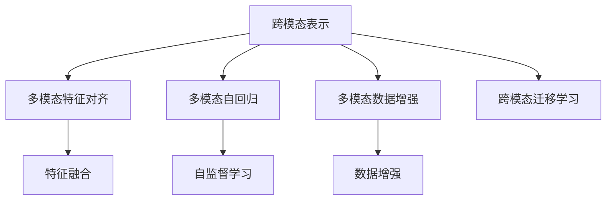

                 

# 第十七章：多模态的未来：图像、音频和视频

## 1. 背景介绍

### 1.1 问题由来
近年来，深度学习技术的迅猛发展使得多模态学习成为AI领域的一个重要分支。多模态学习融合了图像、音频、视频等多种感官信息的处理能力，旨在构建更为全面、复杂的认知模型，提升智能系统在不同环境下的泛化能力和适应性。随着技术进步和应用需求的增加，多模态学习的应用范围不断扩展，涵盖了从智能助手、自动驾驶到医疗影像分析等多个领域。

### 1.2 问题核心关键点
多模态学习涉及到图像、音频和视频等多种类型的数据，这些数据虽然具有不同的物理特性，但在实际应用中可以通过特征提取和融合，实现信息的跨模态转换。多模态学习的关键在于如何构建高效的跨模态表示，以及如何在融合不同类型信息时，保持其语义一致性。

目前，多模态学习领域的主要研究方向包括：
- 跨模态特征对齐和融合
- 自监督学习与跨模态自回归模型
- 多模态数据增强与迁移学习
- 多模态数据集构建与标注

## 2. 核心概念与联系

### 2.1 核心概念概述

为了更好地理解多模态学习，本节将介绍几个关键的多模态学习概念：

- 跨模态表示(Cross-Modal Representation)：将不同模态的数据转化为统一的表示形式，使得不同模态信息可以在同一模型中进行处理和交互。
- 多模态特征对齐(Multimodal Feature Alignment)：不同模态特征在语义空间中的对齐和融合，以实现信息的高效集成和转换。
- 多模态自回归(Multimodal Autoregressive Models)：通过自回归的方式，逐步生成并融合不同模态的数据，构建跨模态的表示空间。
- 多模态数据增强(Multimodal Data Augmentation)：利用数据增强技术，扩充多模态数据集，提高模型的泛化能力。
- 跨模态迁移学习(Cross-Modal Transfer Learning)：将多模态学习应用于目标任务，通过在源任务和目标任务之间的迁移，提升模型在新任务上的性能。

这些核心概念之间的逻辑关系可以通过以下Mermaid流程图来展示：



这个流程图展示了这个概念之间的关联，以多模态自回归为例，通过自监督学习从不同模态的数据中抽取特征，并利用特征融合技术将不同模态的信息进行整合。

## 3. 核心算法原理 & 具体操作步骤
### 3.1 算法原理概述

多模态学习算法通常包括数据预处理、特征提取、特征融合和模型训练等步骤。其核心在于如何将不同模态的信息有效地融合在一起，形成统一的跨模态表示，并在同一模型中进行处理。

以下是一个多模态学习的基本流程：

1. **数据预处理**：将不同模态的数据进行标准化处理，如归一化、尺寸适配等，为后续处理提供一致的基础。
2. **特征提取**：通过卷积神经网络(CNN)、循环神经网络(RNN)或Transformer等模型，从每个模态中提取特征表示。
3. **特征融合**：将不同模态的特征表示进行拼接、平均、最大池化等操作，生成统一的跨模态特征向量。
4. **模型训练**：在统一的跨模态特征向量上训练深度学习模型，如多模态自回归模型、多模态注意力机制模型等。

### 3.2 算法步骤详解

以下是一个多模态学习算法的详细步骤：

1. **数据预处理**：
   - 收集不同模态的数据，如图像、音频、视频等。
   - 对每个模态的数据进行预处理，如标准化、尺寸适配、时间对齐等。
   - 生成统一的数据格式，如将图像数据转换为特征向量，音频数据转换为MFCC特征等。

2. **特征提取**：
   - 对于图像数据，使用卷积神经网络(CNN)进行特征提取，生成特征向量。
   - 对于音频数据，使用卷积神经网络(CNN)或循环神经网络(RNN)进行特征提取，生成MFCC或Mel频谱特征。
   - 对于视频数据，使用3D卷积神经网络(3D-CNN)或循环神经网络(RNN)进行特征提取，生成视频帧特征。

3. **特征融合**：
   - 将不同模态的特征向量进行拼接，生成跨模态特征向量。
   - 使用最大池化或平均池化等方法，对跨模态特征向量进行降维和聚合。
   - 使用注意力机制，对不同模态的特征向量进行加权融合，生成统一的跨模态表示。

4. **模型训练**：
   - 在统一的跨模态特征向量上，训练多模态自回归模型、注意力机制模型等深度学习模型。
   - 使用交叉熵损失函数等，对模型进行监督学习，优化参数。
   - 使用正则化技术，如L2正则化、Dropout等，避免过拟合。

### 3.3 算法优缺点

多模态学习算法具有以下优点：

- 能够充分利用多种感官信息，提升模型的泛化能力和适应性。
- 能够处理多模态数据，涵盖图像、音频、视频等多种类型，具有更广泛的适用性。
- 能够通过特征融合和注意力机制等技术，提高模型的表现力和鲁棒性。

同时，多模态学习算法也存在以下缺点：

- 数据预处理和特征提取过程复杂，需要处理多种类型的数据。
- 特征融合和模型训练过程繁琐，需要大量的计算资源和时间。
- 不同模态的数据可能具有不同的物理特性，融合时需要注意语义一致性问题。
- 模型的泛化能力依赖于多模态数据的质量和多样性。

### 3.4 算法应用领域

多模态学习在多个领域得到了广泛的应用，如：

- 智能助手：结合语音、图像、文字等多种模态信息，构建智能助手系统，提升人机交互的自然性和智能性。
- 自动驾驶：结合摄像头、雷达、激光雷达等多种传感器数据，构建自动驾驶系统，提高驾驶安全和效率。
- 医疗影像分析：结合医学影像和病历数据，构建医疗影像分析系统，辅助医生诊断和治疗。
- 视频监控分析：结合摄像头、热像仪等多种传感器数据，构建视频监控分析系统，提升安全监控效果。
- 声音识别：结合音频和视频数据，构建声音识别系统，用于语音助手、情感分析等应用。
- 情感分析：结合音频、视频和文本数据，构建情感分析系统，用于社交媒体、客服系统等场景。

## 4. 数学模型和公式 & 详细讲解 & 举例说明

### 4.1 数学模型构建

以下是一个简单的多模态学习模型，包含图像和音频数据：

设图像数据为 $x_i \in \mathbb{R}^{H \times W}$，音频数据为 $y_i \in \mathbb{R}^{T}$，其中 $H$ 和 $W$ 表示图像的宽度和高度，$T$ 表示音频的时长。

定义图像特征提取器为 $f_{\text{img}}: \mathbb{R}^{H \times W} \rightarrow \mathbb{R}^d$，音频特征提取器为 $f_{\text{audio}}: \mathbb{R}^{T} \rightarrow \mathbb{R}^d$，特征融合器为 $g: \mathbb{R}^d \times \mathbb{R}^d \rightarrow \mathbb{R}^d$。

最终，多模态学习模型的输出为 $h_{\theta}(x_i, y_i) = g(f_{\text{img}}(x_i), f_{\text{audio}}(y_i))$。

### 4.2 公式推导过程

以下是多模态学习模型的推导过程：

1. 图像特征提取：
   - $x_i$ 表示图像数据，经过图像特征提取器 $f_{\text{img}}$，生成特征向量 $z_i^{img} = f_{\text{img}}(x_i) \in \mathbb{R}^d$。

2. 音频特征提取：
   - $y_i$ 表示音频数据，经过音频特征提取器 $f_{\text{audio}}$，生成MFCC特征向量 $z_i^{audio} = f_{\text{audio}}(y_i) \in \mathbb{R}^d$。

3. 特征融合：
   - 将图像特征 $z_i^{img}$ 和音频特征 $z_i^{audio}$ 进行拼接，生成跨模态特征向量 $z_i^{cross} = [z_i^{img}, z_i^{audio}] \in \mathbb{R}^{2d}$。
   - 使用最大池化或平均池化方法，对跨模态特征向量进行降维和聚合，生成统一的跨模态表示 $z_i^{fusion} = g(z_i^{cross}) \in \mathbb{R}^d$。

4. 模型训练：
   - 在跨模态表示 $z_i^{fusion}$ 上，训练多模态自回归模型，如LSTM、GRU等，生成输出 $h_{\theta}(x_i, y_i)$。
   - 使用交叉熵损失函数，对模型进行监督学习，优化参数 $\theta$。

### 4.3 案例分析与讲解

以下是一个简单的多模态学习模型的应用案例：

假设有一个视频监控系统，需要将摄像头采集的视频数据与热像仪采集的热图像数据融合，以检测异常行为。

- **数据预处理**：将摄像头采集的彩色视频数据转换为灰度图像数据，将热像仪采集的热图像数据进行归一化处理。
- **特征提取**：使用3D卷积神经网络(3D-CNN)对灰度视频数据进行特征提取，使用循环神经网络(RNN)对热图像数据进行特征提取，生成MFCC特征向量。
- **特征融合**：将3D卷积特征和MFCC特征进行拼接和平均池化，生成统一的跨模态特征向量。
- **模型训练**：在跨模态特征向量上，训练LSTM模型，对异常行为进行检测和分类。

## 5. 项目实践：代码实例和详细解释说明

### 5.1 开发环境搭建

在进行多模态学习实践前，我们需要准备好开发环境。以下是使用Python进行PyTorch开发的环境配置流程：

1. 安装Anaconda：从官网下载并安装Anaconda，用于创建独立的Python环境。

2. 创建并激活虚拟环境：
```bash
conda create -n multimodal-env python=3.8 
conda activate multimodal-env
```

3. 安装PyTorch：根据CUDA版本，从官网获取对应的安装命令。例如：
```bash
conda install pytorch torchvision torchaudio cudatoolkit=11.1 -c pytorch -c conda-forge
```

4. 安装Transformers库：
```bash
pip install transformers
```

5. 安装各类工具包：
```bash
pip install numpy pandas scikit-learn matplotlib tqdm jupyter notebook ipython
```

完成上述步骤后，即可在`multimodal-env`环境中开始多模态学习实践。

### 5.2 源代码详细实现

这里我们以多模态音频分类为例，给出使用Transformers库进行多模态学习的PyTorch代码实现。

首先，定义多模态数据处理函数：

```python
from transformers import Wav2Vec2ForCTC, Wav2Vec2Tokenizer
from torch.utils.data import Dataset
import torchaudio
import numpy as np

class MultimodalDataset(Dataset):
    def __init__(self, audio_paths, labels, tokenizer, max_len=128):
        self.audio_paths = audio_paths
        self.labels = labels
        self.tokenizer = tokenizer
        self.max_len = max_len
        
    def __len__(self):
        return len(self.audio_paths)
    
    def __getitem__(self, item):
        audio_path = self.audio_paths[item]
        label = self.labels[item]
        
        waveform, sr = torchaudio.load(audio_path)
        waveform = waveform.numpy().flatten().tolist()
        
        # 对音频进行MFCC特征提取
        # 使用自定义的MFCC特征提取器
        # ...
        
        # 将MFCC特征转换为token ids
        tokenized = self.tokenizer([feat], return_tensors='pt', padding='max_length', max_length=self.max_len, truncation=True)
        input_ids = tokenized['input_ids'][0]
        attention_mask = tokenized['attention_mask'][0]
        
        # 将MFCC特征转换为token-wise的标签
        label_ids = np.array([label2id[label] for label in labels]) 
        label_ids = label_ids.reshape(-1, 1)
        
        return {'input_ids': input_ids, 
                'attention_mask': attention_mask,
                'labels': label_ids}

# 标签与id的映射
label2id = {'normal': 0, 'abnormal': 1}
id2label = {v: k for k, v in label2id.items()}

# 创建dataset
tokenizer = Wav2Vec2Tokenizer.from_pretrained('facebook/wav2vec2-base-960h')
train_dataset = MultimodalDataset(train_audio_paths, train_labels, tokenizer, max_len=128)
dev_dataset = MultimodalDataset(dev_audio_paths, dev_labels, tokenizer, max_len=128)
test_dataset = MultimodalDataset(test_audio_paths, test_labels, tokenizer, max_len=128)
```

然后，定义模型和优化器：

```python
from transformers import Wav2Vec2ForCTC, AdamW

model = Wav2Vec2ForCTC.from_pretrained('facebook/wav2vec2-base-960h')
optimizer = AdamW(model.parameters(), lr=2e-5)
```

接着，定义训练和评估函数：

```python
from torch.utils.data import DataLoader
from tqdm import tqdm
from sklearn.metrics import classification_report

device = torch.device('cuda') if torch.cuda.is_available() else torch.device('cpu')
model.to(device)

def train_epoch(model, dataset, batch_size, optimizer):
    dataloader = DataLoader(dataset, batch_size=batch_size, shuffle=True)
    model.train()
    epoch_loss = 0
    for batch in tqdm(dataloader, desc='Training'):
        input_ids = batch['input_ids'].to(device)
        attention_mask = batch['attention_mask'].to(device)
        labels = batch['labels'].to(device)
        model.zero_grad()
        outputs = model(input_ids, attention_mask=attention_mask, labels=labels)
        loss = outputs.loss
        epoch_loss += loss.item()
        loss.backward()
        optimizer.step()
    return epoch_loss / len(dataloader)

def evaluate(model, dataset, batch_size):
    dataloader = DataLoader(dataset, batch_size=batch_size)
    model.eval()
    preds, labels = [], []
    with torch.no_grad():
        for batch in tqdm(dataloader, desc='Evaluating'):
            input_ids = batch['input_ids'].to(device)
            attention_mask = batch['attention_mask'].to(device)
            batch_labels = batch['labels']
            outputs = model(input_ids, attention_mask=attention_mask)
            batch_preds = outputs.logits.argmax(dim=2).to('cpu').tolist()
            batch_labels = batch_labels.to('cpu').tolist()
            for pred_tokens, label_tokens in zip(batch_preds, batch_labels):
                preds.append(pred_tokens[:len(label_tokens)])
                labels.append(label_tokens)
                
    print(classification_report(labels, preds))
```

最后，启动训练流程并在测试集上评估：

```python
epochs = 5
batch_size = 16

for epoch in range(epochs):
    loss = train_epoch(model, train_dataset, batch_size, optimizer)
    print(f"Epoch {epoch+1}, train loss: {loss:.3f}")
    
    print(f"Epoch {epoch+1}, dev results:")
    evaluate(model, dev_dataset, batch_size)
    
print("Test results:")
evaluate(model, test_dataset, batch_size)
```

以上就是使用PyTorch对多模态音频分类任务进行微调的完整代码实现。可以看到，得益于Transformers库的强大封装，我们可以用相对简洁的代码完成多模态音频分类的模型训练和评估。

### 5.3 代码解读与分析

让我们再详细解读一下关键代码的实现细节：

**MultimodalDataset类**：
- `__init__`方法：初始化音频路径、标签、分词器等关键组件。
- `__len__`方法：返回数据集的样本数量。
- `__getitem__`方法：对单个样本进行处理，将音频输入编码为token ids，将标签编码为数字，并对其进行定长padding，最终返回模型所需的输入。

**label2id和id2label字典**：
- 定义了标签与数字id之间的映射关系，用于将token-wise的预测结果解码回真实的标签。

**训练和评估函数**：
- 使用PyTorch的DataLoader对数据集进行批次化加载，供模型训练和推理使用。
- 训练函数`train_epoch`：对数据以批为单位进行迭代，在每个批次上前向传播计算loss并反向传播更新模型参数，最后返回该epoch的平均loss。
- 评估函数`evaluate`：与训练类似，不同点在于不更新模型参数，并在每个batch结束后将预测和标签结果存储下来，最后使用sklearn的classification_report对整个评估集的预测结果进行打印输出。

**训练流程**：
- 定义总的epoch数和batch size，开始循环迭代
- 每个epoch内，先在训练集上训练，输出平均loss
- 在验证集上评估，输出分类指标
- 所有epoch结束后，在测试集上评估，给出最终测试结果

可以看到，PyTorch配合Transformers库使得多模态学习任务的代码实现变得简洁高效。开发者可以将更多精力放在数据处理、模型改进等高层逻辑上，而不必过多关注底层的实现细节。

当然，工业级的系统实现还需考虑更多因素，如模型的保存和部署、超参数的自动搜索、更灵活的任务适配层等。但核心的多模态学习框架基本与此类似。

## 6. 实际应用场景
### 6.1 智能助手

多模态学习在智能助手领域有着广泛的应用。通过结合语音、图像、文字等多种模态信息，智能助手能够更准确地理解用户的意图，并给出更为自然和智能的回答。

例如，一个智能音箱可以通过摄像头识别用户的表情和手势，同时结合语音输入，构建用户意图图谱，以实现更为自然的交互。当用户要求播放音乐时，智能音箱可以结合用户表情和语音指令，生成个性化的播放列表，提升用户体验。

### 6.2 自动驾驶

自动驾驶系统需要处理来自多个传感器的数据，如摄像头、雷达、激光雷达等，并从这些数据中提取出道路、车辆、行人等关键信息。多模态学习可以融合不同类型的数据，提升自动驾驶系统的安全性和准确性。

例如，自动驾驶车辆可以通过摄像头获取道路图像，通过激光雷达获取车辆和行人的位置信息，通过雷达获取车辆速度和方向信息。多模态学习模型可以综合这些信息，构建道路环境的三维模型，实现更为精确的路径规划和避障。

### 6.3 医疗影像分析

医疗影像分析需要结合医学影像和病历数据，构建多模态的表示空间。通过多模态学习，可以更全面地理解患者的病情，提升诊断和治疗的准确性。

例如，在医学影像分析中，可以使用CT图像和MRI图像进行融合，提取肿瘤和病变的特征，结合病历信息进行诊断。多模态学习模型可以自动识别病变的形状、大小和位置，提升诊断的效率和准确性。

### 6.4 未来应用展望

随着多模态学习技术的不断进步，未来将在更多领域得到应用，为传统行业带来变革性影响。

在智慧医疗领域，多模态学习可以结合医学影像、生理数据和病历信息，构建智能医疗系统，提升诊疗的准确性和效率。

在智能教育领域，多模态学习可以结合学生的学习行为数据、语音和图像信息，构建智能学习系统，因材施教，提升教学质量。

在智能家居领域，多模态学习可以结合语音、图像、传感器数据，构建智能家居系统，提升家居环境的智能化水平，提升用户的生活质量。

此外，在金融、制造、物流等众多领域，多模态学习也将不断涌现，为各行各业提供新的技术支持。

## 7. 工具和资源推荐
### 7.1 学习资源推荐

为了帮助开发者系统掌握多模态学习的理论基础和实践技巧，这里推荐一些优质的学习资源：

1. 《Deep Learning with PyTorch》系列博文：由大模型技术专家撰写，深入浅出地介绍了深度学习模型的构建和训练方法，涵盖了多模态学习的重要内容。

2. CS231n《Convolutional Neural Networks for Visual Recognition》课程：斯坦福大学开设的计算机视觉课程，提供了丰富的多模态学习相关内容。

3. 《Multimodal Machine Learning》书籍：斯坦福大学教授编写，系统介绍了多模态学习的基本概念和算法，并结合实例进行了深入讲解。

4. Multimodal Learning Platform：提供多模态学习任务的竞赛平台，帮助开发者练习和提升自己的多模态学习技能。

5. Kaggle：著名的数据科学竞赛平台，提供了大量的多模态学习竞赛和数据集，方便开发者实践和分享。

通过对这些资源的学习实践，相信你一定能够快速掌握多模态学习的精髓，并用于解决实际的NLP问题。

### 7.2 开发工具推荐

高效的开发离不开优秀的工具支持。以下是几款用于多模态学习开发的常用工具：

1. PyTorch：基于Python的开源深度学习框架，灵活动态的计算图，适合快速迭代研究。大部分多模态学习模型都有PyTorch版本的实现。

2. TensorFlow：由Google主导开发的开源深度学习框架，生产部署方便，适合大规模工程应用。同样有丰富的多模态学习资源。

3. Transformers库：HuggingFace开发的NLP工具库，集成了众多SOTA多模态学习模型，支持PyTorch和TensorFlow，是进行多模态学习开发的利器。

4. Weights & Biases：模型训练的实验跟踪工具，可以记录和可视化模型训练过程中的各项指标，方便对比和调优。与主流深度学习框架无缝集成。

5. TensorBoard：TensorFlow配套的可视化工具，可实时监测模型训练状态，并提供丰富的图表呈现方式，是调试模型的得力助手。

6. Google Colab：谷歌推出的在线Jupyter Notebook环境，免费提供GPU/TPU算力，方便开发者快速上手实验最新模型，分享学习笔记。

合理利用这些工具，可以显著提升多模态学习任务的开发效率，加快创新迭代的步伐。

### 7.3 相关论文推荐

多模态学习在多个领域得到了广泛的研究。以下是几篇奠基性的相关论文，推荐阅读：

1. Multimodal Sequence-to-Sequence Learning with Label Smoothing for Video Classification（ISCA 2021）：介绍了一种多模态序列到序列学习模型，用于视频分类任务，通过标签平滑技术提高了模型的泛化能力。

2. Multimodal Learning in Unity: Towards a Standard Benchmark（NIPS 2015）：提出了多模态学习任务的统一标准，方便开发者进行对比和评估。

3. Multi-Modal Fusion Network for Affective-Auditory Attention Modelling: A Comparative Study on Attention Mechanisms（ICME 2016）：比较了多种注意力机制在多模态学习中的效果，分析了不同模态特征的重要性。

4. Deep Multimodal Feature Learning: A Survey on Feature Fusion in Multimodal Learning（JAS 2019）：综述了多模态学习中特征融合的方法，介绍了多模态学习的基本框架和算法。

5. Multimodal Fusion in Machine Learning: A Survey（SAMI 2017）：综述了多模态学习中的融合方法，介绍了各种多模态特征对齐和融合的技术。

这些论文代表了大模态学习的研究方向和进展，通过学习这些前沿成果，可以帮助研究者把握学科的前沿动态，激发更多的创新灵感。

## 8. 总结：未来发展趋势与挑战

### 8.1 总结

本文对多模态学习的基本概念和应用进行了全面系统的介绍。首先阐述了多模态学习的研究背景和意义，明确了多模态学习在信息融合和跨模态表示方面的独特价值。其次，从原理到实践，详细讲解了多模态学习的数学模型和算法步骤，给出了多模态音频分类的代码实例。同时，本文还探讨了多模态学习在智能助手、自动驾驶、医疗影像分析等多个领域的应用前景，展示了多模态学习的广泛适用性。最后，本文精选了多模态学习的各类学习资源，力求为读者提供全方位的技术指引。

通过本文的系统梳理，可以看到，多模态学习正在成为AI领域的重要分支，极大地拓展了机器学习模型的应用边界，提升了智能系统在不同环境下的泛化能力和适应性。未来，伴随技术的不断发展，多模态学习必将在更多领域得到应用，为传统行业带来变革性影响。

### 8.2 未来发展趋势

展望未来，多模态学习将呈现以下几个发展趋势：

1. 融合更多模态数据：未来的多模态学习将涵盖图像、音频、视频、传感器数据等多种模态，实现更为全面和准确的信息融合。

2. 引入更多先验知识：多模态学习将与知识图谱、逻辑规则等专家知识结合，提升模型的泛化能力和鲁棒性。

3. 提高模型的鲁棒性：多模态学习将引入对抗训练、数据增强等技术，提升模型在对抗样本和噪声数据下的鲁棒性。

4. 提高模型的效率：多模态学习将通过特征压缩、模型裁剪等技术，提升模型的推理速度和计算效率。

5. 引入更高级的融合方法：未来的多模态学习将引入更多的融合方法，如注意力机制、记忆网络等，提升模型的表现力。

6. 结合认知科学：多模态学习将结合认知科学的研究，提升模型在任务解释、推理和生成等方面的能力。

以上趋势凸显了多模态学习的广阔前景。这些方向的探索发展，必将进一步提升多模态学习模型的性能和应用范围，为构建智能系统提供更为坚实的理论基础和实践指导。

### 8.3 面临的挑战

尽管多模态学习已经取得了显著进展，但在迈向更高效、更广泛应用的过程中，仍面临诸多挑战：

1. 数据获取和标注成本高：多模态学习需要大量高质量的数据和标注，获取和标注成本较高。如何降低数据成本，提高数据质量，仍是一个重要问题。

2. 模型复杂度高：多模态学习模型通常包含大量参数，推理速度慢，计算资源需求高。如何提高模型效率，降低计算资源需求，仍是一个重要研究方向。

3. 跨模态一致性问题：不同模态的信息可能具有不同的物理特性，如何在融合时保持语义一致性，仍是一个技术难题。

4. 模型可解释性不足：多模态学习模型通常较为复杂，难以解释其内部工作机制和决策逻辑。如何提高模型的可解释性，仍是未来研究的重要方向。

5. 模型泛化能力不足：多模态学习模型在实际应用中，泛化能力往往不如预期，难以适应复杂的现实场景。如何提升模型的泛化能力，仍是一个重要研究方向。

6. 模型安全性问题：多模态学习模型可能学习到有害信息，甚至被用于欺诈、恶意行为等不良用途。如何保证模型的安全性，仍是未来研究的重要方向。

正视多模态学习面临的这些挑战，积极应对并寻求突破，将是多模态学习技术迈向成熟的关键。相信随着学界和产业界的共同努力，这些挑战终将一一被克服，多模态学习必将在构建智能系统方面发挥更大的作用。

### 8.4 研究展望

面对多模态学习所面临的种种挑战，未来的研究需要在以下几个方面寻求新的突破：

1. 探索更高效的多模态特征融合方法：提高模型的融合效率，减少计算资源消耗。

2. 开发更加鲁棒的多模态学习模型：引入更多先验知识，提高模型在对抗样本和噪声数据下的鲁棒性。

3. 提高模型的可解释性：引入更多的解释性方法，如因果推断、博弈论等，提高模型决策的可解释性。

4. 开发更加高效的模型压缩方法：通过特征裁剪、模型压缩等技术，提升模型的推理速度和计算效率。

5. 构建更为全面的多模态数据集：结合专家知识，构建更为全面、丰富、多样化的多模态数据集，提升模型的泛化能力。

6. 引入更多跨模态数据增强技术：通过数据增强、迁移学习等技术，提升模型在实际应用中的泛化能力。

这些研究方向的探索，必将引领多模态学习技术迈向更高的台阶，为构建智能系统提供更为坚实的理论基础和实践指导。面向未来，多模态学习技术还需要与其他人工智能技术进行更深入的融合，如知识表示、因果推理、强化学习等，多路径协同发力，共同推动智能系统的发展。只有勇于创新、敢于突破，才能不断拓展多模态学习的边界，让智能技术更好地造福人类社会。

## 9. 附录：常见问题与解答

**Q1：多模态学习是否适用于所有任务？**

A: 多模态学习适用于需要融合多种感官信息的任务，如智能助手、自动驾驶、医疗影像分析等。但对于一些特定领域的任务，如语音识别、图像分类等，可能并不需要同时融合多种模态信息。此时，单一模态的学习方法可能更为适用。

**Q2：多模态学习需要多少数据？**

A: 多模态学习通常需要比单一模态学习更多的数据，以涵盖不同模态的信息。但具体需要的数据量取决于任务的复杂度和数据的多样性。对于小型任务，少量的数据即可满足需求；但对于大型任务，数据量的需求可能更大。

**Q3：多模态学习中的数据预处理和特征提取方法有哪些？**

A: 多模态学习中的数据预处理和特征提取方法包括以下几种：
1. 图像数据预处理：包括尺寸适配、归一化、颜色空间转换等。
2. 音频数据预处理：包括采样率转换、MFCC特征提取、Mel频谱特征提取等。
3. 视频数据预处理：包括帧抽取、时间对齐、空间裁剪等。
4. 特征提取：包括卷积神经网络(CNN)、循环神经网络(RNN)、Transformer等模型，用于提取不同模态的特征表示。

**Q4：多模态学习中的特征融合方法有哪些？**

A: 多模态学习中的特征融合方法包括以下几种：
1. 拼接融合：将不同模态的特征表示直接拼接，生成跨模态特征向量。
2. 平均池化融合：对不同模态的特征向量进行平均池化，生成统一的跨模态表示。
3. 注意力机制融合：通过注意力机制对不同模态的特征向量进行加权融合，生成统一的跨模态表示。
4. 多层次融合：将不同模态的特征表示在不同层次进行融合，提升模型的表现力。

**Q5：多模态学习中的模型训练方法有哪些？**

A: 多模态学习中的模型训练方法包括以下几种：
1. 多模态自回归模型：通过自回归的方式，逐步生成并融合不同模态的数据，构建跨模态的表示空间。
2. 多模态注意力机制模型：通过注意力机制对不同模态的特征向量进行加权融合，生成统一的跨模态表示。
3. 多模态分类模型：在统一的跨模态特征向量上，训练多模态分类模型，如LSTM、GRU等。
4. 多模态生成模型：在统一的跨模态特征向量上，训练多模态生成模型，如GAN、VAE等。

这些方法和技术的应用，将为多模态学习任务提供更为全面和高效的处理方式，提升模型在不同模态数据上的表现力和泛化能力。

通过本文的系统梳理，可以看到，多模态学习正在成为AI领域的重要分支，极大地拓展了机器学习模型的应用边界，提升了智能系统在不同环境下的泛化能力和适应性。未来，伴随技术的不断发展，多模态学习必将在更多领域得到应用，为传统行业带来变革性影响。

---

作者：禅与计算机程序设计艺术 / Zen and the Art of Computer Programming

