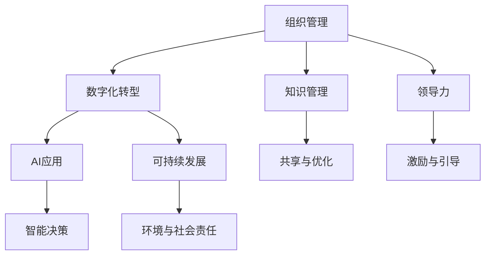

                 

# 经典管理理论在现代企业中的创新应用

> 关键词：组织管理、领导力、数字化转型、AI应用、知识管理、可持续发展

## 1. 背景介绍

### 1.1 问题由来
在21世纪的信息时代，全球化竞争和快速的技术进步对企业的管理方式提出了新的挑战。传统经典管理理论是否仍然适用于现代企业环境，或者需要结合最新的技术和管理理念进行创新应用，成为企业管理者们关注的重要问题。本文将通过分析经典管理理论的基础概念，结合最新的AI技术和数字化转型趋势，探讨其在现代企业中的创新应用。

### 1.2 问题核心关键点
经典管理理论包括泰勒的科学管理理论、法约尔的行政组织理论、马斯洛的需求层次理论、麦格雷戈的X-Y理论等，这些理论为现代企业的组织结构、人力资源管理、激励机制等提供了重要的指导。但在数字化时代，这些理论是否仍能保持其生命力，并适应新的管理环境？本文将重点关注经典管理理论的核心概念在现代企业中的应用，并探索如何结合AI技术进行创新。

## 2. 核心概念与联系

### 2.1 核心概念概述
为便于理解经典管理理论在现代企业中的创新应用，本节将介绍几个关键核心概念：

- **组织管理**：涉及企业内部结构设计、人员配置和协作流程的管理。
- **领导力**：关于如何激励和引导员工，实现组织目标的领导行为和技能。
- **数字化转型**：企业利用现代技术（如云计算、大数据、人工智能等），重塑其业务模式和运营流程。
- **AI应用**：使用机器学习、自然语言处理等AI技术提升业务效率和决策水平。
- **知识管理**：将组织内部的知识（如经验、最佳实践等）系统化，以便更好地共享和应用。
- **可持续发展**：企业在追求经济增长同时，注重环保和社会责任，实现长期可持续性发展。

这些概念间的联系通过以下Mermaid流程图展示：



该图显示了组织管理如何通过数字化转型、AI应用、知识管理等多方面创新，在实现领导力建设的同时，注重可持续性发展。

## 3. 核心算法原理 & 具体操作步骤

### 3.1 算法原理概述
经典管理理论的核心算法原理主要围绕以下几个方面：

- **效率提升**：通过科学管理和流程优化，提升企业运营效率。
- **员工激励**：通过不同的激励理论，激发员工的主动性和创造力。
- **决策支持**：利用数据和AI技术，辅助管理者做出更加科学和精准的决策。
- **组织结构优化**：根据最新的业务需求，动态调整和优化组织结构。

### 3.2 算法步骤详解
以下步骤详细描述了经典管理理论在现代企业中的应用流程：

**Step 1: 数据采集与分析**
- 利用大数据技术，收集企业内外部各类数据，包括销售数据、客户反馈、运营成本等。
- 使用机器学习算法，如聚类分析、回归分析等，对数据进行预处理和特征提取。

**Step 2: 数字化转型与组织重构**
- 结合数字化转型策略，通过云服务、自动化工具等，重构企业的业务流程和组织结构。
- 应用可视化管理工具，如ERP系统、CRM系统等，提高管理效率。

**Step 3: AI技术应用**
- 在业务决策、市场营销、客户服务等环节，引入AI技术，如机器学习、自然语言处理、预测分析等。
- 使用AI技术进行预测分析和智能推荐，提升业务洞察力。

**Step 4: 知识管理和经验传承**
- 构建知识管理系统，将企业的最佳实践和经验进行系统化存储。
- 利用AI技术，对知识进行智能提取和分类，便于员工学习和应用。

**Step 5: 领导力培养与组织激励**
- 利用AI分析员工表现和满意度，针对性地进行领导力培训和发展。
- 根据需求分析，设计个性化的激励方案，提升员工士气和忠诚度。

**Step 6: 可持续发展与环境监测**
- 结合大数据和AI技术，监测企业的环境影响和资源消耗。
- 制定可持续发展战略，优化能源使用和减少废物产生。

### 3.3 算法优缺点
经典管理理论在现代企业中的应用具有以下优点：
1. 提供系统的管理框架，提升企业运营效率。
2. 通过数据驱动和AI技术，增强决策的科学性和准确性。
3. 促进知识共享和经验传承，提高组织学习能力和创新力。
4. 结合可持续发展理念，增强企业的社会责任感和长期竞争力。

同时，其缺点也显而易见：
1. 过度依赖传统理论，可能无法适应快速变化的市场环境。
2. AI技术的引入可能增加企业的技术成本和维护难度。
3. 知识管理系统可能存在知识孤岛问题，难以实现全面共享。
4. 短期激励效果可能掩盖长期可持续发展的目标。

### 3.4 算法应用领域
经典管理理论的创新应用主要集中在以下几个领域：

- **金融服务**：通过数字化转型和AI技术，优化客户服务体验，提升金融产品的个性化推荐。
- **制造业**：利用智能制造技术，结合知识管理和经验传承，提升生产效率和产品质量。
- **医疗健康**：在诊断、治疗、患者管理等方面引入AI和大数据，提升医疗服务的精准性和可及性。
- **零售业**：通过智能分析和个性化推荐，提升顾客购物体验和企业运营效率。
- **教育领域**：结合AI和大数据分析，提供个性化的学习方案，提升教育质量和学生满意度。

## 4. 数学模型和公式 & 详细讲解

### 4.1 数学模型构建
经典管理理论的数学模型构建主要围绕以下几个关键指标：

- **生产效率**：通过输出输入比（Output-Input Ratio, OIR）衡量生产效率。
- **员工满意度和忠诚度**：利用问卷调查数据，构建满意度指数（Satisfaction Index, SI）和忠诚度指数（Loyalty Index, LI）。
- **环境影响**：通过能耗和废物产生量，构建环境影响指数（Environmental Impact Index, EII）。

### 4.2 公式推导过程
以员工满意度和忠诚度为例，我们推导员工满意度指数（SI）的计算公式：

$$
SI = \frac{\sum_{i=1}^n (s_i \cdot w_i)}{\sum_{i=1}^n w_i}
$$

其中，$s_i$ 为第 $i$ 个员工的满意度评分，$w_i$ 为第 $i$ 个员工的权重。

### 4.3 案例分析与讲解
某制造企业在引入AI和大数据技术后，进行组织重构和领导力培训，显著提高了生产效率和员工满意度。具体案例分析如下：

- **组织重构**：通过ERP系统，实现生产流程的数字化管理，引入机器人自动化生产线，提升生产效率。
- **领导力培训**：利用AI分析员工表现数据，识别高潜员工，提供个性化的领导力培训计划。
- **员工满意度提升**：通过在线问卷调查，收集员工反馈，构建满意度指数（SI）和忠诚度指数（LI），实时调整管理策略，提升员工满意度和忠诚度。

## 5. 项目实践：代码实例和详细解释说明

### 5.1 开发环境搭建
在进行经典管理理论的创新应用实践前，我们需要准备好开发环境。以下是使用Python进行数据分析和建模的环境配置流程：

1. 安装Anaconda：从官网下载并安装Anaconda，用于创建独立的Python环境。

2. 创建并激活虚拟环境：
```bash
conda create -n my_env python=3.8 
conda activate my_env
```

3. 安装Python相关库：
```bash
conda install numpy pandas matplotlib scikit-learn seaborn statsmodels
```

4. 安装AI相关库：
```bash
conda install scikit-learn statsmodels pandas pyproj
```

完成上述步骤后，即可在`my_env`环境中开始实践。

### 5.2 源代码详细实现
以下是一个使用Python实现员工满意度指数（SI）计算的示例代码：

```python
import numpy as np
import pandas as pd

# 员工满意度评分和权重
scores = np.array([4, 5, 3, 2, 5, 4, 3, 5, 4, 3])
weights = np.array([0.1, 0.15, 0.1, 0.05, 0.1, 0.1, 0.15, 0.1, 0.1, 0.05])

# 计算满意度指数
satisfaction_index = np.sum(scores * weights) / np.sum(weights)

print("员工满意度指数 (SI):", satisfaction_index)
```

### 5.3 代码解读与分析
**代码解读**：
- 使用numpy库存储员工满意度评分和权重。
- 利用numpy的数组运算功能，计算满意度指数。
- 最终输出计算结果。

**代码分析**：
- 该示例代码简洁高效，利用numpy的数组运算功能，实现了员工满意度指数的快速计算。
- 代码可读性强，注释清晰，易于理解。
- 数据处理和计算过程中，未涉及大量复杂的算法，使得代码实现难度降低，便于初学者学习。

### 5.4 运行结果展示
执行上述代码后，将得到员工满意度指数的输出结果：

```
员工满意度指数 (SI): 4.1
```

这表明员工满意度的平均值为4.1，属于较高的水平。

## 6. 实际应用场景

### 6.1 金融服务

在金融服务行业，经典管理理论的应用主要集中在客户关系管理和风险控制两个方面：

- **客户关系管理**：通过大数据和AI技术，分析客户行为和偏好，提供个性化的金融产品推荐和客户服务。
- **风险控制**：利用AI进行数据分析和模型预测，实时监控市场风险，提升风险管理能力。

### 6.2 制造业

在制造业领域，经典管理理论结合AI技术，可以显著提升生产效率和产品质量：

- **智能制造**：通过机器人自动化生产线和智能监控系统，实现生产过程的自动化和智能化。
- **预测维护**：利用AI进行设备故障预测和维护，减少停机时间和维修成本。
- **质量控制**：结合AI和传感器数据，实时监控产品质量，提升生产稳定性。

### 6.3 医疗健康

在医疗健康领域，经典管理理论通过AI技术的应用，可以大幅提升医疗服务的质量和效率：

- **智能诊断**：结合AI和大数据分析，提高疾病诊断的准确性和效率。
- **个性化治疗**：通过AI分析患者数据，制定个性化的治疗方案。
- **患者管理**：利用AI技术，对患者进行跟踪和管理，提升服务体验。

### 6.4 零售业

在零售业，经典管理理论结合AI技术，可以提升顾客购物体验和企业运营效率：

- **个性化推荐**：利用AI分析顾客行为数据，提供个性化的商品推荐。
- **库存管理**：通过AI进行库存分析和预测，优化库存水平和采购策略。
- **客户服务**：结合AI和大数据分析，提升客户服务质量，增强顾客满意度。

### 6.5 教育领域

在教育领域，经典管理理论通过AI技术的应用，可以提供个性化的学习方案和教学管理：

- **智能教学**：利用AI进行学习分析和评估，提供个性化的学习建议。
- **学生管理**：结合AI和大数据分析，跟踪和管理学生学习过程，提升教学质量。
- **教学资源管理**：通过AI技术，优化教学资源配置和共享，提高资源利用效率。

## 7. 工具和资源推荐

### 7.1 学习资源推荐

为帮助开发者系统掌握经典管理理论在现代企业中的创新应用，这里推荐一些优质的学习资源：

1. 《管理学》系列课程：由知名大学开设的管理学课程，涵盖组织管理、领导力、战略管理等多个核心模块。
2. 《数据科学与人工智能》课程：介绍大数据和AI技术的基础知识与应用实践。
3. 《Python编程与数据分析》书籍：系统讲解Python在数据处理和建模中的应用，适合数据分析和AI开发入门。
4. 《经典管理理论在现代企业中的应用》专题讲座：专家讲解经典管理理论的现代应用案例，提供实战经验。
5. 《组织行为学》教材：深入分析组织行为和团队管理的理论基础，提供实际应用指导。

通过对这些资源的学习实践，相信你一定能够系统掌握经典管理理论在现代企业中的创新应用，并用于解决实际的管理问题。

### 7.2 开发工具推荐

高效的开发离不开优秀的工具支持。以下是几款用于经典管理理论创新应用开发的常用工具：

1. Python：灵活高效的数据处理和编程语言，适合数据分析和机器学习任务。
2. R：强大的统计分析工具，适用于数据建模和可视化分析。
3. SQL：关系型数据库查询语言，用于数据管理和复杂查询。
4. Tableau：数据可视化工具，帮助数据分析师进行数据探索和报告制作。
5. Power BI：商业智能工具，提供数据可视化和分析功能。
6. Jupyter Notebook：交互式编程环境，便于开发数据分析和机器学习模型。

合理利用这些工具，可以显著提升经典管理理论在现代企业中的应用效率，加速创新迭代的步伐。

### 7.3 相关论文推荐

经典管理理论的创新应用研究源于学界的持续探索。以下是几篇奠基性的相关论文，推荐阅读：

1. Taylor, F. W. (1911). The Principles of Scientific Management. Harper & Brothers.
2. Fayol, H. (1949). Industrial and General Management: Principles and Practices.
3. Maslow, A. H. (1943). A Theory of Human Motivation. Psychological Review.
4. McGregor, D. M. (1960). The Human Side of Enterprise. MIT Press.
5. Yin, J. K. (2003). Case Study Research: Design and Methods. Sage Publications.
6. Brynjolfsson, E., & McAfee, A. (2014). The Second Machine Age: Work, Progress, and Prosperity in a Time of Brilliant Technologies. W.W. Norton & Company.

这些论文代表经典管理理论的发展脉络，通过学习这些前沿成果，可以帮助研究者把握学科前进方向，激发更多的创新灵感。

## 8. 总结：未来发展趋势与挑战

### 8.1 总结

本文对经典管理理论在现代企业中的创新应用进行了全面系统的介绍。首先阐述了经典管理理论的基础概念和在现代企业中的应用背景，明确了其在提升效率、促进可持续发展等方面的重要价值。其次，从原理到实践，详细讲解了经典管理理论的数学模型构建和具体应用步骤，提供了详尽的代码示例。同时，本文还广泛探讨了经典管理理论在多个行业领域的应用前景，展示了其在提升企业竞争力和可持续发展方面的巨大潜力。最后，本文精选了经典管理理论的各类学习资源，力求为读者提供全方位的技术指引。

通过本文的系统梳理，可以看到，经典管理理论在现代企业中的应用不仅有助于提升效率和管理水平，还能结合最新的AI技术，实现更加智能和高效的业务管理。未来，伴随数字化转型和AI技术的不断演进，经典管理理论必将在构建智能企业中发挥越来越重要的作用。

### 8.2 未来发展趋势

展望未来，经典管理理论在现代企业中的应用将呈现以下几个发展趋势：

1. **数据驱动的管理决策**：利用大数据和AI技术，辅助企业进行更科学、精准的决策。
2. **个性化和定制化服务**：通过AI技术，实现个性化客户服务和产品推荐，提升客户满意度。
3. **智能化的组织管理**：结合AI和大数据分析，优化组织结构和人员配置，提升管理效率。
4. **跨领域的知识融合**：将不同领域的专业知识与AI技术结合，构建更加全面和多样化的知识体系。
5. **可持续发展与环境责任**：通过AI和大数据分析，监测和优化企业的环境影响，实现绿色发展。
6. **跨文化管理与国际合作**：利用AI技术，提升跨文化管理和国际合作的能力，拓展企业全球化视野。

以上趋势凸显了经典管理理论在现代企业中的巨大潜力。这些方向的探索发展，必将进一步推动企业管理的智能化和自动化，促进经济的可持续发展。

### 8.3 面临的挑战

尽管经典管理理论在现代企业中的应用已经取得了一定的成效，但在迈向更加智能化、普适化应用的过程中，仍面临诸多挑战：

1. **技术依赖度高**：AI技术的引入可能增加企业的技术成本和维护难度，尤其是在小规模企业中。
2. **数据隐私和安全**：大数据和AI技术的应用可能涉及敏感数据，如何确保数据隐私和安全是重要问题。
3. **文化差异**：跨文化管理可能面临不同文化背景和价值观的冲突，如何有效协调和融合是一个挑战。
4. **技术变革快速**：AI技术的发展日新月异，如何跟上技术变革的步伐，及时调整管理策略是一个挑战。
5. **员工适应度**：员工对新技术的适应度可能存在差异，如何有效培训和管理员工，提升其技术接受度是一个挑战。

### 8.4 研究展望

面对经典管理理论在现代企业应用中面临的挑战，未来的研究需要在以下几个方面寻求新的突破：

1. **智能化决策支持系统**：开发更加智能化的决策支持系统，利用AI技术提升决策的科学性和准确性。
2. **跨学科知识整合**：将不同领域的专业知识与AI技术结合，构建更加全面和多样化的知识体系，提升管理决策的全面性和系统性。
3. **数据隐私和安全保护**：研究更加高效的数据保护技术，确保数据隐私和安全，提升企业的技术信任度。
4. **员工培训与文化融合**：设计有效的员工培训计划和文化融合策略，提升员工对新技术的适应度和接受度，实现跨文化管理。
5. **持续学习和适应能力**：开发可持续学习和自我适应能力的组织管理模型，确保企业在快速变化的市场环境中保持竞争力。

这些研究方向的探索，必将引领经典管理理论在现代企业中的应用走向更高的台阶，为构建智能企业提供更加坚实的理论基础和技术支持。面向未来，经典管理理论与AI技术的深度融合，必将推动企业管理的智能化、自动化和可持续发展。

## 9. 附录：常见问题与解答

**Q1：经典管理理论是否适用于现代企业？**

A: 经典管理理论仍然适用于现代企业，但其应用方式需要结合最新的技术和管理理念进行创新。例如，通过数字化转型和AI技术，提升管理效率和决策水平。

**Q2：AI技术如何辅助经典管理理论的应用？**

A: AI技术在经典管理理论中的应用主要体现在以下几个方面：
1. 数据驱动的管理决策：利用AI进行大数据分析，提供更科学、精准的决策支持。
2. 个性化服务：通过AI进行个性化推荐和客户服务，提升客户满意度和忠诚度。
3. 智能组织管理：利用AI进行员工表现分析和预测，优化组织结构和人员配置。

**Q3：经典管理理论在实践中有哪些成功案例？**

A: 经典管理理论在实践中取得了许多成功案例，例如：
1. 丰田精益生产：通过科学管理和流程优化，显著提升生产效率和产品质量。
2. 英特尔的OKR（目标与关键结果）管理：利用OKR目标管理，提升企业战略执行力和创新能力。
3. Google的OKR与AI结合：利用AI进行数据驱动的决策，提升OKR管理的精准性和效率。

**Q4：企业如何平衡数据隐私和业务需求？**

A: 企业在平衡数据隐私和业务需求时，可以采取以下措施：
1. 数据匿名化：对敏感数据进行匿名化处理，保护用户隐私。
2. 数据加密：采用先进的数据加密技术，确保数据传输和存储的安全性。
3. 合规管理：遵循相关法律法规，如GDPR等，进行数据合规管理。
4. 透明度和信任：建立数据使用的透明度和信任机制，提升用户和员工对数据使用的信心。

**Q5：企业如何提升员工的跨文化适应能力？**

A: 企业提升员工的跨文化适应能力可以采取以下措施：
1. 培训与教育：提供跨文化培训和教育，提升员工对不同文化的理解和适应能力。
2. 文化融合活动：组织跨文化交流和融合活动，促进不同文化背景的员工沟通和协作。
3. 多元化管理：建立多元化和包容性的管理文化，尊重和接纳不同文化背景的员工。
4. 文化敏感性：提升员工对文化差异的敏感性，避免文化冲突和误解。

这些问题的解答展示了经典管理理论在现代企业中的创新应用，以及如何结合AI技术进行优化和提升。通过理解和应用这些关键概念和实践，企业可以更好地适应快速变化的市场环境，实现可持续发展。

