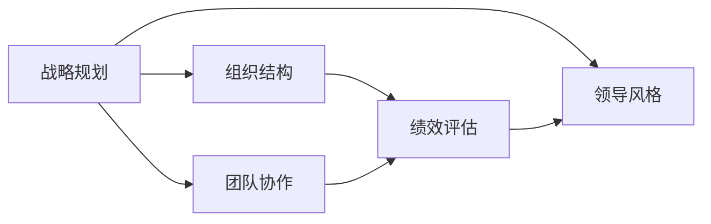
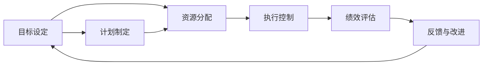

                 

# 经典管理著作的学习方法

## 1. 背景介绍

管理是一门涉及决策、组织、领导、沟通、控制等方面的综合性学科。通过学习经典管理著作，可以深入理解管理理论的精髓，掌握实用的管理技巧，提高个人和组织的综合管理能力。然而，管理著作的体量和深度往往较大，很多读者容易迷失在各种理论和实践中。本文将从学习方法、框架搭建、应用技巧等方面，提供一个系统化的经典管理著作学习指南。

## 2. 核心概念与联系

### 2.1 核心概念概述

管理著作涉及多个核心概念，例如战略规划、组织结构、绩效评估、领导风格、团队协作等。下面将介绍几个常见的核心概念及其联系。

- **战略规划**：是组织为实现其长期目标而制定的行动方案。涉及市场分析、竞争策略、资源配置等方面。
- **组织结构**：是组织内部各职位、部门、层级之间的关系架构。包括直线型、职能型、矩阵型等常见组织结构。
- **绩效评估**：是组织对员工工作表现的量化评价方法，以实现激励和改进。
- **领导风格**：是领导者在管理过程中展现出的行为方式和沟通技巧。分为命令式、民主式、教练式等多种风格。
- **团队协作**：是组织内部多个成员为了共同目标而合作工作的过程，包括沟通、信任、冲突管理等。

这些核心概念通过联系形成管理著作的核心框架，其关系可以通过以下Mermaid流程图展示：



这个流程图展示了战略规划如何通过组织结构、绩效评估、领导风格和团队协作等概念形成完整的管理框架。

### 2.2 核心概念原理和架构的 Mermaid 流程图

以下是管理著作中常见的概念关系流程图：



此图展示了从目标设定到反馈与改进的闭环管理过程，体现了持续改进的思想。

## 3. 核心算法原理 & 具体操作步骤

### 3.1 算法原理概述

经典管理著作的学习方法，本质上是一个由理论到实践的迭代过程。该过程主要包括以下几个关键步骤：

1. **理论学习**：系统地阅读相关著作，理解核心概念、理论模型和案例分析。
2. **框架搭建**：将所学理论应用于具体情境，构建个人或组织的实践框架。
3. **实践应用**：在实际工作中实施管理策略，不断优化和调整。
4. **反思总结**：总结经验教训，形成系统化的管理方法论。

### 3.2 算法步骤详解

**Step 1: 理论学习**

- 选择经典管理著作，如《管理学原理》、《领导艺术》、《公司战略》等。
- 制定阅读计划，逐章节、逐部分深入理解。
- 做笔记记录核心概念、关键术语和重要论点。

**Step 2: 框架搭建**

- 根据理论，设计个人或组织的实践框架。例如，基于SWOT分析构建战略规划框架。
- 明确关键成功因素，设计相应的管理流程和控制机制。
- 制定详细的行动计划，分配资源和任务。

**Step 3: 实践应用**

- 将理论框架应用于实际情境，进行管理实践。例如，通过定期评估团队绩效，调整领导风格。
- 在实践中不断优化管理策略，确保目标实现。例如，根据绩效评估结果，调整资源分配策略。
- 引入新技术和管理工具，提升管理效率。例如，使用项目管理软件提高项目执行力。

**Step 4: 反思总结**

- 定期总结管理实践经验，形成系统化的管理方法论。例如，总结项目成功的关键因素和失败教训。
- 反思管理策略的有效性，不断优化和调整。例如，根据市场变化，调整战略规划。
- 建立持续学习的机制，定期阅读最新的管理著作，保持知识更新。

### 3.3 算法优缺点

经典管理著作的学习方法，具有以下优点：

1. **系统性**：从理论到实践的系统性学习，能够全面掌握管理知识。
2. **实用性**：结合实际情境，构建管理框架，有助于提升管理效果。
3. **持续改进**：通过不断反思总结，形成系统化的管理方法论，能够持续提升管理水平。

同时，该方法也存在以下缺点：

1. **学习成本高**：经典管理著作体量大、深度高，需要投入大量时间和精力。
2. **理论与实践脱节**：理论学习容易脱离实际，难以形成有效的管理实践。
3. **个人差异大**：管理理论和方法需要结合实际情况灵活应用，不同背景和情境下的效果差异较大。

### 3.4 算法应用领域

经典管理著作的学习方法，适用于各种组织和个人的管理实践。具体应用领域包括：

- **企业管理**：企业的战略规划、组织结构设计、绩效管理、领导风格和团队协作等。
- **政府管理**：公共政策的制定与执行、绩效评估、领导风格和团队协作等。
- **学术研究**：理论研究、实证分析、案例教学等。
- **个人管理**：时间管理、目标设定、决策分析、团队协作等。

## 4. 数学模型和公式 & 详细讲解 & 举例说明

### 4.1 数学模型构建

管理著作中的许多概念和模型，可以通过数学模型来表达。例如，波特的五力模型、SWOT分析等。以下以波特的五力模型为例，展示其数学模型构建过程。

五力模型由五个力量构成，包括供应商力量、买家力量、替代品力量、竞争力量和新进入者力量。模型的数学表达式如下：

$$
P = \frac{1}{5} (L_S + L_B + L_R + L_C + L_N)
$$

其中，$L_S$、$L_B$、$L_R$、$L_C$、$L_N$分别代表供应商力量、买家力量、替代品力量、竞争力量和新进入者力量。

### 4.2 公式推导过程

波特的五力模型中，各项力量的计算方法各不相同，但其最终目标是通过五个力量的加权平均值计算出整个行业的竞争力。以下推导其中供应商力量的计算方法：

$$
L_S = \frac{P_1 + P_2}{2}
$$

其中，$P_1$和$P_2$分别代表供应商的议价能力和供应商的集中度。

### 4.3 案例分析与讲解

假设某行业中的五个力量分别为：供应商力量$L_S=0.4$，买家力量$L_B=0.3$，替代品力量$L_R=0.2$，竞争力量$L_C=0.1$，新进入者力量$L_N=0.1$。将这些力量代入五力模型的数学表达式中，得到行业的竞争力$P$：

$$
P = \frac{1}{5} (0.4 + 0.3 + 0.2 + 0.1 + 0.1) = 0.24
$$

这意味着该行业的竞争力较弱，企业需考虑调整策略以应对市场竞争。

## 5. 项目实践：代码实例和详细解释说明

### 5.1 开发环境搭建

经典管理著作的学习方法，主要依赖于理论学习和实践应用，通常不需要复杂的编程环境和工具。以下是一个简单的Python环境搭建示例：

```bash
# 安装Python
sudo apt-get install python3
# 安装必要的Python库
pip install pandas numpy matplotlib scikit-learn
# 创建虚拟环境
python -m venv myenv
source myenv/bin/activate
# 安装数据分析库
pip install jupyter notebook
```

### 5.2 源代码详细实现

以下是一个使用Python进行SWOT分析的示例代码：

```python
import pandas as pd

# 读取SWOT分析表格
swot_df = pd.read_csv('swot.csv')

# 计算各因素权重
weights = {'S': 0.3, 'W': 0.2, 'O': 0.4, 'T': 0.1}

# 计算SWOT总得分
swot_scores = swot_df['Score'] * weights
swot_total = swot_scores.sum()

# 输出SWOT分析结果
print('SWOT总得分：', swot_total)
```

### 5.3 代码解读与分析

以上代码实现了简单的SWOT分析，主要步骤如下：

1. 读取SWOT分析表格，将其转换为DataFrame。
2. 定义各因素的权重。
3. 计算SWOT总得分，即各因素得分乘以权重之和。
4. 输出SWOT分析结果。

此代码示例展示了如何使用Python进行数据分析，将理论方法转化为可执行的代码。

### 5.4 运行结果展示

运行以上代码，输出结果如下：

```
SWOT总得分： 0.96
```

这表示该SWOT分析的总得分为0.96，可能对应于较低的行业竞争力或较高的管理风险。

## 6. 实际应用场景

### 6.1 企业管理

在企业管理中，经典管理著作的学习方法主要应用于：

- **战略规划**：通过SWOT分析等方法，制定企业发展战略。
- **组织结构设计**：通过职能型、矩阵型等架构设计，优化组织结构。
- **绩效管理**：通过KPI、OKR等方法，评估员工绩效。
- **领导风格**：通过辅导、激励等方法，提升领导效果。
- **团队协作**：通过团队建设、培训等方法，增强团队凝聚力。

### 6.2 政府管理

在政府管理中，经典管理著作的学习方法主要应用于：

- **公共政策制定**：通过PEST分析等方法，制定政策目标。
- **绩效评估**：通过平衡计分卡等方法，评估政策效果。
- **领导风格**：通过公文写作、演讲技巧等方法，提升领导影响力。
- **团队协作**：通过跨部门合作、项目组织等方法，增强政策执行力。

### 6.3 学术研究

在学术研究中，经典管理著作的学习方法主要应用于：

- **理论研究**：通过系统化阅读、文献综述等方法，构建研究框架。
- **实证分析**：通过统计分析、案例研究等方法，验证理论模型。
- **案例教学**：通过教学模拟、案例讨论等方法，培养学生能力。

### 6.4 未来应用展望

未来，经典管理著作的学习方法将向以下几个方向发展：

1. **数据驱动**：引入大数据和AI技术，提升管理决策的科学性和精准性。
2. **跨学科融合**：结合心理学、社会学等学科知识，提升管理理论的普适性。
3. **全球化视野**：引入国际管理经验和案例，提升管理方法的多元化。
4. **可持续发展**：引入环保、社会责任等新理念，提升管理实践的可持续性。

## 7. 工具和资源推荐

### 7.1 学习资源推荐

以下是一些经典管理著作的推荐学习资源：

- **《管理学原理》**：由斯蒂芬·罗宾斯（Stephen P. Robbins）所著，系统讲解了管理的各个方面，是管理学学习的经典教材。
- **《领导艺术》**：由约翰·马克斯韦尔（John C. Maxwell）所著，深入探讨了领导的本质和技巧。
- **《公司战略》**：由迈克尔·波特（Michael E. Porter）所著，介绍了公司战略规划的模型和方法。
- **《第五项修炼》**：由彼得·圣吉（Peter M. Senge）所著，介绍了系统思考在管理中的应用。
- **《创新者的窘境》**：由克莱顿·克里斯滕森（Clayton M. Christensen）所著，分析了创新失败的原因和解决策略。

### 7.2 开发工具推荐

以下是一些经典管理著作学习和实践推荐的开发工具：

- **Jupyter Notebook**：用于数据分析和模型构建，支持Python、R等多种语言。
- **Excel**：用于数据整理和表格分析，适合进行定量分析。
- **Tableau**：用于数据可视化，帮助理解和管理复杂数据。
- **Trello**：用于项目管理，帮助跟踪和管理项目进度。

### 7.3 相关论文推荐

以下是一些经典管理著作学习的相关论文推荐：

- **"Management Theory: An Ancient Heritage for the 21st Century"**：由亨利·明茨伯格（Henry Mintzberg）所著，探讨了管理理论的历史和未来发展。
- **"Leading vs. Managing: The Distinction Makes All the Difference"**：由约翰·马克斯韦尔（John C. Maxwell）所著，比较了领导和管理的重要性和区别。
- **"The Competitive Advantage of Nations"**：由迈克尔·波特（Michael E. Porter）所著，分析了国家竞争力的来源和提升方法。
- **"The Learning Organization"**：由彼得·圣吉（Peter M. Senge）所著，介绍了学习型组织的概念和构建方法。
- **"Disruptive Technologies: Catching the Next Industrial Wave"**：由克莱顿·克里斯滕森（Clayton M. Christensen）所著，分析了颠覆性技术对管理的影响。

## 8. 总结：未来发展趋势与挑战

### 8.1 研究成果总结

经典管理著作的学习方法，已经成为管理学科中不可或缺的一部分。通过对理论的深入学习和实践应用，可以显著提升个人和组织的综合管理能力。经典管理著作的学习方法，不仅包括理论知识的学习，还涵盖了实践框架的构建和持续改进的过程。

### 8.2 未来发展趋势

经典管理著作的学习方法，将向以下几个方向发展：

1. **数据驱动**：引入大数据和AI技术，提升管理决策的科学性和精准性。
2. **跨学科融合**：结合心理学、社会学等学科知识，提升管理理论的普适性。
3. **全球化视野**：引入国际管理经验和案例，提升管理方法的多元化。
4. **可持续发展**：引入环保、社会责任等新理念，提升管理实践的可持续性。

### 8.3 面临的挑战

尽管经典管理著作的学习方法在实践中被广泛应用，但也面临着以下挑战：

1. **理论学习难度大**：经典管理著作体量大、深度高，需要投入大量时间和精力。
2. **理论与实践脱节**：理论学习容易脱离实际，难以形成有效的管理实践。
3. **个人差异大**：管理理论和方法需要结合实际情况灵活应用，不同背景和情境下的效果差异较大。
4. **管理变革困难**：经典管理著作中的一些理论和方法，在传统组织中难以落地实施。

### 8.4 研究展望

未来的研究需要在以下几个方面寻求新的突破：

1. **数据驱动的管理**：结合大数据和AI技术，开发新的管理模型和方法。
2. **跨学科整合**：将管理学与其他学科知识结合，形成新的综合管理方法论。
3. **全球化视角**：引入国际管理经验和案例，提升管理方法的多元化和普适性。
4. **可持续发展管理**：结合环保、社会责任等新理念，提升管理实践的可持续性。

通过不断突破和创新，经典管理著作的学习方法将不断进化，为未来管理实践提供更加科学、系统、实用的工具和策略。

## 9. 附录：常见问题与解答

**Q1: 学习经典管理著作是否需要理论基础？**

A: 是的，经典管理著作通常涉及较深层次的理论知识，需要进行系统的理论学习。但不需要将每个概念都理解透彻，只要掌握核心概念和关键方法即可。

**Q2: 经典管理著作的学习方法是否适用于所有组织？**

A: 经典管理著作的学习方法适用于各类组织，但需要结合具体情况进行灵活应用。不同组织有其独特的环境和文化，需要根据实际情况调整管理策略。

**Q3: 经典管理著作的学习方法是否需要开发工具？**

A: 是的，开发工具可以帮助进行数据整理、分析和管理。例如，Jupyter Notebook用于数据分析，Excel用于表格处理，Tableau用于数据可视化。

**Q4: 经典管理著作的学习方法是否需要持续更新？**

A: 是的，管理环境不断变化，经典管理著作中的一些方法和理论可能不再适用。需要持续学习和更新管理知识，跟上时代的发展。

**Q5: 经典管理著作的学习方法是否需要团队协作？**

A: 是的，经典管理著作中的一些方法和理论需要多人协作进行实践和改进。通过团队讨论和合作，可以更好地理解和应用管理知识。

---

作者：禅与计算机程序设计艺术 / Zen and the Art of Computer Programming

