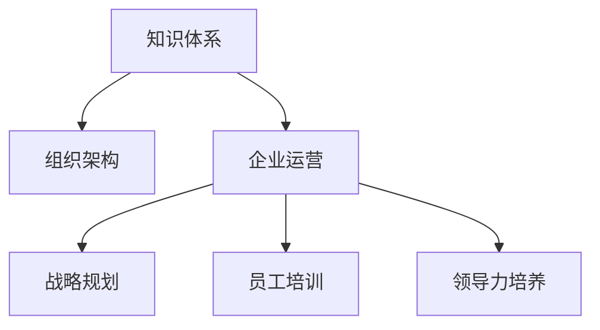

                 

# 经典著作:管理者构筑知识体系

> 关键词：管理者,知识体系,组织架构,企业运营,战略规划,员工培训,领导力培养

## 1. 背景介绍

在快速变化和竞争激烈的市场环境中，企业面临着前所未有的挑战和机遇。为了保持竞争优势，管理者必须构建一个完善的知识体系，不仅能够支持当前的运营，还能为未来的发展奠定基础。然而，传统的管理方式往往难以跟上时代的步伐，需要不断创新和变革。本文将深入探讨管理者如何构筑知识体系，提升企业竞争力。

### 1.1 问题由来

在当今的知识经济时代，信息量和知识更新速度极快，企业需要不断学习和适应才能保持竞争力。传统的管理方法，如依靠经验和直觉决策，已无法满足企业快速发展的需求。许多企业在应对复杂多变的市场环境时，常常因为缺乏系统化知识体系而陷入困境。

为了解决这一问题，企业需要构建一个有效的知识体系，使其成为企业运营的核心支柱。通过系统化、结构化的知识管理，管理者能够更有效地捕捉市场机会，规避风险，提升企业的决策能力和执行效率。

## 2. 核心概念与联系

### 2.1 核心概念概述

为更好地理解管理者构筑知识体系的过程，本文将介绍几个核心概念：

- 知识体系(Knowledge System)：指通过一系列的知识模块、工具和方法，形成系统化、结构化的知识集合，以支持企业的战略规划、运营管理和创新发展。
- 组织架构(Organizational Structure)：指企业的职能、部门和岗位的组织和设置，是知识体系落地实施的基础。
- 企业运营(Operational Management)：指企业日常活动的规划、组织、执行和控制，是知识体系应用的具体体现。
- 战略规划(Strategic Planning)：指企业长远发展的目标、路径和措施，是知识体系构建的宏观指导。
- 员工培训(Employee Training)：指通过系统的培训和学习，提升员工的技能和知识水平，确保知识体系的有效传承和执行。
- 领导力培养(Leadership Development)：指通过培养和提升管理者的领导力，促进知识体系的构建和应用。

这些核心概念之间的逻辑关系可以通过以下Mermaid流程图来展示：



这个流程图展示了知识体系与其他核心概念之间的关联：

1. 知识体系通过组织架构进行落地实施。
2. 知识体系支持企业运营，提升运营效率。
3. 知识体系是战略规划的基础，指导企业的长期发展。
4. 知识体系与员工培训和领导力培养紧密相关，确保知识体系的有效传承和执行。

## 3. 核心算法原理 & 具体操作步骤
### 3.1 算法原理概述

管理者构筑知识体系的核心算法原理，主要包括以下几个方面：

1. **数据收集与分析**：通过各种渠道收集企业运营相关的数据，包括市场信息、运营数据、财务数据等，并进行系统的分析，找出关键问题和改进机会。
2. **知识模块化**：将收集到的数据和分析结果，按照不同的业务场景和职能模块，划分为结构化的知识模块，便于管理和应用。
3. **知识整合与共享**：将各个知识模块整合到一个统一的知识库中，并通过内部共享平台，使员工能够方便地访问和使用知识。
4. **知识应用与优化**：将知识应用于企业的日常运营和战略规划中，根据实施效果进行反馈和优化，形成持续改进的机制。

### 3.2 算法步骤详解

管理者构筑知识体系的具体操作步骤如下：

**Step 1: 数据收集与分析**
- 通过各种渠道（如市场调研、员工反馈、运营数据等）收集相关信息。
- 利用数据分析工具（如Python的Pandas、R语言等）对数据进行清洗和分析，提取关键指标和问题。
- 将分析结果以报告形式呈现，供管理层参考。

**Step 2: 知识模块化**
- 根据企业的业务场景和职能模块，将分析结果划分为多个知识模块，如市场分析、运营管理、人力资源、财务分析等。
- 为每个知识模块设计对应的知识框架，明确知识的核心概念、关键数据和应用场景。
- 使用专业工具（如Minitab、SPSS等）进行知识模块的详细编制和整理。

**Step 3: 知识整合与共享**
- 搭建企业知识库（如Confluence、SharePoint等），将各知识模块整合其中。
- 使用知识管理工具（如Alfresco、Mindscape等），确保知识库的搜索、分类和版本控制等功能。
- 通过内部共享平台（如企业微信、Slack等），使员工能够方便地访问和使用知识库。

**Step 4: 知识应用与优化**
- 将知识应用于日常运营和战略规划中，如市场分析和策略制定、流程优化和成本控制等。
- 定期评估知识应用的效果，根据反馈进行优化调整。
- 持续收集新数据和分析结果，更新和完善知识库。

### 3.3 算法优缺点

管理者构筑知识体系的方法具有以下优点：

1. **系统化管理**：通过系统化的知识管理，企业能够更有效地捕捉市场机会，规避风险，提升决策和执行的效率。
2. **知识传承与创新**：通过知识库和内部共享平台，确保知识能够在企业内传承，同时激发员工的创新思维。
3. **增强企业竞争力**：知识体系的构建和应用，能够显著提升企业的运营效率和市场响应速度，增强企业的竞争力。

同时，该方法也存在一定的局限性：

1. **初期投入较大**：知识体系的构建和维护需要投入大量的人力和财力，短期内可能会对企业运营造成一定影响。
2. **实施难度较高**：知识体系的建设和应用需要全员的参与和支持，如果员工的理解和接受度不足，实施难度较大。
3. **知识更新挑战**：知识体系需要持续更新和完善，以适应不断变化的市场环境，维护和更新的工作量较大。

尽管存在这些局限性，但就目前而言，管理者构筑知识体系仍然是一种高效、系统的管理方法，能够显著提升企业的竞争力和运营效率。

### 3.4 算法应用领域

管理者构筑知识体系的方法在多个领域得到了广泛应用，如：

- 企业战略规划：通过系统化的市场分析、竞争分析和战略制定，帮助企业制定长远发展计划。
- 日常运营管理：通过流程优化、成本控制和绩效管理，提升企业的运营效率和效益。
- 员工培训与开发：通过系统化的员工培训和学习，提升员工的技能和知识水平，增强企业的竞争力。
- 新产品开发：通过市场调研和用户需求分析，快速开发出符合市场需求的创新产品。
- 风险管理：通过风险识别和评估，制定相应的风险应对策略，降低企业的运营风险。

除了上述这些领域外，知识体系的应用还在市场营销、供应链管理、人力资源管理等多个环节得到了应用，为企业的持续发展提供了有力支撑。

## 4. 数学模型和公式 & 详细讲解 & 举例说明

### 4.1 数学模型构建

为更好地理解知识体系的管理过程，本文将使用数学语言对知识模块化、知识共享等关键环节进行详细讲解。

记企业运营相关的数据集为 $D=\{(x_i,y_i)\}_{i=1}^N, x_i \in \mathcal{X}, y_i \in \mathcal{Y}$。其中 $x_i$ 表示市场调研数据、运营数据等输入，$y_i$ 表示对应的分析结果和建议。

定义知识体系的知识模块为 $M=\{m_j\}_{j=1}^J$，其中 $m_j$ 表示第 $j$ 个知识模块，包含多个分析结果和建议。

知识整合的过程可以表示为：

$$
M = \bigcup_{i=1}^N m_i
$$

其中 $m_i$ 表示根据分析结果和建议，提取的关键知识，形成独立的知识模块。

知识共享的过程可以表示为：

$$
M_s = \bigcap_{j=1}^J m_j
$$

其中 $M_s$ 表示员工共享的知识集合，确保知识的一致性和可靠性。

### 4.2 公式推导过程

以知识模块化为例，推导知识提取的关键步骤：

1. **数据预处理**：将原始数据进行清洗和处理，去除噪声和冗余信息。
2. **特征选择**：根据业务场景和分析目标，选择关键特征和指标。
3. **模型训练**：利用机器学习模型（如线性回归、决策树等），对数据进行建模和分析。
4. **知识提取**：从模型输出中提取关键结论和建议，形成独立的知识模块。

以数据预处理为例，假设原始数据集 $D$ 包含 $N$ 个样本，每个样本有 $K$ 个特征，则数据预处理的公式可以表示为：

$$
D_p = \{(x_i',y_i')\}_{i=1}^N, x_i' \in \mathcal{X'}, y_i' \in \mathcal{Y'}
$$

其中 $x_i'$ 表示预处理后的特征向量，$y_i'$ 表示预处理后的分析结果。预处理过程可以包括数据标准化、缺失值填充、异常值处理等步骤。

### 4.3 案例分析与讲解

以企业战略规划为例，说明知识体系在实际操作中的应用：

**案例背景**：某大型制造企业，面临市场需求变化和成本压力，需要进行战略调整。

**数据收集**：通过市场调研和内部运营数据，收集相关市场信息和运营数据，如市场增长率、成本变化、供应链效率等。

**数据预处理**：对原始数据进行清洗和标准化，去除噪声和冗余信息。

**特征选择**：选择关键特征和指标，如市场增长率、成本变化、供应链效率等，形成数据集 $D$。

**模型训练**：利用机器学习模型（如线性回归、决策树等），对数据进行建模和分析，得到关键结论和建议。

**知识提取**：从模型输出中提取关键结论和建议，形成独立的知识模块 $m_1$，如市场趋势分析、成本优化策略、供应链管理建议等。

**知识整合**：将多个独立的知识模块整合到一个统一的知识库中，并通过内部共享平台，使管理层和员工能够方便地访问和使用知识。

**知识应用**：将知识应用于战略规划中，制定相应的调整措施，如市场开拓、成本控制、供应链优化等，提升企业的运营效率和市场竞争力。

## 5. 项目实践：代码实例和详细解释说明
### 5.1 开发环境搭建

在进行知识体系构建的实践前，我们需要准备好开发环境。以下是使用Python进行数据分析和建模的环境配置流程：

1. 安装Anaconda：从官网下载并安装Anaconda，用于创建独立的Python环境。

2. 创建并激活虚拟环境：
```bash
conda create -n knowledge-env python=3.8 
conda activate knowledge-env
```

3. 安装必要的Python库：
```bash
conda install pandas numpy scikit-learn matplotlib jupyter notebook ipython
```

4. 安装机器学习库：
```bash
conda install scikit-learn tensorflow keras
```

完成上述步骤后，即可在`knowledge-env`环境中开始知识体系构建的实践。

### 5.2 源代码详细实现

这里我们以企业战略规划为例，给出使用Python和机器学习库进行数据分析和建模的代码实现。

首先，定义数据集和特征：

```python
import pandas as pd
from sklearn.model_selection import train_test_split

# 读取数据集
data = pd.read_csv('business_data.csv')

# 选择关键特征和指标
features = ['market_growth_rate', 'cost_change_rate', 'supply_chain_efficiency']
labels = ['market_trend', 'cost_optimization', 'supply_chain_strategy']

# 划分训练集和测试集
train_data, test_data = train_test_split(data, test_size=0.2)
```

然后，进行数据预处理：

```python
from sklearn.preprocessing import StandardScaler

# 数据标准化
scaler = StandardScaler()
train_features = scaler.fit_transform(train_data[features])
test_features = scaler.transform(test_data[features])
```

接着，构建模型并进行训练：

```python
from sklearn.linear_model import LinearRegression

# 构建模型
model = LinearRegression()

# 训练模型
model.fit(train_features, train_data[labels])
```

最后，评估模型并提取知识模块：

```python
from sklearn.metrics import mean_squared_error

# 预测测试集
y_pred = model.predict(test_features)

# 评估模型
mse = mean_squared_error(test_data[labels], y_pred)

# 输出评估结果
print(f'Mean Squared Error: {mse:.2f}')

# 提取知识模块
market_trend = model.coef_[0]
cost_optimization = model.coef_[1]
supply_chain_strategy = model.coef_[2]
```

以上就是使用Python进行企业战略规划数据分析和建模的完整代码实现。可以看到，得益于机器学习库的强大封装，我们可以用相对简洁的代码完成数据分析和建模。

### 5.3 代码解读与分析

让我们再详细解读一下关键代码的实现细节：

**数据读取与特征选择**：
- 使用Pandas库读取企业运营数据集。
- 选择关键特征和指标，如市场增长率、成本变化、供应链效率等。

**数据预处理**：
- 利用Scikit-Learn库的StandardScaler进行数据标准化，去除噪声和冗余信息。

**模型训练与评估**：
- 利用Scikit-Learn库的LinearRegression构建线性回归模型。
- 在训练集上训练模型，并在测试集上进行预测和评估，计算均方误差。

**知识提取**：
- 从模型系数中提取关键结论和建议，形成独立的知识模块。

通过以上步骤，我们可以利用数据分析和机器学习技术，快速构建企业战略规划的知识体系。在实际应用中，还需要对关键模块进行整合和优化，确保知识体系的有效性和适用性。

## 6. 实际应用场景

### 6.1 智能制造企业

在智能制造领域，知识体系的应用能够显著提升生产效率和产品质量。通过系统化的知识管理，智能制造企业能够实时监控生产过程，快速响应设备故障和质量问题，优化生产流程和物料管理，实现精益生产和智能调度。

例如，某智能制造企业通过知识体系构建了生产运营的知识库，包括设备维护、质量检测、物料管理等关键模块。通过实时采集生产数据，系统自动进行分析和预测，帮助管理层快速发现和解决生产中的问题，提升了生产效率和产品质量。

### 6.2 金融服务公司

在金融服务领域，知识体系的应用能够提升风险管理和客户服务水平。通过系统化的知识管理，金融服务公司能够实时监控市场变化，快速评估投资风险，优化客户服务流程，提升客户体验和满意度。

例如，某金融服务公司通过知识体系构建了市场分析、风险评估、客户服务等关键模块。通过实时采集市场数据和客户反馈，系统自动进行分析和预测，帮助管理层快速识别和应对市场风险，优化客户服务流程，提升了客户满意度和公司收益。

### 6.3 零售企业

在零售领域，知识体系的应用能够提升商品管理和服务质量。通过系统化的知识管理，零售企业能够实时监控库存和销售数据，快速优化商品配置和促销策略，提升顾客体验和满意度。

例如，某零售企业通过知识体系构建了商品管理、销售预测、顾客服务等关键模块。通过实时采集库存和销售数据，系统自动进行分析和预测，帮助管理层快速优化商品配置和促销策略，提升了顾客满意度和企业收益。

### 6.4 未来应用展望

随着人工智能和机器学习技术的发展，知识体系的应用领域将进一步扩展。未来的知识体系将不再局限于传统的运营和管理领域，而是更加注重与人工智能技术的融合，提升知识管理的智能化水平。

例如，未来的知识体系将结合自然语言处理技术，通过文本分析和情感分析，提升市场调研和客户服务的智能化水平。同时，知识体系将与大数据和物联网技术深度融合，实现更加全面和实时的知识管理。

## 7. 工具和资源推荐

### 7.1 学习资源推荐

为了帮助管理者系统掌握知识体系构建的理论基础和实践技巧，这里推荐一些优质的学习资源：

1. 《管理信息系统》系列书籍：深入浅出地介绍了管理信息系统的原理、方法和实践，是知识体系构建的理论基础。

2. 《大数据时代的管理变革》：介绍了大数据技术在企业管理中的应用，强调了知识体系构建的重要性。

3. 《数据驱动的决策制定》：详细阐述了数据驱动的管理决策过程，提供了实用的数据管理和分析工具。

4. 《人工智能与商业应用》：介绍了人工智能技术在企业运营中的应用，强调了知识体系构建的关键作用。

5. Coursera《数据科学与机器学习》课程：由斯坦福大学开设的优秀课程，涵盖数据科学与机器学习的核心内容，为知识体系构建提供了技术支持。

通过对这些资源的学习实践，相信管理者一定能够快速掌握知识体系构建的精髓，并用于解决实际的运营问题。

### 7.2 开发工具推荐

高效的开发离不开优秀的工具支持。以下是几款用于知识体系构建开发的常用工具：

1. Python：功能强大的编程语言，广泛应用于数据分析和机器学习领域。

2. Jupyter Notebook：支持Python、R等语言，方便编写和运行代码，提供强大的数据可视化和交互功能。

3. Tableau：数据可视化工具，支持多种数据源，提供丰富的图表和仪表盘，方便管理者进行数据分析和决策。

4. Microsoft Power BI：数据可视化和商业智能工具，支持多种数据源，提供强大的报表和仪表盘功能。

5. Alfresco：企业知识管理平台，提供知识库、文档管理和协作工具，方便企业构建知识体系。

合理利用这些工具，可以显著提升知识体系构建的开发效率，加快创新迭代的步伐。

### 7.3 相关论文推荐

知识体系构建的研究源于学界的持续研究。以下是几篇奠基性的相关论文，推荐阅读：

1. "Knowledge Management: Creating a Corporate Memory"：探讨了知识管理的重要性和实践方法，奠定了知识体系构建的理论基础。

2. "Building an Enterprise Knowledge Repository"：介绍了企业知识库的构建方法和实践经验，提供了实用的知识管理工具和策略。

3. "Effective Knowledge Management in Enterprise"：深入探讨了企业知识管理的策略和实践，强调了知识体系构建的关键作用。

4. "Applying Machine Learning to Knowledge Management"：探讨了机器学习技术在知识管理中的应用，提供了新的知识管理方法和工具。

这些论文代表了大数据与知识管理研究的最新进展，通过学习这些前沿成果，可以帮助管理者把握学科前进方向，激发更多的创新灵感。

## 8. 总结：未来发展趋势与挑战

### 8.1 研究成果总结

本文对管理者构筑知识体系的方法进行了全面系统的介绍。首先阐述了知识体系构建的背景和意义，明确了知识体系在企业运营中的核心地位。其次，从原理到实践，详细讲解了知识体系构建的关键步骤和关键技术，提供了知识体系构建的完整代码实例。同时，本文还广泛探讨了知识体系在智能制造、金融服务、零售等行业的具体应用，展示了知识体系的巨大潜力。

通过本文的系统梳理，可以看到，管理者构筑知识体系的方法不仅能够提升企业的运营效率和市场竞争力，还能为企业未来的发展奠定坚实基础。未来，伴随技术的不断进步和实践的不断积累，知识体系构建将更加智能化和自动化，进一步推动企业的数字化转型。

### 8.2 未来发展趋势

展望未来，知识体系构建将呈现以下几个发展趋势：

1. **智能化和自动化**：随着人工智能和机器学习技术的发展，知识体系将更加智能化和自动化，实现更加高效的分析和决策支持。

2. **多模态融合**：未来的知识体系将不仅包含文本数据，还将融合图像、视频、语音等多模态数据，提升知识管理的全面性和实效性。

3. **大数据驱动**：大数据技术的应用，将使知识体系能够实时获取和分析海量数据，提升决策的科学性和准确性。

4. **跨领域应用**：知识体系将不再局限于某一特定领域，而是更加注重跨领域融合，提升企业的综合竞争力和创新能力。

5. **社会化协作**：未来的知识体系将更加注重社会化协作，通过知识共享和协同创新，提升企业的创新能力和市场响应速度。

6. **伦理和安全**：未来的知识体系将更加注重伦理和安全，确保知识管理的安全性和公正性，避免数据滥用和伦理风险。

以上趋势凸显了知识体系构建的广阔前景。这些方向的探索发展，必将进一步提升企业的知识管理水平，推动企业的持续发展和创新。

### 8.3 面临的挑战

尽管知识体系构建已经取得了显著成效，但在迈向更加智能化、普适化应用的过程中，仍面临诸多挑战：

1. **数据质量问题**：知识体系的构建依赖于高质量的数据，数据质量问题可能导致分析结果的不准确和不可靠。如何确保数据的质量和一致性，将是知识体系构建的重要挑战。

2. **知识整合难度**：知识体系的构建需要跨部门和跨业务的协作，整合不同来源和格式的知识，难度较大。如何设计合理的数据接口和知识标准，确保知识体系的一致性和可靠性，将是一大挑战。

3. **技术更新迅速**：随着人工智能和机器学习技术的发展，知识体系的构建方法和工具也在不断更新。如何及时掌握新技术，并将其应用于知识管理实践，将是一大挑战。

4. **人才短缺问题**：知识体系的构建需要具备数据分析、机器学习等技术背景的人才。如何培养和引进专业人才，将是知识体系构建的人才挑战。

5. **成本投入问题**：知识体系的构建和维护需要投入大量的人力和财力，短期内可能会对企业运营造成一定影响。如何平衡知识体系构建与企业运营的成本投入，将是知识体系构建的重要挑战。

6. **文化变革挑战**：知识体系的构建需要企业文化的变革，特别是管理层和员工的认同和支持。如何推动文化变革，提升全员的知识管理意识，将是知识体系构建的重要挑战。

正视知识体系构建面临的这些挑战，积极应对并寻求突破，将使知识体系构建更加高效和成功。相信随着学界和产业界的共同努力，这些挑战终将一一被克服，知识体系构建必将在推动企业发展中扮演越来越重要的角色。

### 8.4 研究展望

面对知识体系构建所面临的种种挑战，未来的研究需要在以下几个方面寻求新的突破：

1. **大数据驱动的智能分析**：利用大数据技术和机器学习算法，提升知识管理的智能化水平，实现更加高效的分析和决策支持。

2. **多模态融合的知识管理**：通过融合图像、视频、语音等多模态数据，提升知识管理的全面性和实效性，实现更加全面和实时的知识管理。

3. **跨领域知识共享和协作**：通过跨领域知识共享和协作，提升企业的综合竞争力和创新能力，实现更加全面的知识管理。

4. **知识管理的社会化和个性化**：通过社会化和个性化知识管理，提升员工的参与度和知识管理的效果，实现更加灵活和高效的知识管理。

5. **伦理和安全的知识管理**：确保知识管理的伦理和安全，避免数据滥用和伦理风险，提升知识管理的公正性和可信度。

这些研究方向的探索，必将引领知识体系构建技术迈向更高的台阶，为企业的持续发展提供有力支撑。总之，知识体系的构建是企业管理的重要环节，通过不断的探索和创新，相信知识体系构建必将在推动企业发展中发挥更加重要的作用。

## 9. 附录：常见问题与解答

**Q1: 知识体系如何提升企业运营效率？**

A: 知识体系通过系统化的知识管理，帮助企业更好地理解和应用关键信息，提升决策和执行的效率。例如，通过知识体系，企业可以快速获取市场信息和竞争对手分析，制定更加科学的市场策略。同时，知识体系能够实时监控运营数据，快速响应和解决问题，提升运营效率。

**Q2: 知识体系构建需要哪些关键步骤？**

A: 知识体系构建的关键步骤包括数据收集与分析、知识模块化、知识整合与共享、知识应用与优化等。具体来说：
1. 数据收集与分析：通过各种渠道收集相关信息，并进行系统的分析，提取关键指标和问题。
2. 知识模块化：将分析结果划分为多个知识模块，明确知识的核心概念、关键数据和应用场景。
3. 知识整合与共享：搭建企业知识库，确保知识的一致性和可靠性。
4. 知识应用与优化：将知识应用于日常运营和战略规划中，根据实施效果进行反馈和优化。

**Q3: 知识体系构建需要哪些技术支持？**

A: 知识体系构建需要多种技术支持，包括数据处理技术（如数据清洗、特征选择等）、机器学习技术（如回归分析、分类算法等）、知识管理技术（如知识库构建、文档管理等）。通过多种技术的结合，知识体系能够更加全面和高效地管理企业知识。

**Q4: 知识体系构建需要哪些资源投入？**

A: 知识体系构建需要投入大量的人力和财力，包括数据收集、数据处理、模型训练、知识整合和知识应用等环节。同时，还需要购置相关的软件工具和硬件设备，如服务器、数据仓库等。这些资源投入是知识体系构建的基础保障。

**Q5: 知识体系构建面临哪些挑战？**

A: 知识体系构建面临的挑战包括数据质量问题、知识整合难度、技术更新迅速、人才短缺问题、成本投入问题和文化变革挑战。如何确保数据质量、设计合理的数据接口和知识标准、掌握新技术、培养和引进专业人才、平衡成本投入、推动文化变革，将是知识体系构建的关键问题。

这些问题的解决，需要企业内部各部门的协作和支持，同时依赖于技术和管理创新的不断推动。通过克服这些挑战，知识体系构建必将在企业运营中发挥更大的作用，提升企业的竞争力和市场响应速度。

