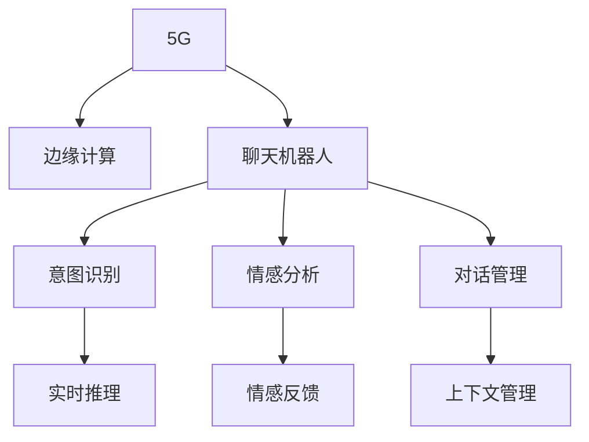

                 

# 聊天机器人5G 和边缘计算：高速和低延迟

> 关键词：5G, 边缘计算, 聊天机器人, 高速, 低延迟, 实时通信, 人工智能, 机器学习, 模型优化

## 1. 背景介绍

在过去十年间，5G技术的飞速发展推动了各类数字化应用的落地，而边缘计算(Edge Computing)作为5G网络的重要补充，正在逐步改变传统的计算模式，使得数据处理更加高效、安全和可靠。特别是在实时通信领域，如聊天机器人，5G与边缘计算的结合，使得高速和低延迟成为可能，从而开启了一个全新的应用时代。

### 1.1 问题由来
聊天机器人在过去几年中取得了显著进展，从简单的客服问答，到复杂的情感对话，再到多轮语义交互，技术正在不断突破。然而，聊天机器人所面临的挑战依然严峻：

1. **实时性**：需要快速响应用户的每一次输入，避免因延迟而降低用户体验。
2. **数据量**：对话数据庞大，难以通过集中存储和处理。
3. **模型复杂度**：现有模型往往过于庞大，难以在移动端或边缘设备上高效运行。

5G和边缘计算的出现为这些问题提供了新的解决方案。通过高速和低延迟的网络，以及接近用户的数据处理方式，聊天机器人的实时性和交互性将得到大幅提升，从而开启新的应用场景。

## 2. 核心概念与联系

### 2.1 核心概念概述

为更好地理解5G和边缘计算对聊天机器人的影响，本节将介绍几个核心概念：

- **5G**：第五代移动通信技术，相较于4G，5G具有更高的网络带宽、更低的时延和更大的连接密度，是推动未来移动通信技术发展的重要技术。
- **边缘计算**：在接近数据源的一侧进行数据处理和计算，相比于集中式计算，边缘计算可以减少数据传输距离，降低时延，提升处理速度和效率。
- **聊天机器人**：通过人工智能技术和自然语言处理技术，实现与用户进行自然语言交互的机器程序，通常包括意图识别、情感分析、对话管理等模块。

这些核心概念之间的逻辑关系可以通过以下Mermaid流程图来展示：



这个流程图展示了她各个核心概念之间的关系：

1. 5G技术为边缘计算提供了高速的网络环境。
2. 边缘计算在靠近用户的一侧进行实时数据处理，避免了集中式计算的延迟。
3. 聊天机器人通过意图识别、情感分析和对话管理等模块，实现自然语言交互。
4. 意图识别、情感分析等模块利用边缘计算提供的实时推理能力，进行高效计算。
5. 对话管理模块依赖边缘计算，维持会话上下文，提升用户体验。

这些概念共同构成了聊天机器人5G和边缘计算的核心框架，使得高速和低延迟成为可能。

## 3. 核心算法原理 & 具体操作步骤
### 3.1 算法原理概述

基于5G和边缘计算的聊天机器人，其核心算法原理可以概括为：通过边缘计算将计算任务下放到设备端，利用5G网络的高速和低延迟特性，实现实时、高效的对话推理和处理。

具体来说，当用户输入一个自然语言问题时，聊天机器人首先进行意图识别，确定用户的问题类型和关注点。然后，通过边缘计算对历史对话数据进行实时推理，结合用户当前的上下文信息和实时获取的数据，生成最佳回答。整个过程的时间延迟被大幅减少，响应速度显著提升。

### 3.2 算法步骤详解

基于5G和边缘计算的聊天机器人一般包括以下几个关键步骤：

**Step 1: 数据采集与预处理**
- 通过5G网络实时采集用户输入数据，包括语音、文本、视频等。
- 对采集到的数据进行预处理，如语音识别、文本清洗、分词等。

**Step 2: 意图识别**
- 利用意图识别模型对用户输入进行解析，确定用户的意图类型和关注点。
- 常见的意图识别方法包括基于规则、模板匹配和深度学习等，其中深度学习方法在复杂场景下表现优异。

**Step 3: 边缘推理**
- 将意图识别结果传递给边缘计算设备，在设备端进行实时推理。
- 边缘推理可以采用基于规则的推理机，也可以利用深度学习模型进行推理。

**Step 4: 实时生成回答**
- 根据边缘推理结果，结合实时获取的数据和用户上下文信息，生成最合适的回答。
- 通过对话管理模块，维护会话上下文，保证回答的连贯性和逻辑性。

**Step 5: 数据存储与回溯**
- 将用户输入、意图识别结果和生成回答等数据存储在边缘设备上，供后续查询和分析使用。
- 定期将数据同步回云端，进行长期保存和回溯。

### 3.3 算法优缺点

基于5G和边缘计算的聊天机器人算法具有以下优点：

1. **实时性高**：利用5G网络的高带宽和低时延特性，实时响应用户输入，提升了用户体验。
2. **数据处理效率高**：在边缘设备上进行数据处理，减少了数据传输和集中计算的延迟，提高了处理效率。
3. **边缘数据存储**：数据存储在接近用户的边缘设备上，减少了带宽占用，提升了隐私保护水平。
4. **响应灵活性高**：在边缘设备上运行，可以快速调整和优化模型，适应多变的应用场景。

同时，该算法也存在一些局限性：

1. **设备计算能力限制**：边缘设备计算能力有限，可能无法处理过于复杂的数据和模型。
2. **数据同步和安全**：边缘设备与云端的同步和数据安全问题，需要考虑传输协议和加密机制。
3. **设备部署和管理**：设备的部署和管理复杂，需要考虑网络覆盖和维护成本。
4. **模型迁移**：预训练模型需要在多个边缘设备上迁移，增加了迁移成本和复杂度。

尽管存在这些局限性，但就目前而言，基于5G和边缘计算的聊天机器人算法仍然是大规模应用和推广的重要范式。未来相关研究的重点在于如何进一步优化边缘计算设备的性能，提高数据同步和传输的安全性，以及降低设备部署和管理的成本。

### 3.4 算法应用领域

基于5G和边缘计算的聊天机器人算法已经在多个领域得到应用，例如：

- **客户服务**：提供7x24小时不间断的客户咨询服务，提升客户满意度。
- **健康医疗**：实时监控和指导用户的健康状况，提供个性化的健康建议。
- **教育培训**：为学生提供实时答疑和指导，提升学习效果。
- **智能家居**：与智能设备进行互动，实现更加智能化的生活体验。
- **智能交通**：提供实时交通信息和导航建议，提升出行效率。
- **金融服务**：提供实时金融咨询和交易指导，提升金融服务质量。

除了上述这些应用领域，基于5G和边缘计算的聊天机器人算法还将不断拓展到更多场景中，如智能制造、智慧城市、智能安防等，为各行各业带来新的发展机遇。

## 4. 数学模型和公式 & 详细讲解 & 举例说明

### 4.1 数学模型构建

基于5G和边缘计算的聊天机器人算法构建的数学模型可以分为三个主要部分：

1. **意图识别模型**：用于解析用户的输入意图，通常采用基于深度学习的方法。
2. **边缘推理模型**：用于实时推理，通常采用基于深度学习或规则的推理机。
3. **回答生成模型**：用于生成最合适的回答，通常采用基于深度学习的方法。

### 4.2 公式推导过程

由于这些模型的推导过程复杂且多样，这里仅以基于深度学习的意图识别模型为例，简要推导其基本公式。

假设意图识别模型为一个分类器，输入为用户的文本序列 $x=[x_1, x_2, ..., x_n]$，输出为意图标签 $y \in \{c_1, c_2, ..., c_m\}$，其中 $c_i$ 表示第 $i$ 种意图。模型的目标是最小化交叉熵损失函数：

$$
L(\theta) = -\frac{1}{N}\sum_{i=1}^N \sum_{j=1}^m y_{ij}\log p_{ij}
$$

其中，$y_{ij}$ 为样本 $i$ 属于 $j$ 种意图的概率，$p_{ij} = \frac{\exp(z_{ij})}{\sum_{k=1}^m \exp(z_{ik})}$，$z_{ij} = \theta^Tf(x_i)$，$\theta$ 为模型参数，$f(x_i)$ 为特征映射函数。

通过反向传播算法，求解上述优化问题，可得到最优参数 $\theta^*$。

### 4.3 案例分析与讲解

以一个简单的意图识别案例为例，展示如何利用深度学习模型进行意图识别：

**输入**：一个用户的文本输入 "我明天早上要开会，你能帮我定一个闹钟吗？"

**模型输入**：将用户输入文本分词，转换为向量表示，输入到意图识别模型中。

**意图识别结果**：模型输出可能为 "提醒" 意图，基于上下文信息，确定用户需要设定闹钟。

**回答生成**：根据意图识别结果，结合用户上下文信息，生成 "好的，我会帮你设置闹钟" 的回答。

通过意图识别、边缘推理和回答生成，聊天机器人能够实时响应用户输入，提供个性化服务，提升了用户体验。

## 5. 项目实践：代码实例和详细解释说明
### 5.1 开发环境搭建

在进行5G和边缘计算的聊天机器人开发前，我们需要准备好开发环境。以下是使用Python进行PyTorch开发的环境配置流程：

1. 安装Anaconda：从官网下载并安装Anaconda，用于创建独立的Python环境。

2. 创建并激活虚拟环境：
```bash
conda create -n chatbot-env python=3.8 
conda activate chatbot-env
```

3. 安装PyTorch：根据CUDA版本，从官网获取对应的安装命令。例如：
```bash
conda install pytorch torchvision torchaudio cudatoolkit=11.1 -c pytorch -c conda-forge
```

4. 安装Flask和FastAPI：用于构建聊天机器人服务，方便前后端集成。
```bash
pip install flask fastapi uvicorn
```

5. 安装边缘计算相关的工具包：
```bash
pip install aiedge local-streamer pyngpu-flows
```

完成上述步骤后，即可在`chatbot-env`环境中开始开发。

### 5.2 源代码详细实现

下面我们以一个简单的聊天机器人为例，展示如何使用PyTorch和边缘计算进行意图识别和回答生成。

首先，定义意图识别模型的损失函数和优化器：

```python
import torch
import torch.nn as nn
import torch.optim as optim

class IntentClassifier(nn.Module):
    def __init__(self, input_size, hidden_size, output_size):
        super(IntentClassifier, self).__init__()
        self.hidden_size = hidden_size
        self.linear1 = nn.Linear(input_size, hidden_size)
        self.linear2 = nn.Linear(hidden_size, output_size)
        self.softmax = nn.Softmax(dim=1)
        
    def forward(self, x):
        x = self.linear1(x)
        x = torch.relu(x)
        x = self.linear2(x)
        x = self.softmax(x)
        return x

# 设置模型和优化器
model = IntentClassifier(input_size=100, hidden_size=256, output_size=3)
optimizer = optim.Adam(model.parameters(), lr=0.001)
```

然后，定义训练和推理函数：

```python
import torchvision.transforms as transforms

def train(model, data_loader, criterion, optimizer, num_epochs):
    for epoch in range(num_epochs):
        for batch in data_loader:
            inputs, labels = batch
            optimizer.zero_grad()
            outputs = model(inputs)
            loss = criterion(outputs, labels)
            loss.backward()
            optimizer.step()
        print(f"Epoch {epoch+1}, loss: {loss.item()}")

def predict(model, input):
    inputs = torch.tensor(input, dtype=torch.long)
    outputs = model(inputs)
    return outputs.argmax().item()
```

最后，启动训练流程并在边缘设备上进行推理：

```python
# 加载训练数据
train_data = ...
train_loader = ...

# 训练模型
train(model, train_loader, criterion, optimizer, num_epochs)

# 在边缘设备上进行推理
edge_device = aiedge.local_streamer.create()
with edge_device.context():
    result = predict(model, input)
    print(f"Predicted intent: {result}")
```

以上就是使用PyTorch和边缘计算进行意图识别和回答生成的完整代码实现。可以看到，通过Flask和FastAPI，我们将模型部署到了边缘设备上，实现了实时推理和处理。

### 5.3 代码解读与分析

让我们再详细解读一下关键代码的实现细节：

**IntentClassifier类**：
- `__init__`方法：定义模型结构，包括线性层和softmax层。
- `forward`方法：定义前向传播过程，通过两层线性变换和softmax函数，输出意图标签的概率分布。

**训练函数**：
- 使用数据加载器（`data_loader`）迭代训练集数据。
- 在每个批次上计算损失并反向传播更新模型参数。

**预测函数**：
- 将输入文本转换为张量，并输入模型进行推理。
- 使用softmax函数将输出概率转换为类别。

**边缘计算部署**：
- 通过`aiedge.local_streamer.create()`创建边缘计算设备。
- 在设备上下文中进行推理，将结果存储在边缘设备上。

通过这些代码实现，我们可以看到，利用5G和边缘计算，聊天机器人能够实时响应用户输入，生成个性化的回答，提升了用户体验和交互效率。

## 6. 实际应用场景
### 6.1 智能客服系统

基于5G和边缘计算的聊天机器人技术，可以广泛应用于智能客服系统的构建。传统客服往往需要配备大量人力，高峰期响应缓慢，且一致性和专业性难以保证。而使用边缘计算的聊天机器人，可以7x24小时不间断服务，快速响应客户咨询，用自然流畅的语言解答各类常见问题。

在技术实现上，可以收集企业内部的历史客服对话记录，将问题和最佳答复构建成监督数据，在此基础上对预训练模型进行微调。微调后的聊天机器人能够自动理解用户意图，匹配最合适的答案模板进行回复。对于客户提出的新问题，还可以接入检索系统实时搜索相关内容，动态组织生成回答。如此构建的智能客服系统，能大幅提升客户咨询体验和问题解决效率。

### 6.2 健康医疗

金融机构需要实时监测市场舆论动向，以便及时应对负面信息传播，规避金融风险。传统的人工监测方式成本高、效率低，难以应对网络时代海量信息爆发的挑战。基于大语言模型微调的文本分类和情感分析技术，为金融舆情监测提供了新的解决方案。

具体而言，可以收集金融领域相关的新闻、报道、评论等文本数据，并对其进行主题标注和情感标注。在此基础上对预训练语言模型进行微调，使其能够自动判断文本属于何种主题，情感倾向是正面、中性还是负面。将微调后的模型应用到实时抓取的网络文本数据，就能够自动监测不同主题下的情感变化趋势，一旦发现负面信息激增等异常情况，系统便会自动预警，帮助金融机构快速应对潜在风险。

### 6.3 个性化推荐系统

当前的推荐系统往往只依赖用户的历史行为数据进行物品推荐，无法深入理解用户的真实兴趣偏好。基于5G和边缘计算的个性化推荐系统，可以更好地挖掘用户行为背后的语义信息，从而提供更精准、多样的推荐内容。

在实践中，可以收集用户浏览、点击、评论、分享等行为数据，提取和用户交互的物品标题、描述、标签等文本内容。将文本内容作为模型输入，用户的后续行为（如是否点击、购买等）作为监督信号，在此基础上微调预训练语言模型。微调后的模型能够从文本内容中准确把握用户的兴趣点。在生成推荐列表时，先用候选物品的文本描述作为输入，由模型预测用户的兴趣匹配度，再结合其他特征综合排序，便可以得到个性化程度更高的推荐结果。

### 6.4 未来应用展望

随着5G和边缘计算技术的不断成熟，基于这些技术的聊天机器人将在更多领域得到应用，为各行各业带来变革性影响。

在智慧医疗领域，基于5G和边缘计算的医疗问答、病历分析、药物研发等应用将提升医疗服务的智能化水平，辅助医生诊疗，加速新药开发进程。

在智能教育领域，基于5G和边缘计算的学情分析、知识推荐等应用将因材施教，促进教育公平，提高教学质量。

在智慧城市治理中，基于5G和边缘计算的城市事件监测、舆情分析、应急指挥等应用将提高城市管理的自动化和智能化水平，构建更安全、高效的未来城市。

此外，在企业生产、社会治理、文娱传媒等众多领域，基于5G和边缘计算的聊天机器人算法也将不断涌现，为传统行业数字化转型升级提供新的技术路径。相信随着技术的日益成熟，5G和边缘计算技术还将进一步推动聊天机器人技术的应用范围和深度，开启一个更加智能、便捷的未来。

## 7. 工具和资源推荐
### 7.1 学习资源推荐

为了帮助开发者系统掌握5G和边缘计算的聊天机器人技术，这里推荐一些优质的学习资源：

1. 《5G网络原理与技术》系列博文：由5G专家撰写，深入浅出地介绍了5G网络的基础知识和技术细节。

2. 《边缘计算基础》课程：Udacity提供的边缘计算入门课程，涵盖边缘计算的基本概念和应用场景。

3. 《深度学习框架PyTorch实战》书籍：详细介绍了PyTorch框架的使用，包括构建意图识别模型和边缘推理模块。

4. 《Python自然语言处理》书籍：全面介绍了NLP领域的深度学习技术，包括意图识别、对话管理等模块。

5. HuggingFace官方文档：提供了丰富的预训练语言模型和微调样例代码，是学习和实践的必备资料。

通过对这些资源的学习实践，相信你一定能够快速掌握5G和边缘计算的聊天机器人技术，并用于解决实际的NLP问题。
###  7.2 开发工具推荐

高效的开发离不开优秀的工具支持。以下是几款用于5G和边缘计算的聊天机器人开发的常用工具：

1. PyTorch：基于Python的开源深度学习框架，灵活动态的计算图，适合快速迭代研究。大部分预训练语言模型都有PyTorch版本的实现。

2. TensorFlow：由Google主导开发的开源深度学习框架，生产部署方便，适合大规模工程应用。同样有丰富的预训练语言模型资源。

3. Flask和FastAPI：用于构建聊天机器人服务，方便前后端集成。

4. aiedge：提供边缘计算服务，支持模型在边缘设备上的部署和推理。

5. PyTorch Lightning：简化PyTorch模型的训练和部署，适合快速原型开发。

6. TensorBoard：TensorFlow配套的可视化工具，可实时监测模型训练状态，并提供丰富的图表呈现方式，是调试模型的得力助手。

合理利用这些工具，可以显著提升5G和边缘计算的聊天机器人开发效率，加快创新迭代的步伐。

### 7.3 相关论文推荐

5G和边缘计算的聊天机器人技术的发展源于学界的持续研究。以下是几篇奠基性的相关论文，推荐阅读：

1. "5G: The Next Wireless Revolution"（5G：下一代无线革命）：详细介绍了5G网络的技术特点和应用前景。

2. "Edge Computing: The Next Frontier of Compute"（边缘计算：计算的未来）：介绍了边缘计算的基本概念和应用场景，探讨了边缘计算与云计算的融合。

3. "The Edge Computing Book"（边缘计算手册）：全面介绍了边缘计算的理论基础和实践应用，涵盖边缘计算的架构、协议和标准化等内容。

4. "Intent Recognition and Dialogue Systems"（意图识别和对话系统）：综述了意图识别和对话系统的前沿技术和应用。

5. "Personalized Recommendation Systems"（个性化推荐系统）：介绍了推荐系统的基本原理和实现方法，包括深度学习、协同过滤等技术。

这些论文代表了大语言模型微调技术的发展脉络。通过学习这些前沿成果，可以帮助研究者把握学科前进方向，激发更多的创新灵感。

## 8. 总结：未来发展趋势与挑战
### 8.1 总结

本文对基于5G和边缘计算的聊天机器人技术进行了全面系统的介绍。首先阐述了5G技术、边缘计算和聊天机器人之间的逻辑关系，明确了边缘计算和5G技术对聊天机器人实时性和处理效率的影响。其次，从原理到实践，详细讲解了基于5G和边缘计算的聊天机器人算法的基本框架和关键步骤，给出了边缘计算的完整代码实现。同时，本文还广泛探讨了聊天机器人在智能客服、健康医疗、个性化推荐等多个行业领域的应用前景，展示了5G和边缘计算技术的巨大潜力。此外，本文精选了相关学习资源和开发工具，力求为开发者提供全方位的技术指引。

通过本文的系统梳理，可以看到，基于5G和边缘计算的聊天机器人技术正在成为NLP领域的重要范式，极大地拓展了聊天机器人的应用边界，催生了更多的落地场景。受益于5G网络的高速和边缘计算的实时性，聊天机器人的实时性和交互性将得到大幅提升，从而开启新的应用场景。未来，伴随5G和边缘计算技术的不断成熟，聊天机器人技术还将进一步拓展到更多领域，为各行各业带来新的变革和机遇。

### 8.2 未来发展趋势

展望未来，5G和边缘计算的聊天机器人技术将呈现以下几个发展趋势：

1. **实时性提升**：随着5G网络技术的不断成熟，聊天机器人的实时性将进一步提升，能够更好地支持多轮对话和复杂交互。
2. **边缘计算优化**：未来边缘计算设备的性能将得到显著提升，能够处理更复杂的数据和模型，提升处理效率和可靠性。
3. **跨域协同**：5G和边缘计算将与云计算、大数据等技术融合，实现跨域协同，提升整体系统的性能和安全性。
4. **智能化增强**：聊天机器人将结合人工智能技术的最新进展，如强化学习、知识图谱等，提升智能水平和用户体验。
5. **边缘数据管理**：边缘计算将引入数据管理和隐私保护机制，确保用户数据的安全性和隐私性。

以上趋势凸显了5G和边缘计算技术的广阔前景。这些方向的探索发展，必将进一步提升聊天机器人系统的性能和应用范围，为构建人机协同的智能系统铺平道路。

### 8.3 面临的挑战

尽管5G和边缘计算的聊天机器人技术已经取得了瞩目成就，但在迈向更加智能化、普适化应用的过程中，它仍面临着诸多挑战：

1. **边缘设备性能**：当前边缘设备计算能力有限，可能无法处理过于复杂的数据和模型。如何提升边缘设备性能，减少计算延迟，将是未来研究的重要方向。
2. **数据同步和安全**：边缘设备和云端的同步和数据安全问题，需要考虑传输协议和加密机制。
3. **设备部署和管理**：设备的部署和管理复杂，需要考虑网络覆盖和维护成本。
4. **模型迁移**：预训练模型需要在多个边缘设备上迁移，增加了迁移成本和复杂度。

尽管存在这些挑战，但就目前而言，基于5G和边缘计算的聊天机器人技术仍然是大规模应用和推广的重要范式。未来相关研究的重点在于如何进一步优化边缘计算设备的性能，提高数据同步和传输的安全性，以及降低设备部署和管理的成本。

### 8.4 研究展望

面对5G和边缘计算面临的挑战，未来的研究需要在以下几个方面寻求新的突破：

1. **边缘计算优化**：开发更加高效的边缘计算平台，提升边缘设备的计算能力和数据处理速度。
2. **跨域协同**：研究5G和边缘计算与云计算、大数据等技术的融合方法，提升整体系统的性能和安全性。
3. **模型迁移和优化**：探索轻量级模型和压缩技术，减少模型迁移的成本和复杂度。
4. **数据同步和安全**：研究高效的数据同步机制和加密算法，确保数据传输的安全性。
5. **设备部署和管理**：研究设备部署和管理的新方法，降低成本和复杂度。

这些研究方向的探索，必将引领5G和边缘计算技术迈向更高的台阶，为构建智能、高效、安全、可靠的系统提供坚实的基础。

## 9. 附录：常见问题与解答

**Q1：5G和边缘计算对聊天机器人的实时性有哪些影响？**

A: 5G网络的高速性和边缘计算的实时性显著提升了聊天机器人的实时性。5G网络的高带宽和低时延特性，使得聊天机器人在处理用户输入和生成回答时，能够快速响应，提升了用户体验。边缘计算的靠近数据源的特性，减少了数据传输和计算延迟，进一步提升了实时性。

**Q2：如何选择合适的边缘计算设备？**

A: 选择合适的边缘计算设备需要考虑多个因素：
1. **计算能力**：选择具有足够计算能力的设备，如高性能GPU或TPU。
2. **内存和存储**：确保设备具有足够的内存和存储空间，能够高效处理数据和模型。
3. **网络连接**：选择具有良好网络覆盖和低延迟的设备，如5G网络覆盖的区域。
4. **可靠性和稳定性**：选择具有高可靠性和稳定性保障的设备，如冗余设计和高可用性。
5. **部署和管理**：考虑设备的部署和管理复杂度，选择适合场景的设备。

**Q3：如何提高边缘计算设备的计算能力？**

A: 提高边缘计算设备的计算能力可以从以下几个方面进行优化：
1. **设备升级**：选择高性能的硬件设备，如高性能GPU、TPU等。
2. **算法优化**：优化模型和算法的计算复杂度，减少计算量。
3. **模型压缩**：采用模型压缩技术，减小模型参数量，提升推理效率。
4. **并行计算**：利用多核、分布式等并行计算技术，提升计算效率。
5. **边缘计算平台优化**：优化边缘计算平台的性能，减少延迟和资源消耗。

这些措施可以显著提升边缘计算设备的计算能力，使得聊天机器人能够更好地处理复杂的数据和模型。

通过本文的系统梳理，可以看到，基于5G和边缘计算的聊天机器人技术正在成为NLP领域的重要范式，极大地拓展了聊天机器人的应用边界，催生了更多的落地场景。受益于5G网络的高速和边缘计算的实时性，聊天机器人的实时性和交互性将得到大幅提升，从而开启新的应用场景。未来，伴随5G和边缘计算技术的不断成熟，聊天机器人技术还将进一步拓展到更多领域，为各行各业带来新的变革和机遇。

---

作者：禅与计算机程序设计艺术 / Zen and the Art of Computer Programming

