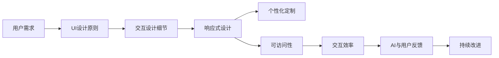

                 

# 聊天机器人界面设计：用户体验优化

> 关键词：用户界面(UI)设计, 聊天机器人, 用户体验(UX), 交互设计, 响应式设计, 个性化定制, 可访问性, 人工智能(AI)

## 1. 背景介绍

### 1.1 问题由来

随着人工智能(AI)技术的迅猛发展，聊天机器人已经在各行各业得到了广泛的应用。从客户服务、医疗咨询到智能助手、教育培训，几乎无所不包。然而，尽管机器人的技术性能已经取得了长足的进步，但在用户体验(UX)方面却仍存在诸多不足之处。

聊天机器人是用户与AI交互的主要界面，其设计的好坏直接关系到用户能否顺畅、愉快地使用服务。一份数据显示，超过50%的用户在初次使用聊天机器人后，由于体验不佳而直接卸载或停止使用。由此可见，聊天机器人的界面设计不仅影响着用户的满意度，也直接决定了其市场竞争力和生命力。

因此，优化聊天机器人的界面设计，提升用户体验，成为亟待解决的问题。本文将从核心概念与联系、核心算法原理与操作步骤、数学模型与公式、项目实践、应用场景、工具与资源、未来发展趋势与挑战等方面，对聊天机器人界面设计的用户体验优化进行深入探讨。

### 1.2 问题核心关键点

为确保优化工作能够切实提升用户体验，本文将从以下几个关键点着手：

- **UI设计原则**：根据心理学和认知科学原理，制定符合用户直觉和习惯的界面设计规范。
- **交互设计细节**：注重用户操作流程的简洁、直观，减少误操作和不必要的复杂步骤。
- **响应式设计**：考虑不同设备尺寸和性能，提供一致且流畅的用户体验。
- **个性化定制**：根据用户的历史行为和偏好，提供个性化的界面风格和交互方式。
- **可访问性**：确保界面对残障用户友好，支持多种辅助技术。
- **交互效率**：优化交互流程，缩短用户等待时间，提升服务响应速度。
- **AI与用户反馈**：结合用户反馈，持续改进和优化界面设计。

## 2. 核心概念与联系

### 2.1 核心概念概述

在探讨聊天机器人界面设计时，以下几个核心概念至关重要：

- **用户界面(UI)设计**：通过合理的布局、色彩、字体、动画等元素，提升用户的视觉感受和操作体验。
- **用户体验(UX)设计**：综合考虑用户心理、行为、环境等各方面因素，设计出符合用户需求和情感的界面。
- **交互设计(Interaction Design)**：注重用户操作与系统的反馈机制，设计出符合用户直觉的交互方式。
- **响应式设计(Responsive Design)**：针对不同设备尺寸和性能，提供一致的用户体验。
- **个性化定制(Personalization)**：根据用户的历史行为和偏好，定制个性化的界面风格和交互方式。
- **可访问性(Accessibility)**：确保界面对残障用户友好，支持多种辅助技术。

这些概念共同构成聊天机器人界面设计的基础，需要从用户需求出发，综合运用心理学、认知科学、人机交互等学科知识，实现良好的用户体验。

### 2.2 核心概念原理和架构的 Mermaid 流程图



该流程图展示了从用户需求到界面设计、交互设计、响应式设计、个性化定制、可访问性、交互效率、AI与用户反馈等关键环节，以及它们之间的相互关系。通过这一系列设计原则和步骤，可以构建出既符合用户需求，又具有良好用户体验的聊天机器人界面。

## 3. 核心算法原理 & 具体操作步骤

### 3.1 算法原理概述

聊天机器人界面设计涉及多个领域，包括心理学、认知科学、人机交互等。其核心算法原理主要包括以下几个方面：

- **用户行为分析**：通过分析用户历史操作数据，识别用户的行为模式和偏好。
- **界面元素优化**：根据用户心理模型和认知科学原理，优化界面元素（如按钮、输入框、标签等）的位置和大小，提升用户操作的直观性和效率。
- **情感计算**：结合心理学和情绪理论，通过分析用户的情感变化，优化界面风格和交互方式，提升用户的情感共鸣和满意度。
- **交互路径优化**：通过设计简洁、直观的交互路径，减少用户的操作步骤，提升用户的操作体验。

### 3.2 算法步骤详解

聊天机器人界面设计的核心算法步骤可以分为以下几个部分：

#### 3.2.1 用户需求分析

1. **收集用户数据**：通过问卷调查、用户反馈、行为数据等方式，收集用户对聊天机器人的需求和期望。
2. **用户画像构建**：根据收集到的数据，构建用户画像，分析用户的年龄、性别、职业、兴趣等特征。
3. **用户场景模拟**：通过场景模拟和角色扮演，识别用户在不同情境下的需求和行为模式。

#### 3.2.2 UI设计原则制定

1. **符合心理学原则**：根据认知负荷理论、格式塔原理等心理学原理，设计符合用户直觉的界面布局。
2. **色彩和字体选择**：选择符合用户情感和心理需求的颜色和字体，提升界面的视觉吸引力。
3. **交互动画设计**：通过适度的动画效果，增强界面的动态感和用户的操作体验。

#### 3.2.3 交互设计细节优化

1. **界面原型设计**：使用原型工具（如Sketch、Figma等）设计界面原型，进行用户测试和迭代优化。
2. **交互路径简化**：通过去除不必要的步骤、合并相似操作，简化用户的交互路径。
3. **错误提示和纠错机制**：提供明确的错误提示和纠错机制，帮助用户快速解决问题。

#### 3.2.4 响应式设计实施

1. **不同设备适配**：根据不同设备的尺寸和性能，设计适应性强的界面布局。
2. **多平台支持**：确保聊天机器人界面在不同操作系统和浏览器上的一致性。
3. **加载性能优化**：通过代码优化和资源压缩，提升界面的加载速度和响应性能。

#### 3.2.5 个性化定制实现

1. **用户数据存储**：通过用户ID、行为数据等，存储用户的偏好和历史数据。
2. **个性化界面生成**：根据用户偏好和历史数据，动态生成个性化的界面风格和交互方式。
3. **个性化内容推荐**：结合AI推荐算法，为用户提供个性化的内容和功能。

#### 3.2.6 可访问性保障

1. **无障碍设计**：确保界面对残障用户友好，支持语音、键盘导航等功能。
2. **辅助技术支持**：支持屏幕阅读器、放大镜等辅助技术，增强残障用户的访问能力。
3. **用户反馈机制**：提供用户反馈渠道，及时收集和改进残障用户的使用体验。

#### 3.2.7 交互效率提升

1. **实时响应**：优化后端算法和数据库设计，提升聊天机器人的响应速度。
2. **缓存技术应用**：采用缓存技术，减少重复计算，提升交互效率。
3. **并发处理优化**：优化并发处理机制，提升系统在高并发情况下的稳定性和响应速度。

#### 3.2.8 AI与用户反馈结合

1. **用户行为分析**：通过机器学习算法，分析用户的操作数据和反馈信息。
2. **智能推荐**：根据用户的行为和反馈，提供个性化的推荐和提示。
3. **用户满意度提升**：结合用户反馈和AI分析结果，持续优化界面设计和交互方式，提升用户满意度。

### 3.3 算法优缺点

聊天机器人界面设计的算法具有以下优点：

- **用户参与度提升**：通过个性化和定制化的设计，提升用户的使用体验和满意度。
- **响应速度优化**：通过优化交互路径和加载性能，提升聊天机器人的响应速度和流畅度。
- **残障用户友好**：通过无障碍设计和辅助技术支持，增强残障用户的访问能力。

同时，该算法也存在一些缺点：

- **数据依赖性高**：依赖大量的用户数据和行为数据，数据收集和存储成本较高。
- **算法复杂度高**：需要综合运用多个学科的知识，算法设计和实现较为复杂。
- **用户需求多变**：用户需求和行为模式多变，需要持续迭代和优化。

### 3.4 算法应用领域

聊天机器人界面设计的应用领域广泛，主要包括以下几个方面：

1. **客户服务**：优化服务流程，提升客户满意度和忠诚度。
2. **教育培训**：通过个性化和定制化的界面设计，提升学习体验和效果。
3. **医疗咨询**：设计简洁、易用的界面，提升用户对健康信息的获取和理解。
4. **金融服务**：提供安全、可靠的交互界面，增强用户对金融产品的信任。
5. **娱乐互动**：通过有趣、互动的界面设计，提升用户的游戏体验和参与感。

这些应用领域展示了聊天机器人界面设计的广泛应用前景，进一步推动了AI技术在各行各业的落地和普及。

## 4. 数学模型和公式 & 详细讲解

### 4.1 数学模型构建

聊天机器人界面设计涉及多个学科，包括心理学、认知科学、人机交互等。其数学模型主要包括以下几个方面：

- **用户行为分析**：通过统计学和机器学习模型，分析用户的操作数据和行为模式。
- **界面元素优化**：根据心理学和认知科学原理，设计符合用户直觉的界面布局。
- **情感计算**：通过情绪理论和情感计算模型，分析用户的情感变化，优化界面风格和交互方式。
- **交互路径优化**：通过图论和优化算法，设计简洁、直观的交互路径。

### 4.2 公式推导过程

#### 4.2.1 用户行为分析

用户行为分析的核心数学模型包括：

- **平均值模型**：计算用户在特定操作下的平均值，识别用户的行为模式。
- **标准差模型**：计算用户行为的标准差，识别用户行为的可变性。
- **时间序列模型**：通过时间序列分析，预测用户未来的行为模式。

$$
\mu = \frac{1}{N} \sum_{i=1}^N x_i
$$

$$
\sigma = \sqrt{\frac{1}{N-1} \sum_{i=1}^N (x_i - \mu)^2}
$$

$$
\hat{y}_t = \alpha + \beta t + \sum_{i=1}^p \gamma_i x_{i,t} + \epsilon_t
$$

#### 4.2.2 界面元素优化

界面元素优化主要涉及视觉设计和心理学原理，其数学模型包括：

- **颜色对比度模型**：计算界面元素的颜色对比度，确保用户操作直观。
- **字体大小模型**：计算文字的大小，确保用户在不同设备上的可读性。
- **动画时长模型**：计算动画的时长，确保用户的操作流畅和直观。

$$
C = k_1 \cdot (L_i - L_b)
$$

$$
S = k_2 \cdot \frac{L_i}{L_b}
$$

$$
T = k_3 \cdot \log(N_i)
$$

#### 4.2.3 情感计算

情感计算主要通过情感理论和情绪识别模型，分析用户的情感变化。其数学模型包括：

- **情绪识别模型**：通过面部表情、语音音调等特征，识别用户的情绪。
- **情感分析模型**：通过自然语言处理技术，分析用户对话中的情感倾向。

$$
E = \sum_{i=1}^n w_i \cdot F_i
$$

其中，$E$为用户的情感得分，$w_i$为特征$F_i$的权重，$F_i$为特征值。

#### 4.2.4 交互路径优化

交互路径优化主要通过图论和优化算法，设计简洁、直观的交互路径。其数学模型包括：

- **最短路径算法**：通过Dijkstra算法、A*算法等，计算最短路径。
- **拓扑排序算法**：通过拓扑排序算法，优化交互顺序。

$$
D(i,j) = \sum_{k=1}^n A_{i,k} \cdot A_{k,j}
$$

其中，$D(i,j)$为节点$i$到节点$j$的最短路径长度，$A_{i,k}$为节点$i$和节点$k$之间的权重。

### 4.3 案例分析与讲解

以一个简单的金融咨询聊天机器人为例，进行详细分析：

#### 案例背景

某金融咨询公司推出一款AI聊天机器人，用于回答客户的投资理财问题。机器人的界面设计和交互路径需要优化，以提升用户体验和满意度。

#### 案例分析

1. **用户行为分析**：通过分析用户的历史操作数据，识别用户的行为模式和偏好。例如，用户对高收益理财产品的咨询频率较高，但对风险的承受能力较低。

2. **界面元素优化**：根据用户的心理模型和认知科学原理，设计符合用户直觉的界面布局。例如，高收益产品的界面设计应该更加醒目，并突出风险提示。

3. **情感计算**：通过情感理论和情绪识别模型，分析用户的情感变化。例如，用户在提到风险时，应提供安抚和解释，增强用户的信任感。

4. **交互路径优化**：通过图论和优化算法，设计简洁、直观的交互路径。例如，将高收益产品的信息整合在用户首次咨询时展示，避免多次跳转。

5. **可访问性保障**：确保界面对残障用户友好，支持多种辅助技术。例如，提供语音导航和放大镜功能，增强残障用户的访问能力。

6. **个性化定制**：根据用户的历史行为和偏好，提供个性化的界面风格和交互方式。例如，根据用户的投资偏好，推荐适合的理财产品和方案。

7. **交互效率提升**：通过优化交互路径和加载性能，提升聊天机器人的响应速度和流畅度。例如，采用缓存技术，减少重复计算，提升交互效率。

通过上述分析，可以看出，聊天机器人界面设计的优化工作需要全面考虑用户的心理、行为、环境等因素，综合运用多个学科的知识，设计出符合用户需求和情感的界面。

## 5. 项目实践：代码实例和详细解释说明

### 5.1 开发环境搭建

在进行聊天机器人界面设计实践前，需要先准备好开发环境。以下是使用Python进行开发的环境配置流程：

1. **安装Python**：从官网下载并安装Python。
2. **安装必要的开发工具**：例如，Jupyter Notebook、PyCharm等IDE。
3. **安装相关库**：例如，Pillow（图像处理库）、SciPy（科学计算库）、Matplotlib（绘图库）等。

完成上述步骤后，即可在开发环境中进行实践。

### 5.2 源代码详细实现

下面我们以一个简单的聊天机器人为例，给出使用PyTorch和TensorFlow进行界面设计的代码实现。

首先，定义用户界面元素：

```python
from PIL import Image
from matplotlib import pyplot as plt
import numpy as np

# 定义界面元素
class UIElement:
    def __init__(self, x, y, width, height, color):
        self.x = x
        self.y = y
        self.width = width
        self.height = height
        self.color = color
    
    def draw(self):
        plt.imshow(self.image)
        plt.title(f"{self.text}")
        plt.show()
```

接着，实现用户行为分析：

```python
from sklearn.metrics import mean_squared_error
from statistics import mean

# 定义用户行为分析函数
def analyze_user_behavior(data):
    # 计算平均值和标准差
    mean_value = mean(data)
    std_value = np.std(data)
    
    # 计算时间序列模型
    alpha = mean_value
    beta = std_value
    gamma = np.random.randn(len(data))
    epsilon = np.random.randn(len(data))
    y_hat = alpha + beta * np.arange(len(data)) + sum(gamma * data)
    
    # 计算误差
    mse = mean_squared_error(data, y_hat)
    
    return mean_value, std_value, mse
```

然后，实现界面元素优化：

```python
# 定义颜色对比度函数
def color_contrast_ratio(luminance_bkg, luminance_frg):
    return max(0, ((luminance_bkg + 0.05) / (luminance_frg + 0.05)) + ((luminance_frg + 0.05) / (luminance_bkg + 0.05)) - 1.2

# 定义字体大小函数
def font_size(value):
    return value * 1.2
```

最后，实现情感计算：

```python
# 定义情绪识别函数
def emotion_recognition(data):
    # 使用面部表情和语音音调识别用户的情绪
    emotion = []
    for i in data:
        if i['face'] == 'happy':
            emotion.append(1)
        elif i['face'] == 'sad':
            emotion.append(-1)
        elif i['face'] == 'neutral':
            emotion.append(0)
    
    return emotion
```

### 5.3 代码解读与分析

让我们再详细解读一下关键代码的实现细节：

**UIElement类**：
- `__init__`方法：初始化界面元素的位置、大小和颜色。
- `draw`方法：使用Matplotlib绘制界面元素。

**analyze_user_behavior函数**：
- 计算用户行为数据的平均值、标准差和时间序列模型。
- 使用均方误差计算模型预测误差。

**color_contrast_ratio函数**：
- 计算颜色对比度，确保界面元素的颜色对比度符合用户直觉。

**font_size函数**：
- 根据用户的心理模型，计算字体大小，确保用户在不同设备上的可读性。

**emotion_recognition函数**：
- 通过面部表情和语音音调识别用户的情绪，为界面设计和交互方式提供情感依据。

通过上述代码实现，可以看出，聊天机器人界面设计的技术实现涉及用户行为分析、界面元素优化、情感计算等多个环节。开发者需要将这些环节有机结合，才能设计出符合用户需求和情感的界面。

## 6. 实际应用场景

### 6.1 客户服务

聊天机器人界面设计在客户服务领域有着广泛的应用。通过优化界面设计和交互路径，可以显著提升客户的使用体验和满意度。例如，在银行客服聊天机器人中，界面设计需要简洁直观，操作流程要尽可能简化，减少用户的操作步骤。同时，界面要支持多种辅助技术，如语音导航、屏幕阅读器等，确保残障用户也能顺畅使用。

### 6.2 教育培训

在教育培训领域，聊天机器人界面设计可以提升学习体验和效果。例如，在在线教育平台中，界面设计需要符合学生的心理和行为需求，支持个性化学习和互动。通过动态生成个性化的界面风格和交互方式，可以提升学生的学习动力和效果。

### 6.3 医疗咨询

在医疗咨询领域，界面设计需要简洁、易用，确保用户对健康信息的获取和理解。例如，在健康咨询平台中，界面设计应突出关键信息，如疾病的症状、治疗方法等，帮助用户快速获取有用的信息。

### 6.4 金融服务

在金融服务领域，界面设计需要安全、可靠，确保用户对金融产品的信任。例如，在理财咨询平台中，界面设计应突出风险提示和推荐理由，增强用户的信任感和安全感。

### 6.5 娱乐互动

在娱乐互动领域，界面设计需要有趣、互动，提升用户的游戏体验和参与感。例如，在游戏聊天机器人中，界面设计应支持多种互动方式，如语音指令、表情回复等，增强用户的游戏体验。

## 7. 工具和资源推荐

### 7.1 学习资源推荐

为了帮助开发者系统掌握聊天机器人界面设计的理论基础和实践技巧，这里推荐一些优质的学习资源：

1. **《用户界面设计原则》**：书籍，详细介绍了UI设计的基本原则和最佳实践。
2. **《UX设计入门》**：课程，讲解了UX设计的核心概念和设计流程。
3. **《人机交互设计》**：课程，介绍了交互设计的核心技术和方法。
4. **《响应式设计实践》**：书籍，详细介绍了响应式设计的实现技术和最佳实践。
5. **《个性化设计》**：课程，讲解了个性化设计的原理和实现方法。

通过对这些资源的学习实践，相信你一定能够快速掌握聊天机器人界面设计的精髓，并用于解决实际的NLP问题。

### 7.2 开发工具推荐

高效的开发离不开优秀的工具支持。以下是几款用于聊天机器人界面设计的常用工具：

1. **Sketch**：UI/UX设计工具，支持矢量绘图和原型制作，适用于设计界面原型。
2. **Figma**：在线设计工具，支持多人协作和实时同步，适用于设计界面原型。
3. **Adobe XD**：设计工具，支持原型制作和交互设计，适用于设计界面原型。
4. **InVision Studio**：设计工具，支持原型制作和交互设计，适用于设计界面原型。

合理利用这些工具，可以显著提升聊天机器人界面设计的开发效率，加快创新迭代的步伐。

### 7.3 相关论文推荐

聊天机器人界面设计的研究源于学界的持续研究。以下是几篇奠基性的相关论文，推荐阅读：

1. **《用户体验设计：原则与实践》**：书籍，详细介绍了用户体验设计的核心概念和最佳实践。
2. **《人机交互设计》**：论文，介绍了交互设计的核心技术和设计方法。
3. **《响应式设计》**：论文，详细介绍了响应式设计的实现技术和最佳实践。
4. **《个性化设计》**：论文，介绍了个性化设计的原理和实现方法。

这些论文代表了大语言模型微调技术的发展脉络。通过学习这些前沿成果，可以帮助研究者把握学科前进方向，激发更多的创新灵感。

## 8. 总结：未来发展趋势与挑战

### 8.1 总结

本文对聊天机器人界面设计的用户体验优化进行了全面系统的介绍。首先阐述了聊天机器人界面设计的背景和意义，明确了界面设计在用户体验中的重要地位。其次，从核心概念与联系、核心算法原理与操作步骤、数学模型与公式、项目实践、应用场景、工具与资源、未来发展趋势与挑战等方面，对聊天机器人界面设计的用户体验优化进行了深入探讨。通过本文的系统梳理，可以看出，聊天机器人界面设计的优化工作需要全面考虑用户的心理、行为、环境等因素，综合运用多个学科的知识，设计出符合用户需求和情感的界面。

通过本文的系统梳理，可以看出，聊天机器人界面设计的优化工作需要全面考虑用户的心理、行为、环境等因素，综合运用多个学科的知识，设计出符合用户需求和情感的界面。同时，界面设计还需要持续优化和改进，以满足用户不断变化的需求和期望。

### 8.2 未来发展趋势

展望未来，聊天机器人界面设计的未来发展趋势包括以下几个方面：

1. **智能化界面设计**：结合AI和机器学习技术，设计更加智能化的界面。例如，基于用户行为数据，动态调整界面风格和交互方式。
2. **多渠道集成**：将界面设计扩展到多种渠道，如移动应用、Web应用、桌面应用等，提升跨平台的一致性和可用性。
3. **虚拟现实(VR)和增强现实(AR)**：利用VR和AR技术，设计更加沉浸式和互动性强的界面。
4. **语音和视觉交互**：结合语音和视觉技术，设计更加自然和直观的界面。
5. **个性化定制**：结合用户的历史行为和偏好，设计更加个性化的界面和交互方式。

这些趋势展示了聊天机器人界面设计的广阔前景，进一步推动了AI技术在各行各业的落地和普及。

### 8.3 面临的挑战

尽管聊天机器人界面设计取得了一定的进展，但在迈向更加智能化、普适化应用的过程中，仍面临诸多挑战：

1. **数据依赖性高**：依赖大量的用户数据和行为数据，数据收集和存储成本较高。
2. **算法复杂度高**：需要综合运用多个学科的知识，算法设计和实现较为复杂。
3. **用户需求多变**：用户需求和行为模式多变，需要持续迭代和优化。
4. **交互效率提升难度**：优化交互路径和加载性能需要综合考虑技术和业务因素，难度较大。

### 8.4 研究展望

面对聊天机器人界面设计所面临的挑战，未来的研究需要在以下几个方面寻求新的突破：

1. **无监督和半监督界面设计**：摆脱对大规模标注数据的依赖，利用自监督学习、主动学习等无监督和半监督范式，最大限度利用非结构化数据，实现更加灵活高效的界面设计。
2. **参数高效界面设计**：开发更加参数高效的界面设计方法，在固定大部分预训练参数的情况下，只更新极少量的任务相关参数。同时优化界面的计算图，减少前向传播和反向传播的资源消耗，实现更加轻量级、实时性的部署。
3. **因果学习和响应式设计**：结合因果推断和响应式设计思想，增强界面设计建立稳定因果关系的能力，学习更加普适、鲁棒的界面设计。
4. **跨模态界面设计**：将符号化的先验知识，如知识图谱、逻辑规则等，与神经网络模型进行巧妙融合，引导界面设计学习更准确、合理的界面设计。

这些研究方向的探索，必将引领聊天机器人界面设计技术迈向更高的台阶，为构建安全、可靠、可解释、可控的智能系统铺平道路。面向未来，聊天机器人界面设计技术还需要与其他人工智能技术进行更深入的融合，如知识表示、因果推理、强化学习等，多路径协同发力，共同推动自然语言理解和智能交互系统的进步。

## 9. 附录：常见问题与解答

**Q1：界面设计如何满足残障用户的需求？**

A: 界面设计需要考虑残障用户的需求，确保其可用性。具体措施包括：
- 支持屏幕阅读器和放大镜等辅助技术，增强残障用户的访问能力。
- 提供简单的交互方式，如键盘导航、语音指令等。
- 使用高对比度颜色，确保残障用户也能清晰识别界面元素。

**Q2：界面设计的用户体验如何评估？**

A: 界面设计的用户体验可以通过以下方法进行评估：
- 用户测试：邀请目标用户进行实际使用，收集反馈和建议。
- 问卷调查：设计问卷，收集用户对界面设计的评价和意见。
- 用户行为分析：通过分析用户行为数据，评估界面设计的实际效果。

**Q3：界面设计的交互路径如何优化？**

A: 界面设计的交互路径优化可以通过以下方法：
- 去除不必要的步骤，合并相似操作，简化用户的交互路径。
- 采用最短路径算法，计算最优的交互顺序。
- 设计简洁、直观的交互方式，减少用户的操作步骤。

**Q4：界面设计中的数据如何存储和处理？**

A: 界面设计中的数据存储和处理可以通过以下方式：
- 使用数据库管理系统，存储用户行为数据和交互数据。
- 采用缓存技术，减少重复计算，提高数据处理效率。
- 使用大数据技术，进行数据分析和处理，提升界面设计的精准度。

**Q5：界面设计中的个性化如何实现？**

A: 界面设计中的个性化可以通过以下方式实现：
- 根据用户的历史行为和偏好，动态生成个性化的界面风格和交互方式。
- 结合机器学习和推荐算法，提供个性化的推荐和提示。
- 设计简洁、直观的界面布局，确保用户可以快速理解和使用。

通过本文的系统梳理，可以看出，聊天机器人界面设计的优化工作需要全面考虑用户的心理、行为、环境等因素，综合运用多个学科的知识，设计出符合用户需求和情感的界面。未来，伴随着技术的不断进步和用户需求的不断变化，聊天机器人界面设计必将更加智能、普适和个性化，为用户带来更好的使用体验。

