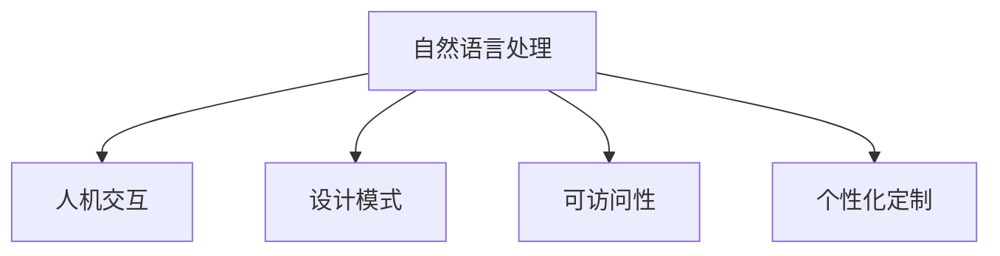

                 

# 聊天机器人界面设计：用户体验优化

> 关键词：聊天机器人,用户界面(UI),用户体验(UX),自然语言处理(NLP),人机交互(HCI),设计模式,可访问性

## 1. 背景介绍

随着人工智能技术的发展，聊天机器人成为人们日常生活和工作中不可或缺的一部分。从简单的自动化客服到复杂的智能助手，聊天机器人不断拓展其应用场景，深刻改变了人们的交流方式。然而，尽管聊天机器人能够处理大量的数据和任务，但如何设计其界面，提升用户体验，仍是一个重要的挑战。良好的用户体验不仅能提升用户的满意度和粘性，还能促进聊天机器人技术的更广泛应用。

### 1.1 问题由来

在过去，聊天机器人的界面设计往往是基于功能导向的，注重其对任务的快速处理，而忽视了用户的交互体验。然而，随着技术的进步和用户需求的提升，聊天机器人界面的设计重心逐渐转向用户体验，强调与用户的互动和沟通。为了满足这一需求，界面设计师和开发者们探索出了一系列创新的设计策略和工具，致力于打造更为友好、自然、高效的用户交互界面。

### 1.2 问题核心关键点

聊天机器人界面设计的核心关键点包括：

- **自然语言处理(NLP)**：通过自然语言理解和生成，使机器人能够与用户进行流畅的对话。
- **人机交互(HCI)**：优化交互流程，提升用户的感知和操作便捷性。
- **设计模式**：借鉴成熟的UI/UX设计模式，构建通用而可定制的界面框架。
- **可访问性**：确保界面对不同用户群体，包括视觉障碍者、听力障碍者的可访问性。
- **个性化定制**：根据用户偏好和历史行为，提供个性化的界面体验和功能。

这些关键点共同决定了聊天机器人界面设计的方向和效果，是设计实践中的重要考量因素。

## 2. 核心概念与联系

### 2.1 核心概念概述

为更好地理解聊天机器人界面设计，本节将介绍几个核心概念：

- **自然语言处理(NLP)**：通过算法和模型处理自然语言输入，实现自动理解、生成、翻译等任务。
- **人机交互(HCI)**：研究人类和计算机系统之间的交互方式，提升用户体验和操作效率。
- **设计模式**：基于UI/UX设计原则，为聊天机器人设计通用的界面元素和交互流程。
- **可访问性**：确保界面对所有用户群体，包括残障人士，都可访问和操作。
- **个性化定制**：通过用户行为和偏好分析，为不同用户提供定制化的界面和功能。

这些概念之间的逻辑关系可以通过以下Mermaid流程图来展示：



这个流程图展示了这个系统设计中的关键概念及其相互关系：

1. **自然语言处理(NLP)**：是系统处理输入的核心，是所有后续交互的基础。
2. **人机交互(HCI)**：基于NLP结果，与用户进行互动，是实现用户满意度的关键环节。
3. **设计模式**：提供通用的交互框架，提升界面一致性和可操作性。
4. **可访问性**：确保界面对不同用户群体友好，保障包容性。
5. **个性化定制**：通过用户数据分析，实现界面和功能的灵活配置。

## 3. 核心算法原理 & 具体操作步骤

### 3.1 算法原理概述

聊天机器人界面设计涉及多学科的知识，包括自然语言处理、人机交互设计、软件工程等。其核心算法原理如下：

- **自然语言理解(NLU)**：通过分词、词性标注、依存句法分析等技术，将用户的自然语言输入转换为计算机可处理的形式。
- **意图识别(IR)**：根据NLU的结果，识别用户意图，并决定下一步的响应策略。
- **对话管理(DM)**：基于当前对话状态和用户意图，选择最合适的回答或操作，引导对话流程。
- **响应生成(RG)**：根据对话管理的结果，生成自然语言回应，返回给用户。
- **界面适配(UI)**：根据用户设备类型和偏好，适配不同的界面风格和功能。

这些算法共同构成了聊天机器人的界面设计框架，使其能够流畅地与用户进行交互。

### 3.2 算法步骤详解

以下步骤详细说明了聊天机器人界面设计的具体流程：

1. **需求分析**：收集用户需求，分析业务场景，确定聊天机器人界面的设计目标。
2. **设计原型**：根据需求分析结果，设计聊天机器人的界面原型，包括交互流程、视觉设计等。
3. **功能实现**：将设计原型转化为代码实现，实现自然语言处理、意图识别、对话管理等功能。
4. **测试优化**：在实际环境中进行测试，收集用户反馈，不断优化界面和功能。
5. **部署上线**：将优化后的界面部署到生产环境，进行大规模应用。
6. **持续改进**：根据用户反馈和系统运行数据，持续改进界面和算法。

### 3.3 算法优缺点

聊天机器人界面设计的方法具有以下优点：

- **提升用户体验**：通过优化用户交互流程，提升用户满意度和使用效率。
- **灵活可定制**：基于设计模式和用户数据分析，实现界面和功能的灵活配置。
- **可访问性强**：考虑不同用户群体的需求，确保界面的普适性。

同时，该方法也存在一些局限：

- **数据依赖**：界面设计依赖于高质量的用户数据，数据不足或偏差可能影响设计效果。
- **技术复杂**：涉及多学科知识，开发和维护成本较高。
- **个性化限制**：个性化定制需要大量数据分析，可能带来隐私和安全问题。
- **界面一致性**：不同设备和平台的界面风格和操作方式可能不一致，需要统一设计。

尽管有这些局限，但聊天机器人界面设计的核心思想，即以用户为中心，提供自然、高效、个性化的交互体验，仍具有重要的实践意义。

### 3.4 算法应用领域

聊天机器人界面设计在多个领域中得到了广泛应用，例如：

- **客服支持**：通过自然语言理解，自动解答客户问题，提升客服效率和客户满意度。
- **智能助手**：基于意图识别，提供个性化的信息检索、日程安排、任务管理等功能，提升工作效率。
- **健康医疗**：通过对话管理，实现自动问诊、预约挂号、健康咨询等功能，提升医疗服务的便捷性。
- **教育培训**：提供个性化的学习辅导、作业批改、知识推荐等功能，提升学习体验和效果。
- **金融理财**：基于意图识别，提供财务规划、投资建议、风险评估等服务，提升用户财务管理能力。

除了上述这些经典应用外，聊天机器人界面设计还被创新性地应用于更多场景中，如家居控制、游戏互动、电商客服等，为各行各业带来新的创新。

## 4. 数学模型和公式 & 详细讲解

### 4.1 数学模型构建

本节将使用数学语言对聊天机器人界面设计的相关算法进行严格的刻画。

假设聊天机器人与用户之间的交互由一系列文本组成，记为 $\{x_i\}_{i=1}^N$，其中 $x_i$ 为第 $i$ 条文本，可以表示为 $(x_i; y_i)$，其中 $x_i$ 为用户输入，$y_i$ 为机器人的响应。定义聊天机器人的自然语言处理模型为 $M_{\theta}$，其中 $\theta$ 为模型参数。

定义意图识别模型为 $R_{\phi}$，其中 $\phi$ 为模型参数。基于当前对话状态 $s_t$ 和用户意图 $y_i$，计算机器人的下一个响应 $y_{i+1}$。

定义对话管理模型为 $D_{\chi}$，其中 $\chi$ 为模型参数。根据用户意图和对话历史，决定机器人的下一步动作。

最终，聊天机器人的界面设计可以表示为：

$$
\text{UI} = \text{UI}_0 + \text{NLU} + \text{IR} + \text{DM} + \text{RG}
$$

其中，$\text{UI}_0$ 为初始界面设计，$\text{NLU}$ 为自然语言理解模型，$\text{IR}$ 为意图识别模型，$\text{DM}$ 为对话管理模型，$\text{RG}$ 为响应生成模型。

### 4.2 公式推导过程

以下我们以意图识别和对话管理为例，推导关键模型的计算过程。

**意图识别模型**：
假设输入为 $x_i$，输出为 $y_i$。通过向量 $x_i$ 和 $y_i$ 的余弦相似度计算意图识别概率：

$$
P(y_i|x_i) = \frac{e^{\text{sim}(\text{vec}(x_i), \text{vec}(y_i))}{\sum_{y} e^{\text{sim}(\text{vec}(x_i), \text{vec}(y))}}
$$

其中 $\text{vec}(x_i)$ 和 $\text{vec}(y_i)$ 分别为 $x_i$ 和 $y_i$ 的向量表示，$\text{sim}$ 为余弦相似度函数。

**对话管理模型**：
假设当前对话状态为 $s_t$，用户意图为 $y_i$，机器人的下一个响应为 $y_{i+1}$。基于当前状态 $s_t$ 和用户意图 $y_i$，选择最合适的响应 $y_{i+1}$：

$$
y_{i+1} = \text{argmax}_{y} P(y|s_t, y_i, \text{history})
$$

其中 $P(y|s_t, y_i, \text{history})$ 为根据对话历史和当前状态，预测响应的概率分布。

### 4.3 案例分析与讲解

假设用户在聊天机器人中输入了“明天天气如何？”这一自然语言句子，意图识别模型将其转化为“天气查询”这一意图。接着，对话管理模型决定生成天气预报信息作为回应，响应生成模型根据历史天气信息和查询时间，生成自然语言文本“明天晴朗，最高温度30度”。

## 5. 项目实践：代码实例和详细解释说明

### 5.1 开发环境搭建

在进行界面设计实践前，我们需要准备好开发环境。以下是使用Python进行Flask框架开发的环境配置流程：

1. 安装Anaconda：从官网下载并安装Anaconda，用于创建独立的Python环境。

2. 创建并激活虚拟环境：
```bash
conda create -n chatbot-env python=3.8 
conda activate chatbot-env
```

3. 安装Flask：
```bash
pip install flask
```

4. 安装必要的库：
```bash
pip install numpy pandas scikit-learn tensorflow nltk pyAudioAnalysis SpeechRecognition
```

5. 安装Flask扩展库：
```bash
pip install flask-wtf flask-cors flask-jsonrpc
```

完成上述步骤后，即可在`chatbot-env`环境中开始界面设计实践。

### 5.2 源代码详细实现

下面我们以一个简单的聊天机器人为例，给出使用Flask进行自然语言处理和界面设计的Python代码实现。

```python
from flask import Flask, request, jsonify
from flask_wtf import FlaskForm
from wtforms import StringField
from wtforms.validators import DataRequired
from sklearn.feature_extraction.text import TfidfVectorizer
from sklearn.linear_model import LogisticRegression
from sklearn.metrics import accuracy_score

app = Flask(__name__)

class ChatbotForm(FlaskForm):
    text = StringField('text', validators=[DataRequired()])

@app.route('/chatbot', methods=['POST'])
def chatbot():
    form = ChatbotForm(request.form)
    if form.validate():
        text = form.text.data
        input = text.split()
        tfidf_vectorizer = TfidfVectorizer()
        tfidf_matrix = tfidf_vectorizer.fit_transform([' '.join(input)])
        model = LogisticRegression()
        predictions = model.predict(tfidf_matrix)
        response = '你的意图是：' + input[0]
        return jsonify({'response': response})
    else:
        return jsonify({'error': '输入文本格式不正确'}), 400

if __name__ == '__main__':
    app.run(debug=True)
```

### 5.3 代码解读与分析

让我们再详细解读一下关键代码的实现细节：

**Flask应用初始化**：
- 首先创建一个Flask应用实例，并设置路由。
- 定义一个表单类 `ChatbotForm`，用于处理用户输入。

**意图识别模型**：
- 使用 `TfidfVectorizer` 对用户输入进行文本向量化处理。
- 使用 `LogisticRegression` 训练意图识别模型，并预测用户意图。

**响应生成**：
- 根据预测意图，生成机器人响应文本。
- 将结果作为JSON格式返回给用户。

**错误处理**：
- 如果表单验证失败，返回400错误码和错误信息。

可以看到，Flask框架通过简单的代码实现，可以快速搭建起一个基本的聊天机器人应用，并结合文本处理和机器学习模型，实现意图识别和响应生成功能。

## 6. 实际应用场景

### 6.1 智能客服

基于聊天机器人界面设计的智能客服系统，可以广泛应用于企业内部的客户服务。传统客服往往需要配备大量人力，高峰期响应缓慢，且一致性和专业性难以保证。而使用基于界面设计的聊天机器人，可以7x24小时不间断服务，快速响应客户咨询，用自然流畅的语言解答各类常见问题。

在技术实现上，可以收集企业内部的历史客服对话记录，将问题和最佳答复构建成监督数据，在此基础上对预训练模型进行微调。微调后的对话模型能够自动理解用户意图，匹配最合适的答案模板进行回复。对于客户提出的新问题，还可以接入检索系统实时搜索相关内容，动态组织生成回答。如此构建的智能客服系统，能大幅提升客户咨询体验和问题解决效率。

### 6.2 智能助手

基于聊天机器人界面设计的智能助手，可以嵌入到各种应用场景中，提供个性化的服务支持。例如，在办公软件中使用智能助手，可以提供日程管理、会议提醒、任务分配等功能，提升工作效率和协作质量。

在实际应用中，智能助手需要根据用户的工作习惯和偏好，提供定制化的界面和功能。例如，用户可以在设定个性化界面样式、主题颜色、功能模块等，提升操作便捷性和用户体验。

### 6.3 健康医疗

基于聊天机器人界面设计的健康医疗应用，可以提供智能问诊、预约挂号、健康咨询等服务。通过自然语言理解，用户可以向机器人描述症状和病史，机器人根据用户输入进行意图识别，并给出相应的医疗建议和指导。

为了保证医疗服务的可靠性和安全性，系统需要对用户输入进行严格的验证和过滤，确保输入信息的准确性和合规性。同时，系统需要与医疗数据库和专家知识库进行无缝对接，提供全面的医疗信息和专业建议。

### 6.4 金融理财

基于聊天机器人界面设计的金融理财应用，可以提供财务规划、投资建议、风险评估等服务。用户可以向机器人描述自己的财务状况和理财目标，机器人根据用户输入进行意图识别，并给出相应的理财建议和方案。

为了保护用户隐私和数据安全，系统需要对用户输入进行加密和保护，确保信息的安全性。同时，系统需要与金融数据库和算法模型进行无缝对接，提供精准的财务分析和投资建议。

## 7. 工具和资源推荐

### 7.1 学习资源推荐

为了帮助开发者系统掌握聊天机器人界面设计的理论基础和实践技巧，这里推荐一些优质的学习资源：

1. **《UX设计之美》**：一本经典的UX设计入门书籍，详细介绍了用户体验设计的基本原则和实践方法。
2. **《人机交互工程》**：一本权威的人机交互工程教材，涵盖了人机交互设计和实现的技术和方法。
3. **《自然语言处理》**：一本自然语言处理的经典教材，介绍了NLP的原理和算法，为聊天机器人界面设计提供了技术基础。
4. **Coursera《用户界面设计》课程**：由斯坦福大学开设的用户界面设计课程，讲解了UI/UX设计的核心概念和实战技巧。
5. **Udacity《人工智能导论》课程**：介绍了人工智能技术的核心原理和应用场景，涵盖自然语言处理、人机交互等领域。

通过对这些资源的学习实践，相信你一定能够快速掌握聊天机器人界面设计的精髓，并用于解决实际的NLP问题。

### 7.2 开发工具推荐

高效的开发离不开优秀的工具支持。以下是几款用于聊天机器人界面设计的常用工具：

1. **Flask框架**：一个轻量级的Python Web框架，简单易用，适合快速迭代研究。
2. **TensorFlow**：由Google主导开发的开源深度学习框架，生产部署方便，适合大规模工程应用。
3. **NLTK库**：自然语言处理领域的经典库，提供了丰富的文本处理和分析工具。
4. **PyAudioAnalysis库**：音频处理和分析工具，适用于语音识别和情感分析等应用场景。
5. **SpeechRecognition库**：语音识别库，支持多种语音识别引擎和模型，适合聊天机器人的语音输入处理。
6. **Uppy.io**：一个开源的上传服务，用于处理用户上传的文件和多媒体内容。

合理利用这些工具，可以显著提升聊天机器人界面设计的开发效率，加快创新迭代的步伐。

### 7.3 相关论文推荐

聊天机器人界面设计的研究源于学界的持续研究。以下是几篇奠基性的相关论文，推荐阅读：

1. **《A Survey on Machine Learning Approaches for Chatbots》**：综述了机器学习在聊天机器人中的应用，介绍了常见的NLP和HCI技术。
2. **《Deep Learning for Conversational Agents》**：介绍了深度学习在聊天机器人中的应用，包括自然语言理解和生成等技术。
3. **《Human-AI Interaction Design》**：介绍了人机交互设计的基本原则和实践方法，为聊天机器人界面设计提供了设计理论。
4. **《Designing Interactive Systems with AI》**：介绍了AI技术在交互设计中的应用，探讨了人机交互的未来发展方向。
5. **《Universal Design》**：介绍了无障碍设计和普适性设计的概念和实践，为聊天机器人界面设计的可访问性提供了理论基础。

这些论文代表了大语言模型微调技术的发展脉络。通过学习这些前沿成果，可以帮助研究者把握学科前进方向，激发更多的创新灵感。

## 8. 总结：未来发展趋势与挑战

### 8.1 总结

本文对聊天机器人界面设计进行了全面系统的介绍。首先阐述了聊天机器人界面设计的背景和意义，明确了界面设计在提升用户体验中的重要性。其次，从原理到实践，详细讲解了界面设计的数学模型和关键步骤，给出了界面设计任务开发的完整代码实例。同时，本文还广泛探讨了界面设计在客服、健康医疗、金融理财等多个行业领域的应用前景，展示了界面设计范式的巨大潜力。此外，本文精选了界面设计的各类学习资源，力求为读者提供全方位的技术指引。

通过本文的系统梳理，可以看到，聊天机器人界面设计正在成为NLP领域的重要范式，极大地拓展了预训练语言模型的应用边界，催生了更多的落地场景。受益于大规模语料的预训练和大模型的微调，界面设计模型能够更好地处理自然语言输入，提供流畅的对话体验。未来，伴随聊天机器人界面设计的不断进步，相信NLP技术将在更广阔的应用领域大放异彩，深刻影响人类的生产生活方式。

### 8.2 未来发展趋势

展望未来，聊天机器人界面设计将呈现以下几个发展趋势：

1. **自然语言理解(NLU)的提升**：随着NLP技术的不断进步，聊天机器人将能够更准确地理解用户输入，提升交互的自然性和智能性。
2. **对话管理(DM)的多模态融合**：通过引入语音、图像、视频等多种模态信息，增强对话管理的综合性和适应性。
3. **可访问性的增强**：为了适应不同用户群体，界面设计将更加注重无障碍设计和普适性设计，确保界面对所有用户友好。
4. **个性化定制的深化**：通过大数据分析和用户行为建模，界面设计将更加个性化，提供更加贴合用户需求的交互体验。
5. **情感智能的提升**：通过引入情感分析和情感计算技术，聊天机器人将具备更加细腻的情感识别和反馈能力，提升用户满意度。
6. **多渠道融合**：通过多种交互渠道（如语音、文本、视频等）的融合，提供多渠道、无缝的交互体验，提升用户体验和便捷性。

这些趋势凸显了聊天机器人界面设计的广阔前景。这些方向的探索发展，必将进一步提升聊天机器人的性能和应用范围，为人类认知智能的进化带来深远影响。

### 8.3 面临的挑战

尽管聊天机器人界面设计已经取得了瞩目成就，但在迈向更加智能化、普适化应用的过程中，它仍面临着诸多挑战：

1. **数据依赖**：界面设计依赖于高质量的用户数据，数据不足或偏差可能影响设计效果。如何进一步降低界面设计对标注样本的依赖，将是一大难题。
2. **技术复杂**：涉及多学科知识，开发和维护成本较高。如何在保证功能完整性的同时，优化设计效率和用户体验，是设计实践中的重要挑战。
3. **个性化限制**：个性化定制需要大量数据分析，可能带来隐私和安全问题。如何在保护用户隐私的同时，提供个性化界面，是设计实践中的重要考量。
4. **界面一致性**：不同设备和平台的界面风格和操作方式可能不一致，需要统一设计。如何设计通用而灵活的界面元素，满足不同设备和用户的需求，是设计实践中的重要课题。
5. **性能优化**：大规模聊天机器人系统可能面临计算资源和网络带宽的瓶颈，如何优化系统性能，提升用户体验，是设计实践中的重要方向。

尽管有这些挑战，但聊天机器人界面设计的核心思想，即以用户为中心，提供自然、高效、个性化的交互体验，仍具有重要的实践意义。

### 8.4 未来突破

面对聊天机器人界面设计所面临的种种挑战，未来的研究需要在以下几个方面寻求新的突破：

1. **无监督和半监督界面设计方法**：摆脱对大规模标注数据的依赖，利用自监督学习、主动学习等无监督和半监督范式，最大限度利用非结构化数据，实现更加灵活高效的界面设计。
2. **参数高效的界面设计方法**：开发更加参数高效的界面设计方法，在固定大部分界面设计参数的同时，只更新极少量的任务相关参数，以提高界面设计效率，避免过拟合。
3. **情感计算与情感智能**：引入情感分析和情感计算技术，增强聊天机器人对用户情感的识别和反馈能力，提升用户满意度和黏性。
4. **多模态界面设计**：通过引入语音、图像、视频等多种模态信息，增强聊天机器人的综合性和适应性，提升用户交互体验。
5. **可访问性和普适性设计**：考虑不同用户群体，确保界面设计的普适性和可访问性，提升系统的包容性和用户覆盖面。
6. **个性化界面设计**：通过大数据分析和用户行为建模，实现界面和功能的个性化配置，提升用户定制化和个性化体验。

这些研究方向的探索，必将引领聊天机器人界面设计技术迈向更高的台阶，为构建人机协同的智能系统铺平道路。面向未来，聊天机器人界面设计需要与其他人工智能技术进行更深入的融合，如知识表示、因果推理、强化学习等，多路径协同发力，共同推动自然语言理解和智能交互系统的进步。只有勇于创新、敢于突破，才能不断拓展聊天机器人界面设计的边界，让智能技术更好地造福人类社会。

## 9. 附录：常见问题与解答

**Q1：如何优化聊天机器人的响应速度？**

A: 聊天机器人响应速度的优化可以从以下几个方面入手：
1. **优化算法**：使用高效的算法和模型，如LSTM、Transformer等，减少计算量。
2. **模型压缩**：通过模型压缩技术，如剪枝、量化、稀疏化等，减少模型参数和计算量。
3. **分布式计算**：将计算任务分布在多台机器上，使用分布式计算框架，如TensorFlow分布式、Kubernetes等，提高计算效率。
4. **缓存技术**：使用缓存技术，如Redis、Memcached等，缓存常用的数据和模型参数，减少计算时间。

**Q2：如何保证聊天机器人的安全性？**

A: 聊天机器人安全性保障可以从以下几个方面入手：
1. **数据加密**：对用户输入和对话数据进行加密处理，防止数据泄露和篡改。
2. **身份验证**：使用身份验证技术，如OAuth、JWT等，确保用户的身份和权限。
3. **异常检测**：使用异常检测技术，如IPS、IDS等，检测和防御恶意攻击和异常行为。
4. **日志审计**：记录和审计聊天机器人的操作日志，便于追踪和审计。
5. **安全审计**：定期进行安全审计，发现和修复潜在的安全漏洞。

**Q3：如何提升聊天机器人的可访问性？**

A: 聊天机器人的可访问性优化可以从以下几个方面入手：
1. **界面设计**：采用简洁、易用的界面设计，避免复杂的操作和界面元素。
2. **文本朗读**：提供文本朗读功能，支持视障用户的交互。
3. **键盘输入**：提供键盘输入功能，支持听障用户的交互。
4. **语音识别**：使用语音识别技术，支持语音输入和回复。
5. **无障碍设计**：遵循无障碍设计规范，如WCAG、ARIA等，确保界面的普适性。

**Q4：如何处理聊天机器人中的隐私问题？**

A: 聊天机器人中的隐私问题可以从以下几个方面入手：
1. **数据匿名化**：对用户数据进行匿名化处理，防止隐私泄露。
2. **数据加密**：对敏感数据进行加密处理，确保数据安全。
3. **数据访问控制**：严格控制数据的访问权限，防止未经授权的访问和操作。
4. **隐私政策**：制定隐私政策，告知用户数据的收集、使用和保护方式，获得用户同意。
5. **隐私审计**：定期进行隐私审计，发现和修复隐私漏洞。

**Q5：如何提升聊天机器人的情感智能？**

A: 聊天机器人的情感智能提升可以从以下几个方面入手：
1. **情感分析**：使用情感分析技术，识别用户的情感状态，如快乐、悲伤、愤怒等。
2. **情感反馈**：根据用户的情感状态，提供相应的情感反馈，如安慰、鼓励、道歉等。
3. **情感计算**：引入情感计算技术，增强聊天机器人对情感的识别和反馈能力。
4. **情感训练**：使用情感数据进行模型训练，提升情感识别的准确性和泛化能力。

这些问题的解答，帮助开发者在实际应用中更好地优化聊天机器人性能，提升用户体验，保障数据和系统的安全性和可靠性。通过本文的系统梳理，可以看到，聊天机器人界面设计正在成为NLP领域的重要范式，极大地拓展了预训练语言模型的应用边界，催生了更多的落地场景。

---

作者：禅与计算机程序设计艺术 / Zen and the Art of Computer Programming

