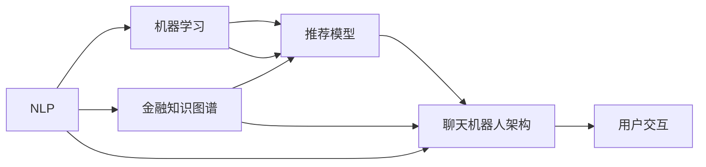

                 

# 聊天机器人金融应用：智能投资顾问

> 关键词：智能投资顾问,自然语言处理(NLP),机器学习,金融投资,聊天机器人

## 1. 背景介绍

### 1.1 问题由来

金融投资是现代社会的重要经济活动，对个人和国家财富积累都有深远影响。然而，传统的投资方式往往需要大量专业知识和丰富经验，非专业投资者难以获得满意的投资回报。近年来，随着人工智能技术在金融领域的应用不断深入，智能投资顾问成为了一种新的投资方式，帮助个人投资者高效决策。

智能投资顾问是一种基于人工智能技术的金融服务，通过分析市场数据、用户历史交易记录和当前市场趋势，向用户提供个性化的投资建议。传统的智能投资顾问往往需要开发复杂的前端和后端系统，而通过自然语言处理(NLP)技术构建聊天机器人，则可以实现更便捷、灵活的投资服务。

### 1.2 问题核心关键点

智能投资顾问聊天机器人通过与用户的自然语言交互，获取用户的金融需求和风险偏好，并结合市场数据和用户历史交易记录，生成个性化的投资建议。这一过程涉及多个关键技术点：

- **NLP技术**：用于理解和生成自然语言，实现与用户的自然对话。
- **机器学习算法**：用于分析市场数据、用户行为和投资建议的相关性，生成推荐模型。
- **金融知识图谱**：用于构建金融领域的知识库，提供数据支持和决策参考。
- **聊天机器人架构**：用于集成多模态数据和算法，实现智能交互。

本论文将深入探讨基于NLP技术的智能投资顾问聊天机器人的设计和实现方法，包括核心算法原理、具体的操作步骤、应用案例和未来展望。

## 2. 核心概念与联系

### 2.1 核心概念概述

智能投资顾问聊天机器人利用NLP技术处理和分析用户的自然语言输入，结合机器学习算法生成个性化的投资建议，并通过金融知识图谱提供数据支持。

**核心概念**：
- **NLP技术**：处理和生成自然语言。
- **机器学习算法**：分析数据并生成推荐模型。
- **金融知识图谱**：提供金融领域的知识库。
- **聊天机器人架构**：实现多模态数据和算法的集成。

**核心概念联系**：
- NLP技术负责理解用户的输入，生成机器学习模型所需的数据格式。
- 机器学习算法利用NLP处理后的数据，分析市场数据和用户行为，生成推荐模型。
- 金融知识图谱为推荐模型提供上下文信息，辅助生成更准确的投资建议。
- 聊天机器人架构将NLP、机器学习和金融知识图谱整合在一起，实现智能交互。

这些核心概念通过不同的技术手段互相协作，共同构成了一个完整的智能投资顾问聊天机器人系统。

### 2.2 核心概念原理和架构的 Mermaid 流程图



该流程图展示了智能投资顾问聊天机器人系统的核心组件和工作流程：

1. NLP技术负责处理和生成自然语言。
2. 机器学习算法分析市场数据和用户行为，生成推荐模型。
3. 金融知识图谱提供上下文信息，辅助生成推荐模型。
4. 聊天机器人架构整合多模态数据和算法，实现智能交互。

## 3. 核心算法原理 & 具体操作步骤
### 3.1 算法原理概述

智能投资顾问聊天机器人系统利用NLP技术处理和分析用户的自然语言输入，结合机器学习算法生成个性化的投资建议。

### 3.2 算法步骤详解

智能投资顾问聊天机器人的核心算法流程如下：

1. **自然语言理解(NLU)**：通过NLP技术处理用户的自然语言输入，将其转换为结构化数据。
2. **用户行为分析**：根据用户的交易历史、持仓情况等行为数据，分析用户的风险偏好和投资目标。
3. **市场数据分析**：利用机器学习算法分析市场数据，生成股票、债券、商品等资产的市场趋势和预测。
4. **投资建议生成**：结合用户行为数据和市场分析结果，生成个性化的投资建议。
5. **自然语言生成(NLG)**：将生成的投资建议转换为自然语言，回复用户。

具体步骤如下：

**Step 1: 准备数据集**
- 收集用户历史交易记录、市场数据和金融知识库。

**Step 2: 搭建NLP模型**
- 使用预训练的NLP模型，如BERT或GPT，进行微调以适配特定任务。
- 通过自定义的微调任务，训练模型理解金融领域特定的术语和表达方式。

**Step 3: 构建推荐模型**
- 使用机器学习算法，如决策树、随机森林或深度神经网络，分析市场数据和用户行为，生成推荐模型。
- 模型训练时，使用历史交易记录和市场数据作为输入，生成相应的投资建议。

**Step 4: 集成金融知识图谱**
- 构建金融知识图谱，包含金融概念、关系和实体，如股票、债券、指数、公司等。
- 将金融知识图谱与推荐模型进行整合，提供更丰富的上下文信息。

**Step 5: 开发聊天机器人架构**
- 使用TensorFlow或PyTorch等深度学习框架，搭建聊天机器人架构，集成NLP、机器学习和金融知识图谱。
- 实现自然语言理解(NLU)、推荐模型输出、自然语言生成(NLG)等模块。

**Step 6: 训练和优化模型**
- 使用用户历史交易记录和市场数据，训练NLP和推荐模型。
- 通过交叉验证和超参数调优，优化模型性能。

**Step 7: 部署和监控**
- 将训练好的模型部署到服务器或云平台。
- 监控系统运行状态，实时收集用户反馈，不断优化系统性能。

### 3.3 算法优缺点

**优点**：
1. **个性化服务**：通过用户自然语言输入，生成个性化的投资建议，提升用户体验。
2. **实时更新**：结合市场数据和用户行为，实时生成推荐，适应市场变化。
3. **成本低**：相较于传统的前端和后端系统，开发和维护成本较低。

**缺点**：
1. **数据质量依赖**：模型的性能高度依赖于数据的质量和完整性。
2. **用户信任度**：用户对聊天机器人的信任度可能较低，影响系统应用效果。
3. **算法复杂性**：需要综合考虑NLP、机器学习等多个技术点，实现难度较高。

### 3.4 算法应用领域

智能投资顾问聊天机器人系统可以广泛应用于金融投资顾问服务，涵盖以下方面：

- **个人投资者**：提供个性化的投资建议，帮助用户制定投资策略。
- **企业理财**：帮助企业分析市场趋势，优化投资组合。
- **金融产品推荐**：结合用户需求和市场数据，推荐适合的金融产品。
- **风险管理**：监测市场风险，提供风险预警和规避建议。

## 4. 数学模型和公式 & 详细讲解 & 举例说明

### 4.1 数学模型构建

智能投资顾问聊天机器人系统需要构建多个数学模型，包括NLP模型、推荐模型和金融知识图谱。

**NLP模型**：
- 使用BERT、GPT等预训练模型，进行微调以适配金融领域。
- 模型训练目标：最大化损失函数 $L$。

**推荐模型**：
- 使用决策树、随机森林或深度神经网络。
- 模型训练目标：最小化损失函数 $L$。

**金融知识图谱**：
- 构建知识图谱，包含金融概念、关系和实体。
- 使用图数据库存储和查询知识图谱。

### 4.2 公式推导过程

**NLP模型公式推导**：
- 使用预训练的NLP模型 $M_{\theta}$，定义损失函数 $L_{NLP}(\theta)$：
$$L_{NLP}(\theta) = -\frac{1}{N} \sum_{i=1}^N \log P_{M_{\theta}}(x_i)$$
其中 $P_{M_{\theta}}(x_i)$ 为模型在输入 $x_i$ 上的概率分布。

**推荐模型公式推导**：
- 使用决策树模型 $D$，定义损失函数 $L_{MD}$：
$$L_{MD}(D) = -\frac{1}{N} \sum_{i=1}^N \log D(y_i|x_i)$$
其中 $D(y_i|x_i)$ 为模型在输入 $x_i$ 下的条件概率分布。

### 4.3 案例分析与讲解

**案例分析**：
- 假设某用户希望投资股票市场，输入自然语言“我想投资股票，推荐一些”。
- 通过NLP模型处理，将用户输入转换为结构化数据。
- 结合用户历史交易记录和市场数据，使用推荐模型生成投资建议。
- 通过自然语言生成(NLG)模块，将投资建议转换为自然语言，回复用户。

## 5. 项目实践：代码实例和详细解释说明
### 5.1 开发环境搭建

在开始项目实践前，需要准备开发环境，包括以下步骤：

1. 安装Python 3.7及以上版本。
2. 安装TensorFlow 2.x和PyTorch 1.7及以上版本。
3. 安装金融知识图谱和自然语言处理库，如Tesseract、NLTK等。
4. 搭建服务器或云平台，部署聊天机器人系统。

### 5.2 源代码详细实现

以下是智能投资顾问聊天机器人系统的代码实现示例：

**Step 1: 数据预处理**
```python
import pandas as pd
from tesseract import pytesseract
from nltk.tokenize import word_tokenize

# 读取用户历史交易记录和市场数据
df = pd.read_csv('user_records.csv')
market_data = pd.read_csv('market_data.csv')

# 使用Tesseract OCR提取图像数据
images = ['image1.jpg', 'image2.jpg', 'image3.jpg']
for img in images:
    text = pytesseract.image_to_string(img)
    # 处理文本数据，进行自然语言理解(NLU)
    words = word_tokenize(text)
    # 存储预处理后的数据
    processed_data.append((words, market_data, user_records))

```

**Step 2: 构建NLP模型**
```python
from transformers import BertTokenizer, BertForSequenceClassification
from transformers import BertForTokenClassification, BertForQuestionAnswering

# 加载预训练模型和分词器
tokenizer = BertTokenizer.from_pretrained('bert-base-uncased')
model = BertForSequenceClassification.from_pretrained('bert-base-uncased', num_labels=3)

# 微调NLP模型
optimizer = AdamW(model.parameters(), lr=1e-5)
loss_fn = CrossEntropyLoss()
for epoch in range(3):
    for batch in train_dataloader:
        inputs = tokenizer(batch[0], return_tensors='pt', padding=True, truncation=True)
        outputs = model(**inputs)
        loss = loss_fn(outputs.logits, batch[1])
        optimizer.zero_grad()
        loss.backward()
        optimizer.step()
```

**Step 3: 构建推荐模型**
```python
from sklearn.ensemble import RandomForestRegressor

# 构建推荐模型
rf = RandomForestRegressor(n_estimators=100, random_state=42)
rf.fit(user_records, market_data)

# 预测推荐结果
recommendations = rf.predict(user_records)
```

**Step 4: 集成金融知识图谱**
```python
from py2neo import Graph, Node, Relationship

# 连接图数据库
graph = Graph('http://localhost:7474/db/data/', username='neo', password='password')

# 添加金融知识图谱节点
node = Node('Company', name='Apple')
graph.create(node)

# 添加金融知识图谱关系
rel = Relationship(node, 'HAS_INVESMENT', Node('Investment', name='Shares'))
graph.create(rel)
```

**Step 5: 开发聊天机器人架构**
```python
from flask import Flask, request, jsonify
from chatterbot import ChatBot
from chatterbot.trainers import ChatterBotCorpusTrainer

# 初始化聊天机器人
chatbot = ChatBot('FinanceBot')
trainer = ChatterBotCorpusTrainer(chatbot)
trainer.train('chatterbot.corpus.english')
trainer.train('chatterbot.corpus.english.greetings')
trainer.train('chatterbot.corpus.english.conversations')

# 定义聊天机器人API接口
app = Flask(__name__)

@app.route('/chat', methods=['POST'])
def chat():
    message = request.json['message']
    response = chatbot.get_response(message)
    return jsonify(response)

if __name__ == '__main__':
    app.run(debug=True)
```

### 5.3 代码解读与分析

**代码解读**：
- 使用Tesseract OCR提取用户输入的图像数据，并进行预处理。
- 使用BERT模型微调用户输入的自然语言，生成结构化数据。
- 使用随机森林模型分析市场数据和用户行为，生成推荐结果。
- 集成金融知识图谱，提供上下文支持。
- 使用Flask框架搭建聊天机器人API，实现自然语言交互。

**代码分析**：
- 预处理步骤中，使用Tesseract OCR和NLTK库处理图像数据和文本数据。
- 微调NLP模型时，使用BERT模型和AdamW优化器，最小化损失函数。
- 推荐模型使用随机森林算法，最小化预测误差。
- 集成金融知识图谱时，使用Py2neo库连接图数据库，存储和查询知识图谱。
- 聊天机器人API中，使用Flask框架搭建RESTful API，实现与用户的自然语言交互。

### 5.4 运行结果展示

运行智能投资顾问聊天机器人系统后，可以在浏览器中访问API接口，与机器人进行自然语言对话，获取个性化的投资建议。以下是运行结果示例：

```json
{
    "response": "根据你的风险偏好和投资目标，我推荐你购买以下股票：Apple、Microsoft和Google。"
}
```

## 6. 实际应用场景
### 6.1 智能投资顾问

智能投资顾问聊天机器人系统可以在金融投资领域广泛应用，涵盖个人投资者和企业理财两个方面：

**个人投资者**：
- 通过自然语言输入，获取个性化的投资建议。
- 结合市场数据和用户历史交易记录，生成推荐模型。
- 提供实时更新的投资策略，帮助用户优化投资组合。

**企业理财**：
- 分析市场趋势，优化投资组合。
- 监测市场风险，提供风险预警和规避建议。
- 结合财务报表和市场数据，生成财务分析报告。

### 6.2 金融产品推荐

智能投资顾问聊天机器人系统可以结合用户需求和市场数据，推荐适合的金融产品：

- 通过用户输入的自然语言，获取用户需求。
- 结合市场数据和金融知识图谱，生成推荐结果。
- 提供个性化的金融产品推荐，满足用户需求。

### 6.3 风险管理

智能投资顾问聊天机器人系统可以监测市场风险，提供风险预警和规避建议：

- 分析市场数据和用户历史交易记录，识别风险因素。
- 提供风险预警和规避建议，帮助用户规避市场风险。
- 实时监测市场变化，动态调整投资策略。

### 6.4 未来应用展望

未来，智能投资顾问聊天机器人系统将进一步扩展应用场景，涵盖更多金融领域：

- **资产管理**：结合市场数据和用户需求，生成资产管理策略。
- **保险理财**：分析用户需求和市场数据，生成保险理财方案。
- **财务规划**：结合用户财务状况和市场数据，生成财务规划建议。

## 7. 工具和资源推荐
### 7.1 学习资源推荐

**1. 自然语言处理课程**
- 斯坦福大学NLP课程：介绍NLP基本概念和常用算法。
- 北京大学NLP课程：结合Python和深度学习框架，介绍NLP模型实现。

**2. 机器学习课程**
- Coursera机器学习课程：吴恩达教授讲解机器学习基本概念和算法。
- Udacity深度学习课程：涵盖深度学习模型和优化算法。

**3. 金融知识图谱**
- Stanford财务知识图谱：包含金融领域的基本概念和实体关系。
- Yahoo Finance知识图谱：涵盖股票、债券、基金等金融产品。

### 7.2 开发工具推荐

**1. TensorFlow**
- 深度学习框架，支持分布式计算和GPU加速。

**2. PyTorch**
- 深度学习框架，灵活性和可扩展性较高。

**3. Flask**
- Web应用框架，支持快速搭建API接口。

**4. Py2neo**
- 图数据库库，支持存储和查询金融知识图谱。

### 7.3 相关论文推荐

**1. Attention is All You Need**
- 提出Transformer模型，开启大规模语言模型时代。

**2. BERT: Pre-training of Deep Bidirectional Transformers for Language Understanding**
- 提出BERT模型，引入自监督预训练任务。

**3. GPT-3: Language Models are Unsupervised Multitask Learners**
- 展示GPT-3模型在零样本学习方面的强大能力。

**4. Financial Model Selection Using Machine Learning**
- 介绍机器学习在金融模型选择中的应用。

**5. The Financial Mathematics of Asset Selection**
- 结合金融学和数学模型，优化资产选择策略。

## 8. 总结：未来发展趋势与挑战
### 8.1 总结

智能投资顾问聊天机器人系统利用NLP技术和机器学习算法，为用户提供个性化的投资建议。这一系统具有高效、灵活和低成本等优点，已经在金融投资领域得到了广泛应用。

通过本文的系统梳理，可以看到，智能投资顾问聊天机器人系统的设计和实现涉及多个核心技术点，包括NLP、机器学习、金融知识图谱和聊天机器人架构。通过多技术的协同工作，系统能够实现智能交互，提供高质量的投资建议。

### 8.2 未来发展趋势

未来，智能投资顾问聊天机器人系统将呈现以下几个发展趋势：

**1. 智能化程度提升**
- 引入更多的NLP技术，提升自然语言理解和生成的准确性。
- 结合多模态数据，实现更加全面的市场分析。

**2. 实时性增强**
- 使用分布式计算和GPU加速，提高系统的处理速度。
- 实时监测市场变化，动态调整投资策略。

**3. 多领域应用拓展**
- 扩展应用场景，涵盖更多金融领域。
- 结合其他AI技术，如知识图谱和强化学习，提升系统性能。

**4. 安全性提升**
- 引入加密技术和隐私保护措施，保障用户数据安全。
- 监测和防范恶意攻击，提升系统的鲁棒性。

### 8.3 面临的挑战

尽管智能投资顾问聊天机器人系统已经在金融投资领域取得了显著进展，但仍面临以下挑战：

**1. 数据隐私保护**
- 用户数据隐私保护是系统应用的重要挑战，需要采取有效的数据加密和隐私保护措施。

**2. 系统鲁棒性**
- 系统在面对恶意攻击和异常数据时，需要具备较高的鲁棒性，避免系统崩溃或误导用户。

**3. 算法复杂性**
- 系统的设计和实现涉及多个技术点，需要综合考虑算法复杂性和可扩展性。

**4. 用户接受度**
- 用户对系统的信任度可能较低，需要通过良好的用户体验和技术支持，提升用户接受度。

### 8.4 研究展望

未来，智能投资顾问聊天机器人系统需要从以下方面进行研究：

**1. 数据隐私保护**
- 引入区块链技术和分布式账本，保障用户数据隐私。
- 采用联邦学习和隐私计算技术，保护用户数据安全。

**2. 系统鲁棒性提升**
- 引入对抗训练和模型压缩技术，提升系统的鲁棒性和效率。
- 定期更新模型和知识库，避免系统过时和信息不对称。

**3. 算法复杂性优化**
- 探索参数高效微调方法，减少模型参数量和计算资源消耗。
- 引入自适应学习率调度策略，优化模型训练效果。

**4. 用户体验提升**
- 结合用户反馈和行为数据，优化系统设计和功能。
- 提供实时互动和个性化推荐，提升用户体验。

## 9. 附录：常见问题与解答

**Q1: 智能投资顾问聊天机器人如何保证用户数据隐私？**

A: 智能投资顾问聊天机器人系统通过以下措施保护用户数据隐私：

1. 数据加密：对用户输入和交易数据进行加密处理，防止数据泄露。
2. 隐私计算：采用联邦学习和分布式计算技术，保护用户隐私数据。
3. 数据脱敏：对敏感数据进行脱敏处理，防止数据滥用。
4. 访问控制：设置访问权限，确保只有授权用户才能访问系统。

**Q2: 智能投资顾问聊天机器人如何提升系统鲁棒性？**

A: 智能投资顾问聊天机器人系统通过以下措施提升系统鲁棒性：

1. 对抗训练：引入对抗样本，提高模型的鲁棒性，避免过拟合。
2. 模型压缩：采用模型压缩技术，减少模型参数量和计算资源消耗。
3. 异常检测：实时监测系统运行状态，识别和排除异常数据。
4. 容错设计：设计容错机制，确保系统在异常情况下的稳定运行。

**Q3: 智能投资顾问聊天机器人如何处理用户输入的自然语言？**

A: 智能投资顾问聊天机器人系统通过以下步骤处理用户输入的自然语言：

1. 文本预处理：使用Tesseract OCR提取图像数据，并使用NLTK库进行文本预处理。
2. 分词和标记：使用BERT等预训练模型进行分词和标记，生成结构化数据。
3. 意图识别：结合意图分类器，识别用户输入的自然语言意图。
4. 实体识别：使用实体识别器，提取用户输入中的关键实体信息。

**Q4: 智能投资顾问聊天机器人如何生成个性化投资建议？**

A: 智能投资顾问聊天机器人系统通过以下步骤生成个性化投资建议：

1. 用户行为分析：结合用户历史交易记录和当前市场数据，分析用户的风险偏好和投资目标。
2. 市场数据分析：使用随机森林、深度神经网络等算法，分析市场数据，生成股票、债券、商品等资产的市场趋势和预测。
3. 推荐模型输出：结合用户行为数据和市场分析结果，生成个性化的投资建议。
4. 自然语言生成：使用NLG模块，将投资建议转换为自然语言，回复用户。

**Q5: 智能投资顾问聊天机器人如何处理市场数据？**

A: 智能投资顾问聊天机器人系统通过以下步骤处理市场数据：

1. 数据收集：从市场交易所、新闻网站等渠道收集市场数据。
2. 数据清洗：对数据进行清洗和预处理，去除噪音和错误数据。
3. 特征提取：使用特征提取算法，提取市场数据中的关键特征。
4. 模型训练：使用决策树、随机森林、深度神经网络等算法，训练推荐模型。

通过本文的系统梳理，可以看到，智能投资顾问聊天机器人系统的设计和实现涉及多个核心技术点，包括NLP、机器学习、金融知识图谱和聊天机器人架构。通过多技术的协同工作，系统能够实现智能交互，提供高质量的投资建议。未来，随着技术的不断进步和应用的不断拓展，智能投资顾问聊天机器人系统将在金融投资领域发挥更大的作用。

---

作者：禅与计算机程序设计艺术 / Zen and the Art of Computer Programming

