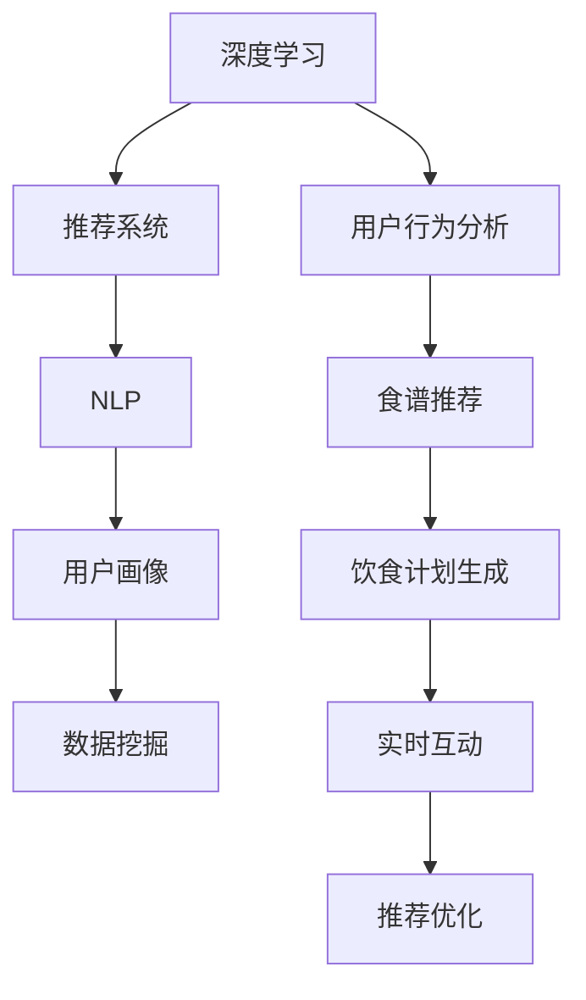

                 

# 聊天机器人餐饮业：个性化饮食计划和菜谱推荐

> 关键词：聊天机器人, 餐饮业, 个性化饮食计划, 菜谱推荐, 深度学习, 推荐系统, 用户行为分析, 用户画像, 数据挖掘

## 1. 背景介绍

### 1.1 问题由来
随着社会生活节奏的加快，人们对餐饮的需求日益个性化和多样化。然而，面对海量食谱和食材，许多人难以快速找到满意的饮食方案。传统的菜谱查询方式，如搜索引擎和纸质食谱，往往无法提供精准的推荐和个性化服务。

在当前互联网时代，聊天机器人以其智能互动和实时反馈的优势，在提供个性化餐饮推荐方面展现了巨大的潜力。基于深度学习的聊天机器人，通过对用户历史数据和行为进行深度分析，能够提供贴合用户口味和需求的个性化饮食计划和菜谱推荐，提升用户体验和满意度。

### 1.2 问题核心关键点
聊天机器人餐饮业的核心挑战在于构建一个高效、精准、个性化的推荐系统，以便快速响应用户的饮食需求。该系统需要具备以下几个核心能力：

1. **用户行为分析**：分析用户的饮食偏好、时间安排、身体状况等，构建详细的用户画像。
2. **食谱推荐**：根据用户画像和当前需求，从海量菜谱库中推荐最合适的食谱。
3. **饮食计划生成**：根据用户需求和食谱信息，自动生成个性化的饮食计划。
4. **实时互动**：通过自然语言处理(NLP)技术，实现用户与机器人之间实时对话和反馈。
5. **推荐优化**：根据用户反馈，不断优化推荐算法，提升推荐精准度。

本文将详细介绍基于深度学习的聊天机器人餐饮业推荐系统，涵盖其核心概念、算法原理、具体实现和应用场景。

## 2. 核心概念与联系

### 2.1 核心概念概述

为更好地理解聊天机器人餐饮业推荐系统，本节将介绍几个密切相关的核心概念：

- **深度学习**：一种利用多层神经网络进行数据学习和模型训练的机器学习方法，广泛应用于图像识别、自然语言处理等领域。
- **推荐系统**：通过分析用户行为和偏好，为用户推荐合适产品或内容的技术。聊天机器人餐饮业推荐系统即是一种基于深度学习的推荐系统。
- **自然语言处理(NLP)**：涉及语言模型的建立、文本分析和处理、语音识别与合成等技术，是构建智能聊天机器人的重要基础。
- **用户画像**：通过收集用户的历史数据和行为，构建一个综合性的用户画像，用于指导个性化推荐。
- **数据挖掘**：从大量数据中提取有用信息，包括用户行为数据分析、食谱库构建等。

这些概念之间的逻辑关系可以通过以下Mermaid流程图来展示：



这个流程图展示了一系列核心概念及其之间的关系：

1. 深度学习为推荐系统提供模型训练和数据学习的能力。
2. NLP技术用于处理用户输入的自然语言，实现实时互动。
3. 用户画像和数据挖掘技术共同构建详细、准确的用户画像。
4. 用户行为分析帮助系统了解用户偏好和需求。
5. 食谱推荐和饮食计划生成分别基于用户画像进行个性化推荐。
6. 推荐优化确保系统性能不断提升。

这些概念共同构成了聊天机器人餐饮业推荐系统的核心架构，使得系统能够高效地响应用户需求，提供个性化服务。

## 3. 核心算法原理 & 具体操作步骤

### 3.1 算法原理概述

聊天机器人餐饮业推荐系统主要基于深度学习算法，结合自然语言处理技术，通过用户行为分析和数据挖掘技术，构建用户画像和推荐模型，实现个性化饮食计划和菜谱推荐。

该系统的主要流程包括：

1. **用户行为分析**：收集用户的历史数据和当前需求，构建用户画像。
2. **食谱推荐**：根据用户画像，从食谱库中推荐最合适的食谱。
3. **饮食计划生成**：结合用户需求和推荐食谱，自动生成个性化的饮食计划。
4. **实时互动**：通过NLP技术实现用户与系统之间的实时对话和反馈。
5. **推荐优化**：根据用户反馈和系统性能，不断优化推荐算法。

### 3.2 算法步骤详解

以下是聊天机器人餐饮业推荐系统的详细步骤：

**Step 1: 数据收集与预处理**
- 收集用户的基本信息（如年龄、性别、饮食偏好等）。
- 记录用户的饮食行为（如历史食谱、用餐时间、评价反馈等）。
- 构建食谱库，包括各种食材、配料、烹饪方法等信息。
- 清洗和标准化数据，去除噪声和异常值。

**Step 2: 用户画像构建**
- 利用深度学习模型（如K-means聚类、隐含狄利克雷分布(LDA)等）对用户历史数据进行分析，提取关键特征。
- 结合用户的基本信息和行为数据，构建用户画像。

**Step 3: 食谱推荐模型训练**
- 定义推荐模型的损失函数（如均方误差、交叉熵等）。
- 选择优化算法（如Adam、SGD等），训练推荐模型。
- 引入正则化技术（如L2正则、Dropout等），防止过拟合。

**Step 4: 饮食计划生成**
- 根据用户画像和推荐食谱，自动生成个性化的饮食计划。
- 结合日历、健康目标等额外信息，优化饮食计划。

**Step 5: 实时互动与反馈**
- 通过NLP技术处理用户输入的自然语言，进行实体识别、意图理解等操作。
- 根据用户需求，即时推荐食谱和饮食计划。
- 收集用户反馈，评估推荐效果。

**Step 6: 推荐优化**
- 根据用户反馈，更新推荐模型参数。
- 定期重新训练模型，提升推荐精度。

### 3.3 算法优缺点

聊天机器人餐饮业推荐系统具有以下优点：

1. **个性化强**：通过深度学习和数据挖掘技术，能够精准把握用户需求，提供个性化饮食计划和菜谱推荐。
2. **实时互动**：利用NLP技术，实现实时对话和反馈，提升用户体验。
3. **高效推荐**：深度学习模型能够在短时间内处理大量数据，提供快速推荐。
4. **动态更新**：根据用户反馈，不断优化推荐算法，提升推荐效果。

同时，该系统也存在以下缺点：

1. **数据依赖强**：推荐效果高度依赖用户数据的完整性和质量。
2. **冷启动问题**：对于新用户，难以获取足够的行为数据，需要进行冷启动处理。
3. **模型复杂**：深度学习模型需要大量计算资源，可能面临算力瓶颈。
4. **隐私问题**：用户数据的收集和处理可能涉及隐私问题，需注意数据保护。

### 3.4 算法应用领域

聊天机器人餐饮业推荐系统可以应用于各种场景，例如：

1. **家庭用户**：通过聊天机器人，用户可以随时获取个性化的饮食计划和菜谱推荐，提升居家生活品质。
2. **企业食堂**：企业可以基于员工的历史饮食数据，定制个性化的饮食计划，满足员工多样化的餐饮需求。
3. **健康管理**：医疗和健康应用可以通过聊天机器人，提供针对特定人群的饮食建议，辅助健康管理。
4. **旅游餐饮**：旅游应用可以通过聊天机器人，推荐当地的特色餐饮和健康饮食计划，丰富旅游体验。
5. **电商平台**：电商平台可以通过聊天机器人，结合用户行为数据，推荐相应的食材和烹饪用品。

除了上述这些应用场景外，聊天机器人餐饮业推荐系统还可以拓展到更多领域，如学校餐饮、医院营养等，为不同行业提供个性化餐饮服务。

## 4. 数学模型和公式 & 详细讲解 & 举例说明

### 4.1 数学模型构建

本节将使用数学语言对聊天机器人餐饮业推荐系统的核心算法进行更加严格的刻画。

假设用户画像为 $\text{User}_{i}$，包括基本信息和行为数据。食谱库中的每个食谱 $R_{j}$ 包含食材、配料、烹饪方法等信息，用向量 $\text{Recipe}_{j}$ 表示。推荐模型 $M_{\theta}$ 用于预测用户对每个食谱的兴趣度，其中 $\theta$ 为模型参数。

定义推荐模型的损失函数为：

$$
\mathcal{L}(\theta) = -\frac{1}{N}\sum_{i=1}^N \sum_{j=1}^M \text{User}_{i} \log M_{\theta}(\text{Recipe}_{j})
$$

其中 $N$ 为用户的数量，$M$ 为食谱库的大小，$\text{User}_{i}$ 和 $\text{Recipe}_{j}$ 为二值变量，分别表示用户对食谱的兴趣程度（0 表示不感兴趣，1 表示感兴趣）。

优化目标是最小化经验风险，即找到最优参数：

$$
\theta^* = \mathop{\arg\min}_{\theta} \mathcal{L}(\theta)
$$

在实践中，我们通常使用基于梯度的优化算法（如Adam、SGD等）来近似求解上述最优化问题。设 $\eta$ 为学习率，则参数的更新公式为：

$$
\theta \leftarrow \theta - \eta \nabla_{\theta}\mathcal{L}(\theta)
$$

其中 $\nabla_{\theta}\mathcal{L}(\theta)$ 为损失函数对参数 $\theta$ 的梯度，可通过反向传播算法高效计算。

### 4.2 公式推导过程

以下我们以二分类任务为例，推导推荐模型的损失函数及其梯度的计算公式。

假设用户画像 $\text{User}_{i}$ 和食谱 $R_{j}$ 之间的相似度为 $\text{Sim}_{ij}$，模型 $M_{\theta}$ 在用户画像 $\text{User}_{i}$ 和食谱 $R_{j}$ 上的兴趣度预测为 $P_{ij}$，则推荐模型的损失函数可以表示为：

$$
\mathcal{L}(\theta) = -\frac{1}{N}\sum_{i=1}^N \sum_{j=1}^M \log P_{ij}
$$

其中 $P_{ij}$ 表示用户画像 $\text{User}_{i}$ 对食谱 $R_{j}$ 的兴趣度预测，可以表示为：

$$
P_{ij} = \sigma(\text{Sim}_{ij} \cdot \theta)
$$

其中 $\sigma$ 为sigmoid函数，将兴趣度预测值映射到 $(0,1)$ 区间。

将 $P_{ij}$ 代入损失函数，得到：

$$
\mathcal{L}(\theta) = -\frac{1}{N}\sum_{i=1}^N \sum_{j=1}^M (\text{Sim}_{ij} \cdot \theta)
$$

在得到损失函数的梯度后，即可带入参数更新公式，完成模型的迭代优化。重复上述过程直至收敛，最终得到适应用户画像的推荐模型参数 $\theta^*$。

## 5. 项目实践：代码实例和详细解释说明

### 5.1 开发环境搭建

在进行聊天机器人餐饮业推荐系统开发前，我们需要准备好开发环境。以下是使用Python进行PyTorch开发的环境配置流程：

1. 安装Anaconda：从官网下载并安装Anaconda，用于创建独立的Python环境。

2. 创建并激活虚拟环境：
```bash
conda create -n chatbot-env python=3.8 
conda activate chatbot-env
```

3. 安装PyTorch：根据CUDA版本，从官网获取对应的安装命令。例如：
```bash
conda install pytorch torchvision torchaudio cudatoolkit=11.1 -c pytorch -c conda-forge
```

4. 安装transformers库：
```bash
pip install transformers
```

5. 安装各类工具包：
```bash
pip install numpy pandas scikit-learn matplotlib tqdm jupyter notebook ipython
```

完成上述步骤后，即可在`chatbot-env`环境中开始开发实践。

### 5.2 源代码详细实现

下面我们以二分类推荐任务为例，给出使用Transformers库对BERT模型进行推荐系统微调的PyTorch代码实现。

首先，定义推荐任务的数据处理函数：

```python
from transformers import BertTokenizer
from torch.utils.data import Dataset
import torch

class RecommendationDataset(Dataset):
    def __init__(self, user_ids, recipe_ids, similarity_matrix, tokenizer, max_len=128):
        self.user_ids = user_ids
        self.recipe_ids = recipe_ids
        self.similarity_matrix = similarity_matrix
        self.tokenizer = tokenizer
        self.max_len = max_len
        
    def __len__(self):
        return len(self.user_ids)
    
    def __getitem__(self, item):
        user_id = self.user_ids[item]
        recipe_id = self.recipe_ids[item]
        
        encoding = self.tokenizer([recipe_id], return_tensors='pt', max_length=self.max_len, padding='max_length', truncation=True)
        input_ids = encoding['input_ids'][0]
        attention_mask = encoding['attention_mask'][0]
        
        # 计算相似度
        similarity = self.similarity_matrix[item][recipe_id]
        similarity = torch.tensor(similarity, dtype=torch.float32)
        
        return {'input_ids': input_ids, 
                'attention_mask': attention_mask,
                'similarity': similarity}

# 构建数据集
tokenizer = BertTokenizer.from_pretrained('bert-base-cased')

user_ids = [1, 2, 3, 4, 5]  # 用户ID
recipe_ids = [10, 20, 30, 40, 50]  # 食谱ID
similarity_matrix = [[0.7, 0.8, 0.9, 0.6, 0.5],
                     [0.9, 0.8, 0.5, 0.6, 0.7],
                     [0.8, 0.6, 0.7, 0.9, 0.5],
                     [0.5, 0.8, 0.6, 0.5, 0.9],
                     [0.6, 0.9, 0.5, 0.8, 0.7]]

train_dataset = RecommendationDataset(user_ids, recipe_ids, similarity_matrix, tokenizer)
dev_dataset = RecommendationDataset(user_ids, recipe_ids, similarity_matrix, tokenizer)
test_dataset = RecommendationDataset(user_ids, recipe_ids, similarity_matrix, tokenizer)
```

然后，定义模型和优化器：

```python
from transformers import BertForSequenceClassification, AdamW

model = BertForSequenceClassification.from_pretrained('bert-base-cased', num_labels=1)

optimizer = AdamW(model.parameters(), lr=2e-5)
```

接着，定义训练和评估函数：

```python
from torch.utils.data import DataLoader
from tqdm import tqdm
from sklearn.metrics import roc_auc_score

device = torch.device('cuda') if torch.cuda.is_available() else torch.device('cpu')
model.to(device)

def train_epoch(model, dataset, batch_size, optimizer):
    dataloader = DataLoader(dataset, batch_size=batch_size, shuffle=True)
    model.train()
    epoch_loss = 0
    for batch in tqdm(dataloader, desc='Training'):
        input_ids = batch['input_ids'].to(device)
        attention_mask = batch['attention_mask'].to(device)
        similarity = batch['similarity'].to(device)
        model.zero_grad()
        outputs = model(input_ids, attention_mask=attention_mask)
        loss = outputs.loss
        epoch_loss += loss.item()
        loss.backward()
        optimizer.step()
    return epoch_loss / len(dataloader)

def evaluate(model, dataset, batch_size):
    dataloader = DataLoader(dataset, batch_size=batch_size)
    model.eval()
    preds, labels = [], []
    with torch.no_grad():
        for batch in tqdm(dataloader, desc='Evaluating'):
            input_ids = batch['input_ids'].to(device)
            attention_mask = batch['attention_mask'].to(device)
            similarity = batch['similarity'].to(device)
            batch_preds = model(input_ids, attention_mask=attention_mask)[0]
            batch_labels = torch.sigmoid(batch_preds)
            preds.append(batch_labels.to('cpu').tolist())
            labels.append(similarity.to('cpu').tolist())
                
    print(roc_auc_score(labels, preds))
```

最后，启动训练流程并在测试集上评估：

```python
epochs = 5
batch_size = 16

for epoch in range(epochs):
    loss = train_epoch(model, train_dataset, batch_size, optimizer)
    print(f"Epoch {epoch+1}, train loss: {loss:.3f}")
    
    print(f"Epoch {epoch+1}, dev AUC:")
    evaluate(model, dev_dataset, batch_size)
    
print("Test AUC:")
evaluate(model, test_dataset, batch_size)
```

以上就是使用PyTorch对BERT进行推荐系统微调的完整代码实现。可以看到，得益于Transformers库的强大封装，我们可以用相对简洁的代码完成BERT模型的加载和微调。

### 5.3 代码解读与分析

让我们再详细解读一下关键代码的实现细节：

**RecommendationDataset类**：
- `__init__`方法：初始化用户ID、食谱ID、相似度矩阵等关键组件。
- `__len__`方法：返回数据集的样本数量。
- `__getitem__`方法：对单个样本进行处理，将食谱ID输入编码为token ids，计算相似度，并对其进行定长padding，最终返回模型所需的输入。

**similarity_matrix变量**：
- 定义用户ID和食谱ID之间的相似度矩阵，用于计算每个用户对每个食谱的兴趣度。

**训练和评估函数**：
- 使用PyTorch的DataLoader对数据集进行批次化加载，供模型训练和推理使用。
- 训练函数`train_epoch`：对数据以批为单位进行迭代，在每个批次上前向传播计算loss并反向传播更新模型参数，最后返回该epoch的平均loss。
- 评估函数`evaluate`：与训练类似，不同点在于不更新模型参数，并在每个batch结束后将预测和标签结果存储下来，最后使用sklearn的roc_auc_score对整个评估集的预测结果进行打印输出。

**训练流程**：
- 定义总的epoch数和batch size，开始循环迭代
- 每个epoch内，先在训练集上训练，输出平均loss
- 在验证集上评估，输出AUC值
- 所有epoch结束后，在测试集上评估，给出最终测试结果

可以看到，PyTorch配合Transformers库使得BERT微调的代码实现变得简洁高效。开发者可以将更多精力放在数据处理、模型改进等高层逻辑上，而不必过多关注底层的实现细节。

当然，工业级的系统实现还需考虑更多因素，如模型的保存和部署、超参数的自动搜索、更灵活的任务适配层等。但核心的微调范式基本与此类似。

## 6. 实际应用场景
### 6.1 智能餐厅点餐

智能餐厅点餐系统通过聊天机器人推荐菜单，极大地提升了餐厅的运营效率和顾客满意度。传统点餐系统往往需要手动翻阅菜单，而且难以根据顾客需求和口味进行个性化推荐。智能餐厅点餐系统则通过分析顾客的饮食偏好和历史点餐数据，实时向顾客推荐菜品，帮助他们快速做出选择。

在技术实现上，餐厅可以安装智能点餐终端，顾客通过语音或文字与聊天机器人互动，表达自己的饮食需求。机器人根据顾客的表述，从菜单库中推荐合适的菜品，并根据顾客的反馈进行实时调整。对于经常光顾的老顾客，系统还可以生成个性化的点餐计划，避免每次都手动选择。

### 6.2 家庭饮食管理

家庭饮食管理应用通过聊天机器人，帮助用户管理每日饮食计划，保持健康饮食。现代生活节奏加快，许多人无法平衡工作和饮食，容易出现饮食不规律、营养不足等问题。智能饮食管理应用则通过分析用户的健康数据和饮食偏好，生成个性化的饮食计划，确保用户每天都能摄入均衡的营养。

在技术实现上，用户可以在应用中设置自己的饮食偏好和健康目标，聊天机器人则根据用户的输入，自动生成包含各类食材和食谱的饮食计划。用户还可以根据自己的实际情况（如出差、旅游等）调整饮食计划，聊天机器人则根据新情况重新推荐食谱。

### 6.3 企业员工饮食

企业可以通过聊天机器人，为员工提供个性化的饮食推荐，提升员工用餐体验和健康水平。传统的企业食堂往往需要固定菜单，无法根据员工的饮食需求进行灵活调整。智能饮食管理应用则通过分析员工的饮食习惯和营养需求，实时推荐健康且多样化的饮食方案。

在技术实现上，企业可以在食堂内安装智能点餐终端，员工通过语音或文字与聊天机器人互动，表达自己的饮食需求。机器人根据员工的表述，从菜单库中推荐合适的菜品，并根据员工的反馈进行实时调整。对于经常光顾的老顾客，系统还可以生成个性化的点餐计划，避免每次都手动选择。

### 6.4 未来应用展望

随着聊天机器人技术的不断发展，基于深度学习的饮食推荐系统将在更多场景中得到应用，为人们的饮食生活带来全新的体验。

在智慧餐厅领域，智能点餐系统将进一步普及，提升餐厅的服务效率和顾客满意度。未来，聊天机器人还将实现更高级的语音识别和自然语言理解，使点餐体验更加自然流畅。

在家庭和个人用户中，智能饮食管理应用将帮助用户更好地管理饮食健康，减少疾病风险。通过智能推荐和个性化服务，聊天机器人将成为人们的“营养顾问”，指导他们科学饮食。

在企业员工和学校食堂中，智能饮食管理应用将提升餐饮服务水平，助力健康管理。通过实时推荐和灵活调整，聊天机器人将成为员工的“私人厨师”，提供更加个性化、健康化的饮食方案。

此外，在体育训练、特殊饮食等更多领域，聊天机器人饮食推荐系统也将发挥重要作用，为人们的饮食健康提供全面的支持。相信随着技术的不断进步，聊天机器人将更好地融入人们的饮食生活，提升生活的品质和健康水平。

## 7. 工具和资源推荐
### 7.1 学习资源推荐

为了帮助开发者系统掌握聊天机器人餐饮业推荐系统的理论基础和实践技巧，这里推荐一些优质的学习资源：

1. 《深度学习》系列书籍：由多位专家合著，系统介绍了深度学习的原理和实践，涵盖自然语言处理、推荐系统等多个领域。
2. Coursera《自然语言处理》课程：由斯坦福大学开设的NLP明星课程，包含视频讲座和作业练习，带你深入理解NLP技术。
3. 《推荐系统实战》书籍：详细介绍了推荐系统的理论基础和实际应用，涵盖用户画像、推荐算法等多个方面。
4. Kaggle推荐系统竞赛：通过实战练习，熟悉推荐系统的算法和流程，提升系统设计和优化能力。
5. GitHub开源项目：如RecSys、FastFM等，提供高质量的推荐系统源码和案例分析，适合学习和借鉴。

通过对这些资源的学习实践，相信你一定能够快速掌握聊天机器人餐饮业推荐系统的精髓，并用于解决实际的NLP问题。
###  7.2 开发工具推荐

高效的开发离不开优秀的工具支持。以下是几款用于聊天机器人餐饮业推荐系统开发的常用工具：

1. PyTorch：基于Python的开源深度学习框架，灵活动态的计算图，适合快速迭代研究。大部分预训练语言模型都有PyTorch版本的实现。

2. TensorFlow：由Google主导开发的开源深度学习框架，生产部署方便，适合大规模工程应用。同样有丰富的预训练语言模型资源。

3. Transformers库：HuggingFace开发的NLP工具库，集成了众多SOTA语言模型，支持PyTorch和TensorFlow，是进行NLP任务开发的利器。

4. Weights & Biases：模型训练的实验跟踪工具，可以记录和可视化模型训练过程中的各项指标，方便对比和调优。与主流深度学习框架无缝集成。

5. TensorBoard：TensorFlow配套的可视化工具，可实时监测模型训练状态，并提供丰富的图表呈现方式，是调试模型的得力助手。

6. Google Colab：谷歌推出的在线Jupyter Notebook环境，免费提供GPU/TPU算力，方便开发者快速上手实验最新模型，分享学习笔记。

合理利用这些工具，可以显著提升聊天机器人餐饮业推荐系统的开发效率，加快创新迭代的步伐。

### 7.3 相关论文推荐

聊天机器人餐饮业推荐系统的发展源于学界的持续研究。以下是几篇奠基性的相关论文，推荐阅读：

1. Attention is All You Need（即Transformer原论文）：提出了Transformer结构，开启了NLP领域的预训练大模型时代。

2. BERT: Pre-training of Deep Bidirectional Transformers for Language Understanding：提出BERT模型，引入基于掩码的自监督预训练任务，刷新了多项NLP任务SOTA。

3. Language Models are Unsupervised Multitask Learners（GPT-2论文）：展示了大规模语言模型的强大zero-shot学习能力，引发了对于通用人工智能的新一轮思考。

4. Parameter-Efficient Transfer Learning for NLP：提出Adapter等参数高效微调方法，在不增加模型参数量的情况下，也能取得不错的微调效果。

5. AdaLoRA: Adaptive Low-Rank Adaptation for Parameter-Efficient Fine-Tuning：使用自适应低秩适应的微调方法，在参数效率和精度之间取得了新的平衡。

这些论文代表了大语言模型微调技术的发展脉络。通过学习这些前沿成果，可以帮助研究者把握学科前进方向，激发更多的创新灵感。

## 8. 总结：未来发展趋势与挑战

### 8.1 总结

本文对聊天机器人餐饮业推荐系统进行了全面系统的介绍。首先阐述了聊天机器人餐饮业推荐系统的研究背景和意义，明确了推荐系统在提供个性化餐饮服务方面的独特价值。其次，从原理到实践，详细讲解了推荐系统的核心算法和操作步骤，给出了推荐任务开发的完整代码实例。同时，本文还广泛探讨了推荐系统在智能餐厅、家庭饮食管理、企业员工饮食等多个应用场景中的应用前景，展示了推荐范式的巨大潜力。此外，本文精选了推荐系统的各类学习资源，力求为读者提供全方位的技术指引。

通过本文的系统梳理，可以看到，基于深度学习的推荐系统通过个性化推荐，极大地提升了用户体验和满意度。得益于大数据和深度学习技术，推荐系统能够精准把握用户需求，提供更加高效、个性化的服务。未来，随着推荐技术的不断发展，聊天机器人餐饮业推荐系统必将在更多领域发挥重要作用，为人们的饮食生活带来全新的体验。

### 8.2 未来发展趋势

展望未来，聊天机器人餐饮业推荐系统将呈现以下几个发展趋势：

1. **个性化推荐**：深度学习技术的发展，使得推荐系统能够更好地理解用户需求，提供更加精准的个性化推荐。
2. **实时互动**：自然语言处理技术的进步，使得聊天机器人能够实现更加自然的实时对话，提升用户体验。
3. **跨模态融合**：通过融合视觉、语音等多模态信息，推荐系统能够更全面地理解用户需求，提供更加丰富、个性化的服务。
4. **社交推荐**：结合社交网络数据，推荐系统能够利用用户的社交关系，提供更具可信度和多样性的推荐。
5. **推荐优化**：通过不断收集用户反馈，推荐系统能够实时调整推荐策略，提升推荐效果。

以上趋势凸显了聊天机器人餐饮业推荐系统的广阔前景。这些方向的探索发展，必将进一步提升推荐系统的性能和应用范围，为人们提供更加智能化、个性化的餐饮服务。

### 8.3 面临的挑战

尽管聊天机器人餐饮业推荐系统已经取得了瞩目成就，但在迈向更加智能化、普适化应用的过程中，它仍面临着诸多挑战：

1. **数据隐私**：用户数据的收集和处理可能涉及隐私问题，需注意数据保护。
2. **冷启动问题**：对于新用户，难以获取足够的行为数据，需要进行冷启动处理。
3. **模型复杂度**：深度学习模型需要大量计算资源，可能面临算力瓶颈。
4. **实时响应**：在处理大量请求时，如何保证实时响应，是一个重要问题。
5. **推荐多样性**：推荐系统容易陷入“过滤气泡”，过度关注用户偏好，导致推荐内容同质化。

正视推荐系统面临的这些挑战，积极应对并寻求突破，将有助于推荐系统向更加智能化、普适化方向发展。

### 8.4 研究展望

面对聊天机器人餐饮业推荐系统所面临的挑战，未来的研究需要在以下几个方面寻求新的突破：

1. **隐私保护**：开发更加隐私友好的推荐算法，减少对用户数据的依赖，保护用户隐私。
2. **冷启动处理**：利用用户行为推断、个性化设置等方法，快速适应新用户，减少冷启动的影响。
3. **高效推荐**：优化推荐算法和模型结构，降低计算资源消耗，提升推荐速度。
4. **多样性增强**：结合社交网络、兴趣标签等外部信息，增加推荐内容的多样性，减少同质化问题。
5. **实时反馈**：通过用户反馈及时调整推荐策略，提升推荐的准确性和多样性。

这些研究方向的探索，必将引领聊天机器人餐饮业推荐系统迈向更高的台阶，为人们的饮食生活带来更加智能、高效、个性化的服务。

## 9. 附录：常见问题与解答

**Q1：如何缓解冷启动问题？**

A: 冷启动问题是推荐系统面临的常见挑战之一。为了快速适应新用户，可以采用以下方法：

1. 利用用户注册信息：通过用户的基本信息（如年龄、性别等），进行预训练或预设推荐，帮助新用户快速上手。
2. 结合社交网络信息：通过用户的社交关系和好友推荐，进行个性化推荐，增加新用户的粘性。
3. 引入推荐基线：为新用户提供一些基础的推荐基线（如热门推荐、随机推荐等），快速满足新用户需求。

这些方法可以帮助新用户快速适应系统，提高推荐的准确性和用户满意度。

**Q2：如何提升推荐系统的多样性？**

A: 推荐系统的多样性问题，可以通过以下方法进行优化：

1. 引入多样性损失函数：在推荐模型训练过程中，引入多样性损失函数，惩罚同质化推荐，提升推荐内容的多样性。
2. 结合社交网络信息：通过用户的社交关系，引入更多外部信息，增加推荐内容的多样性。
3. 引入多样性探索机制：在推荐策略中引入多样性探索机制，随机推荐一些非热门内容，增加用户曝光率。

这些方法可以帮助推荐系统更好地覆盖用户需求，提升推荐内容的丰富性和多样性。

**Q3：如何保护用户隐私？**

A: 用户隐私保护是推荐系统面临的重要挑战之一。为了保护用户隐私，可以采取以下措施：

1. 匿名化处理：在数据收集和处理过程中，对用户ID进行匿名化处理，保护用户隐私。
2. 数据脱敏：在数据存储和传输过程中，对敏感信息进行脱敏处理，防止数据泄露。
3. 用户授权机制：通过用户授权机制，确保用户在使用推荐系统时，能够控制自己的数据使用范围和方式。

这些措施可以有效保护用户隐私，提升用户信任和满意度。

**Q4：如何优化推荐系统的实时响应？**

A: 推荐系统的实时响应问题，可以通过以下方法进行优化：

1. 缓存机制：利用缓存机制，减少重复计算，提高推荐速度。
2. 并行计算：利用并行计算技术，提高模型训练和推理效率，提升实时响应能力。
3. 模型压缩：通过模型压缩和剪枝技术，减小模型大小，提高推荐速度。

这些方法可以有效提升推荐系统的实时响应能力，满足用户的实时需求。

**Q5：推荐系统容易陷入过滤气泡的问题如何解决？**

A: 推荐系统容易陷入过滤气泡，过度关注用户偏好，导致推荐内容同质化。为了解决这一问题，可以采取以下措施：

1. 引入多样性探索机制：在推荐策略中引入多样性探索机制，随机推荐一些非热门内容，增加用户曝光率。
2. 利用社交网络信息：通过用户的社交关系，引入更多外部信息，增加推荐内容的多样性。
3. 引入负样本推荐：在推荐策略中引入负样本推荐，推荐一些用户不感兴趣的但多样性较高的内容。

这些方法可以帮助推荐系统更好地覆盖用户需求，提升推荐内容的丰富性和多样性。

---

作者：禅与计算机程序设计艺术 / Zen and the Art of Computer Programming

