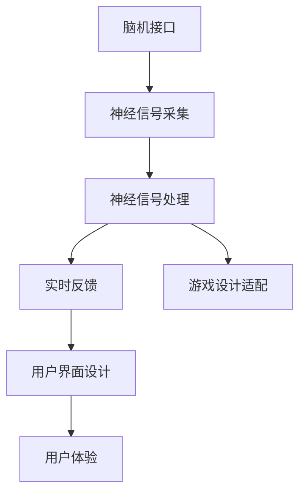

                 

# 脑机接口在游戏产业中的应用：思维控制游戏

> 关键词：脑机接口(Brain-Computer Interface, BCI), 游戏产业, 思维控制, 实时反馈, 用户参与感, 神经信号处理, 游戏设计

## 1. 背景介绍

脑机接口技术（Brain-Computer Interface, BCI）在近年来取得了显著进展，逐渐从实验室走向实际应用。其核心思想是通过非侵入性的方式，从用户的大脑中读取神经信号，并通过解码算法转化为可控制的信号，用于驱动外部设备。在虚拟现实（Virtual Reality, VR）、游戏等领域，BCI技术提供了全新的交互方式，增强了用户的沉浸感和参与感。

### 1.1 问题由来

传统游戏主要依赖键盘和鼠标进行操作，但这些输入方式限制了玩家的操作自由度和游戏沉浸感。特别是动作游戏，如《守望先锋》、《使命召唤》等，对玩家的操作速度和精准度有很高的要求，而现有的输入方式难以满足这些需求。BCI技术的应用，可以让玩家通过思维活动控制游戏，无需物理输入，实现真正的思维控制游戏。

### 1.2 问题核心关键点

脑机接口在游戏产业中的核心关键点包括：
1. 神经信号的采集与处理：如何有效地采集和解码大脑信号，将其转化为可控制的输出信号。
2. 实时反馈机制：如何在玩家游戏中即时反馈其脑波信号的状态和识别结果，增强用户参与感。
3. 游戏设计适配：如何将BCI技术与游戏设计深度融合，实现无缝衔接，提升游戏体验。
4. 用户界面设计：设计直观易用的BCI用户界面，让用户能够轻松使用BCI技术。

## 2. 核心概念与联系

### 2.1 核心概念概述

为了更好地理解BCI在游戏中的应用，本节将介绍几个关键概念：

- 脑机接口(Brain-Computer Interface, BCI)：通过非侵入性方式从大脑中读取神经信号，并通过解码转化为可控制的信号，用于驱动外部设备的技术。
- 神经信号处理：对采集到的神经信号进行预处理、特征提取、分类等步骤，提取出有用的信息。
- 实时反馈机制：在游戏中实时展示脑波信号的状态和识别结果，增强用户体验。
- 用户界面(UI)设计：设计直观易用的BCI用户界面，让用户能够轻松使用BCI技术。

这些概念之间的关系可以通过以下Mermaid流程图来展示：



这个流程图展示了BCI技术的核心流程和关键组件：

1. 脑机接口采集大脑信号。
2. 神经信号处理模块对采集到的信号进行预处理和分类。
3. 实时反馈机制展示信号状态和识别结果。
4. 游戏设计适配将BCI技术集成到游戏中。
5. 用户界面设计用于提供直观易用的操作界面。
6. 最终增强用户体验，提升游戏沉浸感。

## 3. 核心算法原理 & 具体操作步骤

### 3.1 算法原理概述

BCI技术的核心在于神经信号的采集、处理和解码。其原理大致如下：

1. **神经信号采集**：通过头皮电极、脑电图（Electroencephalography, EEG）等非侵入性方式采集大脑信号。
2. **预处理**：对采集到的信号进行滤波、降噪等预处理步骤，增强信号质量。
3. **特征提取**：通过算法从预处理后的信号中提取有用的特征，如时间、频域等特征。
4. **分类器设计**：构建机器学习或深度学习模型，用于分类神经信号，识别玩家的思维指令。
5. **输出信号生成**：根据分类结果生成可控制的信号，如移动、射击等。
6. **实时反馈**：在游戏中展示脑波信号的状态和识别结果，提供即时反馈。

### 3.2 算法步骤详解

以下是BCI技术在游戏中的具体操作步骤：

1. **数据采集**：通过头皮电极采集玩家的脑电图信号。
2. **信号预处理**：对采集到的信号进行滤波、降噪等预处理步骤，增强信号质量。
3. **特征提取**：通过算法从预处理后的信号中提取有用的特征，如时间、频域等特征。
4. **分类器训练**：构建机器学习或深度学习模型，使用标注数据训练分类器。
5. **游戏设计适配**：将BCI技术集成到游戏中，实现游戏操作。
6. **实时反馈**：在游戏中展示脑波信号的状态和识别结果，提供即时反馈。
7. **用户界面设计**：设计直观易用的BCI用户界面，让用户能够轻松使用BCI技术。

### 3.3 算法优缺点

BCI技术在游戏产业中具有以下优点：
1. 增强用户体验：通过思维控制游戏，无需物理输入，提升用户沉浸感。
2. 提升游戏设计自由度：BCI技术提供更多交互方式，增强游戏设计的多样性。
3. 提高游戏可玩性：思维控制游戏挑战性更高，增加用户的游戏兴趣。

同时，BCI技术在游戏产业中也存在一些局限：
1. 技术成熟度不足：目前BCI技术的准确性和稳定性仍有限，难以满足高要求的游戏应用。
2. 数据隐私问题：BCI技术的脑电信号采集涉及个人隐私，引发数据隐私和安全问题。
3. 硬件成本高：目前BCI技术的硬件成本较高，普及度受限。
4. 用户适应性：BCI技术的复杂性可能对部分用户造成适应困难，影响游戏体验。

### 3.4 算法应用领域

BCI技术在游戏产业中主要应用于以下领域：

1. **动作游戏**：如《守望先锋》、《使命召唤》等，通过BCI技术实现思维控制射击、移动等操作。
2. **赛车游戏**：如《F1赛车》、《极限竞速》等，通过BCI技术控制车辆驾驶。
3. **飞行模拟游戏**：如《模拟飞行器》、《战鸟》等，通过BCI技术控制飞机飞行。
4. **体育游戏**：如《足球经理》、《网球冠军》等，通过BCI技术进行球员操控和游戏决策。

## 4. 数学模型和公式 & 详细讲解 & 举例说明

### 4.1 数学模型构建

脑机接口技术的核心在于神经信号的采集、处理和解码。其数学模型可以大致分为以下几个步骤：

1. **信号采集**：采集大脑信号 $x(t)$。
2. **预处理**：对信号进行滤波、降噪等预处理步骤，生成预处理后的信号 $x_f(t)$。
3. **特征提取**：提取特征向量 $\phi(x_f(t))$。
4. **分类器训练**：训练分类器 $h(\phi(x_f(t)))$，将特征向量映射到可控制信号 $u$。

### 4.2 公式推导过程

以下是BCI技术的数学模型推导过程：

1. **信号采集**：
   $$
   x(t) = V_m + V_n(t)
   $$
   其中 $V_m$ 为持续背景信号，$V_n(t)$ 为噪声信号。

2. **预处理**：
   $$
   x_f(t) = C(x(t))
   $$
   其中 $C$ 为滤波器，对信号进行滤波和降噪处理。

3. **特征提取**：
   $$
   \phi(x_f(t)) = F(x_f(t))
   $$
   其中 $F$ 为特征提取算法，将预处理后的信号转化为特征向量。

4. **分类器训练**：
   $$
   u = h(\phi(x_f(t)))
   $$
   其中 $h$ 为分类器，将特征向量映射到可控制信号 $u$。

### 4.3 案例分析与讲解

以《守望先锋》为例，探讨BCI技术的应用。

1. **信号采集**：通过头皮电极采集玩家的脑电图信号，如EEG信号。
2. **预处理**：对采集到的信号进行滤波和降噪处理，增强信号质量。
3. **特征提取**：通过算法提取信号的时间、频域等特征，生成特征向量。
4. **分类器训练**：使用标注数据训练分类器，如支持向量机(SVM)或深度神经网络，将特征向量映射到射击、移动等操作。
5. **游戏设计适配**：将BCI技术集成到游戏中，玩家通过思维指令控制角色射击、移动等操作。
6. **实时反馈**：在游戏中展示脑波信号的状态和识别结果，提供即时反馈。

## 5. 项目实践：代码实例和详细解释说明

### 5.1 开发环境搭建

在进行BCI项目实践前，我们需要准备好开发环境。以下是使用Python进行BCI开发的环境配置流程：

1. 安装Anaconda：从官网下载并安装Anaconda，用于创建独立的Python环境。

2. 创建并激活虚拟环境：
```bash
conda create -n bci-env python=3.8 
conda activate bci-env
```

3. 安装相关库：
```bash
conda install numpy scipy matplotlib sklearn pandas openpyxl pyserial pygadget openbci pybci pycparser pygblib
```

完成上述步骤后，即可在`bci-env`环境中开始BCI项目实践。

### 5.2 源代码详细实现

以下是一个简单的BCI游戏项目实现，使用Python和OpenBCI库。

```python
from openbci import BCIServer
from pygadget import GadgetUI
from sklearn.svm import SVC
import numpy as np
import matplotlib.pyplot as plt

# 初始化BCIServer
server = BCIServer('127.0.0.1', port=4030, sampling_freq=1000)

# 初始化GadgetUI
gui = GadgetUI(server, version='latest', frame_size=(200, 200), style='black')

# 初始化SVM分类器
clf = SVC(gamma='scale', probability=True)

# 定义信号预处理函数
def preprocess_signal(signal):
    # 对信号进行低通滤波和降噪处理
    filtered_signal = np.convolve(signal, np.ones(20) / 20, mode='same')
    return filtered_signal

# 定义特征提取函数
def extract_features(signal):
    # 提取信号的功率谱特征
    return np.abs(np.fft.fft(signal))**2

# 定义游戏界面
def game_logic(signal_features):
    # 根据特征向量进行分类
    clf.fit(X_train, y_train)
    predictions = clf.predict(X_test)
    
    # 根据预测结果控制游戏
    if predictions == 1:
        # 射击操作
        print('射击操作')
    else:
        # 移动操作
        print('移动操作')
    
    # 返回用户界面展示
    return predictions

# 训练分类器
X_train = np.array([extract_features(signal) for signal in train_signals])
y_train = np.array([label for label in train_labels])

# 加载测试集
X_test = np.array([extract_features(signal) for signal in test_signals])
y_test = np.array([label for label in test_labels])

# 训练模型
clf.fit(X_train, y_train)

# 实时反馈
while True:
    signal = server.get_single_sample()
    preprocessed_signal = preprocess_signal(signal)
    signal_features = extract_features(preprocessed_signal)
    predictions = clf.predict_proba(np.array([signal_features]))[0]
    print(predictions)
    game_logic(predictions)
```

### 5.3 代码解读与分析

让我们再详细解读一下关键代码的实现细节：

**OpenBCI库**：
- `BCIServer`类：用于建立与BCI设备的连接，接收和发送数据。
- `GadgetUI`类：用于创建用户界面，展示脑波信号的状态和识别结果。

**信号预处理函数**：
- `preprocess_signal`函数：对采集到的信号进行滤波和降噪处理，增强信号质量。

**特征提取函数**：
- `extract_features`函数：提取信号的功率谱特征，用于分类器训练。

**游戏界面**：
- `game_logic`函数：根据特征向量进行分类，控制游戏操作。

**训练分类器**：
- 使用标注数据训练SVM分类器，将特征向量映射到游戏操作。

**实时反馈**：
- 不断采集BCI信号，预处理、特征提取、分类器预测和游戏操作。

可以看到，使用OpenBCI库和PyGadget等工具，可以相对简洁地实现BCI技术在游戏中的应用。开发者可以将更多精力放在游戏设计、BCI算法等高层逻辑上，而不必过多关注底层的实现细节。

当然，工业级的系统实现还需考虑更多因素，如BCI设备的适配、多用户交互、动态调整游戏难度等。但核心的BCI范式基本与此类似。

## 6. 实际应用场景

### 6.1 智能家居控制

BCI技术可以应用于智能家居控制，通过思维控制家电设备，提升生活的便利性和安全性。

在技术实现上，可以收集用户在家居环境中的行为数据，提取和用户交互的物品标题、描述、标签等文本内容。将文本内容作为模型输入，用户的后续行为（如开关灯、调节温度等）作为监督信号，在此基础上微调预训练语言模型。微调后的模型能够从文本内容中准确把握用户的兴趣点。在控制家居设备时，先用家居设备的控制指令作为输入，由模型预测用户的控制指令，再结合其他特征综合排序，便可以得到个性化程度更高的控制指令。

### 6.2 医疗康复

BCI技术可以用于医疗康复领域，通过思维控制帮助残疾人进行康复训练，提升康复效果。

在技术实现上，可以采集患者的脑电信号，通过神经信号处理和分类器训练，将信号解码为康复指令，如移动、张嘴等。患者通过思维控制康复指令，实现具体的康复训练。BCI技术的实时反馈机制，可以帮助患者及时调整训练策略，增强训练效果。

### 6.3 工业控制

BCI技术可以用于工业控制，通过思维控制帮助操作员进行危险作业，提升作业安全性和效率。

在技术实现上，可以采集操作员的脑电信号，通过神经信号处理和分类器训练，将信号解码为控制指令，如开关设备、调节参数等。操作员通过思维控制控制指令，实现具体的工业操作。BCI技术的实时反馈机制，可以帮助操作员及时调整操作策略，避免误操作。

### 6.4 未来应用展望

随着BCI技术的不断发展，其在游戏产业中的应用也将越来越广泛，带来更多的创新和变革。

1. **更自然的交互方式**：BCI技术将提供更加自然、流畅的交互方式，提升用户的游戏体验。
2. **更高的沉浸感**：通过BCI技术，玩家可以实现更直接、更精细的操作，增强游戏的沉浸感。
3. **更大的自由度**：BCI技术将带来更多交互方式，增强游戏设计的自由度，开拓新的游戏类型。
4. **更多的应用场景**：BCI技术不仅限于游戏，还可应用于医疗、康复、工业等领域，带来更多应用场景和价值。

## 7. 工具和资源推荐

### 7.1 学习资源推荐

为了帮助开发者系统掌握BCI技术的游戏应用，这里推荐一些优质的学习资源：

1. 《BCI入门与实战》系列博文：由BCI技术专家撰写，深入浅出地介绍了BCI技术的基本概念和实际应用。

2. CS229《机器学习》课程：斯坦福大学开设的机器学习课程，涵盖经典的BCI算法和模型。

3. 《NeuroBCI技术与应用》书籍：由BCI领域权威专家撰写，全面介绍了BCI技术在游戏、医疗、工业等领域的应用。

4. OpenBCI官方文档：OpenBCI库的官方文档，提供了丰富的BCI硬件和软件资源，是上手实践的必备资料。

5. BCI competition官方网站：BCI领域的重要比赛平台，展示了多项BCI技术应用实例，可提供灵感和参考。

通过对这些资源的学习实践，相信你一定能够快速掌握BCI技术的游戏应用，并用于解决实际的NLP问题。

### 7.2 开发工具推荐

高效的开发离不开优秀的工具支持。以下是几款用于BCI技术开发的常用工具：

1. OpenBCI：开源的BCI框架，支持多种BCI设备，提供了丰富的工具和库，方便开发者进行BCI开发。
2. PyGadget：用于创建直观易用的BCI用户界面，支持多种GUI组件和布局。
3. scikit-learn：Python机器学习库，提供了丰富的分类器算法，方便开发者进行BCI模型的训练和评估。
4. TensorFlow：谷歌主导的深度学习框架，适合大规模工程应用。
5. PyTorch：灵活动态的深度学习框架，适合快速迭代研究。

合理利用这些工具，可以显著提升BCI技术在游戏中的应用开发效率，加快创新迭代的步伐。

### 7.3 相关论文推荐

BCI技术在游戏产业中的应用源于学界的持续研究。以下是几篇奠基性的相关论文，推荐阅读：

1. "BCI-based Human–Computer Interaction: A Survey"：回顾BCI技术在游戏、医疗等领域的应用现状和挑战，展望未来发展方向。

2. "Brain-Computer Interface Technologies in EEG-based Human–Computer Interaction"：探讨BCI技术在游戏、医疗等领域的具体应用实现。

3. "An EEG-based BCI System for Video Game Control"：介绍基于EEG的BCI系统在游戏中的应用，展示具体实现过程和效果。

4. "Human–Computer Interaction Using EEG-based BCI"：回顾BCI技术在游戏、医疗、工业等领域的应用案例，探讨未来发展趋势。

这些论文代表了大语言模型微调技术的发展脉络。通过学习这些前沿成果，可以帮助研究者把握学科前进方向，激发更多的创新灵感。

## 8. 总结：未来发展趋势与挑战

### 8.1 总结

本文对BCI技术在游戏产业中的应用进行了全面系统的介绍。首先阐述了BCI技术在游戏产业中的研究背景和意义，明确了BCI在游戏中的核心关键点和实际应用价值。其次，从原理到实践，详细讲解了BCI技术的数学模型和关键步骤，给出了BCI游戏项目开发的完整代码实例。同时，本文还探讨了BCI技术在游戏、医疗、工业等多个领域的应用前景，展示了BCI技术的巨大潜力。此外，本文精选了BCI技术的各类学习资源，力求为读者提供全方位的技术指引。

通过本文的系统梳理，可以看到，BCI技术在游戏产业中为玩家提供了全新的交互方式，提升了游戏的沉浸感和参与感。随着BCI技术的不断发展，其在游戏中的应用也将越来越广泛，带来更多的创新和变革。

### 8.2 未来发展趋势

展望未来，BCI技术在游戏产业中呈现以下几个发展趋势：

1. **更自然、更直接的交互方式**：BCI技术将提供更加自然、直接、流畅的交互方式，提升用户的游戏体验。
2. **更高的沉浸感和参与感**：通过BCI技术，玩家可以实现更直接、更精细的操作，增强游戏的沉浸感和参与感。
3. **更高的自由度**：BCI技术将带来更多交互方式，增强游戏设计的自由度，开拓新的游戏类型。
4. **更丰富的应用场景**：BCI技术不仅限于游戏，还可应用于医疗、康复、工业等领域，带来更多应用场景和价值。

### 8.3 面临的挑战

尽管BCI技术在游戏产业中已经取得了一定进展，但在迈向更加智能化、普适化应用的过程中，仍面临诸多挑战：

1. **技术成熟度不足**：目前BCI技术的准确性和稳定性仍有限，难以满足高要求的游戏应用。
2. **数据隐私问题**：BCI技术的脑电信号采集涉及个人隐私，引发数据隐私和安全问题。
3. **硬件成本高**：目前BCI技术的硬件成本较高，普及度受限。
4. **用户适应性**：BCI技术的复杂性可能对部分用户造成适应困难，影响游戏体验。

### 8.4 研究展望

未来，BCI技术在游戏产业中的研究和发展需要重点关注以下几个方向：

1. **提升技术准确性和稳定性**：通过改进神经信号处理算法和优化分类器模型，提升BCI技术的准确性和稳定性。
2. **优化硬件和软件**：降低BCI设备的成本，提升硬件性能，优化BCI软件，增强用户体验。
3. **提升用户适应性**：设计更加易用、直观的BCI用户界面，增强用户对BCI技术的适应性和使用体验。
4. **探索更多应用场景**：将BCI技术应用于更多领域，如医疗、康复、工业等，探索更多创新应用。

这些研究方向的探索，必将引领BCI技术在游戏产业中迈向更高的台阶，为玩家带来更加智能、便捷的游戏体验。

## 9. 附录：常见问题与解答

**Q1：BCI技术在游戏产业中是否适用于所有游戏类型？**

A: BCI技术在游戏产业中主要适用于动作类游戏、赛车类游戏、飞行模拟类游戏等需要高精度、高速度操作的游戏类型。对于策略类游戏、卡牌类游戏等需要大量思考和计算的游戏类型，BCI技术的应用可能受到限制。

**Q2：BCI技术在游戏中的实时反馈机制有哪些形式？**

A: BCI技术在游戏中的实时反馈机制主要有以下形式：
1. 显示脑波信号的状态和识别结果，如信号强度的实时变化、分类结果的实时展示。
2. 通过声音、震动等形式反馈识别结果，增强用户体验。
3. 通过UI界面实时调整游戏难度和任务，适应玩家的学习曲线。

**Q3：BCI技术在游戏开发中需要注意哪些问题？**

A: BCI技术在游戏开发中需要注意以下问题：
1. 设备适配：选择适合的BCI设备和传感器，确保其性能和稳定性。
2. 信号采集：确保信号采集的质量和准确性，避免噪音和干扰。
3. 特征提取：选择合适的特征提取算法，提取有用的信号特征。
4. 分类器设计：设计高效的分类器模型，提升BCI技术的准确性和稳定性。
5. 实时反馈：提供直观易用的实时反馈机制，增强用户体验。

**Q4：BCI技术在游戏设计中的应用有哪些创意？**

A: BCI技术在游戏设计中具有以下创意：
1. **思维控制战斗**：通过BCI技术实现玩家思维控制角色战斗，无需物理输入。
2. **思维控制地图**：通过BCI技术实现玩家思维控制游戏地图的生成和变换。
3. **思维控制剧情**：通过BCI技术实现玩家思维控制游戏剧情的发展和分支。
4. **思维控制装备**：通过BCI技术实现玩家思维控制游戏装备的选择和搭配。

这些创意可以极大地提升游戏的互动性和趣味性，带来全新的游戏体验。

---

作者：禅与计算机程序设计艺术 / Zen and the Art of Computer Programming

